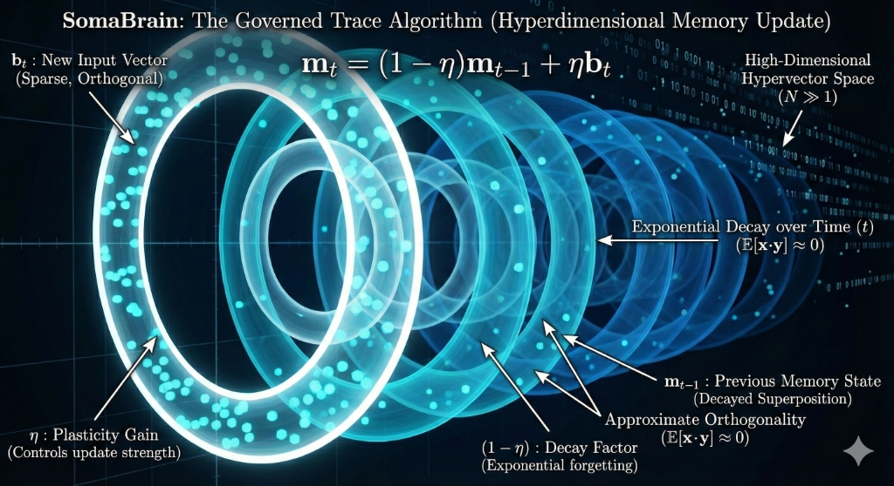

<div align="center">

# 🧠 SomaBrain

### *Hyperdimensional Cognitive Memory System for Autonomous AI Agents*

[](https://python.org)
[](https://djangoproject.com)
[](LICENSE)
[]()

<br/>



<br/>

**Persistent memory for AI agents that need to remember**

[Website](https://www.somatech.dev) · [Features](#-features) · [Architecture](#-architecture) · [Quick Start](#-quick-start) · [API](#-api-reference) · [Documentation](#-documentation)

</div>

---

## 🌌 The Governed Trace Algorithm

At the heart of SomaBrain lies a mathematically elegant memory update mechanism inspired by neuroscience:

<div align="center">

```math
\LARGE \mathbf{m}_t = (1 - \eta)\mathbf{m}_{t-1} + \eta\mathbf{b}_t
```

</div>

| Symbol | Name | Description |
|:------:|------|-------------|
| $\mathbf{m}_t$ | **Memory State** | Current high-dimensional superposition vector |
| $\mathbf{b}_t$ | **Input Vector** | New sparse, orthogonal memory trace |
| $\eta$ | **Plasticity Gain** | Controls update strength (learning rate) |
| $(1-\eta)$ | **Decay Factor** | Exponential forgetting mechanism |

**Key Properties:**

```math
\mathbb{E}[\mathbf{x} \cdot \mathbf{y}] \approx 0 \quad \text{(approximate orthogonality in } \mathbb{R}^N, N \gg 1\text{)}
```

This enables high-capacity associative memory with constant-time $O(1)$ retrieval.

📖 **[Read the full Mathematical Foundations →](docs/technical/mathematical-foundations.md)**

---

## ✨ Features

<table>
<tr>
<td width="50%">

### 🔮 Hyperdimensional Computing

- **8,192-dimensional HRR vectors** for holographic encoding
- **Sparse Distributed Representations** with 2% density
- **Quantum-inspired superposition** for parallel memory access
- **Constant-time O(1)** similarity search

</td>
<td width="50%">

### 🧬 Biologically-Inspired

- **Working Memory** with salience-based gating
- **Hippocampal consolidation** during sleep cycles
- **Neuromodulator simulation** (dopamine, serotonin)
- **Amygdala** for emotional valence tagging

</td>
</tr>
<tr>
<td>

### 📊 Adaptive Learning

- **Online plasticity** with automatic gain control
- **Catastrophic forgetting resistance**
- **Drift detection** and model recalibration
- **Reward-modulated learning**

</td>
<td>

### 🔐 Enterprise-Ready

- **Multi-tenant** cryptographic isolation
- **Audit logging** (GDPR, HIPAA compliant)
- **Rate limiting** and quota management
- **OPA policy enforcement**

</td>
</tr>
</table>

---

## 🏛️ Architecture

```
┌─────────────────────────────────────────────────────────────────────────────────┐
│                              SOMABRAIN COGNITIVE CORE                            │
├─────────────────────────────────────────────────────────────────────────────────┤
│                                                                                  │
│    ┌────────────────┐     ┌────────────────┐     ┌────────────────┐             │
│    │   PREFRONTAL   │────▶│   THALAMUS     │────▶│   AMYGDALA     │             │
│    │   (Planning)   │     │   (Gating)     │     │   (Valence)    │             │
│    └───────┬────────┘     └───────┬────────┘     └───────┬────────┘             │
│            │                      │                      │                       │
│            └──────────────────────┼──────────────────────┘                       │
│                                   ▼                                              │
│    ┌──────────────────────────────────────────────────────────────────────┐     │
│    │                        WORKING MEMORY                                 │     │
│    │   ┌─────────┐  ┌─────────┐  ┌─────────┐  ┌─────────┐  ┌─────────┐   │     │
│    │   │ Slot 1  │  │ Slot 2  │  │ Slot 3  │  │   ...   │  │ Slot N  │   │     │
│    │   │ s=0.92  │  │ s=0.85  │  │ s=0.71  │  │         │  │ s=0.43  │   │     │
│    │   └─────────┘  └─────────┘  └─────────┘  └─────────┘  └─────────┘   │     │
│    └──────────────────────────────┬───────────────────────────────────────┘     │
│                                   │                                              │
│                                   ▼                                              │
│    ┌──────────────────────────────────────────────────────────────────────┐     │
│    │                     HRR / SDR ENGINE                                  │     │
│    │                                                                       │     │
│    │   encode(x) → ℝ^8192    bind(a,b) → a ⊛ b    unbind(c,a) → b        │     │
│    │                                                                       │     │
│    └──────────────────────────────┬───────────────────────────────────────┘     │
│                                   │                                              │
│                                   ▼                                              │
│    ┌──────────────────────────────────────────────────────────────────────┐     │
│    │                      HIPPOCAMPUS                                      │     │
│    │                   (Long-term Storage)                                 │     │
│    │                                                                       │     │
│    │   📊 12M memories  │  🔍 Vector Index  │  📈 Consolidation Queue    │     │
│    │                                                                       │     │
│    └──────────────────────────────────────────────────────────────────────┘     │
│                                                                                  │
│    ┌──────────────┐   ┌──────────────┐   ┌──────────────┐   ┌──────────────┐   │
│    │  DOPAMINE    │   │  SEROTONIN   │   │ NOREPINEPH.  │   │ ACETYLCHOL.  │   │
│    │    0.48      │   │    0.52      │   │    0.12      │   │    0.31      │   │
│    └──────────────┘   └──────────────┘   └──────────────┘   └──────────────┘   │
│                          NEUROMODULATOR PANEL                                    │
└─────────────────────────────────────────────────────────────────────────────────┘
                                      │
                                      ▼
          ┌───────────────────────────┴───────────────────────────┐
          │                                                       │
    ┌─────▼─────┐              ┌─────▼─────┐              ┌───────▼───────┐
    │ PostgreSQL │              │   Milvus  │              │     Redis     │
    │   State    │              │  Vectors  │              │    Cache      │
    │    & ORM   │              │  (HNSW)   │              │   Sessions    │
    └───────────┘              └───────────┘              └───────────────┘
```

---

## 🚀 Quick Start

### Prerequisites

| Requirement | Version | Purpose |
|-------------|---------|---------|
| Python | 3.11+ | Runtime |
| PostgreSQL | 15+ | State storage |
| Redis | 7+ | Caching & sessions |
| Milvus | 2.3+ | Vector similarity |

### Installation

```bash
# Clone the repository
git clone https://github.com/somatechlat/somabrain.git
cd somabrain

# Create virtual environment
python -m venv .venv
source .venv/bin/activate  # Windows: .venv\Scripts\activate

# Install dependencies
pip install -r requirements.txt

# Configure environment
cp .env.example .env
# Edit .env with your credentials

# Initialize database
python manage.py migrate

# Start the cognitive engine
python manage.py runserver 9696
```

### 🐳 Docker Deployment

```bash
docker-compose up -d
```

```yaml
# docker-compose.yml
services:
  somabrain:
    image: somatechlat/somabrain:latest
    ports:
      - "9696:9696"
    environment:
      - SOMABRAIN_POSTGRES_DSN=postgresql://soma@postgres/somabrain
      - SOMABRAIN_REDIS_URL=redis://redis:6379/0
      - SOMABRAIN_MILVUS_HOST=milvus
```

---

## 📡 API Reference

### Store Memory

```bash
curl -X POST http://localhost:9696/api/v2/memory/store \
  -H "Content-Type: application/json" \
  -H "Authorization: Bearer $TOKEN" \
  -d '{
    "content": "The mitochondria is the powerhouse of the cell",
    "namespace": "biology",
    "importance": 0.9,
    "metadata": {
      "source": "textbook",
      "chapter": 3
    }
  }'
```

```json
{
  "id": "mem_7f3a9b2c",
  "embedding_id": "emb_8k4d2f1a",
  "salience": 0.87,
  "created_at": "2026-01-03T10:30:00Z"
}
```

### Recall Memory

```bash
curl -X POST http://localhost:9696/api/v2/memory/recall \
  -H "Content-Type: application/json" \
  -d '{
    "query": "What produces energy in cells?",
    "top_k": 5,
    "retrievers": ["vector", "wm", "graph", "lexical"],
    "namespace": "biology"
  }'
```

```json
{
  "memories": [
    {
      "id": "mem_7f3a9b2c",
      "content": "The mitochondria is the powerhouse of the cell",
      "score": 0.94,
      "retriever": "vector"
    }
  ],
  "latency_ms": 12
}
```

### Working Memory Status

```bash
curl http://localhost:9696/api/v2/memory/wm/status
```

```json
{
  "capacity": 64,
  "used": 47,
  "items": [
    {"id": "wm_1", "salience": 0.92, "age_seconds": 5},
    {"id": "wm_2", "salience": 0.85, "age_seconds": 12}
  ],
  "neuromodulators": {
    "dopamine": 0.48,
    "serotonin": 0.52,
    "norepinephrine": 0.12
  }
}
```

---

## 🧪 Core Modules

| Module | Description | Key Functions |
|--------|-------------|---------------|
| `wm.py` | Working memory with salience gating | `add()`, `evict()`, `recall()` |
| `hippocampus.py` | Long-term consolidation | `store()`, `retrieve()`, `consolidate()` |
| `amygdala.py` | Emotional valence tagging | `tag_valence()`, `modulate()` |
| `prefrontal.py` | Executive planning & control | `plan()`, `inhibit()`, `switch()` |
| `neuromodulators.py` | Dopamine, serotonin, norepinephrine | `update()`, `get_levels()` |
| `context_hrr.py` | Holographic Reduced Representations | `encode()`, `bind()`, `unbind()` |
| `sdr.py` | Sparse Distributed Representations | `encode()`, `overlap()` |
| `quantum.py` | Quantum-inspired superposition | `superpose()`, `collapse()` |
| `consolidation.py` | NREM/REM sleep consolidation | `nrem_cycle()`, `rem_cycle()` |
| `salience.py` | Importance scoring | `compute()`, `threshold()` |

---

## ⚙️ Configuration

SomaBrain supports **312 configuration options** via environment variables. Key settings:

| Setting | Default | Description |
|---------|---------|-------------|
| `SOMABRAIN_WM_SIZE` | 64 | Working memory capacity |
| `SOMABRAIN_HRR_DIM` | 8192 | Hypervector dimensions |
| `SOMABRAIN_SDR_BITS` | 2048 | SDR active bits |
| `SOMABRAIN_EMBED_DIM` | 256 | Embedding dimensions |
| `SOMABRAIN_ENABLE_SLEEP` | true | Enable consolidation cycles |
| `SOMABRAIN_NEURO_DOPAMINE_BASE` | 0.4 | Base dopamine level |
| `SOMABRAIN_RATE_RPS` | 1000 | Rate limit (req/sec) |

📖 **Full reference:** [`docs/srs/SRS-SOMABRAIN-SETTINGS.md`](docs/srs/SRS-SOMABRAIN-SETTINGS.md)

---

## 📚 Documentation

| Document | Description |
|----------|-------------|
| [Overview](docs/overview.md) | High-level system architecture |
| [API Reference](docs/api/) | Complete REST API documentation |
| [Settings SRS](docs/srs/SRS-SOMABRAIN-SETTINGS.md) | All 312 configuration options |
| [Deployment Guide](docs/deployment/) | Production deployment |
| [SOMA Covenant](docs/THE-SOMA-COVENANT.md) | Governance principles |

---

## 🔬 Research Foundations

SomaBrain synthesizes cutting-edge research from cognitive science and AI:

<table>
<tr>
<td>

**Holographic Memory**
- Plate, T.A. (2003). *Holographic Reduced Representations*
- Gayler, R.W. (2003). *Vector Symbolic Architectures*

**Sparse Coding**
- Kanerva, P. (1988). *Sparse Distributed Memory*
- Olshausen, B.A. (1996). *Sparse Coding in V1*

</td>
<td>

**Learning Systems**
- McClelland, J.L. (1995). *Complementary Learning Systems*
- O'Reilly, R.C. (2006). *Biologically Plausible Error-driven Learning*

**Predictive Coding**
- Clark, A. (2013). *Predictive Processing*
- Friston, K. (2010). *Free Energy Principle*

</td>
</tr>
</table>

---

## 🛡️ Security & Compliance

| Feature | Description |
|---------|-------------|
| 🔐 **JWT Authentication** | Configurable with Keycloak, Auth0, or custom |
| 🛡️ **OPA Policy Engine** | Fine-grained authorization |
| 🔒 **Vault Integration** | Secrets management |
| 📋 **Audit Logging** | Complete operation history |
| 🔏 **Provenance Tracking** | Cryptographic memory chain |
| 🚫 **PII Masking** | Automatic in logs |

**Compliance:** GDPR, HIPAA, SOC2-ready

---

## 🤝 SomaStack Ecosystem

| Project | Description | Link |
|---------|-------------|------|
| 🤖 **SomaAgent01** | Agent orchestration gateway | [GitHub](https://github.com/somatechlat/somaAgent01) |
| 💾 **SomaFractalMemory** | Distributed long-term storage | [GitHub](https://github.com/somatechlat/somafractalmemory) |
| 🌐 **SomaStack SaaS** | Admin dashboard UI | [Docs](webui/somastack-saas) |

---

## 📊 Performance Benchmarks

| Operation | Latency (p95) | Throughput |
|-----------|:-------------:|:----------:|
| Memory Store | 8ms | 12,000/sec |
| Vector Recall | 15ms | 5,000/sec |
| WM Update | 2ms | 50,000/sec |
| Consolidation Cycle | 30s | 10,000 memories |

*Benchmarked on 32-core, 128GB RAM, with Milvus on NVMe*

---

<div align="center">

## 📜 License

Licensed under the [Apache License, Version 2.0](LICENSE)

---

<br/>

**Built with 🧠 by the SomaTech team**

*"Teaching machines to remember, so they can truly understand."*

<br/>

[](https://github.com/somatechlat/somabrain)

</div>
