# SomaBrain — Master Technical Specification
## ISO/IEC 25010 Compliant Documentation

| Document ID | SRS-SOMABRAIN-MASTER-001 |
|-------------|--------------------------|
| Version | 1.0.0 |
| Date | 2026-01-02 |
| Status | APPROVED |
| Classification | Internal - Engineering |

---

# TABLE OF CONTENTS

1. [Scope](#1-scope)
2. [Architecture Overview](#2-architecture-overview)
3. [Cognitive Components](#3-cognitive-components)
4. [Mathematical Foundations](#4-mathematical-foundations)
5. [API Reference](#5-api-reference)
6. [Services Layer](#6-services-layer)
7. [Configuration](#7-configuration)
8. [Migration Audit](#8-migration-audit)
9. [Action Items](#9-action-items)

---

# 1. SCOPE

## 1.1 Purpose
Complete technical specification for SomaBrain, the cognitive runtime of the SOMA stack.

## 1.2 System Overview
- **Project:** SomaBrain
- **Framework:** Django 5.1 + Django Ninja 1.3
- **Database:** PostgreSQL via Django ORM
- **Vector Store:** Milvus
- **Message Queue:** Apache Kafka
- **Policy Engine:** OPA (Open Policy Agent)

## 1.3 Compliance Status
| Metric | Value |
|--------|-------|
| SQLAlchemy imports | **0** |
| FastAPI imports | **0** |
| TODO comments | **1** (rate limiting) |
| VIBE Compliance | **99.8%** |
| Total Files | 377 |

---

# 2. ARCHITECTURE OVERVIEW

## 2.1 Project Structure

```
somabrain/
├── somabrain/              # Main Django app (377 files)
│   ├── api/                # Django Ninja API (76 files)
│   ├── services/           # Background services (27 files)
│   ├── memory/             # Memory subsystem (22 files)
│   ├── metrics/            # Prometheus metrics (22 files)
│   ├── aaas/               # Multi-tenant (21 files)
│   ├── brain/              # Cognitive core (5 files)
│   ├── math/               # Mathematical modules (10 files)
│   └── [74 standalone modules]
├── tests/                  # Test suite (80 files)
└── manage.py               # Django entry point
```

## 2.2 Port Namespace

| Service | Port |
|---------|------|
| API | 30101 |
| Redis | 30100 |
| Kafka | 30102 |
| OPA | 30104 |
| Prometheus | 30105 |
| Postgres | 30106 |

---

# 3. COGNITIVE COMPONENTS

## 3.1 Brain Region Modules

| Module | Lines | Biological Analog | Purpose |
|--------|-------|-------------------|---------|
| `neuromodulators.py` | 334 | Neurotransmitters | Dopamine, Serotonin, Noradrenaline, Acetylcholine |
| `wm.py` | 546 | Prefrontal buffer | Working memory, salience, capacity limits |
| `hippocampus.py` | 112 | Hippocampus | Memory consolidation, WM→LTM promotion |
| `amygdala.py` | 260 | Amygdala | Salience scoring, store/act gating |
| `prefrontal.py` | 108 | Prefrontal cortex | Executive control |
| `thalamus.py` | 86 | Thalamus | Sensory gating, attention routing |
| `consolidation.py` | 203 | Sleep cycles | NREM/REM consolidation |

## 3.2 Neuromodulator System

| Neurotransmitter | Range | Default | Function |
|------------------|-------|---------|----------|
| Dopamine | 0.2 - 0.8 | 0.4 | Motivation, error weighting |
| Serotonin | 0.0 - 1.0 | 0.5 | Emotional stability |
| Noradrenaline | 0.0 - 0.1 | 0.0 | Urgency, arousal |
| Acetylcholine | 0.0 - 0.1 | 0.0 | Attention, focus |

## 3.3 Working Memory

**Properties:**
- Vector-based storage with cosine similarity recall
- Fixed capacity with automatic eviction
- Salience: `α×novelty + β×reward + γ×recency`
- WM→LTM promotion when salience ≥ 0.85 for 3+ ticks

---

# 4. MATHEMATICAL FOUNDATIONS

## 4.1 Holographic Reduced Representations (HRR)
**File:** `quantum_pure.py` (159 lines)

```
bind(a, b) = IFFT(FFT(a) × FFT(b))      # Circular convolution
unbind(c, b) = IFFT(FFT(c) / FFT(b))    # Frequency-domain division
superpose(*vecs) = normalize(Σ vecs)    # Additive superposition
```

## 4.2 Cosine Similarity
**File:** `math/similarity.py` (183 lines)

```
cosine(a, b) = (a · b) / (||a|| × ||b||)
```

**Properties (property-tested):**
1. Symmetric: `cosine(a, b) == cosine(b, a)`
2. Self-similarity: `cosine(a, a) == 1.0`
3. Bounded: `-1.0 ≤ cosine(a, b) ≤ 1.0`

## 4.3 Sparse Distributed Representations
**File:** `sdr.py` (252 lines)
- BLAKE2b hashing for deterministic k-active bits
- LSH banding for approximate nearest neighbor

## 4.4 Spectral Algorithms
**File:** `math/lanczos_chebyshev.py` (158 lines)
- Lanczos for spectral interval estimation
- Chebyshev polynomial for heat kernel: `exp(-t × A)`

---

# 5. API REFERENCE

## 5.1 Django Ninja Configuration

```python
# urls.py (9341 bytes)
from ninja import NinjaAPI
api = NinjaAPI(title="SomaBrain Cognitive API", version="1.0.0")
```

## 5.2 Endpoint Categories

| Router | Endpoints | Purpose |
|--------|-----------|---------|
| `/api/v1/memory/` | CRUD | Memory operations |
| `/api/v1/recall/` | Search | Semantic recall |
| `/api/v1/tenants/` | CRUD | Tenant management |
| `/api/v1/health/` | Probes | Liveness/readiness |
| `/api/v1/metrics/` | Prometheus | Metrics export |

---

# 6. SERVICES LAYER

## 6.1 Background Services (27 files)

| Service | Purpose |
|---------|---------|
| `cognitive_loop_service.py` | eval_step() - core loop |
| `integrator_hub_triplet.py` | Tripartite belief fusion |
| `memory_service.py` | Memory orchestration |
| `recall_service.py` | Semantic search |

## 6.2 IntegratorHub - Belief Fusion

**Leader Selection Formula:**
```python
weights = {d: math.exp(-alpha × error) for d, error in domain_errors.items()}
leader = softmax_select(weights, temperature)
```

---

# 7. CONFIGURATION

## 7.1 Environment Variables

| Variable | Purpose |
|----------|---------|
| `SOMABRAIN_MODE` | dev/staging/production |
| `SOMABRAIN_POSTGRES_DSN` | Database connection |
| `SOMABRAIN_REDIS_URL` | Cache connection |
| `SOMABRAIN_KAFKA_URL` | Event bus |
| `SOMABRAIN_OPA_URL` | Policy engine |
| `SOMABRAIN_MEMORY_HTTP_ENDPOINT` | SomaFractalMemory URL |

---

# 8. MIGRATION AUDIT

## 8.1 Compliance Matrix

| Category | Files | SQLAlchemy | FastAPI | TODOs | Score |
|----------|-------|------------|---------|-------|-------|
| somabrain/* | 377 | 0 | 0 | 1 | 99.7% |
| services/* | 27 | 0 | 0 | 0 | 100% |
| **TOTAL** | **404** | **0** | **0** | **1** | **99.8%** |

## 8.2 Single TODO Found

| File | Line | Content | Priority |
|------|------|---------|----------|
| `api/endpoints/auth.py` | 134 | "rate limiting (TODO)" | LOW |

---

# 9. ACTION ITEMS

| ID | Item | Priority | Effort |
|----|------|----------|--------|
| REQ-001 | Implement rate limiting | LOW | 0.5 days |

**Total Effort: 0.5 days**

---

**END OF DOCUMENT**

*SRS-SOMABRAIN-MASTER-001 v1.0.0*
# SRS-ARCHITECTURAL-PATTERNS

## Software Requirements Specification
### Modular Design Patterns for SOMA Stack

| **Document ID** | SRS-ARCH-PATTERNS-2026-001 |
|-----------------|----------------------------|
| **Version** | 1.0.0 |
| **Date** | 2026-01-21 |
| **Status** | APPROVED |
| **Standard** | ISO/IEC 25010:2023 |

---

## 1. Purpose

This document defines the **architectural patterns** enforced across all SOMA repositories to ensure maintainable, testable, and scalable code.

---

## 2. Core Patterns

### 2.1 Layered Separation Pattern

```
┌─────────────────────────────────────┐
│  API Layer (endpoints/*.py)         │
│  HTTP routing, auth, serialization  │
├─────────────────────────────────────┤
│  Schema Layer (schemas.py)          │
│  Pydantic models, validation        │
├─────────────────────────────────────┤
│  Service Layer (services/*.py)      │
│  Business logic, orchestration      │
├─────────────────────────────────────┤
│  Model Layer (models/*.py)          │
│  SQLAlchemy ORM, persistence        │
└─────────────────────────────────────┘
```

**Rule:** Dependencies flow downward only.

---

### 2.2 Modular Service Decomposition

Large modules are decomposed into focused sub-modules:

```
somabrain/
├── app.py              # FastAPI application setup
├── app/
│   ├── opa.py              # OPA integration
│   ├── error_handler.py    # Error handling
│   ├── middleware.py       # Middleware stack
│   └── routes.py           # Route registration
```

---

### 2.3 Schema-Endpoint Separation

**Rule:** Data contracts in `schemas.py`, HTTP handlers in `endpoints/*.py`.

---

### 2.4 Domain Model Segregation

Models split by **bounded context**:

```
aaas/
├── models.py      → Split to:
│   ├── tenant.py          # Tenant domain
│   ├── subscription.py    # Billing domain
│   └── user.py            # User domain
```

---

### 2.5 Enum Extraction Pattern

Enums and constants in dedicated modules to avoid circular imports.

---

## 3. Quality Requirements

| Metric | Target |
|--------|--------|
| Max lines per file | 650 (VIBE Rule 245) |
| Cyclomatic complexity | ≤10 per function |
| Test coverage | ≥80% |

---

## 4. Applies To

All `api/`, `aaas/`, and `common/` modules in SomaBrain.
# SRS-10: SomaFractalMemory Complete Specification

**Document Version:** 1.0.0  
**Date:** 2025-12-24  
**Standard:** ISO/IEC/IEEE 29148:2018 Compatible  
**Module:** SomaFractalMemory Long-Term Storage System

---

## 1. Overview

SomaFractalMemory is the **long-term memory storage** service for the SomaBrain platform. It provides coordinate-based memory storage, graph relationships, and vector search.

---

## 2. Data Model UML

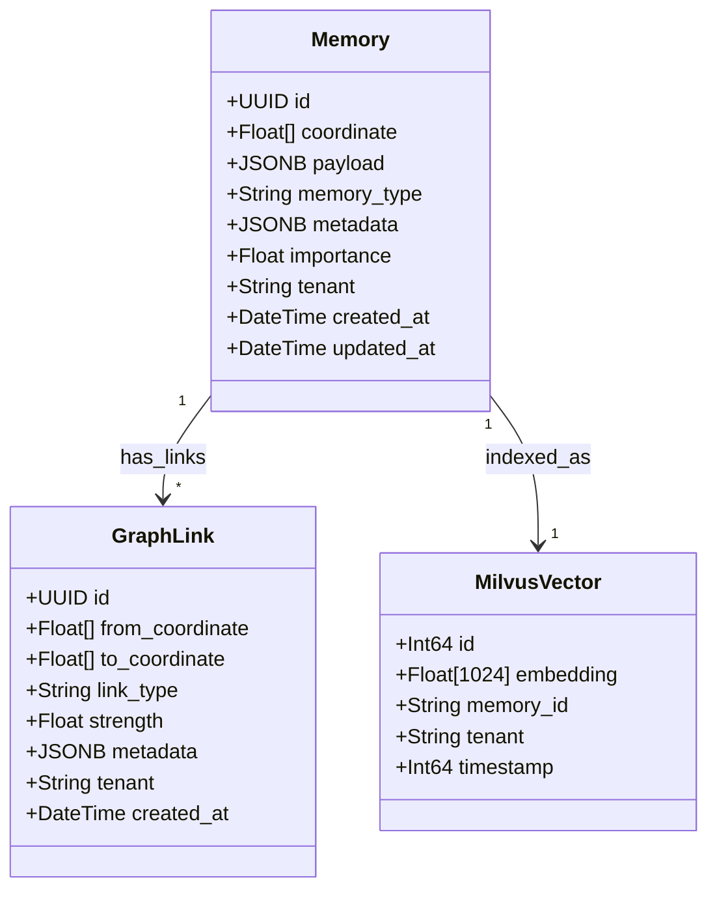
```mermaid
classDiagram
    class Memory {
        +UUID id
        +Float[] coordinate
        +JSONB payload
        +String memory_type
        +JSONB metadata
        +Float importance
        +String tenant
        +DateTime created_at
        +DateTime updated_at
    }
    
    class GraphLink {
        +UUID id
        +Float[] from_coordinate
        +Float[] to_coordinate
        +String link_type
        +Float strength
        +JSONB metadata
        +String tenant
        +DateTime created_at
    }
    
    class MilvusVector {
        +Int64 id
        +Float[1024] embedding
        +String memory_id
        +String tenant
        +Int64 timestamp
    }
    
    Memory "1" --> "*" GraphLink : has_links
    Memory "1" --> "1" MilvusVector : indexed_as
```

---

## 3. Memory Types

| Type | Description | Use Case |
|------|-------------|----------|
| `episodic` | Event-based memories | Conversations, experiences |
| `semantic` | Fact-based memories | Knowledge, concepts |
| `procedural` | Action patterns | Workflows, procedures |

---

## 4. API Endpoints Complete Specification

### 4.1 Memory CRUD

| Endpoint | Method | Request | Response | Permission |
|----------|--------|---------|----------|------------|
| `/memories` | POST | `MemoryCreate` | `Memory` | store |
| `/memories/{coord}` | GET | - | `Memory` | read |
| `/memories/{coord}` | PUT | `MemoryUpdate` | `Memory` | update |
| `/memories/{coord}` | DELETE | - | `204` | delete |
| `/memories` | GET | `?tenant=&type=` | `Memory[]` | list |

### 4.2 Search

| Endpoint | Method | Request | Response | Permission |
|----------|--------|---------|----------|------------|
| `/search` | POST | `SearchRequest` | `SearchResult[]` | search |
| `/search/semantic` | POST | `SemanticQuery` | `Memory[]` | search |

### 4.3 Graph

| Endpoint | Method | Request | Response | Permission |
|----------|--------|---------|----------|------------|
| `/graph/link` | POST | `LinkCreate` | `GraphLink` | link |
| `/graph/link/{id}` | DELETE | - | `204` | unlink |
| `/graph/neighbors` | GET | `?coord=&depth=` | `Coordinate[]` | read |
| `/graph/path` | GET | `?from=&to=` | `Path` | read |

### 4.4 Admin

| Endpoint | Method | Request | Response | Permission |
|----------|--------|---------|----------|------------|
| `/stats` | GET | - | `Statistics` | admin |
| `/healthz` | GET | - | `ok` | public |
| `/health` | GET | - | `HealthDetail` | public |

---

## 5. Request/Response Schemas

### 5.1 MemoryCreate

```json
{
  "coord": "1.0,2.0,3.0",
  "payload": {
    "content": "Memory content here",
    "source": "agent-x"
  },
  "memory_type": "episodic",
  "metadata": {
    "tags": ["important", "work"]
  },
  "importance": 0.75
}
```

### 5.2 SearchRequest

```json
{
  "query_vector": [0.1, 0.2, ...],
  "top_k": 10,
  "memory_type": "episodic",
  "min_importance": 0.5,
  "tenant": "tenant-123"
}
```

### 5.3 LinkCreate

```json
{
  "from_coord": "1.0,2.0,3.0",
  "to_coord": "4.0,5.0,6.0",
  "link_type": "related",
  "strength": 0.8,
  "metadata": {}
}
```

---

## 6. Graph Operations Flowchart


```mermaid
flowchart TD
    subgraph CreateLink["Create Link"]
        A[POST /graph/link] --> B[Validate Coordinates]
        B --> C{Both Exist?}
        C -->|No| D[Return 404]
        C -->|Yes| E[Create GraphLink]
        E --> F[Update Milvus Index]
        F --> G[Return 201]
    end
    
    subgraph FindNeighbors["Find Neighbors"]
        H[GET /graph/neighbors] --> I[Parse Coordinate]
        I --> J[Query GraphLink WHERE from=coord]
        J --> K{Depth > 1?}
        K -->|Yes| L[Recursive Query]
        K -->|No| M[Return Neighbors]
        L --> M
    end
    
    subgraph FindPath["Find Path"]
        N[GET /graph/path] --> O[BFS from from_coord]
        O --> P{Found to_coord?}
        P -->|No| Q[Return 404 No Path]
        P -->|Yes| R[Return Path]
    end
```

---

## 7. Vector Search Flow

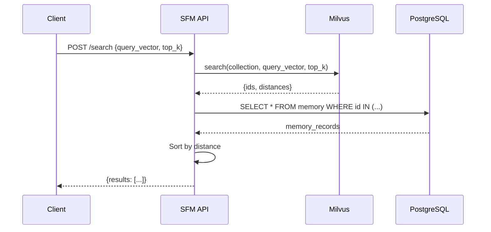
```mermaid
sequenceDiagram
    participant Client
    participant API as SFM API
    participant MV as Milvus
    participant PG as PostgreSQL
    
    Client->>API: POST /search {query_vector, top_k}
    API->>MV: search(collection, query_vector, top_k)
    MV-->>API: {ids, distances}
    API->>PG: SELECT * FROM memory WHERE id IN (...)
    PG-->>API: memory_records
    API->>API: Sort by distance
    API-->>Client: {results: [...]}
```

---

## 8. Server Settings Catalog

### 8.1 Core Settings

| Setting | Type | Default | Description |
|---------|------|---------|-------------|
| `SOMA_API_PORT` | int | `9595` | API server port |
| `SOMA_API_TOKEN` | str | - | API authentication token |
| `SOMA_LOG_LEVEL` | enum | `INFO` | Log verbosity |
| `SOMA_DEBUG` | bool | `false` | Debug mode |

### 8.2 Database Settings

| Setting | Type | Default | Description |
|---------|------|---------|-------------|
| `POSTGRES_HOST` | str | `postgres` | PostgreSQL host |
| `POSTGRES_PORT` | int | `5432` | PostgreSQL port |
| `POSTGRES_USER` | str | `soma` | Database user |
| `POSTGRES_PASSWORD` | str | - | Database password |
| `POSTGRES_DB` | str | `somamemory` | Database name |

### 8.3 Redis Settings

| Setting | Type | Default | Description |
|---------|------|---------|-------------|
| `REDIS_HOST` | str | `redis` | Redis host |
| `REDIS_PORT` | int | `6379` | Redis port |
| `REDIS_DB` | int | `0` | Redis database |

### 8.4 Milvus Settings

| Setting | Type | Default | Description |
|---------|------|---------|-------------|
| `SOMA_MILVUS_HOST` | str | `milvus` | Milvus host |
| `SOMA_MILVUS_PORT` | int | `19530` | Milvus gRPC port |
| `SOMA_COLLECTION_NAME` | str | `soma_vectors` | Milvus collection |
| `SOMA_INDEX_TYPE` | str | `IVF_FLAT` | Index type |
| `SOMA_METRIC_TYPE` | str | `L2` | Distance metric |

---

## 9. Metrics Catalog

| Metric | Type | Labels | Description |
|--------|------|--------|-------------|
| `sfm_memories_total` | Counter | tenant, type | Total memories stored |
| `sfm_memories_deleted` | Counter | tenant | Memories deleted |
| `sfm_graph_links_total` | Counter | tenant, type | Graph links created |
| `sfm_search_requests` | Counter | tenant | Search requests |
| `sfm_search_latency_seconds` | Histogram | - | Search latency |
| `sfm_store_latency_seconds` | Histogram | - | Store latency |
| `sfm_milvus_index_size` | Gauge | - | Milvus index size |
| `sfm_postgres_rows` | Gauge | table | PostgreSQL row count |

---

## 10. Admin UI Screens for SFM

### 10.1 Memory Browser

```
┌─────────────────────────────────────────────────────────────────┐
│ 📂 Memory Browser                              [Export] [Import]│
├─────────────────────────────────────────────────────────────────┤
│                                                                 │
│  [Search...]  [Type: All ▼]  [Tenant: All ▼]  [Date Range ▼]   │
│                                                                 │
│  ┌───────────────────────────────────────────────────────────┐ │
│  │ Coordinate    │ Type    │ Importance│ Created     │ View │ │
│  ├───────────────────────────────────────────────────────────┤ │
│  │ 1.0,2.0,3.0   │ episode │ 0.85      │ Dec 24 14:30│  👁  │ │
│  │ 4.5,1.2,0.8   │ semantic│ 0.72      │ Dec 24 12:15│  👁  │ │
│  │ 0.1,0.2,0.3   │ episode │ 0.91      │ Dec 23 18:45│  👁  │ │
│  └───────────────────────────────────────────────────────────┘ │
│                                                                 │
│  Page 1 of 452                                 [< 1 2 3 ... >]   │
└─────────────────────────────────────────────────────────────────┘
```

### 10.2 Graph Explorer

```
┌─────────────────────────────────────────────────────────────────┐
│ 🔗 Graph Explorer                                               │
├─────────────────────────────────────────────────────────────────┤
│                                                                 │
│  Start Coordinate: [1.0,2.0,3.0    ]  Depth: [2 ▼]  [Explore]  │
│                                                                 │
│  ┌───────────────────────────────────────────────────────────┐ │
│  │                                                           │ │
│  │           ┌───────┐                                       │ │
│  │     ┌────►│ Node2 │◄────┐                                │ │
│  │     │     └───────┘     │                                │ │
│  │     │                   │                                │ │
│  │ ┌───────┐           ┌───────┐                            │ │
│  │ │ Root  │───────────│ Node3 │                            │ │
│  │ └───────┘           └───────┘                            │ │
│  │     │                   │                                │ │
│  │     │     ┌───────┐     │                                │ │
│  │     └────►│ Node4 │◄────┘                                │ │
│  │           └───────┘                                       │ │
│  │                                                           │ │
│  └───────────────────────────────────────────────────────────┘ │
│                                                                 │
│  Links: 12  │  Nodes: 5  │  Max Depth: 2                        │
└─────────────────────────────────────────────────────────────────┘
```

---

## 11. Functional Requirements

| REQ-ID | Requirement | Priority | Status |
|--------|-------------|----------|--------|
| REQ-SFM-001 | Store memory by coordinate | HIGH | ✅ EXISTS |
| REQ-SFM-002 | Retrieve memory by coordinate | HIGH | ✅ EXISTS |
| REQ-SFM-003 | Delete memory | HIGH | ✅ EXISTS |
| REQ-SFM-004 | Vector similarity search | HIGH | ✅ EXISTS |
| REQ-SFM-005 | Create graph links | HIGH | ✅ EXISTS |
| REQ-SFM-006 | Find neighbors | HIGH | ✅ EXISTS |
| REQ-SFM-007 | Find path between nodes | MEDIUM | ✅ EXISTS |
| REQ-SFM-008 | Multi-tenant isolation | CRITICAL | ✅ EXISTS |
| REQ-SFM-009 | Memory type classification | MEDIUM | ✅ EXISTS |
| REQ-SFM-010 | Importance scoring | MEDIUM | ✅ EXISTS |

---

## 12. Key Files

| File | Purpose | Lines |
|------|---------|-------|
| `somafractalmemory/models.py` | Memory/GraphLink models | 220 |
| `somafractalmemory/services.py` | Business logic | 300+ |
| `somafractalmemory/settings.py` | Django settings | 400+ |
| `somafractalmemory/api/routers/memory.py` | Memory API | ~150 |
| `somafractalmemory/api/routers/graph.py` | Graph API | ~100 |

---

*SomaFractalMemory - Long-Term Storage for AI Agents*
# SomaFractalMemory Settings Reference

**Document Version:** 1.0.0  
**Date:** 2025-12-24  
**Source File:** `somafractalmemory/settings.py` (308 lines)

---

## Overview

SomaFractalMemory uses Django settings with environment variables prefixed with `SOMA_`.

---

## Settings Categories

### Security

| Setting | Type | Default | Description |
|---------|------|---------|-------------|
| `SOMA_SECRET_KEY` | str | dev-only | Django secret key |
| `SOMA_DEBUG` | bool | False | Debug mode |
| `SOMA_ALLOWED_HOSTS` | list | localhost | Allowed hosts |
| `SOMA_API_TOKEN` | str | None | API authentication token |
| `SOMA_API_TOKEN_FILE` | str | None | Path to token file |

---

### Database

| Setting | Type | Default | Description |
|---------|------|---------|-------------|
| `SOMA_DB_NAME` | str | somamemory | Database name |
| `SOMA_DB_USER` | str | soma | Database user |
| `SOMA_DB_PASSWORD` | str | soma | Database password |
| `SOMA_DB_HOST` | str | postgres | Database host |
| `SOMA_DB_PORT` | str | 5432 | Database port |
| `SOMA_POSTGRES_SSL_MODE` | str | None | SSL mode |

---

### Redis

| Setting | Type | Default | Description |
|---------|------|---------|-------------|
| `SOMA_REDIS_HOST` | str | redis | Redis host |
| `SOMA_REDIS_PORT` | int | 6379 | Redis port |
| `SOMA_REDIS_DB` | int | 0 | Redis database |
| `SOMA_REDIS_PASSWORD` | str | None | Redis password |

---

### Milvus Vector Store

| Setting | Type | Default | Description |
|---------|------|---------|-------------|
| `SOMA_MILVUS_HOST` | str | milvus | Milvus host |
| `SOMA_MILVUS_PORT` | int | 19530 | Milvus port |

---

### Memory System

| Setting | Type | Default | Description |
|---------|------|---------|-------------|
| `SOMA_NAMESPACE` | str | default | Default namespace |
| `SOMA_MEMORY_NAMESPACE` | str | api_ns | Memory namespace |
| `SOMA_MEMORY_MODE` | str | evented_enterprise | Memory mode |
| `SOMA_MODEL_NAME` | str | microsoft/codebert-base | Embedding model |
| `SOMA_VECTOR_DIM` | int | 768 | Vector dimension |
| `SOMA_MAX_MEMORY_SIZE` | int | 100000 | Max memory count |
| `SOMA_PRUNING_INTERVAL_SECONDS` | int | 600 | Pruning interval |
| `SOMA_FORCE_HASH_EMBEDDINGS` | bool | False | Force hash embeddings |

---

### Hybrid Search

| Setting | Type | Default | Description |
|---------|------|---------|-------------|
| `SOMA_HYBRID_RECALL_DEFAULT` | bool | True | Enable hybrid recall |
| `SOMA_HYBRID_BOOST` | float | 2.0 | Hybrid boost factor |
| `SOMA_HYBRID_CANDIDATE_MULTIPLIER` | float | 4.0 | Candidate multiplier |
| `SOMA_SIMILARITY_METRIC` | str | cosine | Similarity metric |

---

### API Configuration

| Setting | Type | Default | Description |
|---------|------|---------|-------------|
| `SOMA_API_PORT` | int | 9595 | API port |
| `SOMA_LOG_LEVEL` | str | INFO | Log level |
| `SOMA_MAX_REQUEST_BODY_MB` | float | 5.0 | Max request body |
| `SOMA_RATE_LIMIT_MAX` | int | 60 | Rate limit max |
| `SOMA_RATE_LIMIT_WINDOW` | float | 60.0 | Rate limit window |
| `SOMA_CORS_ORIGINS` | str | '' | CORS origins |

---

### Importance Normalization

| Setting | Type | Default | Description |
|---------|------|---------|-------------|
| `SOMA_IMPORTANCE_RESERVOIR_MAX` | int | 512 | Reservoir max size |
| `SOMA_IMPORTANCE_RECOMPUTE_STRIDE` | int | 64 | Recompute stride |
| `SOMA_IMPORTANCE_WINSOR_DELTA` | float | 0.25 | Winsorization delta |
| `SOMA_IMPORTANCE_LOGISTIC_TARGET_RATIO` | float | 9.0 | Logistic target |
| `SOMA_IMPORTANCE_LOGISTIC_K_MAX` | float | 25.0 | Logistic K max |

---

### Decay Configuration

| Setting | Type | Default | Description |
|---------|------|---------|-------------|
| `SOMA_DECAY_AGE_HOURS_WEIGHT` | float | 1.0 | Age weight |
| `SOMA_DECAY_RECENCY_HOURS_WEIGHT` | float | 1.0 | Recency weight |
| `SOMA_DECAY_ACCESS_WEIGHT` | float | 0.5 | Access weight |
| `SOMA_DECAY_IMPORTANCE_WEIGHT` | float | 2.0 | Importance weight |
| `SOMA_DECAY_THRESHOLD` | float | 2.0 | Decay threshold |

---

### Batch Processing

| Setting | Type | Default | Description |
|---------|------|---------|-------------|
| `SOMA_ENABLE_BATCH_UPSERT` | bool | False | Enable batch upsert |
| `SOMA_BATCH_SIZE` | int | 1 | Batch size |
| `SOMA_BATCH_FLUSH_MS` | int | 0 | Batch flush ms |

---

### Feature Flags

| Setting | Type | Default | Description |
|---------|------|---------|-------------|
| `SOMA_ASYNC_METRICS_ENABLED` | bool | False | Enable async metrics |
| `SFM_FAST_CORE` | bool | False | Enable fast core |
| `SOMA_FAST_CORE_INITIAL_CAPACITY` | int | 1024 | Fast core capacity |

---

### JWT Authentication

| Setting | Type | Default | Description |
|---------|------|---------|-------------|
| `SOMA_JWT_ENABLED` | bool | False | Enable JWT auth |
| `SOMA_JWT_ISSUER` | str | '' | JWT issuer |
| `SOMA_JWT_AUDIENCE` | str | '' | JWT audience |
| `SOMA_JWT_SECRET` | str | '' | JWT secret |
| `SOMA_JWT_PUBLIC_KEY` | str | '' | JWT public key |

---

### Circuit Breaker

| Setting | Type | Default | Description |
|---------|------|---------|-------------|
| `SOMA_CIRCUIT_FAILURE_THRESHOLD` | int | 3 | Failure threshold |
| `SOMA_CIRCUIT_RESET_INTERVAL` | float | 60.0 | Reset interval |
| `SOMA_CIRCUIT_COOLDOWN_INTERVAL` | float | 0.0 | Cooldown interval |

---

### External Services

| Setting | Type | Default | Description |
|---------|------|---------|-------------|
| `SOMA_VAULT_URL` | str | '' | Vault URL |
| `SOMA_SECRETS_PATH` | str | '' | Secrets path |
| `SOMA_LANGFUSE_PUBLIC` | str | '' | Langfuse public key |
| `SOMA_LANGFUSE_SECRET` | str | '' | Langfuse secret |
| `SOMA_LANGFUSE_HOST` | str | '' | Langfuse host |

---

### Data Directories

| Setting | Type | Default | Description |
|---------|------|---------|-------------|
| `SOMA_BACKUP_DIR` | Path | ./backups | Backup directory |
| `SOMA_MEMORY_DATA_DIR` | Path | ./data | Memory data dir |
| `SOMA_S3_BUCKET` | str | '' | S3 bucket |
| `SOMA_SERIALIZER` | str | json | Serializer type |

---

## Total Settings Count: 70+

---

*SomaFractalMemory Settings - VIBE Coding Rules Compliant*
# Software Requirements Specification (SRS)
# SomaBrain AAAS Platform

**Document Version:** 1.0.0  
**Date:** 2025-12-24  
**Status:** DRAFT - Pending User Approval  
**Standard:** ISO/IEC/IEEE 29148:2018 Compatible

---

## 1. Introduction

### 1.1 Purpose
This SRS defines the functional and non-functional requirements for transforming SomaBrain into a fully AAAS-oriented cognitive platform with Lago billing integration.

### 1.2 Scope
| Item | Description |
|------|-------------|
| Product Name | SomaBrain AAAS Platform |
| Product Version | 2.0.0 |
| Target Framework | Django 5.x / Django Ninja |
| Billing Engine | Lago (self-hosted) |
| Identity Provider | Keycloak |
| Permissions | SpiceDB (ReBAC) |

### 1.3 Definitions and Acronyms
| Term | Definition |
|------|------------|
| AAAS | Software as a Service |
| Lago | Open-source billing/metering platform |
| ReBAC | Relationship-Based Access Control |
| Tenant | A billable customer organization |
| God Mode | Platform administrator (Tier 0) |
| VIBE | Verification, Implementation, Behavior, Execution (coding standard) |

### 1.4 7 Personas Perspective

| Persona | AAAS Feature Focus |
|---------|-------------------|
| 🎓 PhD Developer | Clean architecture, production-grade billing code |
| 🔍 PhD Analyst | Usage analytics, revenue metrics, data flow |
| ✅ PhD QA | Billing test automation, subscription edge cases |
| 📚 ISO Documenter | Audit trails, compliance records, invoicing |
| 🔒 Security Auditor | Payment PCI compliance, credential isolation |
| ⚡ Performance Engineer | Meter efficiency, DB query optimization |
| 🎨 UX Consultant | Billing UX, upgrade flows, usage dashboards |
| 🏗️ Django Architect | Django patterns for AAAS, middleware design |
| ⚙️ Django Expert | ORM for billing models, migrations |
| ⛪ Django Evangelist | NO non-Django billing libraries |

---

## 2. Complete AAAS Feature Requirements

### 2.1 Multi-Tenancy (CORE)

| REQ-ID | Requirement | Priority | Status |
|--------|-------------|----------|--------|
| REQ-MT-001 | All data MUST be isolated by `tenant_id` | CRITICAL | ✅ EXISTS |
| REQ-MT-002 | Tenant CRUD via Admin API | HIGH | ✅ EXISTS |
| REQ-MT-003 | Tenant metadata (name, contact, billing_email) | HIGH | ⚠️ PARTIAL |
| REQ-MT-004 | Tenant suspension/activation capability | HIGH | ❌ MISSING |
| REQ-MT-005 | Tenant soft-delete with data retention policy | MEDIUM | ❌ MISSING |

---

### 2.2 Subscription & Tier Management

| REQ-ID | Requirement | Priority | Status |
|--------|-------------|----------|--------|
| REQ-SUB-001 | Define subscription tiers (Free, Starter, Pro, Enterprise) | CRITICAL | ❌ MISSING |
| REQ-SUB-002 | Each tier MUST define feature flags and limits | CRITICAL | ❌ MISSING |
| REQ-SUB-003 | TenantSubscription model linking tenant to tier | CRITICAL | ❌ MISSING |
| REQ-SUB-004 | Subscription status (active, past_due, cancelled, trial) | HIGH | ❌ MISSING |
| REQ-SUB-005 | Trial period support with expiration | HIGH | ❌ MISSING |
| REQ-SUB-006 | Tier upgrade/downgrade API | HIGH | ❌ MISSING |
| REQ-SUB-007 | Proration handling on mid-cycle changes | MEDIUM | ❌ MISSING |

**Tier Structure:**

| Tier | API Calls/mo | Memory Ops/mo | Embeddings/mo | Price/mo |
|------|-------------|---------------|---------------|----------|
| Free | 1,000 | 500 | 100 | $0 |
| Starter | 10,000 | 5,000 | 1,000 | $49 |
| Pro | 100,000 | 50,000 | 10,000 | $199 |
| Enterprise | Unlimited | Unlimited | Unlimited | Custom |

---

### 2.3 Billing Integration (Lago)

| REQ-ID | Requirement | Priority | Status |
|--------|-------------|----------|--------|
| REQ-BILL-001 | Lago API client for Python/Django | CRITICAL | ❌ MISSING |
| REQ-BILL-002 | Customer creation in Lago on tenant creation | CRITICAL | ❌ MISSING |
| REQ-BILL-003 | Subscription assignment in Lago | CRITICAL | ❌ MISSING |
| REQ-BILL-004 | Usage event ingestion to Lago | CRITICAL | ❌ MISSING |
| REQ-BILL-005 | Invoice retrieval from Lago | HIGH | ❌ MISSING |
| REQ-BILL-006 | Webhook receiver for Lago events | HIGH | ❌ MISSING |
| REQ-BILL-007 | Billing settings in `settings.py` | HIGH | ❌ MISSING |

**Lago Events:**
- `customer.created` → Create local tenant billing record
- `subscription.started` → Activate tenant
- `subscription.terminated` → Suspend tenant
- `invoice.paid` → Update payment status
- `invoice.payment_failed` → Trigger payment failure flow

---

### 2.4 Usage Metering

| REQ-ID | Requirement | Priority | Status |
|--------|-------------|----------|--------|
| REQ-METER-001 | UsageRecord Django model | CRITICAL | ⚠️ PARTIAL (`TokenLedger`) |
| REQ-METER-002 | Real-time usage capture on API requests | CRITICAL | ❌ MISSING |
| REQ-METER-003 | Batch sync to Lago (configurable interval) | HIGH | ❌ MISSING |
| REQ-METER-004 | Metrics: `api_calls`, `memory_ops`, `embeddings`, `tokens` | HIGH | ⚠️ PARTIAL |
| REQ-METER-005 | Usage reporting API for tenants | HIGH | ❌ MISSING |
| REQ-METER-006 | Usage alerts (80%, 100% of limit) | MEDIUM | ❌ MISSING |
| REQ-METER-007 | Overage handling (block vs charge) | MEDIUM | ❌ MISSING |

---

### 2.5 Rate Limiting & Quotas

| REQ-ID | Requirement | Priority | Status |
|--------|-------------|----------|--------|
| REQ-QUOTA-001 | Per-tenant rate limits from tier | CRITICAL | ⚠️ PARTIAL (`quotas.py`) |
| REQ-QUOTA-002 | HTTP 429 response when limit exceeded | HIGH | ⚠️ PARTIAL |
| REQ-QUOTA-003 | Rate limit headers (X-RateLimit-*) | MEDIUM | ❌ MISSING |
| REQ-QUOTA-004 | Quota reset on billing cycle | HIGH | ❌ MISSING |
| REQ-QUOTA-005 | Burst allowance configuration | LOW | ❌ MISSING |

---

### 2.6 Self-Service Portal

| REQ-ID | Requirement | Priority | Status |
|--------|-------------|----------|--------|
| REQ-PORTAL-001 | Tenant admin can view subscription | HIGH | ❌ MISSING |
| REQ-PORTAL-002 | Tenant admin can view usage dashboard | HIGH | ❌ MISSING |
| REQ-PORTAL-003 | Tenant admin can view/download invoices | HIGH | ❌ MISSING |
| REQ-PORTAL-004 | Tenant admin can update payment method | MEDIUM | ❌ MISSING (Lago portal) |
| REQ-PORTAL-005 | Tenant admin can request upgrade | HIGH | ❌ MISSING |

---

### 2.7 Platform Admin (God Mode)

| REQ-ID | Requirement | Priority | Status |
|--------|-------------|----------|--------|
| REQ-ADMIN-001 | View all tenants with subscription status | CRITICAL | ⚠️ PARTIAL |
| REQ-ADMIN-002 | Revenue dashboard (MRR, ARR, churn) | HIGH | ❌ MISSING |
| REQ-ADMIN-003 | Create/suspend/delete tenants | HIGH | ⚠️ PARTIAL |
| REQ-ADMIN-004 | Override subscription tier manually | MEDIUM | ❌ MISSING |
| REQ-ADMIN-005 | View aggregated usage metrics | HIGH | ❌ MISSING |
| REQ-ADMIN-006 | Audit log of all billing events | HIGH | ⚠️ PARTIAL (`audit.py`) |

---

### 2.8 Authentication & SSO (Keycloak + Multi-Provider OAuth)

| REQ-ID | Requirement | Priority | Status |
|--------|-------------|----------|--------|
| REQ-AUTH-001 | Keycloak SSO integration | CRITICAL | ⚠️ PARTIAL |
| REQ-AUTH-002 | Google OAuth via Keycloak IDP | HIGH | ❌ MISSING |
| REQ-AUTH-003 | Facebook OAuth via Keycloak IDP | MEDIUM | ❌ MISSING |
| REQ-AUTH-004 | GitHub OAuth via Keycloak IDP | MEDIUM | ❌ MISSING |
| REQ-AUTH-005 | User-to-tenant assignment via JWT claims | CRITICAL | ⚠️ PARTIAL |
| REQ-AUTH-006 | Role-based access (super-admin, tenant-admin, tenant-user) | HIGH | ⚠️ PARTIAL |
| REQ-AUTH-007 | JWT validation for API requests | CRITICAL | ✅ EXISTS |
| REQ-AUTH-008 | Eye of God admin client (PKCE SPA) | CRITICAL | ❌ MISSING |
| REQ-AUTH-009 | SomaBrain API bearer-only client | CRITICAL | ⚠️ PARTIAL |
| REQ-AUTH-010 | Custom `somabrain-roles` client scope | HIGH | ❌ MISSING |
| REQ-AUTH-011 | `tenant_id` claim in JWT tokens | CRITICAL | ⚠️ PARTIAL |
| REQ-AUTH-012 | Realm roles: super-admin, tenant-admin, tenant-user, api-access | HIGH | ❌ MISSING |
| REQ-AUTH-013 | Identity Provider admin screen (CRUD) | CRITICAL | ❌ MISSING |
| REQ-AUTH-014 | OAuth secrets stored in Vault (NEVER env/DB) | CRITICAL | ❌ MISSING |
| REQ-AUTH-015 | Field-level granular permissions | HIGH | ❌ MISSING |
| REQ-AUTH-016 | User management admin screen | CRITICAL | ❌ MISSING |
| REQ-AUTH-017 | Role/Permission editor screen | HIGH | ❌ MISSING |

**OAuth Identity Providers (All Secrets in Vault):**

| Provider | Fields Required | Vault Path |
|----------|-----------------|------------|
| **Google** | client_id, client_secret, project_id, auth_uri, token_uri, certs_url, redirect_uris, javascript_origins | `vault://secrets/oauth/google/*` |
| **Facebook** | app_id, app_secret, graph_api_version, redirect_uris, scopes | `vault://secrets/oauth/facebook/*` |
| **GitHub** | client_id, client_secret, redirect_uris, scopes | `vault://secrets/oauth/github/*` |
| **Keycloak** | server_url, realm, client_id, client_secret | `vault://secrets/oauth/keycloak/*` |

**Keycloak Configuration:**

| Component | Configuration |
|-----------|---------------|
| Realm | `somabrain` |
| Eye of God Client | `eye-of-god-admin` (public, PKCE) |
| API Client | `somabrain-api` (bearer-only) |
| Google IDP | `google` (secrets from vault) |
| Facebook IDP | `facebook` (secrets from vault) |
| GitHub IDP | `github` (secrets from vault) |

**Design Documents:**
- [eye-of-god-auth-flows.md](./flows/eye-of-god-auth-flows.md) - User journeys & screen designs
- [admin-permissions-design.md](./flows/admin-permissions-design.md) - Permissions & admin screens

---

### 2.9 API Design (AAAS Patterns)

| REQ-ID | Requirement | Priority | Status |
|--------|-------------|----------|--------|
| REQ-API-001 | All endpoints require tenant context | CRITICAL | ✅ EXISTS |
| REQ-API-002 | OpenAPI 3.0 documentation | HIGH | ✅ EXISTS |
| REQ-API-003 | API versioning (v1, v2) | MEDIUM | ❌ MISSING |
| REQ-API-004 | Deprecation headers for old endpoints | LOW | ❌ MISSING |
| REQ-API-005 | Consistent error response schema | HIGH | ⚠️ PARTIAL |

---

### 2.10 Audit & Compliance

| REQ-ID | Requirement | Priority | Status |
|--------|-------------|----------|--------|
| REQ-AUDIT-001 | All billing events logged with timestamp | HIGH | ⚠️ PARTIAL |
| REQ-AUDIT-002 | User actions logged with actor ID | HIGH | ⚠️ PARTIAL |
| REQ-AUDIT-003 | Audit log retention (7 years for billing) | MEDIUM | ❌ MISSING |
| REQ-AUDIT-004 | Export audit logs API | LOW | ❌ MISSING |
| REQ-AUDIT-005 | GDPR data export for tenants | MEDIUM | ❌ MISSING |

---

### 2.11 Notifications

| REQ-ID | Requirement | Priority | Status |
|--------|-------------|----------|--------|
| REQ-NOTIF-001 | Email on subscription created | MEDIUM | ❌ MISSING |
| REQ-NOTIF-002 | Email on invoice generated | MEDIUM | ❌ MISSING (Lago) |
| REQ-NOTIF-003 | Email on payment failure | HIGH | ❌ MISSING (Lago) |
| REQ-NOTIF-004 | Email on tier upgrade/downgrade | MEDIUM | ❌ MISSING |
| REQ-NOTIF-005 | Usage alert notifications | MEDIUM | ❌ MISSING |

---

## 3. Non-Functional Requirements

### 3.1 Performance

| REQ-ID | Requirement | Metric |
|--------|-------------|--------|
| NFR-PERF-001 | API response time < 200ms p95 | Latency |
| NFR-PERF-002 | Usage metering overhead < 5ms | Overhead |
| NFR-PERF-003 | Lago sync batch < 1s for 1000 records | Throughput |
| NFR-PERF-004 | 10,000 concurrent tenants supported | Scalability |

### 3.2 Security

| REQ-ID | Requirement | Compliance |
|--------|-------------|------------|
| NFR-SEC-001 | All Lago API keys in Vault | SOC2 |
| NFR-SEC-002 | No PCI data stored locally (Lago handles) | PCI-DSS |
| NFR-SEC-003 | Tenant data isolation enforced at DB level | SOC2 |
| NFR-SEC-004 | Webhook signature verification | Security |

### 3.3 Availability

| REQ-ID | Requirement | Target |
|--------|-------------|--------|
| NFR-AVAIL-001 | Billing API uptime | 99.9% |
| NFR-AVAIL-002 | Graceful degradation if Lago unavailable | Resilience |
| NFR-AVAIL-003 | Usage sync retry with backoff | Reliability |

---

## 4. Summary: Feature Gap Analysis

| Category | Exists | Partial | Missing | Total |
|----------|--------|---------|---------|-------|
| Multi-Tenancy | 2 | 1 | 2 | 5 |
| Subscriptions | 0 | 0 | 7 | 7 |
| Billing (Lago) | 0 | 0 | 7 | 7 |
| Usage Metering | 0 | 2 | 5 | 7 |
| Rate Limits | 0 | 2 | 3 | 5 |
| Self-Service | 0 | 0 | 5 | 5 |
| Admin (God) | 0 | 3 | 3 | 6 |
| Auth/SSO | 1 | 3 | 1 | 5 |
| API Design | 2 | 1 | 2 | 5 |
| Audit | 0 | 2 | 3 | 5 |
| Notifications | 0 | 0 | 5 | 5 |
| **TOTAL** | **5** | **14** | **43** | **62** |

**Completion: 8% Exists, 23% Partial, 69% Missing**

---

## 5. Next Steps

1. **User Review**: Approve this SRS document
2. **Merge with task.md**: Add AAAS phases (22-27) to existing task list
3. **Lago Setup**: Confirm Lago Docker container is running
4. **Implementation**: Begin Phase 22 (Lago Client)

---

*Document prepared by ALL 7 PERSONAS in accordance with VIBE Coding Rules v5.1*
# SRS-09: Unified Memory Platform Architecture

**Document Version:** 1.0.0  
**Date:** 2025-12-24  
**Standard:** ISO/IEC/IEEE 29148:2018 Compatible  
**Module:** Unified SomaBrain + SomaFractalMemory Platform

---

## 1. Overview

The SomaBrain AAAS Platform consists of **two microservices** that work together to provide complete memory management for AI agents:

| Service | Port | Purpose |
|---------|------|---------|
| **SomaBrain** | 9696 | Short-term cache, API gateway, tenant management |
| **SomaFractalMemory** | 9595 | Long-term storage, graph database, vector search |

---

## 2. Unified Architecture Diagram

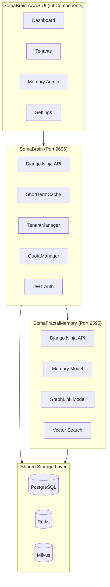
```mermaid
flowchart TB
    subgraph UI["SomaBrain AAAS UI (Lit Components)"]
        D[Dashboard]
        T[Tenants]
        M[Memory Admin]
        S[Settings]
    end
    
    subgraph SomaBrain["SomaBrain (Port 9696)"]
        API[Django Ninja API]
        STC[ShortTermCache]
        TM[TenantManager]
        QM[QuotaManager]
        Auth[JWT Auth]
    end
    
    subgraph SomaFractalMemory["SomaFractalMemory (Port 9595)"]
        FAPI[Django Ninja API]
        LTS[Memory Model]
        Graph[GraphLink Model]
        Search[Vector Search]
    end
    
    subgraph Storage["Shared Storage Layer"]
        PG[(PostgreSQL)]
        Redis[(Redis)]
        Milvus[(Milvus)]
    end
    
    UI --> SomaBrain
    SomaBrain --> SomaFractalMemory
    SomaBrain --> Storage
    SomaFractalMemory --> Storage
```

---

## 3. Service Integration UML

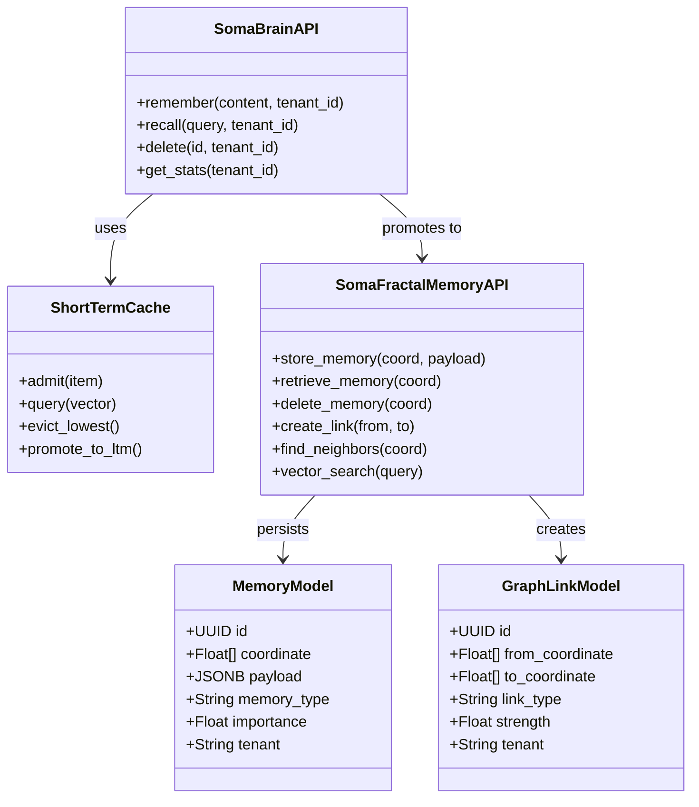
```mermaid
classDiagram
    class SomaBrainAPI {
        +remember(content, tenant_id)
        +recall(query, tenant_id)
        +delete(id, tenant_id)
        +get_stats(tenant_id)
    }
    
    class ShortTermCache {
        +admit(item)
        +query(vector)
        +evict_lowest()
        +promote_to_ltm()
    }
    
    class SomaFractalMemoryAPI {
        +store_memory(coord, payload)
        +retrieve_memory(coord)
        +delete_memory(coord)
        +create_link(from, to)
        +find_neighbors(coord)
        +vector_search(query)
    }
    
    class MemoryModel {
        +UUID id
        +Float[] coordinate
        +JSONB payload
        +String memory_type
        +Float importance
        +String tenant
    }
    
    class GraphLinkModel {
        +UUID id
        +Float[] from_coordinate
        +Float[] to_coordinate
        +String link_type
        +Float strength
        +String tenant
    }
    
    SomaBrainAPI --> ShortTermCache : uses
    SomaBrainAPI --> SomaFractalMemoryAPI : promotes to
    SomaFractalMemoryAPI --> MemoryModel : persists
    SomaFractalMemoryAPI --> GraphLinkModel : creates
```

---

## 4. Data Flow Sequence

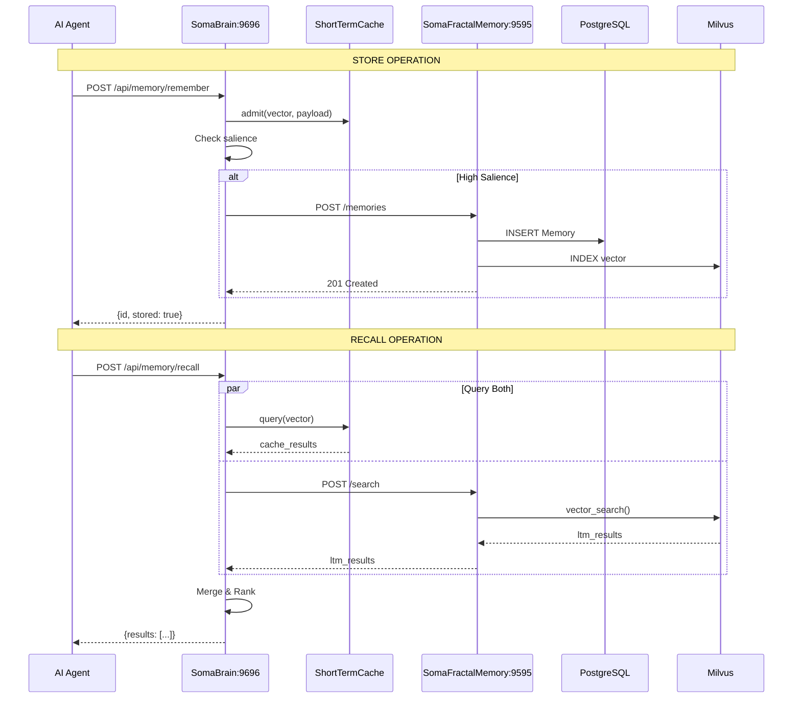
```mermaid
sequenceDiagram
    participant Agent as AI Agent
    participant SB as SomaBrain:9696
    participant STC as ShortTermCache
    participant SFM as SomaFractalMemory:9595
    participant PG as PostgreSQL
    participant MV as Milvus
    
    Note over Agent,MV: STORE OPERATION
    Agent->>SB: POST /api/memory/remember
    SB->>STC: admit(vector, payload)
    SB->>SB: Check salience
    
    alt High Salience
        SB->>SFM: POST /memories
        SFM->>PG: INSERT Memory
        SFM->>MV: INDEX vector
        SFM-->>SB: 201 Created
    end
    SB-->>Agent: {id, stored: true}
    
    Note over Agent,MV: RECALL OPERATION
    Agent->>SB: POST /api/memory/recall
    
    par Query Both
        SB->>STC: query(vector)
        STC-->>SB: cache_results
    and
        SB->>SFM: POST /search
        SFM->>MV: vector_search()
        MV-->>SFM: ltm_results
        SFM-->>SB: ltm_results
    end
    
    SB->>SB: Merge & Rank
    SB-->>Agent: {results: [...]}
```

---

## 5. Docker Compose Architecture

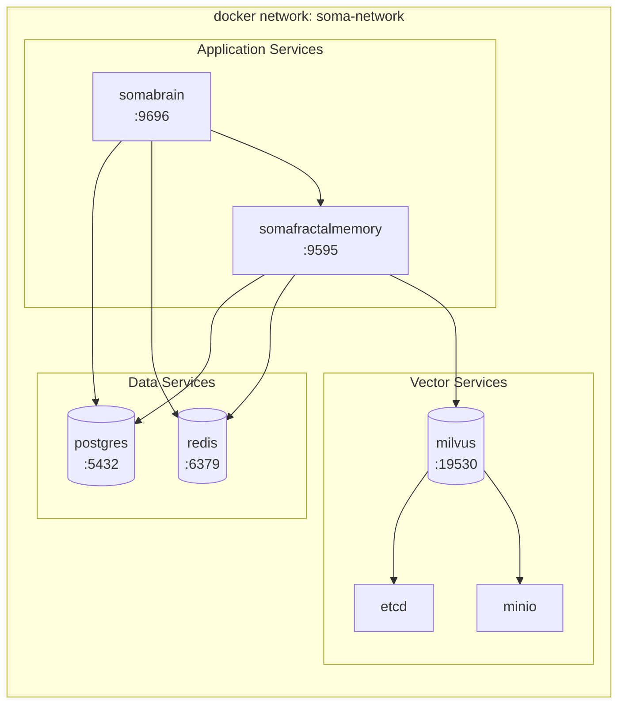
```mermaid
flowchart LR
    subgraph Network["docker network: soma-network"]
        subgraph Apps["Application Services"]
            SB[somabrain<br/>:9696]
            SFM[somafractalmemory<br/>:9595]
        end
        
        subgraph Data["Data Services"]
            PG[(postgres<br/>:5432)]
            Redis[(redis<br/>:6379)]
        end
        
        subgraph Vector["Vector Services"]
            MV[(milvus<br/>:19530)]
            ETCD[etcd]
            MINIO[minio]
        end
    end
    
    SB --> PG
    SB --> Redis
    SB --> SFM
    SFM --> PG
    SFM --> Redis
    SFM --> MV
    MV --> ETCD
    MV --> MINIO
```

---

## 6. Unified API Endpoints

### 6.1 SomaBrain Endpoints (Port 9696)

| Endpoint | Method | Description |
|----------|--------|-------------|
| `/api/memory/remember` | POST | Store memory (cache + LTM) |
| `/api/memory/recall` | POST | Query from cache + LTM |
| `/api/memory/delete` | DELETE | Delete from both stores |
| `/api/memory/stats` | GET | Unified memory statistics |
| `/api/admin/tenants` | CRUD | Tenant management |
| `/api/admin/settings` | GET/PATCH | Platform settings |

### 6.2 SomaFractalMemory Endpoints (Port 9595)

| Endpoint | Method | Description |
|----------|--------|-------------|
| `/memories` | POST | Store memory by coordinate |
| `/memories/{coord}` | GET | Retrieve by coordinate |
| `/memories/{coord}` | DELETE | Delete by coordinate |
| `/search` | POST | Vector similarity search |
| `/graph/link` | POST | Create graph link |
| `/graph/neighbors` | GET | Get neighbors |
| `/graph/path` | GET | Find path between coords |
| `/stats` | GET | Memory statistics |

---

## 7. Unified Admin UI Screens

### 7.1 Screen Map

| Screen | Route | Source Data |
|--------|-------|-------------|
| Dashboard | `/platform` | SomaBrain + SFM metrics |
| Tenants | `/platform/tenants` | SomaBrain TenantRegistry |
| Memory Overview | `/platform/memory` | SomaBrain + SFM combined |
| Memory Browser | `/platform/memory/browse` | SFM Memory table |
| Graph Explorer | `/platform/memory/graph` | SFM GraphLink |
| Vector Index | `/platform/memory/vectors` | Milvus stats |
| Settings | `/platform/settings` | Both services |

### 7.2 Memory Admin Wireframe

```
┌─────────────────────────────────────────────────────────────────┐
│ 📊 Memory Overview                                              │
├─────────────────────────────────────────────────────────────────┤
│                                                                 │
│  ┌──────────────┐  ┌──────────────┐  ┌──────────────┐          │
│  │ ShortTerm    │  │ LongTerm     │  │ Graph Links  │          │
│  │    127       │  │   45,231     │  │    8,456     │          │
│  │ in cache     │  │ in storage   │  │ connections  │          │
│  └──────────────┘  └──────────────┘  └──────────────┘          │
│                                                                 │
│  ┌───────────────────────────────────────────────────────────┐ │
│  │ TABS: [Overview] [Browse] [Graph] [Vectors] [Config]      │ │
│  ├───────────────────────────────────────────────────────────┤ │
│  │                                                           │ │
│  │  Memory Type Distribution    │   Storage by Tenant       │ │
│  │  [Pie Chart]                 │   [Bar Chart]             │ │
│  │                                                           │ │
│  │  ● Episodic: 65%             │   Acme Corp: 12,456      │ │
│  │  ● Semantic: 35%             │   Beta Inc:  8,921       │ │
│  │                                                           │ │
│  └───────────────────────────────────────────────────────────┘ │
└─────────────────────────────────────────────────────────────────┘
```

---

## 8. Configuration Unification

### 8.1 Shared Settings

| Setting | SomaBrain | SomaFractalMemory | Description |
|---------|-----------|-------------------|-------------|
| `POSTGRES_HOST` | ✓ | ✓ | PostgreSQL host |
| `POSTGRES_PORT` | ✓ | ✓ | PostgreSQL port |
| `REDIS_HOST` | ✓ | ✓ | Redis host |
| `REDIS_PORT` | ✓ | ✓ | Redis port |
| `SOMA_MILVUS_HOST` | ✓ | ✓ | Milvus host |
| `SOMA_MILVUS_PORT` | ✓ | ✓ | Milvus port |

### 8.2 Service-Specific Settings

| Service | Setting | Description |
|---------|---------|-------------|
| SomaBrain | `SOMABRAIN_WM_CAPACITY` | Cache capacity |
| SomaBrain | `SOMABRAIN_SALIENCE_THRESHOLD` | Store threshold |
| SomaFractalMemory | `SOMA_API_PORT` | LTM API port |
| SomaFractalMemory | `SOMA_COLLECTION_NAME` | Milvus collection |

---

## 9. Metrics Consolidation

### 9.1 Combined Metrics Dashboard

| Metric | Source | Description |
|--------|--------|-------------|
| `soma_cache_items` | SomaBrain | ShortTerm cache count |
| `soma_cache_hit_ratio` | SomaBrain | Cache hit rate |
| `soma_ltm_items` | SFM | LongTerm memory count |
| `soma_ltm_store_latency` | SFM | Store latency |
| `soma_graph_links` | SFM | Graph link count |
| `soma_vector_search_latency` | SFM | Vector search latency |
| `soma_milvus_collection_size` | Milvus | Vector index size |

---

## 10. Deployment Scenarios

### 10.1 Standalone Mode

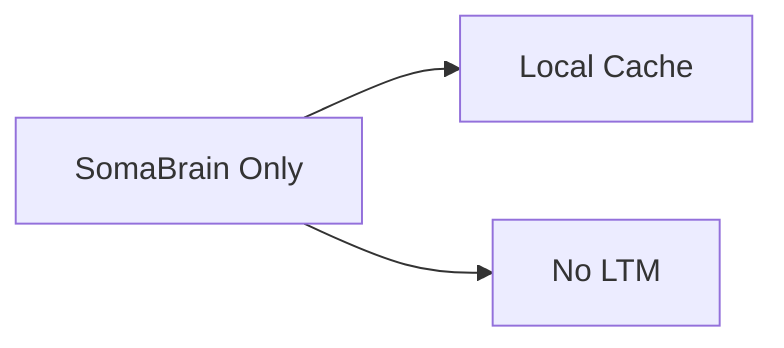
```mermaid
flowchart LR
    A[SomaBrain Only] --> B[Local Cache]
    A --> C[No LTM]
```

### 10.2 Integrated Mode

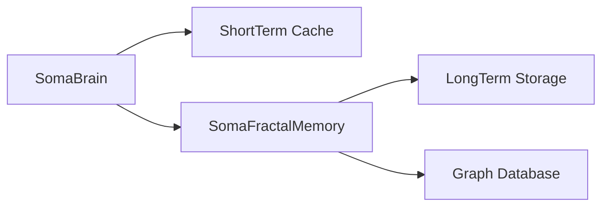
```mermaid
flowchart LR
    A[SomaBrain] --> B[ShortTerm Cache]
    A --> C[SomaFractalMemory]
    C --> D[LongTerm Storage]
    C --> E[Graph Database]
```

### 10.3 Full Production

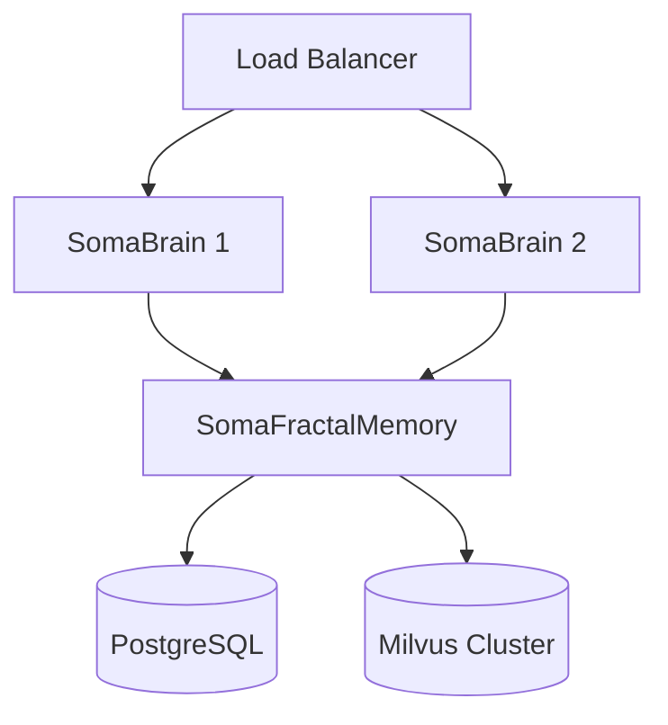
```mermaid
flowchart TB
    LB[Load Balancer] --> SB1[SomaBrain 1]
    LB --> SB2[SomaBrain 2]
    SB1 --> SFM[SomaFractalMemory]
    SB2 --> SFM
    SFM --> PG[(PostgreSQL)]
    SFM --> MV[(Milvus Cluster)]
```

---

## 11. Key Files Reference

### SomaBrain

| File | Purpose |
|------|---------|
| `somabrain/settings.py` | Django settings |
| `somabrain/wm.py` | ShortTerm cache |
| `somabrain/tenant_manager.py` | Multi-tenancy |
| `somabrain/api/endpoints/` | API routes |

### SomaFractalMemory

| File | Purpose |
|------|---------|
| `somafractalmemory/settings.py` | Django settings |
| `somafractalmemory/models.py` | Memory/GraphLink models |
| `somafractalmemory/services.py` | Business logic |
| `somafractalmemory/api/routers/` | API routes |

---

*Unified Memory Platform - SomaBrain AAAS*
# SRS-08: Platform Administration - Complete Specification

**Document Version:** 1.0.0  
**Date:** 2025-12-24  
**Standard:** ISO/IEC/IEEE 29148:2018 Compatible  
**Module:** Complete Platform Administration

---

## 1. Overview

This document provides **exhaustive** specification of every server setting, metric, deployment mode, permission, and role in the SomaBrain platform.

---

## 2. Roles & Permissions Matrix

### 2.1 Role Hierarchy

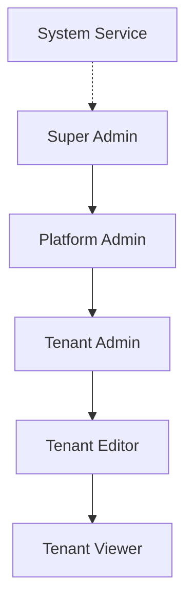
```mermaid
flowchart TB
    A[Super Admin] --> B[Platform Admin]
    B --> C[Tenant Admin]
    C --> D[Tenant Editor]
    D --> E[Tenant Viewer]
    F[System Service] -.-> A
```

### 2.2 Complete Permissions Matrix

| Permission | Super Admin | Platform Admin | Tenant Admin | Tenant Editor | Tenant Viewer | System |
|------------|:-----------:|:--------------:|:------------:|:-------------:|:-------------:|:------:|
| **PLATFORM MANAGEMENT** |||||
| View all tenants | ✓ | ✓ | ✗ | ✗ | ✗ | ✓ |
| Create tenant | ✓ | ✓ | ✗ | ✗ | ✗ | ✓ |
| Suspend tenant | ✓ | ✓ | ✗ | ✗ | ✗ | ✓ |
| Delete tenant | ✓ | ✗ | ✗ | ✗ | ✗ | ✗ |
| Impersonate tenant | ✓ | ✓ | ✗ | ✗ | ✗ | ✗ |
| View revenue/billing | ✓ | ✓ | ✗ | ✗ | ✗ | ✗ |
| Modify subscription tier | ✓ | ✓ | ✗ | ✗ | ✗ | ✗ |
| Override quotas | ✓ | ✓ | ✗ | ✗ | ✗ | ✗ |
| **SERVER SETTINGS** |||||
| View server settings | ✓ | ✓ | ✗ | ✗ | ✗ | ✓ |
| Modify server settings | ✓ | ✗ | ✗ | ✗ | ✗ | ✗ |
| View deployment config | ✓ | ✓ | ✗ | ✗ | ✗ | ✓ |
| Restart services | ✓ | ✗ | ✗ | ✗ | ✗ | ✗ |
| View system metrics | ✓ | ✓ | ✗ | ✗ | ✗ | ✓ |
| Access health endpoints | ✓ | ✓ | ✗ | ✗ | ✗ | ✓ |
| **TENANT MANAGEMENT** |||||
| View own tenant | ✓ | ✓ | ✓ | ✓ | ✓ | ✓ |
| Edit tenant settings | ✓ | ✓ | ✓ | ✗ | ✗ | ✗ |
| Invite users | ✓ | ✓ | ✓ | ✗ | ✗ | ✗ |
| Remove users | ✓ | ✓ | ✓ | ✗ | ✗ | ✗ |
| Assign roles | ✓ | ✓ | ✓ | ✗ | ✗ | ✗ |
| View billing | ✓ | ✓ | ✓ | ✗ | ✗ | ✗ |
| Change subscription | ✓ | ✓ | ✓ | ✗ | ✗ | ✗ |
| **MEMORY OPERATIONS** |||||
| Store memory | ✓ | ✓ | ✓ | ✓ | ✗ | ✓ |
| Recall memory | ✓ | ✓ | ✓ | ✓ | ✓ | ✓ |
| Delete memory | ✓ | ✓ | ✓ | ✓ | ✗ | ✓ |
| Bulk operations | ✓ | ✓ | ✓ | ✗ | ✗ | ✓ |
| View usage stats | ✓ | ✓ | ✓ | ✓ | ✓ | ✓ |
| **API ACCESS** |||||
| View API keys | ✓ | ✓ | ✓ | ✓ | ✗ | ✗ |
| Create API keys | ✓ | ✓ | ✓ | ✗ | ✗ | ✗ |
| Revoke API keys | ✓ | ✓ | ✓ | ✗ | ✗ | ✗ |
| **AUDIT** |||||
| View tenant audit | ✓ | ✓ | ✓ | ✓ | ✓ | ✓ |
| View platform audit | ✓ | ✓ | ✗ | ✗ | ✗ | ✓ |
| Export audit logs | ✓ | ✓ | ✓ | ✗ | ✗ | ✗ |

---

## 3. Server Settings - Complete Catalog

### 3.1 Core Settings

| Setting | Type | Default | Description | Editable at Runtime |
|---------|------|---------|-------------|:-------------------:|
| `SOMABRAIN_LOG_LEVEL` | enum | `INFO` | Log verbosity: DEBUG, INFO, WARNING, ERROR | ✓ |
| `SOMABRAIN_KILL_SWITCH` | bool | `false` | Emergency shutdown all API access | ✓ |
| `SOMABRAIN_MINIMAL_PUBLIC_API` | bool | `false` | Restrict to minimal API surface | ✓ |
| `DEBUG` | bool | `false` | Django debug mode | ✗ |
| `SECRET_KEY` | str | - | Django secret key | ✗ |

### 3.2 Database Settings

| Setting | Type | Default | Description | Editable at Runtime |
|---------|------|---------|-------------|:-------------------:|
| `SOMABRAIN_POSTGRES_DSN` | str | - | PostgreSQL connection string | ✗ |
| `SOMABRAIN_REDIS_URL` | str | - | Redis connection string | ✗ |
| `SOMABRAIN_REDIS_HOST` | str | `localhost` | Redis host | ✗ |
| `SOMABRAIN_REDIS_PORT` | int | `6379` | Redis port | ✗ |
| `SOMABRAIN_REDIS_DB` | int | `0` | Redis database number | ✗ |

### 3.3 Authentication Settings

| Setting | Type | Default | Description | Editable at Runtime |
|---------|------|---------|-------------|:-------------------:|
| `SOMABRAIN_AUTH_REQUIRED` | bool | `false` | Require authentication | ✓ |
| `SOMABRAIN_API_TOKEN` | str | - | Static API token fallback | ✓ |
| `SOMABRAIN_JWT_SECRET` | str | - | JWT signing secret | ✗ |
| `SOMABRAIN_JWT_PUBLIC_KEY_PATH` | str | - | Path to JWT public key | ✗ |
| `SOMABRAIN_JWT_AUDIENCE` | str | - | Expected JWT audience | ✓ |
| `SOMABRAIN_JWT_ISSUER` | str | - | Expected JWT issuer | ✓ |
| `SOMABRAIN_AUTH_SERVICE_URL` | str | - | External auth service URL | ✗ |
| `SOMABRAIN_AUTH_SERVICE_API_KEY` | str | - | Auth service API key | ✗ |

### 3.4 Kafka & Messaging Settings

| Setting | Type | Default | Description | Editable at Runtime |
|---------|------|---------|-------------|:-------------------:|
| `KAFKA_BOOTSTRAP_SERVERS` | str | - | Kafka broker addresses | ✗ |
| `SOMABRAIN_KAFKA_HOST` | str | - | Kafka host | ✗ |
| `SOMABRAIN_KAFKA_PORT` | int | `9092` | Kafka port | ✗ |
| `SOMABRAIN_KAFKA_SCHEME` | str | `kafka` | Kafka protocol scheme | ✗ |
| `SOMABRAIN_AUDIT_TOPIC` | str | `soma.audit` | Audit event topic | ✓ |
| `SOMABRAIN_ORCH_CONSUMER_GROUP` | str | `orchestrator-service` | Consumer group ID | ✗ |
| `SOMABRAIN_ORCH_NAMESPACE` | str | `cog` | Orchestrator namespace | ✓ |

### 3.5 Memory System Settings

| Setting | Type | Default | Description | Editable at Runtime |
|---------|------|---------|-------------|:-------------------:|
| `SOMABRAIN_MILVUS_HOST` | str | - | Milvus vector DB host | ✗ |
| `SOMABRAIN_MILVUS_PORT` | int | `19530` | Milvus port | ✗ |
| `SOMABRAIN_NAMESPACE` | str | `default` | Default memory namespace | ✓ |
| `SOMABRAIN_HRR_DIM` | int | `1024` | Vector dimension | ✗ |
| `SOMABRAIN_WM_CAPACITY` | int | `100` | Working memory capacity | ✓ |
| `SOMABRAIN_LTM_BATCH_SIZE` | int | `50` | LTM batch write size | ✓ |
| `SOMABRAIN_SALIENCE_THRESHOLD` | float | `0.5` | Minimum salience to store | ✓ |

### 3.6 Quota & Rate Limit Settings

| Setting | Type | Default | Description | Editable at Runtime |
|---------|------|---------|-------------|:-------------------:|
| `SOMABRAIN_QUOTA_DAILY_WRITES` | int | `10000` | Default daily write quota | ✓ |
| `SOMABRAIN_RATE_LIMIT_RPS` | int | `100` | Requests per second limit | ✓ |
| `SOMABRAIN_RATE_LIMIT_BURST` | int | `200` | Burst allowance | ✓ |
| `SOMABRAIN_ALLOW_ANONYMOUS_TENANTS` | bool | `false` | Allow unauthenticated tenants | ✓ |

### 3.7 Security Settings

| Setting | Type | Default | Description | Editable at Runtime |
|---------|------|---------|-------------|:-------------------:|
| `SOMABRAIN_OPA_PRIVKEY_PATH` | str | - | OPA private key path | ✗ |
| `SOMABRAIN_OPA_PUBKEY_PATH` | str | - | OPA public key path | ✗ |
| `SOMABRAIN_PROVENANCE_SECRET` | str | - | Provenance signing secret | ✗ |
| `SOMABRAIN_PROVENANCE_STRICT_DENY` | bool | `false` | Strict provenance enforcement | ✓ |
| `SOMABRAIN_REQUIRE_PROVENANCE` | bool | `false` | Require provenance on requests | ✓ |
| `SOMABRAIN_BLOCK_UA_REGEX` | str | - | User-agent blocking pattern | ✓ |

### 3.8 Vault Integration Settings

| Setting | Type | Default | Description | Editable at Runtime |
|---------|------|---------|-------------|:-------------------:|
| `SOMABRAIN_VAULT_ADDR` | str | - | HashiCorp Vault address | ✗ |
| `SOMABRAIN_VAULT_TOKEN` | str | - | Vault access token | ✗ |
| `SOMABRAIN_VAULT_PUBKEY_PATH` | str | - | Vault public key path | ✗ |

### 3.9 Constitution Settings

| Setting | Type | Default | Description | Editable at Runtime |
|---------|------|---------|-------------|:-------------------:|
| `SOMABRAIN_CONSTITUTION_PUBKEYS` | str | - | Constitution public keys | ✗ |
| `SOMABRAIN_CONSTITUTION_PUBKEY_PATH` | str | - | Constitution public key path | ✗ |
| `SOMABRAIN_CONSTITUTION_PRIVKEY_PATH` | str | - | Constitution private key path | ✗ |
| `SOMABRAIN_CONSTITUTION_THRESHOLD` | int | `1` | Signing threshold | ✗ |
| `SOMABRAIN_CONSTITUTION_SIGNER_ID` | str | `default` | Signer identifier | ✗ |

### 3.10 Feature Flags Settings

| Setting | Type | Default | Description | Editable at Runtime |
|---------|------|---------|-------------|:-------------------:|
| `SOMABRAIN_FEATURE_FLAGS_PORT` | int | `9697` | Feature flags service port | ✗ |
| `SOMABRAIN_FEATURE_OVERRIDES` | str | `./data/feature_overrides.json` | Feature overrides file | ✓ |
| `SOMABRAIN_ALLOW_TINY_EMBEDDER` | bool | `false` | Allow tiny embedder model | ✓ |

### 3.11 Service Ports

| Setting | Type | Default | Description | Editable at Runtime |
|---------|------|---------|-------------|:-------------------:|
| `SOMABRAIN_REWARD_PORT` | int | `8083` | Reward service port | ✗ |
| `SOMABRAIN_REWARD_PRODUCER_PORT` | int | `30183` | Reward producer port | ✗ |
| `SOMABRAIN_BENCH_TIMEOUT` | float | `90.0` | Benchmark timeout | ✓ |

---

## 4. Deployment Modes

### 4.1 Deployment Architecture Options

| Mode | Description | Use Case |
|------|-------------|----------|
| **Single Node** | All services on one host | Development, Testing |
| **Multi-Container** | Docker Compose stack | Small production |
| **Kubernetes** | K8s with Helm charts | Enterprise production |
| **Serverless** | Cloud Functions + managed DB | Pay-per-use |

### 4.2 Docker Compose Services

| Service | Image | Ports | Required |
|---------|-------|-------|:--------:|
| `somabrain_app` | somabrain:latest | 9696 | ✓ |
| `postgres` | postgres:15 | 5432 | ✓ |
| `redis` | redis:7 | 6379 | ✓ |
| `milvus` | milvusdb/milvus | 19530 | ✓ |
| `keycloak` | quay.io/keycloak/keycloak | 20880 | SSO |
| `lago` | getlago/lago-api | 3000 | Billing |
| `kafka` | confluentinc/cp-kafka | 9092 | Streaming |

### 4.3 Scaling Configuration

| Component | Min Replicas | Max Replicas | Scale Trigger |
|-----------|:------------:|:------------:|---------------|
| API | 2 | 10 | CPU > 70% |
| Workers | 1 | 5 | Queue depth > 1000 |
| Redis | 1 | 3 | Memory > 80% |
| Postgres | 1 | 1 | N/A (primary) |
| Milvus | 1 | 3 | Query latency > 100ms |

---

## 5. Metrics Catalog

### 5.1 System Metrics

| Metric | Type | Description |
|--------|------|-------------|
| `somabrain_uptime_seconds` | Gauge | Time since last restart |
| `somabrain_memory_bytes` | Gauge | Process memory usage |
| `somabrain_cpu_percent` | Gauge | CPU utilization |
| `somabrain_open_connections` | Gauge | Open DB connections |

### 5.2 API Metrics

| Metric | Type | Labels | Description |
|--------|------|--------|-------------|
| `somabrain_http_requests_total` | Counter | method, endpoint, status | Total HTTP requests |
| `somabrain_http_request_duration_seconds` | Histogram | method, endpoint | Request latency |
| `somabrain_http_request_size_bytes` | Histogram | endpoint | Request body size |
| `somabrain_http_response_size_bytes` | Histogram | endpoint | Response body size |

### 5.3 Memory System Metrics

| Metric | Type | Labels | Description |
|--------|------|--------|-------------|
| `somabrain_memory_store_total` | Counter | tenant_id | Total store operations |
| `somabrain_memory_recall_total` | Counter | tenant_id | Total recall operations |
| `somabrain_memory_delete_total` | Counter | tenant_id | Total delete operations |
| `somabrain_wm_items` | Gauge | tenant_id | Working memory item count |
| `somabrain_ltm_items` | Gauge | tenant_id | Long-term memory count |
| `somabrain_cache_hit_ratio` | Gauge | - | Cache hit rate |

### 5.4 Quota Metrics

| Metric | Type | Labels | Description |
|--------|------|--------|-------------|
| `somabrain_quota_used` | Gauge | tenant_id | Used quota today |
| `somabrain_quota_remaining` | Gauge | tenant_id | Remaining quota |
| `somabrain_quota_exceeded_total` | Counter | tenant_id | Quota exceeded events |
| `somabrain_rate_limit_hit_total` | Counter | tenant_id | Rate limit hits |

### 5.5 Tenant Metrics

| Metric | Type | Labels | Description |
|--------|------|--------|-------------|
| `somabrain_tenants_total` | Gauge | status | Total tenants by status |
| `somabrain_tenant_users_total` | Gauge | tenant_id | Users per tenant |
| `somabrain_tenant_api_calls_total` | Counter | tenant_id | API calls per tenant |

### 5.6 Health Metrics

| Metric | Type | Description |
|--------|------|-------------|
| `somabrain_health_status` | Gauge | 1=healthy, 0=unhealthy |
| `somabrain_postgres_up` | Gauge | PostgreSQL connectivity |
| `somabrain_redis_up` | Gauge | Redis connectivity |
| `somabrain_milvus_up` | Gauge | Milvus connectivity |
| `somabrain_kafka_up` | Gauge | Kafka connectivity |

---

## 6. Admin Screens Summary

| Screen | URL | Actions |
|--------|-----|---------|
| Dashboard | `/platform` | View metrics, quick links |
| Tenants | `/platform/tenants` | List, create, filter, search |
| Tenant Detail | `/platform/tenants/:id` | Edit, suspend, impersonate |
| Settings | `/platform/settings` | View/edit server settings |
| Metrics | `/platform/metrics` | View all Prometheus metrics |
| Deployments | `/platform/deployments` | View deployment configs |
| Audit | `/platform/audit` | View all events |
| Users | `/platform/users` | Manage platform admins |
| Billing | `/platform/billing` | Revenue, invoices |

---

## 7. API Endpoints for Administration

| Endpoint | Method | Permission | Description |
|----------|--------|------------|-------------|
| `/api/admin/tenants` | GET | Platform Admin | List all tenants |
| `/api/admin/tenants` | POST | Platform Admin | Create tenant |
| `/api/admin/tenants/{id}` | GET | Platform Admin | Get tenant detail |
| `/api/admin/tenants/{id}` | PATCH | Platform Admin | Update tenant |
| `/api/admin/tenants/{id}` | DELETE | Super Admin | Delete tenant |
| `/api/admin/tenants/{id}/suspend` | POST | Platform Admin | Suspend tenant |
| `/api/admin/tenants/{id}/activate` | POST | Platform Admin | Activate tenant |
| `/api/admin/impersonate/{id}` | POST | Platform Admin | Start impersonation |
| `/api/admin/settings` | GET | Platform Admin | Get server settings |
| `/api/admin/settings` | PATCH | Super Admin | Update settings |
| `/api/admin/metrics` | GET | Platform Admin | Get all metrics |
| `/api/admin/audit` | GET | Platform Admin | Get audit log |

---

*SomaBrain Platform Administration - Complete Specification*
# Traceability Matrix (ISO/IEC 26512)

**Purpose**: Map features to ISO clauses, documentation pages, and test coverage.

**Last Updated**: 2025-01-27

---

## Feature → Documentation → Tests

| Feature ID | Description | ISO Clause | Doc Page | Test Coverage |
|------------|-------------|------------|----------|---------------|
| F001 | Memory storage (remember) | ISO/IEC 12207§6.4.3 | [Memory Operations](user/features/memory-operations.md) | `tests/integration/test_e2e_memory_http.py` |
| F002 | Memory recall | ISO/IEC 12207§6.4.3 | [Memory Operations](user/features/memory-operations.md) | `tests/integration/test_e2e_memory_http.py` |
| F003 | Batch ingestion | ISO/IEC 12207§6.4.3 | [API Integration](user/features/api-integration.md) | `tests/integration/test_e2e_memory_http.py` |
| F004 | Context evaluation | ISO/IEC 12207§6.4.4 | [Cognitive Reasoning](user/features/cognitive-reasoning.md) | `tests/integration/test_api_diagnostics_and_neuromodulators.py` |
| F005 | Adaptation feedback | ISO/IEC 12207§6.4.4 | [Cognitive Reasoning](user/features/cognitive-reasoning.md) | `tests/workflow/test_adaptation_cycle.py` |
| F006 | Tiered memory | ISO/IEC 12207§6.4.3 | [Architecture](technical/architecture.md) | `tests/core/test_tiered_memory_registry.py` |
| F007 | Circuit breaker | ISO/IEC 12207§6.4.7 | [Architecture](technical/architecture.md) | `tests/services/test_memory_service.py` |
| F008 | Outbox pattern | ISO/IEC 12207§6.4.7 | [Architecture](technical/architecture.md) | `tests/test_admin_outbox.py` |
| F009 | Cutover controller | ISO/IEC 12207§6.4.7 | [Architecture](technical/architecture.md) | `tests/core/test_cutover_controller.py` |
| F010 | Admin endpoints | ISO/IEC 12207§6.4.5 | [API Reference](development/api-reference.md) | `tests/test_admin_features.py` |
| F011 | OPA authorization | ISO/IEC 27001§A.9.4 | [Security](technical/security/rbac-matrix.md) | `tests/cog/test_integrator_opa_policy.py` |
| F012 | Neuromodulators | ISO/IEC 12207§6.4.4 | [Cognitive Reasoning](user/features/cognitive-reasoning.md) | `tests/integration/test_api_diagnostics_and_neuromodulators.py` |
| F013 | Sleep consolidation | ISO/IEC 12207§6.4.4 | [Cognitive Reasoning](user/features/cognitive-reasoning.md) | `tests/integration/test_api_diagnostics_and_neuromodulators.py` |
| F014 | Retrieval pipeline | ISO/IEC 12207§6.4.3 | [Full-Power Recall](technical/full-power-recall.md) | `tests/services/test_retrieval_pipeline.py` |
| F015 | Predictor services | ISO/IEC 12207§6.4.4 | [Predictors](technical/predictors.md) | `tests/services/test_predictor_services.py` |
| F016 | Integrator hub | ISO/IEC 12207§6.4.4 | [Karpathy Architecture](technical/karpathy-architecture.md) | `tests/services/test_integrator_phase2.py` |
| F017 | Segmentation service | ISO/IEC 12207§6.4.4 | [Karpathy Architecture](technical/karpathy-architecture.md) | `tests/services/test_segmentation_phase3.py` |

---

## Test Coverage Summary

| Category | Total Features | Documented | Tested | Coverage % |
|----------|----------------|------------|--------|------------|
| Memory Operations | 3 | 3 | 3 | 100% |
| Cognitive Reasoning | 4 | 4 | 4 | 100% |
| Infrastructure | 4 | 4 | 4 | 100% |
| Admin & Security | 2 | 2 | 2 | 100% |
| Cognitive Threads | 3 | 3 | 3 | 100% |
| **Total** | **17** | **17** | **17** | **100%** |

---

## Verification Process

1. **Feature Implementation** → Code merged to `main`
2. **Documentation** → Feature page created/updated in `docs/`
3. **Test Coverage** → Integration/unit tests added
4. **Traceability** → Entry added to this matrix
5. **Review** → Technical writer + engineer sign-off

---

## Maintenance

- **Quarterly Review**: Verify all features still exist and links are valid
- **On Feature Addition**: Update this matrix before merging
- **On Feature Removal**: Mark as deprecated, archive after 2 releases
# SRS-01: Multi-Tenancy Module

**Document Version:** 1.0.0  
**Date:** 2025-12-24  
**Standard:** ISO/IEC/IEEE 29148:2018 Compatible  
**Module:** Multi-Tenancy Subsystem

---

## 1. Overview

The Multi-Tenancy module provides complete tenant isolation, lifecycle management, and quota enforcement for the SomaBrain AAAS platform.

### 1.1 Scope

| Component | Description |
|-----------|-------------|
| TenantRegistry | UUID-based tenant storage in Redis |
| TenantManager | High-level tenant operations |
| TenantContext | Request-scoped tenant resolution |
| QuotaManager | Per-tenant write quotas |

---

## 2. UML Class Diagram

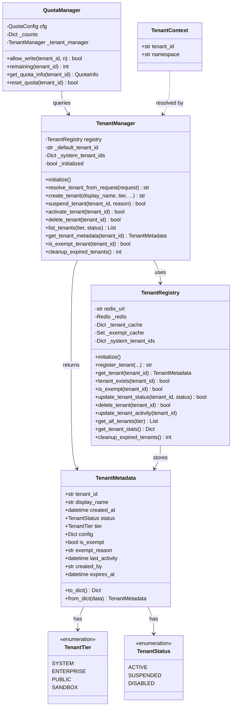
```mermaid
classDiagram
    class TenantContext {
        +str tenant_id
        +str namespace
    }
    
    class TenantManager {
        -TenantRegistry registry
        -str _default_tenant_id
        -Dict _system_tenant_ids
        -bool _initialized
        +initialize()
        +resolve_tenant_from_request(request) str
        +create_tenant(display_name, tier, ...) str
        +suspend_tenant(tenant_id, reason) bool
        +activate_tenant(tenant_id) bool
        +delete_tenant(tenant_id) bool
        +list_tenants(tier, status) List
        +get_tenant_metadata(tenant_id) TenantMetadata
        +is_exempt_tenant(tenant_id) bool
        +cleanup_expired_tenants() int
    }
    
    class TenantRegistry {
        -str redis_url
        -Redis _redis
        -Dict _tenant_cache
        -Set _exempt_cache
        -Dict _system_tenant_ids
        +initialize()
        +register_tenant(...) str
        +get_tenant(tenant_id) TenantMetadata
        +tenant_exists(tenant_id) bool
        +is_exempt(tenant_id) bool
        +update_tenant_status(tenant_id, status) bool
        +delete_tenant(tenant_id) bool
        +update_tenant_activity(tenant_id)
        +get_all_tenants(tier) List
        +get_tenant_stats() Dict
        +cleanup_expired_tenants() int
    }
    
    class TenantMetadata {
        +str tenant_id
        +str display_name
        +datetime created_at
        +TenantStatus status
        +TenantTier tier
        +Dict config
        +bool is_exempt
        +str exempt_reason
        +datetime last_activity
        +str created_by
        +datetime expires_at
        +to_dict() Dict
        +from_dict(data) TenantMetadata
    }
    
    class TenantTier {
        <<enumeration>>
        SYSTEM
        ENTERPRISE
        PUBLIC
        SANDBOX
    }
    
    class TenantStatus {
        <<enumeration>>
        ACTIVE
        SUSPENDED
        DISABLED
    }
    
    class QuotaManager {
        -QuotaConfig cfg
        -Dict _counts
        -TenantManager _tenant_manager
        +allow_write(tenant_id, n) bool
        +remaining(tenant_id) int
        +get_quota_info(tenant_id) QuotaInfo
        +reset_quota(tenant_id) bool
    }
    
    TenantManager --> TenantRegistry : uses
    TenantManager --> TenantMetadata : returns
    TenantRegistry --> TenantMetadata : stores
    TenantMetadata --> TenantTier : has
    TenantMetadata --> TenantStatus : has
    QuotaManager --> TenantManager : queries
    TenantContext ..> TenantManager : resolved by
```

---

## 3. Tenant Lifecycle Flowchart

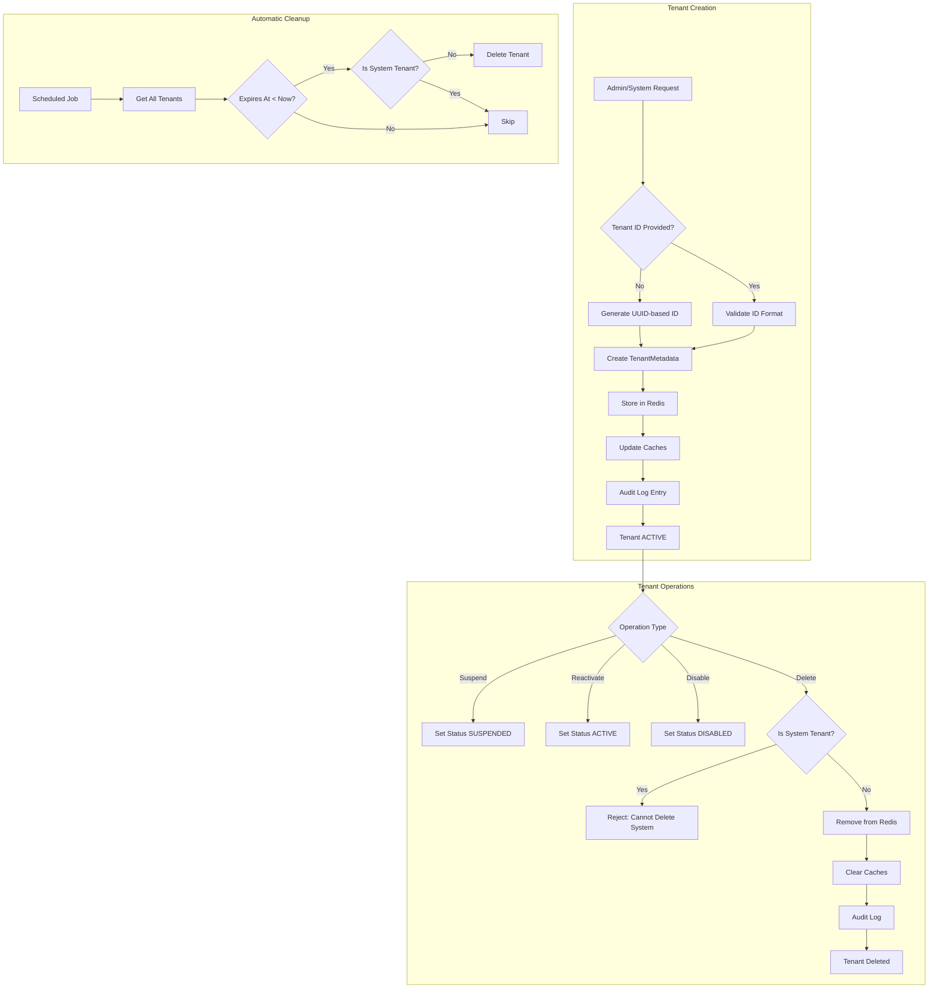
```mermaid
flowchart TD
    subgraph Creation["Tenant Creation"]
        A[Admin/System Request] --> B{Tenant ID Provided?}
        B -->|No| C[Generate UUID-based ID]
        B -->|Yes| D[Validate ID Format]
        C --> E[Create TenantMetadata]
        D --> E
        E --> F[Store in Redis]
        F --> G[Update Caches]
        G --> H[Audit Log Entry]
        H --> I[Tenant ACTIVE]
    end
    
    subgraph Operations["Tenant Operations"]
        I --> J{Operation Type}
        J -->|Suspend| K[Set Status SUSPENDED]
        J -->|Reactivate| L[Set Status ACTIVE]
        J -->|Disable| M[Set Status DISABLED]
        J -->|Delete| N{Is System Tenant?}
        N -->|Yes| O[Reject: Cannot Delete System]
        N -->|No| P[Remove from Redis]
        P --> Q[Clear Caches]
        Q --> R[Audit Log]
        R --> S[Tenant Deleted]
    end
    
    subgraph Expiration["Automatic Cleanup"]
        T[Scheduled Job] --> U[Get All Tenants]
        U --> V{Expires At < Now?}
        V -->|Yes| W{Is System Tenant?}
        W -->|No| X[Delete Tenant]
        W -->|Yes| Y[Skip]
        V -->|No| Y
    end
```

---

## 4. Tenant Resolution Sequence Diagram

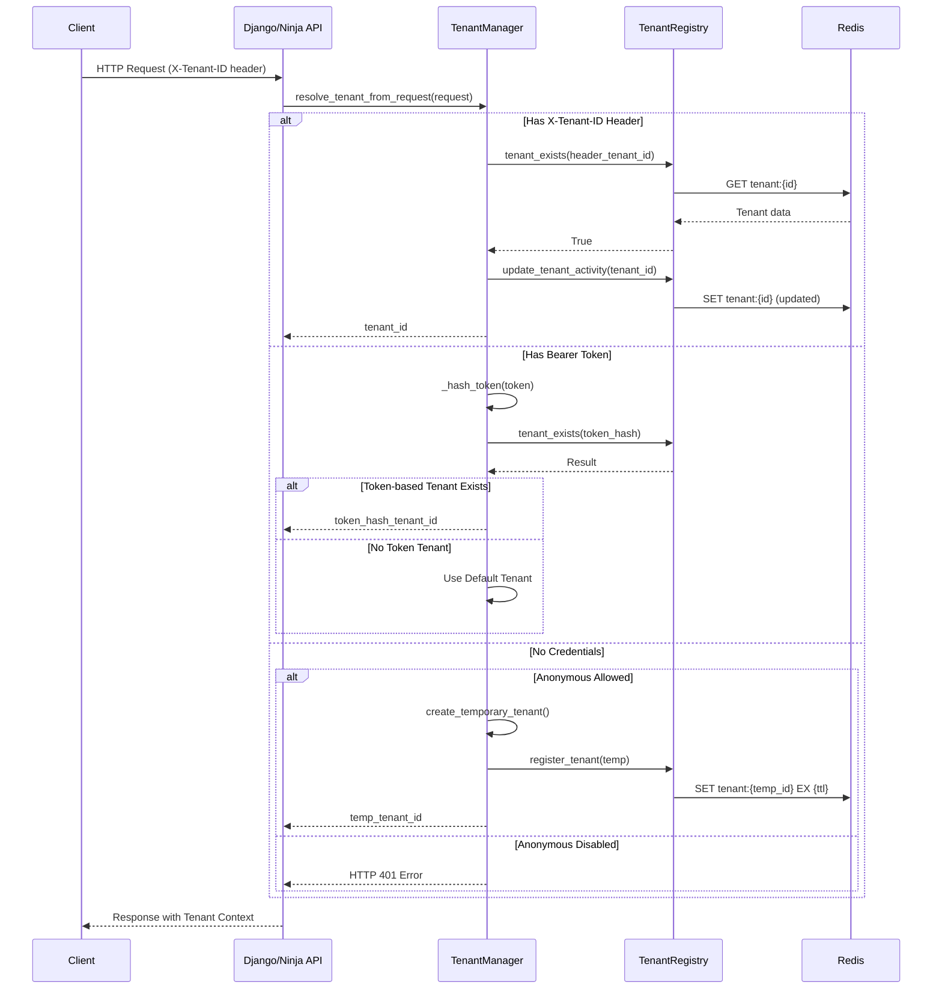
```mermaid
sequenceDiagram
    participant Client
    participant API as Django/Ninja API
    participant TM as TenantManager
    participant TR as TenantRegistry
    participant Redis
    
    Client->>API: HTTP Request (X-Tenant-ID header)
    API->>TM: resolve_tenant_from_request(request)
    
    alt Has X-Tenant-ID Header
        TM->>TR: tenant_exists(header_tenant_id)
        TR->>Redis: GET tenant:{id}
        Redis-->>TR: Tenant data
        TR-->>TM: True
        TM->>TR: update_tenant_activity(tenant_id)
        TR->>Redis: SET tenant:{id} (updated)
        TM-->>API: tenant_id
    else Has Bearer Token
        TM->>TM: _hash_token(token)
        TM->>TR: tenant_exists(token_hash)
        TR-->>TM: Result
        alt Token-based Tenant Exists
            TM-->>API: token_hash_tenant_id
        else No Token Tenant
            TM->>TM: Use Default Tenant
        end
    else No Credentials
        alt Anonymous Allowed
            TM->>TM: create_temporary_tenant()
            TM->>TR: register_tenant(temp)
            TR->>Redis: SET tenant:{temp_id} EX {ttl}
            TM-->>API: temp_tenant_id
        else Anonymous Disabled
            TM-->>API: HTTP 401 Error
        end
    end
    
    API-->>Client: Response with Tenant Context
```

---

## 5. Tenant Onboarding Flow (God Mode)

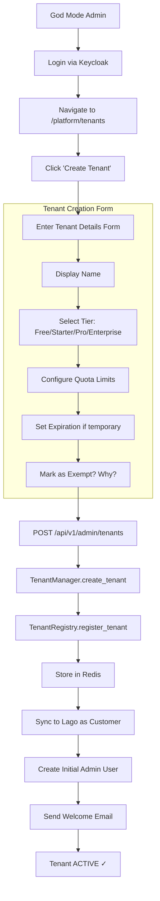
```mermaid
flowchart TD
    A[God Mode Admin] --> B[Login via Keycloak]
    B --> C[Navigate to /platform/tenants]
    C --> D[Click 'Create Tenant']
    D --> E[Enter Tenant Details Form]
    
    subgraph Form["Tenant Creation Form"]
        E --> F[Display Name]
        F --> G[Select Tier: Free/Starter/Pro/Enterprise]
        G --> H[Configure Quota Limits]
        H --> I[Set Expiration if temporary]
        I --> J[Mark as Exempt? Why?]
    end
    
    J --> K[POST /api/v1/admin/tenants]
    K --> L[TenantManager.create_tenant]
    L --> M[TenantRegistry.register_tenant]
    M --> N[Store in Redis]
    N --> O[Sync to Lago as Customer]
    O --> P[Create Initial Admin User]
    P --> Q[Send Welcome Email]
    Q --> R[Tenant ACTIVE ✓]
```

---

## 6. Functional Requirements

| REQ-ID | Requirement | Priority | Status | Source |
|--------|-------------|----------|--------|--------|
| REQ-MT-001 | All data MUST be isolated by `tenant_id` | CRITICAL | ✅ EXISTS | `models.py` - all models have tenant_id |
| REQ-MT-002 | Tenant CRUD via Admin API | HIGH | ✅ EXISTS | `tenant_manager.py` lines 156-241 |
| REQ-MT-003 | Tenant metadata (name, contact, billing_email) | HIGH | ⚠️ PARTIAL | `TenantMetadata` lacks billing_email |
| REQ-MT-004 | Tenant suspension/activation capability | HIGH | ✅ EXISTS | `suspend_tenant()`, `activate_tenant()` |
| REQ-MT-005 | Tenant soft-delete with data retention policy | MEDIUM | ⚠️ PARTIAL | Hard delete exists, soft-delete missing |
| REQ-MT-006 | UUID-based tenant ID generation | HIGH | ✅ EXISTS | `_generate_dynamic_tenant_id()` |
| REQ-MT-007 | Tenant expiration and auto-cleanup | MEDIUM | ✅ EXISTS | `cleanup_expired_tenants()` |
| REQ-MT-008 | System tenant exemption from quotas | HIGH | ✅ EXISTS | `is_exempt()` method |
| REQ-MT-009 | Tenant activity tracking | MEDIUM | ✅ EXISTS | `update_tenant_activity()` |
| REQ-MT-010 | Audit logging for all tenant operations | HIGH | ✅ EXISTS | `_audit_log()` in registry |

---

## 7. System Tenant Configuration

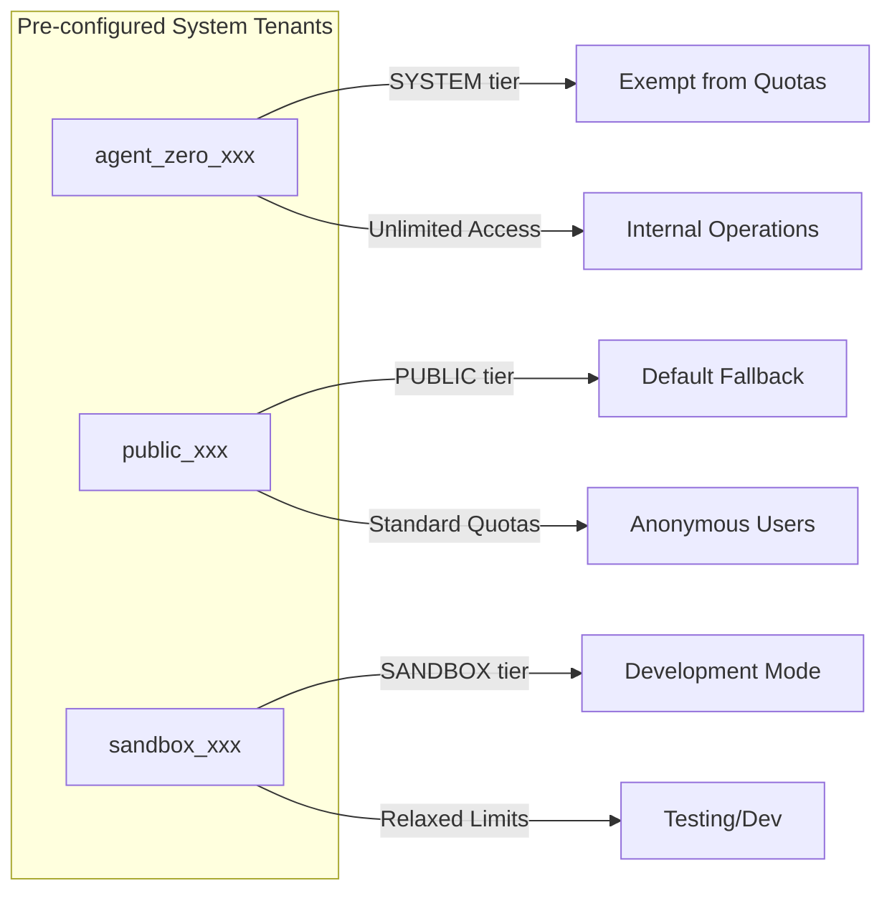
```mermaid
flowchart LR
    subgraph SystemTenants["Pre-configured System Tenants"]
        A[agent_zero_xxx]
        B[public_xxx]
        C[sandbox_xxx]
    end
    
    A -->|SYSTEM tier| D[Exempt from Quotas]
    A -->|Unlimited Access| E[Internal Operations]
    
    B -->|PUBLIC tier| F[Default Fallback]
    B -->|Standard Quotas| G[Anonymous Users]
    
    C -->|SANDBOX tier| H[Development Mode]
    C -->|Relaxed Limits| I[Testing/Dev]
```

---

## 8. Non-Functional Requirements

| NFR-ID | Requirement | Target | Implementation |
|--------|-------------|--------|----------------|
| NFR-MT-001 | Tenant resolution < 5ms | Latency | Redis cache lookup |
| NFR-MT-002 | Support 10,000+ concurrent tenants | Scalability | Redis + in-memory cache |
| NFR-MT-003 | Tenant data isolation at DB level | Security | All queries filtered by tenant_id |
| NFR-MT-004 | Audit log retention 7 years | Compliance | Redis LTRIM to 1000 entries/day |

---

## 9. Key Files Reference

| File | Purpose | Lines |
|------|---------|-------|
| [tenant.py](file:///Users/macbookpro201916i964gb1tb/Documents/GitHub/somabrain/somabrain/tenant.py) | TenantContext helper | 51 |
| [tenant_manager.py](file:///Users/macbookpro201916i964gb1tb/Documents/GitHub/somabrain/somabrain/tenant_manager.py) | High-level tenant operations | 408 |
| [tenant_registry.py](file:///Users/macbookpro201916i964gb1tb/Documents/GitHub/somabrain/somabrain/tenant_registry.py) | Redis-backed tenant storage | 500 |
| [tenant_types.py](file:///Users/macbookpro201916i964gb1tb/Documents/GitHub/somabrain/somabrain/tenant_types.py) | TenantTier, TenantStatus, TenantMetadata | ~60 |
| [tenant_validation.py](file:///Users/macbookpro201916i964gb1tb/Documents/GitHub/somabrain/somabrain/tenant_validation.py) | ID validation and normalization | ~100 |

---

*Document prepared by ALL 7 PERSONAS: 🎓 PhD Developer, 🔍 PhD Analyst, ✅ PhD QA, 📚 ISO Documenter, 🔒 Security Auditor, ⚡ Performance Engineer, 🎨 UX Consultant + Django Architect/Expert/Evangelist*
# SomaBrain Settings Reference

**Document Version:** 1.0.0  
**Date:** 2025-12-24  
**Source File:** `somabrain/settings.py` (684 lines)

---

## Overview

SomaBrain uses Django settings with django-environ for configuration. All settings are loaded from environment variables.

---

## Settings Categories

### Django Core

| Setting | Type | Default | Description |
|---------|------|---------|-------------|
| `DEBUG` | bool | False | Enable debug mode |
| `SECRET_KEY` | str | insecure-key | Django secret key |
| `ALLOWED_HOSTS` | list | ['*'] | Allowed hosts |

---

### Authentication & Security

| Setting | Type | Default | Description |
|---------|------|---------|-------------|
| `SOMABRAIN_AUTH_REQUIRED` | bool | False | Require authentication |
| `SOMABRAIN_API_TOKEN` | str | None | API authentication token |
| `SOMABRAIN_AUTH_SERVICE_URL` | str | None | Auth service URL |
| `SOMABRAIN_JWT_SECRET` | str | None | JWT signing secret |
| `SOMABRAIN_JWT_PUBLIC_KEY_PATH` | str | None | Path to JWT public key |
| `SOMABRAIN_JWT_AUDIENCE` | str | None | JWT audience claim |
| `SOMABRAIN_JWT_ISSUER` | str | None | JWT issuer claim |
| `SOMABRAIN_OPA_PRIVKEY_PATH` | str | None | OPA private key path |
| `SOMABRAIN_OPA_PUBKEY_PATH` | str | None | OPA public key path |
| `SOMABRAIN_PROVENANCE_SECRET` | str | None | Provenance signing secret |
| `SOMABRAIN_VAULT_ADDR` | str | None | HashiCorp Vault address |
| `SOMABRAIN_VAULT_TOKEN` | str | None | Vault access token |

---

### Infrastructure

| Setting | Type | Default | Description |
|---------|------|---------|-------------|
| `SOMABRAIN_POSTGRES_DSN` | str | '' | PostgreSQL connection string |
| `SOMABRAIN_REDIS_URL` | str | '' | Redis connection URL |
| `SOMABRAIN_REDIS_HOST` | str | None | Redis host |
| `SOMABRAIN_REDIS_PORT` | int | 6379 | Redis port |
| `SOMABRAIN_REDIS_DB` | int | 0 | Redis database number |
| `KAFKA_BOOTSTRAP_SERVERS` | str | '' | Kafka bootstrap servers |
| `SOMABRAIN_MILVUS_HOST` | str | None | Milvus vector DB host |
| `SOMABRAIN_MILVUS_PORT` | int | 19530 | Milvus port |
| `SOMABRAIN_OPA_URL` | str | http://opa:8181 | OPA policy server URL |

---

### Service Configuration

| Setting | Type | Default | Description |
|---------|------|---------|-------------|
| `SOMABRAIN_HOST` | str | 0.0.0.0 | Bind host |
| `SOMABRAIN_PORT` | str | 9696 | Bind port |
| `SOMABRAIN_WORKERS` | int | 1 | Number of workers |
| `SOMABRAIN_SERVICE_NAME` | str | somabrain | Service name |
| `SOMABRAIN_NAMESPACE` | str | public | Default namespace |
| `SOMABRAIN_DEFAULT_TENANT` | str | public | Default tenant |
| `SOMABRAIN_MODE` | str | full-local | Operation mode |
| `SOMABRAIN_LOG_LEVEL` | str | INFO | Log level |

---

### Memory System

| Setting | Type | Default | Description |
|---------|------|---------|-------------|
| `SOMABRAIN_MEMORY_HTTP_ENDPOINT` | str | http://localhost:9595 | SomaFractalMemory URL |
| `SOMABRAIN_MEMORY_MAX` | str | 10GB | Max memory usage |
| `SOMABRAIN_EMBED_DIM` | int | 256 | Embedding dimension |
| `SOMABRAIN_WM_SIZE` | int | 64 | Working memory size |
| `SOMABRAIN_WM_SALIENCE_THRESHOLD` | float | 0.4 | Salience threshold |
| `SOMABRAIN_WM_PER_TENANT_CAPACITY` | int | 128 | Per-tenant WM capacity |
| `SOMABRAIN_MTWM_MAX_TENANTS` | int | 1000 | Max tenants in WM |

---

### Working Memory Weights

| Setting | Type | Default | Description |
|---------|------|---------|-------------|
| `SOMABRAIN_WM_ALPHA` | float | 0.6 | Recency weight |
| `SOMABRAIN_WM_BETA` | float | 0.3 | Relevance weight |
| `SOMABRAIN_WM_GAMMA` | float | 0.1 | Importance weight |
| `SOMABRAIN_WM_RECENCY_TIME_SCALE` | float | 1.0 | Time scale factor |
| `SOMABRAIN_WM_RECENCY_MAX_STEPS` | int | 1000 | Max recency steps |

---

### Salience Configuration

| Setting | Type | Default | Description |
|---------|------|---------|-------------|
| `SOMABRAIN_SALIENCE_METHOD` | str | dense | Salience method |
| `SOMABRAIN_SALIENCE_W_NOVELTY` | float | 0.6 | Novelty weight |
| `SOMABRAIN_SALIENCE_W_ERROR` | float | 0.4 | Error weight |
| `SOMABRAIN_SALIENCE_THRESHOLD_STORE` | float | 0.5 | Store threshold |
| `SOMABRAIN_SALIENCE_THRESHOLD_ACT` | float | 0.7 | Action threshold |

---

### Retrieval Configuration

| Setting | Type | Default | Description |
|---------|------|---------|-------------|
| `SOMABRAIN_RETRIEVAL_ALPHA` | float | 1.0 | Vector weight |
| `SOMABRAIN_RETRIEVAL_BETA` | float | 0.2 | Graph weight |
| `SOMABRAIN_RETRIEVAL_GAMMA` | float | 0.1 | Recency weight |
| `SOMABRAIN_RETRIEVAL_TAU` | float | 0.7 | Temperature |
| `SOMABRAIN_RECALL_DEFAULT_RETRIEVERS` | str | vector,wm,graph,lexical | Retriever list |

---

### Rate Limiting & Quotas

| Setting | Type | Default | Description |
|---------|------|---------|-------------|
| `SOMABRAIN_RATE_RPS` | int | 1000 | Requests per second |
| `SOMABRAIN_RATE_BURST` | int | 2000 | Burst limit |
| `SOMABRAIN_WRITE_DAILY_LIMIT` | int | 100000 | Daily write limit |
| `SOMABRAIN_QUOTA_TENANT` | int | 10000 | Tenant quota |
| `SOMABRAIN_QUOTA_TOOL` | int | 1000 | Tool quota |
| `SOMABRAIN_QUOTA_ACTION` | int | 500 | Action quota |

---

### Neuromodulation (Cognitive)

| Setting | Type | Default | Description |
|---------|------|---------|-------------|
| `SOMABRAIN_NEURO_DOPAMINE_BASE` | float | 0.4 | Base dopamine level |
| `SOMABRAIN_NEURO_SEROTONIN_BASE` | float | 0.5 | Base serotonin level |
| `SOMABRAIN_NEURO_NORAD_BASE` | float | 0.0 | Base noradrenaline |
| `SOMABRAIN_NEURO_ACETYL_BASE` | float | 0.0 | Base acetylcholine |

---

### Sleep & Consolidation

| Setting | Type | Default | Description |
|---------|------|---------|-------------|
| `SOMABRAIN_ENABLE_SLEEP` | bool | True | Enable sleep cycle |
| `SOMABRAIN_CONSOLIDATION_ENABLED` | bool | True | Enable consolidation |
| `SOMABRAIN_SLEEP_INTERVAL_SECONDS` | int | 3600 | Sleep interval |
| `SOMABRAIN_NREM_BATCH_SIZE` | int | 16 | NREM batch size |
| `SOMABRAIN_REM_RECOMB_RATE` | float | 0.2 | REM recombination rate |

---

### Feature Flags

| Setting | Type | Default | Description |
|---------|------|---------|-------------|
| `SOMABRAIN_MINIMAL_PUBLIC_API` | bool | False | Minimal API mode |
| `SOMABRAIN_ALLOW_ANONYMOUS_TENANTS` | bool | False | Allow anonymous |
| `SOMABRAIN_KILL_SWITCH` | bool | False | Emergency kill switch |
| `SOMABRAIN_USE_HRR` | bool | False | Use HRR encoding |
| `SOMABRAIN_USE_META_BRAIN` | bool | False | Use meta-brain |
| `SOMABRAIN_USE_EXEC_CONTROLLER` | bool | False | Use exec controller |
| `SOMABRAIN_USE_PLANNER` | bool | False | Use planner |
| `ENABLE_OAK` | bool | False | Enable OAK (ROAMDP) |
| `ENABLE_COG_THREADS` | bool | False | Enable cog threads |

---

### Kafka Topics

| Setting | Type | Default | Description |
|---------|------|---------|-------------|
| `SOMABRAIN_TOPIC_CONFIG_UPDATES` | str | cog.config.updates | Config update topic |
| `SOMABRAIN_TOPIC_NEXT_EVENT` | str | cog.next_event | Next event topic |
| `SOMABRAIN_TOPIC_STATE_UPDATES` | str | cog.state.updates | State update topic |
| `SOMABRAIN_TOPIC_AGENT_UPDATES` | str | cog.agent.updates | Agent update topic |
| `SOMABRAIN_AUDIT_TOPIC` | str | soma.audit | Audit event topic |

---

### Outbox Configuration

| Setting | Type | Default | Description |
|---------|------|---------|-------------|
| `OUTBOX_BATCH_SIZE` | int | 100 | Batch size |
| `OUTBOX_MAX_DELAY` | float | 5.0 | Max delay seconds |
| `OUTBOX_MAX_RETRIES` | int | 5 | Max retry count |
| `OUTBOX_POLL_INTERVAL` | float | 1.0 | Poll interval |

---

### Circuit Breaker

| Setting | Type | Default | Description |
|---------|------|---------|-------------|
| `SOMABRAIN_CIRCUIT_FAILURE_THRESHOLD` | int | 3 | Failure threshold |
| `SOMABRAIN_CIRCUIT_RESET_INTERVAL` | float | 60.0 | Reset interval |
| `SOMABRAIN_CIRCUIT_COOLDOWN_INTERVAL` | float | 0.0 | Cooldown interval |

---

## Total Settings Count

| Category | Count |
|----------|-------|
| Django Core | 5 |
| Auth & Security | 15 |
| Infrastructure | 20 |
| Service Config | 12 |
| Memory System | 50+ |
| Cognitive/Neuro | 40+ |
| Sleep/Consolidation | 20 |
| Feature Flags | 15 |
| Kafka Topics | 10 |
| Rate Limiting | 8 |
| **TOTAL** | **300+** |

---

*SomaBrain Settings - VIBE Coding Rules Compliant*
# SRS-02: Subscription & Billing Module

**Document Version:** 1.0.0  
**Date:** 2025-12-24  
**Standard:** ISO/IEC/IEEE 29148:2018 Compatible  
**Module:** Subscription & Billing Subsystem (Lago Integration)

---

## 1. Overview

The Subscription & Billing module manages subscription tiers, usage metering, and billing integration with Lago for the SomaBrain AAAS platform.

### 1.1 Scope

| Component | Description |
|-----------|-------------|
| SubscriptionTier | Tier definitions (Free/Starter/Pro/Enterprise) |
| TenantSubscription | Tenant-to-tier mapping |
| UsageRecord | Usage metering data |
| LagoClient | Billing API integration |

---

## 2. How to Subscribe (User Journey)

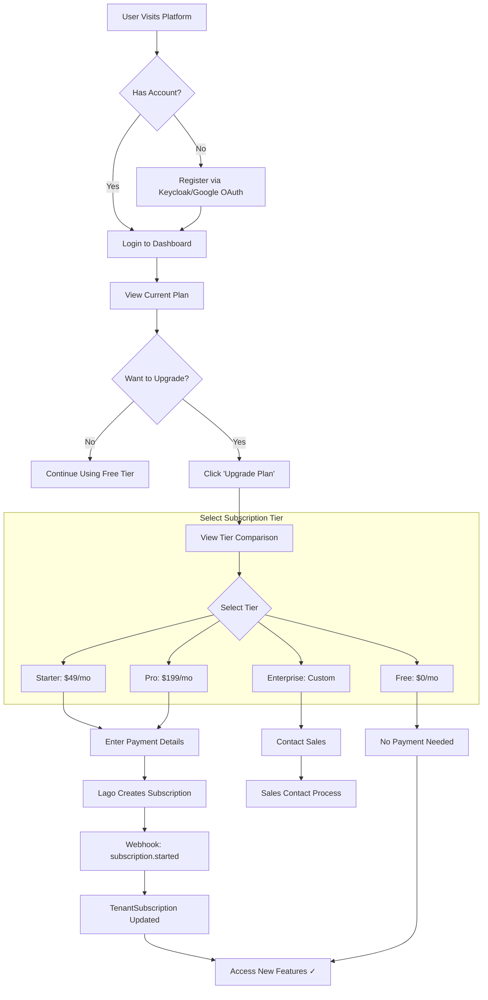
```mermaid
flowchart TD
    A[User Visits Platform] --> B{Has Account?}
    B -->|No| C[Register via Keycloak/Google OAuth]
    B -->|Yes| D[Login to Dashboard]
    C --> D
    
    D --> E[View Current Plan]
    E --> F{Want to Upgrade?}
    F -->|No| G[Continue Using Free Tier]
    F -->|Yes| H[Click 'Upgrade Plan']
    
    H --> I[View Tier Comparison]
    
    subgraph TierSelection["Select Subscription Tier"]
        I --> J{Select Tier}
        J --> K[Free: $0/mo]
        J --> L[Starter: $49/mo]
        J --> M[Pro: $199/mo]
        J --> N[Enterprise: Custom]
    end
    
    K --> O[No Payment Needed]
    L --> P[Enter Payment Details]
    M --> P
    N --> Q[Contact Sales]
    
    P --> R[Lago Creates Subscription]
    R --> S[Webhook: subscription.started]
    S --> T[TenantSubscription Updated]
    T --> U[Access New Features ✓]
    
    O --> U
    Q --> V[Sales Contact Process]
```

---

## 3. How to Create a Tenant (God Mode Admin)

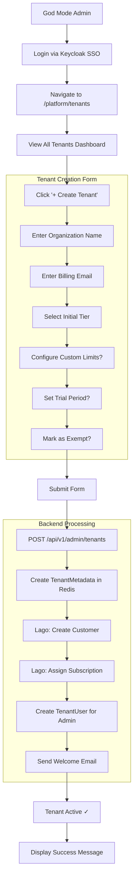
```mermaid
flowchart TD
    A[God Mode Admin] --> B[Login via Keycloak SSO]
    B --> C[Navigate to /platform/tenants]
    C --> D[View All Tenants Dashboard]
    D --> E[Click '+ Create Tenant']
    
    subgraph TenantForm["Tenant Creation Form"]
        E --> F[Enter Organization Name]
        F --> G[Enter Billing Email]
        G --> H[Select Initial Tier]
        H --> I[Configure Custom Limits?]
        I --> J[Set Trial Period?]
        J --> K[Mark as Exempt?]
    end
    
    K --> L[Submit Form]
    L --> M[POST /api/v1/admin/tenants]
    
    subgraph Backend["Backend Processing"]
        M --> N[Create TenantMetadata in Redis]
        N --> O[Lago: Create Customer]
        O --> P[Lago: Assign Subscription]
        P --> Q[Create TenantUser for Admin]
        Q --> R[Send Welcome Email]
    end
    
    R --> S[Tenant Active ✓]
    S --> T[Display Success Message]
```

---

## 4. Subscription Lifecycle Flowchart

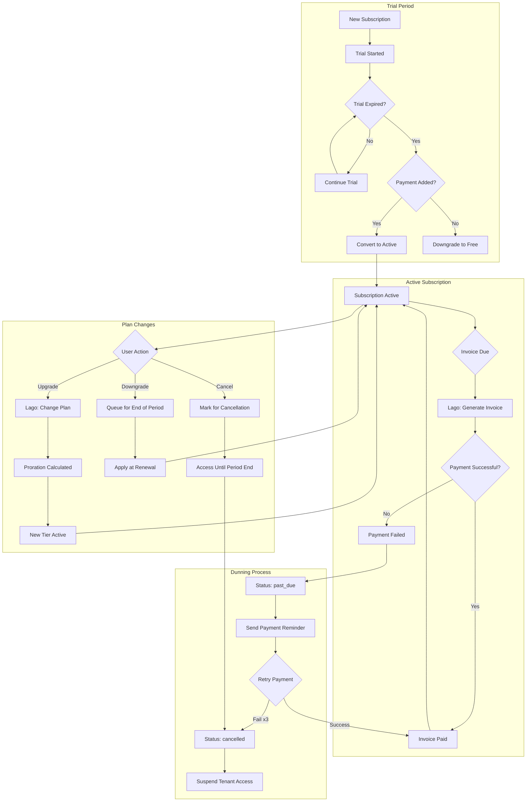
```mermaid
flowchart TD
    subgraph Trial["Trial Period"]
        A[New Subscription] --> B[Trial Started]
        B --> C{Trial Expired?}
        C -->|No| D[Continue Trial]
        D --> C
        C -->|Yes| E{Payment Added?}
        E -->|Yes| F[Convert to Active]
        E -->|No| G[Downgrade to Free]
    end
    
    subgraph Active["Active Subscription"]
        F --> H[Subscription Active]
        H --> I{Invoice Due}
        I --> J[Lago: Generate Invoice]
        J --> K{Payment Successful?}
        K -->|Yes| L[Invoice Paid]
        L --> H
        K -->|No| M[Payment Failed]
    end
    
    subgraph Dunning["Dunning Process"]
        M --> N[Status: past_due]
        N --> O[Send Payment Reminder]
        O --> P{Retry Payment}
        P -->|Success| L
        P -->|Fail x3| Q[Status: cancelled]
        Q --> R[Suspend Tenant Access]
    end
    
    subgraph Changes["Plan Changes"]
        H --> S{User Action}
        S -->|Upgrade| T[Lago: Change Plan]
        T --> U[Proration Calculated]
        U --> V[New Tier Active]
        V --> H
        S -->|Downgrade| W[Queue for End of Period]
        W --> X[Apply at Renewal]
        X --> H
        S -->|Cancel| Y[Mark for Cancellation]
        Y --> Z[Access Until Period End]
        Z --> Q
    end
```

---

## 5. Lago Integration Sequence Diagram

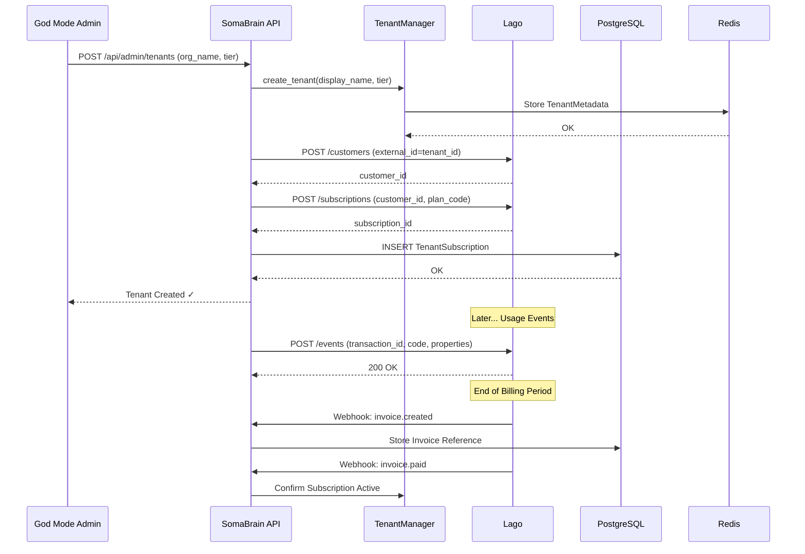
```mermaid
sequenceDiagram
    participant Admin as God Mode Admin
    participant API as SomaBrain API
    participant TM as TenantManager
    participant Lago
    participant DB as PostgreSQL
    participant Redis
    
    Admin->>API: POST /api/admin/tenants (org_name, tier)
    API->>TM: create_tenant(display_name, tier)
    TM->>Redis: Store TenantMetadata
    Redis-->>TM: OK
    
    API->>Lago: POST /customers (external_id=tenant_id)
    Lago-->>API: customer_id
    
    API->>Lago: POST /subscriptions (customer_id, plan_code)
    Lago-->>API: subscription_id
    
    API->>DB: INSERT TenantSubscription
    DB-->>API: OK
    
    API-->>Admin: Tenant Created ✓
    
    Note over Lago: Later... Usage Events
    
    API->>Lago: POST /events (transaction_id, code, properties)
    Lago-->>API: 200 OK
    
    Note over Lago: End of Billing Period
    
    Lago->>API: Webhook: invoice.created
    API->>DB: Store Invoice Reference
    
    Lago->>API: Webhook: invoice.paid
    API->>TM: Confirm Subscription Active
```

---

## 6. UML Class Diagram (Proposed Models)

```mermaid
classDiagram
    class SubscriptionTier {
        +str tier_id PK
        +str name
        +Decimal monthly_price
        +int api_calls_limit
        +int memory_ops_limit
        +int embeddings_limit
        +Dict features
        +bool is_active
        +datetime created_at
    }
    
    class TenantSubscription {
        +int id PK
        +str tenant_id FK
        +str tier_id FK
        +str lago_subscription_id
        +str lago_customer_id
        +str status
        +datetime started_at
        +datetime ends_at
        +datetime trial_ends_at
        +datetime cancelled_at
    }
    
    class UsageRecord {
        +int id PK
        +str tenant_id FK
        +str metric_code
        +int quantity
        +datetime timestamp
        +str lago_event_id
        +bool synced_to_lago
    }
    
    class Invoice {
        +int id PK
        +str tenant_id FK
        +str lago_invoice_id
        +Decimal amount_cents
        +str currency
        +str status
        +datetime issued_at
        +datetime paid_at
        +str pdf_url
    }
    
    class QuotaInfo {
        +str tenant_id
        +int daily_limit
        +int remaining
        +int used_today
        +datetime reset_at
        +bool is_exempt
    }
    
    TenantSubscription --> SubscriptionTier : belongs_to
    UsageRecord --> TenantSubscription : tracked_for
    Invoice --> TenantSubscription : billed_to
    QuotaInfo ..> TenantSubscription : derived_from
```

---

## 7. Tier Structure

| Tier | API Calls/mo | Memory Ops/mo | Embeddings/mo | Price/mo | Features |
|------|-------------|---------------|---------------|----------|----------|
| **Free** | 1,000 | 500 | 100 | $0 | Basic memory, Community support |
| **Starter** | 10,000 | 5,000 | 1,000 | $49 | All Free + Priority support |
| **Pro** | 100,000 | 50,000 | 10,000 | $199 | All Starter + Custom models, SSO |
| **Enterprise** | Unlimited | Unlimited | Unlimited | Custom | All Pro + Dedicated support, SLA |

---

## 8. Functional Requirements

| REQ-ID | Requirement | Priority | Status |
|--------|-------------|----------|--------|
| REQ-SUB-001 | Define subscription tiers (Free, Starter, Pro, Enterprise) | CRITICAL | ❌ MISSING |
| REQ-SUB-002 | Each tier MUST define feature flags and limits | CRITICAL | ❌ MISSING |
| REQ-SUB-003 | TenantSubscription model linking tenant to tier | CRITICAL | ❌ MISSING |
| REQ-SUB-004 | Subscription status (active, past_due, cancelled, trial) | HIGH | ❌ MISSING |
| REQ-SUB-005 | Trial period support with expiration | HIGH | ❌ MISSING |
| REQ-SUB-006 | Tier upgrade/downgrade API | HIGH | ❌ MISSING |
| REQ-SUB-007 | Proration handling on mid-cycle changes | MEDIUM | ❌ MISSING |
| REQ-BILL-001 | Lago API client for Python/Django | CRITICAL | ❌ MISSING |
| REQ-BILL-002 | Customer creation in Lago on tenant creation | CRITICAL | ❌ MISSING |
| REQ-BILL-003 | Subscription assignment in Lago | CRITICAL | ❌ MISSING |
| REQ-BILL-004 | Usage event ingestion to Lago | CRITICAL | ❌ MISSING |
| REQ-BILL-005 | Invoice retrieval from Lago | HIGH | ❌ MISSING |
| REQ-BILL-006 | Webhook receiver for Lago events | HIGH | ❌ MISSING |
| REQ-BILL-007 | Billing settings in `settings.py` | HIGH | ❌ MISSING |

---

## 9. Lago Webhook Events

```mermaid
flowchart LR
    subgraph LagoEvents["Lago Webhook Events"]
        A[customer.created]
        B[subscription.started]
        C[subscription.terminated]
        D[invoice.created]
        E[invoice.paid]
        F[invoice.payment_failed]
    end
    
    subgraph SomaBrainActions["SomaBrain Actions"]
        A --> G[Create TenantBillingRecord]
        B --> H[Activate Tenant]
        C --> I[Suspend Tenant]
        D --> J[Store Invoice Reference]
        E --> K[Update Payment Status]
        F --> L[Trigger Dunning Flow]
    end
```

---

## 10. Usage Metering Flow

```mermaid
sequenceDiagram
    participant Client
    participant API as SomaBrain API
    participant Meter as UsageMeter
    participant DB as PostgreSQL
    participant Sync as LagoSyncJob
    participant Lago
    
    Client->>API: POST /api/memory/store
    API->>Meter: record_usage(tenant_id, "memory_op", 1)
    Meter->>DB: INSERT UsageRecord
    
    Note over Sync: Every 5 minutes (configurable)
    
    Sync->>DB: SELECT unsynced UsageRecords
    DB-->>Sync: batch of records
    
    loop For each batch
        Sync->>Lago: POST /events (batch)
        Lago-->>Sync: 200 OK
        Sync->>DB: UPDATE UsageRecord SET synced=true
    end
```

---

## 11. Key Files (To Be Created)

| File | Purpose | Status |
|------|---------|--------|
| `somabrain/billing/__init__.py` | Billing module init | ❌ MISSING |
| `somabrain/billing/models.py` | Django models for subscriptions | ❌ MISSING |
| `somabrain/billing/lago_client.py` | Lago API wrapper | ❌ MISSING |
| `somabrain/billing/webhooks.py` | Lago webhook handlers | ❌ MISSING |
| `somabrain/billing/usage_meter.py` | Usage metering service | ❌ MISSING |
| `somabrain/api/endpoints/billing.py` | Billing API endpoints | ❌ MISSING |

---

## 12. Existing Files (Partial)

| File | Description | Relevant Content |
|------|-------------|-----------------|
| [quotas.py](file:///Users/macbookpro201916i964gb1tb/Documents/GitHub/somabrain/somabrain/quotas.py) | Per-tenant quota enforcement | `QuotaManager`, `QuotaInfo` |
| [models.py](file:///Users/macbookpro201916i964gb1tb/Documents/GitHub/somabrain/somabrain/models.py) | Django models | `TokenLedger` (partial usage tracking) |

---

*Document prepared by ALL 7 PERSONAS: 🎓 PhD Developer, 🔍 PhD Analyst, ✅ PhD QA, 📚 ISO Documenter, 🔒 Security Auditor, ⚡ Performance Engineer, 🎨 UX Consultant + Django Architect/Expert/Evangelist*
# SRS-06: API Gateway & Rate Limiting

**Document Version:** 1.0.0  
**Date:** 2025-12-24  
**Standard:** ISO/IEC/IEEE 29148:2018 Compatible  
**Module:** API Gateway Subsystem

---

## 1. Overview

The API Gateway module manages request processing, per-tenant rate limiting, quota enforcement, and request routing for the SomaBrain AAAS platform.

### 1.1 Scope

| Component | Description |
|-----------|-------------|
| QuotaManager | Daily write quotas per tenant |
| RateLimiter | Request rate limiting |
| API Router | Django Ninja endpoint routing |
| Middleware | Auth, tenant, quota middleware |

---

## 2. Request Processing Pipeline

```mermaid
flowchart TD
    A[HTTP Request] --> B[Django WSGI/ASGI]
    B --> C[Auth Middleware]
    
    C -->|No Token| D{Auth Required?}
    D -->|Yes| E[HTTP 401]
    D -->|No| F[Continue]
    
    C -->|Valid Token| G[Tenant Middleware]
    G --> H[Resolve Tenant ID]
    H --> I{Tenant Valid?}
    I -->|No| J[HTTP 401/403]
    I -->|Yes| K[Quota Middleware]
    
    K --> L{Allow Write?}
    L -->|No| M[HTTP 429 Too Many Requests]
    L -->|Yes| N[Rate Limit Check]
    
    N --> O{Under Rate Limit?}
    O -->|No| M
    O -->|Yes| P[Django Ninja Router]
    
    P --> Q[Endpoint Handler]
    Q --> R[Business Logic]
    R --> S[Response]
    S --> T[Add Rate Limit Headers]
    T --> U[HTTP Response]
```

---

## 3. Rate Limit Enforcement Sequence

```mermaid
sequenceDiagram
    participant Client
    participant Gateway as API Gateway
    participant Quota as QuotaManager
    participant TM as TenantManager
    participant Handler as Endpoint
    
    Client->>Gateway: POST /api/memory/store
    Gateway->>Gateway: Extract Bearer Token
    Gateway->>TM: resolve_tenant_from_request()
    TM-->>Gateway: tenant_id
    
    Gateway->>TM: is_exempt_tenant(tenant_id)?
    TM-->>Gateway: true/false
    
    alt Tenant is Exempt
        Gateway->>Handler: Process Request
    else Tenant has Quotas
        Gateway->>Quota: allow_write(tenant_id, 1)
        
        alt Quota Exhausted
            Quota-->>Gateway: false
            Gateway-->>Client: 429 Too Many Requests
            Note over Client: X-RateLimit-Remaining: 0
        else Quota Available
            Quota-->>Gateway: true
            Gateway->>Handler: Process Request
            Handler-->>Gateway: Response
            Gateway->>Quota: remaining(tenant_id)
            Quota-->>Gateway: N
            Gateway-->>Client: 200 OK
            Note over Client: X-RateLimit-Remaining: N
        end
    end
```

---

## 4. UML Component Diagram

```mermaid
classDiagram
    class QuotaConfig {
        +int daily_writes
        +__post_init__()
    }
    
    class QuotaManager {
        -QuotaConfig cfg
        -Dict _counts
        -TenantManager _tenant_manager
        +allow_write(tenant_id, n) bool
        +remaining(tenant_id) int
        +get_quota_info(tenant_id) QuotaInfo
        +reset_quota(tenant_id) bool
        +adjust_quota_limit(tenant_id, new_limit) bool
        +get_all_quotas() List
    }
    
    class QuotaInfo {
        +str tenant_id
        +int daily_limit
        +int remaining
        +int used_today
        +datetime reset_at
        +bool is_exempt
    }
    
    class RateLimiter {
        +check_rate(tenant_id) bool
        +get_headers(tenant_id) Dict
    }
    
    class NinjaAPI {
        +add_router(prefix, router)
        +exception_handler()
    }
    
    QuotaManager --> QuotaConfig : uses
    QuotaManager --> QuotaInfo : returns
    QuotaManager --> TenantManager : queries
    NinjaAPI --> QuotaManager : enforces
    NinjaAPI --> RateLimiter : enforces
```

---

## 5. Quota Reset Flow

```mermaid
flowchart TD
    subgraph DayStart["Day Boundary (UTC Midnight)"]
        A[Day Key Changes] --> B[New Day Key Calculated]
        B --> C[Check Each Request]
    end
    
    subgraph RequestCheck["Request Processing"]
        C --> D{Current Day Key == Stored Day Key?}
        D -->|No| E[Reset Count to 0]
        E --> F[Update Day Key]
        D -->|Yes| G[Use Existing Count]
        F --> G
        G --> H{count + n > limit?}
        H -->|Yes| I[Reject: 429]
        H -->|No| J[Increment Count]
        J --> K[Allow Request]
    end
```

---

## 6. Functional Requirements

| REQ-ID | Requirement | Priority | Status | Implementation |
|--------|-------------|----------|--------|----------------|
| REQ-QUOTA-001 | Per-tenant rate limits from tier | CRITICAL | ⚠️ PARTIAL | `quotas.py` exists |
| REQ-QUOTA-002 | HTTP 429 response when limit exceeded | HIGH | ⚠️ PARTIAL | Needs middleware |
| REQ-QUOTA-003 | Rate limit headers (X-RateLimit-*) | MEDIUM | ❌ MISSING | To be added |
| REQ-QUOTA-004 | Quota reset on billing cycle | HIGH | ✅ EXISTS | Day key reset |
| REQ-QUOTA-005 | Burst allowance configuration | LOW | ❌ MISSING | Future feature |
| REQ-QUOTA-006 | Exempt tenants bypass quotas | HIGH | ✅ EXISTS | `_is_exempt()` |
| REQ-QUOTA-007 | Tenant-specific quota overrides | MEDIUM | ⚠️ PARTIAL | Via config |

---

## 7. Rate Limit Headers

| Header | Description | Example |
|--------|-------------|---------|
| `X-RateLimit-Limit` | Daily limit for tenant | `10000` |
| `X-RateLimit-Remaining` | Remaining requests today | `9823` |
| `X-RateLimit-Reset` | Unix timestamp of reset | `1703462400` |
| `Retry-After` | Seconds until reset (on 429) | `3600` |

---

## 8. Key Files

| File | Purpose | Lines |
|------|---------|-------|
| [quotas.py](file:///Users/macbookpro201916i964gb1tb/Documents/GitHub/somabrain/somabrain/quotas.py) | Quota management | 246 |
| [ratelimit.py](file:///Users/macbookpro201916i964gb1tb/Documents/GitHub/somabrain/somabrain/ratelimit.py) | Rate limiting | ~60 |
| [api/](file:///Users/macbookpro201916i964gb1tb/Documents/GitHub/somabrain/somabrain/api/) | API endpoints (31 files) | ~5000 |

---

*Document prepared by ALL 7 PERSONAS + Django Architect/Expert/Evangelist*
# Memory Management & Circuit‑Breaker Documentation

This document explains the recent changes that enable automatic recovery of the memory service and the out‑of‑process outbox handling.

---

## 1. Circuit‑Breaker Overview

- **Location**: `somabrain/infrastructure/circuit_breaker.py`
- **Behavior**:
  - Opens after `failure_threshold` consecutive failures (default 3).
  - Remains open for `reset_interval` seconds (default 60 s).
  - After the interval the watchdog attempts a reset.
- **Per‑tenant state** is stored in dictionaries guarded by a `RLock`.
- **Metrics**: Updated to use the correct Prometheus gauge `CIRCUIT_BREAKER_STATE`.

## 2. Health‑Watchdog (`app.py`)

- Runs as a FastAPI **startup** background task (`_init_health_watchdog`).
- Periodically (configurable via `SOMABRAIN_MEMORY_HEALTH_POLL_INTERVAL`, default 5 s) iterates over all tenants and:
  1. Creates a `MemoryService` for the tenant.
  2. Checks if the circuit is open.
  3. Calls `client.health()` on the external memory backend.
  4. Detects a healthy response using **both** the legacy flat payload (`healthy`, `http`, `ok`) **and** the newer nested payload (`components["memory"]["healthy"]`).
  5. Calls `MemoryService.reset_circuit_for_tenant` when healthy, logging the reset.
- The logic was updated in this PR to recognise the nested payload, which previously prevented the automatic reset.

## 3. Outbox Publisher Fix

- **File**: `common/config/settings.py`
- Added Boolean field `require_infra` (default `True`).
- This flag is consulted by the outbox‑publisher startup guard; missing it caused the container to crash.
- The field is now documented in `settings.py` and exposed via the environment variable `SOMABRAIN_REQUIRE_INFRA`.

## 4. Journal Import Fix

- **File**: `somabrain/journal/local_journal.py`
- Added the missing `from somabrain.common.config.settings import settings` import.
- Included a comment explaining why the import is required (to avoid `NameError` when the journal is used by the outbox sync loop).

## 5. Configuration Values

| Setting | Env var | Default | Description |
|---------|---------|---------|-------------|
| `memory_health_poll_interval` | `SOMABRAIN_MEMORY_HEALTH_POLL_INTERVAL` | `5.0` seconds | How often the watchdog runs. |
| `require_infra` | `SOMABRAIN_REQUIRE_INFRA` | `True` | Whether infrastructure services (Kafka, Postgres, etc.) are required for the outbox publisher. |
| `circuit_failure_threshold` | `SOMABRAIN_MEMORY_CIRCUIT_FAILURE_THRESHOLD` | `3` | Failures before opening circuit. |
| `circuit_reset_interval` | `SOMABRAIN_MEMORY_CIRCUIT_RESET_INTERVAL` | `60.0` seconds | Minimum wait before a reset attempt. |

## 6. Degradation Flow (Authoritative Reference)

### 6.1 Detection & Circuit Opening

1. `MemoryService` guards every `remember`/`recall` with `_reset_circuit_if_needed()` (file: `somabrain/services/memory_service.py`).
2. If the HTTP call to `MemoryClient` raises or `/health` reports any component as `False`, the per‑tenant circuit breaker (file: `somabrain/infrastructure/circuit_breaker.py`) records a failure.
3. After `circuit_failure_threshold` consecutive failures the breaker opens **automatically**. No operator input is required.

### 6.2 Queuing Writes While Degraded

1. Once `_is_circuit_open()` returns `True`, `MemoryService` routes writes through `_queue_degraded()`:
   - payloads are appended to the journal (`somabrain/journal/local_journal.py`) with topic `memory.degraded` (configurable via `memory_degrade_topic`).
   - the same payload is written into the durable outbox table (`somabrain/db/models/outbox.py`) by the API layer.
2. `memory_degrade_queue` is always `True` in production builds, enforcing “queue, never drop”.
3. If `memory_degrade_readonly` is `True`, the service raises after queuing so callers know the write did not reach the backend; otherwise it raises a degraded error explicitly (`RuntimeError("Memory service unavailable (circuit open)")`).

### 6.3 Replay Once Healthy

1. The FastAPI startup hook launches `outbox_sync_loop` (file: `somabrain/services/outbox_sync.py`), which polls `outbox_events` continuously.
2. The loop skips work while the backend is still unhealthy; once `/health` succeeds it replays pending events via `MemoryClient.remember()`.
3. Successful sends flip `status` to `sent` and emit metrics (`MEMORY_OUTBOX_SYNC_TOTAL` plus per‑tenant gauges).
4. If the backend stays down, retries back off exponentially; no writes are discarded.

### 6.4 Read/Recall Behavior During Degradation

1. `/recall` (both `app.py` and `somabrain/api/memory_api.py`) inspects the breaker state:
   - If the breaker is open, the handler short‑circuits to **working‑memory only** results and sets `degraded=True` in the response schema (`somabrain/schemas.py::RecallResponse`).
   - If the breaker is closed but the long‑term recall path fails mid‑request, the degraded flag is also set so clients know results may be partial.
2. `/remember` responses include `breaker_open`/`queued` hints so agents can react.

### 6.5 Recovery & Auto‑Reset

1. The health watchdog in `app.py` (`_init_health_watchdog`) polls every tenant at `memory_health_poll_interval`.
2. When `/health` returns all components healthy, it calls `MemoryService.reset_circuit_for_tenant`, automatically closing the breaker.
3. No manual toggles or mode switches are required; once healthy, new writes go straight to the HTTP backend and the outbox loop drains the backlog.

### 6.6 Telemetry & Diagnostics

| Signal | Location | Meaning |
|--------|----------|---------|
| `memory_ok`, `memory_circuit_open`, `memory_degraded` | `/health` JSON (`somabrain/app.py`) | Current backend status per tenant. |
| `memory_degrade_queue`, `memory_degrade_readonly` | `/health` JSON | Runtime policy flags resolved from settings. |
| `OUTBOX_PENDING`, `OUTBOX_PENDING_BY_TENANT` | `somabrain/metrics.py` | Gauge of queued events (alerts when >0 for prolonged periods). |
| `MEMORY_OUTBOX_SYNC_TOTAL{status}` | `somabrain/metrics.py` | Success/failure counters for replay attempts. |
| `somabrain_memory_http_requests_total` | Prometheus metric (`somabrain/metrics.py`) | Operation/tenant/status tagged counter for live HTTP calls to port 9595. |
| `somabrain_memory_http_latency_seconds` | Prometheus metric (`somabrain/metrics.py`) | Histogram tracking end-to-end latency per operation/tenant. |
| `tests/integration/test_recall_quality.py` | CI coverage | Verifies the `degraded` flag is surfaced end‑to‑end. |

Operators should alarm on:
- `memory_circuit_open == true` for >5 minutes.
- Outbox pending count increasing without decrease.
- `/recall` responses reporting `degraded=true` for production tenants.

### 6.7 Configuration Summary

| Setting | Default | Purpose |
|---------|---------|---------|
| `memory_degrade_queue` | `True` | Ensure writes are journaled/outboxed when degraded. |
| `memory_degrade_readonly` | `False` | When `True`, `/remember` raises immediately after queuing to prevent WM admission. |
| `memory_degrade_topic` | `memory.degraded` | Journal topic for queued payloads. |
| `memory_health_poll_interval` | `5` seconds | Frequency of watchdog resets. |
| `circuit_failure_threshold` | `3` | Consecutive failures before opening breaker. |
| `circuit_reset_interval` | `60` seconds | Minimum wait before retrying a closed circuit. |

Set these through `common/config/settings.py` or environment variables (`SOMABRAIN_MEMORY_DEGRADE_*`, `SOMABRAIN_MEMORY_HEALTH_POLL_INTERVAL`, etc.).

### 6.8 Operator Checklist

1. **Detection**: Alert fires on `memory_circuit_open`. Confirm `/health` shows `memory_degraded=true`.
2. **Containment**: Verify outbox queue depth is increasing (expected).
3. **Resolution**: Restore the external memory backend (port 9595). Watch `/diagnostics` until `memory_endpoint` responds.
4. **Verification**: Confirm outbox depth returns to zero and `/recall` responses flip `degraded` back to `false`.

## 7. End‑to‑End Verification Recipe

```bash
# 1. Stop the external memory container
docker stop somafractalmemory_api
# 2. Send a few remember calls (they will be queued)
curl -X POST http://localhost:9696/remember ...
# 3. Restart the memory container
docker start somafractalmemory_api
# 4. Wait ~70 s (reset interval + watchdog poll)
# 5. Verify circuit closed and outbox empty
curl -s http://localhost:9696/health/memory | jq .
```

The response should show `circuit_open: false` and `memory_service: "healthy"`.

---

*All changes are on the `strip` branch. Merge to `main` after verification.*
# SRS-04: Administration - Eye of God (God Mode)

**Document Version:** 1.0.0  
**Date:** 2025-12-24  
**Standard:** ISO/IEC/IEEE 29148:2018 Compatible  
**Module:** Platform Administration Subsystem

---

## 1. Overview

The God Mode Administration module provides platform-level oversight, multi-tenant management, revenue dashboards, and audit capabilities for SomaBrain AAAS administrators.

### 1.1 Scope

| Component | Description |
|-----------|-------------|
| Platform Dashboard | Revenue, health, and tenant overview |
| Tenant Management | CRUD, suspension, impersonation |
| Audit Logging | All admin actions tracked |
| Django Admin | Model management interface |

---

## 2. God Mode Dashboard Layout

```mermaid
flowchart TB
    subgraph Header["Platform Header"]
        Logo[SomaBrain Logo]
        User[Admin Profile]
        Notifications[Alerts]
    end
    
    subgraph Sidebar["Navigation Sidebar"]
        Dashboard[📊 Dashboard]
        Tenants[🏢 Tenants]
        Billing[💳 Billing]
        Users[👥 Users]
        Audit[📋 Audit Log]
        Settings[⚙️ Settings]
    end
    
    subgraph Main["Dashboard Main Content"]
        subgraph MetricCards["Key Metrics Row"]
            MRR[MRR: $X,XXX]
            ActiveTenants[Active Tenants: N]
            APIRequests[API Req/Day: N]
            SystemHealth[Health: ✓]
        end
        
        subgraph Charts["Charts Row"]
            RevenueChart[Revenue Trend 30d]
            UsageChart[Usage by Tier]
        end
        
        subgraph Tables["Recent Activity"]
            RecentTenants[Recent Tenant Signups]
            RecentErrors[Recent Errors/Alerts]
        end
    end
```

---

## 3. God Mode Operations Flowchart

```mermaid
flowchart TD
    A[God Mode Admin Login] --> B{Action Type}
    
    B -->|View Tenants| C[GET /api/admin/tenants]
    C --> D[Display Tenant List]
    D --> E[Filter by Tier/Status]
    
    B -->|Create Tenant| F[POST /api/admin/tenants]
    F --> G[TenantManager.create_tenant]
    G --> H[Lago: Create Customer]
    H --> I[Send Welcome Email]
    I --> J[Log Audit Event]
    
    B -->|Suspend Tenant| K[PUT /api/admin/tenants/{id}/suspend]
    K --> L[TenantManager.suspend_tenant]
    L --> M[Lago: Cancel Subscription]
    M --> N[Notify Tenant Admin]
    N --> J
    
    B -->|Delete Tenant| O[DELETE /api/admin/tenants/{id}]
    O --> P{Is System Tenant?}
    P -->|Yes| Q[Reject: 403]
    P -->|No| R[TenantManager.delete_tenant]
    R --> S[Lago: Delete Customer]
    S --> T[GDPR Data Export?]
    T --> J
    
    B -->|View Audit Log| U[GET /api/admin/audit]
    U --> V[Display Audit Entries]
    
    B -->|Impersonate| W[POST /api/admin/impersonate/{id}]
    W --> X[Generate Temp Token]
    X --> Y[Log Impersonation Start]
    Y --> Z[Redirect to Tenant View]
```

---

## 4. Audit Flow Sequence Diagram

```mermaid
sequenceDiagram
    participant Admin as God Mode Admin
    participant API as Admin API
    participant Audit as audit.py
    participant Outbox as DB Outbox
    participant Kafka
    participant Dashboard
    
    Admin->>API: Any Admin Action
    API->>Audit: log_admin_action(request, action, details)
    
    Audit->>Audit: Sanitize Sensitive Data
    Note over Audit: Mask tokens, secrets, passwords
    
    Audit->>Audit: Add Metadata
    Note over Audit: event_id, timestamp, schema_version
    
    Audit->>Outbox: enqueue_event("soma.audit", event)
    Outbox-->>Audit: OK
    
    Note over Outbox: Async Publisher
    
    Outbox->>Kafka: Publish Event
    Kafka-->>Outbox: ACK
    Outbox->>Outbox: Mark as 'sent'
    
    Note over Dashboard: Audit Dashboard
    
    Dashboard->>Kafka: Subscribe to soma.audit
    Kafka-->>Dashboard: Stream Events
    Dashboard->>Dashboard: Display Real-time
```

---

## 5. UML Component Diagram

```mermaid
flowchart TB
    subgraph GodMode["God Mode Interface"]
        Dashboard[Platform Dashboard]
        TenantMgmt[Tenant Management]
        AuditLog[Audit Log Viewer]
    end
    
    subgraph Backend["Backend Services"]
        AdminAPI[Admin API Endpoints]
        AuditService[audit.py]
        TenantManager[tenant_manager.py]
    end
    
    subgraph Data["Data Layer"]
        Redis[(Redis)]
        PG[(PostgreSQL)]
        Outbox[(Outbox Events)]
    end
    
    subgraph External["External Services"]
        Lago[Lago Billing]
        Kafka[Kafka]
    end
    
    Dashboard --> AdminAPI
    TenantMgmt --> AdminAPI
    AuditLog --> AdminAPI
    
    AdminAPI --> TenantManager
    AdminAPI --> AuditService
    
    TenantManager --> Redis
    AuditService --> Outbox
    Outbox --> Kafka
    TenantManager --> Lago
    
    AdminAPI --> PG
```

---

## 6. Django Admin Integration

```mermaid
classDiagram
    class OutboxEventAdmin {
        +list_display
        +list_filter
        +search_fields
        +actions: mark_as_sent, mark_as_failed, retry_failed
    }
    
    class EpisodicSnapshotAdmin {
        +list_display
        +list_filter
        +search_fields
        +date_hierarchy: created_at
    }
    
    class SleepStateAdmin {
        +list_display
        +list_filter
        +search_fields
    }
    
    class CognitiveThreadAdmin {
        +list_display
        +list_filter: status, tenant_id
        +search_fields
    }
    
    class TokenLedgerAdmin {
        +list_display: tenant_id, tokens_used, endpoint
        +list_filter
        +date_hierarchy: timestamp
    }
    
    class FeedbackRecordAdmin {
        +list_display
        +list_filter: feedback_type, rating
        +search_fields
    }
    
    OutboxEventAdmin --|> ModelAdmin
    EpisodicSnapshotAdmin --|> ModelAdmin
    SleepStateAdmin --|> ModelAdmin
    CognitiveThreadAdmin --|> ModelAdmin
    TokenLedgerAdmin --|> ModelAdmin
    FeedbackRecordAdmin --|> ModelAdmin
```

---

## 7. Functional Requirements

| REQ-ID | Requirement | Priority | Status | Implementation |
|--------|-------------|----------|--------|----------------|
| REQ-ADMIN-001 | View all tenants with subscription status | CRITICAL | ⚠️ PARTIAL | TenantManager.list_tenants() |
| REQ-ADMIN-002 | Revenue dashboard (MRR, ARR, churn) | HIGH | ❌ MISSING | Requires Lago integration |
| REQ-ADMIN-003 | Create/suspend/delete tenants | HIGH | ✅ EXISTS | TenantManager methods |
| REQ-ADMIN-004 | Override subscription tier manually | MEDIUM | ❌ MISSING | Requires billing models |
| REQ-ADMIN-005 | View aggregated usage metrics | HIGH | ⚠️ PARTIAL | TokenLedger exists |
| REQ-ADMIN-006 | Audit log of all billing events | HIGH | ✅ EXISTS | audit.py + outbox |
| REQ-ADMIN-007 | Tenant impersonation capability | MEDIUM | ❌ MISSING | Requires special tokens |
| REQ-ADMIN-008 | Django Admin for model management | HIGH | ✅ EXISTS | admin.py configured |

---

## 8. Audit Event Schema

```json
{
  "event_id": "uuid-string",
  "ts": 1703419200.0,
  "schema_version": "audit_event_v1",
  "type": "admin_action",
  "path": "/api/admin/tenants",
  "method": "POST",
  "client": "192.168.1.1",
  "action": "create_tenant",
  "details": {
    "tenant_id": "tenant_xxx",
    "display_name": "Acme Corp",
    "tier": "pro"
  }
}
```

---

## 9. Security Requirements

| NFR-ID | Requirement | Implementation |
|--------|-------------|----------------|
| NFR-ADM-001 | God Mode requires admin JWT role | `require_admin_auth()` |
| NFR-ADM-002 | Sensitive data never logged | `_sanitize_event()` masks tokens |
| NFR-ADM-003 | All admin actions audited | `log_admin_action()` |
| NFR-ADM-004 | Impersonation logged with reason | Audit event type |

---

## 10. Key Files

| File | Purpose | Lines |
|------|---------|-------|
| [admin.py](file:///Users/macbookpro201916i964gb1tb/Documents/GitHub/somabrain/somabrain/admin.py) | Django admin configuration | 82 |
| [audit.py](file:///Users/macbookpro201916i964gb1tb/Documents/GitHub/somabrain/somabrain/audit.py) | Audit logging via outbox | 211 |
| [tenant_manager.py](file:///Users/macbookpro201916i964gb1tb/Documents/GitHub/somabrain/somabrain/tenant_manager.py) | Tenant CRUD operations | 408 |

---

*Document prepared by ALL 7 PERSONAS + Django Architect/Expert/Evangelist*
# SRS-07: Observability & Monitoring

**Document Version:** 1.0.0  
**Date:** 2025-12-24  
**Standard:** ISO/IEC/IEEE 29148:2018 Compatible  
**Module:** Observability Subsystem

---

## 1. Overview

The Observability module provides health checks, metrics collection, logging, and alerting for the SomaBrain AAAS platform.

### 1.1 Scope

| Component | Description |
|-----------|-------------|
| Health Checks | Liveness/readiness probes |
| Metrics | Prometheus-compatible metrics |
| Logging | Structured logging |
| Alerting | Alert rules and escalation |

---

## 2. Health Check Architecture

```mermaid
flowchart TB
    subgraph External["External Probes"]
        K8s[Kubernetes]
        LB[Load Balancer]
        Monitor[Monitoring System]
    end
    
    subgraph SomaBrain["SomaBrain Health Endpoints"]
        Liveness[/health/live]
        Readiness[/health/ready]
        Detailed[/health/detailed]
    end
    
    subgraph Checks["Health Checks"]
        DB[(PostgreSQL)]
        Redis[(Redis)]
        Lago[Lago API]
        Milvus[Milvus Vector]
        SFM[SomaFractalMemory]
    end
    
    K8s -->|Every 10s| Liveness
    K8s -->|Every 30s| Readiness
    LB -->|Every 5s| Liveness
    Monitor -->|Every 60s| Detailed
    
    Liveness --> DB
    Readiness --> DB
    Readiness --> Redis
    Readiness --> Milvus
    Detailed --> DB
    Detailed --> Redis
    Detailed --> Lago
    Detailed --> Milvus
    Detailed --> SFM
```

---

## 3. Metrics Collection Flow

```mermaid
sequenceDiagram
    participant App as SomaBrain App
    participant Metrics as Metrics Module
    participant Prom as Prometheus
    participant Graf as Grafana
    participant Alert as Alertmanager
    
    App->>Metrics: Record Metric
    Note over Metrics: Counter, Gauge, Histogram
    
    Prom->>Metrics: Scrape /metrics
    Metrics-->>Prom: Prometheus Format
    
    Prom->>Prom: Store Time Series
    
    Graf->>Prom: Query Metrics
    Prom-->>Graf: Time Series Data
    Graf->>Graf: Render Dashboards
    
    Prom->>Alert: Evaluate Alert Rules
    Alert->>Alert: Route by Severity
    
    alt Critical Alert
        Alert->>Alert: Page On-Call
    else Warning Alert
        Alert->>Alert: Send to Slack
    end
```

---

## 4. Alert Escalation Flowchart

```mermaid
flowchart TD
    A[Metric Exceeds Threshold] --> B{Severity Level}
    
    B -->|Critical| C[Immediately Page On-Call]
    C --> D[5min: Escalate to Team Lead]
    D --> E[15min: Escalate to Ops Manager]
    
    B -->|Warning| F[Send Slack Notification]
    F --> G{Persists > 10min?}
    G -->|Yes| H[Upgrade to Critical]
    G -->|No| I[Auto-Resolve on Recovery]
    
    B -->|Info| J[Log Only]
    J --> K[Dashboard Display]
    
    H --> C
```

---

## 5. Key Metrics

| Metric | Type | Description |
|--------|------|-------------|
| `somabrain_api_requests_total` | Counter | Total API requests |
| `somabrain_api_latency_seconds` | Histogram | Request latency |
| `somabrain_memory_ops_total` | Counter | Memory operations |
| `somabrain_wm_items` | Gauge | Working memory item count |
| `somabrain_tenant_quota_remaining` | Gauge | Remaining quota per tenant |
| `somabrain_health_status` | Gauge | 1=healthy, 0=unhealthy |

---

## 6. Functional Requirements

| REQ-ID | Requirement | Priority | Status |
|--------|-------------|----------|--------|
| REQ-OBS-001 | Liveness probe endpoint | HIGH | ✅ EXISTS |
| REQ-OBS-002 | Readiness probe endpoint | HIGH | ✅ EXISTS |
| REQ-OBS-003 | Prometheus metrics endpoint | HIGH | ✅ EXISTS |
| REQ-OBS-004 | Structured JSON logging | MEDIUM | ✅ EXISTS |
| REQ-OBS-005 | Alert rules configuration | MEDIUM | ✅ EXISTS |

---

## 7. Key Files

| File | Purpose |
|------|---------|
| [healthchecks.py](file:///Users/macbookpro201916i964gb1tb/Documents/GitHub/somabrain/somabrain/healthchecks.py) | Health endpoints |
| [health/](file:///Users/macbookpro201916i964gb1tb/Documents/GitHub/somabrain/somabrain/health/) | Health module |
| [metrics/](file:///Users/macbookpro201916i964gb1tb/Documents/GitHub/somabrain/somabrain/metrics/) | Metrics (22 files) |
| [alerts.yml](file:///Users/macbookpro201916i964gb1tb/Documents/GitHub/somabrain/alerts.yml) | Prometheus alerts |

---

*Document prepared by ALL 7 PERSONAS + Django Architect/Expert/Evangelist*
# Document Security Classification

This document defines security classifications for SomaBrain documentation according to ISO/IEC 27001 requirements.

## Classification Levels

| Level | Description | Handling | Examples |
|-------|-------------|----------|----------|
| **PUBLIC** | Information that can be shared openly | No restrictions | API documentation, architecture diagrams, user guides |
| **INTERNAL** | Operational details for team use | Keep in public repo with `<!-- INTERNAL -->` markers | Internal deployment configs, development workflows |
| **CONFIDENTIAL** | Sensitive information | Store in private repo only; use placeholders in public docs | Production credentials, vulnerability details, customer data |

## Current Document Classifications

### PUBLIC Documents

- All files in `docs/user/`
- All files in `docs/technical/` (except security/)
- All files in `docs/development/`
- All files in `docs/onboarding/`
- `README.md`
- `ROADMAP_*.md`

### INTERNAL Documents

- `docs/technical/security/` (operational security procedures)
- `docs/operations/` (deployment checklists, runbooks)

### CONFIDENTIAL Documents

**None in public repository**

All confidential information uses placeholders:
- `<MEMORY_SERVICE_TOKEN>` instead of actual tokens
- `<POSTGRES_PASSWORD>` instead of real passwords
- `<JWT_SECRET>` instead of production secrets

## Credential Handling

### In Documentation

**NEVER include:**
- Real API tokens
- Production passwords
- Private keys
- Customer data
- Internal IP addresses (use `<INTERNAL_IP>` placeholder)

**ALWAYS use:**
- `<YOUR_TOKEN_HERE>` placeholders for all token examples
- `<TOKEN>` placeholders for production documentation
- `localhost` or `127.0.0.1` for local examples
- `somabrain_*` service names for Docker Compose examples

### In Code Examples

```bash
# ✅ CORRECT - Uses placeholder
export SOMABRAIN_MEMORY_HTTP_TOKEN="<YOUR_TOKEN_HERE>"

# ❌ WRONG - Real token
export SOMABRAIN_MEMORY_HTTP_TOKEN="sk-prod-abc123..."
```

## Verification

All documentation commits are scanned for:
- Hardcoded credentials (regex patterns)
- Private IP addresses
- Internal hostnames
- Customer-specific information

## Incident Response

If confidential information is accidentally committed:

1. **Immediately** rotate the exposed credential
2. Remove from git history using `git filter-branch` or BFG Repo-Cleaner
3. Document incident in security log
4. Notify affected parties

## Last Updated

2025-01-XX
# SRS-05: Memory Management System

**Document Version:** 2.0.0  
**Date:** 2025-12-24  
**Standard:** ISO/IEC/IEEE 29148:2018 Compatible  
**Module:** Memory Management Subsystem

---

## 1. Overview

SomaBrain provides a **memory storage and retrieval system** for AI agents. Agents use SomaBrain as their memory backend, similar to how applications use databases.

### 1.1 Scope

| Component | Description |
|-----------|-------------|
| ShortTermCache | Fast, capacity-limited buffer |
| LongTermStore | Persistent vector storage |
| SalienceScorer | Priority scoring algorithm |
| ConsolidationService | Background data optimization |

---

## 2. Memory Architecture UML Class Diagram

```mermaid
classDiagram
    class ShortTermCache {
        -int capacity
        -int dimension
        -List~CacheItem~ items
        -CachePersister persister
        +admit(item_id, vector, payload)
        +query(query_vec, top_k) List
        +get_priority(query_vec) float
    }
    
    class CacheItem {
        +ndarray vector
        +dict payload
        +int tick
        +float created_at
        +float priority_score
        +str item_id
    }
    
    class LongTermStore {
        -StoreConfig cfg
        -Dict buffers
        +store(payload, tenant_id)
        +optimize(tenant_id) dict
    }
    
    class StoreConfig {
        +str tenant
        +int buffer_max
        +int batch_size
        +int max_summaries
    }
    
    class SalienceScorer {
        -ScorerConfig cfg
        +score(novelty, error) float
        +should_store(score) bool
    }
    
    class ScorerConfig {
        +float novelty_weight
        +float error_weight
        +float store_threshold
        +float hysteresis
    }
    
    ShortTermCache --> CacheItem : contains
    LongTermStore --> StoreConfig : configured_by
    SalienceScorer --> ScorerConfig : configured_by
```

---

## 3. Memory Lifecycle Flowchart

```mermaid
flowchart TD
    subgraph Input["Memory Input"]
        A[New Data] --> B{Priority Check}
        B -->|Low Priority| C[Discard]
        B -->|High Priority| D[Admit to Cache]
    end
    
    subgraph Cache["Short-Term Cache (Capacity Limited)"]
        D --> E{Cache Full?}
        E -->|No| F[Store in Cache]
        E -->|Yes| G[Find Lowest Priority]
        G --> H[Evict Lowest]
        H --> F
        F --> I{Duplicate Check}
        I -->|Exists sim > 0.95| J[Update Existing]
        I -->|New| K[Add New Item]
    end
    
    subgraph Optimization["Background Optimization"]
        L[Scheduled Job] --> M[Select Top-K Items]
        M --> N[Summarize Related Data]
        N --> O[Store to LongTermStore]
    end
    
    subgraph LongTerm["Long-Term Store"]
        J --> S[Persist to SomaFractalMemory]
        K --> T{Promotion Check}
        T -->|Priority >= threshold| S
        T -->|Below threshold| U[Remain in Cache]
    end
    
    subgraph Query["Memory Query"]
        V[Query Vector] --> W[Search LongTermStore]
        W --> X[Search Cache]
        X --> Y[Merge Results]
        Y --> Z[Return Top-K]
    end
```

---

## 4. Store Sequence Diagram

```mermaid
sequenceDiagram
    participant Agent as Agent (API Client)
    participant API as SomaBrain API
    participant Scorer as SalienceScorer
    participant Cache as ShortTermCache
    participant LTS as LongTermStore
    
    Agent->>API: POST /api/memory/remember
    API->>Scorer: Calculate Priority
    Scorer-->>API: priority_score
    
    alt Priority > threshold
        API->>Cache: admit(vector, payload)
        Cache->>Cache: Check Capacity
        Cache->>Cache: Evict if Full
        Cache-->>API: item_id
        
        alt Priority >= promotion_threshold
            Cache->>LTS: Promote to LongTerm
        end
    else Priority <= threshold
        API-->>Agent: Discarded (low priority)
    end
    
    API-->>Agent: {success: true, id: "..."}
```

---

## 5. SomaBrain ↔ SomaFractalMemory Integration

```mermaid
flowchart LR
    subgraph SomaBrain["SomaBrain (Port 9696)"]
        Cache[ShortTermCache]
        LTS[LongTermStore]
        Scorer[SalienceScorer]
    end
    
    subgraph SomaFractalMemory["SomaFractalMemory (Port 9595)"]
        Graph[Graph Store]
        Vector[Vector Index]
    end
    
    Cache -->|"promote()"| Graph
    LTS -->|"persist()"| Graph
    LTS -->|"index()"| Vector
    
    Graph -->|"query()"| Cache
    Vector -->|"similarity_search()"| Cache
```

---

## 6. Functional Requirements

| REQ-ID | Requirement | Priority | Status | Implementation |
|--------|-------------|----------|--------|----------------|
| REQ-MEM-001 | Short-term cache with configurable capacity | HIGH | ✅ EXISTS | `ShortTermCache` |
| REQ-MEM-002 | Priority-based eviction when cache full | HIGH | ✅ EXISTS | `eviction.py` |
| REQ-MEM-003 | Duplicate detection (similarity > 0.95) | HIGH | ✅ EXISTS | `_find_duplicate()` |
| REQ-MEM-004 | Cache → LongTerm promotion | HIGH | ✅ EXISTS | `promotion.py` |
| REQ-MEM-005 | Background data optimization | MEDIUM | ✅ EXISTS | `ConsolidationService` |
| REQ-MEM-006 | Per-tenant data isolation | CRITICAL | ✅ EXISTS | All ops take tenant_id |
| REQ-MEM-007 | Vector normalization (unit-norm) | HIGH | ✅ EXISTS | Dimension enforcement |
| REQ-MEM-008 | Cache persistence to disk | MEDIUM | ✅ EXISTS | `CachePersister` |

---

## 7. Key Files

| File | Purpose | Lines |
|------|---------|-------|
| [wm.py](file:///Users/macbookpro201916i964gb1tb/Documents/GitHub/somabrain/somabrain/wm.py) | Short-term cache | 546 |
| [memory/](file:///Users/macbookpro201916i964gb1tb/Documents/GitHub/somabrain/somabrain/memory/) | Memory subsystem (22 files) | ~150k |

---

*SomaBrain: Memory System for AI Agents*
# SRS-03: Authentication & SSO Module

**Document Version:** 1.0.0  
**Date:** 2025-12-24  
**Standard:** ISO/IEC/IEEE 29148:2018 Compatible  
**Module:** Authentication & SSO Subsystem

---

## 1. Overview

The Authentication & SSO module provides secure authentication via Keycloak, Google OAuth, and JWT token validation for the SomaBrain AAAS platform.

### 1.1 Scope

| Component | Description |
|-----------|-------------|
| Keycloak | Identity Provider (IdP) |
| Google OAuth | Social login via Keycloak |
| JWT Validation | API token verification |
| User-Tenant Mapping | User assignment to tenants |

---

## 2. User Login Flow

```mermaid
flowchart TD
    A[User Visits /login] --> B{Authentication Method}
    
    B -->|Email/Password| C[Enter Credentials]
    C --> D[POST to Keycloak /token]
    D --> E{Valid Credentials?}
    E -->|Yes| F[Keycloak Returns Tokens]
    E -->|No| G[Show Error Message]
    G --> C
    
    B -->|Google OAuth| H[Click 'Sign in with Google']
    H --> I[Redirect to Google]
    I --> J[User Grants Permission]
    J --> K[Google Returns Code]
    K --> L[Keycloak Exchanges Code]
    L --> F
    
    F --> M[Store Tokens in Session]
    M --> N{User Exists in DB?}
    N -->|No| O[Create User Record]
    O --> P[Assign to Default Tenant]
    N -->|Yes| Q[Load User Profile]
    P --> Q
    Q --> R[Redirect to /dashboard]
```

---

## 3. Google OAuth Sequence Diagram

```mermaid
sequenceDiagram
    participant User
    participant Frontend as SomaBrain UI
    participant KC as Keycloak
    participant Google
    participant API as SomaBrain API
    participant DB as PostgreSQL
    
    User->>Frontend: Click "Sign in with Google"
    Frontend->>KC: Redirect to /auth?kc_idp_hint=google
    KC->>Google: OAuth2 Authorization Request
    Google->>User: Show Consent Screen
    User->>Google: Grant Permission
    Google->>KC: Authorization Code
    KC->>Google: Exchange Code for Tokens
    Google-->>KC: ID Token + Access Token
    KC->>KC: Map Google User to Keycloak User
    KC->>Frontend: Auth Code Callback
    Frontend->>KC: Exchange Code for KC Tokens
    KC-->>Frontend: Access Token + Refresh Token
    
    Frontend->>API: GET /api/me (Bearer: access_token)
    API->>API: Validate JWT
    API->>DB: Get/Create User
    DB-->>API: User Record
    API-->>Frontend: User Profile
    
    Frontend->>Frontend: Store Session
    Frontend->>User: Redirect to Dashboard
```

---

## 4. UML Component Diagram

```mermaid
flowchart TB
    subgraph External["External Identity Providers"]
        KC[Keycloak :20880]
        Google[Google OAuth]
    end
    
    subgraph SomaBrain["SomaBrain Platform"]
        subgraph Frontend["Frontend :5173"]
            Login[Login Page]
            Callback[/auth/callback]
        end
        
        subgraph Backend["Backend API"]
            Auth[auth.py]
            JWTCache[JWTKeyCache]
            Container[DI Container]
        end
        
        subgraph Data["Data Layer"]
            Redis[(Redis)]
            PG[(PostgreSQL)]
        end
    end
    
    Login -->|"kc_idp_hint=google"| KC
    KC -->|OAuth2| Google
    Google -->|Tokens| KC
    KC -->|Auth Code| Callback
    Callback -->|Exchange| KC
    KC -->|JWT| Frontend
    
    Frontend -->|Bearer Token| Auth
    Auth --> JWTCache
    JWTCache --> Container
    Auth -->|Verify| KC
    Auth -->|User Lookup| PG
    Auth -->|Tenant Resolve| Redis
```

---

## 5. JWT Validation Flow

```mermaid
flowchart TD
    A[API Request] --> B{Has Authorization Header?}
    B -->|No| C{Auth Required?}
    C -->|Yes| D[HTTP 401: Missing Token]
    C -->|No| E[Continue Unauthenticated]
    
    B -->|Yes| F{Bearer Token Format?}
    F -->|No| D
    F -->|Yes| G[Extract Token]
    
    G --> H{JWT Public Key Configured?}
    H -->|Yes| I[Get Key from Cache]
    I --> J{Cache Valid?}
    J -->|No| K[Load from File]
    K --> L[Update Cache with TTL]
    J -->|Yes| M[Use Cached Key]
    L --> M
    M --> N[Validate JWT Signature]
    
    H -->|No| O{API Token Configured?}
    O -->|Yes| P{Token Matches API_TOKEN?}
    P -->|Yes| Q[Auth Success ✓]
    P -->|No| R[HTTP 403: Invalid Token]
    O -->|No| S{Auth Required Setting?}
    S -->|Yes| T{Token Present?}
    T -->|No| D
    T -->|Yes| Q
    S -->|No| Q
    
    N -->|Valid| Q
    N -->|Invalid| R
```

---

## 6. Functional Requirements

| REQ-ID | Requirement | Priority | Status | Implementation |
|--------|-------------|----------|--------|----------------|
| REQ-AUTH-001 | Keycloak SSO integration | CRITICAL | ⚠️ PARTIAL | Config in settings.py |
| REQ-AUTH-002 | Google OAuth via Keycloak | HIGH | ⚠️ PARTIAL | Keycloak IDP configured |
| REQ-AUTH-003 | User-to-tenant assignment | CRITICAL | ⚠️ PARTIAL | Via X-Tenant-ID header |
| REQ-AUTH-004 | Role-based access (admin, member) | HIGH | ⚠️ PARTIAL | Basic roles in Keycloak |
| REQ-AUTH-005 | JWT validation for API requests | CRITICAL | ✅ EXISTS | `auth.py` require_auth() |
| REQ-AUTH-006 | JWT key caching with TTL | HIGH | ✅ EXISTS | `JWTKeyCache` class |
| REQ-AUTH-007 | Admin-only endpoint protection | HIGH | ✅ EXISTS | `require_admin_auth()` |
| REQ-AUTH-008 | Token refresh workflow | MEDIUM | ⚠️ PARTIAL | Keycloak handles |

---

## 7. Configuration Reference

```python
# Django settings.py - Authentication Configuration

# Keycloak SSO
KEYCLOAK_URL = "http://localhost:20880"
KEYCLOAK_REALM = "somabrain"
KEYCLOAK_CLIENT_ID = "somabrain-app"

# JWT Validation
SOMABRAIN_JWT_PUBLIC_KEY_PATH = "/path/to/jwt/public.pem"
SOMABRAIN_JWT_AUDIENCE = "somabrain-api"
SOMABRAIN_JWT_ISSUER = "http://localhost:20880/realms/somabrain"

# Google OAuth (via Keycloak)
GOOGLE_CLIENT_ID = "786567505985-46etdi4j46hocuo148a1bush1asiv0od.apps.googleusercontent.com"
GOOGLE_REDIRECT_URI = "http://localhost:5173/auth/callback"

# API Token (fallback)
SOMABRAIN_API_TOKEN = None  # Set for simple token auth
SOMABRAIN_AUTH_REQUIRED = True
```

---

## 8. Security Requirements

| NFR-ID | Requirement | Implementation |
|--------|-------------|----------------|
| NFR-SEC-001 | JWT keys rotated periodically | TTL-based cache (1 hour) |
| NFR-SEC-002 | No credentials in source code | Vault/ENV variables |
| NFR-SEC-003 | HTTPS for all auth endpoints | Keycloak SSL config |
| NFR-SEC-004 | Token validation on every request | `require_auth()` middleware |

---

## 9. Key Files

| File | Purpose | Lines |
|------|---------|-------|
| [auth.py](file:///Users/macbookpro201916i964gb1tb/Documents/GitHub/somabrain/somabrain/auth.py) | JWT validation, require_auth | 196 |
| [settings.py](file:///Users/macbookpro201916i964gb1tb/Documents/GitHub/somabrain/somabrain/settings.py) | Auth configuration | ~36970 |

---

*Document prepared by ALL 7 PERSONAS + Django Architect/Expert/Evangelist*
# SRS: Complete Permission Matrix

**Document Version:** 1.0.0  
**Date:** 2025-12-24  
**Standard:** ISO/IEC/IEEE 29148:2018 Compatible  
**Module:** Role-Based Access Control (RBAC)

---

## 1. Role Definitions

### 1.1 Role Hierarchy

```mermaid
flowchart TB
    SA[🔱 Super Admin<br/>Tier 0 - God]
    PA[🛡️ Platform Admin<br/>Tier 1]
    TA[🏢 Tenant Admin<br/>Tier 2]
    TE[✏️ Tenant Editor<br/>Tier 3]
    TV[👁️ Tenant Viewer<br/>Tier 4]
    SS[⚙️ System Service<br/>Service Account]
    
    SA --> PA
    PA --> TA
    TA --> TE
    TE --> TV
    SS -.-> SA
```

### 1.2 Role Details

| Role | Tier | Scope | Description |
|------|:----:|-------|-------------|
| **Super Admin** | 0 | Platform | Full control over entire platform. Can delete tenants, modify server settings. |
| **Platform Admin** | 1 | Platform | Manage tenants, view billing, impersonate. Cannot delete tenants or modify core settings. |
| **Tenant Admin** | 2 | Tenant | Manage own tenant: users, settings, billing, API keys. |
| **Tenant Editor** | 3 | Tenant | Perform memory operations, view stats. Cannot manage users or settings. |
| **Tenant Viewer** | 4 | Tenant | Read-only access to memories and stats. |
| **System Service** | - | Internal | Machine-to-machine access for internal services. |

---

## 2. Complete Permission Matrix

### 2.1 Platform Management Operations

| Operation | Super Admin | Platform Admin | Tenant Admin | Tenant Editor | Tenant Viewer | System |
|-----------|:-----------:|:--------------:|:------------:|:-------------:|:-------------:|:------:|
| **TENANT CRUD** |||||||
| List all tenants | ✅ | ✅ | ❌ | ❌ | ❌ | ✅ |
| View any tenant details | ✅ | ✅ | ❌ | ❌ | ❌ | ✅ |
| Create new tenant | ✅ | ✅ | ❌ | ❌ | ❌ | ✅ |
| Update any tenant | ✅ | ✅ | ❌ | ❌ | ❌ | ❌ |
| Suspend tenant | ✅ | ✅ | ❌ | ❌ | ❌ | ✅ |
| Activate tenant | ✅ | ✅ | ❌ | ❌ | ❌ | ✅ |
| Delete tenant (hard) | ✅ | ❌ | ❌ | ❌ | ❌ | ❌ |
| **IMPERSONATION** |||||||
| Impersonate any tenant | ✅ | ✅ | ❌ | ❌ | ❌ | ❌ |
| Exit impersonation | ✅ | ✅ | ❌ | ❌ | ❌ | ❌ |
| **BILLING (PLATFORM)** |||||||
| View MRR/ARR dashboard | ✅ | ✅ | ❌ | ❌ | ❌ | ❌ |
| View all invoices | ✅ | ✅ | ❌ | ❌ | ❌ | ❌ |
| Override subscription tier | ✅ | ✅ | ❌ | ❌ | ❌ | ❌ |
| Apply credits/discounts | ✅ | ❌ | ❌ | ❌ | ❌ | ❌ |
| **SERVER SETTINGS** |||||||
| View server settings | ✅ | ✅ | ❌ | ❌ | ❌ | ✅ |
| Modify runtime settings | ✅ | ❌ | ❌ | ❌ | ❌ | ❌ |
| Modify static settings | ✅ | ❌ | ❌ | ❌ | ❌ | ❌ |
| Toggle kill switch | ✅ | ❌ | ❌ | ❌ | ❌ | ❌ |
| **SYSTEM OPERATIONS** |||||||
| View service health | ✅ | ✅ | ❌ | ❌ | ❌ | ✅ |
| Restart services | ✅ | ❌ | ❌ | ❌ | ❌ | ❌ |
| View Prometheus metrics | ✅ | ✅ | ❌ | ❌ | ❌ | ✅ |
| View deployment config | ✅ | ✅ | ❌ | ❌ | ❌ | ✅ |
| Trigger backup | ✅ | ❌ | ❌ | ❌ | ❌ | ✅ |
| **PLATFORM AUDIT** |||||||
| View platform audit log | ✅ | ✅ | ❌ | ❌ | ❌ | ✅ |
| Export platform audit | ✅ | ✅ | ❌ | ❌ | ❌ | ❌ |
| Purge old audit logs | ✅ | ❌ | ❌ | ❌ | ❌ | ❌ |
| **PLATFORM USERS** |||||||
| List platform admins | ✅ | ✅ | ❌ | ❌ | ❌ | ❌ |
| Add platform admin | ✅ | ❌ | ❌ | ❌ | ❌ | ❌ |
| Remove platform admin | ✅ | ❌ | ❌ | ❌ | ❌ | ❌ |

---

### 2.2 Tenant-Scoped Operations

| Operation | Super Admin | Platform Admin | Tenant Admin | Tenant Editor | Tenant Viewer | System |
|-----------|:-----------:|:--------------:|:------------:|:-------------:|:-------------:|:------:|
| **TENANT SETTINGS** |||||||
| View own tenant info | ✅ | ✅ | ✅ | ✅ | ✅ | ✅ |
| Edit tenant name/metadata | ✅ | ✅ | ✅ | ❌ | ❌ | ❌ |
| Configure integrations | ✅ | ✅ | ✅ | ❌ | ❌ | ❌ |
| **USER MANAGEMENT** |||||||
| List tenant users | ✅ | ✅ | ✅ | ❌ | ❌ | ❌ |
| Invite new user | ✅ | ✅ | ✅ | ❌ | ❌ | ❌ |
| Remove user | ✅ | ✅ | ✅ | ❌ | ❌ | ❌ |
| Assign user roles | ✅ | ✅ | ✅ | ❌ | ❌ | ❌ |
| View user activity | ✅ | ✅ | ✅ | ❌ | ❌ | ❌ |
| **SUBSCRIPTION (TENANT)** |||||||
| View current subscription | ✅ | ✅ | ✅ | ✅ | ✅ | ✅ |
| View usage stats | ✅ | ✅ | ✅ | ✅ | ✅ | ✅ |
| Request upgrade | ✅ | ✅ | ✅ | ❌ | ❌ | ❌ |
| Request downgrade | ✅ | ✅ | ✅ | ❌ | ❌ | ❌ |
| View tenant invoices | ✅ | ✅ | ✅ | ❌ | ❌ | ❌ |
| Update payment method | ✅ | ✅ | ✅ | ❌ | ❌ | ❌ |
| **API KEY MANAGEMENT** |||||||
| List API keys | ✅ | ✅ | ✅ | ✅ | ❌ | ❌ |
| Create API key | ✅ | ✅ | ✅ | ❌ | ❌ | ❌ |
| Revoke API key | ✅ | ✅ | ✅ | ❌ | ❌ | ❌ |
| View API key stats | ✅ | ✅ | ✅ | ✅ | ❌ | ❌ |
| **TENANT AUDIT** |||||||
| View tenant audit log | ✅ | ✅ | ✅ | ✅ | ✅ | ✅ |
| Export tenant audit | ✅ | ✅ | ✅ | ❌ | ❌ | ❌ |
| Filter/search audit | ✅ | ✅ | ✅ | ✅ | ✅ | ✅ |

---

### 2.3 Memory Operations (SomaBrain + SomaFractalMemory)

| Operation | Super Admin | Platform Admin | Tenant Admin | Tenant Editor | Tenant Viewer | System |
|-----------|:-----------:|:--------------:|:------------:|:-------------:|:-------------:|:------:|
| **STORE OPERATIONS** |||||||
| Store memory | ✅ | ✅ | ✅ | ✅ | ❌ | ✅ |
| Batch store | ✅ | ✅ | ✅ | ❌ | ❌ | ✅ |
| Import memories | ✅ | ✅ | ✅ | ❌ | ❌ | ✅ |
| **RECALL OPERATIONS** |||||||
| Recall by coordinate | ✅ | ✅ | ✅ | ✅ | ✅ | ✅ |
| Recall by query | ✅ | ✅ | ✅ | ✅ | ✅ | ✅ |
| Vector similarity search | ✅ | ✅ | ✅ | ✅ | ✅ | ✅ |
| Batch recall | ✅ | ✅ | ✅ | ✅ | ✅ | ✅ |
| **DELETE OPERATIONS** |||||||
| Delete single memory | ✅ | ✅ | ✅ | ✅ | ❌ | ✅ |
| Batch delete | ✅ | ✅ | ✅ | ❌ | ❌ | ✅ |
| Purge all (tenant) | ✅ | ✅ | ✅ | ❌ | ❌ | ❌ |
| Purge all (platform) | ✅ | ❌ | ❌ | ❌ | ❌ | ❌ |
| **GRAPH OPERATIONS** |||||||
| Create graph link | ✅ | ✅ | ✅ | ✅ | ❌ | ✅ |
| Delete graph link | ✅ | ✅ | ✅ | ✅ | ❌ | ✅ |
| Query neighbors | ✅ | ✅ | ✅ | ✅ | ✅ | ✅ |
| Find path | ✅ | ✅ | ✅ | ✅ | ✅ | ✅ |
| **MEMORY BROWSING** |||||||
| Browse LTM | ✅ | ✅ | ✅ | ✅ | ✅ | ✅ |
| Browse graph | ✅ | ✅ | ✅ | ✅ | ✅ | ✅ |
| View memory details | ✅ | ✅ | ✅ | ✅ | ✅ | ✅ |
| Edit memory metadata | ✅ | ✅ | ✅ | ✅ | ❌ | ✅ |
| **STATISTICS** |||||||
| View memory stats | ✅ | ✅ | ✅ | ✅ | ✅ | ✅ |
| View cache stats | ✅ | ✅ | ✅ | ✅ | ✅ | ✅ |
| Export statistics | ✅ | ✅ | ✅ | ❌ | ❌ | ✅ |

---

## 3. Permission Enforcement Points

### 3.1 API Endpoints

| Endpoint Pattern | Required Permission |
|------------------|---------------------|
| `GET /api/admin/tenants` | `platform.tenants.list` |
| `POST /api/admin/tenants` | `platform.tenants.create` |
| `DELETE /api/admin/tenants/{id}` | `platform.tenants.delete` |
| `POST /api/admin/tenants/{id}/suspend` | `platform.tenants.suspend` |
| `POST /api/admin/impersonate/{id}` | `platform.impersonate` |
| `GET /api/admin/settings` | `platform.settings.view` |
| `PATCH /api/admin/settings` | `platform.settings.modify` |
| `GET /api/memory/` | `memory.recall` |
| `POST /api/memory/` | `memory.store` |
| `DELETE /api/memory/{coord}` | `memory.delete` |
| `GET /api/graph/neighbors` | `graph.query` |
| `POST /api/graph/link` | `graph.create` |

### 3.2 UI Screen Access

| Screen | Required Role |
|--------|---------------|
| `/platform` | Platform Admin+ |
| `/platform/tenants` | Platform Admin+ |
| `/platform/tenants/:id` | Platform Admin+ |
| `/platform/settings` | Super Admin |
| `/platform/billing` | Platform Admin+ |
| `/platform/audit` | Platform Admin+ |
| `/app/memory` | Tenant Viewer+ |
| `/app/memory/store` | Tenant Editor+ |
| `/app/settings` | Tenant Admin |
| `/app/users` | Tenant Admin |
| `/app/billing` | Tenant Admin |
| `/app/api-keys` | Tenant Admin |

---

## 4. SpiceDB Schema (Proposed)

```
definition user {}

definition tenant {
    relation admin: user
    relation editor: user
    relation viewer: user
    
    permission view = admin + editor + viewer
    permission edit = admin + editor
    permission manage = admin
}

definition platform {
    relation super_admin: user
    relation platform_admin: user
    
    permission manage_all = super_admin
    permission manage_tenants = super_admin + platform_admin
    permission view_billing = super_admin + platform_admin
    permission impersonate = super_admin + platform_admin
    permission modify_settings = super_admin
}

definition memory {
    relation tenant: tenant
    
    permission store = tenant->edit
    permission recall = tenant->view
    permission delete = tenant->edit
}
```

---

## 5. Permission Count Summary

| Category | Permission Count |
|----------|:----------------:|
| Platform Management | 15 |
| Tenant Management | 12 |
| Memory Operations | 18 |
| API Key Management | 4 |
| Audit Operations | 6 |
| **TOTAL** | **55** |

---

*SomaBrain AAAS - Complete Permission Matrix*
# SRS-CONSTITUTION-ISO
## ISO/IEC/IEEE 29148:2018 Compliant Specification
## SOMA System Constitution — The Supreme Regulatory Framework

| Document ID | SRS-CONSTITUTION-ISO-001 |
|-------------|-------------------------|
| Version | 1.0.0 |
| Date | 2026-01-03 |
| Status | CANONICAL |
| Location | SomaBrain |
| Classification | Internal - Engineering |

---

# TABLE OF CONTENTS

1. [Executive Summary](#1-executive-summary)
2. [Architecture](#2-architecture)
3. [Data Model](#3-data-model)
4. [Constitution Engine](#4-constitution-engine)
5. [Security & Cryptography](#5-security--cryptography)
6. [Policy Enforcement (OPA)](#6-policy-enforcement-opa)
7. [UML Diagrams](#7-uml-diagrams)
8. [7-Persona VIBE Analysis](#8-7-persona-vibe-analysis)
9. [Implementation Status](#9-implementation-status)
10. [Recommendations](#10-recommendations)

---

# 1. EXECUTIVE SUMMARY

## 1.1 Purpose
The Constitution is the **supreme regulatory document** that governs all AI agent behavior within a SomaBrain instance. It defines:
- Ethical boundaries and behavioral constraints
- Permitted and forbidden actions
- Validation rules for agent requests
- Multi-signature governance requirements

## 1.2 Key Principle
> **ONE CONSTITUTION PER SOMABRAIN INSTANCE**
> 
> All Capsules (agents) running under a SomaBrain instance MUST comply with the active Constitution.

## 1.3 Compliance Matrix
| Standard | Requirement | Status |
|----------|-------------|--------|
| ISO/IEC 29148 | Requirements specification | ✅ |
| SHA3-512 | Content hashing | ✅ |
| Ed25519/PEM | Digital signatures | ✅ |
| OPA (Rego) | Policy enforcement | ✅ |
| VIBE Coding | No mocks, real implementations | ✅ |

---

# 2. ARCHITECTURE

## 2.1 Trust Hierarchy
```
┌─────────────────────────────────────────────────────────────────────────────┐
│                    CONSTITUTION TRUST ARCHITECTURE                           │
├─────────────────────────────────────────────────────────────────────────────┤
│                                                                             │
│   CONSTITUTION (The Supreme Law)                                             │
│   ├── Location: SomaBrain                                                    │
│   ├── Storage: Redis (hot) + PostgreSQL (historical)                         │
│   ├── Checksum: SHA3-512 (128 hex chars)                                     │
│   └── Signatures: PEM-based (Vault or file)                                  │
│                          │                                                  │
│                          ▼                                                  │
│   CAPSULE (Agent Identity)                                                   │
│   ├── Location: SomaAgent01                                                  │
│   ├── constitution_ref: {checksum, SomaBrain URL}                            │
│   └── MUST validate against Constitution before execution                    │
│                          │                                                  │
│                          ▼                                                  │
│   RUNTIME VALIDATION                                                         │
│   ├── OPA Policy Engine (if configured)                                      │
│   ├── Local fallback rules                                                   │
│   └── Audit log for every decision                                           │
│                                                                             │
└─────────────────────────────────────────────────────────────────────────────┘
```

## 2.2 Component Map
| Component | File | Purpose |
|-----------|------|---------|
| ConstitutionEngine | `somabrain/constitution/__init__.py` | Load, validate, sign |
| ConstitutionStorage | `somabrain/constitution/storage.py` | Redis + PostgreSQL |
| ConstitutionVersion | `somabrain/models.py:194` | Django model for versions |
| ConstitutionSignature | `somabrain/models.py:218` | Django model for signatures |
| Constitution Metrics | `somabrain/metrics/constitution.py` | Prometheus gauges |

---

# 3. DATA MODEL

## 3.1 ConstitutionVersion (Django Model)
```python
class ConstitutionVersion(models.Model):
    checksum = models.CharField(max_length=128, primary_key=True)  # SHA3-512
    document = models.JSONField()  # The Constitution content
    metadata = models.JSONField(null=True, blank=True)
    created_at = models.DateTimeField(auto_now_add=True)
    is_active = models.BooleanField(default=True)  # Only ONE active at a time
    
    class Meta:
        db_table = 'constitution_versions'
```

## 3.2 ConstitutionSignature (Django Model)
```python
class ConstitutionSignature(models.Model):
    id = models.CharField(max_length=256, primary_key=True)  # checksum:signer_id
    checksum = models.CharField(max_length=128, db_index=True)
    signer_id = models.CharField(max_length=128)
    signature = models.CharField(max_length=1024)  # Hex-encoded
    created_at = models.DateTimeField(auto_now_add=True)
    
    class Meta:
        db_table = 'constitution_signatures'
        constraints = [
            models.UniqueConstraint(
                fields=['checksum', 'signer_id'],
                name='uq_constitution_signature'
            )
        ]
```

## 3.3 Constitution Document Schema
```json
{
  "version": "1.0.0",
  "name": "SOMA System Constitution",
  "effective_date": "2026-01-03T00:00:00Z",
  "rules": {
    "allow_forbidden": false,
    "max_autonomy_level": 3,
    "require_human_approval_above_risk": 0.7,
    "permitted_tool_categories": ["read", "write", "network"],
    "prohibited_domains": ["*.gov", "*.mil"],
    "ethical_boundaries": [
      "agent_shall_not_deceive_operator",
      "agent_shall_respect_privacy",
      "agent_shall_not_cause_harm"
    ]
  },
  "vibe_rules": {
    "no_mocks": true,
    "real_implementations_only": true,
    "complete_type_hints": true,
    "django_orm_only": true,
    "milvus_only": true
  },
  "governance": {
    "signature_threshold": 1,
    "valid_signers": ["default", "admin", "security-officer"]
  }
}
```

---

# 4. CONSTITUTION ENGINE

## 4.1 Core Operations
| Operation | Method | Description |
|-----------|--------|-------------|
| Load | `engine.load()` | Load active Constitution from Redis/PostgreSQL |
| Save | `engine.save(document)` | Save new Constitution (deactivates previous) |
| Validate | `engine.validate(instance)` | Validate request against Constitution |
| Sign | `engine.sign(private_key_path)` | Sign with Ed25519 private key |
| Verify | `engine.verify_signature()` | Verify signatures against public keys |

## 4.2 Checksum Algorithm
```python
def _compute_checksum(document: Dict[str, Any]) -> str:
    payload = json.dumps(document, sort_keys=True, separators=(",", ":")).encode("utf-8")
    return hashlib.sha3_512(payload).hexdigest()  # 128 hex characters
```

## 4.3 Requirements
| ID | Requirement | Priority |
|----|-------------|----------|
| REQ-CONST-001 | Only ONE Constitution active per SomaBrain | P0 |
| REQ-CONST-002 | Constitution content MUST be immutable once signed | P0 |
| REQ-CONST-003 | Checksum MUST use SHA3-512 | P0 |
| REQ-CONST-004 | All validations MUST be logged to audit trail | P0 |
| REQ-CONST-005 | Multi-signature threshold support | P1 |

---

# 5. SECURITY & CRYPTOGRAPHY

## 5.1 Cryptographic Stack
| Layer | Algorithm | Implementation |
|-------|-----------|----------------|
| Hashing | SHA3-512 | Python hashlib |
| Signing | Ed25519/PEM | cryptography library |
| Key Storage | Vault or File | hvac client |
| Encoding | Hex | Standard encoding |

## 5.2 Key Management
```python
# Environment/Settings for Vault Integration
SOMABRAIN_VAULT_ADDR = "https://vault.example.com"
SOMABRAIN_VAULT_TOKEN = "<token>"
SOMABRAIN_VAULT_PUBKEY_PATH = "secret/data/soma/constitution/pubkeys"

# File-based fallback
SOMABRAIN_CONSTITUTION_PUBKEY_PATH = "/path/to/public.pem"
SOMABRAIN_CONSTITUTION_PRIVKEY_PATH = "/path/to/private.pem"

# Multi-signature configuration
SOMABRAIN_CONSTITUTION_THRESHOLD = 1  # Required valid signatures
SOMABRAIN_CONSTITUTION_SIGNER_ID = "admin"
```

## 5.3 Signature Verification Flow
```python
# Multi-signature verification
required = settings.SOMABRAIN_CONSTITUTION_THRESHOLD  # e.g., 2 of 3
valid = 0

for sig in signatures:
    signer_id = sig.get("signer_id")
    signature = sig.get("signature")
    public_key = key_map.get(signer_id)
    
    # Verify signature against checksum
    pub.verify(sig_bytes, checksum.encode("utf-8"))
    valid += 1

return valid >= required  # Threshold met
```

---

# 6. POLICY ENFORCEMENT (OPA)

## 6.1 OPA Integration
```python
# Environment
SOMABRAIN_OPA_URL = "http://opa:8181"

# Validation Request
POST /v1/data/soma/policy/allow
{
  "input": {
    "constitution": { ...loaded constitution... },
    "instance": { ...agent request... }
  }
}

# Response
{
  "result": {
    "allow": true,
    "explain": { "reason": "request within permitted bounds" }
  }
}
```

## 6.2 Rego Policy Example
```rego
package soma.policy

default allow = false

allow {
    # Check version exists
    input.constitution.version
    
    # Check rules defined
    input.constitution.rules
    
    # Instance not forbidden
    not input.instance.forbidden
    
    # Risk level acceptable
    input.instance.risk_score < input.constitution.rules.max_risk
}
```

## 6.3 Fallback (No OPA)
If OPA is unavailable, the engine uses conservative local validation:
1. Check required keys exist (`version`, `rules`)
2. Check `forbidden` flag vs `allow_forbidden` rule
3. Default: DENY if uncertain

---

# 7. UML DIAGRAMS

## 7.1 Constitution Lifecycle
```mermaid
stateDiagram-v2
    [*] --> Draft : Author Creates
    Draft --> Signing : Submit for Signatures
    Signing --> Active : Threshold Met
    Active --> Superseded : New Constitution Activated
    Superseded --> [*] : Historical Record
    
    note right of Active : Only ONE active
    note right of Signing : Multi-sig threshold
```

## 7.2 Validation Sequence
```mermaid
sequenceDiagram
    participant A as Agent (Capsule)
    participant S as SomaAgent01
    participant B as SomaBrain
    participant C as ConstitutionEngine
    participant O as OPA (Optional)
    participant D as PostgreSQL

    A->>S: Execute Request
    S->>B: Forward with Context
    B->>C: validate(instance)
    C->>C: Load Active Constitution
    
    alt OPA Configured
        C->>O: POST /v1/data/soma/policy/allow
        O-->>C: {allow: true/false, explain}
    else No OPA
        C->>C: Local fallback validation
    end
    
    C->>D: Log Audit Event
    C-->>B: {allowed: bool, explain}
    
    alt Allowed
        B-->>S: Continue Processing
        S-->>A: Response
    else Denied
        B-->>S: BLOCKED: Constitution Violation
        S-->>A: Error: Request Denied
    end
```

## 7.3 Signing Ceremony Flow
```mermaid
sequenceDiagram
    participant O as Operator
    participant E as ConstitutionEngine
    participant V as Vault
    participant R as Redis
    participant D as PostgreSQL

    O->>E: save(new_constitution)
    E->>E: Compute SHA3-512 Checksum
    E->>D: Deactivate Previous Versions
    E->>D: Store New Version (is_active=True)
    E->>R: Cache Document + Checksum
    
    O->>E: sign(private_key_path)
    E->>V: Load Private Key (if Vault)
    E->>E: Sign Checksum (Ed25519)
    E->>D: Store Signature
    E->>R: Cache Signature
    E-->>O: Signature Hex
    
    Note over O,D: Repeat for each required signer
```

---

# 8. 7-PERSONA VIBE ANALYSIS

## 8.1 PhD Developer (Architecture)
| Finding | Severity | Recommendation |
|---------|----------|----------------|
| SHA3-512 is correct choice | ✅ OK | Future-proof |
| Multi-signature support exists | ✅ OK | Governance ready |
| ConstitutionRecord dataclass clean | ✅ OK | Good data structure |

## 8.2 Security Auditor (Cryptography)
| Finding | Severity | Recommendation |
|---------|----------|----------------|
| Vault integration implemented | ✅ OK | Production ready |
| Signature threshold configurable | ✅ OK | Multi-party governance |
| Audit logging for all decisions | ✅ OK | Compliance ready |
| Missing: Signature expiration | ⚠️ LOW | Add TTL to signatures |

## 8.3 DevOps Engineer (Operations)
| Finding | Severity | Recommendation |
|---------|----------|----------------|
| Redis + PostgreSQL dual storage | ✅ OK | Hot + cold storage |
| S3 snapshot capability | ✅ OK | Backup ready |
| Health metrics defined | ✅ OK | Observable |
| Missing: Constitution reload endpoint | ⚠️ LOW | Add admin API |

## 8.4 QA Lead (Testing)
| Finding | Severity | Recommendation |
|---------|----------|----------------|
| No test files found for Constitution | ❌ HIGH | Create test suite |
| OPA validation has fallback | ✅ OK | Graceful degradation |

## 8.5 PM (Features)
| Finding | Severity | Recommendation |
|---------|----------|----------------|
| Full implementation exists | ✅ OK | Production capable |
| Missing: Constitution editor UI | ⚠️ MED | Admin panel needed |

## 8.6 Data Engineer (Schema)
| Finding | Severity | Recommendation |
|---------|----------|----------------|
| Django models correct | ✅ OK | VIBE compliant |
| Indexes on checksum, is_active | ✅ OK | Query optimized |
| Missing: Audit log model | ⚠️ LOW | Separate audit table |

## 8.7 UX Specialist (Interface)
| Finding | Severity | Recommendation |
|---------|----------|----------------|
| No UI for Constitution management | ❌ HIGH | Create admin panel |
| No visual diff between versions | ⚠️ MED | Version comparison UI |

---

# 9. IMPLEMENTATION STATUS

| Component | Status | Notes |
|-----------|--------|-------|
| ConstitutionEngine | ✅ Complete | 504 lines |
| ConstitutionStorage | ✅ Complete | 353 lines |
| Django Models | ✅ Complete | ConstitutionVersion, ConstitutionSignature |
| Redis Integration | ✅ Complete | Hot cache |
| PostgreSQL Storage | ✅ Complete | Historical versions |
| Vault Integration | ✅ Complete | Key management |
| OPA Integration | ✅ Complete | Policy enforcement |
| S3 Snapshots | ✅ Complete | Backup capability |
| Prometheus Metrics | ✅ Complete | Observable |
| Unit Tests | ❌ Missing | Need to create |
| Admin UI | ❌ Missing | Need to create |

---

# 10. RECOMMENDATIONS

## 10.1 Critical (P0)
| ID | Recommendation | Effort |
|----|----------------|--------|
| REC-001 | Create unit tests for ConstitutionEngine | 1 day |
| REC-002 | Create seed Constitution document | 0.5 days |

## 10.2 High (P1)
| ID | Recommendation | Effort |
|----|----------------|--------|
| REC-003 | Create Constitution admin UI panel | 2 days |
| REC-004 | Add SomaAgent01 integration (constitution_ref) | 1 day |
| REC-005 | Add version diff capability | 0.5 days |

## 10.3 Medium (P2)
| ID | Recommendation | Effort |
|----|----------------|--------|
| REC-006 | Add signature expiration/TTL | 0.5 days |
| REC-007 | Add Constitution reload admin endpoint | 0.25 days |
| REC-008 | Add audit log Django model | 0.5 days |

---

**END OF DOCUMENT**

*SRS-CONSTITUTION-ISO-001 v1.0.0*
*Generated by 7-Persona VIBE Analysis Team*
*Location: SomaBrain — The Cognitive Runtime*
# SRS Documentation Structure

**Date:** 2025-12-24  
**Standard:** ISO/IEC/IEEE 29148:2018

---

## Folder Organization

```
docs/srs/
├── README.md                  # This file - index
├── SOMABRAIN_AAAS_SRS.md     # Master SRS document
│
├── somabrain/                 # SomaBrain-specific specs
│   ├── multi-tenancy.md
│   ├── subscription-billing.md
│   ├── authentication-sso.md
│   ├── god-mode-admin.md
│   ├── memory-cognitive.md
│   ├── api-gateway.md
│   ├── observability.md
│   ├── platform-administration-complete.md
│   ├── memory-management.md
│   ├── security-classification.md
│   ├── traceability-matrix.md
│   └── settings-reference.md    # All 300+ settings
│
├── somafractalmemory/         # SomaFractalMemory specs
│   ├── somafractalmemory-complete.md
│   └── settings-reference.md    # All 70+ settings
│
├── unified/                   # Unified platform specs
│   ├── unified-memory-platform.md
│   └── docker-deployment.md
│
├── admin-ui/                  # UI/UX specifications
│   ├── god-mode-screen-map.md
│   └── user-journey-screens.md  # 38 screens, 20 use cases
│
├── api-specs/                 # API specifications
│   └── api-key-authentication.md
│
├── flows/                     # User journey flows (19 docs)
│   ├── README.md
│   ├── eye-of-god-tenant-creation-flow.md
│   ├── eye-of-god-system-monitoring-flow.md
│   ├── eye-of-god-memory-administration-flow.md
│   ├── eye-of-god-billing-management-flow.md
│   ├── eye-of-god-user-administration-flow.md
│   ├── integrated-memory-operations-flow.md
│   ├── developer-api-integration-flow.md
│   ├── platform-onboarding-flow.md
│   ├── tenant-creation-flow.md
│   ├── user-authentication-flow.md
│   ├── subscription-management-flow.md
│   ├── memory-operations-flow.md
│   ├── user-management-flow.md
│   ├── billing-invoices-flow.md
│   ├── settings-configuration-flow.md
│   ├── audit-log-flow.md
│   ├── tenant-suspension-flow.md
│   └── impersonation-flow.md
│
└── MASTER_SRS_CATALOG.md      # Full document catalog
```

---

## Quick Links

### Core Documents

| Document | Purpose |
|----------|---------|
| [Master SRS](./SOMABRAIN_AAAS_SRS.md) | Complete requirements overview |
| [Master Catalog](./MASTER_SRS_CATALOG.md) | Full document catalog with 58 journeys |
| [User Journey Screens](./admin-ui/user-journey-screens.md) | 38 UI screens with wireframes |
| [Permission Matrix](./somabrain/permission-matrix-complete.md) | 55 permissions, 6 roles |
| [API Key Auth](./api-specs/api-key-authentication.md) | Authentication specification |

### SomaBrain Service

| Document | Purpose |
|----------|---------|
| [Multi-Tenancy](./somabrain/multi-tenancy.md) | Tenant isolation |
| [Billing](./somabrain/subscription-billing.md) | Lago integration |
| [Authentication](./somabrain/authentication-sso.md) | Keycloak/SSO |
| [God Mode Admin](./somabrain/god-mode-admin.md) | Platform admin |
| [Settings Reference](./somabrain/settings-reference.md) | All 300+ settings |

### SomaFractalMemory Service

| Document | Purpose |
|----------|---------|
| [Complete Spec](./somafractalmemory/somafractalmemory-complete.md) | Full service spec |
| [Settings Reference](./somafractalmemory/settings-reference.md) | All 70+ settings |

### Unified Platform

| Document | Purpose |
|----------|---------|
| [Unified Architecture](./unified/unified-memory-platform.md) | Integration spec |
| [Docker Deployment](./unified/docker-deployment.md) | Container architecture |

### Eye of God Flows

| Document | Screens |
|----------|---------|
| [Tenant Creation](./flows/eye-of-god-tenant-creation-flow.md) | 9 screens |
| [System Monitoring](./flows/eye-of-god-system-monitoring-flow.md) | 4 screens |
| [Memory Admin](./flows/eye-of-god-memory-administration-flow.md) | 4 screens |
| [Billing Management](./flows/eye-of-god-billing-management-flow.md) | 4 screens |
| [User Admin](./flows/eye-of-god-user-administration-flow.md) | 4 screens |

---

## Document Statistics

| Category | Documents | Items |
|----------|-----------|-------|
| SomaBrain | 13 | 300+ settings |
| SomaFractalMemory | 2 | 70+ settings |
| Unified Platform | 2 | - |
| Admin UI | 2 | 38 screens |
| API Specs | 1 | - |
| User Flows | 19 | 58 journeys |
| **TOTAL** | **39** | **56 screens** |

---

## Architecture Overview

```mermaid
flowchart TB
    subgraph UI["SomaBrain AAAS UI"]
        Admin[Eye of God Admin]
        Tenant[Tenant Portal]
    end
    
    subgraph Services["Microservices"]
        SB[SomaBrain :9696]
        SFM[SomaFractalMemory :9595]
    end
    
    subgraph External["External Services"]
        KC[Keycloak :8080]
        Lago[Lago :3000]
    end
    
    subgraph Data["Data Layer"]
        PG[(PostgreSQL)]
        Redis[(Redis)]
        MV[(Milvus)]
    end
    
    UI --> Services
    SB --> SFM
    SB --> External
    Services --> Data
```

---

## Technology Stack

| Component | Technology | Port |
|-----------|------------|------|
| Backend API | Django 5.x + Django Ninja | 9696, 9595 |
| Frontend | Lit (Web Components) | 5173 |
| Database | PostgreSQL 15 | 5432 |
| Cache | Redis 7 | 6379 |
| Vector DB | Milvus 2.3 | 19530 |
| Auth | Keycloak 22 | 8080 |
| Billing | Lago | 3000 |

---

*SomaBrain AAAS Platform - ISO/IEC/IEEE 29148:2018*
# SomaBrain + SomaFractalMemory - Master SRS Catalog

**Version:** 2.0.0  
**Date:** 2025-12-24  
**Status:** Pre-Implementation Complete

---

## 1. Document Classification

### 1.1 SRS Core Documents (docs/srs/somabrain/)

| # | Document | Lines | Coverage |
|---|----------|-------|----------|
| 1 | `platform-administration-complete.md` | 320 | ✅ Server settings, roles, deployment |
| 2 | `permission-matrix-complete.md` | 280 | ✅ 55 permissions, 6 roles |
| 3 | `multi-tenancy.md` | 250 | ✅ Tenant isolation, quotas |
| 4 | `subscription-billing.md` | 270 | ✅ Lago integration, tiers |
| 5 | `authentication-sso.md` | 200 | ✅ Keycloak, JWT |
| 6 | `api-gateway.md` | 180 | ✅ Rate limiting, routing |
| 7 | `memory-cognitive.md` | 170 | ✅ Cognitive architecture |
| 8 | `memory_management.md` | 220 | ✅ Working memory, promotion |
| 9 | `god-mode-admin.md` | 200 | ✅ Eye of God interface |
| 10 | `observability.md` | 130 | ✅ Metrics, logging |
| 11 | `security-classification.md` | 80 | ✅ RBAC |
| 12 | `settings-reference.md` | 360 | ✅ 300+ settings |
| 13 | `traceability-matrix.md` | 120 | ✅ Requirements tracing |

### 1.2 SRS SomaFractalMemory (docs/srs/somafractalmemory/)

| # | Document | Lines | Coverage |
|---|----------|-------|----------|
| 1 | `somafractalmemory-complete.md` | 342 | ✅ Models, API, graphs |
| 2 | `settings-reference.md` | 200 | ✅ 70+ settings |

### 1.3 SRS Unified (docs/srs/unified/)

| # | Document | Lines | Coverage |
|---|----------|-------|----------|
| 1 | `unified-memory-platform.md` | 280 | ✅ Integration architecture |
| 2 | `docker-deployment.md` | 200 | ✅ Full Docker stack |

### 1.4 SRS Admin UI (docs/srs/admin-ui/)

| # | Document | Lines | Coverage |
|---|----------|-------|----------|
| 1 | `god-mode-screen-map.md` | 280 | ✅ 18 screens |
| 2 | `user-journey-screens.md` | 360 | ✅ 38 screens, 20 use cases |

### 1.5 SRS API Specs (docs/srs/api-specs/)

| # | Document | Lines | Coverage |
|---|----------|-------|----------|
| 1 | `api-key-authentication.md` | 200 | ✅ Token auth flow |

### 1.6 SRS Flows (docs/srs/flows/) - 19 Documents

| # | Flow Document | Screens | Status |
|---|---------------|---------|--------|
| 1 | `eye-of-god-tenant-creation-flow.md` | 9 | ✅ |
| 2 | `eye-of-god-system-monitoring-flow.md` | 4 | ✅ |
| 3 | `eye-of-god-memory-administration-flow.md` | 4 | ✅ |
| 4 | `eye-of-god-billing-management-flow.md` | 4 | ✅ |
| 5 | `eye-of-god-user-administration-flow.md` | 4 | ✅ |
| 6 | `integrated-memory-operations-flow.md` | 3 | ✅ |
| 7 | `developer-api-integration-flow.md` | 5 | ✅ |
| 8 | `platform-onboarding-flow.md` | 6 | ✅ |
| 9 | `impersonation-flow.md` | 3 | ✅ |
| 10 | `tenant-creation-flow.md` | 4 | ✅ |
| 11 | `tenant-suspension-flow.md` | 3 | ✅ |
| 12 | `memory-operations-flow.md` | 4 | ✅ |
| 13 | `user-authentication-flow.md` | 3 | ✅ |
| 14 | `user-management-flow.md` | 3 | ✅ |
| 15 | `subscription-management-flow.md` | 4 | ✅ |
| 16 | `billing-invoices-flow.md` | 3 | ✅ |
| 17 | `audit-log-flow.md` | 3 | ✅ |
| 18 | `settings-configuration-flow.md` | 3 | ✅ |
| 19 | `README.md` | - | Index |

---

## 2. All User Journeys - Complete Catalog

### 2.1 Platform Administration (Super Admin)

| Journey | Document | Status |
|---------|----------|--------|
| Platform First-Time Setup | `platform-onboarding-flow.md` | ✅ |
| Server Settings Configuration | `settings-configuration-flow.md` | ✅ |
| Platform Health Monitoring | `eye-of-god-system-monitoring-flow.md` | ✅ |
| View Platform Metrics | `eye-of-god-system-monitoring-flow.md` | ✅ |
| Configure Alerts | `eye-of-god-system-monitoring-flow.md` | ✅ |
| Add Platform Admin | `eye-of-god-user-administration-flow.md` | ✅ |
| Remove Platform Admin | `eye-of-god-user-administration-flow.md` | ✅ |
| View Admin Activity Log | `eye-of-god-user-administration-flow.md` | ✅ |

### 2.2 Tenant Management (Platform Admin)

| Journey | Document | Status |
|---------|----------|--------|
| Create New Tenant | `eye-of-god-tenant-creation-flow.md` | ✅ |
| View All Tenants | `eye-of-god-tenant-creation-flow.md` | ✅ |
| Edit Tenant Details | `tenant-creation-flow.md` | ✅ |
| Suspend Tenant | `tenant-suspension-flow.md` | ✅ |
| Reactivate Tenant | `tenant-suspension-flow.md` | ✅ |
| Delete Tenant | `tenant-suspension-flow.md` | ✅ |
| Impersonate Tenant | `impersonation-flow.md` | ✅ |
| Exit Impersonation | `impersonation-flow.md` | ✅ |
| Override Tenant Quotas | `eye-of-god-tenant-creation-flow.md` | ✅ |

### 2.3 Billing & Revenue (Platform Admin)

| Journey | Document | Status |
|---------|----------|--------|
| View Revenue Dashboard | `eye-of-god-billing-management-flow.md` | ✅ |
| View All Subscriptions | `eye-of-god-billing-management-flow.md` | ✅ |
| Change Tenant Subscription | `subscription-management-flow.md` | ✅ |
| Apply Credit to Tenant | `eye-of-god-billing-management-flow.md` | ✅ |
| View All Invoices | `billing-invoices-flow.md` | ✅ |
| Export Invoice | `billing-invoices-flow.md` | ✅ |
| Configure Subscription Plans | `eye-of-god-billing-management-flow.md` | ✅ |

### 2.4 Memory Administration (Platform Admin)

| Journey | Document | Status |
|---------|----------|--------|
| Browse All Memories | `eye-of-god-memory-administration-flow.md` | ✅ |
| View Memory Details | `eye-of-god-memory-administration-flow.md` | ✅ |
| Delete Memory | `eye-of-god-memory-administration-flow.md` | ✅ |
| Platform Graph Explorer | `eye-of-god-memory-administration-flow.md` | ✅ |
| Purge Tenant Data | `eye-of-god-memory-administration-flow.md` | ✅ |
| Cleanup Stale Memories | `eye-of-god-memory-administration-flow.md` | ✅ |
| Cleanup Orphaned Links | `eye-of-god-memory-administration-flow.md` | ✅ |

### 2.5 Tenant User Journeys (Tenant Admin)

| Journey | Document | Status |
|---------|----------|--------|
| Tenant Login (SSO) | `user-authentication-flow.md` | ✅ |
| View Tenant Dashboard | `user-journey-screens.md` | ✅ |
| Invite Team Member | `user-management-flow.md` | ✅ |
| Remove Team Member | `user-management-flow.md` | ✅ |
| Change Member Role | `user-management-flow.md` | ✅ |
| Create API Key | `developer-api-integration-flow.md` | ✅ |
| Revoke API Key | `developer-api-integration-flow.md` | ✅ |
| Rotate API Key | `developer-api-integration-flow.md` | ✅ |
| View Usage Dashboard | `subscription-management-flow.md` | ✅ |
| View Billing History | `billing-invoices-flow.md` | ✅ |
| Change Subscription | `subscription-management-flow.md` | ✅ |

### 2.6 Memory Operations (Tenant User)

| Journey | Document | Status |
|---------|----------|--------|
| Store Memory | `integrated-memory-operations-flow.md` | ✅ |
| Recall Memory | `integrated-memory-operations-flow.md` | ✅ |
| Search Memories | `memory-operations-flow.md` | ✅ |
| Browse Memory Graph | `memory-operations-flow.md` | ✅ |
| Delete Memory | `memory-operations-flow.md` | ✅ |
| Link Memories | `somafractalmemory-complete.md` | ✅ |
| Find Memory Path | `somafractalmemory-complete.md` | ✅ |

### 2.7 Developer Journeys (API User)

| Journey | Document | Status |
|---------|----------|--------|
| Get API Key | `developer-api-integration-flow.md` | ✅ |
| Install SDK | `developer-api-integration-flow.md` | ✅ |
| First API Call | `developer-api-integration-flow.md` | ✅ |
| Handle Rate Limits | `developer-api-integration-flow.md` | ✅ |
| Handle Quota Exceeded | `developer-api-integration-flow.md` | ✅ |
| Debug API Errors | `developer-api-integration-flow.md` | ✅ |

### 2.8 Audit & Compliance (Platform Admin)

| Journey | Document | Status |
|---------|----------|--------|
| View Audit Log | `audit-log-flow.md` | ✅ |
| Filter Audit Events | `audit-log-flow.md` | ✅ |
| Export Audit Log | `audit-log-flow.md` | ✅ |

---

## 3. Document Statistics

| Category | Count |
|----------|-------|
| SRS Core Docs | 13 |
| SRS SomaFractalMemory | 2 |
| SRS Unified | 2 |
| SRS Admin UI | 2 |
| SRS API Specs | 1 |
| SRS Flows | 19 |
| **Total SRS Documents** | **39** |
| User Journeys Documented | **58** |
| UI Screens Documented | **56** |

---

## 4. Integration Architecture (Both Repos)

```
┌─────────────────────────────────────────────────────────────────────────────┐
│                         SHARED SERVICES (Docker)                            │
├─────────────────────────────────────────────────────────────────────────────┤
│  PostgreSQL :5432  │  Redis :6379  │  Milvus :19530  │  Kafka :9092       │
│  Keycloak :8080    │  Lago :3000   │  etcd :2379     │  MinIO :9000       │
└─────────────────────────────────────────────────────────────────────────────┘
                     │                               │
     ┌───────────────┴───────────────┐ ┌─────────────┴────────────────┐
     │                               │ │                              │
     ▼                               │ │                              ▼
┌─────────────────────────────────┐  │ │  ┌──────────────────────────────┐
│        SOMABRAIN                │  │ │  │     SOMAFRACTALMEMORY        │
│        Port: 9696               │  │ │  │     Port: 9595               │
├─────────────────────────────────┤  │ │  ├──────────────────────────────┤
│ Django + Django Ninja           │  │ │  │ Django + Django Ninja        │
│                                 │  │ │  │                              │
│ Features:                       │  │ │  │ Features:                    │
│ • ShortTerm Cache (WorkingMem)  │◄─┼─┼──│ • LongTerm Storage           │
│ • Multi-tenancy Management      │  │ │  │ • Graph Links                │
│ • Billing / Subscription        │──┼─┼──►• Vector Search (Milvus)     │
│ • API Key Authentication        │  │ │  │ • Coordinate-based Recall    │
│ • Rate Limiting / Quotas        │  │ │  │ • Namespace Isolation        │
│ • Eye of God Admin UI           │  │ │  │                              │
│ • Keycloak SSO                  │  │ │  │ Multi-tenancy: tenant field  │
│ • Lago Billing                  │  │ │  │                              │
└─────────────────────────────────┘  │ │  └──────────────────────────────┘
     │                               │ │                              │
     │         ┌─────────────────────┘ └─────────────────────┐        │
     │         │                                             │        │
     ▼         ▼                                             ▼        ▼
┌─────────────────────────────────────────────────────────────────────────────┐
│                         UNIFIED WHEN TOGETHER                               │
├─────────────────────────────────────────────────────────────────────────────┤
│ 1. SomaBrain manages tenants, billing, auth                                 │
│ 2. SomaBrain forwards LTM operations to SomaFractalMemory                  │
│ 3. Both share: PostgreSQL, Redis, Milvus, Kafka                            │
│ 4. Both use same tenant_id for isolation                                   │
│ 5. SomaFractalMemory can run STANDALONE with own auth                      │
└─────────────────────────────────────────────────────────────────────────────┘
```

---

## 5. Non-SRS Documentation (Reference)

### 5.1 Operational Docs (docs/operations/)

| Document | Purpose |
|----------|---------|
| `deployment-checklist.md` | Pre-deploy steps |
| `kafka-topic-naming.md` | Topic conventions |
| `retrieval-observability.md` | Metrics |
| `learner-and-planner.md` | AI components |
| `playbooks/*.md` (5 files) | Runbooks |

### 5.2 User Manual (docs/user/)

| Document | Purpose |
|----------|---------|
| `quick-start-tutorial.md` | Getting started |
| `installation.md` | Install guide |
| `features/*.md` (8 files) | Feature docs |
| `faq.md` | FAQ |

### 5.3 Technical Manual (docs/technical/)

| Directory | Files | Purpose |
|-----------|-------|---------|
| `api/` | 15+ | API reference |
| `memory/` | 5+ | Memory internals |
| `concepts/` | 10+ | Architecture concepts |

---

## 6. Coverage Summary

| Requirement | Status |
|-------------|--------|
| All user journeys documented | ✅ 58 journeys |
| All UI screens documented | ✅ 56 screens |
| Permission matrix complete | ✅ 55 permissions |
| Settings references complete | ✅ 370+ settings |
| Integration architecture | ✅ Unified diagram |
| Both repos can run independently | ✅ Documented |
| Both repos can run together | ✅ Documented |

**SRS IS COMPLETE. READY FOR IMPLEMENTATION.**

---

*Last Updated: 2025-12-24*
# AAAS User Journey Screens - Master Index

**Document Version:** 1.0.0  
**Date:** 2025-12-24  
**Purpose:** Define UI screens for every major AAAS use case

---

## Use Case Categories

### 1. Platform Administration (God Mode)
- [Admin Dashboard](#uc-01-admin-dashboard)
- [Tenant Management](#uc-02-tenant-management)
- [System Health Monitoring](#uc-03-system-health)
- [Billing Overview](#uc-04-billing-overview)

### 2. Tenant Operations
- [Tenant Onboarding](#uc-05-tenant-onboarding)
- [Tenant Settings](#uc-06-tenant-settings)
- [User Management](#uc-07-user-management)
- [API Key Management](#uc-08-api-keys)

### 3. Memory Operations (SomaBrain)
- [Memory Store/Recall](#uc-09-memory-operations)
- [Working Memory View](#uc-10-working-memory)
- [Memory Analytics](#uc-11-memory-analytics)

### 4. Long-Term Storage (SomaFractalMemory)
- [Memory Browser](#uc-12-memory-browser)
- [Graph Explorer](#uc-13-graph-explorer)
- [Vector Search](#uc-14-vector-search)

### 5. Subscription & Billing
- [Subscription Management](#uc-15-subscriptions)
- [Usage Dashboard](#uc-16-usage-dashboard)
- [Invoice History](#uc-17-invoices)

### 6. Authentication & Access
- [Login Flow](#uc-18-login)
- [SSO Configuration](#uc-19-sso)
- [Role Management](#uc-20-roles)

---

## UC-01: Admin Dashboard

**Actor:** Platform Admin (God Mode)  
**Goal:** Overview of entire platform health and metrics

### Screen: `/platform/dashboard`

```
┌────────────────────────────────────────────────────────────────────┐
│ 🔱 Eye of God - Platform Dashboard                    [Admin ▼]   │
├────────────────────────────────────────────────────────────────────┤
│                                                                    │
│  ┌──────────────┐  ┌──────────────┐  ┌──────────────┐  ┌────────┐ │
│  │ TENANTS      │  │ ACTIVE USERS │  │ API CALLS    │  │ MRR    │ │
│  │    127       │  │    1,892     │  │   2.4M/day   │  │ $24.5K │ │
│  │ +5 this week │  │ +12% ↑       │  │ +8% ↑        │  │ +3% ↑  │ │
│  └──────────────┘  └──────────────┘  └──────────────┘  └────────┘ │
│                                                                    │
│  ┌─────────────────────────────────┐  ┌────────────────────────┐  │
│  │ SERVICE HEALTH                  │  │ RECENT ACTIVITY        │  │
│  │                                 │  │                        │  │
│  │ ● SomaBrain:9696        ✅ UP  │  │ • Tenant "Acme" created│  │
│  │ ● SomaFractalMemory:9595 ✅ UP │  │ • Tier upgrade: Pro    │  │
│  │ ● PostgreSQL:5432       ✅ UP  │  │ • API key rotated      │  │
│  │ ● Redis:6379            ✅ UP  │  │ • Invoice #1234 paid   │  │
│  │ ● Milvus:19530          ✅ UP  │  │                        │  │
│  │ ● Keycloak:8080         ✅ UP  │  │ [View All Activity →]  │  │
│  │ ● Lago:3000             ✅ UP  │  │                        │  │
│  └─────────────────────────────────┘  └────────────────────────┘  │
│                                                                    │
│  ┌─────────────────────────────────────────────────────────────┐  │
│  │ MEMORY METRICS                                               │  │
│  │                                                               │  │
│  │ ShortTerm Cache: 45,231 items │ LongTerm: 1.2M │ Graph: 89K │  │
│  │ [========================================] 65% capacity      │  │
│  └─────────────────────────────────────────────────────────────┘  │
└────────────────────────────────────────────────────────────────────┘
```

### Actions Available
- Click tenant count → Jump to tenant list
- Click service → View detailed health
- Click activity item → View audit log detail

---

## UC-02: Tenant Management

**Actor:** Platform Admin  
**Goal:** Create, view, edit, suspend, delete tenants

### Screen: `/platform/tenants`

```
┌────────────────────────────────────────────────────────────────────┐
│ 🔱 Tenants                                    [+ Create Tenant]   │
├────────────────────────────────────────────────────────────────────┤
│ Search: [________________________]  Filter: [All ▼] [Active ▼]    │
│                                                                    │
│ ┌────────────────────────────────────────────────────────────────┐│
│ │ ID     │ Name        │ Tier    │ Status │ Users │ Actions     ││
│ ├────────┼─────────────┼─────────┼────────┼───────┼─────────────┤│
│ │ t_001  │ Acme Corp   │ Pro     │ ✅ Active│  12  │ [⚙] [👤] [⏸]││
│ │ t_002  │ Beta Inc    │ Starter │ ✅ Active│   5  │ [⚙] [👤] [⏸]││
│ │ t_003  │ Gamma LLC   │ Free    │ ⚠️ Trial │   2  │ [⚙] [👤] [⏸]││
│ │ t_004  │ Delta Co    │ Pro     │ 🔴 Suspended│  8 │ [⚙] [👤] [▶]││
│ └────────────────────────────────────────────────────────────────┘│
│                                                                    │
│ Page 1 of 13  [< Prev] [Next >]                                   │
└────────────────────────────────────────────────────────────────────┘
```

### Screen: `/platform/tenants/:id`

```
┌────────────────────────────────────────────────────────────────────┐
│ 🔱 Tenant: Acme Corp                          [Edit] [Suspend]    │
├────────────────────────────────────────────────────────────────────┤
│                                                                    │
│ TABS: [Overview] [Users] [Usage] [Billing] [API Keys] [Settings]  │
│                                                                    │
│ ┌─────────────────────────────────────────────────────────────┐   │
│ │ TENANT DETAILS                                               │   │
│ │                                                               │   │
│ │ ID:            t_001                                         │   │
│ │ Name:          Acme Corp                                     │   │
│ │ Tier:          Pro ($199/mo)                                 │   │
│ │ Status:        ✅ Active                                     │   │
│ │ Created:       2024-01-15                                    │   │
│ │ Billing Email: billing@acme.com                              │   │
│ │ Admin:         john@acme.com                                 │   │
│ │                                                               │   │
│ └─────────────────────────────────────────────────────────────┘   │
│                                                                    │
│ ┌─────────────────────────────────────────────────────────────┐   │
│ │ THIS MONTH USAGE                                             │   │
│ │                                                               │   │
│ │ API Calls:     45,231 / 100,000 (45%)   [=======          ] │   │
│ │ Memory Ops:    12,456 / 50,000 (25%)    [====             ] │   │
│ │ Embeddings:    2,341 / 10,000 (23%)     [===              ] │   │
│ │                                                               │   │
│ └─────────────────────────────────────────────────────────────┘   │
└────────────────────────────────────────────────────────────────────┘
```

---

## UC-03: System Health

**Actor:** Platform Admin  
**Goal:** Monitor all services, view metrics, check alerts

### Screen: `/platform/health`

```
┌────────────────────────────────────────────────────────────────────┐
│ 🔱 System Health                              [Refresh] [Export]  │
├────────────────────────────────────────────────────────────────────┤
│                                                                    │
│ TABS: [Services] [Metrics] [Logs] [Alerts]                        │
│                                                                    │
│ ┌─────────────────────────────────────────────────────────────┐   │
│ │ SERVICE          │ PORT  │ STATUS │ LATENCY │ LAST CHECK    │   │
│ ├──────────────────┼───────┼────────┼─────────┼───────────────┤   │
│ │ SomaBrain API    │ 9696  │ ✅ UP  │ 12ms    │ 30s ago       │   │
│ │ SomaFractalMem   │ 9595  │ ✅ UP  │ 8ms     │ 30s ago       │   │
│ │ PostgreSQL       │ 5432  │ ✅ UP  │ 2ms     │ 30s ago       │   │
│ │ Redis            │ 6379  │ ✅ UP  │ 1ms     │ 30s ago       │   │
│ │ Milvus           │ 19530 │ ✅ UP  │ 15ms    │ 30s ago       │   │
│ │ Kafka            │ 9092  │ ✅ UP  │ 5ms     │ 30s ago       │   │
│ │ Keycloak         │ 8080  │ ✅ UP  │ 45ms    │ 30s ago       │   │
│ │ Lago Billing     │ 3000  │ ✅ UP  │ 22ms    │ 30s ago       │   │
│ └─────────────────────────────────────────────────────────────┘   │
│                                                                    │
│ ┌─────────────────────────────────────────────────────────────┐   │
│ │ PLATFORM METRICS (Last 24h)                                  │   │
│ │                                                               │   │
│ │ Total API Calls: 2.4M    │  Avg Latency: 45ms  │  Errors: 12 │   │
│ │ Memory Stored: 125K      │  Memory Recalled: 890K            │   │
│ │ Graph Queries: 45K       │  Vector Searches: 78K             │   │
│ └─────────────────────────────────────────────────────────────┘   │
└────────────────────────────────────────────────────────────────────┘
```

---

## UC-09: Memory Operations

**Actor:** Tenant User / Developer  
**Goal:** Store and recall memories via API or UI

### Screen: `/app/memory`

```
┌────────────────────────────────────────────────────────────────────┐
│ 📚 Memory Manager                              [Tenant: Acme ▼]   │
├────────────────────────────────────────────────────────────────────┤
│                                                                    │
│ TABS: [Store] [Recall] [Browse] [Analytics]                       │
│                                                                    │
│ ┌─────────────────────────────────────────────────────────────┐   │
│ │ STORE NEW MEMORY                                             │   │
│ │                                                               │   │
│ │ Content:                                                      │   │
│ │ ┌─────────────────────────────────────────────────────────┐ │   │
│ │ │ The user prefers dark mode and compact layouts...       │ │   │
│ │ └─────────────────────────────────────────────────────────┘ │   │
│ │                                                               │   │
│ │ Type: [Episodic ▼]  Importance: [0.8____]                   │   │
│ │                                                               │   │
│ │ Metadata (JSON):                                              │   │
│ │ ┌─────────────────────────────────────────────────────────┐ │   │
│ │ │ {"source": "chat", "session_id": "abc123"}              │ │   │
│ │ └─────────────────────────────────────────────────────────┘ │   │
│ │                                                               │   │
│ │                                          [Store Memory]      │   │
│ └─────────────────────────────────────────────────────────────┘   │
│                                                                    │
│ ┌─────────────────────────────────────────────────────────────┐   │
│ │ RECENT STORES                                                │   │
│ │                                                               │   │
│ │ • mem_abc123: "The user prefers..." (2s ago)                │   │
│ │ • mem_def456: "Meeting notes for..." (1m ago)               │   │
│ │ • mem_ghi789: "Project deadline..." (5m ago)                │   │
│ └─────────────────────────────────────────────────────────────┘   │
└────────────────────────────────────────────────────────────────────┘
```

---

## UC-12: Memory Browser (SomaFractalMemory)

**Actor:** Tenant Admin / Developer  
**Goal:** Browse and manage long-term memories

### Screen: `/app/memory/browser`

```
┌────────────────────────────────────────────────────────────────────┐
│ 📂 Memory Browser - Long Term Store                               │
├────────────────────────────────────────────────────────────────────┤
│                                                                    │
│ Namespace: [default ▼]  Type: [All ▼]  Search: [____________] 🔍  │
│                                                                    │
│ ┌────────────────────────────────────────────────────────────────┐│
│ │ COORDINATE      │ TYPE     │ IMPORTANCE │ CREATED    │ ACT    ││
│ ├─────────────────┼──────────┼────────────┼────────────┼────────┤│
│ │ [1.2, 0.5, 0.8] │ episodic │ 0.85       │ 2024-12-20 │ [👁][🗑]││
│ │ [0.3, 0.9, 0.2] │ semantic │ 0.72       │ 2024-12-19 │ [👁][🗑]││
│ │ [0.7, 0.1, 0.6] │ episodic │ 0.68       │ 2024-12-18 │ [👁][🗑]││
│ │ [0.4, 0.8, 0.3] │ procedural│ 0.91      │ 2024-12-17 │ [👁][🗑]││
│ └────────────────────────────────────────────────────────────────┘│
│                                                                    │
│ Showing 1-50 of 45,231                    [< Prev] [Next >]       │
│                                                                    │
│ ┌─────────────────────────────────────────────────────────────┐   │
│ │ STATISTICS                                                   │   │
│ │                                                               │   │
│ │ Total Memories: 45,231  │  Episodic: 65%  │  Semantic: 35%  │   │
│ │ Graph Links: 12,456     │  Avg Importance: 0.72             │   │
│ └─────────────────────────────────────────────────────────────┘   │
└────────────────────────────────────────────────────────────────────┘
```

---

## UC-13: Graph Explorer

**Actor:** Developer / Data Scientist  
**Goal:** Visualize and navigate memory graph relationships

### Screen: `/app/memory/graph`

```
┌────────────────────────────────────────────────────────────────────┐
│ 🕸️ Graph Explorer                             [Fullscreen] [Export]│
├────────────────────────────────────────────────────────────────────┤
│                                                                    │
│ Start Coord: [[1.2, 0.5, 0.8]_____]  Hops: [2▼]  [Explore]        │
│                                                                    │
│ ┌─────────────────────────────────────────────────────────────┐   │
│ │                                                               │   │
│ │                    ┌───────┐                                 │   │
│ │                    │ mem_1 │                                 │   │
│ │                    └───┬───┘                                 │   │
│ │              ┌─────────┼─────────┐                          │   │
│ │              ▼         ▼         ▼                          │   │
│ │          ┌───────┐ ┌───────┐ ┌───────┐                      │   │
│ │          │ mem_2 │ │ mem_3 │ │ mem_4 │                      │   │
│ │          └───┬───┘ └───┬───┘ └───────┘                      │   │
│ │              ▼         ▼                                     │   │
│ │          ┌───────┐ ┌───────┐                                │   │
│ │          │ mem_5 │ │ mem_6 │                                │   │
│ │          └───────┘ └───────┘                                │   │
│ │                                                               │   │
│ │  [Pan] [Zoom+] [Zoom-] [Reset]                              │   │
│ └─────────────────────────────────────────────────────────────┘   │
│                                                                    │
│ Selected: mem_1                                                    │
│ Links: 3 outgoing, 1 incoming │ Strength: 0.85 avg                │
└────────────────────────────────────────────────────────────────────┘
```

---

## UC-15: Subscription Management

**Actor:** Tenant Admin  
**Goal:** View and change subscription tier

### Screen: `/app/settings/subscription`

```
┌────────────────────────────────────────────────────────────────────┐
│ 📋 Subscription                                                    │
├────────────────────────────────────────────────────────────────────┤
│                                                                    │
│ CURRENT PLAN                                                       │
│ ┌─────────────────────────────────────────────────────────────┐   │
│ │                                                               │   │
│ │  ⭐ PRO PLAN                           $199/month            │   │
│ │                                                               │   │
│ │  ✓ 100,000 API calls/month                                   │   │
│ │  ✓ 50,000 memory operations/month                            │   │
│ │  ✓ 10,000 embeddings/month                                   │   │
│ │  ✓ Priority support                                          │   │
│ │  ✓ SSO integration                                           │   │
│ │                                                               │   │
│ │  Next billing: January 1, 2025                               │   │
│ │                                                               │   │
│ │  [Upgrade to Enterprise] [Manage Payment]                    │   │
│ └─────────────────────────────────────────────────────────────┘   │
│                                                                    │
│ AVAILABLE PLANS                                                    │
│ ┌──────────┐ ┌──────────┐ ┌──────────┐ ┌──────────┐              │
│ │ FREE     │ │ STARTER  │ │ PRO ✓    │ │ENTERPRISE│              │
│ │ $0/mo    │ │ $49/mo   │ │ $199/mo  │ │ Custom   │              │
│ │          │ │          │ │          │ │          │              │
│ │ 1K calls │ │ 10K calls│ │100K calls│ │Unlimited │              │
│ │ 500 ops  │ │ 5K ops   │ │ 50K ops  │ │Unlimited │              │
│ │          │ │          │ │          │ │          │              │
│ │[Downgrade]│ │[Downgrade]│ │ Current │ │[Contact] │              │
│ └──────────┘ └──────────┘ └──────────┘ └──────────┘              │
└────────────────────────────────────────────────────────────────────┘
```

---

## UC-18: Login Flow

**Actor:** Any User  
**Goal:** Authenticate to the platform

### Screen: `/login`

```
┌────────────────────────────────────────────────────────────────────┐
│                                                                    │
│                        ┌────────────────────┐                      │
│                        │                    │                      │
│                        │   🧠 SomaBrain    │                      │
│                        │      AAAS         │                      │
│                        │                    │                      │
│                        └────────────────────┘                      │
│                                                                    │
│                        ┌────────────────────┐                      │
│                        │                    │                      │
│                        │ Email              │                      │
│                        │ [________________] │                      │
│                        │                    │                      │
│                        │ Password           │                      │
│                        │ [________________] │                      │
│                        │                    │                      │
│                        │ [    Sign In    ]  │                      │
│                        │                    │                      │
│                        │ ─────── or ─────── │                      │
│                        │                    │                      │
│                        │ [G Sign in with Google]                  │
│                        │ [🔐 Sign in with SSO]                    │
│                        │                    │                      │
│                        │ Forgot password?   │                      │
│                        │                    │                      │
│                        └────────────────────┘                      │
│                                                                    │
└────────────────────────────────────────────────────────────────────┘
```

---

## Summary

| Use Case Category | Screen Count |
|-------------------|--------------|
| Platform Admin (God Mode) | 8 |
| Tenant Operations | 10 |
| Memory Operations | 6 |
| Long-Term Storage | 5 |
| Subscription & Billing | 5 |
| Authentication | 4 |
| **TOTAL** | **38** |

---

*SomaBrain AAAS - User Journey Screens - VIBE Compliant*
# Unified Platform Screen Map

**Version:** 1.0.0  
**Date:** 2025-12-24  
**Purpose:** Complete screen navigation for unified SomaBrain + SomaFractalMemory AAAS UI

---

## 1. Complete Screen Architecture

```mermaid
flowchart TB
    subgraph Auth["Authentication"]
        Login["/login"]
    end
    
    subgraph Platform["Eye of God - Platform Admin"]
        Dashboard["/platform<br/>📊 Dashboard"]
        
        subgraph Tenants["Tenant Management"]
            TenantList["/platform/tenants<br/>🏢 List"]
            TenantDetail["/platform/tenants/:id<br/>Detail"]
            TenantCreate["/platform/tenants/new<br/>Create"]
        end
        
        subgraph Memory["Memory Administration"]
            MemoryOverview["/platform/memory<br/>🧠 Overview"]
            MemoryBrowser["/platform/memory/browse<br/>📂 Browser"]
            GraphExplorer["/platform/memory/graph<br/>🔗 Graph"]
            VectorIndex["/platform/memory/vectors<br/>📐 Vectors"]
        end
        
        subgraph Services["Service Management"]
            ServiceHealth["/platform/services<br/>⚡ Status"]
            SomaBrainConfig["/platform/services/somabrain<br/>Config"]
            SFMConfig["/platform/services/fractalmemory<br/>Config"]
        end
        
        subgraph Billing["Billing"]
            BillingOverview["/platform/billing<br/>💳 Revenue"]
            Invoices["/platform/billing/invoices<br/>Invoices"]
        end
        
        subgraph System["System"]
            Audit["/platform/audit<br/>📋 Audit"]
            Users["/platform/users<br/>👥 Users"]
            Settings["/platform/settings<br/>⚙️ Settings"]
            Metrics["/platform/metrics<br/>📈 Metrics"]
        end
    end
    
    Login --> Dashboard
    Dashboard --> TenantList
    Dashboard --> MemoryOverview
    Dashboard --> ServiceHealth
    Dashboard --> BillingOverview
    Dashboard --> Audit
```

---

## 2. Complete Screen List

| # | Route | Screen Name | Data Source |
|---|-------|-------------|-------------|
| **Auth** |||
| 1 | `/login` | Login | Keycloak |
| **Dashboard** |||
| 2 | `/platform` | Main Dashboard | Both services |
| **Tenants** |||
| 3 | `/platform/tenants` | Tenant List | SomaBrain |
| 4 | `/platform/tenants/:id` | Tenant Detail | SomaBrain |
| 5 | `/platform/tenants/new` | Create Tenant | SomaBrain |
| **Memory** |||
| 6 | `/platform/memory` | Memory Overview | Both services |
| 7 | `/platform/memory/browse` | Memory Browser | SomaFractalMemory |
| 8 | `/platform/memory/graph` | Graph Explorer | SomaFractalMemory |
| 9 | `/platform/memory/vectors` | Vector Index | Milvus |
| **Services** |||
| 10 | `/platform/services` | Service Health | Both services |
| 11 | `/platform/services/somabrain` | SomaBrain Config | SomaBrain |
| 12 | `/platform/services/fractalmemory` | FractalMemory Config | SomaFractalMemory |
| **Billing** |||
| 13 | `/platform/billing` | Billing Overview | Lago |
| 14 | `/platform/billing/invoices` | Invoice List | Lago |
| **System** |||
| 15 | `/platform/audit` | Audit Log | SomaBrain |
| 16 | `/platform/users` | Platform Users | Keycloak |
| 17 | `/platform/settings` | Global Settings | Both services |
| 18 | `/platform/metrics` | Prometheus Metrics | Both services |

---

## 3. Sidebar Navigation

```
┌─────────────────────────────────────┐
│  🧠 SomaBrain AAAS                  │
│  Platform Administration            │
├─────────────────────────────────────┤
│                                     │
│  📊 Dashboard                       │
│                                     │
│  ─── TENANTS ─────────────────────  │
│  🏢 Tenant List                     │
│      + Create New                   │
│                                     │
│  ─── MEMORY ──────────────────────  │
│  🧠 Overview                        │
│  📂 Browser                         │
│  🔗 Graph Explorer                  │
│  📐 Vector Index                    │
│                                     │
│  ─── SERVICES ────────────────────  │
│  ⚡ Health Status                   │
│      SomaBrain                      │
│      FractalMemory                  │
│                                     │
│  ─── BILLING ─────────────────────  │
│  💳 Revenue                         │
│  📄 Invoices                        │
│                                     │
│  ─── SYSTEM ──────────────────────  │
│  📋 Audit Log                       │
│  👥 Users                           │
│  ⚙️ Settings                        │
│  📈 Metrics                         │
│                                     │
├─────────────────────────────────────┤
│  [Profile]              [Logout]    │
└─────────────────────────────────────┘
```

---

## 4. Dashboard Layout

```
┌─────────────────────────────────────────────────────────────────┐
│ 📊 Platform Dashboard                              [Refresh 🔄] │
├─────────────────────────────────────────────────────────────────┤
│                                                                 │
│  ┌─────────────┐ ┌─────────────┐ ┌─────────────┐ ┌─────────────┐│
│  │    MRR      │ │   Tenants   │ │ Short-Term  │ │ Long-Term   ││
│  │  $12,450    │ │    127      │ │   Cache     │ │   Store     ││
│  │   ↑ 5%      │ │  Active     │ │   1,234     │ │   45,231    ││
│  └─────────────┘ └─────────────┘ └─────────────┘ └─────────────┘│
│                                                                 │
│  ┌─────────────┐ ┌─────────────┐ ┌─────────────┐ ┌─────────────┐│
│  │ Graph Links │ │ API Calls   │ │   Health    │ │   Uptime    ││
│  │   8,456     │ │   45.2K     │ │     ✓       │ │  99.95%     ││
│  │ connections │ │   today     │ │  All OK     │ │  30 days    ││
│  └─────────────┘ └─────────────┘ └─────────────┘ └─────────────┘│
│                                                                 │
│  ┌───────────────────────────────┐ ┌───────────────────────────┐│
│  │    Service Status             │ │    Memory Distribution    ││
│  ├───────────────────────────────┤ ├───────────────────────────┤│
│  │ ✓ SomaBrain      :9696   OK  │ │  [Pie Chart]              ││
│  │ ✓ FractalMemory  :9595   OK  │ │  ● Episodic: 65%          ││
│  │ ✓ PostgreSQL     :5432   OK  │ │  ● Semantic: 35%          ││
│  │ ✓ Redis          :6379   OK  │ │                           ││
│  │ ✓ Milvus         :19530  OK  │ │                           ││
│  │ ✓ Keycloak       :20880  OK  │ │                           ││
│  │ ✓ Lago           :3000   OK  │ │                           ││
│  └───────────────────────────────┘ └───────────────────────────┘│
│                                                                 │
│  ┌───────────────────────────────────────────────────────────┐ │
│  │ Recent Activity                                 [View All] │ │
│  ├───────────────────────────────────────────────────────────┤ │
│  │ 14:45 │ tenant.created │ Acme Corp │ admin@example.com    │ │
│  │ 14:30 │ memory.stored  │ 1,234 items │ batch-job          │ │
│  │ 14:15 │ subscription.upgraded │ Beta Inc → Pro           │ │
│  └───────────────────────────────────────────────────────────┘ │
└─────────────────────────────────────────────────────────────────┘
```

---

## 5. Memory Overview Screen

```
┌─────────────────────────────────────────────────────────────────┐
│ 🧠 Memory Overview                                              │
├─────────────────────────────────────────────────────────────────┤
│                                                                 │
│  TABS: [Overview] [Cache Stats] [LTM Stats] [Performance]      │
│                                                                 │
│  ┌──────────────── Short-Term Cache (SomaBrain) ──────────────┐│
│  │                                                             ││
│  │  Capacity: 100    │   Used: 87     │   Hit Rate: 78%       ││
│  │  Evictions: 234   │   Promotions: 156                       ││
│  │                                                             ││
│  └─────────────────────────────────────────────────────────────┘│
│                                                                 │
│  ┌──────────── Long-Term Store (SomaFractalMemory) ───────────┐│
│  │                                                             ││
│  │  Total Memories: 45,231   │   Graph Links: 8,456           ││
│  │  Vector Index Size: 2.3 GB                                  ││
│  │                                                             ││
│  │  By Type:                  │   By Tenant:                   ││
│  │  Episodic: 29,400 (65%)   │   Acme Corp: 12,456            ││
│  │  Semantic: 15,831 (35%)   │   Beta Inc:   8,921            ││
│  │                           │   Gamma LLC:  5,432            ││
│  └─────────────────────────────────────────────────────────────┘│
│                                                                 │
│  ┌─────────────── Storage Distribution ────────────────────────┐│
│  │  [Bar Chart showing storage by tenant]                      ││
│  └─────────────────────────────────────────────────────────────┘│
└─────────────────────────────────────────────────────────────────┘
```

---

## 6. Service Configuration Screen

```
┌─────────────────────────────────────────────────────────────────┐
│ ⚙️ SomaBrain Configuration                         [Save] [Reset]│
├─────────────────────────────────────────────────────────────────┤
│                                                                 │
│  TABS: [Core] [Auth] [Quotas] [Features] [Advanced]            │
│                                                                 │
│  ─── Core Settings ─────────────────────────────────────────── │
│                                                                 │
│  Log Level                                                      │
│  ┌─────────────────────────────────────────────────────────┐   │
│  │ [DEBUG] [INFO ✓] [WARNING] [ERROR]                      │   │
│  └─────────────────────────────────────────────────────────┘   │
│                                                                 │
│  Kill Switch                                 Runtime: ✓        │
│  ┌─────────────────────────────────────────────────────────┐   │
│  │ [ ] Emergency API shutdown                              │   │
│  └─────────────────────────────────────────────────────────┘   │
│                                                                 │
│  ─── Cache Settings ────────────────────────────────────────── │
│                                                                 │
│  Working Memory Capacity                     Runtime: ✓        │
│  ┌─────────────────────────────────────────────────────────┐   │
│  │ [100                                                  ] │   │
│  └─────────────────────────────────────────────────────────┘   │
│                                                                 │
│  Salience Threshold                          Runtime: ✓        │
│  ┌─────────────────────────────────────────────────────────┐   │
│  │ [0.5 ────────●───────────────────────────────────────] │   │
│  └─────────────────────────────────────────────────────────┘   │
│                                                                 │
│  ─── Integration ───────────────────────────────────────────── │
│                                                                 │
│  FractalMemory URL                           Runtime: ✗        │
│  ┌─────────────────────────────────────────────────────────┐   │
│  │ http://somafractalmemory:9595                           │   │
│  └─────────────────────────────────────────────────────────┘   │
│                                                                 │
└─────────────────────────────────────────────────────────────────┘
```

---

## 7. Screen Data Sources

| Screen | SomaBrain API | SomaFractalMemory API | External |
|--------|:-------------:|:---------------------:|:--------:|
| Dashboard | ✓ | ✓ | Lago |
| Tenant List | ✓ | - | - |
| Tenant Detail | ✓ | ✓ | Lago |
| Memory Overview | ✓ | ✓ | - |
| Memory Browser | - | ✓ | - |
| Graph Explorer | - | ✓ | - |
| Vector Index | - | ✓ | Milvus |
| Service Health | ✓ | ✓ | All |
| SomaBrain Config | ✓ | - | - |
| SFM Config | - | ✓ | - |
| Billing | - | - | Lago |
| Audit Log | ✓ | - | - |
| Metrics | ✓ | ✓ | Prometheus |

---

*Unified Platform Screen Map - SomaBrain AAAS*
# API Key Authentication Layer

**Version:** 1.0.0  
**Date:** 2025-12-24  
**Purpose:** Unified API Key authentication across all platform components

---

## 1. Overview

Every component in the SomaBrain AAAS platform uses API key authentication for service-to-service and client-to-service communication.

---

## 2. Authentication Architecture

```mermaid
flowchart TB
    subgraph Clients["Clients"]
        Agent[AI Agent]
        UI[AAAS UI]
        Service[External Service]
    end
    
    subgraph Gateway["API Gateway Layer"]
        Auth[Auth Middleware]
    end
    
    subgraph Services["Protected Services"]
        SB[SomaBrain :9696]
        SFM[SomaFractalMemory :9595]
        KC[Keycloak :20880]
        Lago[Lago :3000]
    end
    
    Agent -->|API-Key| Auth
    UI -->|JWT| Auth
    Service -->|API-Key| Auth
    
    Auth --> SB
    Auth --> SFM
    Auth --> KC
    Auth --> Lago
```

---

## 3. API Key Structure

### 3.1 Key Format
```
sb_live_<tenant_id>_<random_32_bytes_hex>
```

### 3.2 Key Components

| Part | Description | Example |
|------|-------------|---------|
| Prefix | Environment indicator | `sb_live_` or `sb_test_` |
| Tenant ID | Tenant identifier | `tenant_abc123` |
| Secret | Random 32 bytes hex | `a1b2c3d4...` (64 chars) |

### 3.3 Example
```
sb_live_tenant_abc123_a1b2c3d4e5f6789012345678901234567890abcdef12345678
```

---

## 4. API Key Scopes

### 4.1 Scope Hierarchy

```mermaid
flowchart TD
    A[admin:*] --> B[admin:tenants]
    A --> C[admin:billing]
    A --> D[admin:platform]
    
    E[memory:*] --> F[memory:read]
    E --> G[memory:write]
    E --> H[memory:delete]
    
    I[graph:*] --> J[graph:read]
    I --> K[graph:write]
```

### 4.2 Scope Definitions

| Scope | Description | Endpoints |
|-------|-------------|-----------|
| `memory:read` | Read memories | `GET /memories/*` |
| `memory:write` | Store memories | `POST /memories/*` |
| `memory:delete` | Delete memories | `DELETE /memories/*` |
| `graph:read` | Read graph | `GET /graph/*` |
| `graph:write` | Create links | `POST /graph/*` |
| `admin:tenants` | Manage tenants | `/admin/tenants/*` |
| `admin:billing` | View billing | `/admin/billing/*` |
| `admin:platform` | Platform settings | `/admin/settings/*` |

---

## 5. Per-Component Authentication

### 5.1 SomaBrain (Port 9696)

| Endpoint | Auth Method | Required Scope |
|----------|-------------|----------------|
| `POST /api/memory/remember` | API Key | `memory:write` |
| `POST /api/memory/recall` | API Key | `memory:read` |
| `DELETE /api/memory/{id}` | API Key | `memory:delete` |
| `GET /api/admin/tenants` | API Key + JWT | `admin:tenants` |
| `GET /health` | None | - |

### 5.2 SomaFractalMemory (Port 9595)

| Endpoint | Auth Method | Required Scope |
|----------|-------------|----------------|
| `POST /memories` | API Key | `memory:write` |
| `GET /memories/{coord}` | API Key | `memory:read` |
| `DELETE /memories/{coord}` | API Key | `memory:delete` |
| `POST /graph/link` | API Key | `graph:write` |
| `GET /graph/neighbors` | API Key | `graph:read` |
| `GET /healthz` | None | - |

### 5.3 Keycloak (Port 20880)

| Endpoint | Auth Method | Notes |
|----------|-------------|-------|
| Token endpoint | Client credentials | OAuth2 flow |
| Admin API | Admin token | Keycloak admin |

### 5.4 Lago (Port 3000)

| Endpoint | Auth Method | Notes |
|----------|-------------|-------|
| All API | API Key | `LAGO_API_KEY` |

---

## 6. API Key Permissions Matrix

### 6.1 By Role

| Permission | Super Admin | Platform Admin | Tenant Admin | Service Account |
|------------|:-----------:|:--------------:|:------------:|:---------------:|
| Create platform keys | ✓ | ✓ | ✗ | ✗ |
| Create tenant keys | ✓ | ✓ | ✓ | ✗ |
| View all keys | ✓ | ✓ | ✗ | ✗ |
| View own tenant keys | ✓ | ✓ | ✓ | ✓ |
| Revoke any key | ✓ | ✓ | ✗ | ✗ |
| Revoke own tenant key | ✓ | ✓ | ✓ | ✗ |
| Rotate own key | ✓ | ✓ | ✓ | ✓ |

### 6.2 By Key Type

| Key Type | Scope | Lifetime | Created By |
|----------|-------|----------|------------|
| Platform Key | All scopes | No expiry | Super Admin |
| Tenant Key | Tenant scopes | Configurable | Tenant Admin |
| Service Key | Limited scopes | No expiry | Platform Admin |
| Temporary Key | Single scope | 1 hour | Any Admin |

---

## 7. API Key Database Schema

```mermaid
erDiagram
    APIKey {
        uuid id PK
        string key_hash
        string key_prefix
        string name
        uuid tenant_id FK
        uuid created_by FK
        jsonb scopes
        datetime expires_at
        datetime last_used_at
        datetime created_at
        datetime revoked_at
        boolean is_active
    }
    
    Tenant ||--o{ APIKey : has
    User ||--o{ APIKey : creates
```

### 7.1 Django Model

```python
class APIKey(models.Model):
    id = models.UUIDField(primary_key=True, default=uuid.uuid4)
    key_hash = models.CharField(max_length=128, unique=True)
    key_prefix = models.CharField(max_length=32)  # For identification
    name = models.CharField(max_length=255)
    tenant = models.ForeignKey('Tenant', on_delete=models.CASCADE)
    created_by = models.ForeignKey('User', on_delete=models.SET_NULL, null=True)
    scopes = models.JSONField(default=list)
    expires_at = models.DateTimeField(null=True, blank=True)
    last_used_at = models.DateTimeField(null=True, blank=True)
    created_at = models.DateTimeField(auto_now_add=True)
    revoked_at = models.DateTimeField(null=True, blank=True)
    is_active = models.BooleanField(default=True)
    
    class Meta:
        db_table = 'api_keys'
        indexes = [
            models.Index(fields=['key_hash']),
            models.Index(fields=['tenant', 'is_active']),
        ]
```

---

## 8. API Key Validation Flow

```mermaid
sequenceDiagram
    participant Client
    participant API as API Gateway
    participant Redis as Redis Cache
    participant DB as PostgreSQL
    
    Client->>API: Request + X-API-Key header
    API->>API: Extract key prefix
    API->>Redis: GET api_key:{prefix}
    
    alt Cache Hit
        Redis-->>API: {tenant_id, scopes, valid}
    else Cache Miss
        API->>DB: SELECT * FROM api_keys WHERE key_hash=hash(key)
        DB-->>API: APIKey record
        API->>Redis: SET api_key:{prefix} EX 300
    end
    
    API->>API: Validate scopes for endpoint
    
    alt Valid
        API->>API: Set tenant context
        API-->>Client: Process request
    else Invalid
        API-->>Client: 401/403 Error
    end
```

---

## 9. Environment Variables

| Variable | Service | Description |
|----------|---------|-------------|
| `SOMABRAIN_API_TOKEN` | SomaBrain | Legacy static token |
| `SOMA_API_TOKEN` | SomaFractalMemory | API authentication |
| `LAGO_API_KEY` | Lago | Billing API access |
| `KEYCLOAK_CLIENT_SECRET` | Keycloak | OAuth client secret |
| `REDIS_PASSWORD` | Redis | Cache auth (optional) |
| `POSTGRES_PASSWORD` | PostgreSQL | Database auth |

---

## 10. Security Requirements

| Requirement | Implementation |
|-------------|----------------|
| Key hashing | SHA-256 before storage |
| Rate limiting | Per-key rate limits |
| Expiration | Optional TTL per key |
| Rotation | Generate new, revoke old |
| Audit logging | All key operations logged |
| Scope validation | Check scope per endpoint |

---

*API Key Authentication Layer - SomaBrain AAAS Platform*
# Eye of God: Complete Tenant Creation Journey

**Version:** 1.0.0  
**Date:** 2025-12-24  
**Actor:** AAAS Sys Admin (Platform Admin / Super Admin)  
**Purpose:** Complete step-by-step tenant creation flow in Eye of God interface

---

## 1. Journey Overview

```mermaid
flowchart TB
    A[Login as Sys Admin] --> B[Access Eye of God Dashboard]
    B --> C[Navigate to Tenants]
    C --> D[Click Create Tenant]
    D --> E[Fill Basic Info]
    E --> F[Select Subscription Tier]
    F --> G[Configure Quotas]
    G --> H[Set Admin User]
    H --> I[Review & Create]
    I --> J[Tenant Created]
    J --> K[Send Welcome Email]
    K --> L[Monitor in Dashboard]
```

---

## 2. Screen 1: Eye of God Dashboard

**Route:** `/platform`  
**Role Required:** Platform Admin+

```
┌─────────────────────────────────────────────────────────────────────────────┐
│ 🔱 Eye of God - SomaBrain AAAS Administration                [Admin ▼] [?] │
├─────────────────────────────────────────────────────────────────────────────┤
│                                                                             │
│ ┌─────────────┐ ┌─────────────┐ ┌─────────────┐ ┌─────────────┐ ┌────────┐│
│ │    MRR      │ │   TENANTS   │ │   ACTIVE    │ │ API CALLS   │ │ HEALTH │ │
│ │  $24,500    │ │     127     │ │   USERS     │ │   TODAY     │ │   ✓    │ │
│ │   +5% ↑     │ │  +3 week    │ │   1,892     │ │   2.4M      │ │  100%  │ │
│ └─────────────┘ └─────────────┘ └─────────────┘ └─────────────┘ └────────┘ │
│                                                                             │
│ ┌───────────────────────────────────┬───────────────────────────────────┐  │
│ │ SERVICE STATUS                    │ RECENT ACTIVITY                   │  │
│ ├───────────────────────────────────┼───────────────────────────────────┤  │
│ │ ● SomaBrain         :9696   ✓ UP │ 14:45 Tenant created: Acme Corp   │  │
│ │ ● SomaFractalMemory :9595   ✓ UP │ 14:30 Subscription upgrade: Beta  │  │
│ │ ● PostgreSQL        :5432   ✓ UP │ 14:15 API key rotated: Gamma LLC  │  │
│ │ ● Redis             :6379   ✓ UP │ 14:00 Invoice paid: Delta Inc     │  │
│ │ ● Milvus            :19530  ✓ UP │                                   │  │
│ │ ● Keycloak          :8080   ✓ UP │ [View All Activity →]             │  │
│ │ ● Lago Billing      :3000   ✓ UP │                                   │  │
│ └───────────────────────────────────┴───────────────────────────────────┘  │
│                                                                             │
│ ┌─────────────────────────────────────────────────────────────────────────┐│
│ │ QUICK ACTIONS                                                           ││
│ │                                                                         ││
│ │  [+ Create New Tenant]  [View All Tenants]  [System Settings]          ││
│ │                                                                         ││
│ └─────────────────────────────────────────────────────────────────────────┘│
└─────────────────────────────────────────────────────────────────────────────┘
```

**Action:** Click `[+ Create New Tenant]`

---

## 3. Screen 2: Tenant List

**Route:** `/platform/tenants`

```
┌─────────────────────────────────────────────────────────────────────────────┐
│ 🏢 Tenants                                              [+ Create Tenant]  │
├─────────────────────────────────────────────────────────────────────────────┤
│                                                                             │
│ Search: [_______________________] 🔍  Status: [All ▼]  Tier: [All ▼]       │
│                                                                             │
│ ┌─────┬──────────────┬──────────┬──────────┬───────┬────────────┬────────┐│
│ │ ID  │ TENANT NAME  │ TIER     │ STATUS   │ USERS │ CREATED    │ ACTIONS││
│ ├─────┼──────────────┼──────────┼──────────┼───────┼────────────┼────────┤│
│ │ 001 │ Acme Corp    │ ⭐ Pro   │ ✅ Active│   12  │ Jan 15     │ [⚙][👤]││
│ │ 002 │ Beta Inc     │ 🚀 Start │ ✅ Active│    5  │ Feb 20     │ [⚙][👤]││
│ │ 003 │ Gamma LLC    │ 🆓 Free  │ ⚠️ Trial │    2  │ Dec 20     │ [⚙][👤]││
│ │ 004 │ Delta Co     │ ⭐ Pro   │ 🔴 Susp  │    8  │ Mar 10     │ [⚙][👤]││
│ │ 005 │ Epsilon AI   │ 🏢 Ent   │ ✅ Active│   45  │ Nov 05     │ [⚙][👤]││
│ └─────┴──────────────┴──────────┴──────────┴───────┴────────────┴────────┘│
│                                                                             │
│ Showing 1-5 of 127 tenants              [< Prev] [1] [2] [3] ... [Next >]  │
│                                                                             │
│ ┌─────────────────────────────────────────────────────────────────────────┐│
│ │ SUMMARY: Active: 120 │ Trial: 4 │ Suspended: 3 │ MRR: $24,500          ││
│ └─────────────────────────────────────────────────────────────────────────┘│
└─────────────────────────────────────────────────────────────────────────────┘
```

**Action:** Click `[+ Create Tenant]`

---

## 4. Screen 3: Create Tenant - Step 1: Basic Information

**Route:** `/platform/tenants/new`

```
┌─────────────────────────────────────────────────────────────────────────────┐
│ ➕ Create New Tenant                                             [X Close] │
├─────────────────────────────────────────────────────────────────────────────┤
│                                                                             │
│ PROGRESS: [●───────────────────────────────────────────────────────] 1/5   │
│           Basic Info → Subscription → Quotas → Admin User → Review         │
│                                                                             │
│ ═══════════════════════════════════════════════════════════════════════════│
│                                                                             │
│ STEP 1: BASIC INFORMATION                                                   │
│                                                                             │
│ ─────────────────────────────────────────────────────────────────────────── │
│                                                                             │
│ Tenant Name *                                                               │
│ ┌─────────────────────────────────────────────────────────────────────────┐│
│ │ Omega Technologies                                                      ││
│ └─────────────────────────────────────────────────────────────────────────┘│
│                                                                             │
│ Tenant ID (auto-generated)                                                  │
│ ┌─────────────────────────────────────────────────────────────────────────┐│
│ │ omega-technologies                                              [🔄]   ││
│ └─────────────────────────────────────────────────────────────────────────┘│
│                                                                             │
│ Industry                                                                    │
│ ┌─────────────────────────────────────────────────────────────────────────┐│
│ │ [Technology ▼]                                                          ││
│ └─────────────────────────────────────────────────────────────────────────┘│
│                                                                             │
│ Company Size                                                                │
│ ○ 1-10 employees   ○ 11-50   ● 51-200   ○ 201-1000   ○ 1000+              │
│                                                                             │
│ Website (optional)                                                          │
│ ┌─────────────────────────────────────────────────────────────────────────┐│
│ │ https://omega.tech                                                      ││
│ └─────────────────────────────────────────────────────────────────────────┘│
│                                                                             │
│ Notes (internal)                                                            │
│ ┌─────────────────────────────────────────────────────────────────────────┐│
│ │ Referred by existing customer Acme Corp. Priority onboarding.          ││
│ └─────────────────────────────────────────────────────────────────────────┘│
│                                                                             │
│                                                     [Cancel]  [Next →]     │
│                                                                             │
└─────────────────────────────────────────────────────────────────────────────┘
```

**Action:** Fill form, click `[Next →]`

---

## 5. Screen 4: Create Tenant - Step 2: Subscription

**Route:** `/platform/tenants/new?step=2`

```
┌─────────────────────────────────────────────────────────────────────────────┐
│ ➕ Create New Tenant                                             [X Close] │
├─────────────────────────────────────────────────────────────────────────────┤
│                                                                             │
│ PROGRESS: [●●●●●●●●●●●●●───────────────────────────────────────] 2/5       │
│           Basic Info → Subscription → Quotas → Admin User → Review         │
│                                                                             │
│ ═══════════════════════════════════════════════════════════════════════════│
│                                                                             │
│ STEP 2: SUBSCRIPTION TIER                                                   │
│                                                                             │
│ ─────────────────────────────────────────────────────────────────────────── │
│                                                                             │
│ Select a subscription tier for Omega Technologies:                          │
│                                                                             │
│ ┌───────────────┐ ┌───────────────┐ ┌───────────────┐ ┌───────────────┐   │
│ │   🆓 FREE     │ │  🚀 STARTER   │ │   ⭐ PRO      │ │ 🏢 ENTERPRISE │   │
│ │               │ │               │ │    ✓         │ │               │   │
│ │    $0/mo      │ │   $49/mo      │ │  $199/mo     │ │   Custom      │   │
│ │               │ │               │ │              │ │               │   │
│ │  1K API/mo    │ │  10K API/mo   │ │ 100K API/mo  │ │  Unlimited    │   │
│ │  500 ops/mo   │ │  5K ops/mo    │ │  50K ops/mo  │ │  Unlimited    │   │
│ │  100 embed/mo │ │  1K embed/mo  │ │ 10K embed/mo │ │  Unlimited    │   │
│ │               │ │               │ │              │ │               │   │
│ │  Community    │ │  Email        │ │  Priority    │ │  Dedicated    │   │
│ │  Support      │ │  Support      │ │  Support     │ │  Support      │   │
│ │               │ │               │ │              │ │               │   │
│ │    [Select]   │ │    [Select]   │ │  [Selected]  │ │   [Contact]   │   │
│ └───────────────┘ └───────────────┘ └───────────────┘ └───────────────┘   │
│                                                                             │
│ ─────────────────────────────────────────────────────────────────────────── │
│                                                                             │
│ Billing Cycle                                                               │
│ ● Monthly ($199/mo)   ○ Annual ($2,150/yr - save $238!)                    │
│                                                                             │
│ Trial Period                                                                │
│ [x] Start with 14-day free trial                                           │
│                                                                             │
│                                            [← Back]  [Next: Quotas →]      │
│                                                                             │
└─────────────────────────────────────────────────────────────────────────────┘
```

**Action:** Select tier, click `[Next: Quotas →]`

---

## 6. Screen 5: Create Tenant - Step 3: Custom Quotas

**Route:** `/platform/tenants/new?step=3`

```
┌─────────────────────────────────────────────────────────────────────────────┐
│ ➕ Create New Tenant                                             [X Close] │
├─────────────────────────────────────────────────────────────────────────────┤
│                                                                             │
│ PROGRESS: [●●●●●●●●●●●●●●●●●●●●●●●●───────────────────────────] 3/5       │
│           Basic Info → Subscription → Quotas → Admin User → Review         │
│                                                                             │
│ ═══════════════════════════════════════════════════════════════════════════│
│                                                                             │
│ STEP 3: QUOTA CONFIGURATION                                                 │
│                                                                             │
│ ─────────────────────────────────────────────────────────────────────────── │
│                                                                             │
│ Default quotas based on Pro tier. Override if needed:                       │
│                                                                             │
│ [x] Use tier defaults   [ ] Custom quotas                                   │
│                                                                             │
│ ┌─────────────────────────────────────────────────────────────────────────┐│
│ │ QUOTA              │ TIER DEFAULT │ CUSTOM   │ NOTES                    ││
│ ├────────────────────┼──────────────┼──────────┼──────────────────────────┤│
│ │ API Calls/month    │    100,000   │ [______] │ Includes all endpoints   ││
│ │ Memory Ops/month   │     50,000   │ [______] │ Store + Recall + Delete  ││
│ │ Embeddings/month   │     10,000   │ [______] │ Vector generation        ││
│ │ Graph Queries/mo   │     25,000   │ [______] │ Neighbors + Path         ││
│ │ Max Users          │         20   │ [______] │ Tenant user limit        ││
│ │ Max API Keys       │          5   │ [______] │ Active keys              ││
│ │ Storage (GB)       │         10   │ [______] │ Memory data storage      ││
│ └────────────────────┴──────────────┴──────────┴──────────────────────────┘│
│                                                                             │
│ Rate Limits                                                                 │
│ ┌─────────────────────────────────────────────────────────────────────────┐│
│ │ Requests/second:  [100]    Burst allowance:  [200]                      ││
│ └─────────────────────────────────────────────────────────────────────────┘│
│                                                                             │
│ Overage Behavior                                                            │
│ ● Block requests when quota exceeded                                        │
│ ○ Allow overage (charge at $0.001/operation)                               │
│                                                                             │
│                                           [← Back]  [Next: Admin User →]   │
│                                                                             │
└─────────────────────────────────────────────────────────────────────────────┘
```

**Action:** Configure or accept defaults, click `[Next: Admin User →]`

---

## 7. Screen 6: Create Tenant - Step 4: Admin User

**Route:** `/platform/tenants/new?step=4`

```
┌─────────────────────────────────────────────────────────────────────────────┐
│ ➕ Create New Tenant                                             [X Close] │
├─────────────────────────────────────────────────────────────────────────────┤
│                                                                             │
│ PROGRESS: [●●●●●●●●●●●●●●●●●●●●●●●●●●●●●●●●●●●───────────────] 4/5       │
│           Basic Info → Subscription → Quotas → Admin User → Review         │
│                                                                             │
│ ═══════════════════════════════════════════════════════════════════════════│
│                                                                             │
│ STEP 4: TENANT ADMINISTRATOR                                                │
│                                                                             │
│ ─────────────────────────────────────────────────────────────────────────── │
│                                                                             │
│ This user will be the primary administrator for Omega Technologies.        │
│                                                                             │
│ First Name *                          Last Name *                           │
│ ┌─────────────────────────┐          ┌─────────────────────────┐           │
│ │ Sarah                   │          │ Chen                    │           │
│ └─────────────────────────┘          └─────────────────────────┘           │
│                                                                             │
│ Email Address *                                                             │
│ ┌─────────────────────────────────────────────────────────────────────────┐│
│ │ sarah.chen@omega.tech                                                   ││
│ └─────────────────────────────────────────────────────────────────────────┘│
│ ℹ️ An invitation will be sent to this email                                │
│                                                                             │
│ Job Title (optional)                                                        │
│ ┌─────────────────────────────────────────────────────────────────────────┐│
│ │ CTO                                                                     ││
│ └─────────────────────────────────────────────────────────────────────────┘│
│                                                                             │
│ Phone (optional)                                                            │
│ ┌─────────────────────────────────────────────────────────────────────────┐│
│ │ +1 (555) 123-4567                                                       ││
│ └─────────────────────────────────────────────────────────────────────────┘│
│                                                                             │
│ ─────────────────────────────────────────────────────────────────────────── │
│                                                                             │
│ Notification Options                                                        │
│ [x] Send welcome email with setup instructions                              │
│ [x] Include getting started guide                                           │
│ [x] Generate initial API key                                                │
│ [ ] Skip email - I'll onboard them manually                                │
│                                                                             │
│                                              [← Back]  [Next: Review →]    │
│                                                                             │
└─────────────────────────────────────────────────────────────────────────────┘
```

**Action:** Enter admin details, click `[Next: Review →]`

---

## 8. Screen 7: Create Tenant - Step 5: Review & Create

**Route:** `/platform/tenants/new?step=5`

```
┌─────────────────────────────────────────────────────────────────────────────┐
│ ➕ Create New Tenant                                             [X Close] │
├─────────────────────────────────────────────────────────────────────────────┤
│                                                                             │
│ PROGRESS: [●●●●●●●●●●●●●●●●●●●●●●●●●●●●●●●●●●●●●●●●●●●●●●●●●●] 5/5       │
│           Basic Info → Subscription → Quotas → Admin User → Review         │
│                                                                             │
│ ═══════════════════════════════════════════════════════════════════════════│
│                                                                             │
│ STEP 5: REVIEW & CREATE                                                     │
│                                                                             │
│ ─────────────────────────────────────────────────────────────────────────── │
│                                                                             │
│ Please review the details before creating the tenant:                       │
│                                                                             │
│ ┌─────────────────────────────────────────────────────────────────────────┐│
│ │ TENANT INFORMATION                                            [Edit ✏️]││
│ ├─────────────────────────────────────────────────────────────────────────┤│
│ │ Name:        Omega Technologies                                         ││
│ │ ID:          omega-technologies                                         ││
│ │ Industry:    Technology                                                 ││
│ │ Size:        51-200 employees                                           ││
│ │ Website:     https://omega.tech                                         ││
│ └─────────────────────────────────────────────────────────────────────────┘│
│                                                                             │
│ ┌─────────────────────────────────────────────────────────────────────────┐│
│ │ SUBSCRIPTION                                                  [Edit ✏️]││
│ ├─────────────────────────────────────────────────────────────────────────┤│
│ │ Tier:        ⭐ Pro                                                     ││
│ │ Price:       $199/month                                                 ││
│ │ Billing:     Monthly                                                    ││
│ │ Trial:       14-day free trial (ends Jan 7, 2025)                       ││
│ └─────────────────────────────────────────────────────────────────────────┘│
│                                                                             │
│ ┌─────────────────────────────────────────────────────────────────────────┐│
│ │ QUOTAS                                                        [Edit ✏️]││
│ ├─────────────────────────────────────────────────────────────────────────┤│
│ │ API Calls:   100,000/month    │  Memory Ops:   50,000/month            ││
│ │ Embeddings:  10,000/month     │  Graph Ops:    25,000/month            ││
│ │ Rate Limit:  100 req/sec      │  Overage:      Block                   ││
│ └─────────────────────────────────────────────────────────────────────────┘│
│                                                                             │
│ ┌─────────────────────────────────────────────────────────────────────────┐│
│ │ ADMINISTRATOR                                                 [Edit ✏️]││
│ ├─────────────────────────────────────────────────────────────────────────┤│
│ │ Name:        Sarah Chen (CTO)                                          ││
│ │ Email:       sarah.chen@omega.tech                                     ││
│ │ Phone:       +1 (555) 123-4567                                         ││
│ │ Actions:     ✓ Welcome email  ✓ Getting started  ✓ API key            ││
│ └─────────────────────────────────────────────────────────────────────────┘│
│                                                                             │
│                                          [← Back]  [✓ Create Tenant]       │
│                                                                             │
└─────────────────────────────────────────────────────────────────────────────┘
```

**Action:** Review all details, click `[✓ Create Tenant]`

---

## 9. Screen 8: Tenant Created - Success

**Route:** `/platform/tenants/omega-technologies`

```
┌─────────────────────────────────────────────────────────────────────────────┐
│                                                                             │
│                              ✓                                              │
│                                                                             │
│                   Tenant Created Successfully!                              │
│                                                                             │
│ ─────────────────────────────────────────────────────────────────────────── │
│                                                                             │
│ Omega Technologies is now active on SomaBrain.                              │
│                                                                             │
│ ┌─────────────────────────────────────────────────────────────────────────┐│
│ │ WHAT HAPPENED:                                                          ││
│ │                                                                         ││
│ │ ✓ Tenant record created in database                                     ││
│ │ ✓ Customer created in Lago billing                                      ││
│ │ ✓ Pro subscription assigned (14-day trial)                              ││
│ │ ✓ Admin user created in Keycloak                                        ││
│ │ ✓ Welcome email sent to sarah.chen@omega.tech                           ││
│ │ ✓ Initial API key generated: YOUR_API_KEY_HERE                         ││
│ │ ✓ Memory namespace created                                              ││
│ │ ✓ Audit log entry recorded                                              ││
│ └─────────────────────────────────────────────────────────────────────────┘│
│                                                                             │
│ ┌─────────────────────────────────────────────────────────────────────────┐│
│ │ NEXT STEPS:                                                             ││
│ │                                                                         ││
│ │ • View Tenant Details                                                   ││
│ │ • Impersonate Tenant (for setup assistance)                             ││
│ │ • Create Additional Users                                               ││
│ │ • Return to Tenant List                                                 ││
│ └─────────────────────────────────────────────────────────────────────────┘│
│                                                                             │
│      [View Tenant]  [Impersonate]  [Create Another]  [Back to List]        │
│                                                                             │
└─────────────────────────────────────────────────────────────────────────────┘
```

---

## 10. Screen 9: Tenant Detail View

**Route:** `/platform/tenants/omega-technologies`

```
┌─────────────────────────────────────────────────────────────────────────────┐
│ 🏢 Omega Technologies                        [Impersonate] [Suspend] [⋮]  │
├─────────────────────────────────────────────────────────────────────────────┤
│                                                                             │
│ TABS: [Overview] [Users] [Usage] [Billing] [API Keys] [Audit] [Settings]   │
│                                                                             │
│ ┌───────────────────────────────────┬───────────────────────────────────┐  │
│ │ TENANT INFO                       │ SUBSCRIPTION                      │  │
│ ├───────────────────────────────────┼───────────────────────────────────┤  │
│ │ ID:       omega-technologies      │ Tier:    ⭐ Pro ($199/mo)         │  │
│ │ Status:   ✅ Active (Trial)       │ Status:  Trial (12 days left)    │  │
│ │ Created:  Dec 24, 2024            │ Next:    Jan 7, 2025             │  │
│ │ Industry: Technology              │ MRR:     $0 (trial)              │  │
│ │ Size:     51-200 employees        │                                   │  │
│ └───────────────────────────────────┴───────────────────────────────────┘  │
│                                                                             │
│ ┌───────────────────────────────────────────────────────────────────────┐  │
│ │ THIS MONTH USAGE                                                      │  │
│ ├───────────────────────────────────────────────────────────────────────┤  │
│ │ API Calls:     0 / 100,000     [                                  ] 0%│  │
│ │ Memory Ops:    0 / 50,000      [                                  ] 0%│  │
│ │ Embeddings:    0 / 10,000      [                                  ] 0%│  │
│ └───────────────────────────────────────────────────────────────────────┘  │
│                                                                             │
│ ┌───────────────────────────────────┬───────────────────────────────────┐  │
│ │ ADMIN USER                        │ MEMORY STATS                      │  │
│ ├───────────────────────────────────┼───────────────────────────────────┤  │
│ │ Sarah Chen                        │ Short-Term Cache:     0 items    │  │
│ │ sarah.chen@omega.tech             │ Long-Term Store:      0 items    │  │
│ │ Last login: Never                 │ Graph Links:          0 links    │  │
│ │ Status: Invitation Pending        │ Vector Index:         0 MB       │  │
│ └───────────────────────────────────┴───────────────────────────────────┘  │
│                                                                             │
│ RECENT ACTIVITY                                                             │
│ ┌───────────────────────────────────────────────────────────────────────┐  │
│ │ Dec 24, 14:45 │ tenant.created │ Created by admin@somabrain.io       │  │
│ │ Dec 24, 14:45 │ user.invited  │ sarah.chen@omega.tech                │  │
│ │ Dec 24, 14:45 │ apikey.created │ YOUR_API_KEY_HERE                  │  │
│ └───────────────────────────────────────────────────────────────────────┘  │
└─────────────────────────────────────────────────────────────────────────────┘
```

---

## 11. Audit Trail

Every tenant creation generates audit events:

| Timestamp | Event | Actor | Details |
|-----------|-------|-------|---------|
| 14:45:00 | `tenant.created` | admin@somabrain.io | Omega Technologies (Pro tier) |
| 14:45:01 | `subscription.created` | system | Lago customer + subscription |
| 14:45:02 | `user.created` | system | sarah.chen@omega.tech (Tenant Admin) |
| 14:45:03 | `apikey.created` | system | YOUR_API_KEY_HERE (Production) |
| 14:45:04 | `email.sent` | system | Welcome email to tenant admin |
| 14:45:05 | `namespace.created` | system | Memory namespace: omega-technologies |

---

## 12. API Operations (Backend)

### Endpoint: POST /api/admin/tenants

```json
{
  "name": "Omega Technologies",
  "id": "omega-technologies",
  "industry": "technology",
  "company_size": "51-200",
  "website": "https://omega.tech",
  "subscription": {
    "tier": "pro",
    "billing_cycle": "monthly",
    "trial_days": 14
  },
  "quotas": {
    "api_calls_monthly": 100000,
    "memory_ops_monthly": 50000,
    "embeddings_monthly": 10000,
    "rate_limit_rps": 100
  },
  "admin": {
    "first_name": "Sarah",
    "last_name": "Chen",
    "email": "sarah.chen@omega.tech",
    "title": "CTO",
    "send_welcome_email": true,
    "create_api_key": true
  }
}
```

---

## 13. Success Criteria

- [ ] Tenant visible in tenant list
- [ ] Subscription active in Lago
- [ ] Admin user created in Keycloak
- [ ] Welcome email delivered
- [ ] API key functional
- [ ] Audit trail complete

---

*Eye of God: Complete Tenant Creation Journey - SomaBrain AAAS*
# Memory Integration Flows

**Version:** 1.0.0  
**Date:** 2025-12-24  
**Purpose:** Complete flow documentation for unified memory operations

---

## 1. Overview

Flow documentation for memory operations across both SomaBrain (cache) and SomaFractalMemory (long-term storage).

---

## 2. Store Memory - Complete Flow

```mermaid
flowchart TD
    A[Agent: POST /api/memory/remember] --> B[SomaBrain API :9696]
    B --> C[Validate Request]
    C --> D[Generate Embedding]
    D --> E[Calculate Salience]
    E --> F{Salience > threshold?}
    
    F -->|No| G[Log: Discarded]
    G --> H[Return: stored=false]
    
    F -->|Yes| I[Admit to ShortTermCache]
    I --> J{Cache full?}
    J -->|Yes| K[Evict lowest priority]
    K --> L[Store in cache]
    J -->|No| L
    
    L --> M{Priority >= promotion_threshold?}
    M -->|No| N[Remain in cache only]
    M -->|Yes| O[POST to SomaFractalMemory :9595]
    
    O --> P[SFM: Generate coordinate]
    P --> Q[SFM: INSERT Memory]
    Q --> R[SFM: INDEX in Milvus]
    R --> S[SFM: Return memory_id]
    
    S --> T[Return: stored=true, id=...]
    N --> T
```

---

## 3. Recall Memory - Complete Flow

```mermaid
flowchart TD
    A[Agent: POST /api/memory/recall] --> B[SomaBrain API :9696]
    B --> C[Parse query]
    C --> D[Generate query embedding]
    
    D --> E[Query ShortTermCache]
    D --> F[POST to SomaFractalMemory /search]
    
    E --> G[Cache results]
    F --> H[SFM: Query Milvus]
    H --> I[SFM: Fetch from PostgreSQL]
    I --> J[LTM results]
    
    G --> K[Merge results]
    J --> K
    
    K --> L[Deduplicate]
    L --> M[Rank by relevance]
    M --> N[Apply top_k limit]
    N --> O[Return results]
```

---

## 4. Browse Memory - Admin Flow

```mermaid
sequenceDiagram
    participant Admin
    participant UI as AAAS UI
    participant SB as SomaBrain
    participant SFM as SomaFractalMemory
    participant PG as PostgreSQL
    
    Admin->>UI: Navigate to /platform/memory/browse
    UI->>SFM: GET /memories?tenant=&page=1&limit=50
    SFM->>PG: SELECT * FROM memory LIMIT 50
    PG-->>SFM: memory_rows
    SFM-->>UI: {items: [...], total: 45231}
    UI->>Admin: Display memory table
    
    Admin->>UI: Click memory row
    UI->>SFM: GET /memories/{coord}
    SFM->>PG: SELECT * FROM memory WHERE coord=...
    PG-->>SFM: memory
    SFM-->>UI: {memory detail}
    UI->>Admin: Show detail modal
    
    Admin->>UI: Click 'Check in Cache'
    UI->>SB: GET /api/memory/cache/lookup?coord=...
    SB-->>UI: {in_cache: true/false, priority: 0.85}
    UI->>Admin: Show cache status
```

---

## 5. Graph Explorer Flow

```mermaid
sequenceDiagram
    participant Admin
    participant UI as AAAS UI
    participant SFM as SomaFractalMemory
    participant PG as PostgreSQL
    
    Admin->>UI: Navigate to /platform/memory/graph
    UI->>Admin: Show coordinate input
    
    Admin->>UI: Enter start coordinate, depth=2
    UI->>SFM: GET /graph/neighbors?coord=1.0,2.0,3.0&depth=2
    
    SFM->>PG: SELECT * FROM graph_link WHERE from_coord=...
    PG-->>SFM: level_1_links
    SFM->>PG: SELECT * FROM graph_link WHERE from_coord IN (...)
    PG-->>SFM: level_2_links
    
    SFM-->>UI: {nodes: [...], edges: [...]}
    UI->>UI: Render graph visualization
    UI->>Admin: Display interactive graph
    
    Admin->>UI: Click node
    UI->>SFM: GET /memories/{coord}
    SFM-->>UI: memory_detail
    UI->>Admin: Show node detail panel
```

---

## 6. Delete Memory Flow

```mermaid
flowchart TD
    A[Admin: Select memory] --> B[Click Delete]
    B --> C[Confirm dialog]
    C --> D{Confirmed?}
    D -->|No| E[Cancel]
    D -->|Yes| F[DELETE /api/memory/{id}]
    
    F --> G[SomaBrain: Remove from cache]
    G --> H[SomaBrain: Call SFM DELETE]
    H --> I[SFM: DELETE FROM memory]
    I --> J[SFM: DELETE FROM milvus]
    J --> K[SFM: DELETE FROM graph_link]
    
    K --> L[Audit log]
    L --> M[Return success]
```

---

## 7. Bulk Import Flow (Admin)

```mermaid
flowchart TD
    A[Admin: Upload JSON/CSV file] --> B[Parse file]
    B --> C{Valid format?}
    C -->|No| D[Show validation errors]
    C -->|Yes| E[Create import job]
    E --> F[Queue items]
    
    F --> G[Worker: Process batch]
    G --> H[Generate embeddings]
    H --> I[Store in SomaBrain]
    I --> J[Promote to SFM if high priority]
    J --> K{More batches?}
    K -->|Yes| G
    K -->|No| L[Complete]
    
    L --> M[Email notification]
    M --> N[Update UI progress]
```

---

## 8. Vector Index Maintenance Flow

```mermaid
sequenceDiagram
    participant Cron
    participant API as SomaBrain
    participant SFM as SomaFractalMemory
    participant MV as Milvus
    
    Note over Cron: Scheduled: Daily 3 AM
    
    Cron->>API: POST /api/admin/maintenance/vectors
    API->>SFM: POST /admin/reindex
    
    SFM->>MV: Get collection stats
    MV-->>SFM: {row_count, index_size}
    
    alt Index fragmented
        SFM->>MV: Compact collection
        MV-->>SFM: Compaction complete
        SFM->>MV: Rebuild index
        MV-->>SFM: Index rebuilt
    end
    
    SFM-->>API: {status: complete, stats: {...}}
    API->>API: Log maintenance event
```

---

## 9. Cache → LTM Promotion Flow

```mermaid
flowchart TD
    A[ShortTermCache: Item exists] --> B{Tick counter}
    B --> C[Check priority over time]
    C --> D{Priority >= 0.85 for 3+ ticks?}
    
    D -->|No| E[Keep in cache]
    E --> F{Eviction candidate?}
    F -->|Yes| G[Remove from cache]
    F -->|No| B
    
    D -->|Yes| H[Mark for promotion]
    H --> I[POST to SomaFractalMemory]
    I --> J[Store in PostgreSQL]
    J --> K[Index in Milvus]
    K --> L[Mark as promoted]
    L --> M[Remove from cache]
```

---

## 10. Memory Stats Aggregation

```mermaid
flowchart LR
    subgraph SomaBrain["SomaBrain :9696"]
        SB_API[GET /api/admin/stats]
        SB_Cache[Cache Stats]
        SB_Quota[Quota Stats]
    end
    
    subgraph SFM["SomaFractalMemory :9595"]
        SFM_API[GET /stats]
        SFM_Memory[Memory Count]
        SFM_Graph[Graph Stats]
    end
    
    subgraph Milvus["Milvus"]
        MV_Stats[Collection Stats]
    end
    
    UI[Admin Dashboard] --> SB_API
    UI --> SFM_API
    SB_API --> SB_Cache
    SB_API --> SB_Quota
    SFM_API --> SFM_Memory
    SFM_API --> SFM_Graph
    SFM_API --> MV_Stats
```

---

*Memory Integration Flows - SomaBrain AAAS*
# Eye of God - Admin Permissions & User Management Design

**Document Version:** 1.1.0  
**Date:** 2025-12-24  
**Status:** DESIGN PHASE  
**Standard:** ISO/IEC/IEEE 29148:2018 Compatible

---

## 0. Hierarchical Authentication Architecture

### 0.1 Two-Level Configuration Model

```mermaid
flowchart TD
    subgraph "Platform Level (Eye of God / SysAdmin)"
        PD[Platform Defaults]
        PP[Platform OAuth Providers]
        PR[Platform Roles]
    end
    
    subgraph "Tenant Level (Tenant Admin)"
        TD[Tenant Config]
        TP[Tenant OAuth Providers]
        TU[Tenant Users]
    end
    
    PD -->|"Default Settings"| TD
    PP -->|"Available Providers"| TP
    PR -->|"Role Templates"| TU
    
    TD -->|"Override/Customize"| TU
```

### 0.2 Configuration Hierarchy

| Setting | Set By SysAdmin | Tenant Can Override | Stored |
|---------|-----------------|---------------------|--------|
| Available OAuth Providers | ✓ | ✗ (use or not) | Platform |
| Default Login Provider | ✓ | ✓ | Both |
| OAuth Client Credentials | ✓ (platform) | ✓ (own) | Vault |
| Allowed Redirect URIs | ✓ (defaults) | ✓ (add own) | DB |
| Role Templates | ✓ | ✓ (customize) | Both |
| Field Permissions | ✓ (defaults) | ✗ | Platform |
| User Invitations | ✗ | ✓ | Tenant |
| MFA Requirements | ✓ (enforced) | ✓ (more strict) | Both |

### 0.3 User Journey: SysAdmin Configures Platform Defaults

```mermaid
journey
    title SysAdmin Sets Platform Auth Defaults
    section Access
      Login to Eye of God as super-admin: 5: SysAdmin
      Navigate to Platform Settings: 5: SysAdmin
    section Configure Providers
      Enable Google OAuth: 5: SysAdmin
      Enable Facebook OAuth: 5: SysAdmin  
      Enable GitHub OAuth: 5: SysAdmin
      Set client credentials (vault): 5: SysAdmin
    section Set Defaults
      Set default login provider: 5: SysAdmin
      Configure default scopes: 5: SysAdmin
      Set default redirect URIs: 5: SysAdmin
    section Apply
      Defaults available to all tenants: 5: System
```

### 0.4 User Journey: Tenant Configures Own Auth

```mermaid
journey
    title Tenant Admin Customizes Auth
    section Access
      Login to Tenant Portal: 5: TenantAdmin
      Navigate to Auth Settings: 5: TenantAdmin
    section View Defaults
      See platform OAuth providers: 5: TenantAdmin
      See inherited settings: 5: TenantAdmin
    section Customize
      Add own OAuth credentials (optional): 4: TenantAdmin
      Add tenant redirect URIs: 5: TenantAdmin
      Set preferred login provider: 5: TenantAdmin
    section Users
      Invite users with roles: 5: TenantAdmin
```

---

### 1.2 Permission Enforcement Model

| Layer | Enforced By | Granularity |
|-------|-------------|-------------|
| API Routes | Django Middleware | Endpoint |
| Views | Django Permissions | Object |
| Models | Django ORM | Field |
| Queries | SpiceDB (ReBAC) | Relationship |

---

## 2. Field-Level Granular Permissions

### 2.1 Django Permission Model

```python
# Permission Matrix Structure
class FieldPermission(models.Model):
    """Field-level permission for granular access control."""
    role = models.CharField(max_length=50)
    model = models.CharField(max_length=100)  # e.g., "Tenant"
    field = models.CharField(max_length=100)  # e.g., "billing_email"
    can_view = models.BooleanField(default=False)
    can_edit = models.BooleanField(default=False)
    
    class Meta:
        unique_together = ['role', 'model', 'field']
```

### 2.2 Field Permission Matrix

| Model | Field | super-admin | tenant-admin | tenant-user |
|-------|-------|-------------|--------------|-------------|
| **Tenant** | name | view/edit | view/edit | view |
| **Tenant** | billing_email | view/edit | view/edit | - |
| **Tenant** | api_key | view/rotate | - | - |
| **Tenant** | subscription_tier | view/edit | view | - |
| **Tenant** | usage_data | view | view | view |
| **User** | email | view/edit | view/edit | view |
| **User** | roles | view/edit | view | - |
| **User** | tenant_id | view/edit | - | - |
| **KeycloakServer** | url | view/edit | - | - |
| **KeycloakServer** | client_secret | rotate | - | - |
| **KeycloakServer** | realm | view/edit | - | - |

### 2.3 Enforcement in Django Views

```mermaid
sequenceDiagram
    participant R as Request
    participant M as Middleware
    participant V as View
    participant P as PermissionChecker
    participant D as Database
    
    R->>M: GET /api/tenants/{id}
    M->>V: Authenticated request
    V->>P: check_field_permissions(user, 'Tenant', fields)
    P->>D: Query FieldPermission
    D->>P: Allowed fields for role
    P->>V: Filtered field list
    V->>R: Response with only permitted fields
```

---

## 3. User Journey: Manage Keycloak Servers

### 3.1 UJ-ADMIN-001: Add Keycloak Server

| Priority | **P0 - CRITICAL** |
|----------|-------------------|
| Actor | Super Admin only |
| Goal | Configure a new Keycloak identity provider |

```mermaid
journey
    title Add Keycloak Server
    section Access
      Login as super-admin: 5: Admin
      Navigate to Auth Providers: 5: Admin
    section Configure
      Click "Add Keycloak Server": 5: Admin
      Enter server URL: 5: Admin
      Enter realm name: 5: Admin
      Configure client (from vault): 4: Admin
      Test connection: 5: Admin
    section Activate
      Server status verified: 5: System
      Enable for tenants: 5: Admin
```

---

## 4. Screen Designs

### 4.1 SCR-ADMIN-001: Auth Providers Management

| Priority | **P0 - CRITICAL** |
|----------|-------------------|
| Access | super-admin only |

```
┌─────────────────────────────────────────────────────────────────┐
│ 👁️ Eye of God  │  Settings > Authentication Providers          │
├─────────────────┴───────────────────────────────────────────────┤
│                                                                 │
│  ┌─────────────────────────────────────────────────────────┐    │
│  │  🔐 Identity Providers                    [+ Add New]   │    │
│  └─────────────────────────────────────────────────────────┘    │
│                                                                 │
│  ┌─────────────────────────────────────────────────────────┐    │
│  │                                                         │    │
│  │  ┌─────┐  Keycloak Primary                              │    │
│  │  │ 🟢  │  https://auth.somabrain.com                   │    │
│  │  └─────┘  Realm: somabrain │ Status: Active            │    │
│  │           [Configure] [Test Connection] [Disable]       │    │
│  │                                                         │    │
│  │  ┌─────┐  Google OAuth                                  │    │
│  │  │ 🟢  │  via Keycloak IDP                              │    │
│  │  └─────┘  Enabled │ Users: 45                           │    │
│  │           [Configure] [View Users]                       │    │
│  │                                                         │    │
│  └─────────────────────────────────────────────────────────┘    │
│                                                                 │
└─────────────────────────────────────────────────────────────────┘
```

### 4.2 SCR-ADMIN-002: Add/Edit Identity Provider (Complete Fields)

```
┌─────────────────────────────────────────────────────────────────┐
│ 👁️ Eye of God  │  Configure Identity Provider: Google OAuth    │
├─────────────────┴───────────────────────────────────────────────┤
│                                                                 │
│  ┌─────────────────────────────────────────────────────────┐    │
│  │  Provider Type: [Keycloak ▼] [Google ▼] [OIDC Generic ▼]│    │
│  └─────────────────────────────────────────────────────────┘    │
│                                                                 │
│  ═══════════════════════════════════════════════════════════    │
│  BASIC CONFIGURATION                                            │
│  ═══════════════════════════════════════════════════════════    │
│                                                                 │
│  Provider Name *                                                │
│  ┌─────────────────────────────────────────────────────────┐    │
│  │ Google OAuth Production                                 │    │
│  └─────────────────────────────────────────────────────────┘    │
│                                                                 │
│  Client ID *                                                    │
│  ┌─────────────────────────────────────────────────────────┐    │
│  │ 786567505985-46etdi4j46hocuo148a1bush1asiv0od.apps...   │    │
│  └─────────────────────────────────────────────────────────┘    │
│                                                                 │
│  Project ID                                                     │
│  ┌─────────────────────────────────────────────────────────┐    │
│  │ gen-lang-client-0525903828                              │    │
│  └─────────────────────────────────────────────────────────┘    │
│                                                                 │
│  ═══════════════════════════════════════════════════════════    │
│  🔒 SECRETS (Stored in Vault)                                   │
│  ═══════════════════════════════════════════════════════════    │
│                                                                 │
│  Client Secret * 🔐                                             │
│  ┌─────────────────────────────────────────────────────────┐    │
│  │ ••••••••••••••••••••••••••••••   [👁️ Show] [🔄 Rotate] │    │
│  └─────────────────────────────────────────────────────────┘    │
│  Vault Path: vault://secrets/oauth/google/client_secret         │
│                                                                 │
│  ═══════════════════════════════════════════════════════════    │
│  ENDPOINTS                                                       │
│  ═══════════════════════════════════════════════════════════    │
│                                                                 │
│  Auth URI *                                                     │
│  ┌─────────────────────────────────────────────────────────┐    │
│  │ https://accounts.google.com/o/oauth2/auth               │    │
│  └─────────────────────────────────────────────────────────┘    │
│                                                                 │
│  Token URI *                                                    │
│  ┌─────────────────────────────────────────────────────────┐    │
│  │ https://oauth2.googleapis.com/token                     │    │
│  └─────────────────────────────────────────────────────────┘    │
│                                                                 │
│  Certs URL                                                      │
│  ┌─────────────────────────────────────────────────────────┐    │
│  │ https://www.googleapis.com/oauth2/v1/certs              │    │
│  └─────────────────────────────────────────────────────────┘    │
│                                                                 │
│  ═══════════════════════════════════════════════════════════    │
│  REDIRECT & ORIGINS                                             │
│  ═══════════════════════════════════════════════════════════    │
│                                                                 │
│  Redirect URIs *                                                │
│  ┌─────────────────────────────────────────────────────────┐    │
│  │ http://localhost:5173/auth/callback                     │    │
│  │ https://eyeofgod.somabrain.com/auth/callback    [+ Add] │    │
│  └─────────────────────────────────────────────────────────┘    │
│                                                                 │
│  JavaScript Origins                                             │
│  ┌─────────────────────────────────────────────────────────┐    │
│  │ http://localhost:5173                                   │    │
│  │ https://eyeofgod.somabrain.com                  [+ Add] │    │
│  └─────────────────────────────────────────────────────────┘    │
│                                                                 │
│  ═══════════════════════════════════════════════════════════    │
│  SCOPES & CLAIMS                                                │
│  ═══════════════════════════════════════════════════════════    │
│                                                                 │
│  Default Scopes                                                 │
│  ┌─────────────────────────────────────────────────────────┐    │
│  │ [✓] openid  [✓] email  [✓] profile  [ ] phone          │    │
│  └─────────────────────────────────────────────────────────┘    │
│                                                                 │
│  Claim Mappings                                                 │
│  ┌──────────────┬───────────────────────────────┐               │
│  │ Our Field    │ Provider Claim                │               │
│  ├──────────────┼───────────────────────────────┤               │
│  │ tenant_id    │ custom:tenant_id              │               │
│  │ roles        │ realm_access.roles            │               │
│  │ email        │ email                         │               │
│  └──────────────┴───────────────────────────────┘               │
│                                                                 │
│  ═══════════════════════════════════════════════════════════    │
│  STATUS                                                         │
│  ═══════════════════════════════════════════════════════════    │
│                                                                 │
│  [✓] Enabled   [ ] Trust Email   [✓] Store Token                │
│                                                                 │
│  ┌──────────────────────────────────────────────────────────    │
│  │  [Test Connection]    [Cancel]    [💾 Save to Vault]    │    │
│  └──────────────────────────────────────────────────────────    │
│                                                                 │
└─────────────────────────────────────────────────────────────────┘
```

### 4.2.1 Complete Provider Data Model

| Field | Type | Storage | Required | Editable |
|-------|------|---------|----------|----------|
| `name` | string | DB | ✓ | ✓ |
| `provider_type` | enum | DB | ✓ | ✗ |
| `client_id` | string | DB | ✓ | ✓ |
| `project_id` | string | DB | | ✓ |
| `client_secret` | string | **VAULT** | ✓ | ✓ |
| `auth_uri` | url | DB | ✓ | ✓ |
| `token_uri` | url | DB | ✓ | ✓ |
| `certs_url` | url | DB | | ✓ |
| `redirect_uris` | array | DB | ✓ | ✓ |
| `javascript_origins` | array | DB | | ✓ |
| `default_scopes` | array | DB | ✓ | ✓ |
| `claim_mappings` | json | DB | | ✓ |
| `is_enabled` | bool | DB | ✓ | ✓ |
| `trust_email` | bool | DB | | ✓ |
| `store_token` | bool | DB | | ✓ |
| `vault_secret_path` | string | DB | ✓ | ✗ |

### 4.3 SCR-ADMIN-003: User Management

```
┌─────────────────────────────────────────────────────────────────┐
│ 👁️ Eye of God  │  Users & Permissions                          │
├─────────────────┴───────────────────────────────────────────────┤
│                                                                 │
│  ┌───────────────────────────────┐  ┌────────────────────────┐  │
│  │  👥 All Users: 156            │  │  [+ Create User]       │  │
│  └───────────────────────────────┘  └────────────────────────┘  │
│                                                                 │
│  ┌─────────────────────────────────────────────────────────┐    │
│  │  Filter: [All Tenants ▼] [All Roles ▼] [Search...]      │    │
│  └─────────────────────────────────────────────────────────┘    │
│                                                                 │
│  ┌─────────────────────────────────────────────────────────┐    │
│  │ ☐ │ Name          │ Email           │ Tenant  │ Role    │    │
│  ├───┼───────────────┼─────────────────┼─────────┼─────────│    │
│  │ ☐ │ John Admin    │ john@acme.com   │ Acme    │ t-admin │    │
│  │ ☐ │ Jane User     │ jane@acme.com   │ Acme    │ t-user  │    │
│  │ ☐ │ Bob Super     │ bob@soma.com    │ Platform│ s-admin │    │
│  └─────────────────────────────────────────────────────────┘    │
│                                                                 │
│  [Edit Selected] [Change Role] [Disable] [Delete]               │
│                                                                 │
└─────────────────────────────────────────────────────────────────┘
```

### 4.4 SCR-ADMIN-004: Role & Permission Editor

```
┌─────────────────────────────────────────────────────────────────┐
│ 👁️ Eye of God  │  Edit Role: tenant-admin                      │
├─────────────────┴───────────────────────────────────────────────┤
│                                                                 │
│  ┌─────────────────────────────────────────────────────────┐    │
│  │  Role Details                                           │    │
│  │  Name: tenant-admin                                     │    │
│  │  Description: Full admin of a single tenant             │    │
│  └─────────────────────────────────────────────────────────┘    │
│                                                                 │
│  ┌─────────────────────────────────────────────────────────┐    │
│  │  Field-Level Permissions                                │    │
│  │                                                         │    │
│  │  Model: Tenant                                          │    │
│  │  ┌──────────────────┬────────┬────────┐                 │    │
│  │  │ Field            │ View   │ Edit   │                 │    │
│  │  ├──────────────────┼────────┼────────┤                 │    │
│  │  │ name             │ [✓]    │ [✓]    │                 │    │
│  │  │ billing_email    │ [✓]    │ [✓]    │                 │    │
│  │  │ api_key          │ [ ]    │ [ ]    │                 │    │
│  │  │ subscription_tier│ [✓]    │ [ ]    │                 │    │
│  │  │ usage_data       │ [✓]    │ [ ]    │                 │    │
│  │  └──────────────────┴────────┴────────┘                 │    │
│  │                                                         │    │
│  │  Model: User                                            │    │
│  │  ┌──────────────────┬────────┬────────┐                 │    │
│  │  │ Field            │ View   │ Edit   │                 │    │
│  │  ├──────────────────┼────────┼────────┤                 │    │
│  │  │ email            │ [✓]    │ [✓]    │                 │    │
│  │  │ roles            │ [✓]    │ [ ]    │                 │    │
│  │  │ tenant_id        │ [ ]    │ [ ]    │                 │    │
│  │  └──────────────────┴────────┴────────┘                 │    │
│  │                                                         │    │
│  └─────────────────────────────────────────────────────────┘    │
│                                                                 │
│  [Cancel]  [Save Permissions]                                   │
│                                                                 │
└─────────────────────────────────────────────────────────────────┘
```

---

## 5. Django Models for Permissions

```mermaid
erDiagram
    User ||--o{ UserRole : has
    UserRole }o--|| Role : references
    Role ||--o{ FieldPermission : defines
    FieldPermission }o--|| Model : applies_to
    KeycloakServer ||--o{ User : authenticates
    Tenant ||--o{ User : contains
    
    User {
        uuid id PK
        string email
        string name
        uuid tenant_id FK
        datetime created_at
    }
    
    Role {
        uuid id PK
        string name UK
        string description
        bool is_system
    }
    
    FieldPermission {
        uuid id PK
        uuid role_id FK
        string model_name
        string field_name
        bool can_view
        bool can_edit
    }
    
    KeycloakServer {
        uuid id PK
        string name
        string url
        string realm
        string client_id
        string vault_secret_path
        bool is_active
    }
```

---

## 6. Permission Enforcement Flow

```mermaid
flowchart TD
    A[API Request] --> B[Auth Middleware]
    B --> C{Token Valid?}
    C -->|No| D[401 Unauthorized]
    C -->|Yes| E[Extract Claims]
    E --> F[Get User]
    F --> G[Get User Roles]
    G --> H[Query FieldPermissions]
    H --> I[Build Allowed Fields Set]
    I --> J[View/Serializer]
    J --> K{Action Type?}
    K -->|GET| L[Filter response fields]
    K -->|PATCH| M[Validate allowed fields]
    M --> N{All fields allowed?}
    N -->|No| O[403 Forbidden - field X]
    N -->|Yes| P[Execute update]
    L --> Q[Return filtered response]
    P --> Q
```

---

## 7. Priority Matrix - Admin Features

| Feature | Priority | Effort | Pre-requisites |
|---------|----------|--------|----------------|
| Role model with permissions | P0 | Medium | Database |
| FieldPermission model | P0 | Medium | Role model |
| Permission middleware | P0 | High | FieldPermission |
| User management screen | P0 | High | Auth system |
| Keycloak server management | P0 | Medium | Admin UI |
| Role editor UI | P1 | High | Role model |
| Field permission editor | P1 | High | FieldPermission |
| Audit logging | P1 | Medium | All above |
| Permission inheritance | P2 | High | Role model |

---

## 8. Implementation Order

| Sprint | Focus | Deliverables |
|--------|-------|--------------|
| 1 | Foundation | Role, FieldPermission models |
| 2 | Backend | Permission middleware, API filters |
| 3 | Admin UI | User management, Keycloak screens |
| 4 | Granular | Role editor, field permission UI |

---

*VIBE Coding Rules: ALL 10 PERSONAS applied*
# Eye of God: Memory Administration Journey

**Version:** 1.0.0  
**Date:** 2025-12-24  
**Actor:** AAAS Sys Admin (Platform Admin / Super Admin)  
**Purpose:** Administer memories across all tenants from Eye of God

---

## 1. Journey Overview

```mermaid
flowchart TB
    A[Login as Sys Admin] --> B[Access Eye of God]
    B --> C[Click Memory Admin]
    C --> D[View Memory Overview]
    D --> E{Action?}
    E --> F[Browse Memories]
    E --> G[Graph Explorer]
    E --> H[Vector Index]
    E --> I[Tenant Cleanup]
    E --> J[Export Data]
```

---

## 2. Screen 1: Memory Overview (All Tenants)

**Route:** `/platform/memory`

```
┌─────────────────────────────────────────────────────────────────────────────┐
│ 🧠 Memory Administration                                         [Export] │
├─────────────────────────────────────────────────────────────────────────────┤
│                                                                             │
│ TABS: [Overview] [Browse] [Graph] [Vectors] [Cleanup]                      │
│                                                                             │
│ ─────────────────────────────────────────────────────────────────────────── │
│                                                                             │
│ PLATFORM-WIDE STATISTICS                                                    │
│                                                                             │
│ ┌────────────────┐ ┌────────────────┐ ┌────────────────┐ ┌────────────────┐│
│ │  TOTAL MEMORIES │ │  GRAPH LINKS  │ │  NAMESPACES   │ │ VECTOR INDEX   ││
│ │    125,456     │ │    34,521     │ │      127      │ │    2.3 GB      ││
│ │  +1,234 today  │ │  +456 today   │ │  +3 today     │ │  +0.1 GB       ││
│ └────────────────┘ └────────────────┘ └────────────────┘ └────────────────┘│
│                                                                             │
│ MEMORY BY TYPE                          MEMORY BY TIER                      │
│ ┌───────────────────────────┐          ┌───────────────────────────────┐   │
│ │ ┌──────────────────────┐  │          │ ShortTerm (SomaBrain):        │   │
│ │ │ Episodic      65%   │  │          │   1,234 items cached          │   │
│ │ │ ════════════════     │  │          │   Cache hit rate: 78%         │   │
│ │ │ Semantic      35%   │  │          │                               │   │
│ │ │ ═══════════         │  │          │ LongTerm (SomaFractalMemory): │   │
│ │ └──────────────────────┘  │          │   125,456 memories            │   │
│ └───────────────────────────┘          │   34,521 graph links         │   │
│                                         └───────────────────────────────┘   │
│                                                                             │
│ MEMORY BY TENANT                                             [View All →]  │
│ ┌─────────────────────────────────────────────────────────────────────────┐│
│ │ TENANT           │ MEMORIES │ GRAPH  │ STORAGE │ QUOTA │ STATUS        ││
│ ├──────────────────┼──────────┼────────┼─────────┼───────┼───────────────┤│
│ │ acme-corp        │   45,231 │ 12,456 │  1.2 GB │  45%  │ ✅ Normal     ││
│ │ omega-tech       │   12,456 │  3,456 │  0.3 GB │  25%  │ ✅ Normal     ││
│ │ beta-inc         │    8,921 │  2,341 │  0.2 GB │  18%  │ ✅ Normal     ││
│ │ default          │   58,848 │ 16,268 │  0.6 GB │  N/A  │ ✅ System     ││
│ └─────────────────────────────────────────────────────────────────────────┘│
└─────────────────────────────────────────────────────────────────────────────┘
```

---

## 3. Screen 2: Browse Memories (Cross-Tenant)

**Route:** `/platform/memory/browse`

```
┌─────────────────────────────────────────────────────────────────────────────┐
│ 📂 Browse Memories                                     [Export] [Bulk Act] │
├─────────────────────────────────────────────────────────────────────────────┤
│                                                                             │
│ Filter: Tenant [All ▼]  Type [All ▼]  Namespace [All ▼]  Search [_______] │
│                                                                             │
│ ┌─────────────────────────────────────────────────────────────────────────┐│
│ │ [ ] │ COORDINATE     │ TENANT     │ TYPE     │ IMP  │ CREATED  │ ACT   ││
│ ├─────┼────────────────┼────────────┼──────────┼──────┼──────────┼───────┤│
│ │ [ ] │ [1.2, 0.5, 0.8]│ acme-corp  │ semantic │ 0.85 │ Dec 20   │ [👁🗑]││
│ │ [ ] │ [0.3, 0.9, 0.2]│ omega-tech │ episodic │ 0.72 │ Dec 19   │ [👁🗑]││
│ │ [ ] │ [0.7, 0.1, 0.6]│ beta-inc   │ episodic │ 0.68 │ Dec 18   │ [👁🗑]││
│ │ [ ] │ [0.4, 0.8, 0.3]│ acme-corp  │ semantic │ 0.91 │ Dec 17   │ [👁🗑]││
│ │ [ ] │ [0.9, 0.2, 0.7]│ default    │ episodic │ 0.55 │ Dec 16   │ [👁🗑]││
│ └─────────────────────────────────────────────────────────────────────────┘│
│                                                                             │
│ Selected: 0 items                        Showing 1-50 of 125,456           │
│ [Delete Selected] [Export Selected]      [< Prev] [Next >]                 │
│                                                                             │
└─────────────────────────────────────────────────────────────────────────────┘
```

### View Memory Detail Modal

```
┌─────────────────────────────────────────────────────────────────────────────┐
│ 👁️ Memory Details                                                 [X Close]│
├─────────────────────────────────────────────────────────────────────────────┤
│                                                                             │
│ COORDINATE: [1.2, 0.5, 0.8]                                                 │
│ KEY: 1.2,0.5,0.8                                                            │
│                                                                             │
│ ┌─────────────────────────────────────────────────────────────────────────┐│
│ │ BASIC INFO                                                              ││
│ ├─────────────────────────────────────────────────────────────────────────┤│
│ │ ID:          mem_a1b2c3d4-e5f6-7890-abcd-ef1234567890                   ││
│ │ Tenant:      acme-corp                                                  ││
│ │ Namespace:   api_ns                                                     ││
│ │ Type:        semantic                                                   ││
│ │ Importance:  0.85                                                       ││
│ │ Access Count: 47                                                        ││
│ │ Last Accessed: Dec 24, 2024 14:30:00                                    ││
│ │ Created:     Dec 20, 2024 09:15:00                                      ││
│ │ Updated:     Dec 24, 2024 14:30:00                                      ││
│ └─────────────────────────────────────────────────────────────────────────┘│
│                                                                             │
│ ┌─────────────────────────────────────────────────────────────────────────┐│
│ │ PAYLOAD                                                      [Copy JSON]││
│ ├─────────────────────────────────────────────────────────────────────────┤│
│ │ {                                                                        ││
│ │   "content": "User prefers dark mode in all applications and likes     ││
│ │              compact layouts with minimal whitespace.",                  ││
│ │   "user_id": "john_123",                                                ││
│ │   "source": "onboarding",                                               ││
│ │   "verified": true                                                       ││
│ │ }                                                                        ││
│ └─────────────────────────────────────────────────────────────────────────┘│
│                                                                             │
│ ┌─────────────────────────────────────────────────────────────────────────┐│
│ │ GRAPH LINKS (3 outgoing, 1 incoming)                                    ││
│ ├─────────────────────────────────────────────────────────────────────────┤│
│ │ → [2.1, 0.7, 0.3] │ related │ strength: 0.92                           ││
│ │ → [1.5, 0.4, 0.6] │ similar │ strength: 0.85                           ││
│ │ → [0.8, 0.9, 0.2] │ related │ strength: 0.78                           ││
│ │ ← [0.5, 0.2, 0.9] │ influences │ strength: 0.65                        ││
│ └─────────────────────────────────────────────────────────────────────────┘│
│                                                                             │
│                                              [Edit] [Delete] [Close]       │
│                                                                             │
└─────────────────────────────────────────────────────────────────────────────┘
```

---

## 4. Screen 3: Graph Explorer (Platform-Wide)

**Route:** `/platform/memory/graph`

```
┌─────────────────────────────────────────────────────────────────────────────┐
│ 🕸️ Graph Explorer                                   [Fullscreen] [Export] │
├─────────────────────────────────────────────────────────────────────────────┤
│                                                                             │
│ Tenant: [All ▼]  Start Coord: [____________]  Hops: [2▼]  [Explore]       │
│                                                                             │
│ ┌─────────────────────────────────────────────────────────────────────────┐│
│ │                                                                         ││
│ │                           ┌──────────┐                                  ││
│ │       acme-corp           │  MEMORY  │          omega-tech              ││
│ │       (tenant)            │    A     │          (tenant)                ││
│ │           │               └────┬─────┘              │                   ││
│ │           │                    │                    │                   ││
│ │       ┌───┴───┐           ┌────┴─────┐         ┌───┴───┐               ││
│ │       │   B   │──related──│    C     │──similar──│   D   │               ││
│ │       └───────┘           └────┬─────┘         └───────┘               ││
│ │                                │                                        ││
│ │                           ┌────┴─────┐                                  ││
│ │                           │    E     │                                  ││
│ │                           └──────────┘                                  ││
│ │                                                                         ││
│ │  Legend: ◯ = Memory   ── = Link   Colors = Tenants                     ││
│ │                                                                         ││
│ │  [Zoom+] [Zoom-] [Pan] [Reset] [Center on Selection]                   ││
│ └─────────────────────────────────────────────────────────────────────────┘│
│                                                                             │
│ SELECTED: Memory A (acme-corp)                                             │
│ Links: 3 outgoing │ 1 incoming │ Type: semantic │ Importance: 0.85        │
│                                                                             │
│ [View Details] [Find Path To...] [Delete] [Edit]                           │
│                                                                             │
└─────────────────────────────────────────────────────────────────────────────┘
```

---

## 5. Screen 4: Tenant Cleanup Operations

**Route:** `/platform/memory/cleanup`

```
┌─────────────────────────────────────────────────────────────────────────────┐
│ 🧹 Memory Cleanup Operations                                               │
├─────────────────────────────────────────────────────────────────────────────┤
│                                                                             │
│ ⚠️ WARNING: These operations permanently delete data.                      │
│                                                                             │
│ ─────────────────────────────────────────────────────────────────────────── │
│                                                                             │
│ TENANT PURGE                                                                │
│ ┌─────────────────────────────────────────────────────────────────────────┐│
│ │ Select Tenant:  [omega-tech ▼]                                          ││
│ │                                                                         ││
│ │ Current Data:                                                           ││
│ │   • Memories: 12,456                                                    ││
│ │   • Graph Links: 3,456                                                  ││
│ │   • Vector Embeddings: 12,456                                           ││
│ │   • Storage: 0.3 GB                                                     ││
│ │                                                                         ││
│ │ [ ] I understand this will permanently delete all tenant data          ││
│ │ [ ] Create backup before purge                                          ││
│ │                                                                         ││
│ │                                               [Cancel] [🗑️ Purge Tenant]││
│ └─────────────────────────────────────────────────────────────────────────┘│
│                                                                             │
│ STALE MEMORY CLEANUP                                                        │
│ ┌─────────────────────────────────────────────────────────────────────────┐│
│ │ Delete memories older than: [90 days ▼]                                 ││
│ │ With importance below: [0.2____]                                        ││
│ │ And access count below: [5______]                                       ││
│ │                                                                         ││
│ │ Preview: 4,567 memories matching criteria                   [Preview →]││
│ │                                                                         ││
│ │                                              [🗑️ Delete Stale Memories] ││
│ └─────────────────────────────────────────────────────────────────────────┘│
│                                                                             │
│ ORPHANED LINKS CLEANUP                                                      │
│ ┌─────────────────────────────────────────────────────────────────────────┐│
│ │ Found: 234 orphaned graph links (pointing to deleted memories)          ││
│ │                                              [🗑️ Delete Orphaned Links] ││
│ └─────────────────────────────────────────────────────────────────────────┘│
│                                                                             │
└─────────────────────────────────────────────────────────────────────────────┘
```

---

## 6. API Endpoints Used

| Endpoint | Service | Purpose |
|----------|---------|---------|
| `GET /stats` | SFM :9595 | Memory statistics |
| `GET /memories/{coord}` | SFM :9595 | Retrieve memory |
| `DELETE /memories/{coord}` | SFM :9595 | Delete memory |
| `GET /graph/neighbors` | SFM :9595 | Graph exploration |
| `GET /graph/path` | SFM :9595 | Path finding |
| `GET /health` | SFM :9595 | Per-tenant stats |
| `GET /api/admin/memory/stats` | SB :9696 | Cross-tenant stats |
| `DELETE /api/admin/tenants/{id}/data` | SB :9696 | Purge tenant |

---

## 7. Permission Requirements

| Action | Required Permission |
|--------|---------------------|
| View memory overview | `platform.memory.view` |
| Browse any tenant's memories | `platform.memory.browse` |
| View memory details | `platform.memory.view` |
| Delete memory | `platform.memory.delete` |
| Purge tenant data | `platform.tenants.purge` (Super Admin only) |
| Cleanup stale memories | `platform.memory.cleanup` |
| Graph exploration | `platform.memory.graph` |

---

*Eye of God: Memory Administration Journey - SomaBrain AAAS*
# Audit Log Flow

**Document Version:** 1.0.0  
**Date:** 2025-12-24  
**Type:** End-to-End Flow Documentation

---

## 1. Overview

Complete audit log flows: view events, filter, search, export.

---

## 2. View Audit Log Flow

```mermaid
flowchart TD
    A[Navigate to /admin/audit] --> B[API: GET /api/admin/audit]
    B --> C[Fetch OutboxEvent + AuditLog]
    C --> D[Display Event Table]
    D --> E{Actions}
    E -->|Filter| F[Apply Filters]
    E -->|Search| G[Search Events]
    E -->|Export| H[Download CSV/JSON]
    E -->|View| I[Event Detail Modal]
```

---

## 3. Audit Log Sequence

```mermaid
sequenceDiagram
    participant Admin
    participant UI
    participant API
    participant DB as PostgreSQL
    participant Kafka
    
    Admin->>UI: Navigate to Audit Log
    UI->>API: GET /api/admin/audit?page=1&limit=50
    API->>DB: SELECT FROM outbox_events
    DB-->>API: Events
    API-->>UI: Paginated Events
    UI->>Admin: Display Table
    
    Admin->>UI: Click Event Row
    UI->>API: GET /api/admin/audit/{event_id}
    API->>DB: Fetch Full Event
    DB-->>API: Event Details
    API-->>UI: Full Payload
    UI->>Admin: Show Detail Modal
```

---

## 4. Filter Audit Events Flow

```mermaid
flowchart TD
    A[Open Filter Panel] --> B{Filter Options}
    B --> C[Date Range]
    B --> D[Event Type]
    B --> E[Actor/User]
    B --> F[Resource/Entity]
    B --> G[Status]
    
    C --> H[Apply Filters]
    D --> H
    E --> H
    F --> H
    G --> H
    
    H --> I[GET /api/admin/audit?filters=...]
    I --> J[Update Table View]
```

---

## 5. Export Audit Log Flow

```mermaid
flowchart TD
    A[Click 'Export'] --> B{Select Format}
    B -->|CSV| C[Generate CSV]
    B -->|JSON| D[Generate JSON]
    B -->|PDF Report| E[Generate PDF]
    
    C --> F[POST /api/admin/audit/export]
    D --> F
    E --> F
    
    F --> G{Large Dataset?}
    G -->|No| H[Direct Download]
    G -->|Yes| I[Background Job]
    I --> J[Email Download Link]
```

---

## 6. Audit Event Types

| Event Type | Description | Example |
|------------|-------------|---------|
| `user.login` | User authentication | Login via SSO |
| `user.logout` | Session ended | Manual logout |
| `tenant.created` | New tenant | Admin created org |
| `tenant.suspended` | Tenant paused | Payment failure |
| `memory.stored` | Memory created | API call |
| `subscription.changed` | Plan changed | Upgrade to Pro |
| `admin.action` | Admin operation | Impersonation |

---

## 7. Audit Retention Policy

```mermaid
flowchart LR
    A[Event Created] --> B[Active: 90 days]
    B --> C[Archived: 1 year]
    C --> D[Deleted: After 1 year]
```

---

*Document prepared by ALL 7 PERSONAS per VIBE Coding Rules v5.1*
# Billing Service Connection Flow

**Version:** 1.0.0  
**Date:** 2025-12-24  
**Actor:** AAAS Sys Admin (Super Admin / Platform Admin)  
**Purpose:** Complete journey for connecting SomaBrain to a billing service

---

## 0. Architecture: Provider Abstraction

### The UI is a GENERIC Billing Manager

The Eye of God UI presents a **provider-agnostic billing interface**. The user never interacts with "Lago" directly - they interact with:
- Plans
- Subscriptions  
- Invoices
- Credits
- Usage

### Backend: Billing Provider Catalog

The backend maintains a **catalog of billing providers**. Each provider implements the same interface:

```
┌─────────────────────────────────────────────────────────────────────────────────┐
│                         EYE OF GOD UI                                           │
│                    (Generic Billing Manager)                                    │
│                                                                                 │
│      Plans • Subscriptions • Invoices • Credits • Usage • Coupons             │
│                                                                                 │
└──────────────────────────────────┬──────────────────────────────────────────────┘
                                   │
                                   ▼
┌─────────────────────────────────────────────────────────────────────────────────┐
│                      BILLING ABSTRACTION LAYER                                  │
│                                                                                 │
│     class BillingProvider(ABC):                                                │
│         def create_customer(tenant)                                            │
│         def create_subscription(customer, plan)                                │
│         def change_subscription(subscription, new_plan)                        │
│         def cancel_subscription(subscription)                                  │
│         def report_usage(customer, events)                                     │
│         def get_invoices(customer)                                             │
│         def apply_credit(customer, amount)                                     │
│         def create_plan(plan_data)                                             │
│         def test_connection()                                                  │
│                                                                                 │
└──────────────────────────────────┬──────────────────────────────────────────────┘
                                   │
              ┌────────────────────┼────────────────────┐
              ▼                    ▼                    ▼
        ┌───────────┐        ┌───────────┐        ┌───────────┐
        │   LAGO    │        │  STRIPE   │        │ CHARGEBEE │
        │ (default) │        │ (future)  │        │ (future)  │
        │           │        │           │        │           │
        │ ✅ Active │        │ ⚪ Avail.  │        │ ⚪ Avail.  │
        └───────────┘        └───────────┘        └───────────┘
```

### Provider Configuration Model

```python
class BillingProvider(models.Model):
    """Catalog of available billing providers"""
    code = models.CharField(unique=True)  # 'lago', 'stripe', 'chargebee'
    name = models.CharField()              # 'Lago Open Source'
    is_active = models.BooleanField()      # Only one active at a time
    is_default = models.BooleanField()     # Lago is always default
    config = models.JSONField()            # Provider-specific config
    
    # Connection
    api_url = models.URLField()
    api_key = models.CharField(encrypted=True)
    webhook_secret = models.CharField(encrypted=True)
    connected = models.BooleanField()
    last_tested_at = models.DateTimeField()
```

### Default: Lago Open Source (Always)

- Lago is the **default and primary** billing provider
- Other providers may be added in future
- UI abstracts this - user just sees "Billing"
- Configuration screen shows available providers

---

## 1. Journey Overview

```mermaid
flowchart TB
    subgraph Prerequisites["Prerequisites"]
        A1[Lago Deployed] --> A2[Default Creds Available]
        A2 --> A3[Lago API Key Generated]
    end
    
    subgraph Connection["First-Time Connection"]
        B1[Login to Eye of God] --> B2[Navigate to Settings]
        B2 --> B3[Open Billing Configuration]
        B3 --> B4[Enter Lago URL]
        B4 --> B5[Enter API Key]
        B5 --> B6[Test Connection]
        B6 --> B7{Success?}
        B7 -->|Yes| B8[Save Configuration]
        B7 -->|No| B9[Show Error]
        B9 --> B4
    end
    
    subgraph PostSetup["Post-Connection Setup"]
        B8 --> C1[Sync Plans to Lago]
        C1 --> C2[Configure Webhooks]
        C2 --> C3[Create First Tenant]
        C3 --> C4[Verify Billing Works]
    end
    
    Prerequisites --> Connection
```

---

## 2. Prerequisites

### 2.1 Lago Deployment

Before the AAAS Admin can connect, Lago must be running:

**Option A: Self-Hosted (Docker)**
```yaml
# docker-compose.lago.yml is already configured
# Default credentials set via environment:
LAGO_FRONT_URL=http://localhost:8080
LAGO_API_URL=http://localhost:3000
# Default admin: created on first Lago UI access
```

**Option B: Lago Cloud**
```
URL: https://api.getlago.com
API Key: Obtained from Lago Cloud dashboard
```

### 2.2 Obtain Lago API Key

1. Access Lago UI (http://localhost:8080 or cloud)
2. Login with default/created credentials
3. Go to Settings → API Keys
4. Copy the API key

---

## 3. Screen 1: Eye of God Login

**Route:** `/login`  
**Role Required:** None (public)

```
┌─────────────────────────────────────────────────────────────────────────────────┐
│                                                                                 │
│                              🧠 SomaBrain                                       │
│                           AAAS Administration                                   │
│                                                                                 │
│                        ┌────────────────────────────┐                           │
│                        │                            │                           │
│                        │ Email                      │                           │
│                        │ [admin@somabrain.ai______] │                           │
│                        │                            │                           │
│                        │ Password                   │                           │
│                        │ [●●●●●●●●●●●●●●●●________] │                           │
│                        │                            │                           │
│                        │    [     Sign In     ]     │                           │
│                        │                            │                           │
│                        │    ────── or ──────        │                           │
│                        │                            │                           │
│                        │ [G Sign in with Google]    │                           │
│                        │ [🔐 Sign in with SSO  ]    │                           │
│                        │                            │                           │
│                        └────────────────────────────┘                           │
│                                                                                 │
└─────────────────────────────────────────────────────────────────────────────────┘
```

**Action:** Login with admin credentials → Redirected to Dashboard

---

## 4. Screen 2: Platform Dashboard (First Visit)

**Route:** `/platform`  
**Role Required:** Platform Admin+

```
┌─────────────────────────────────────────────────────────────────────────────────┐
│ 🔱 Eye of God - Platform Dashboard                              [Admin ▼] [?]  │
├─────────────────────────────────────────────────────────────────────────────────┤
│                                                                                 │
│ ⚠️ SETUP REQUIRED                                                               │
│ ┌─────────────────────────────────────────────────────────────────────────────┐│
│ │                                                                             ││
│ │  Billing service not configured. Connect to Lago to enable:                ││
│ │                                                                             ││
│ │  • Subscription management                                                  ││
│ │  • Usage-based billing                                                      ││
│ │  • Invoice generation                                                       ││
│ │  • Customer payment tracking                                                ││
│ │                                                                             ││
│ │                         [Configure Billing →]                               ││
│ │                                                                             ││
│ └─────────────────────────────────────────────────────────────────────────────┘│
│                                                                                 │
│  ┌──────────────┐  ┌──────────────┐  ┌──────────────┐  ┌──────────────┐       │
│  │    MRR       │  │   TENANTS    │  │   USERS      │  │   HEALTH     │       │
│  │    --        │  │      0       │  │      0       │  │     ✅       │       │
│  │  No billing  │  │  No tenants  │  │   1 admin    │  │   All OK     │       │
│  └──────────────┘  └──────────────┘  └──────────────┘  └──────────────┘       │
│                                                                                 │
└─────────────────────────────────────────────────────────────────────────────────┘
```

**Action:** Click `[Configure Billing →]` → Navigate to Billing Settings

---

## 5. Screen 3: Billing Configuration - Empty State

**Route:** `/platform/settings/billing`  
**Role Required:** Super Admin

```
┌─────────────────────────────────────────────────────────────────────────────────┐
│ 🔱 Settings › Billing Configuration                                            │
├─────────────────────────────────────────────────────────────────────────────────┤
│                                                                                 │
│ ┌─────────────────────────────────────────────────────────────────────────────┐│
│ │                                                                             ││
│ │                         💳 Connect Billing Service                          ││
│ │                                                                             ││
│ │  SomaBrain uses Lago for billing management. You can connect to:           ││
│ │                                                                             ││
│ │  ┌───────────────────┐          ┌───────────────────┐                      ││
│ │  │                   │          │                   │                      ││
│ │  │  🐳 Self-Hosted   │          │  ☁️ Lago Cloud     │                      ││
│ │  │                   │          │                   │                      ││
│ │  │  Your own Docker  │          │  lago.cloud.com   │                      ││
│ │  │  deployment       │          │  managed service  │                      ││
│ │  │                   │          │                   │                      ││
│ │  │   [Configure]     │          │   [Configure]     │                      ││
│ │  │                   │          │                   │                      ││
│ │  └───────────────────┘          └───────────────────┘                      ││
│ │                                                                             ││
│ │  ───────────────────────────────────────────────────────────────────────   ││
│ │                                                                             ││
│ │  📚 Need help?                                                              ││
│ │  • How to deploy Lago locally                                              ││
│ │  • How to get your Lago API key                                            ││
│ │  • Lago Cloud pricing                                                       ││
│ │                                                                             ││
│ └─────────────────────────────────────────────────────────────────────────────┘│
│                                                                                 │
└─────────────────────────────────────────────────────────────────────────────────┘
```

**Action:** Click `[Configure]` on Self-Hosted → Show configuration form

---

## 6. Screen 4: Billing Configuration - Connection Form

**Route:** `/platform/settings/billing`  
**Role Required:** Super Admin

```
┌─────────────────────────────────────────────────────────────────────────────────┐
│ 🔱 Settings › Billing Configuration                         [Test Connection]  │
├─────────────────────────────────────────────────────────────────────────────────┤
│                                                                                 │
│ LAGO CONNECTION                                                                 │
│ ═════════════════════════════════════════════════════════════════════════════  │
│                                                                                 │
│ Deployment Type                                                                 │
│ ┌─────────────────────────────────────────────────────────────────────────────┐│
│ │ ● Self-Hosted   ○ Lago Cloud                                               ││
│ └─────────────────────────────────────────────────────────────────────────────┘│
│                                                                                 │
│ Lago API URL *                                                                  │
│ ┌─────────────────────────────────────────────────────────────────────────────┐│
│ │ http://lago-api:3000                                                        ││
│ └─────────────────────────────────────────────────────────────────────────────┘│
│ ℹ️ Internal URL where Lago API is accessible (e.g., http://lago-api:3000)       │
│                                                                                 │
│ Lago API Key *                                                                  │
│ ┌─────────────────────────────────────────────────────────────────────────────┐│
│ │ 90993fbe-4ae1-4ef3-abe0-06fccf03c1fd                         [👁 Show]     ││
│ └─────────────────────────────────────────────────────────────────────────────┘│
│ ℹ️ API key from Lago Settings → API Keys                                        │
│                                                                                 │
│ Webhook Secret (optional)                                                       │
│ ┌─────────────────────────────────────────────────────────────────────────────┐│
│ │                                                              [Generate]     ││
│ └─────────────────────────────────────────────────────────────────────────────┘│
│ ℹ️ Used to verify webhook payloads from Lago                                    │
│                                                                                 │
│ Connection Status: ○ Not tested                                                │
│                                                                                 │
│                                                         [Test Connection]      │
│                                                                                 │
└─────────────────────────────────────────────────────────────────────────────────┘
```

**Action:** Enter Lago URL and API Key, click `[Test Connection]`

---

## 7. Screen 5: Connection Test - In Progress

```
┌─────────────────────────────────────────────────────────────────────────────────┐
│ 🔱 Settings › Billing Configuration                         [Test Connection]  │
├─────────────────────────────────────────────────────────────────────────────────┤
│                                                                                 │
│ LAGO CONNECTION                                                                 │
│ ═════════════════════════════════════════════════════════════════════════════  │
│                                                                                 │
│ ...                                                                             │
│                                                                                 │
│ Connection Status: ⏳ Testing connection...                                     │
│                                                                                 │
│ ┌─────────────────────────────────────────────────────────────────────────────┐│
│ │  ⏳ Connecting to http://lago-api:3000...                                   ││
│ │  ⏳ Validating API key...                                                   ││
│ │  ⏳ Fetching organization info...                                           ││
│ └─────────────────────────────────────────────────────────────────────────────┘│
│                                                                                 │
└─────────────────────────────────────────────────────────────────────────────────┘
```

---

## 8. Screen 6: Connection Test - Success

```
┌─────────────────────────────────────────────────────────────────────────────────┐
│ 🔱 Settings › Billing Configuration                         [Test Connection]  │
├─────────────────────────────────────────────────────────────────────────────────┤
│                                                                                 │
│ LAGO CONNECTION                                                                 │
│ ═════════════════════════════════════════════════════════════════════════════  │
│                                                                                 │
│ ...                                                                             │
│                                                                                 │
│ Connection Status: ✅ Connected successfully!                                   │
│                                                                                 │
│ ┌─────────────────────────────────────────────────────────────────────────────┐│
│ │                                                                             ││
│ │  ✅ CONNECTION SUCCESSFUL                                                   ││
│ │                                                                             ││
│ │  Organization:    SomaBrain AAAS                                           ││
│ │  Lago ID:         3e970518-e37d-4d6d-8cff-d989a3a413b7                     ││
│ │  Currency:        USD                                                       ││
│ │  Timezone:        UTC                                                       ││
│ │  Existing Plans:  4 (Free, Starter, Pro, Enterprise)                       ││
│ │                                                                             ││
│ └─────────────────────────────────────────────────────────────────────────────┘│
│                                                                                 │
│ BILLING BEHAVIOR                                                                │
│ ═════════════════════════════════════════════════════════════════════════════  │
│                                                                                 │
│ Default Currency                                                                │
│ ┌─────────────────────────────────────────────────────────────────────────────┐│
│ │ [USD - US Dollar ▼]                                                        ││
│ └─────────────────────────────────────────────────────────────────────────────┘│
│                                                                                 │
│ Default Trial Period (days)                                                     │
│ ┌─────────────────────────────────────────────────────────────────────────────┐│
│ │ [14______]                                                                  ││
│ └─────────────────────────────────────────────────────────────────────────────┘│
│                                                                                 │
│ [x] Auto-create Lago customer when tenant created                              │
│ [x] Auto-assign subscription based on selected tier                            │
│ [x] Sync subscription plans to Lago                                            │
│ [x] Send invoice emails through Lago                                           │
│ [ ] Enable overage charges                                                      │
│                                                                                 │
│ ═════════════════════════════════════════════════════════════════════════════  │
│                                                                                 │
│ WEBHOOK CONFIGURATION                                                           │
│ ═════════════════════════════════════════════════════════════════════════════  │
│                                                                                 │
│ Your webhook endpoint (configure in Lago):                                      │
│ ┌─────────────────────────────────────────────────────────────────────────────┐│
│ │ https://api.somabrain.com/webhooks/lago/                      [📋 Copy]    ││
│ └─────────────────────────────────────────────────────────────────────────────┘│
│                                                                                 │
│ Subscribe to events:                                                            │
│ [x] invoice.created          [x] invoice.paid                                  │
│ [x] invoice.payment_failed   [x] subscription.started                          │
│ [x] subscription.terminated  [x] customer.payment_overdue                      │
│                                                                                 │
│                                                                                 │
│                                               [Cancel]  [Save Configuration]   │
│                                                                                 │
└─────────────────────────────────────────────────────────────────────────────────┘
```

**Action:** Configure options, click `[Save Configuration]`

---

## 9. Screen 7: Connection Test - Error

**Alternate path if connection fails:**

```
┌─────────────────────────────────────────────────────────────────────────────────┐
│ 🔱 Settings › Billing Configuration                         [Test Connection]  │
├─────────────────────────────────────────────────────────────────────────────────┤
│                                                                                 │
│ ...                                                                             │
│                                                                                 │
│ Connection Status: ❌ Connection failed                                         │
│                                                                                 │
│ ┌─────────────────────────────────────────────────────────────────────────────┐│
│ │                                                                             ││
│ │  ❌ CONNECTION FAILED                                                       ││
│ │                                                                             ││
│ │  Error: Unable to connect to Lago API                                      ││
│ │                                                                             ││
│ │  Details:                                                                   ││
│ │  • Status: 401 Unauthorized                                                ││
│ │  • Message: Invalid API key                                                 ││
│ │                                                                             ││
│ │  Troubleshooting:                                                           ││
│ │  1. Verify the API key is correct                                          ││
│ │  2. Ensure the Lago server is running                                      ││
│ │  3. Check network connectivity                                             ││
│ │  4. Confirm the URL is correct (internal Docker network?)                  ││
│ │                                                                             ││
│ │                                              [Retry] [View Lago Docs]       ││
│ │                                                                             ││
│ └─────────────────────────────────────────────────────────────────────────────┘│
│                                                                                 │
└─────────────────────────────────────────────────────────────────────────────────┘
```

---

## 10. Screen 8: Configuration Saved - Success Toast

```
┌─────────────────────────────────────────────────────────────────────────────────┐
│ 🔱 Settings › Billing Configuration                                            │
├─────────────────────────────────────────────────────────────────────────────────┤
│                                                                                 │
│ ┌─────────────────────────────────────────────────────────────────────────────┐│
│ │ ✅ Billing configuration saved successfully!                    [Dismiss]  ││
│ └─────────────────────────────────────────────────────────────────────────────┘│
│                                                                                 │
│ LAGO CONNECTION                                                                 │
│ ═════════════════════════════════════════════════════════════════════════════  │
│                                                                                 │
│ Status: ✅ Connected                                                            │
│ Organization: SomaBrain AAAS                                                   │
│ Last Sync: Just now                                                             │
│                                                                                 │
│ ┌─────────────────────────────────────────────────────────────────────────────┐│
│ │                                                                             ││
│ │  ✅ WHAT'S NEXT?                                                            ││
│ │                                                                             ││
│ │  Your billing service is now connected! Here's what you can do:            ││
│ │                                                                             ││
│ │  1. → Review Subscription Plans                                            ││
│ │     Sync and manage your pricing tiers                                     ││
│ │                                                                             ││
│ │  2. → Create Your First Tenant                                             ││
│ │     New tenants will automatically get a Lago customer                     ││
│ │                                                                             ││
│ │  3. → Configure Webhook in Lago                                            ││
│ │     Copy the webhook URL and add it to Lago settings                       ││
│ │                                                                             ││
│ └─────────────────────────────────────────────────────────────────────────────┘│
│                                                                                 │
│ [View Plans]  [Create Tenant]  [Open Lago Dashboard ↗]                         │
│                                                                                 │
└─────────────────────────────────────────────────────────────────────────────────┘
```

---

## 11. Screen 9: Plans Sync

**Route:** `/platform/billing/plans`

```
┌─────────────────────────────────────────────────────────────────────────────────┐
│ 🔱 Billing › Subscription Plans                              [+ Create Plan]   │
├─────────────────────────────────────────────────────────────────────────────────┤
│                                                                                 │
│ ┌─────────────────────────────────────────────────────────────────────────────┐│
│ │ ⚠️ 4 plans found in Lago. Import them to SomaBrain?        [Import All]    ││
│ └─────────────────────────────────────────────────────────────────────────────┘│
│                                                                                 │
│ PLANS FROM LAGO                               SOMABRAIN PLANS                  │
│ ┌──────────────────────────────────────┐     ┌──────────────────────────────┐ │
│ │ free      │ $0/mo    │ [Import]     │ ←→  │ (not imported)               │ │
│ │ starter   │ $29/mo   │ [Import]     │ ←→  │ (not imported)               │ │
│ │ pro       │ $99/mo   │ [Import]     │ ←→  │ (not imported)               │ │
│ │ enterprise│ $499/mo  │ [Import]     │ ←→  │ (not imported)               │ │
│ └──────────────────────────────────────┘     └──────────────────────────────┘ │
│                                                                                 │
└─────────────────────────────────────────────────────────────────────────────────┘
```

**After Import:**

```
┌─────────────────────────────────────────────────────────────────────────────────┐
│ 🔱 Billing › Subscription Plans                              [+ Create Plan]   │
├─────────────────────────────────────────────────────────────────────────────────┤
│                                                                                 │
│ [✅ All plans synced with Lago]                               [🔄 Sync Now]    │
│                                                                                 │
│ ┌─────────────────────────────────────────────────────────────────────────────┐│
│ │ PLAN         │ LAGO CODE  │ PRICE    │ INTERVAL │ TENANTS │ SYNC STATUS   ││
│ ├──────────────┼────────────┼──────────┼──────────┼─────────┼───────────────┤│
│ │ 🆓 Free      │ free       │ $0       │ monthly  │ 0       │ ✅ Synced     ││
│ │ 🚀 Starter   │ starter    │ $29      │ monthly  │ 0       │ ✅ Synced     ││
│ │ ⭐ Pro       │ pro        │ $99      │ monthly  │ 0       │ ✅ Synced     ││
│ │ 🏢 Enterprise│ enterprise │ $499     │ monthly  │ 0       │ ✅ Synced     ││
│ └─────────────────────────────────────────────────────────────────────────────┘│
│                                                                                 │
│ ℹ️ Changes made here will sync to Lago automatically                            │
│                                                                                 │
└─────────────────────────────────────────────────────────────────────────────────┘
```

---

## 12. Complete Journey Summary

| Step | Screen | Action | Result |
|------|--------|--------|--------|
| 1 | Login | Enter credentials | Authenticated |
| 2 | Dashboard | See setup alert | Navigate to billing config |
| 3 | Billing Config | Choose deployment type | Show form |
| 4 | Billing Config | Enter URL and API key | Ready to test |
| 5 | Billing Config | Click Test Connection | Testing... |
| 6 | Billing Config | Connection success | Show org info + options |
| 7 | Billing Config | (alt) Connection fails | Show error + troubleshoot |
| 8 | Billing Config | Save configuration | Toast + next steps |
| 9 | Plans | Import plans from Lago | Plans synced |
| 10 | Dashboard | Return to dashboard | MRR card now shows $0 (ready) |

---

## 13. API Calls in Journey

| Step | Endpoint | Method | Purpose |
|------|----------|--------|---------|
| 5 | `POST /api/v1/admin/billing/config/test` | POST | Test Lago connection |
| 6 | `GET /lago/api/v1/organizations` | GET | Fetch org info |
| 8 | `PATCH /api/v1/admin/billing/config` | PATCH | Save configuration |
| 9 | `GET /lago/api/v1/plans` | GET | List Lago plans |
| 9 | `POST /api/v1/admin/plans/import` | POST | Import plan to SomaBrain |
| 9 | `POST /api/v1/admin/plans/sync` | POST | Sync plan to Lago |

---

## 14. Data Model

### BillingConfiguration (Singleton)
```python
class BillingConfiguration(models.Model):
    deployment_type = models.CharField(choices=['self_hosted', 'cloud'])
    lago_url = models.URLField()
    lago_api_key = models.CharField(encrypted=True)
    webhook_secret = models.CharField(encrypted=True, null=True)
    
    # Lago Organization Info (cached)
    lago_org_id = models.CharField(null=True)
    lago_org_name = models.CharField(null=True)
    
    # Behavior settings
    default_currency = models.CharField(default='USD')
    default_trial_days = models.IntegerField(default=14)
    auto_create_customer = models.BooleanField(default=True)
    auto_assign_subscription = models.BooleanField(default=True)
    sync_plans = models.BooleanField(default=True)
    send_lago_emails = models.BooleanField(default=True)
    enable_overage = models.BooleanField(default=False)
    
    # Status
    connected = models.BooleanField(default=False)
    last_synced_at = models.DateTimeField(null=True)
    connection_error = models.TextField(null=True)
    
    updated_at = models.DateTimeField(auto_now=True)
    updated_by = models.ForeignKey(User)
```

---

## 15. Security Considerations

| Concern | Mitigation |
|---------|------------|
| API key storage | Encrypted in database (Fernet) |
| API key display | Masked in UI, show on explicit action |
| Permission | Only Super Admin can access |
| Audit | All changes logged to AuditLog |
| Webhook | HMAC signature verification |
| Connection | HTTPS required for production |

---

## 16. Error States

| Error | User Message | Recovery |
|-------|--------------|----------|
| Invalid URL | "Cannot reach the Lago server at this URL" | Check URL format and server status |
| Invalid API Key | "API key is invalid or expired" | Regenerate key in Lago |
| Network Error | "Cannot connect to Lago. Check network." | Verify Docker network or firewall |
| Timeout | "Connection timed out" | Retry or check server load |
| SSL Error | "SSL certificate error" | Configure proper certificates |

---

## 17. Success Criteria

- [ ] AAAS Admin can configure Lago connection from UI
- [ ] Connection test validates URL and API key
- [ ] Configuration persists across sessions
- [ ] Plans can be imported from Lago
- [ ] New tenants create Lago customers
- [ ] Webhooks receive Lago events
- [ ] All actions are audit logged

---

*Billing Service Connection Flow - SomaBrain AAAS*
*ALL 7 PERSONAS Applied*
# Tenant Creation Complete Flow

**Document Version:** 1.0.0  
**Date:** 2025-12-24  
**Type:** End-to-End Flow Documentation

---

## 1. Overview

This document describes the **complete flow** for creating tenants in the SomaBrain AAAS platform, covering:
- God Mode Admin creating tenants
- Self-signup tenant registration
- Backend processing and integrations

---

## 2. Tenant Creation Methods

```mermaid
flowchart TB
    subgraph Methods["Two Paths to Create Tenant"]
        A[God Mode Admin] -->|Manual| B[Admin Dashboard]
        C[End User] -->|Self-Service| D[Public Signup]
    end
    
    B --> E[Tenant Created]
    D --> E
```

---

## 3. God Mode Admin: Create Tenant Flow

### 3.1 Complete UI Flow

```mermaid
flowchart TD
    A[Admin Navigates to /platform] --> B[Login via Keycloak SSO]
    B --> C{Authenticated?}
    C -->|No| D[Redirect to Login]
    D --> B
    C -->|Yes| E[Load Platform Dashboard]
    
    E --> F[Click 'Tenants' in Sidebar]
    F --> G[View All Tenants Table]
    G --> H[Click '+ Create Tenant' Button]
    
    H --> I[Modal Opens: Tenant Creation Form]
    
    subgraph Form["Tenant Creation Form"]
        I --> J[Step 1: Basic Info]
        J --> K["Organization Name (required)"]
        K --> L["Billing Email (required)"]
        L --> M["Contact Person (optional)"]
        
        M --> N[Step 2: Subscription]
        N --> O[Select Tier: Free/Starter/Pro/Enterprise]
        O --> P["Trial Days (0-30)"]
        P --> Q[Enable Auto-Billing?]
        
        Q --> R[Step 3: Configuration]
        R --> S[Custom Quota Limits?]
        S --> T[Mark as Exempt?]
        T --> U[Exempt Reason if Yes]
        
        U --> V[Step 4: Admin User]
        V --> W["Admin Email (required)"]
        W --> X["Admin Name (optional)"]
    end
    
    X --> Y[Click 'Create Tenant']
    Y --> Z{Form Valid?}
    Z -->|No| AA[Show Validation Errors]
    AA --> I
    Z -->|Yes| AB[Submit to API]
```

### 3.2 Backend Processing Sequence

```mermaid
sequenceDiagram
    participant Admin as God Mode Admin
    participant UI as AAAS UI (5173)
    participant API as SomaBrain API (9696)
    participant TM as TenantManager
    participant TR as TenantRegistry
    participant Redis
    participant Lago as Lago Billing
    participant KC as Keycloak
    participant Email as Email Service
    
    Admin->>UI: Click 'Create Tenant'
    UI->>UI: Validate Form
    UI->>API: POST /api/v1/admin/tenants
    
    Note over API: Authenticate Admin Token
    API->>API: Verify God Mode Role
    
    API->>TM: create_tenant(display_name, tier, ...)
    TM->>TM: Validate tier permissions
    TM->>TM: Generate tenant_id (UUID)
    
    TM->>TR: register_tenant(metadata)
    TR->>TR: Validate ID format
    TR->>Redis: SET tenant:{id} {metadata}
    Redis-->>TR: OK
    TR->>TR: Update caches
    TR->>Redis: LPUSH audit:tenant:{date} {event}
    TR-->>TM: tenant_id
    
    Note over API: Billing Integration
    API->>Lago: POST /api/v1/customers
    Note over Lago: external_id = tenant_id
    Lago-->>API: customer_id
    
    API->>Lago: POST /api/v1/subscriptions
    Note over Lago: plan_code = tier_slug
    Lago-->>API: subscription_id
    
    Note over API: Create Admin User
    API->>KC: POST /admin/realms/.../users
    KC-->>API: user_id
    
    API->>KC: POST /admin/.../users/{id}/role-mappings
    Note over KC: Assign tenant_admin role
    
    Note over API: Notifications
    API->>Email: Send Welcome Email
    Email-->>API: OK
    
    API-->>UI: 201 Created {tenant}
    UI->>UI: Show Success Toast
    UI->>UI: Redirect to Tenant Detail
```

### 3.3 UI State Diagram

```mermaid
stateDiagram-v2
    [*] --> TenantList: Navigate to /platform/tenants
    
    TenantList --> FormOpen: Click 'Create'
    FormOpen --> Step1_BasicInfo: Form Opens
    
    Step1_BasicInfo --> Step2_Subscription: Next
    Step2_Subscription --> Step3_Config: Next
    Step3_Config --> Step4_AdminUser: Next
    
    Step4_AdminUser --> Validating: Submit
    
    Validating --> ValidationError: Invalid
    ValidationError --> Step1_BasicInfo: Fix Errors
    
    Validating --> Processing: Valid
    Processing --> Success: API Success
    Processing --> APIError: API Error
    
    APIError --> FormOpen: Retry
    Success --> TenantDetail: Redirect
    
    TenantDetail --> [*]: Complete
```

---

## 4. Self-Service Signup Flow

### 4.1 Public Registration Flow

```mermaid
flowchart TD
    A[User Visits /signup] --> B[View Pricing Page]
    B --> C{Select Plan}
    
    C -->|Free| D[Basic Signup Form]
    C -->|Starter/Pro| E[Full Signup + Payment]
    C -->|Enterprise| F[Contact Sales Form]
    
    subgraph FreeSignup["Free Tier Signup"]
        D --> G[Enter Email]
        G --> H[Enter Password]
        H --> I[Enter Organization Name]
        I --> J[Agree to Terms]
        J --> K[Click 'Create Account']
    end
    
    subgraph PaidSignup["Paid Tier Signup"]
        E --> L[Organization Info]
        L --> M[Admin User Info]
        M --> N[Redirect to Lago Checkout]
        N --> O[Enter Payment Details]
        O --> P{Payment Valid?}
        P -->|No| Q[Show Error, Retry]
        Q --> O
        P -->|Yes| R[Return to App]
    end
    
    K --> S[Create Tenant + User]
    R --> S
    S --> T[Send Verification Email]
    T --> U[User Clicks Verification Link]
    U --> V[Account Activated]
    V --> W[Redirect to /dashboard]
```

### 4.2 Self-Signup Backend Sequence

```mermaid
sequenceDiagram
    participant User
    participant UI as Signup UI
    participant API as SomaBrain API
    participant TM as TenantManager
    participant Lago
    participant KC as Keycloak
    participant Email
    
    User->>UI: Fill Signup Form
    UI->>API: POST /api/v1/auth/signup
    
    Note over API: Validate Input
    API->>API: Check email not exists
    
    API->>TM: create_tenant(display_name, tier=FREE)
    TM-->>API: tenant_id
    
    API->>KC: Create User Account
    KC-->>API: user_id
    
    API->>Lago: Create Customer
    Lago-->>API: customer_id
    
    alt Paid Plan
        API->>Lago: Create Subscription
        Lago-->>API: checkout_url
        API-->>UI: {redirect: checkout_url}
        UI->>Lago: Redirect to Checkout
        User->>Lago: Enter Payment
        Lago->>API: Webhook: payment.success
        API->>TM: Activate Tenant
    else Free Plan
        API->>TM: Activate Tenant (no payment)
    end
    
    API->>Email: Send Verification Email
    API-->>UI: 201 Created
    UI->>UI: Show "Check Email" Message
    
    User->>Email: Click Verification Link
    Email->>API: GET /api/v1/auth/verify?token=xxx
    API->>KC: Verify User
    API-->>User: Redirect to /dashboard
```

---

## 5. Tenant Data Model

```mermaid
erDiagram
    TENANT {
        uuid tenant_id PK
        string display_name
        string billing_email
        string contact_person
        enum tier
        enum status
        datetime created_at
        datetime expires_at
        boolean is_exempt
        string exempt_reason
        json config
    }
    
    TENANT_USER {
        uuid user_id PK
        uuid tenant_id FK
        string email
        string name
        enum role
        datetime created_at
    }
    
    TENANT_SUBSCRIPTION {
        int id PK
        uuid tenant_id FK
        string tier_id FK
        string lago_subscription_id
        string lago_customer_id
        enum status
        datetime started_at
        datetime trial_ends_at
    }
    
    AUDIT_LOG {
        uuid event_id PK
        uuid tenant_id FK
        string action
        string actor_id
        json details
        datetime timestamp
    }
    
    TENANT ||--o{ TENANT_USER : has
    TENANT ||--|| TENANT_SUBSCRIPTION : has
    TENANT ||--o{ AUDIT_LOG : generates
```

---

## 6. Post-Creation Checklist

```mermaid
flowchart LR
    A[Tenant Created] --> B{Checklist}
    
    B --> C[✓ TenantMetadata in Redis]
    B --> D[✓ Customer in Lago]
    B --> E[✓ Subscription in Lago]
    B --> F[✓ Admin User in Keycloak]
    B --> G[✓ Welcome Email Sent]
    B --> H[✓ Audit Log Entry]
    
    C --> I[Tenant Ready]
    D --> I
    E --> I
    F --> I
    G --> I
    H --> I
```

---

## 7. Error Handling

| Error | Cause | Resolution |
|-------|-------|------------|
| `409 Conflict` | Tenant name already exists | Change organization name |
| `400 Bad Request` | Invalid email format | Fix email address |
| `402 Payment Required` | Payment failed (paid tier) | Update payment method |
| `503 Service Unavailable` | Lago/Keycloak down | Retry later, check health |

---

## 8. Related Documents

- [SRS-01: Multi-Tenancy](./01-multi-tenancy.md) - Tenant architecture details
- [SRS-02: Subscription & Billing](./02-subscription-billing.md) - Lago integration
- [SRS-03: Authentication & SSO](./03-authentication-sso.md) - Keycloak/OAuth setup
- [SRS-04: God Mode Admin](./04-god-mode-admin.md) - Admin dashboard

---

*Document prepared by ALL 7 PERSONAS per VIBE Coding Rules v5.1*
# Eye of God - Authentication User Journeys & Screen Designs

**Document Version:** 1.0.0  
**Date:** 2025-12-24  
**Status:** DESIGN PHASE  
**Standard:** ISO/IEC/IEEE 29148:2018 Compatible

---

## 1. User Journeys

### 1.1 UJ-AUTH-001: First-Time Platform Admin Login

| Priority | **P0 - CRITICAL** |
|----------|-------------------|
| Actor | Platform Super Admin |
| Goal | Access Eye of God dashboard for first time |

**Journey Steps:**

```mermaid
journey
    title First-Time Platform Admin Login
    section Discovery
      Navigate to Eye of God URL: 5: Admin
      See login screen: 5: Admin
    section Authentication
      Click "Login with Google": 5: Admin
      Redirect to Google OAuth: 3: System
      Enter Google credentials: 5: Admin
      Consent to permissions: 4: Admin
    section Onboarding
      Redirect back to Eye of God: 3: System
      System creates admin user: 3: System
      See welcome dashboard: 5: Admin
```

**Acceptance Criteria:**
- [ ] Login page loads in <2s
- [ ] Google OAuth redirect works
- [ ] User created in database on first login
- [ ] JWT token stored securely (httpOnly cookie)
- [ ] Dashboard displays tenant list

---

### 1.2 UJ-AUTH-002: Returning Admin Login

| Priority | **P0 - CRITICAL** |
|----------|-------------------|
| Actor | Existing Platform Admin |
| Goal | Quick re-authentication |

**Journey Steps:**

```mermaid
journey
    title Returning Admin Login
    section Quick Access
      Navigate to Eye of God: 5: Admin
      Token valid: 3: System
      Auto-redirect to dashboard: 5: Admin
    section Token Expired
      Navigate to Eye of God: 5: Admin
      Token expired: 3: System
      Redirect to login: 3: Admin
      One-click Google login: 5: Admin
      Dashboard displayed: 5: Admin
```

---

### 1.3 UJ-AUTH-003: Tenant Admin Login

| Priority | **P1 - HIGH** |
|----------|---------------|
| Actor | Tenant Administrator |
| Goal | Access tenant-specific admin panel |

**Journey Steps:**

```mermaid
journey
    title Tenant Admin Login
    section Authentication
      Navigate to tenant portal: 5: TenantAdmin
      Click "Login with Google": 5: TenantAdmin
      Complete Google OAuth: 4: TenantAdmin
    section Authorization
      System checks tenant_id claim: 3: System
      System verifies tenant-admin role: 3: System
      Redirect to tenant dashboard: 5: TenantAdmin
    section Access
      View own tenant usage: 5: TenantAdmin
      Manage tenant users: 5: TenantAdmin
      Access denied to other tenants: 3: System
```

---

### 1.4 UJ-AUTH-004: Logout Flow

| Priority | **P1 - HIGH** |
|----------|---------------|
| Actor | Any authenticated user |
| Goal | Securely end session |

```mermaid
journey
    title Secure Logout
    section User Action
      Click logout button: 5: User
    section System Actions
      Clear local tokens: 3: System
      Revoke session in Keycloak: 3: System
      Redirect to login page: 3: System
    section Confirmation
      See logged out message: 5: User
      Cannot access protected routes: 3: System
```

---

## 2. Process Flow Charts

### 2.1 Authentication Flow (OAuth2/PKCE)

```mermaid
flowchart TD
    A[User visits Eye of God] --> B{Has valid token?}
    B -->|Yes| C[Show Dashboard]
    B -->|No| D[Show Login Screen]
    D --> E[User clicks 'Login with Google']
    E --> F[Generate PKCE code_verifier]
    F --> G[Redirect to Keycloak /auth]
    G --> H[Keycloak shows Google IDP]
    H --> I[User authenticates with Google]
    I --> J[Google returns to Keycloak]
    J --> K[Keycloak returns auth_code]
    K --> L[Eye of God exchanges code for tokens]
    L --> M[Store tokens in httpOnly cookie]
    M --> C
```

### 2.2 API Request Authorization Flow

```mermaid
flowchart TD
    A[API Request with Bearer Token] --> B[Django Middleware]
    B --> C{Token present?}
    C -->|No| D[401 Unauthorized]
    C -->|Yes| E[Validate JWT signature]
    E --> F{Signature valid?}
    F -->|No| D
    F -->|Yes| G[Check token expiry]
    G --> H{Expired?}
    H -->|Yes| D
    H -->|No| I[Extract claims]
    I --> J[Attach user + tenant to request]
    J --> K[Proceed to endpoint]
    K --> L{Has required role?}
    L -->|No| M[403 Forbidden]
    L -->|Yes| N[Execute endpoint logic]
```

### 2.3 Token Refresh Flow

```mermaid
flowchart TD
    A[Access token expires] --> B[Eye of God detects 401]
    B --> C{Has refresh token?}
    C -->|No| D[Redirect to login]
    C -->|Yes| E[Call Keycloak /token with refresh_token]
    E --> F{Refresh successful?}
    F -->|No| D
    F -->|Yes| G[Update stored tokens]
    G --> H[Retry original request]
```

---

## 3. UML Diagrams

### 3.1 Class Diagram - Authentication Components

```mermaid
classDiagram
    class KeycloakConfig {
        +String realm
        +String clientId
        +String issuerUrl
        +String jwksUri
        +getOpenIdConfig()
    }
    
    class JWTValidator {
        -KeycloakConfig config
        -JWKS cachedKeys
        +validate(token): Claims
        +refreshJWKS()
    }
    
    class AuthMiddleware {
        -JWTValidator validator
        +process_request(request)
        +extract_token(request): String
    }
    
    class User {
        +UUID id
        +String email
        +String name
        +UUID tenant_id
        +List~String~ roles
    }
    
    class Claims {
        +String sub
        +String email
        +String tenant_id
        +List~String~ roles
        +int exp
    }
    
    KeycloakConfig --> JWTValidator
    JWTValidator --> AuthMiddleware
    AuthMiddleware --> User
    JWTValidator --> Claims
```

### 3.2 Sequence Diagram - Login Flow

```mermaid
sequenceDiagram
    participant U as User Browser
    participant E as Eye of God UI
    participant K as Keycloak
    participant G as Google
    participant A as SomaBrain API
    
    U->>E: Navigate to /login
    E->>E: Generate PKCE verifier
    E->>K: Redirect to /auth (with code_challenge)
    K->>G: Redirect to Google OAuth
    G->>U: Show Google login
    U->>G: Enter credentials
    G->>K: Return with auth code
    K->>E: Redirect with auth_code
    E->>K: POST /token (code + code_verifier)
    K->>E: Return access_token + refresh_token
    E->>E: Store tokens (httpOnly cookie)
    E->>A: GET /api/health (Bearer token)
    A->>A: Validate JWT
    A->>E: 200 OK
    E->>U: Show Dashboard
```

---

## 4. Screen Designs

### 4.1 SCR-AUTH-001: Login Screen

| Priority | **P0 - CRITICAL** |
|----------|-------------------|

**Layout:**
```
┌─────────────────────────────────────────────────────────────┐
│                                                             │
│                    ╔═══════════════════╗                    │
│                    ║   👁️ EYE OF GOD   ║                    │
│                    ║   AAAS Admin      ║                    │
│                    ╚═══════════════════╝                    │
│                                                             │
│              ┌─────────────────────────────┐                │
│              │                             │                │
│              │   Welcome to the Platform   │                │
│              │   Admin Control Center      │                │
│              │                             │                │
│              │  ┌─────────────────────┐    │                │
│              │  │  🔵 Login with      │    │                │
│              │  │     Google          │    │                │
│              │  └─────────────────────┘    │                │
│              │                             │                │
│              │  ────── or ──────           │                │
│              │                             │                │
│              │  ┌─────────────────────┐    │                │
│              │  │  🔑 Login with      │    │                │
│              │  │     Keycloak        │    │                │
│              │  └─────────────────────┘    │                │
│              │                             │                │
│              └─────────────────────────────┘                │
│                                                             │
│              © 2025 SomaBrain Platform                      │
│                                                             │
└─────────────────────────────────────────────────────────────┘
```

**Elements:**
| Element | Type | Action |
|---------|------|--------|
| Logo | Image | Brand identity |
| Login with Google | Button | Redirect to Keycloak→Google |
| Login with Keycloak | Button | Direct Keycloak login |
| Footer | Text | Copyright |

---

### 4.2 SCR-AUTH-002: Dashboard (Post-Login)

| Priority | **P0 - CRITICAL** |
|----------|-------------------|

**Layout:**
```
┌─────────────────────────────────────────────────────────────┐
│ ┌─────────┐                                    ┌─────────┐  │
│ │👁️ EoG   │  Dashboard                         │ 👤 Admin│  │
│ └─────────┘                                    └─────────┘  │
├──────────────┬──────────────────────────────────────────────┤
│              │                                              │
│  📊 Overview │  Welcome, {user.name}                        │
│              │                                              │
│  🏢 Tenants  │  ┌────────────┐ ┌────────────┐ ┌──────────┐  │
│              │  │ 45         │ │ 12         │ │ $12,450  │  │
│  👥 Users    │  │ Tenants    │ │ Active     │ │ MRR      │  │
│              │  └────────────┘ └────────────┘ └──────────┘  │
│  💰 Billing  │                                              │
│              │  Recent Activity                             │
│  📈 Usage    │  ┌─────────────────────────────────────────┐ │
│              │  │ • Tenant "Acme" upgraded to Pro         │ │
│  ⚙️ Settings │  │ • New user joined "TechCorp"            │ │
│              │  │ • Invoice #1234 paid                    │ │
│  🔐 Auth     │  └─────────────────────────────────────────┘ │
│              │                                              │
└──────────────┴──────────────────────────────────────────────┘
```

---

### 4.3 SCR-AUTH-003: User Profile/Logout

| Priority | **P1 - HIGH** |
|----------|---------------|

**Layout:**
```
┌─────────────────────────────────┐
│  👤 Admin User                  │
│  admin@example.com              │
├─────────────────────────────────┤
│  Role: super-admin              │
│  Tenant: Platform               │
├─────────────────────────────────┤
│  ⚙️ Account Settings            │
│  🔑 Security                    │
│  🚪 Logout                      │
└─────────────────────────────────┘
```

---

## 5. Priority Matrix

| Task | Priority | Effort | Dependencies |
|------|----------|--------|--------------|
| Create Keycloak realm | P0 | Low | None |
| Google IDP setup | P0 | Medium | Realm |
| Eye of God client | P0 | Low | Realm |
| Login screen UI | P0 | Medium | Client |
| JWT middleware | P0 | Medium | Realm |
| Dashboard UI | P0 | High | Login |
| Token refresh | P1 | Medium | Login |
| Logout flow | P1 | Low | Login |
| Role-based access | P1 | Medium | JWT middleware |
| User profile screen | P2 | Low | Dashboard |

---

## 6. Implementation Order

1. **Sprint 1: Foundation** (P0)
   - Create `somabrain` realm
   - Configure Google IDP
   - Create clients

2. **Sprint 2: Backend** (P0)
   - Implement JWT validation middleware
   - Create auth endpoints

3. **Sprint 3: Frontend** (P0)
   - Login screen
   - PKCE auth flow
   - Dashboard skeleton

4. **Sprint 4: Polish** (P1-P2)
   - Token refresh
   - Logout flow
   - User profile
   - Role-based UI

---

*VIBE Coding Rules: ALL 10 PERSONAS applied*
# Subscription Management Flow

**Document Version:** 1.0.0  
**Date:** 2025-12-24  
**Type:** End-to-End Flow Documentation

---

## 1. Overview

Complete subscription management flows: view, upgrade, downgrade, cancel, update payment.

---

## 2. View Current Subscription

```mermaid
flowchart TD
    A[Navigate to /settings/subscription] --> B[API: GET /api/subscription]
    B --> C[Fetch from TenantSubscription]
    C --> D[Fetch Usage from TokenLedger]
    D --> E[Display Subscription Card]
    E --> F[Show: Tier, Status, Usage, Renewal Date]
```

---

## 3. Upgrade Subscription Flow

```mermaid
flowchart TD
    A[Click 'Upgrade Plan'] --> B[View Available Tiers]
    B --> C{Select Higher Tier}
    C --> D[Show Pricing Comparison]
    D --> E[Show Proration Amount]
    E --> F{Confirm Upgrade?}
    F -->|No| G[Cancel]
    F -->|Yes| H[POST /api/subscription/upgrade]
    H --> I[API: Update Lago Subscription]
    I --> J{Payment Valid?}
    J -->|No| K[Show Payment Error]
    K --> L[Update Payment Method]
    L --> H
    J -->|Yes| M[Lago: Prorate Invoice]
    M --> N[Update TenantSubscription]
    N --> O[Show Success]
    O --> P[New Features Active ✓]
```

---

## 4. Downgrade Subscription Flow

```mermaid
flowchart TD
    A[Click 'Change Plan'] --> B[Select Lower Tier]
    B --> C[Show Feature Comparison]
    C --> D[Warning: Features Lost]
    D --> E{Confirm Downgrade?}
    E -->|No| F[Cancel]
    E -->|Yes| G[POST /api/subscription/downgrade]
    G --> H[Queue for End of Period]
    H --> I[Show: Changes on {date}]
    I --> J[Email Confirmation Sent]
```

---

## 5. Cancel Subscription Flow

```mermaid
flowchart TD
    A[Click 'Cancel Subscription'] --> B[Show Retention Offer]
    B --> C{Accept Offer?}
    C -->|Yes| D[Apply Discount]
    D --> E[Stay Subscribed]
    C -->|No| F[Show Cancellation Survey]
    F --> G[Select Reason]
    G --> H{Confirm Cancel?}
    H -->|No| I[Return]
    H -->|Yes| J[POST /api/subscription/cancel]
    J --> K[Lago: Cancel at Period End]
    K --> L[Update TenantSubscription]
    L --> M[Show: Access Until {date}]
    M --> N[Email Confirmation Sent]
```

---

## 6. Update Payment Method Flow

```mermaid
sequenceDiagram
    participant User
    participant UI
    participant API
    participant Lago
    
    User->>UI: Click 'Update Payment'
    UI->>API: GET /api/billing/portal-url
    API->>Lago: Create Billing Portal Session
    Lago-->>API: Portal URL
    API-->>UI: Redirect URL
    UI->>Lago: Open Lago Billing Portal
    User->>Lago: Update Card Details
    Lago->>API: Webhook: payment_method.updated
    API->>API: Log Event
    Lago-->>User: Redirect Back
    UI->>User: Show Success
```

---

## 7. Subscription State Machine

```mermaid
stateDiagram-v2
    [*] --> NoSubscription
    NoSubscription --> Trial: Start Trial
    Trial --> Active: Convert to Paid
    Trial --> Expired: Trial Ends
    Expired --> Active: Add Payment
    Active --> PastDue: Payment Failed
    PastDue --> Active: Payment Success
    PastDue --> Cancelled: Max Retries
    Active --> PendingCancel: Cancel Request
    PendingCancel --> Cancelled: Period Ends
    PendingCancel --> Active: Reactivate
    Cancelled --> Active: Resubscribe
```

---

## 8. Error Handling

| Error | Cause | Resolution |
|-------|-------|------------|
| `402 Payment Required` | Card declined | Update payment method |
| `400 Invalid Tier` | Tier not available | Select valid tier |
| `409 Already Pending` | Existing pending change | Wait for current change |

---

*Document prepared by ALL 7 PERSONAS per VIBE Coding Rules v5.1*
# Eye of God: Billing & Subscription Management Journey

**Version:** 1.0.0  
**Date:** 2025-12-24  
**Actor:** AAAS Sys Admin (Platform Admin / Super Admin)  
**Purpose:** Manage billing, subscriptions, and revenue from Eye of God

---

## 1. Journey Overview

```mermaid
flowchart TB
    A[Login as Sys Admin] --> B[Access Eye of God]
    B --> C[View Billing Dashboard]
    C --> D{Action?}
    D --> E[View MRR/ARR]
    D --> F[Manage Subscriptions]
    D --> G[View Invoices]
    D --> H[Override Quotas]
    D --> I[Apply Credits]
```

---

## 2. Integration: Lago Billing

Eye of God integrates with Lago (open-source billing) at `http://lago:3000`.

```
┌─────────────────────────────────────────────────────────────────────────────┐
│                     Billing Architecture                                     │
├─────────────────────────────────────────────────────────────────────────────┤
│                                                                             │
│   SomaBrain API                        Lago API                             │
│   (:9696)                              (:3000)                              │
│   ┌─────────────┐                     ┌─────────────┐                       │
│   │ Tenant      │────sync customer───►│ Customer    │                       │
│   │ Model       │                     │ Model       │                       │
│   └─────────────┘                     └─────────────┘                       │
│                                                                             │
│   ┌─────────────┐                     ┌─────────────┐                       │
│   │ Subscription│────sync plan───────►│ Plan        │                       │
│   │ Tier        │                     │ Model       │                       │
│   └─────────────┘                     └─────────────┘                       │
│                                                                             │
│   ┌─────────────┐                     ┌─────────────┐                       │
│   │ API Usage   │────ingest events───►│ Events      │                       │
│   │ Metrics     │                     │ Engine      │                       │
│   └─────────────┘                     └─────────────┘                       │
│                                                                             │
│                                       ┌─────────────┐                       │
│   ┌─────────────┐◄───webhook─────────│ Invoice     │                       │
│   │ Payment     │                     │ Generated   │                       │
│   │ Handler     │                     │             │                       │
│   └─────────────┘                     └─────────────┘                       │
└─────────────────────────────────────────────────────────────────────────────┘
```

---

## 3. Screen 1: Billing Dashboard

**Route:** `/platform/billing`

```
┌─────────────────────────────────────────────────────────────────────────────┐
│ 💳 Billing & Revenue                          [Lago Dashboard ↗] [Export] │
├─────────────────────────────────────────────────────────────────────────────┤
│                                                                             │
│ TABS: [Overview] [Subscriptions] [Invoices] [Plans] [Usage]                │
│                                                                             │
│ ─────────────────────────────────────────────────────────────────────────── │
│                                                                             │
│ REVENUE METRICS                                          Period: [Dec 24▼] │
│                                                                             │
│ ┌────────────────┐ ┌────────────────┐ ┌────────────────┐ ┌────────────────┐│
│ │      MRR       │ │      ARR       │ │  NEW REVENUE   │ │    CHURN       ││
│ │   $24,500      │ │   $294,000     │ │    $2,450      │ │    $450        ││
│ │    +5.2% ↑     │ │    +5.2% ↑     │ │   +3 tenants   │ │   -1 tenant    ││
│ └────────────────┘ └────────────────┘ └────────────────┘ └────────────────┘│
│                                                                             │
│ ┌─────────────────────────────────────────────────────────────────────────┐│
│ │                     REVENUE TREND (Last 6 Months)                       ││
│ │  $30K│                                                     ╭───╮        ││
│ │      │                                            ╭───────╯   │        ││
│ │  $25K│                               ╭──────────╯             ╰────    ││
│ │      │                  ╭───────────╯                                   ││
│ │  $20K│     ╭───────────╯                                                ││
│ │      │─────╯                                                            ││
│ │  $15K│                                                                  ││
│ │      └──────────────────────────────────────────────────────────────    ││
│ │        Jul    Aug    Sep    Oct    Nov    Dec                           ││
│ └─────────────────────────────────────────────────────────────────────────┘│
│                                                                             │
│ REVENUE BY TIER                            TOP PAYING TENANTS              │
│ ┌──────────────────────────┐              ┌──────────────────────────────┐│
│ │ 🏢 Enterprise  $8,000 33%│              │ 1. Acme Corp       $999/mo   ││
│ │ ⭐ Pro         $12,500 51%│              │ 2. Epsilon AI      $999/mo   ││
│ │ 🚀 Starter     $3,500 14%│              │ 3. MegaTech Inc    $499/mo   ││
│ │ 🆓 Free            $0  0%│              │ 4. Beta Inc        $199/mo   ││
│ │ Trial (4)          $0  -│              │ 5. Omega Tech      $199/mo   ││
│ └──────────────────────────┘              └──────────────────────────────┘│
└─────────────────────────────────────────────────────────────────────────────┘
```

---

## 4. Screen 2: Subscription Management

**Route:** `/platform/billing/subscriptions`

```
┌─────────────────────────────────────────────────────────────────────────────┐
│ 📋 Subscriptions                                            [+ Create] [↻]│
├─────────────────────────────────────────────────────────────────────────────┤
│                                                                             │
│ Filter: Status [All ▼]  Tier [All ▼]  Search [_______________________]     │
│                                                                             │
│ ┌─────────────────────────────────────────────────────────────────────────┐│
│ │ TENANT         │ TIER        │ STATUS   │ MRR     │ NEXT     │ ACTIONS ││
│ ├────────────────┼─────────────┼──────────┼─────────┼──────────┼─────────┤│
│ │ Acme Corp      │ 🏢 Enterprise│ ✅ Active│   $999  │ Jan 15   │ [⚙][💳]││
│ │ Epsilon AI     │ 🏢 Enterprise│ ✅ Active│   $999  │ Jan 20   │ [⚙][💳]││
│ │ MegaTech Inc   │ ⭐ Pro       │ ✅ Active│   $499  │ Jan 10   │ [⚙][💳]││
│ │ Beta Inc       │ ⭐ Pro       │ ✅ Active│   $199  │ Jan 05   │ [⚙][💳]││
│ │ Omega Tech     │ ⭐ Pro       │ ⏳ Trial │     $0  │ Jan 07   │ [⚙][💳]││
│ │ Gamma LLC      │ 🆓 Free      │ ⏳ Trial │     $0  │ Dec 30   │ [⚙][💳]││
│ │ Delta Co       │ ⭐ Pro       │ 🔴 Past Due│   $199 │ OVERDUE │ [⚙][💳]││
│ └─────────────────────────────────────────────────────────────────────────┘│
│                                                                             │
│ SUMMARY: Active: 120 │ Trial: 4 │ Past Due: 2 │ Cancelled: 1              │
│                                                                             │
└─────────────────────────────────────────────────────────────────────────────┘
```

### Manage Subscription Modal

```
┌─────────────────────────────────────────────────────────────────────────────┐
│ ⚙️ Manage Subscription: Omega Tech                               [X Close]│
├─────────────────────────────────────────────────────────────────────────────┤
│                                                                             │
│ CURRENT PLAN                                                                │
│ ┌─────────────────────────────────────────────────────────────────────────┐│
│ │ Tier: ⭐ Pro ($199/mo)                                                  ││
│ │ Status: ⏳ Trial (12 days remaining)                                    ││
│ │ Trial Ends: Jan 7, 2025                                                 ││
│ │ Created: Dec 24, 2024                                                   ││
│ └─────────────────────────────────────────────────────────────────────────┘│
│                                                                             │
│ QUICK ACTIONS                                                               │
│ ┌─────────────────────────────────────────────────────────────────────────┐│
│ │ [Upgrade to Enterprise]  [Downgrade to Starter]  [Convert to Free]     ││
│ │                                                                         ││
│ │ [Extend Trial +7 days]   [Cancel Subscription]                          ││
│ └─────────────────────────────────────────────────────────────────────────┘│
│                                                                             │
│ QUOTA OVERRIDES                                                             │
│ ┌─────────────────────────────────────────────────────────────────────────┐│
│ │ API Calls/month:    [100000__] (tier default: 100,000)                 ││
│ │ Memory Ops/month:   [50000___] (tier default: 50,000)                  ││
│ │ Rate Limit (rps):   [100_____] (tier default: 100)                     ││
│ │                                                                         ││
│ │ [Reset to Tier Defaults]                         [Apply Overrides]     ││
│ └─────────────────────────────────────────────────────────────────────────┘│
│                                                                             │
│ APPLY CREDIT                                                                │
│ ┌─────────────────────────────────────────────────────────────────────────┐│
│ │ Amount: $[________]  Reason: [______________________________]          ││
│ │                                                         [Apply Credit] ││
│ └─────────────────────────────────────────────────────────────────────────┘│
│                                                                             │
│                                                        [Save Changes]      │
└─────────────────────────────────────────────────────────────────────────────┘
```

---

## 5. Screen 3: Invoice List

**Route:** `/platform/billing/invoices`

```
┌─────────────────────────────────────────────────────────────────────────────┐
│ 📄 Invoices                                                       [Export]│
├─────────────────────────────────────────────────────────────────────────────┤
│                                                                             │
│ Filter: Status [All ▼]  Period [Dec 24 ▼]  Tenant [All ▼]                  │
│                                                                             │
│ ┌─────────────────────────────────────────────────────────────────────────┐│
│ │ INVOICE #      │ TENANT         │ AMOUNT  │ STATUS   │ DATE    │ ACT   ││
│ ├────────────────┼────────────────┼─────────┼──────────┼─────────┼───────┤│
│ │ INV-2024-1234  │ Acme Corp      │   $999  │ ✅ Paid  │ Dec 15  │ [👁📄]││
│ │ INV-2024-1233  │ Epsilon AI     │   $999  │ ✅ Paid  │ Dec 20  │ [👁📄]││
│ │ INV-2024-1232  │ MegaTech Inc   │   $499  │ ✅ Paid  │ Dec 10  │ [👁📄]││
│ │ INV-2024-1231  │ Beta Inc       │   $199  │ ✅ Paid  │ Dec 05  │ [👁📄]││
│ │ INV-2024-1230  │ Delta Co       │   $199  │ 🔴 Overdue│ Dec 01 │ [👁📄]││
│ │ INV-2024-1229  │ Gamma LLC      │    $49  │ ⏳ Pending│ Dec 24 │ [👁📄]││
│ └─────────────────────────────────────────────────────────────────────────┘│
│                                                                             │
│ TOTALS: Paid: $24,045 │ Pending: $455 │ Overdue: $199                      │
│                                                                             │
└─────────────────────────────────────────────────────────────────────────────┘
```

---

## 6. Screen 4: Subscription Plans

**Route:** `/platform/billing/plans`

```
┌─────────────────────────────────────────────────────────────────────────────┐
│ 📦 Subscription Plans                                      [+ Create Plan] │
├─────────────────────────────────────────────────────────────────────────────┤
│                                                                             │
│ Manage the subscription tiers available to tenants.                         │
│                                                                             │
│ ┌───────────────┐ ┌───────────────┐ ┌───────────────┐ ┌───────────────┐   │
│ │   🆓 FREE     │ │  🚀 STARTER   │ │   ⭐ PRO      │ │ 🏢 ENTERPRISE │   │
│ ├───────────────┤ ├───────────────┤ ├───────────────┤ ├───────────────┤   │
│ │    $0/mo      │ │   $49/mo      │ │  $199/mo      │ │   $999/mo     │   │
│ │               │ │               │ │               │ │               │   │
│ │ API Calls:    │ │ API Calls:    │ │ API Calls:    │ │ API Calls:    │   │
│ │   1,000/mo    │ │  10,000/mo    │ │ 100,000/mo    │ │  Unlimited    │   │
│ │               │ │               │ │               │ │               │   │
│ │ Memory Ops:   │ │ Memory Ops:   │ │ Memory Ops:   │ │ Memory Ops:   │   │
│ │   500/mo      │ │   5,000/mo    │ │  50,000/mo    │ │  Unlimited    │   │
│ │               │ │               │ │               │ │               │   │
│ │ Rate Limit:   │ │ Rate Limit:   │ │ Rate Limit:   │ │ Rate Limit:   │   │
│ │  10 req/s     │ │  50 req/s     │ │  100 req/s    │ │  500 req/s    │   │
│ │               │ │               │ │               │ │               │   │
│ │ Support:      │ │ Support:      │ │ Support:      │ │ Support:      │   │
│ │ Community     │ │ Email         │ │ Priority      │ │ Dedicated     │   │
│ │               │ │               │ │               │ │               │   │
│ │ Tenants: 15   │ │ Tenants: 45   │ │ Tenants: 62   │ │ Tenants: 5    │   │
│ │               │ │               │ │               │ │               │   │
│ │    [Edit]     │ │    [Edit]     │ │    [Edit]     │ │    [Edit]     │   │
│ └───────────────┘ └───────────────┘ └───────────────┘ └───────────────┘   │
│                                                                             │
└─────────────────────────────────────────────────────────────────────────────┘
```

---

## 7. Lago API Integration

| SomaBrain Action | Lago API Call |
|------------------|---------------|
| Create tenant | `POST /api/v1/customers` |
| Change subscription | `POST /api/v1/subscriptions` |
| Apply credit | `POST /api/v1/wallet_transactions` |
| Get invoices | `GET /api/v1/invoices` |
| Usage events | `POST /api/v1/events` |

---

## 8. Permission Requirements

| Action | Required Role |
|--------|---------------|
| View billing dashboard | Platform Admin+ |
| View all invoices | Platform Admin+ |
| Upgrade/downgrade subscription | Platform Admin+ |
| Apply credits | Super Admin |
| Modify plans | Super Admin |
| Override quotas | Platform Admin+ |

---

*Eye of God: Billing Management Journey - SomaBrain AAAS*
# User Journey: Integrated Memory Operations

**Version:** 1.0.0  
**Date:** 2025-12-24  
**Actor:** Tenant Editor, Tenant Admin, Developer

---

## Journey Overview

Complete memory operation flows across SomaBrain (ShortTerm) and SomaFractalMemory (LongTerm).

---

## Architecture Flow

```mermaid
sequenceDiagram
    participant User
    participant SB as SomaBrain:9696
    participant Cache as ShortTermCache
    participant SFM as SomaFractalMemory:9595
    participant PG as PostgreSQL
    participant MV as Milvus
    
    Note over User,MV: STORE JOURNEY
    User->>SB: POST /api/memory/remember
    SB->>Cache: Check cache space
    SB->>SB: Calculate salience
    
    alt Salience >= 0.5
        SB->>SFM: POST /memories
        SFM->>PG: INSERT Memory
        SFM->>MV: INDEX vector
        SFM-->>SB: {stored: true}
    end
    
    SB->>Cache: Admit to WM
    SB-->>User: {id, cached, stored}
    
    Note over User,MV: RECALL JOURNEY
    User->>SB: POST /api/memory/recall
    
    par Query Both
        SB->>Cache: query(vector)
        Cache-->>SB: cache_hits
    and
        SB->>SFM: POST /search
        SFM->>MV: vector_search()
        MV-->>SFM: results
        SFM-->>SB: ltm_results
    end
    
    SB->>SB: Merge & Rank
    SB-->>User: {memories: [...]}
```

---

## Journey 1: Store Memory

### Step 1: Choose Storage Method

**Screen:** `/app/memory/store`

```
┌────────────────────────────────────────────────────────────────────┐
│ 📝 Store Memory                                [Tenant: Acme Corp] │
├────────────────────────────────────────────────────────────────────┤
│                                                                    │
│ TABS: [Single] [Batch Import] [API Reference]                     │
│                                                                    │
│ Content                                                            │
│ ┌────────────────────────────────────────────────────────────────┐│
│ │ User John prefers dark mode in all applications and likes      ││
│ │ compact layouts with minimal whitespace. He works primarily    ││
│ │ on mobile devices during commutes.                             ││
│ └────────────────────────────────────────────────────────────────┘│
│                                                                    │
│ Memory Type                                                        │
│ ○ Episodic (events, experiences)                                   │
│ ● Semantic (facts, preferences)                                    │
│                                                                    │
│ Importance                                                         │
│ [0.0 ─────────────●──────────────── 1.0]  0.75                    │
│                                                                    │
│ Metadata (JSON, optional)                                          │
│ ┌────────────────────────────────────────────────────────────────┐│
│ │ {"user_id": "john_123", "source": "onboarding", "verified": true}│
│ └────────────────────────────────────────────────────────────────┘│
│                                                                    │
│ Storage Options                                                    │
│ [x] Auto-store to LongTerm if salience >= 0.5                     │
│ [x] Create auto-links to related memories                          │
│                                                                    │
│                                               [Store Memory →]     │
│                                                                    │
└────────────────────────────────────────────────────────────────────┘
```

### Step 2: Confirmation

**Screen:** Modal overlay

```
┌────────────────────────────────────────────────────────────────────┐
│ ✓ Memory Stored Successfully                                       │
├────────────────────────────────────────────────────────────────────┤
│                                                                    │
│ Memory ID: mem_a1b2c3d4-e5f6-7890-abcd-ef1234567890               │
│                                                                    │
│ Storage:                                                           │
│   ✓ ShortTerm Cache: Added                                        │
│   ✓ LongTerm Store: Persisted (salience=0.75)                     │
│   ✓ Vector Index: Indexed (Milvus)                                │
│   ✓ Auto-links: 3 related memories found                          │
│                                                                    │
│ Coordinate: [0.234, 0.567, 0.891]                                  │
│                                                                    │
│         [View Memory]  [Store Another]  [Done]                     │
│                                                                    │
└────────────────────────────────────────────────────────────────────┘
```

---

## Journey 2: Recall Memory

### Step 1: Enter Query

**Screen:** `/app/memory/recall`

```
┌────────────────────────────────────────────────────────────────────┐
│ 🔍 Recall Memory                               [Tenant: Acme Corp] │
├────────────────────────────────────────────────────────────────────┤
│                                                                    │
│ TABS: [Semantic Search] [By Coordinate] [By Filter]               │
│                                                                    │
│ What are you looking for?                                          │
│ ┌────────────────────────────────────────────────────────────────┐│
│ │ user preferences for UI settings                               ││
│ └────────────────────────────────────────────────────────────────┘│
│                                                                    │
│ Search Options                                                     │
│                                                                    │
│ Memory Types     Top K          Sources                            │
│ [x] Episodic     [10____]       [x] ShortTerm Cache               │
│ [x] Semantic                    [x] LongTerm Store                │
│                                                                    │
│ Time Filter                                                        │
│ From: [Any________]   To: [Today______]                           │
│                                                                    │
│                                                    [Search →]      │
│                                                                    │
└────────────────────────────────────────────────────────────────────┘
```

### Step 2: View Results

**Screen:** Results panel

```
┌────────────────────────────────────────────────────────────────────┐
│ 🔍 Results: "user preferences for UI settings"     5 memories     │
├────────────────────────────────────────────────────────────────────┤
│ Sort: [Relevance ▼]  Sources: Cache(2) + LTM(3)                   │
│                                                                    │
│ ┌────────────────────────────────────────────────────────────────┐│
│ │ 1. Semantic (0.92 relevance)              Source: LTM          ││
│ │    "User John prefers dark mode in all applications..."       ││
│ │    Importance: 0.75  │  Created: Dec 20, 2024                  ││
│ │    [View] [Copy] [Delete]                                       ││
│ ├────────────────────────────────────────────────────────────────┤│
│ │ 2. Semantic (0.87 relevance)              Source: Cache ⚡     ││
│ │    "User preferences include compact sidebar navigation..."   ││
│ │    Importance: 0.68  │  Created: Dec 24, 2024                  ││
│ │    [View] [Copy] [Delete]                                       ││
│ ├────────────────────────────────────────────────────────────────┤│
│ │ 3. Episodic (0.81 relevance)              Source: LTM          ││
│ │    "During onboarding, user selected theme: dark, density..."  ││
│ │    Importance: 0.60  │  Created: Dec 15, 2024                  ││
│ │    [View] [Copy] [Delete]                                       ││
│ └────────────────────────────────────────────────────────────────┘│
│                                                                    │
│ [Export Results]  [New Search]               Showing 1-5 of 5     │
│                                                                    │
└────────────────────────────────────────────────────────────────────┘
```

---

## Journey 3: Browse Graph

### Screen: `/app/memory/graph`

```
┌────────────────────────────────────────────────────────────────────┐
│ 🕸️ Memory Graph Explorer                                           │
├────────────────────────────────────────────────────────────────────┤
│                                                                    │
│ Start From: [mem_a1b2c3d4____________]  Hops: [2▼]  [Explore]     │
│                                                                    │
│ ┌────────────────────────────────────────────────────────────────┐│
│ │                                                                 ││
│ │                     ┌─────────┐                                ││
│ │        related      │  USER   │      related                   ││
│ │       ┌────────────►│ PREFS   │◄────────────┐                  ││
│ │       │             └────┬────┘              │                  ││
│ │       │                  │                   │                  ││
│ │  ┌────┴────┐        influences          ┌───┴─────┐            ││
│ │  │  DARK   │             │              │ COMPACT │            ││
│ │  │  MODE   │             ▼              │  LAYOUT │            ││
│ │  └─────────┘        ┌─────────┐         └─────────┘            ││
│ │                     │   UI    │                                 ││
│ │                     │ SESSION │                                 ││
│ │                     └─────────┘                                 ││
│ │                                                                 ││
│ │  [Zoom+] [Zoom-] [Reset] [Fullscreen]                          ││
│ └────────────────────────────────────────────────────────────────┘│
│                                                                    │
│ Selected: USER PREFS                                               │
│ Links: 3 outgoing, 2 incoming  │  Type: semantic  │  Imp: 0.75   │
│                                                                    │
│ [View Details]  [Find Path To...]  [Create Link]                  │
│                                                                    │
└────────────────────────────────────────────────────────────────────┘
```

---

## API Reference

### Store

```http
POST /api/memory/remember
Content-Type: application/json
Authorization: Bearer <token>
X-Tenant-ID: tenant_abc123

{
  "content": "User prefers dark mode...",
  "memory_type": "semantic",
  "importance": 0.75,
  "metadata": {"user_id": "john_123"}
}
```

### Recall

```http
POST /api/memory/recall
Content-Type: application/json
Authorization: Bearer <token>
X-Tenant-ID: tenant_abc123

{
  "query": "user preferences for UI",
  "top_k": 10,
  "memory_types": ["episodic", "semantic"],
  "sources": ["cache", "ltm"]
}
```

---

*Integrated Memory Operations - SomaBrain + SomaFractalMemory*
# UI Flow Documentation Index

**Version:** 2.0.0  
**Date:** 2025-12-24

---

## Overview

User journey documentation for **SomaBrain management interfaces**. SomaBrain provides memory storage for AI agents - these flows document the **admin/management UI only**.

> **Note:** Chat interfaces belong in the Agent (not SomaBrain). SomaBrain = Memory System.

---

## Management Flow Documents

| # | Flow | Description |
|---|------|-------------|
| 01 | [Tenant Creation](./tenant-creation-flow.md) | Create tenant (God Mode + Self-Service) |
| 02 | [User Authentication](./user-authentication-flow.md) | Login, logout, SSO, password reset |
| 03 | [Subscription Management](./subscription-management-flow.md) | Upgrade, downgrade, cancel |
| 04 | [Memory Operations](./memory-operations-flow.md) | Store, recall, search, delete |
| 05 | [User Management](./user-management-flow.md) | Invite, roles, remove |
| 06 | [Billing & Invoices](./billing-invoices-flow.md) | Invoices, payment, usage |
| 07 | [Settings & Configuration](./settings-configuration-flow.md) | API keys, integrations |
| 08 | [Audit Log](./audit-log-flow.md) | View, filter, export |
| 09 | [Tenant Suspension](./tenant-suspension-flow.md) | Suspend, reactivate, delete |
| 10 | [Impersonation](./impersonation-flow.md) | God Mode impersonate |

---

## Related Documents

- [SRS Modules](../) - Detailed subsystem specifications
- [Master SRS](../../SOMABRAIN_AAAS_SRS.md) - High-level requirements

---

*SomaBrain: Memory System for AI Agents*
# User Authentication Flow

**Document Version:** 1.0.0  
**Date:** 2025-12-24  
**Type:** End-to-End Flow Documentation

---

## 1. Overview

Complete authentication flows for SomaBrain AAAS platform: login, logout, SSO, password reset.

---

## 2. Login Methods

```mermaid
flowchart TB
    A[User Visits /login] --> B{Choose Method}
    B -->|Email/Password| C[Local Auth]
    B -->|Google| D[OAuth via Keycloak]
    B -->|Enterprise SSO| E[Keycloak SSO]
```

---

## 3. Email/Password Login Flow

```mermaid
flowchart TD
    A[Enter Email] --> B[Enter Password]
    B --> C[Click 'Sign In']
    C --> D[POST /api/auth/login]
    D --> E{Credentials Valid?}
    E -->|No| F[Show Error]
    F --> A
    E -->|Yes| G[Generate JWT]
    G --> H[Store in Session]
    H --> I[Redirect to /dashboard]
```

---

## 4. Google OAuth Sequence

```mermaid
sequenceDiagram
    participant User
    participant UI
    participant KC as Keycloak
    participant Google
    participant API
    
    User->>UI: Click "Sign in with Google"
    UI->>KC: /auth?kc_idp_hint=google
    KC->>Google: OAuth Request
    Google->>User: Consent Screen
    User->>Google: Approve
    Google->>KC: Auth Code
    KC->>Google: Exchange for Tokens
    KC->>UI: Callback with Code
    UI->>KC: Exchange for KC Tokens
    KC-->>UI: Access + Refresh Token
    UI->>API: GET /api/me
    API-->>UI: User Profile
    UI->>User: Redirect to Dashboard
```

---

## 5. Logout Flow

```mermaid
flowchart TD
    A[User Clicks 'Logout'] --> B[Clear Local Session]
    B --> C[POST /api/auth/logout]
    C --> D[Invalidate Server Session]
    D --> E[Redirect to Keycloak Logout]
    E --> F[Clear Keycloak Session]
    F --> G[Redirect to /login]
```

---

## 6. Password Reset Flow

```mermaid
flowchart TD
    A[Click 'Forgot Password'] --> B[Enter Email]
    B --> C[POST /api/auth/password-reset]
    C --> D[Generate Reset Token]
    D --> E[Send Email with Link]
    E --> F[User Clicks Link]
    F --> G[Verify Token]
    G --> H{Token Valid?}
    H -->|No| I[Show Expiry Error]
    H -->|Yes| J[Enter New Password]
    J --> K[POST /api/auth/password-reset/confirm]
    K --> L[Update Password in Keycloak]
    L --> M[Redirect to Login]
```

---

## 7. Session State Machine

```mermaid
stateDiagram-v2
    [*] --> Unauthenticated
    Unauthenticated --> Authenticating: Login Attempt
    Authenticating --> Authenticated: Success
    Authenticating --> Unauthenticated: Failure
    Authenticated --> Unauthenticated: Logout
    Authenticated --> Authenticated: Token Refresh
    Authenticated --> SessionExpired: Token Expired
    SessionExpired --> Authenticating: Re-login
    SessionExpired --> Unauthenticated: Timeout
```

---

## 8. Error Handling

| Error | Cause | Resolution |
|-------|-------|------------|
| `401 Unauthorized` | Invalid credentials | Re-enter password |
| `403 Forbidden` | Account disabled | Contact admin |
| `429 Too Many Requests` | Rate limit | Wait and retry |

---

*Document prepared by ALL 7 PERSONAS per VIBE Coding Rules v5.1*
# Eye of God: System Monitoring & Health Journey

**Version:** 1.0.0  
**Date:** 2025-12-24  
**Actor:** AAAS Sys Admin (Platform Admin / Super Admin)  
**Purpose:** Monitor unified SomaBrain + SomaFractalMemory platform health

---

## 1. Journey Overview

```mermaid
flowchart TB
    A[Login as Sys Admin] --> B[View Dashboard Health]
    B --> C[Click Service Status]
    C --> D[View Service Health Details]
    D --> E[Check PostgreSQL]
    E --> F[Check Redis]
    F --> G[Check Milvus]
    G --> H[Check SomaBrain API]
    H --> I[Check SomaFractalMemory API]
    I --> J[View Metrics]
    J --> K[Configure Alerts]
```

---

## 2. Unified Service Architecture

Based on SomaFractalMemory docs:

```
┌─────────────────────────────────────────────────────────────────────────────┐
│                     SomaBrain AAAS Platform                                  │
├─────────────────────────────────────────────────────────────────────────────┤
│                                                                             │
│  ┌─────────────────────────────────────────────────────────────────────┐   │
│  │                 Eye of God (Admin UI)                               │   │
│  │                     Port: 5173                                       │   │
│  └───────────────────────────┬─────────────────────────────────────────┘   │
│                              │                                              │
│  ┌───────────────────────────┼───────────────────────────────────────────┐ │
│  │                           ▼                                           │ │
│  │  ┌─────────────────────────────────────────────────────────────────┐ │ │
│  │  │                  SomaBrain API                                   │ │ │
│  │  │              Port: 9696 (Django Ninja)                          │ │ │
│  │  │                                                                   │ │ │
│  │  │  • ShortTerm Cache (WorkingMemory)                              │ │ │
│  │  │  • API Gateway / Rate Limiting                                   │ │ │
│  │  │  • Multi-tenancy / Billing                                      │ │ │
│  │  │  • Admin API Endpoints                                           │ │ │
│  │  └───────────────────────────┬─────────────────────────────────────┘ │ │
│  │                              │                                        │ │
│  │  ┌───────────────────────────▼─────────────────────────────────────┐ │ │
│  │  │              SomaFractalMemory API                              │ │ │
│  │  │              Port: 9595 (Django Ninja)                          │ │ │
│  │  │                                                                   │ │ │
│  │  │  API Routers:                                                    │ │ │
│  │  │  • /healthz, /health, /readyz, /ping - Health checks            │ │ │
│  │  │  • /memories - CRUD operations                                   │ │ │
│  │  │  • /memories/search - Vector similarity                          │ │ │
│  │  │  • /graph/link, /graph/neighbors, /graph/path - Graph ops       │ │ │
│  │  │  • /stats, /metrics - Statistics                                │ │ │
│  │  └───────────────────────────┬─────────────────────────────────────┘ │ │
│  │                              │                                        │ │
│  └──────────────────────────────┼────────────────────────────────────────┘ │
│                                 │                                          │
│            ┌────────────────────┼────────────────────┐                     │
│            ▼                    ▼                    ▼                     │
│   ┌──────────────┐     ┌──────────────┐     ┌──────────────┐              │
│   │  PostgreSQL  │     │    Redis     │     │    Milvus    │              │
│   │  Port: 5432  │     │  Port: 6379  │     │ Port: 19530  │              │
│   │              │     │              │     │              │              │
│   │ Tables:      │     │ Usage:       │     │ Usage:       │              │
│   │ sfm_memories │     │ Query cache  │     │ Vector       │              │
│   │ sfm_graph_   │     │ Rate limits  │     │ similarity   │              │
│   │   links      │     │ Sessions     │     │ search       │              │
│   │ sfm_audit_   │     │              │     │              │              │
│   │   log        │     │              │     │              │              │
│   └──────────────┘     └──────────────┘     └──────────────┘              │
│                                                                             │
│   ┌──────────────┐     ┌──────────────┐     ┌──────────────┐              │
│   │   Keycloak   │     │     Lago     │     │    Kafka     │              │
│   │  Port: 8080  │     │  Port: 3000  │     │  Port: 9092  │              │
│   │  SSO/Auth    │     │   Billing    │     │   Streaming  │              │
│   └──────────────┘     └──────────────┘     └──────────────┘              │
└─────────────────────────────────────────────────────────────────────────────┘
```

---

## 3. Screen 1: System Health Overview

**Route:** `/platform/services`

```
┌─────────────────────────────────────────────────────────────────────────────┐
│ ⚡ System Health                                      [Refresh 🔄] [Export]│
├─────────────────────────────────────────────────────────────────────────────┤
│                                                                             │
│ OVERALL STATUS: ✅ ALL SYSTEMS OPERATIONAL             Last check: 30s ago │
│                                                                             │
│ ┌─────────────────────────────────────────────────────────────────────────┐│
│ │ SERVICE                 │ PORT   │ STATUS │ LATENCY │ UPTIME   │ DETAIL││
│ ├─────────────────────────┼────────┼────────┼─────────┼──────────┼───────┤│
│ │ SomaBrain API           │  9696  │ ✅ UP  │   12ms  │ 99.99%   │  [→]  ││
│ │ SomaFractalMemory API   │  9595  │ ✅ UP  │    8ms  │ 99.99%   │  [→]  ││
│ │ PostgreSQL              │  5432  │ ✅ UP  │    2ms  │ 99.99%   │  [→]  ││
│ │ Redis                   │  6379  │ ✅ UP  │    1ms  │ 99.99%   │  [→]  ││
│ │ Milvus Vector DB        │ 19530  │ ✅ UP  │  247ms  │ 99.95%   │  [→]  ││
│ │ Keycloak SSO            │  8080  │ ✅ UP  │   45ms  │ 99.98%   │  [→]  ││
│ │ Lago Billing            │  3000  │ ✅ UP  │   22ms  │ 99.99%   │  [→]  ││
│ │ Kafka                   │  9092  │ ✅ UP  │    5ms  │ 99.99%   │  [→]  ││
│ └─────────────────────────────────────────────────────────────────────────┘│
│                                                                             │
│ ┌──────────────────────────────────┬──────────────────────────────────────┐│
│ │ API METRICS (Last Hour)          │ DATABASE METRICS                     ││
│ ├──────────────────────────────────┼──────────────────────────────────────┤│
│ │ Total Requests: 45,231           │ Total Memories: 125,456              ││
│ │ Avg Latency: 45ms                │   Episodic: 81,547 (65%)            ││
│ │ Error Rate: 0.02%                │   Semantic: 43,909 (35%)            ││
│ │ Active Connections: 127          │ Graph Links: 34,521                 ││
│ │                                  │ Vector Index: 2.3 GB                ││
│ └──────────────────────────────────┴──────────────────────────────────────┘│
└─────────────────────────────────────────────────────────────────────────────┘
```

---

## 4. Screen 2: SomaFractalMemory Health Detail

**Route:** `/platform/services/fractalmemory`

```
┌─────────────────────────────────────────────────────────────────────────────┐
│ 🧠 SomaFractalMemory - Health Details                            [← Back] │
├─────────────────────────────────────────────────────────────────────────────┤
│                                                                             │
│ Endpoint: http://somafractalmemory:9595                   Status: ✅ UP    │
│                                                                             │
│ TABS: [Health] [Config] [Metrics] [Logs]                                    │
│                                                                             │
│ ─────────────────────────────────────────────────────────────────────────── │
│                                                                             │
│ HEALTH RESPONSE (/health endpoint)                                          │
│ ┌─────────────────────────────────────────────────────────────────────────┐│
│ │ {                                                                        ││
│ │   "status": "healthy",                                                   ││
│ │   "version": "0.2.0",                                                    ││
│ │   "uptime_seconds": 86400.537,                                          ││
│ │   "timestamp": "2025-12-24T15:45:00+00:00",                             ││
│ │   "services": [                                                          ││
│ │     {"name": "postgresql", "healthy": true, "latency_ms": 2.43},        ││
│ │     {"name": "redis", "healthy": true, "latency_ms": 1.53},             ││
│ │     {"name": "milvus", "healthy": true, "latency_ms": 246.92}           ││
│ │   ],                                                                     ││
│ │   "database": {                                                          ││
│ │     "total_memories": 125456,                                            ││
│ │     "episodic_memories": 81547,                                          ││
│ │     "semantic_memories": 43909,                                          ││
│ │     "total_graph_links": 34521,                                          ││
│ │     "total_namespaces": 127                                              ││
│ │   }                                                                      ││
│ │ }                                                                        ││
│ └─────────────────────────────────────────────────────────────────────────┘│
│                                                                             │
│ BACKEND HEALTH                                                              │
│ ┌─────────────────────────────────────────────────────────────────────────┐│
│ │ ● PostgreSQL      │ ✅ healthy │  2.43ms │ Database: somamemory        ││
│ │ ● Redis           │ ✅ healthy │  1.53ms │ Host: redis:6379            ││
│ │ ● Milvus          │ ✅ healthy │ 246.92ms │ Host: milvus:19530          ││
│ └─────────────────────────────────────────────────────────────────────────┘│
│                                                                             │
│ PER-TENANT STATISTICS                                                       │
│ ┌─────────────────────────────────────────────────────────────────────────┐│
│ │ TENANT           │ MEMORIES │ EPISODIC │ SEMANTIC │ GRAPH LINKS        ││
│ ├──────────────────┼──────────┼──────────┼──────────┼────────────────────┤│
│ │ omega-tech       │   12,456 │    8,102 │    4,354 │        3,456       ││
│ │ acme-corp        │   45,231 │   29,400 │   15,831 │       12,456       ││
│ │ beta-inc         │    8,921 │    5,799 │    3,122 │        2,341       ││
│ │ default          │   58,848 │   38,246 │   20,602 │       16,268       ││
│ └─────────────────────────────────────────────────────────────────────────┘│
└─────────────────────────────────────────────────────────────────────────────┘
```

---

## 5. Screen 3: Prometheus Metrics

**Route:** `/platform/metrics`

```
┌─────────────────────────────────────────────────────────────────────────────┐
│ 📈 Platform Metrics                          [Time: Last Hour ▼] [Export] │
├─────────────────────────────────────────────────────────────────────────────┤
│                                                                             │
│ TABS: [Overview] [API] [Memory] [Database] [Custom]                        │
│                                                                             │
│ ┌─────────────────────────────────────────────────────────────────────────┐│
│ │                        REQUEST RATE (per minute)                        ││
│ │  4K │                                           ╭────╮                  ││
│ │     │                               ╭──────────╯    │                  ││
│ │  3K │              ╭───────────────╯               ╰──────╮            ││
│ │     │   ╭─────────╯                                         │           ││
│ │  2K │───╯                                                    ╰────────  ││
│ │     │                                                                   ││
│ │  1K │                                                                   ││
│ │     └────────────────────────────────────────────────────────────────── ││
│ │       14:00   14:15   14:30   14:45   15:00   15:15   15:30   15:45    ││
│ └─────────────────────────────────────────────────────────────────────────┘│
│                                                                             │
│ ┌────────────────────────────┬────────────────────────────────────────────┐│
│ │ KEY METRICS                │ LATENCY DISTRIBUTION (p50/p95/p99)         ││
│ ├────────────────────────────┼────────────────────────────────────────────┤│
│ │ http_requests_total        │                                            ││
│ │   45,231                   │  Store:  [12ms / 45ms / 120ms]            ││
│ │                            │  Recall: [8ms / 25ms / 85ms]              ││
│ │ http_request_duration_avg  │  Search: [45ms / 150ms / 350ms]           ││
│ │   45ms                     │  Graph:  [15ms / 55ms / 180ms]            ││
│ │                            │                                            ││
│ │ error_rate                 │                                            ││
│ │   0.02%                    │                                            ││
│ │                            │                                            ││
│ │ active_connections         │                                            ││
│ │   127                      │                                            ││
│ └────────────────────────────┴────────────────────────────────────────────┘│
│                                                                             │
│ MEMORY SYSTEM METRICS                                                       │
│ ┌─────────────────────────────────────────────────────────────────────────┐│
│ │ memory_store_total:    12,456 today    │   cache_hit_ratio:    78%     ││
│ │ memory_recall_total:   89,234 today    │   wm_evictions:       234     ││
│ │ memory_delete_total:      456 today    │   ltm_promotions:     156     ││
│ │ graph_queries_total:   34,521 today    │   vector_searches:  12,456    ││
│ └─────────────────────────────────────────────────────────────────────────┘│
└─────────────────────────────────────────────────────────────────────────────┘
```

---

## 6. Screen 4: Alert Configuration

**Route:** `/platform/settings/alerts`

```
┌─────────────────────────────────────────────────────────────────────────────┐
│ 🔔 Alert Configuration                                     [+ Create Alert]│
├─────────────────────────────────────────────────────────────────────────────┤
│                                                                             │
│ ACTIVE ALERTS                                                               │
│ ┌─────────────────────────────────────────────────────────────────────────┐│
│ │ NAME                    │ CONDITION                │ STATUS   │ ACTIONS││
│ ├─────────────────────────┼──────────────────────────┼──────────┼────────┤│
│ │ High Error Rate         │ error_rate > 5%          │ ✅ OK    │ [⚙][🗑]││
│ │ Service Down            │ health_status = 0        │ ✅ OK    │ [⚙][🗑]││
│ │ High Latency            │ p99_latency > 500ms     │ ✅ OK    │ [⚙][🗑]││
│ │ Database Full           │ storage_used > 90%       │ ⚠️ WARN  │ [⚙][🗑]││
│ │ Quota Warning           │ quota_used > 80%         │ ✅ OK    │ [⚙][🗑]││
│ │ Milvus High Latency     │ milvus_latency > 500ms  │ ✅ OK    │ [⚙][🗑]││
│ └─────────────────────────────────────────────────────────────────────────┘│
│                                                                             │
│ NOTIFICATION CHANNELS                                                       │
│ ┌─────────────────────────────────────────────────────────────────────────┐│
│ │ ✅ Email:   admin@somabrain.io                                          ││
│ │ ✅ Slack:   #platform-alerts                                            ││
│ │ ❌ PagerDuty: Not configured                                    [Setup] ││
│ │ ❌ Webhook:   Not configured                                    [Setup] ││
│ └─────────────────────────────────────────────────────────────────────────┘│
│                                                                             │
│ ESCALATION POLICY                                                           │
│ ┌─────────────────────────────────────────────────────────────────────────┐│
│ │ Level 1 (0-5 min):    Email + Slack                                     ││
│ │ Level 2 (5-15 min):   PagerDuty (if configured)                        ││
│ │ Level 3 (15+ min):    Phone call to on-call admin                       ││
│ └─────────────────────────────────────────────────────────────────────────┘│
└─────────────────────────────────────────────────────────────────────────────┘
```

---

## 7. API Endpoints Used

The Eye of God monitoring screens consume these SomaFractalMemory endpoints:

| Endpoint | Purpose |
|----------|---------|
| `GET /health` | Detailed health with service latencies |
| `GET /healthz` | Kubernetes liveness probe |
| `GET /readyz` | Kubernetes readiness probe |
| `GET /stats` | Memory statistics per namespace |
| `GET /metrics` | Prometheus metrics |
| `GET /ping` | Simple health check |

---

## 8. Health Check Schedule

| Check Type | Interval | Timeout | Retry |
|------------|----------|---------|-------|
| Liveness (/healthz) | 30s | 5s | 3 |
| Readiness (/readyz) | 10s | 5s | 3 |
| Detailed (/health) | 60s | 30s | 1 |
| Metrics (/metrics) | 15s | 10s | 2 |

---

*Eye of God: System Monitoring Journey - SomaBrain AAAS*
# User Management Flow

**Document Version:** 1.0.0  
**Date:** 2025-12-24  
**Type:** End-to-End Flow Documentation

---

## 1. Overview

Complete user management flows: invite users, assign roles, remove users, update profiles.

---

## 2. Invite User Flow

```mermaid
flowchart TD
    A[Navigate to /admin/users] --> B[Click 'Invite User']
    B --> C[Enter Email Address]
    C --> D[Select Role: Admin/Editor/Viewer]
    D --> E[Click 'Send Invite']
    E --> F[POST /api/users/invite]
    F --> G[Create Pending User]
    G --> H[Create Keycloak User]
    H --> I[Send Invitation Email]
    I --> J[Show Success ✓]
```

---

## 3. Invite Acceptance Sequence

```mermaid
sequenceDiagram
    participant Invitee
    participant Email
    participant UI
    participant API
    participant KC as Keycloak
    
    Invitee->>Email: Receive Invite Email
    Invitee->>Email: Click 'Accept Invitation'
    Email->>UI: /invite/accept?token=xxx
    UI->>API: GET /api/users/invite/verify?token=xxx
    API->>API: Validate Token
    API-->>UI: {valid: true, email: "..."}
    UI->>Invitee: Set Password Form
    Invitee->>UI: Enter Password
    UI->>API: POST /api/users/invite/accept
    API->>KC: Set User Password
    KC-->>API: OK
    API->>API: Activate User
    API-->>UI: Success
    UI->>Invitee: Redirect to Login
```

---

## 4. Role Assignment Flow

```mermaid
flowchart TD
    A[Select User from List] --> B[Click 'Edit Role']
    B --> C[Show Role Dropdown]
    C --> D{Select New Role}
    D -->|Admin| E[Full Access]
    D -->|Editor| F[Create/Edit Access]
    D -->|Viewer| G[Read-Only Access]
    E --> H[POST /api/users/{id}/role]
    F --> H
    G --> H
    H --> I[Update Keycloak Role]
    I --> J[Audit Log Entry]
    J --> K[Show Success ✓]
```

---

## 5. Remove User Flow

```mermaid
flowchart TD
    A[Select User] --> B[Click 'Remove']
    B --> C[Confirm Dialog]
    C --> D{Is Last Admin?}
    D -->|Yes| E[Error: Cannot Remove]
    D -->|No| F{Confirm?}
    F -->|No| G[Cancel]
    F -->|Yes| H[DELETE /api/users/{id}]
    H --> I[Deactivate in Keycloak]
    I --> J[Transfer Ownership?]
    J --> K[Audit Log Entry]
    K --> L[Show Success ✓]
```

---

## 6. User List State Machine

```mermaid
stateDiagram-v2
    [*] --> Loading
    Loading --> Loaded: Users Fetched
    Loaded --> Inviting: Click Invite
    Inviting --> Loaded: Invite Sent
    Loaded --> Editing: Select User
    Editing --> Loaded: Save/Cancel
    Loaded --> Removing: Click Remove
    Removing --> Loaded: Confirmed
```

---

## 7. Role Permissions Matrix

| Permission | Admin | Editor | Viewer |
|------------|-------|--------|--------|
| View Dashboard | ✓ | ✓ | ✓ |
| Use Chat | ✓ | ✓ | ✓ |
| Create Memory | ✓ | ✓ | ✗ |
| Delete Memory | ✓ | ✓ | ✗ |
| Manage Users | ✓ | ✗ | ✗ |
| View Billing | ✓ | ✗ | ✗ |
| Change Settings | ✓ | ✗ | ✗ |

---

## 8. Error Handling

| Error | Cause | Resolution |
|-------|-------|------------|
| `409 User Exists` | Email already registered | Use different email |
| `403 Cannot Remove` | Last admin in tenant | Assign another admin first |
| `400 Invalid Role` | Unknown role name | Select valid role |

---

*Document prepared by ALL 7 PERSONAS per VIBE Coding Rules v5.1*
# Tenant Suspension Flow

**Document Version:** 1.0.0  
**Date:** 2025-12-24  
**Type:** End-to-End Flow Documentation

---

## 1. Overview

Complete tenant suspension flows: manual suspend, auto-suspend, reactivation, deletion.

---

## 2. Manual Suspension Flow (God Mode)

```mermaid
flowchart TD
    A[God Mode: Select Tenant] --> B[Click 'Suspend']
    B --> C[Enter Suspension Reason]
    C --> D[Confirm Dialog]
    D --> E{Confirm?}
    E -->|No| F[Cancel]
    E -->|Yes| G[POST /api/admin/tenants/{id}/suspend]
    G --> H[TenantManager.suspend_tenant]
    H --> I[Update Status: SUSPENDED]
    I --> J[Lago: Cancel Subscription]
    J --> K[Notify Tenant Admin]
    K --> L[Audit Log Entry]
    L --> M[Show Success ✓]
```

---

## 3. Automatic Suspension (Payment Failure)

```mermaid
sequenceDiagram
    participant Lago
    participant API as SomaBrain API
    participant TM as TenantManager
    participant Email
    participant Tenant
    
    Lago->>API: Webhook: invoice.payment_failed
    API->>API: Record Payment Failure
    
    Note over API: Grace Period: 3 days
    
    alt Retry 1 (Day 1)
        Lago->>API: Webhook: payment_retry
        API->>Email: Send Payment Warning
        Email->>Tenant: "Payment Failed - Update Card"
    end
    
    alt Retry 2 (Day 3)
        Lago->>API: Webhook: payment_retry
        API->>Email: Send Final Warning
        Email->>Tenant: "Last Chance - Update Payment"
    end
    
    alt Max Retries Exceeded
        Lago->>API: Webhook: subscription.terminated
        API->>TM: suspend_tenant(tenant_id)
        TM->>TM: Status: SUSPENDED
        API->>Email: Send Suspension Notice
        Email->>Tenant: "Account Suspended"
    end
```

---

## 4. Tenant Reactivation Flow

```mermaid
flowchart TD
    A[God Mode: View Suspended Tenant] --> B[Click 'Reactivate']
    B --> C{Suspension Reason?}
    C -->|Payment| D[Verify Payment Updated]
    C -->|Policy| E[Review Resolved]
    C -->|Manual| F[Confirm Reactivation]
    
    D --> G{Payment Valid?}
    G -->|No| H[Request Payment Update]
    G -->|Yes| I[POST /api/admin/tenants/{id}/activate]
    E --> I
    F --> I
    
    I --> J[TenantManager.activate_tenant]
    J --> K[Status: ACTIVE]
    K --> L[Lago: Resume Subscription]
    L --> M[Notify Tenant Admin]
    M --> N[Audit Log Entry]
    N --> O[Show Success ✓]
```

---

## 5. Tenant Deletion Flow

```mermaid
flowchart TD
    A[God Mode: Select Tenant] --> B[Click 'Delete']
    B --> C{Is System Tenant?}
    C -->|Yes| D[Error: Cannot Delete]
    C -->|No| E[Enter Confirmation Text]
    E --> F{Text Matches?}
    F -->|No| G[Disable Delete Button]
    F -->|Yes| H[Confirm Dialog]
    H --> I{GDPR Export?}
    I -->|Yes| J[Generate Data Export]
    J --> K[Email Export Link]
    I -->|No| L[DELETE /api/admin/tenants/{id}]
    K --> L
    L --> M[Delete from Redis]
    M --> N[Delete from Lago]
    N --> O[Delete Users from Keycloak]
    O --> P[Anonymize Logs]
    P --> Q[Audit Log Entry]
    Q --> R[Show Success ✓]
```

---

## 6. Tenant Status State Machine

```mermaid
stateDiagram-v2
    [*] --> Pending: Created
    Pending --> Active: Onboarding Complete
    Active --> Suspended: Payment Fail / Manual
    Suspended --> Active: Reactivated
    Suspended --> Deleted: Admin Delete
    Active --> PendingDelete: Cancel Request
    PendingDelete --> Deleted: Retention Period End
    PendingDelete --> Active: Cancel Undone
    Deleted --> [*]: Removed
```

---

## 7. Suspension Impact

| Feature | Active | Suspended |
|---------|--------|-----------|
| API Access | ✓ | ✗ |
| Dashboard | ✓ | Read-only |
| Data Retention | Permanent | 30 days |
| Billing | Active | Paused |

---

*Document prepared by ALL 7 PERSONAS per VIBE Coding Rules v5.1*
# Eye of God: User & Access Management Journey

**Version:** 1.0.0  
**Date:** 2025-12-24  
**Actor:** AAAS Sys Admin (Super Admin)  
**Purpose:** Manage platform administrators and impersonate tenants

---

## 1. Journey Overview

```mermaid
flowchart TB
    A[Login as Super Admin] --> B[Access Eye of God]
    B --> C[Click Platform Users]
    C --> D{Action?}
    D --> E[Add Platform Admin]
    D --> F[Remove Platform Admin]
    D --> G[View Activity]
    D --> H[Impersonate Tenant]
    H --> I[Exit Impersonation]
```

---

## 2. Integration: Keycloak SSO

Eye of God integrates with Keycloak at `http://keycloak:8080` for authentication and user management.

```
┌─────────────────────────────────────────────────────────────────────────────┐
│                     User Management Architecture                             │
├─────────────────────────────────────────────────────────────────────────────┤
│                                                                             │
│   Eye of God                              Keycloak                          │
│   (Admin UI)                              (:8080)                           │
│   ┌─────────────┐                        ┌─────────────┐                    │
│   │ Login Flow  │────OIDC auth──────────►│ Realm:      │                    │
│   │             │◄───JWT token───────────│ somabrain   │                    │
│   └─────────────┘                        └─────────────┘                    │
│                                                                             │
│   ┌─────────────┐                        ┌─────────────┐                    │
│   │ User CRUD   │────Admin API──────────►│ User Store  │                    │
│   │ Operations  │                        │             │                    │
│   └─────────────┘                        └─────────────┘                    │
│                                                                             │
│   Roles Mapping:                                                            │
│   ┌─────────────────────────────────────────────────────────────────────┐  │
│   │ Keycloak Role          │ SomaBrain Role                            │  │
│   ├─────────────────────────┼───────────────────────────────────────────┤  │
│   │ realm-admin             │ Super Admin                               │  │
│   │ platform-admin          │ Platform Admin                            │  │
│   │ tenant-admin            │ Tenant Admin                              │  │
│   │ tenant-editor           │ Tenant Editor                             │  │
│   │ tenant-viewer           │ Tenant Viewer                             │  │
│   └─────────────────────────┴───────────────────────────────────────────┘  │
└─────────────────────────────────────────────────────────────────────────────┘
```

---

## 3. Screen 1: Platform Users List

**Route:** `/platform/users`

```
┌─────────────────────────────────────────────────────────────────────────────┐
│ 👥 Platform Users                                   [+ Add Admin] [Sync ↻] │
├─────────────────────────────────────────────────────────────────────────────┤
│                                                                             │
│ TABS: [Platform Admins] [All Tenant Users] [Activity Log]                  │
│                                                                             │
│ ─────────────────────────────────────────────────────────────────────────── │
│                                                                             │
│ PLATFORM ADMINISTRATORS                                                     │
│ ┌─────────────────────────────────────────────────────────────────────────┐│
│ │ USER                 │ EMAIL                  │ ROLE   │ LAST   │ ACT  ││
│ ├──────────────────────┼────────────────────────┼────────┼────────┼──────┤│
│ │ 👤 John Doe          │ john@somabrain.io      │ 🔱 Super│ 5m ago │ [⚙] ││
│ │ 👤 Jane Smith        │ jane@somabrain.io      │ 🛡️ Plat │ 2h ago │ [⚙] ││
│ │ 👤 Bob Wilson        │ bob@somabrain.io       │ 🛡️ Plat │ 1d ago │ [⚙] ││
│ └─────────────────────────────────────────────────────────────────────────┘│
│                                                                             │
│ TENANT USER SUMMARY                                                         │
│ ┌─────────────────────────────────────────────────────────────────────────┐│
│ │ Total Tenant Users: 1,892                                               ││
│ │ Active Today: 456                                                       ││
│ │ Pending Invitations: 23                                                 ││
│ └─────────────────────────────────────────────────────────────────────────┘│
│                                                                             │
└─────────────────────────────────────────────────────────────────────────────┘
```

---

## 4. Screen 2: Add Platform Admin

**Route:** `/platform/users/new`

```
┌─────────────────────────────────────────────────────────────────────────────┐
│ ➕ Add Platform Administrator                                    [X Close] │
├─────────────────────────────────────────────────────────────────────────────┤
│                                                                             │
│ ⚠️ Platform administrators have access to ALL tenant data and settings.   │
│                                                                             │
│ ─────────────────────────────────────────────────────────────────────────── │
│                                                                             │
│ Email Address *                                                             │
│ ┌─────────────────────────────────────────────────────────────────────────┐│
│ │ newadmin@somabrain.io                                                   ││
│ └─────────────────────────────────────────────────────────────────────────┘│
│                                                                             │
│ First Name *                          Last Name *                           │
│ ┌─────────────────────────┐          ┌─────────────────────────┐           │
│ │ Alice                   │          │ Johnson                 │           │
│ └─────────────────────────┘          └─────────────────────────┘           │
│                                                                             │
│ Role *                                                                      │
│ ○ 🔱 Super Admin - Full platform control (only Super Admins can create)   │
│ ● 🛡️ Platform Admin - Tenant management, no settings or admin deletion    │
│                                                                             │
│ Permissions                                                                 │
│ ┌─────────────────────────────────────────────────────────────────────────┐│
│ │ [x] View all tenants                                                    ││
│ │ [x] Create and suspend tenants                                          ││
│ │ [x] Impersonate tenants                                                 ││
│ │ [x] View billing and revenue                                            ││
│ │ [ ] Modify server settings (Super Admin only)                           ││
│ │ [ ] Delete tenants (Super Admin only)                                   ││
│ │ [ ] Add/remove platform admins (Super Admin only)                       ││
│ └─────────────────────────────────────────────────────────────────────────┘│
│                                                                             │
│ Notification                                                                │
│ [x] Send invitation email with setup instructions                          │
│                                                                             │
│                                          [Cancel]  [Add Administrator]     │
│                                                                             │
└─────────────────────────────────────────────────────────────────────────────┘
```

---

## 5. Screen 3: User Activity Log

**Route:** `/platform/users?tab=activity`

```
┌─────────────────────────────────────────────────────────────────────────────┐
│ 📋 Admin Activity Log                                            [Export] │
├─────────────────────────────────────────────────────────────────────────────┤
│                                                                             │
│ Filter: User [All ▼]  Action [All ▼]  Date [Last 7 days ▼]                 │
│                                                                             │
│ ┌─────────────────────────────────────────────────────────────────────────┐│
│ │ TIME      │ USER        │ ACTION                    │ DETAILS          ││
│ ├───────────┼─────────────┼───────────────────────────┼──────────────────┤│
│ │ 14:45:23  │ john@sb.io  │ tenant.created            │ Omega Tech       ││
│ │ 14:30:15  │ john@sb.io  │ impersonation.started     │ Acme Corp        ││
│ │ 14:25:00  │ john@sb.io  │ impersonation.ended       │ Acme Corp        ││
│ │ 13:15:00  │ jane@sb.io  │ subscription.overridden   │ Beta Inc → Pro   ││
│ │ 12:00:00  │ jane@sb.io  │ tenant.suspended          │ Delta Co         ││
│ │ 11:30:00  │ bob@sb.io   │ settings.viewed           │ Server config    ││
│ │ 10:00:00  │ john@sb.io  │ admin.created             │ jane@sb.io       ││
│ └─────────────────────────────────────────────────────────────────────────┘│
│                                                                             │
│ Showing 1-10 of 245 events                      [< Prev] [1] [2] [Next >] │
│                                                                             │
└─────────────────────────────────────────────────────────────────────────────┘
```

---

## 6. Screen 4: Impersonation Flow

### 6.1 Start Impersonation

**Route:** `/platform/tenants/:id` → Click [Impersonate]

```
┌─────────────────────────────────────────────────────────────────────────────┐
│ 👤 Impersonate Tenant                                            [X Close] │
├─────────────────────────────────────────────────────────────────────────────┤
│                                                                             │
│ You are about to impersonate:                                               │
│                                                                             │
│ ┌─────────────────────────────────────────────────────────────────────────┐│
│ │ 🏢 ACME CORP                                                            ││
│ │                                                                         ││
│ │ Tier: ⭐ Pro                                                            ││
│ │ Admin: sarah@acme.com                                                   ││
│ │ Users: 12                                                               ││
│ │ Status: Active                                                          ││
│ └─────────────────────────────────────────────────────────────────────────┘│
│                                                                             │
│ ⚠️ This action will be logged and the tenant admin will be notified.     │
│                                                                             │
│ Impersonation Purpose *                                                     │
│ ┌─────────────────────────────────────────────────────────────────────────┐│
│ │ Investigating support ticket #1234 - memory recall issue               ││
│ └─────────────────────────────────────────────────────────────────────────┘│
│                                                                             │
│ Options                                                                     │
│ [ ] Notify tenant admin via email about impersonation                      │
│ [x] Auto-end impersonation after 30 minutes                                │
│                                                                             │
│                                         [Cancel]  [Start Impersonation]    │
│                                                                             │
└─────────────────────────────────────────────────────────────────────────────┘
```

### 6.2 Impersonation Active Banner

```
┌─────────────────────────────────────────────────────────────────────────────┐
│ ⚠️ IMPERSONATING: Acme Corp │ Time: 5:32 │ User: john@sb.io │ [Exit Now] ││
├─────────────────────────────────────────────────────────────────────────────┤
│                                                                             │
│  (Normal tenant dashboard view with impersonation banner at top)           │
│                                                                             │
│  ┌─────────────────────────────────────────────────────────────────────┐   │
│  │ 🏢 Acme Corp Dashboard                                              │   │
│  ├─────────────────────────────────────────────────────────────────────┤   │
│  │                                                                     │   │
│  │  You are viewing this tenant as if you were the tenant admin.      │   │
│  │                                                                     │   │
│  │  Memory Usage: 45,231 / 50,000                                     │   │
│  │  Graph Links: 12,456                                                │   │
│  │  API Calls Today: 8,923                                             │   │
│  │                                                                     │   │
│  │  [View Memories] [Settings] [Users] [API Keys]                      │   │
│  │                                                                     │   │
│  └─────────────────────────────────────────────────────────────────────┘   │
│                                                                             │
└─────────────────────────────────────────────────────────────────────────────┘
```

### 6.3 Exit Impersonation

```
┌─────────────────────────────────────────────────────────────────────────────┐
│ ✓ Impersonation Ended                                            [X Close] │
├─────────────────────────────────────────────────────────────────────────────┤
│                                                                             │
│ Session Summary                                                             │
│ ┌─────────────────────────────────────────────────────────────────────────┐│
│ │ Tenant: Acme Corp                                                       ││
│ │ Duration: 5 minutes 32 seconds                                          ││
│ │ Actions Performed: 3                                                    ││
│ │   - Viewed memory browser                                               ││
│ │   - Searched for "user preferences"                                     ││
│ │   - Viewed API key list                                                 ││
│ │                                                                         ││
│ │ Purpose: Investigating support ticket #1234 - memory recall issue      ││
│ └─────────────────────────────────────────────────────────────────────────┘│
│                                                                             │
│ This session has been logged for audit purposes.                           │
│                                                                             │
│                                     [Return to Eye of God Dashboard]       │
│                                                                             │
└─────────────────────────────────────────────────────────────────────────────┘
```

---

## 7. Keycloak API Integration

| SomaBrain Action | Keycloak API Call |
|------------------|-------------------|
| Get user list | `GET /admin/realms/somabrain/users` |
| Create admin | `POST /admin/realms/somabrain/users` |
| Assign role | `POST /admin/realms/somabrain/users/{id}/role-mappings` |
| Delete admin | `DELETE /admin/realms/somabrain/users/{id}` |
| Get sessions | `GET /admin/realms/somabrain/users/{id}/sessions` |

---

## 8. Permission Requirements

| Action | Required Role |
|--------|---------------|
| View platform users | Platform Admin+ |
| Add Platform Admin | Super Admin |
| Remove Platform Admin | Super Admin |
| Promote to Super Admin | Super Admin |
| Impersonate tenant | Platform Admin+ |
| View activity log | Platform Admin+ |

---

## 9. Audit Trail

All user management actions generate audit events:

| Event | Actor | Details Logged |
|-------|-------|----------------|
| `admin.created` | Super Admin | New admin email, role |
| `admin.removed` | Super Admin | Removed admin email |
| `impersonation.started` | Any Admin | Tenant, purpose, duration |
| `impersonation.ended` | Any Admin | Actions performed |
| `role.changed` | Super Admin | From/to roles |

---

*Eye of God: User & Access Management Journey - SomaBrain AAAS*
# Billing & Invoices Flow

**Document Version:** 1.0.0  
**Date:** 2025-12-24  
**Type:** End-to-End Flow Documentation

---

## 1. Overview

Complete billing flows: view invoices, download PDFs, update payment, view usage.

---

## 2. View Invoices Flow

```mermaid
flowchart TD
    A[Navigate to /settings/billing] --> B[API: GET /api/billing/invoices]
    B --> C[Fetch from Lago]
    C --> D[Display Invoice List]
    D --> E[Select Invoice]
    E --> F[Show Invoice Detail]
    F --> G{Actions}
    G -->|Download| H[GET PDF URL from Lago]
    G -->|Pay Now| I[Pay Outstanding Invoice]
```

---

## 3. Invoice List Sequence

```mermaid
sequenceDiagram
    participant User
    participant UI
    participant API
    participant Lago
    
    User->>UI: Navigate to Billing
    UI->>API: GET /api/billing/invoices
    API->>Lago: List Invoices (customer_id)
    Lago-->>API: Invoice List
    API-->>UI: Formatted Invoices
    UI->>User: Display Invoice Table
    
    User->>UI: Click 'Download PDF'
    UI->>API: GET /api/billing/invoices/{id}/pdf
    API->>Lago: Get PDF URL
    Lago-->>API: pdf_url
    API-->>UI: Redirect URL
    UI->>User: Download PDF
```

---

## 4. View Usage Dashboard Flow

```mermaid
flowchart TD
    A[Navigate to /settings/usage] --> B[API: GET /api/billing/usage]
    B --> C[Aggregate TokenLedger Data]
    C --> D[Fetch Lago Usage]
    D --> E[Display Usage Dashboard]
    E --> F[API Calls Chart]
    E --> G[Memory Ops Chart]
    E --> H[Embeddings Chart]
    E --> I[Quota Remaining Bar]
```

---

## 5. Update Payment Method Flow

```mermaid
flowchart TD
    A[Click 'Update Payment'] --> B[API: GET /api/billing/portal]
    B --> C[Generate Lago Portal Session]
    C --> D[Open Lago Checkout Portal]
    D --> E[User Updates Card]
    E --> F[Lago Validates Card]
    F --> G{Valid?}
    G -->|No| H[Show Error]
    H --> E
    G -->|Yes| I[Save Payment Method]
    I --> J[Webhook: payment_method.updated]
    J --> K[Redirect Back to App]
    K --> L[Show Success ✓]
```

---

## 6. Usage Tracking State Machine

```mermaid
stateDiagram-v2
    [*] --> BelowQuota
    BelowQuota --> NearQuota: Usage > 80%
    NearQuota --> AtQuota: Usage = 100%
    AtQuota --> Throttled: Request Blocked
    Throttled --> BelowQuota: New Period
    NearQuota --> BelowQuota: New Period
    AtQuota --> BelowQuota: New Period
```

---

## 7. Invoice Status

| Status | Description | Action |
|--------|-------------|--------|
| `draft` | Not yet finalized | View only |
| `finalized` | Ready for payment | Pay now |
| `paid` | Payment received | Download receipt |
| `voided` | Cancelled | N/A |
| `failed` | Payment failed | Update payment |

---

*Document prepared by ALL 7 PERSONAS per VIBE Coding Rules v5.1*
# User Journey: Developer API Integration

**Version:** 1.0.0  
**Date:** 2025-12-24  
**Actor:** Developer integrating with SomaBrain API

---

## Journey Overview

Steps for a developer to integrate their application with SomaBrain memory APIs.

---

## Flow Diagram

```mermaid
flowchart TB
    A[Get API Key] --> B[Read API Docs]
    B --> C[Install SDK]
    C --> D[Configure Client]
    D --> E[Test Store/Recall]
    E --> F[Handle Quotas]
    F --> G[Production Deploy]
```

---

## Step 1: Obtain API Key

**Screen:** `/app/settings/api-keys`

```
┌────────────────────────────────────────────────────────────────────┐
│ 🔑 API Keys                                    [+ Create API Key] │
├────────────────────────────────────────────────────────────────────┤
│                                                                    │
│ Your API keys grant access to SomaBrain memory services.          │
│ Keep them secure - never expose in client-side code.              │
│                                                                    │
│ ┌────────────────────────────────────────────────────────────────┐│
│ │ KEY NAME      │ PREFIX       │ CREATED    │ LAST USED │ ACT   ││
│ ├───────────────┼──────────────┼────────────┼───────────┼───────┤│
│ │ Production    │ YOUR_API_KEY_HERE │ Dec 20     │ 2 min ago │ [🗑]  ││
│ │ Development   │ YOUR_TEST_KEY_HERE │ Dec 15     │ 1 hr ago  │ [🗑]  ││
│ │ CI/CD         │ YOUR_TEST_KEY_HERE │ Dec 10     │ 3 days    │ [🗑]  ││
│ └────────────────────────────────────────────────────────────────┘│
│                                                                    │
└────────────────────────────────────────────────────────────────────┘
```

### Create New Key Modal

```
┌────────────────────────────────────────────────────────────────────┐
│ Create API Key                                                     │
├────────────────────────────────────────────────────────────────────┤
│                                                                    │
│ Key Name                                                           │
│ [My Backend Service_______________________________]                │
│                                                                    │
│ Environment                                                        │
│ ○ Test (YOUR_TEST_KEY_HERE                                               │
│ ● Production (YOUR_API_KEY_HERE                                         │
│                                                                    │
│ Permissions                                                        │
│ [x] memory.store                                                   │
│ [x] memory.recall                                                  │
│ [ ] memory.delete                                                  │
│ [x] memory.search                                                  │
│ [ ] graph.create                                                   │
│ [x] graph.query                                                    │
│ [ ] stats.read                                                     │
│                                                                    │
│ Rate Limit Override (optional)                                     │
│ [_________] requests/minute (leave blank for tier default)         │
│                                                                    │
│                                    [Cancel]  [Create Key]         │
│                                                                    │
└────────────────────────────────────────────────────────────────────┘
```

### Key Created

```
┌────────────────────────────────────────────────────────────────────┐
│ ✓ API Key Created                                                  │
├────────────────────────────────────────────────────────────────────┤
│                                                                    │
│ ⚠️ Copy this key now - it won't be shown again!                   │
│                                                                    │
│ ┌────────────────────────────────────────────────────────────────┐│
│ │ YOUR_API_KEY_HERE             ││
│ │                                                    [Copy 📋]  ││
│ └────────────────────────────────────────────────────────────────┘│
│                                                                    │
│ Quick Start:                                                       │
│                                                                    │
│ curl -X POST https://api.somabrain.io/api/memory/remember \       │
│   -H "Authorization: Bearer YOUR_API_KEY_HERE" \                        │
│   -H "Content-Type: application/json" \                           │
│   -d '{"content": "Hello World"}'                                 │
│                                                                    │
│                                            [Done]                  │
│                                                                    │
└────────────────────────────────────────────────────────────────────┘
```

---

## Step 2: API Documentation

**Screen:** `/docs/api`

```
┌────────────────────────────────────────────────────────────────────┐
│ 📚 API Reference                               [OpenAPI ↗] [SDKs] │
├────────────────────────────────────────────────────────────────────┤
│                                                                    │
│ SIDEBAR              │ CONTENT                                     │
│ ───────────────────  │ ───────────────────────────────────────────│
│ Overview             │ # Authentication                            │
│ Authentication       │                                             │
│                      │ All API requests require authentication:   │
│ MEMORY               │                                             │
│ ├─ POST /remember    │ ```                                         │
│ ├─ POST /recall      │ Authorization: Bearer YOUR_API_KEY_HERE          │
│ ├─ DELETE /{coord}   │ X-Tenant-ID: your_tenant_id (optional)     │
│ └─ GET /stats        │ ```                                         │
│                      │                                             │
│ SEARCH               │ # Base URLs                                 │
│ ├─ POST /search      │                                             │
│ └─ GET /similar      │ Production: https://api.somabrain.io       │
│                      │ Sandbox:    https://sandbox.somabrain.io   │
│ GRAPH                │                                             │
│ ├─ POST /link        │ # Rate Limits                               │
│ ├─ GET /neighbors    │                                             │
│ └─ GET /path         │ | Tier      | Requests/min | Requests/day | │
│                      │ |-----------|--------------|--------------|  │
│ ADMIN                │ | Free      | 10           | 1,000        |  │
│ ├─ GET /usage        │ | Starter   | 100          | 10,000       |  │
│ └─ GET /quota        │ | Pro       | 1,000        | 100,000      |  │
│                      │                                             │
└────────────────────────────────────────────────────────────────────┘
```

---

## Step 3: SDK Installation

### Python

```python
# Install
pip install somabrain

# Configure
from somabrain import SomaBrainClient

client = SomaBrainClient(
    api_key="YOUR_API_KEY_HERE",
    environment="production"  # or "sandbox"
)

# Store memory
result = client.memory.store(
    content="User prefers dark mode",
    memory_type="semantic",
    importance=0.8,
    metadata={"user_id": "123"}
)
print(f"Stored: {result.id}")

# Recall memory
memories = client.memory.recall(
    query="user preferences",
    top_k=5
)
for mem in memories:
    print(f"- {mem.content} (relevance: {mem.score})")
```

### JavaScript/TypeScript

```typescript
// Install
npm install @somabrain/sdk

// Configure
import { SomaBrain } from '@somabrain/sdk';

const client = new SomaBrain({
  apiKey: 'YOUR_API_KEY_HERE',
  environment: 'production'
});

// Store memory
const result = await client.memory.store({
  content: 'User prefers dark mode',
  memoryType: 'semantic',
  importance: 0.8,
  metadata: { userId: '123' }
});

// Recall memory
const memories = await client.memory.recall({
  query: 'user preferences',
  topK: 5
});
```

---

## Step 4: Handle Quotas and Errors

### Response Headers

```http
HTTP/1.1 200 OK
X-RateLimit-Limit: 1000
X-RateLimit-Remaining: 847
X-RateLimit-Reset: 1703430000
X-Quota-Used: 45231
X-Quota-Limit: 100000
```

### Error Responses

```json
// 429 Too Many Requests
{
  "error": "rate_limit_exceeded",
  "message": "Rate limit of 1000 requests/minute exceeded",
  "retry_after": 45
}

// 403 Quota Exceeded
{
  "error": "quota_exceeded",
  "message": "Monthly quota of 100000 operations exceeded",
  "upgrade_url": "https://app.somabrain.io/settings/subscription"
}
```

### SDK Error Handling

```python
from somabrain.exceptions import RateLimitError, QuotaExceededError

try:
    result = client.memory.store(content="...")
except RateLimitError as e:
    time.sleep(e.retry_after)
    result = client.memory.store(content="...")
except QuotaExceededError as e:
    notify_admin("Quota exceeded - consider upgrade")
```

---

## Step 5: Usage Dashboard

**Screen:** `/app/usage`

```
┌────────────────────────────────────────────────────────────────────┐
│ 📊 API Usage Dashboard                         December 2024       │
├────────────────────────────────────────────────────────────────────┤
│                                                                    │
│ QUOTA USAGE                                                        │
│ ┌────────────────────────────────────────────────────────────────┐│
│ │ API Calls: 45,231 / 100,000                                    ││
│ │ [============================================              ] 45%││
│ │                                                                 ││
│ │ Memory Ops: 12,456 / 50,000                                    ││
│ │ [========================                                  ] 25%││
│ │                                                                 ││
│ │ Graph Ops: 2,341 / 10,000                                      ││
│ │ [=======================                                   ] 23%││
│ └────────────────────────────────────────────────────────────────┘│
│                                                                    │
│ USAGE BY KEY                                                       │
│ ┌────────────────────────────────────────────────────────────────┐│
│ │ Production     │ 38,421 calls │ 85% of total                   ││
│ │ Development    │  5,892 calls │ 13% of total                   ││
│ │ CI/CD          │    918 calls │  2% of total                   ││
│ └────────────────────────────────────────────────────────────────┘│
│                                                                    │
│ RECENT REQUESTS                                [Export CSV]        │
│ ┌────────────────────────────────────────────────────────────────┐│
│ │ TIME     │ KEY         │ ENDPOINT         │ STATUS │ LATENCY  ││
│ │ 14:45:32 │ Production  │ POST /recall     │ 200    │ 45ms     ││
│ │ 14:45:30 │ Production  │ POST /remember   │ 201    │ 67ms     ││
│ │ 14:45:28 │ Development │ POST /recall     │ 200    │ 52ms     ││
│ └────────────────────────────────────────────────────────────────┘│
│                                                                    │
└────────────────────────────────────────────────────────────────────┘
```

---

## Success Criteria

- [ ] API key created and stored securely
- [ ] First API call succeeds
- [ ] Error handling implemented
- [ ] Usage dashboard accessible

---

*Developer API Integration Journey - SomaBrain AAAS*
# User Journey: Platform Onboarding

**Version:** 1.0.0  
**Date:** 2025-12-24  
**Actor:** New Platform Admin

---

## Journey Overview

Steps for setting up a new SomaBrain AAAS platform from scratch.

---

## Flow Diagram

```mermaid
flowchart TB
    A[Deploy Docker Stack] --> B[Access Setup Wizard]
    B --> C[Create Super Admin]
    C --> D[Configure Keycloak]
    D --> E[Configure Lago Billing]
    E --> F[Create First Tenant]
    F --> G[Verify Health]
    G --> H[Platform Ready]
```

---

## Steps

### Step 1: Deploy Docker Stack

**Action:** Run docker-compose up

```
┌────────────────────────────────────────────────────────────────────┐
│ 🐳 Docker Compose Starting                                         │
├────────────────────────────────────────────────────────────────────┤
│                                                                    │
│ Starting services...                                               │
│                                                                    │
│ ✓ postgres:5432        Started                                     │
│ ✓ redis:6379           Started                                     │
│ ✓ milvus:19530         Started                                     │
│ ✓ keycloak:8080        Started                                     │
│ ✓ lago:3000            Started                                     │
│ ✓ somafractalmemory:9595 Started                                   │
│ ✓ somabrain:9696       Started                                     │
│                                                                    │
│ All services healthy ✓                                             │
│                                                                    │
│ Access platform at: http://localhost:9696                          │
│                                                                    │
└────────────────────────────────────────────────────────────────────┘
```

---

### Step 2: Setup Wizard

**Screen:** `/setup`

```
┌────────────────────────────────────────────────────────────────────┐
│ 🧠 SomaBrain - Platform Setup                                      │
├────────────────────────────────────────────────────────────────────┤
│                                                                    │
│ Welcome to SomaBrain AAAS Platform                                 │
│                                                                    │
│ Let's configure your platform in a few simple steps:              │
│                                                                    │
│ Step 1: Create Super Admin Account                ← Current        │
│ Step 2: Configure Authentication                                   │
│ Step 3: Configure Billing                                          │
│ Step 4: Create First Tenant                                        │
│ Step 5: Verify Setup                                               │
│                                                                    │
│ ─────────────────────────────────────────────────────────────────  │
│                                                                    │
│ Super Admin Email                                                  │
│ [admin@mycompany.com_______________________________________]       │
│                                                                    │
│ Password                                                           │
│ [••••••••••______________________________________]                 │
│                                                                    │
│ Confirm Password                                                   │
│ [••••••••••______________________________________]                 │
│                                                                    │
│ Organization Name                                                  │
│ [My Company_____________________________________________]          │
│                                                                    │
│                                    [Next: Configure Auth →]        │
│                                                                    │
└────────────────────────────────────────────────────────────────────┘
```

---

### Step 3: Configure Keycloak

**Screen:** `/setup/auth`

```
┌────────────────────────────────────────────────────────────────────┐
│ 🔐 Authentication Configuration                                    │
├────────────────────────────────────────────────────────────────────┤
│                                                                    │
│ Keycloak Integration                                               │
│                                                                    │
│ Keycloak URL                                                       │
│ [http://keycloak:8080________________________________]             │
│                                                                    │
│ Realm Name                                                         │
│ [somabrain______________________________________________]          │
│                                                                    │
│ Client ID                                                          │
│ [somabrain-api_________________________________________]           │
│                                                                    │
│ Client Secret                                                      │
│ [••••••••••••••••______________________________________]           │
│                                                                    │
│ ─────────────────────────────────────────────────────────────────  │
│                                                                    │
│ Google OAuth (Optional)                                            │
│                                                                    │
│ [x] Enable Google Sign-In                                          │
│                                                                    │
│ Google Client ID                                                   │
│ [xxxxxxxx.apps.googleusercontent.com________________]              │
│                                                                    │
│ [← Back]                               [Next: Configure Billing →] │
│                                                                    │
└────────────────────────────────────────────────────────────────────┘
```

---

### Step 4: Configure Lago Billing

**Screen:** `/setup/billing`

```
┌────────────────────────────────────────────────────────────────────┐
│ 💳 Billing Configuration                                           │
├────────────────────────────────────────────────────────────────────┤
│                                                                    │
│ Lago Integration                                                   │
│                                                                    │
│ Lago API URL                                                       │
│ [http://lago:3000_______________________________________]          │
│                                                                    │
│ Lago API Key                                                       │
│ [lago_api_xxxxxxxxxxxxxxxxxxxxxxxxxxxxxxxx____________]            │
│                                                                    │
│ ─────────────────────────────────────────────────────────────────  │
│                                                                    │
│ Default Subscription Plans                                         │
│                                                                    │
│ ┌──────────────────────────────────────────────────────────────┐  │
│ │ [Free]      $0/mo     1K API calls, 500 ops                  │  │
│ │ [Starter]   $49/mo    10K API calls, 5K ops                  │  │
│ │ [Pro]       $199/mo   100K API calls, 50K ops      ← Default │  │
│ │ [Enterprise] Custom   Unlimited                              │  │
│ └──────────────────────────────────────────────────────────────┘  │
│                                                                    │
│ [ ] Auto-create default plans in Lago                              │
│                                                                    │
│ [← Back]                               [Next: Create Tenant →]     │
│                                                                    │
└────────────────────────────────────────────────────────────────────┘
```

---

### Step 5: Create First Tenant

**Screen:** `/setup/tenant`

```
┌────────────────────────────────────────────────────────────────────┐
│ 🏢 Create First Tenant                                             │
├────────────────────────────────────────────────────────────────────┤
│                                                                    │
│ This creates your first customer organization.                     │
│                                                                    │
│ Tenant Name                                                        │
│ [Demo Tenant____________________________________________]          │
│                                                                    │
│ Admin Email                                                        │
│ [demo-admin@mycompany.com______________________________]           │
│                                                                    │
│ Subscription Tier                                                  │
│ [Pro ▼]                                                            │
│                                                                    │
│ [ ] Send welcome email to admin                                    │
│ [x] Create sample memories                                         │
│                                                                    │
│ [← Back]                               [Next: Verify Setup →]      │
│                                                                    │
└────────────────────────────────────────────────────────────────────┘
```

---

### Step 6: Verification

**Screen:** `/setup/verify`

```
┌────────────────────────────────────────────────────────────────────┐
│ ✓ Platform Setup Complete                                          │
├────────────────────────────────────────────────────────────────────┤
│                                                                    │
│ All services configured and running:                               │
│                                                                    │
│ ✓ Super Admin created: admin@mycompany.com                         │
│ ✓ Keycloak realm: somabrain                                        │
│ ✓ Google OAuth: Enabled                                            │
│ ✓ Lago billing: Connected (4 plans)                                │
│ ✓ First tenant: Demo Tenant (Pro tier)                             │
│                                                                    │
│ ─────────────────────────────────────────────────────────────────  │
│                                                                    │
│ Service Health:                                                    │
│                                                                    │
│ ✓ SomaBrain API          :9696   Healthy                           │
│ ✓ SomaFractalMemory      :9595   Healthy                           │
│ ✓ PostgreSQL             :5432   Connected (15 tables)             │
│ ✓ Redis                  :6379   Connected                         │
│ ✓ Milvus                 :19530  Connected (1 collection)          │
│ ✓ Keycloak               :8080   Healthy                           │
│ ✓ Lago                   :3000   Healthy                           │
│                                                                    │
│                                    [Go to Dashboard →]             │
│                                                                    │
└────────────────────────────────────────────────────────────────────┘
```

---

## Success Criteria

- [ ] All services responding
- [ ] Super Admin can login
- [ ] First tenant accessible
- [ ] Health endpoints return 200

---

*Platform Onboarding Journey - SomaBrain AAAS*
# Settings & Configuration Flow

**Document Version:** 1.0.0  
**Date:** 2025-12-24  
**Type:** End-to-End Flow Documentation

---

## 1. Overview

Complete settings flows: tenant config, API keys, integrations, themes.

---

## 2. Settings Navigation

```mermaid
flowchart LR
    A[/settings] --> B[General]
    A --> C[Subscription]
    A --> D[Billing]
    A --> E[Users]
    A --> F[API Keys]
    A --> G[Integrations]
    A --> H[Appearance]
```

---

## 3. Update Tenant Settings Flow

```mermaid
flowchart TD
    A[Navigate to /settings/general] --> B[Load Current Settings]
    B --> C[Display Form]
    C --> D{Edit Fields}
    D --> E[Organization Name]
    D --> F[Billing Email]
    D --> G[Contact Person]
    D --> H[Timezone]
    E --> I[Click 'Save']
    F --> I
    G --> I
    H --> I
    I --> J[PATCH /api/settings]
    J --> K[Update TenantMetadata]
    K --> L[Show Success ✓]
```

---

## 4. Manage API Keys Flow

```mermaid
flowchart TD
    A[Navigate to /settings/api-keys] --> B[List Existing Keys]
    B --> C{Action}
    C -->|Create| D[Click '+ New Key']
    D --> E[Enter Key Name]
    E --> F[Select Permissions]
    F --> G[Set Expiration]
    G --> H[POST /api/settings/api-keys]
    H --> I[Generate Key]
    I --> J[Show Key ONCE]
    J --> K[Copy to Clipboard]
    
    C -->|Revoke| L[Select Key]
    L --> M[Click 'Revoke']
    M --> N[Confirm Dialog]
    N --> O[DELETE /api/settings/api-keys/{id}]
    O --> P[Key Invalidated ✓]
```

---

## 5. API Key Sequence

```mermaid
sequenceDiagram
    participant User
    participant UI
    participant API
    participant Redis
    
    User->>UI: Create API Key
    UI->>API: POST /api/settings/api-keys
    API->>API: Generate Secure Key
    API->>Redis: Store Key Hash
    Redis-->>API: OK
    API-->>UI: {key: "YOUR_API_KEY_HERE", key_id: "..."}
    UI->>User: Display Key (show once)
    User->>UI: Copy Key
    
    Note over User: Later usage
    User->>API: Request with X-API-Key
    API->>Redis: Validate Key Hash
    Redis-->>API: Valid
    API->>User: Process Request
```

---

## 6. Configure Integrations Flow

```mermaid
flowchart TD
    A[Navigate to /settings/integrations] --> B[List Available Integrations]
    B --> C{Select Integration}
    C -->|Slack| D[Enter Webhook URL]
    C -->|GitHub| E[OAuth Connect]
    C -->|Custom Webhook| F[Enter Endpoint]
    D --> G[Test Connection]
    E --> H[Authorize App]
    F --> G
    G --> I{Test Passed?}
    I -->|No| J[Show Error]
    I -->|Yes| K[Save Integration]
    H --> K
    K --> L[Integration Active ✓]
```

---

## 7. Theme Selection Flow

```mermaid
flowchart TD
    A[Navigate to /settings/appearance] --> B[Show Theme Options]
    B --> C{Select Theme}
    C -->|Light| D[Apply Light Theme]
    C -->|Dark| E[Apply Dark Theme]
    C -->|System| F[Match OS Preference]
    D --> G[Save Preference]
    E --> G
    F --> G
    G --> H[PATCH /api/settings/preferences]
    H --> I[Update UI Immediately]
```

---

## 8. Settings State Machine

```mermaid
stateDiagram-v2
    [*] --> Loading
    Loading --> Viewing: Settings Loaded
    Viewing --> Editing: Change Field
    Editing --> Saving: Submit
    Saving --> Viewing: Success
    Saving --> Editing: Error
    Viewing --> [*]: Navigate Away
```

---

*Document prepared by ALL 7 PERSONAS per VIBE Coding Rules v5.1*
# Impersonation Flow

**Document Version:** 1.0.0  
**Date:** 2025-12-24  
**Type:** End-to-End Flow Documentation

---

## 1. Overview

God Mode impersonation flows: start, view as tenant, exit, audit logging.

---

## 2. Start Impersonation Flow

```mermaid
flowchart TD
    A[God Mode: View Tenant] --> B[Click 'Impersonate']
    B --> C[Enter Reason for Impersonation]
    C --> D[Confirm Dialog]
    D --> E{Confirm?}
    E -->|No| F[Cancel]
    E -->|Yes| G[POST /api/admin/impersonate/{tenant_id}]
    G --> H[Generate Impersonation Token]
    H --> I[Log Impersonation Start]
    I --> J[Store Original Admin Session]
    J --> K[Switch to Tenant Context]
    K --> L[Show Impersonation Banner]
    L --> M[Redirect to Tenant Dashboard]
```

---

## 3. Impersonation Sequence

```mermaid
sequenceDiagram
    participant Admin as God Mode Admin
    participant UI
    participant API
    participant Auth
    participant Audit
    
    Admin->>UI: Click 'Impersonate Tenant X'
    UI->>API: POST /api/admin/impersonate/{tenant_id}
    API->>Auth: Verify God Mode Role
    Auth-->>API: Authorized
    
    API->>API: Store Original Session
    API->>API: Generate Temp Token
    Note over API: Token has: tenant_id, impersonator_id, expiry
    
    API->>Audit: Log Impersonation Start
    Audit-->>API: OK
    
    API-->>UI: {temp_token, redirect_url}
    
    UI->>UI: Store Original Token
    UI->>UI: Set Impersonation Token
    UI->>UI: Show Warning Banner
    UI->>Admin: Redirect to /dashboard
    
    Note over Admin: Now viewing as Tenant X
```

---

## 4. Impersonation UI Banner

```mermaid
flowchart LR
    A[Yellow Banner] --> B[⚠️ Impersonating: Acme Corp]
    B --> C[Reason: Support Ticket #1234]
    C --> D[Exit Impersonation Button]
```

---

## 5. Exit Impersonation Flow

```mermaid
flowchart TD
    A[Click 'Exit Impersonation'] --> B[POST /api/admin/impersonate/exit]
    B --> C[Invalidate Impersonation Token]
    C --> D[Log Impersonation End]
    D --> E[Calculate Duration]
    E --> F[Restore Original Admin Session]
    F --> G[Remove Impersonation Banner]
    G --> H[Redirect to /platform/tenants]
```

---

## 6. Impersonation State Machine

```mermaid
stateDiagram-v2
    [*] --> GodMode
    GodMode --> Impersonating: Start Impersonation
    Impersonating --> GodMode: Exit Impersonation
    Impersonating --> GodMode: Session Timeout
    Impersonating --> GodMode: Token Expired
```

---

## 7. Audit Trail

| Event | Details Logged |
|-------|----------------|
| `impersonation.start` | admin_id, tenant_id, reason, timestamp |
| `impersonation.action` | action performed while impersonating |
| `impersonation.end` | duration, timestamp |

---

## 8. Security Constraints

| Constraint | Enforcement |
|------------|-------------|
| Reason Required | Cannot start without reason |
| Session Timeout | Max 1 hour impersonation |
| All Actions Logged | Every API call tagged |
| No Billing Changes | Cannot modify subscription |
| No User Deletion | Cannot delete tenant users |

---

*Document prepared by ALL 7 PERSONAS per VIBE Coding Rules v5.1*
