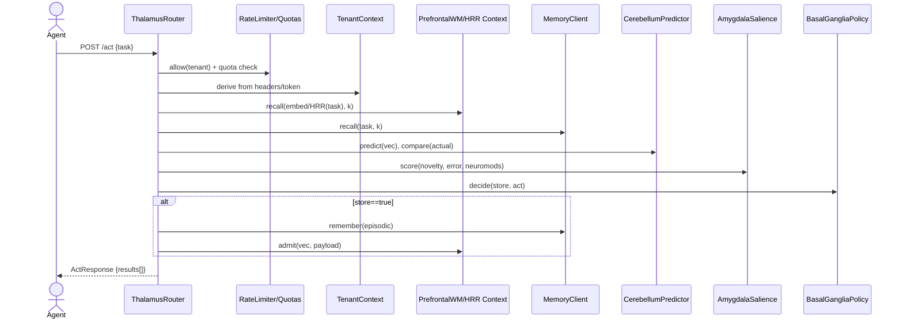
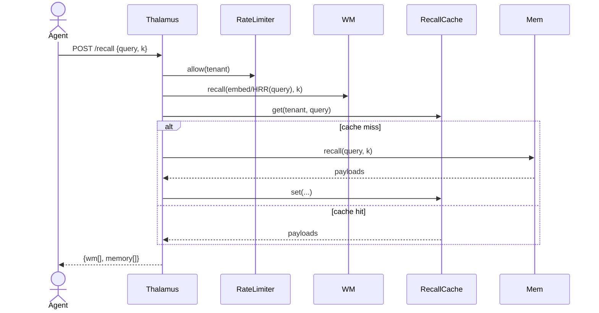
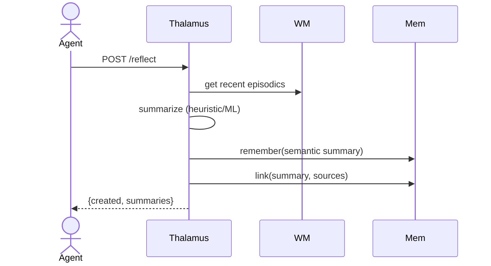
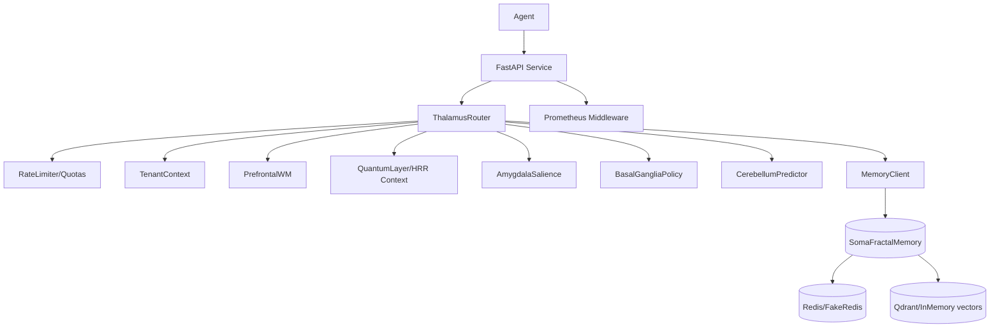
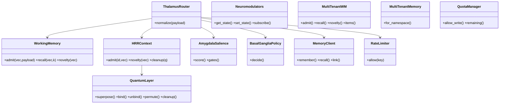

SomaBrain — Use Cases and UML

This document captures core user journeys (use cases) and concise UML-style diagrams (Mermaid) covering sequences, components, and classes.

Actors
- Agent: Calls SomaBrain endpoints to think/recall/remember/reflect.
- Tenant Admin: Manages tokens, quotas, namespaces.
- System Operator: Observes health/metrics; scales deployment.
- Memory Backend: SomaFractalMemory (local/HTTP) provides LTM + graph.
- Predictor Provider: Stub/LLM/ML predictor used by CerebellumPredictor.

Use Cases (MVP + Near-Term)
- Act On Task (/act): Thalamus → RateLimit/Auth → TenantContext → WM/HRR recall → Memory recall → Predictor → AmygdalaSalience → BasalGangliaPolicy → conditional store to LTM + WM admit → response.
- Remember Event (/remember): Thalamus → RateLimit/Auth/Quota → LTM store via MemoryClient → WM admit (and HRR context if enabled).
- Recall Context (/recall): Thalamus → RateLimit/Auth → WM/HRR top‑k → per‑tenant recall cache → LTM hybrid recall → return merged results.
- Reflect & Consolidate (/reflect): recent episodics (WM) → summary → write semantic → link sources.
- Personality Get/Set (/personality): semantic trait storage; influences planning.
- Migration Export/Import (future): export manifest + JSONL memories → import → warm WM/HRR.
- Graph Reasoning (future): k‑hop via memory graph; Hebbian strengthening.
- Operations & Observability: /health, /metrics; SLOs.

Sequence — Act on Task (/act)

Sequence — Recall (/recall)

Sequence — Reflect (/reflect)

Component Diagram

Class Diagram

Non‑Functional Requirements
- Latency SLOs: /act p95 < 150 ms (stub predictor), < 600 ms (LLM); /recall p95 < 80 ms with WM/cache hit.
- Throughput: multi‑tenant token bucket per tenant; autoscale horizontally.
- Isolation: strict tenant namespace mapping to SomaFractalMemory; no cross‑tenant WM/HRR context sharing.
- Observability: metrics with bounded cardinality; tracing optional.
- Security: bearer auth (optional), quotas, input normalization; sensitive field redaction.

This document evolves with the architecture; request additional flows or diagrams as needed.
