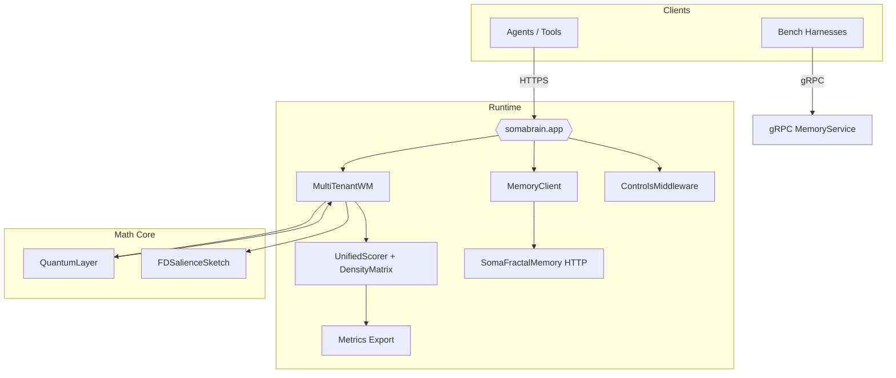

# SomaBrain 3.0 Architecture Overview

This document is the single source for how the SomaBrain runtime fits together. Every claim below references concrete code so it can be verified quickly.

---

## 1. Topology

Key modules:
- `somabrain.app`: FastAPI surface exposing recall, remember, context adaptation, and planning endpoints.
- `somabrain/memory_client.py`: HTTP connector that mirrors writes and enforces strict-mode audits.
- `somabrain/memory/density.py`: Maintains the ρ matrix and guarantees PSD + trace normalization.
- `somabrain/quantum.py`: BHDC hypervector binding / unbinding with deterministic role generators.
- `somabrain/salience.py`: Frequent-Directions sketch that biases recall toward diversity.

---

## 2. Recall Lifecycle (Strict Mode)

1. **Request enters FastAPI** (`somabrain.app` request handlers).
2. **Strict-mode middleware** ensures environment flags (`SOMABRAIN_STRICT_REAL`, `SOMABRAIN_REQUIRE_MEMORY`) are on before continuing.
3. **Working memory probe** (`somabrain/mt_wm.py::MultiTenantWM.recall`) checks warm cache and neuromodulator state.
4. **Scoring** (`somabrain/scoring.py::UnifiedScorer.score`) combines cosine, FD projection, and recency with clamped weights.
5. **Long-term memory call** (`somabrain/memory_client.py::MemoryClient.recall`) fans out to the HTTP memory service if additional context is required.
6. **Density matrix update** (`somabrain/memory/density.py::DensityMatrix.observe`) folds evidence back into the state and exports metrics.
7. **Response** includes scored items and audit metadata; structured logs emit via `somabrain/audit.py`.

Failures at any stage abort the request with a non-200 code under strict mode—there are no silent fallbacks.

---

## 3. Core Invariants

| Invariant | Code Reference | Enforcement |
| --- | --- | --- |
| `abs(trace(ρ) - 1) < 1e-4` | `DensityMatrix.normalize_trace` | Called after every observe/update cycle |
| PSD spectrum | `DensityMatrix.project_psd` | Clips negative eigenvalues before persistence |
| Weight bounds | `UnifiedScorer._clamp_weight` | Keeps component weights within configured `[min, max]` |
| Stub usage = 0 | `_audit_stub_usage` in `MemoryClient` | Raises instantly when a stub path is touched |
| Health realism | `somabrain/metrics.py::emit_health` | `/health` only reports ready when all deps answer |

Prometheus metrics exposing these guarantees: `somabrain_density_trace_error_total`, `somabrain_stub_usage_total`, `somabrain_recall_latency_seconds`.

---

## 4. Configuration Touchpoints

- Environment flags are read through `common.config.settings.Settings` (see `docs/operations/configuration.md`).
- Compose + Kubernetes manifests surface the same flags; strict mode must be on in every promoted environment.
- Optional components (Kafka, Postgres) are auto-detected: if endpoints exist they will be used, otherwise strict mode keeps the service in `ready=false`.

---

## 5. Extending the System

When adding new memory strategies or scoring terms:
1. Implement the math in a dedicated module (for example `somabrain/math/new_component.py`).
2. Expose integration points inside `MultiTenantWM` or `UnifiedScorer` with explicit feature flags.
3. Add property tests covering invariants and ensure metrics surface meaningful signals.
4. Update the documentation map (`README.md`) so the new behavior is discoverable.

Treat this document as source code: if the architecture changes, update it in the same PR.
