# SomaBrain Complete Cognitive Architecture Analysis

## Executive Summary

This document provides a comprehensive analysis of the ENTIRE SomaBrain cognitive architecture, identifying all data flows, integration points, failure modes, and the complete design for the Unified Planning Kernel.

---

## 1. COMPLETE COGNITIVE CYCLE - The Big Picture

```mermaid
flowchart TB
    subgraph INPUT["🔵 INPUT LAYER"]
        REQ["/act, /plan/suggest, /recall Request"]
        THAL[Thalamus Router<br/>Input Normalization<br/>Attention Gating]
    end

    subgraph EMBEDDING["🟢 EMBEDDING LAYER"]
        EMB[Embedder<br/>text → vector]
        QUANTUM[QuantumLayer<br/>HRR Operations<br/>Binding/Unbinding]
    end

    subgraph MEMORY["🟡 MEMORY LAYER"]
        subgraph WM["Working Memory"]
            MTWM[MultiTenantWM<br/>Short-term Buffer]
            MCWM[MultiColumnWM<br/>Micro-circuits]
        end
        subgraph LTM["Long-Term Memory"]
            SFM[SomaFractalMemory<br/>HTTP API]
            GRAPH[GraphClient<br/>Links/Neighbors/Paths]
        end
        subgraph CTX["Context"]
            HRR[HRRContext<br/>Superposition<br/>Decay/Cleanup]
            CTXBLD[ContextBuilder<br/>Multi-view Retrieval]
        end
    end

    subgraph COGNITIVE["🔴 COGNITIVE CORE"]
        subgraph EVAL["Evaluation"]
            PRED[Predictor<br/>predict_and_compare]
            NOVELTY[Novelty<br/>1 - max_cosine]
        end
        subgraph SALIENCE["Salience"]
            AMYG[Amygdala<br/>score + gates]
            FD[FDSalienceSketch<br/>Residual Energy]
        end
        subgraph MODULATION["Modulation"]
            NEURO[Neuromodulators<br/>DA/5HT/NE/ACh]
            SLEEP[SleepStateManager<br/>ACTIVE/LIGHT/DEEP/FREEZE]
        end
    end

    subgraph PLANNING["🟣 PLANNING LAYER"]
        PLAN_BFS[planner.py<br/>BFS Graph Walk<br/>⚠️ RETURNS []]
        PLAN_RWR[planner_rwr.py<br/>Random Walk Restart<br/>⚠️ RETURNS []]
        PLAN_SVC[planning_service.py<br/>⚠️ WRONG SETTINGS]
        PLAN_CTX[ContextPlanner<br/>Utility Scoring]
        PLAN_OAK[OakPlanner<br/>Option Ranking]
    end

    subgraph CONTROL["🟠 EXECUTIVE CONTROL"]
        EXEC[ExecutiveController<br/>Conflict Detection<br/>Bandit Exploration]
        BASAL[BasalGanglia<br/>Policy Decision<br/>store/act gates]
        SUPER[Supervisor<br/>Meta-adjustment]
    end

    subgraph OUTPUT["⚪ OUTPUT LAYER"]
        HIPP[Hippocampus<br/>Consolidation Buffer]
        PROMOTE[WMLTMPromoter<br/>WM→LTM Promotion]
        RESP[Response<br/>ActResponse/PlanSuggestResponse]
    end

    REQ --> THAL
    THAL --> EMB
    EMB --> QUANTUM
    
    QUANTUM --> MTWM
    QUANTUM --> HRR
    
    MTWM --> NOVELTY
    HRR --> NOVELTY
    
    EMB --> SFM
    SFM --> GRAPH
    
    NOVELTY --> PRED
    PRED -->|"⚠️ BUG: wm_vec vs wm_vec"| AMYG
    
    NEURO --> AMYG
    SLEEP --> AMYG
    FD --> AMYG
    
    AMYG --> BASAL
    EXEC --> BASAL
    SUPER --> NEURO
    
    BASAL -->|store_gate| HIPP
    BASAL -->|store_gate| MTWM
    BASAL -->|act_gate| PLAN_BFS
    
    PLAN_BFS --> PLAN_SVC
    PLAN_RWR --> PLAN_SVC
    PLAN_CTX --> RESP
    PLAN_OAK --> RESP
    
    MTWM --> PROMOTE
    PROMOTE --> SFM
    
    HIPP --> SFM
    
    PLAN_SVC --> RESP
```

---

## 2. CRITICAL BUGS IDENTIFIED

### Bug 1: Predictor Self-Comparison (SEVERITY: CRITICAL)

**Location**: `cognitive_loop_service.py:137`

```python
# CURRENT (BROKEN):
pred = predictor.predict_and_compare(wm_vec, wm_vec)  # Compares vector to ITSELF!
# Result: pred.error ≈ 0 ALWAYS
```

**Impact Chain**:


```mermaid
flowchart LR
    BUG[pred_error ≈ 0] --> SAL[salience = w_novelty×novelty + w_error×0]
    SAL --> LOW[Salience artificially LOW]
    LOW --> GATE[store_gate/act_gate WRONG]
    GATE --> MEM[Memories NOT stored when should be]
    GATE --> ACT[Actions NOT taken when should be]
    MEM --> CONSOL[Consolidation BROKEN]
    ACT --> PLAN[Planning USELESS]
```

### Bug 2: Planner Stubs (SEVERITY: CRITICAL)

**Location**: `planner.py` and `planner_rwr.py`

```python
# CURRENT (STUB):
def plan_from_graph(...) -> List[str]:
    return []  # ALWAYS EMPTY!

def rwr_plan(...) -> List[str]:
    return []  # ALWAYS EMPTY!
```

**Impact Chain**:


### Bug 3: Settings Mismatch (SEVERITY: HIGH)

**Location**: `planning_service.py:77-78`

```python
# CURRENT (WRONG):
steps=int(getattr(cfg, "rwr_steps", 20) or 20),      # WRONG NAME
restart=float(getattr(cfg, "rwr_restart", 0.15) or 0.15),  # WRONG NAME

# CORRECT (in memory.py):
planner_rwr_steps: int  # This is the actual setting
planner_rwr_restart: float  # This is the actual setting
```

**Impact**: RWR planner ignores all configuration, uses hardcoded defaults.

---

## 3. COMPLETE DATA FLOW ANALYSIS

### 3.1 The /act Endpoint Flow

```mermaid
sequenceDiagram
    participant Client
    participant Router as cognitive.py
    participant Eval as eval_step()
    participant Pred as Predictor
    participant Amyg as Amygdala
    participant Neuro as Neuromodulators
    participant WM as MultiTenantWM
    participant Plan as Planner
    participant SFM as SomaFractalMemory

    Client->>Router: POST /act {task, universe}
    Router->>Router: get_tenant_async()
    Router->>Router: require_auth()
    
    Router->>Router: embedder.embed(task) → wm_vec
    
    Router->>Eval: eval_step(novelty, wm_vec, cfg, ...)
    
    Note over Eval: Sleep State Check
    Eval->>Eval: get_sleep_state(tenant_id)
    alt FREEZE state
        Eval-->>Router: {pred_error:0, salience:0, gates:false}
    end
    
    Note over Eval,Pred: ⚠️ BUG HERE
    Eval->>Pred: predict_and_compare(wm_vec, wm_vec)
    Note right of Pred: Compares to ITSELF!<br/>pred.error ≈ 0 ALWAYS
    Pred-->>Eval: {error: ~0}
    
    Eval->>Neuro: get_state()
    Neuro-->>Eval: NeuromodState
    
    Eval->>Amyg: score(novelty, pred_error, neuromod, wm_vec)
    Note right of Amyg: salience = w_novelty×novelty + w_error×0<br/>Missing error component!
    Amyg-->>Eval: salience
    
    Eval->>Amyg: gates(salience, neuromod)
    Amyg-->>Eval: (store_gate, act_gate)
    
    Eval-->>Router: step_result
    
    alt use_planner enabled
        Router->>Plan: plan_from_graph(task, mem_client, ...)
        Note right of Plan: ⚠️ RETURNS [] ALWAYS
        Plan-->>Router: []
    end
    
    Router-->>Client: ActResponse{task, results, plan:[]}
```



### 3.2 Memory Store Flow


### 3.3 Recall Flow with Graph Augmentation


---

## 4. COMPONENT DEPENDENCY MAP


---

## 5. FAILURE MODE ANALYSIS

### 5.1 Single Points of Failure

| Component | Failure Mode | Impact | Mitigation |
|-----------|--------------|--------|------------|
| SFM HTTP | Connection timeout | All memory ops fail | Circuit breaker + outbox |
| Predictor | Exception | pred_error=0 fallback | ⚠️ Masks real errors |
| GraphClient | No transport | Empty neighbors | Graceful degradation |
| Embedder | None | wm_vec=None | System crash |
| Settings | Missing key | RuntimeError | Defaults in code |

### 5.2 Cascade Failure Scenarios

```mermaid
flowchart TD
    subgraph SCENARIO1["Scenario 1: SFM Down"]
        SFM_DOWN[SFM Unavailable] --> CB_OPEN[Circuit Breaker Opens]
        CB_OPEN --> QUEUE[Writes Queue to Outbox]
        CB_OPEN --> RECALL_FAIL[Recall Returns Empty]
        RECALL_FAIL --> NO_CONTEXT[No Context for Agent]
        NO_CONTEXT --> DEGRADED[Degraded Responses]
    end

    subgraph SCENARIO2["Scenario 2: Predictor Bug Active"]
        PRED_BUG[pred_error ≈ 0] --> LOW_SAL[Low Salience]
        LOW_SAL --> NO_STORE[Nothing Stored]
        NO_STORE --> EMPTY_WM[Empty Working Memory]
        EMPTY_WM --> NO_CONSOL[No Consolidation]
        NO_CONSOL --> NO_LTM[No Long-Term Learning]
    end

    subgraph SCENARIO3["Scenario 3: Planner Stubs"]
        STUB[return []] --> NO_PLAN[No Plans Generated]
        NO_PLAN --> NO_SEQ[No Sequential Reasoning]
        NO_SEQ --> REACTIVE[Purely Reactive System]
    end
```

---

## 6. THE FIX: Unified Planning Kernel Architecture

### 6.1 New Architecture Overview

```mermaid
flowchart TB
    subgraph NEW_FOCUS["FocusState Module"]
        FS[FocusState]
        FS_HRR[HRRContext<br/>Superposition]
        FS_PREV[previous_focus_vec]
        FS_CURR[current_focus_vec]
        FS_DIG[focus_digest<br/>Deterministic Hash]
        
        FS --> FS_HRR
        FS_HRR --> FS_PREV
        FS_HRR --> FS_CURR
        FS_CURR --> FS_DIG
    end

    subgraph NEW_ENGINE["PlanEngine"]
        PE[PlanEngine]
        PE_CTX[PlanRequestContext]
        PE_COMP[CompositePlan]
        
        subgraph STRATEGIES["Strategies"]
            STR_BFS[BFSStrategy]
            STR_RWR[RWRStrategy]
            STR_CTX[ContextStrategy]
            STR_OPT[OptionStrategy]
        end
        
        PE --> PE_CTX
        PE_CTX --> STRATEGIES
        STRATEGIES --> PE_COMP
    end

    subgraph FIXED_PRED["Fixed Predictor Flow"]
        FP_PREV[previous_focus_vec]
        FP_CURR[current_focus_vec]
        FP_PRED[predictor.predict_and_compare]
        FP_ERR[pred_error ≠ 0]
        
        FP_PREV --> FP_PRED
        FP_CURR --> FP_PRED
        FP_PRED --> FP_ERR
    end

    subgraph FIXED_PLAN["Fixed Planners"]
        FPL_BFS[planner.py<br/>Real BFS via GraphClient]
        FPL_RWR[planner_rwr.py<br/>Real RWR Algorithm]
        FPL_SVC[planning_service.py<br/>Correct Settings]
        
        FPL_BFS --> FPL_SVC
        FPL_RWR --> FPL_SVC
    end

    FS_PREV --> FP_PREV
    FS_CURR --> FP_CURR
    
    FPL_SVC --> PE
    PE_COMP --> LEGACY[to_legacy_steps<br/>Backward Compatible]
```



### 6.2 Fixed Cognitive Loop Flow


---

## 7. IMPLEMENTATION PHASES

### Phase 1: Critical Bug Fixes (MUST DO FIRST)


### Phase 1 Details: Critical Bug Fixes

| Task | File | Change | Risk |
|------|------|--------|------|
| Fix predictor | `cognitive_loop_service.py` | Add `previous_focus_vec` param, compare properly | LOW - additive change |
| Fix settings | `planning_service.py` | `rwr_steps` → `planner_rwr_steps` | LOW - config fix |
| Add metrics | `metrics/planning.py` | New file with counters/histograms | NONE - new file |

### Phase 2 Details: Graph Planning

| Task | File | Change | Risk |
|------|------|--------|------|
| BFS planner | `planner.py` | Replace stub with real BFS using GraphClient | MEDIUM - core logic |
| RWR planner | `planner_rwr.py` | Replace stub with real RWR algorithm | MEDIUM - core logic |

### Phase 3 Details: FocusState

| Task | File | Change | Risk |
|------|------|--------|------|
| FocusState | `focus_state.py` (NEW) | New module wrapping HRRContext | LOW - new file |
| Persistence | `focus_state.py` | Add persist_snapshot() | LOW - optional feature |
| Links | `focus_state.py` | Add create_links() | LOW - optional feature |

### Phase 4 Details: Integration

| Task | File | Change | Risk |
|------|------|--------|------|
| PlanEngine | `services/plan_engine.py` (NEW) | Strategy pattern for planning | LOW - new file |
| Integration | `routers/cognitive.py` | Wire FocusState + PlanEngine | MEDIUM - touches hot path |

---

## 8. SETTINGS REQUIRED

### New Settings (to add to `cognitive.py`)

```python
# Planning Kernel
use_planner: bool = False                    # Enable planning
use_focus_state: bool = True                 # Enable FocusState
plan_max_steps: int = 5                      # Max plan steps
planner_backend: str = "bfs"                 # "bfs" or "rwr"
plan_time_budget_ms: int = 50                # Time budget
plan_max_options: int = 10                   # Max options
plan_rel_types: str = ""                     # Comma-separated rel types

# FocusState
focus_decay_gamma: float = 0.90              # Decay rate
focus_persist: bool = False                  # Persist snapshots
focus_links: bool = False                    # Create graph links
focus_admit_top_n: int = 4                   # Top-N recall hits to admit
```

### Existing Settings (already in `memory.py`)

```python
# Already exist - just need correct usage
planner_rwr_steps: int = 20
planner_rwr_restart: float = 0.15
planner_rwr_max_nodes: int = 128
planner_rwr_edges_per_node: int = 32
planner_rwr_max_items: int = 5
graph_hops: int = 2
graph_limit: int = 20
```

---

## 9. API COMPATIBILITY MATRIX

| Endpoint | Current Response | New Response | Breaking? |
|----------|------------------|--------------|-----------|
| `/plan/suggest` | `{plan: []}` | `{plan: [str, ...]}` | NO - same schema |
| `/act` | `{plan: [], ...}` | `{plan: [str, ...], ...}` | NO - same schema |
| `/act` | `{pred_error: ~0}` | `{pred_error: real_value}` | NO - same field |

---

## 10. OBSERVABILITY

### New Metrics

| Metric | Type | Labels | Purpose |
|--------|------|--------|---------|
| `somabrain_plan_latency_seconds` | Histogram | backend | Planning latency |
| `somabrain_plan_empty_total` | Counter | reason | Empty plan tracking |
| `somabrain_plan_graph_unavailable_total` | Counter | - | Graph failures |
| `somabrain_focus_update_latency_seconds` | Histogram | - | Focus update time |
| `somabrain_focus_persist_total` | Counter | - | Persistence count |
| `somabrain_predict_compare_missing_prev_total` | Counter | - | Missing prev focus |

### Logging

All operations log with:
- `request_id`
- `tenant_id`
- `session_id` (for FocusState)
- `degrade_reason` (on failures)

---

## 11. TESTING STRATEGY

### Unit Tests
- FocusState determinism (same inputs → same digest)
- BFS traversal correctness
- RWR convergence
- Settings loading

### Integration Tests
- Full /act flow with FocusState
- /plan/suggest with real graph
- Predictor comparison with different vectors

### Property-Based Tests
- FocusState: admit(x) then novelty(x) < novelty(y) for random y
- BFS: plan length ≤ max_steps
- RWR: deterministic tie-breaking

---

## 12. ROLLBACK PLAN

If issues arise:
1. Set `use_planner=false` → disables new planning
2. Set `use_focus_state=false` → reverts to wm_vec behavior
3. Both flags default to safe values

No database migrations required. All changes are additive.

---

## 13. CONCLUSION

This design:
1. **Fixes 3 critical bugs** that break the cognitive loop
2. **Preserves all existing APIs** - no breaking changes
3. **Adds proper planning** via real graph traversal
4. **Introduces FocusState** as canonical WM signal
5. **Is fully observable** with metrics and logging
6. **Is safely rollbackable** via feature flags

The architecture is now complete and ready for implementation.
