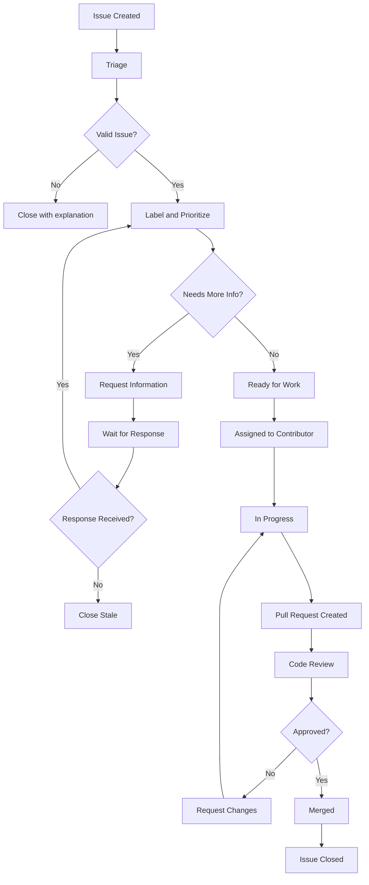

# Team Collaboration

**Purpose**: Comprehensive guide to communication channels, collaboration tools, and team processes for effective work on SomaBrain.

**Audience**: Team members, contributors, and collaborators working on SomaBrain project.

**Prerequisites**: Basic understanding of the project from [Project Context](project-context.md) and completed [Local Setup](../development/local-setup.md).

---

## Communication Channels

### Primary Channels

**GitHub Issues and Discussions**:
- **Purpose**: Technical discussions, bug reports, feature requests
- **When to use**: Code-related questions, project planning, public discussions
- **Response time**: 24-48 hours for maintainers
- **Link**: https://github.com/somabrain/somabrain/issues

**Slack Workspace** (Internal Team):
- **Purpose**: Real-time communication, quick questions, team coordination
- **Channels**:
  - `#general` - General project discussion
  - `#development` - Technical development chat
  - `#support` - Help and troubleshooting
  - `#random` - Non-work related chat
- **When to use**: Quick questions, urgent issues, team building
- **Response time**: During business hours (9 AM - 6 PM your timezone)

**Discord Server** (Community):
- **Purpose**: Community discussions, contributor support, open collaboration
- **Channels**:
  - `#welcome` - New member introductions
  - `#general-discussion` - Project-related discussions
  - `#development-help` - Technical assistance
  - `#showcase` - Share your work and achievements
- **When to use**: Community engagement, getting help, collaboration
- **Link**: https://discord.gg/somabrain

**Email** (Private/Sensitive):
- **Purpose**: Security issues, private concerns, administrative matters
- **Contact**: security@somabrain.com, team@somabrain.com
- **When to use**: Security vulnerabilities, licensing questions, private feedback

### Communication Guidelines

**Response Time Expectations**:
| Channel | Response Time | Escalation |
|---------|---------------|------------|
| GitHub Issues | 24-48 hours | Mention maintainer directly |
| Slack/Discord | 2-4 hours (business hours) | Switch to GitHub issue |
| Email | 2-3 business days | Follow up after 1 week |
| Security Email | Same day | Call emergency contact |

**Message Quality Standards**:
- **Be Specific**: Include context, error messages, steps to reproduce
- **Be Respectful**: Assume positive intent, use inclusive language
- **Be Patient**: Allow time for responses, people are in different timezones
- **Be Helpful**: Share solutions when you find them, help others

---

## Team Structure and Roles

### Core Team Roles

**Project Maintainers**:
- **Responsibilities**: Code review, architecture decisions, release management
- **Members**: @alice-maintainer, @bob-architect, @charlie-lead
- **Contact**: Via GitHub mentions or Slack DMs
- **Decision Authority**: Technical direction, breaking changes, major features

**Senior Contributors**:
- **Responsibilities**: Code review, mentoring, feature development
- **Recognition**: Consistent high-quality contributions over 6+ months
# (Removed roadmap reference)
- **Contact**: Via GitHub or community channels

**Contributors**:
- **Responsibilities**: Feature development, bug fixes, documentation
- **Everyone**: All community members who contribute code or documentation
- **Recognition**: Contributor acknowledgments, community recognition
- **Growth Path**: Senior Contributor → Maintainer with sustained contribution

**Community Members**:
- **Responsibilities**: Testing, feedback, issue reporting, discussions
- **Welcome**: Anyone interested in SomaBrain
- **Participation**: GitHub discussions, Discord, issue reports

### Specialized Roles

**Security Team** (@security-team):
- **Responsibilities**: Security review, vulnerability response, audit coordination
- **Contact**: security@somabrain.com (private), @security-team (GitHub)
- **Authority**: Security policy decisions, vulnerability disclosure

**Documentation Team** (@docs-team):
- **Responsibilities**: Documentation quality, user experience, tutorials
- **Contact**: Via GitHub issues with `documentation` label
- **Focus**: User onboarding, API documentation, guides and tutorials

**Performance Team** (@performance-team):
- **Responsibilities**: Performance monitoring, optimization, benchmarking
- **Contact**: Via GitHub issues with `performance` label
- **Focus**: Database optimization, API performance, scalability

---

## Development Workflows

### Sprint Planning (Bi-weekly)

**Schedule**: Every other Monday, 10 AM PST
**Duration**: 2 hours
**Participants**: Core team + interested contributors
**Format**: Video call + GitHub Projects

**Agenda**:
1. **Previous Sprint Review** (30 min)
   - Demo completed features
   - Review metrics and performance
   - Discuss blockers and challenges

2. **Current Sprint Planning** (60 min)
   - Prioritize GitHub issues
   - Assign issues to contributors
   - Estimate effort and timeline
   - Identify dependencies

3. **Technical Discussion** (30 min)
   - Architecture decisions
   - Breaking changes review
   - Performance improvements
   - Security considerations

**Artifacts**:
- Sprint milestone in GitHub
- Updated project board
- Meeting notes in GitHub Discussions

### Daily Standups (Optional)

**Schedule**: Monday/Wednesday/Friday, 9 AM PST
**Duration**: 15 minutes
**Format**: Slack thread or quick video call
**Participants**: Active contributors (voluntary)

**Format**:
```
## Daily Standup - [Date]

**@username**:
- ✅ Yesterday: Completed memory search API tests
- 🔄 Today: Working on documentation updates
- 🚧 Blockers: Waiting for database migration review

**@another-contributor**:
- ✅ Yesterday: Fixed performance regression in vector encoding
- 🔄 Today: Investigating Redis caching optimization
- 🚧 Blockers: None

Add your update below! 👇
```

### Code Review Process

**Review Assignment**:
1. **Automatic**: GitHub automatically assigns 2 reviewers
2. **Self-Assignment**: Team members can assign themselves
3. **Expertise-Based**: Assign specialists for specific areas (security, performance)
4. **Load Balancing**: Distribute reviews evenly among maintainers

**Review Checklist**:
```markdown
## Code Review Checklist

### Functionality
- [ ] Code solves the stated problem
- [ ] Edge cases are handled appropriately
- [ ] Error handling is comprehensive
- [ ] Performance impact is acceptable

### Code Quality
- [ ] Code follows project style guidelines
- [ ] Functions are well-documented
- [ ] Variable names are clear and descriptive
- [ ] Code is DRY (Don't Repeat Yourself)

### Testing
- [ ] Unit tests cover new functionality
- [ ] Integration tests verify component interaction
- [ ] Test cases include edge cases and error scenarios
- [ ] All tests pass in CI/CD pipeline

### Security
- [ ] Input validation is present and correct
- [ ] No sensitive data in logs or responses
- [ ] Authentication/authorization properly implemented
- [ ] SQL injection and XSS vulnerabilities checked

### Documentation
- [ ] API changes documented
- [ ] User-facing changes have updated guides
- [ ] Code comments explain complex logic
- [ ] Changelog updated for user-facing changes
```

**Review Response Guidelines**:
```markdown
## Providing Feedback

**Constructive Comments**:
✅ "Consider using a more specific exception type here for better error handling"
✅ "This function could benefit from some inline documentation"
✅ "Great implementation! One small suggestion for performance..."

**Avoid**:
❌ "This is wrong"
❌ "Bad code"
❌ "Why did you do this?"

**Receiving Feedback**:
✅ "Thanks for the suggestion! I'll update the implementation"
✅ "Good point about edge cases, I'll add tests for that"
✅ "I chose this approach because X, but I see your point about Y"

**Disagreement Resolution**:
1. Discuss in PR comments with technical reasoning
2. Escalate to maintainer if no consensus
3. Video call for complex architectural discussions
4. Document decisions for future reference
```

---

## Issue Management

### Issue Lifecycle



### Issue Labels

**Priority Labels**:
- `priority/critical` - Security issues, production bugs
- `priority/high` - Important features, significant bugs
- `priority/medium` - Regular features and improvements
- `priority/low` - Nice-to-have features, minor bugs

**Type Labels**:
- `type/bug` - Something isn't working correctly
- `type/feature` - New functionality request
- `type/enhancement` - Improvement to existing functionality
- `type/documentation` - Documentation improvements
- `type/performance` - Performance-related changes
- `type/security` - Security-related issues

**Status Labels**:
- `status/triage` - Needs initial review and labeling
- `status/blocked` - Cannot proceed due to external dependency
- `status/in-progress` - Actively being worked on
- `status/needs-review` - Ready for code review
- `status/stale` - No activity for 30+ days

**Difficulty Labels**:
- `good-first-issue` - Great for newcomers
- `difficulty/easy` - 1-2 hours of work
- `difficulty/medium` - 1-2 days of work
- `difficulty/hard` - 1+ weeks of work

### Issue Templates

**Bug Report Template**:
```markdown
## Bug Description
Brief description of the issue.

## Steps to Reproduce
1. Go to...
2. Click on...
3. See error

## Expected Behavior
What should have happened.

## Actual Behavior
What actually happened.

## Environment
- OS: [e.g. Ubuntu 22.04]
- Python: [e.g. 3.11.2]
- SomaBrain version: [e.g. 1.2.3]
- Browser (if applicable): [e.g. Chrome 120]

## Additional Context
- Error logs
- Screenshots
- Related issues
```

**Feature Request Template**:
```markdown
## Problem Statement
What problem does this feature solve?

## Proposed Solution
Detailed description of the proposed feature.

## Alternative Solutions
Other approaches considered.

## Acceptance Criteria
- [ ] Criterion 1
- [ ] Criterion 2
- [ ] Criterion 3

## Additional Context
- Mockups or diagrams
- Related features
- Implementation ideas
```

---

## Collaboration Tools

### GitHub Projects

**Project Boards**:
# (Removed roadmap reference)
- **Current Sprint**: Active work items and progress tracking
- **Backlog Grooming**: Issue prioritization and refinement

**Board Columns**:
```
Backlog → Triaged → In Progress → In Review → Testing → Done
```

**Automation Rules**:
- Issues automatically move to "In Progress" when assigned
- PRs move to "In Review" when opened
- Completed PRs move issues to "Done"

### Documentation Collaboration

**Shared Documents**:
- **Technical RFCs**: Architecture decision documents
- **Meeting Notes**: Sprint planning and technical discussions
- **Runbooks**: Operational procedures and troubleshooting
- **Design Documents**: Feature specifications and wireframes

**Documentation Workflow**:
1. **Draft**: Create initial document in Google Docs (or similar)
2. **Review**: Share with team for feedback and iteration
3. **Finalize**: Move to official documentation repository
4. **Maintain**: Keep updated with code changes

### Monitoring and Metrics

**Team Dashboards**:
- **Development Metrics**: PR velocity, review time, merge rate
- **Code Quality**: Test coverage, linting violations, security issues
- **Community Health**: Issue response time, contributor growth
- **Performance**: API response times, error rates, system health

**Regular Reviews**:
- **Weekly**: Quick metrics review in team sync
- **Monthly**: Detailed analysis and process improvements
- **Quarterly**: Strategic review and goal setting

---

## Conflict Resolution

### Disagreement Types

**Technical Disagreements**:
1. **Code Implementation**: Different approaches to solving a problem
2. **Architecture Decisions**: High-level design choices
3. **Technology Choices**: Library/framework selection
4. **Performance Trade-offs**: Speed vs. maintainability decisions

**Process Disagreements**:
1. **Timeline Conflicts**: Deadline vs. quality tensions
2. **Priority Disputes**: Feature importance disagreements
3. **Resource Allocation**: Time and effort distribution
4. **Quality Standards**: Acceptable quality levels

### Resolution Process

**Level 1: Direct Discussion**
```markdown
## Steps for Direct Resolution

1. **Acknowledge**: "I see we have different views on this approach"
2. **Understand**: "Help me understand your perspective on X"
3. **Explain**: "My concern with approach Y is..."
4. **Collaborate**: "What if we tried Z as a compromise?"
5. **Document**: Record the decision and reasoning
```

**Level 2: Maintainer Mediation**
- **When**: Direct discussion doesn't reach consensus within 2 days
- **Process**: Mention maintainer in GitHub discussion
- **Timeline**: Maintainer provides decision within 48 hours
- **Authority**: Technical maintainer decision is final

**Level 3: Team Discussion**
- **When**: Significant architectural or policy decisions
- **Format**: Team meeting or async GitHub discussion
- **Participants**: All maintainers + senior contributors
- **Timeline**: One week for discussion, then formal decision

**Level 4: Project Lead Decision**
- **When**: Deadlock at team level or critical urgency
- **Authority**: Project lead (@project-lead) makes final call
- **Timeline**: 24-48 hours for critical decisions
- **Documentation**: Decision rationale published for transparency

### Best Practices

**Healthy Debate Guidelines**:
```markdown
## Effective Technical Discussions

**Do**:
✅ Focus on technical merits and trade-offs
✅ Provide concrete examples and data
✅ Consider multiple perspectives
✅ Be willing to change your mind
✅ Separate ideas from people ("the approach" not "your approach")

**Don't**:
❌ Make it personal or about individual competence
❌ Dismiss concerns without addressing them
❌ Use authority or seniority to shut down discussion
❌ Rehash previously decided issues without new information
❌ Block progress indefinitely
```

**Compromise Strategies**:
- **Timeboxed Experiments**: Try approach A for 2 weeks, then evaluate
- **Hybrid Solutions**: Combine elements from different proposals
- **Phased Implementation**: Start with simpler approach, evolve later
- **A/B Testing**: Implement both approaches and measure results

---

## Remote Work Guidelines

### Asynchronous Collaboration

**Time Zone Considerations**:
- **Core Hours**: 9 AM - 12 PM PST when most team overlap occurs
- **Meeting Scheduling**: Use shared calendar with timezone display
- **Documentation**: Always document decisions and discussions
- **Response Expectations**: 24-hour response time across timezones

**Effective Async Communication**:
```markdown
## Good Async Messages

**Provide Context**:
"I'm working on the memory search API (PR #123) and noticed that..."

**Be Specific**:
"The test on line 45 of test_memory.py is failing with error: 'AttributeError: ...'"

**Include Next Steps**:
"I'll try approach X tomorrow. If that doesn't work, should I explore Y instead?"

**Set Expectations**:
"This is blocking my progress, could someone review by EOD Thursday?"
```

### Meeting Etiquette

**Video Call Best Practices**:
- **Camera On**: Encourages engagement and connection
- **Mute When Not Speaking**: Reduces background noise
- **Good Setup**: Stable internet, clear audio, proper lighting
- **Engagement**: Active participation, avoid multitasking

**Meeting Preparation**:
```markdown
## Meeting Checklist

**Before the Meeting**:
- [ ] Review agenda and prepare talking points
- [ ] Test audio/video setup
- [ ] Have relevant documents/code ready
- [ ] Prepare questions or discussion topics

**During the Meeting**:
- [ ] Take notes on decisions and action items
- [ ] Speak up if you have concerns or questions
- [ ] Stay focused on the topic
- [ ] Respect time limits

**After the Meeting**:
- [ ] Send summary of decisions and action items
- [ ] Update GitHub issues/projects as needed
- [ ] Follow up on assigned tasks
```

### Knowledge Sharing

**Documentation Culture**:
- **Write Everything Down**: Decisions, rationale, context
- **Keep It Updated**: Documentation rots quickly without maintenance
- **Make It Searchable**: Use consistent terminology and tagging
- **Review Regularly**: Quarterly documentation audits

**Knowledge Transfer Methods**:
- **Code Comments**: Explain complex logic and decisions
- **Architectural Decision Records (ADRs)**: Document significant decisions
- **Pair Programming**: Share knowledge through collaboration
- **Tech Talks**: Present interesting findings or solutions

**Verification**: Team collaboration is effective when communication is clear, conflicts are resolved constructively, and knowledge is shared efficiently.

---

**Common Errors**:

| Issue | Solution |
|-------|----------|
| Messages lost in wrong channel | Use GitHub for code, Slack for quick chat |
| Timezone confusion in meetings | Always specify timezone, use UTC for clarity |
| Decisions made without documentation | Record all technical decisions in GitHub |
| Review bottlenecks | Distribute review load, set response expectations |
| Knowledge silos | Regular pair programming and documentation |

**References**:
- [First Contribution](first-contribution.md) for hands-on collaboration practice
- [Domain Knowledge](domain-knowledge.md) for technical context in discussions
- [Contribution Process](../development/contribution-process.md) for detailed workflow
- [Coding Standards](../development/coding-standards.md) for quality standards