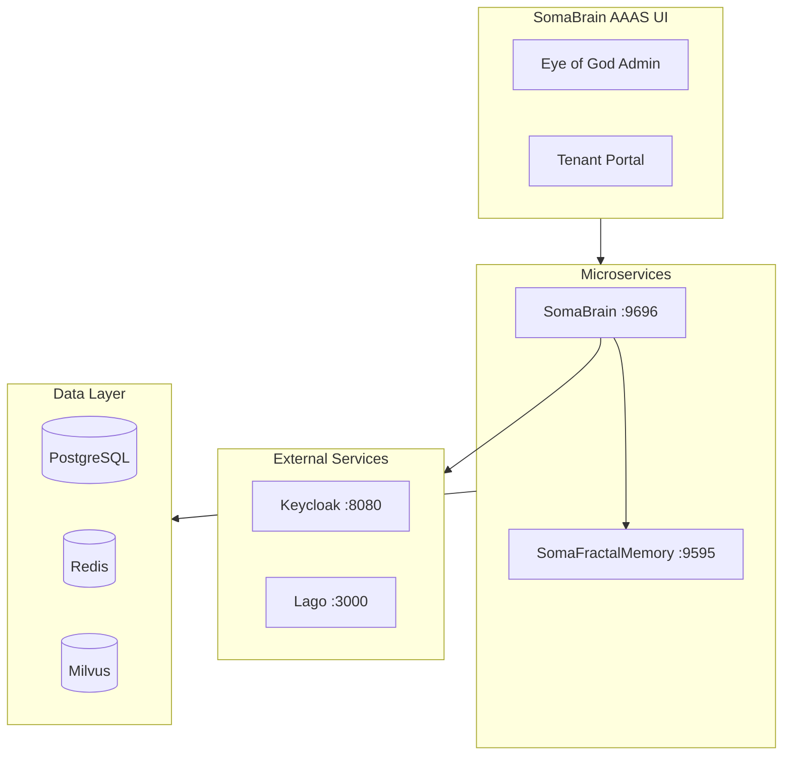

# SRS Documentation Structure

**Date:** 2025-12-24  
**Standard:** ISO/IEC/IEEE 29148:2018

---

## Folder Organization

```
docs/srs/
├── README.md                  # This file - index
├── SOMABRAIN_AAAS_SRS.md     # Master SRS document
│
├── somabrain/                 # SomaBrain-specific specs
│   ├── multi-tenancy.md
│   ├── subscription-billing.md
│   ├── authentication-sso.md
│   ├── god-mode-admin.md
│   ├── memory-cognitive.md
│   ├── api-gateway.md
│   ├── observability.md
│   ├── platform-administration-complete.md
│   ├── memory-management.md
│   ├── security-classification.md
│   ├── traceability-matrix.md
│   └── settings-reference.md    # All 300+ settings
│
├── somafractalmemory/         # SomaFractalMemory specs
│   ├── somafractalmemory-complete.md
│   └── settings-reference.md    # All 70+ settings
│
├── unified/                   # Unified platform specs
│   ├── unified-memory-platform.md
│   └── docker-deployment.md
│
├── admin-ui/                  # UI/UX specifications
│   ├── god-mode-screen-map.md
│   └── user-journey-screens.md  # 38 screens, 20 use cases
│
├── api-specs/                 # API specifications
│   └── api-key-authentication.md
│
├── flows/                     # User journey flows (19 docs)
│   ├── README.md
│   ├── eye-of-god-tenant-creation-flow.md
│   ├── eye-of-god-system-monitoring-flow.md
│   ├── eye-of-god-memory-administration-flow.md
│   ├── eye-of-god-billing-management-flow.md
│   ├── eye-of-god-user-administration-flow.md
│   ├── integrated-memory-operations-flow.md
│   ├── developer-api-integration-flow.md
│   ├── platform-onboarding-flow.md
│   ├── tenant-creation-flow.md
│   ├── user-authentication-flow.md
│   ├── subscription-management-flow.md
│   ├── memory-operations-flow.md
│   ├── user-management-flow.md
│   ├── billing-invoices-flow.md
│   ├── settings-configuration-flow.md
│   ├── audit-log-flow.md
│   ├── tenant-suspension-flow.md
│   └── impersonation-flow.md
│
└── MASTER_SRS_CATALOG.md      # Full document catalog
```

---

## Quick Links

### Core Documents

| Document | Purpose |
|----------|---------|
| [Master SRS](./SOMABRAIN_AAAS_SRS.md) | Complete requirements overview |
| [Master Catalog](./MASTER_SRS_CATALOG.md) | Full document catalog with 58 journeys |
| [User Journey Screens](./admin-ui/user-journey-screens.md) | 38 UI screens with wireframes |
| [Permission Matrix](./somabrain/permission-matrix-complete.md) | 55 permissions, 6 roles |
| [API Key Auth](./api-specs/api-key-authentication.md) | Authentication specification |

### SomaBrain Service

| Document | Purpose |
|----------|---------|
| [Multi-Tenancy](./somabrain/multi-tenancy.md) | Tenant isolation |
| [Billing](./somabrain/subscription-billing.md) | Lago integration |
| [Authentication](./somabrain/authentication-sso.md) | Keycloak/SSO |
| [God Mode Admin](./somabrain/god-mode-admin.md) | Platform admin |
| [Settings Reference](./somabrain/settings-reference.md) | All 300+ settings |

### SomaFractalMemory Service

| Document | Purpose |
|----------|---------|
| [Complete Spec](./somafractalmemory/somafractalmemory-complete.md) | Full service spec |
| [Settings Reference](./somafractalmemory/settings-reference.md) | All 70+ settings |

### Unified Platform

| Document | Purpose |
|----------|---------|
| [Unified Architecture](./unified/unified-memory-platform.md) | Integration spec |
| [Docker Deployment](./unified/docker-deployment.md) | Container architecture |

### Eye of God Flows

| Document | Screens |
|----------|---------|
| [Tenant Creation](./flows/eye-of-god-tenant-creation-flow.md) | 9 screens |
| [System Monitoring](./flows/eye-of-god-system-monitoring-flow.md) | 4 screens |
| [Memory Admin](./flows/eye-of-god-memory-administration-flow.md) | 4 screens |
| [Billing Management](./flows/eye-of-god-billing-management-flow.md) | 4 screens |
| [User Admin](./flows/eye-of-god-user-administration-flow.md) | 4 screens |

---

## Document Statistics

| Category | Documents | Items |
|----------|-----------|-------|
| SomaBrain | 13 | 300+ settings |
| SomaFractalMemory | 2 | 70+ settings |
| Unified Platform | 2 | - |
| Admin UI | 2 | 38 screens |
| API Specs | 1 | - |
| User Flows | 19 | 58 journeys |
| **TOTAL** | **39** | **56 screens** |

---

## Architecture Overview



---

## Technology Stack

| Component | Technology | Port |
|-----------|------------|------|
| Backend API | Django 5.x + Django Ninja | 9696, 9595 |
| Frontend | Lit (Web Components) | 5173 |
| Database | PostgreSQL 15 | 5432 |
| Cache | Redis 7 | 6379 |
| Vector DB | Milvus 2.3 | 19530 |
| Auth | Keycloak 22 | 8080 |
| Billing | Lago | 3000 |

---

*SomaBrain AAAS Platform - ISO/IEC/IEEE 29148:2018*
