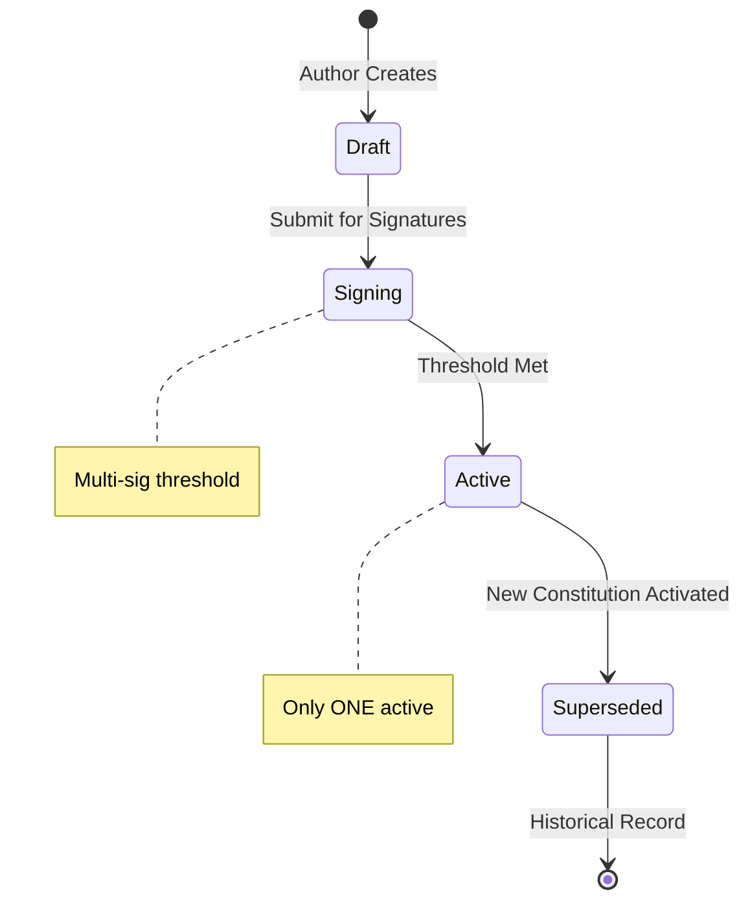
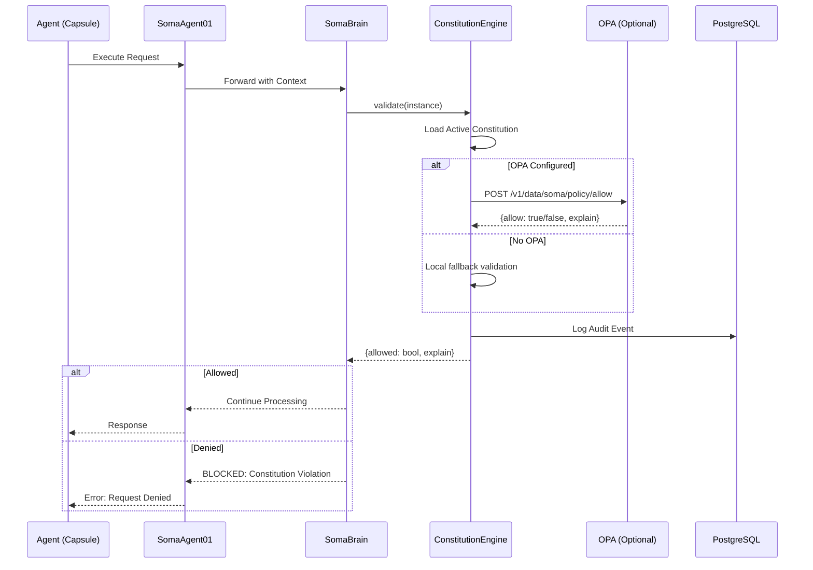
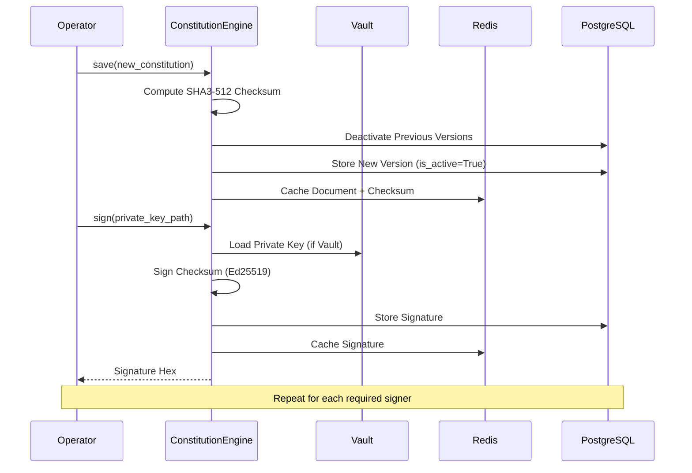

# SRS-CONSTITUTION-ISO
## ISO/IEC/IEEE 29148:2018 Compliant Specification
## SOMA System Constitution — The Supreme Regulatory Framework

| Document ID | SRS-CONSTITUTION-ISO-001 |
|-------------|-------------------------|
| Version | 1.0.0 |
| Date | 2026-01-03 |
| Status | CANONICAL |
| Location | SomaBrain |
| Classification | Internal - Engineering |

---

# TABLE OF CONTENTS

1. [Executive Summary](#1-executive-summary)
2. [Architecture](#2-architecture)
3. [Data Model](#3-data-model)
4. [Constitution Engine](#4-constitution-engine)
5. [Security & Cryptography](#5-security--cryptography)
6. [Policy Enforcement (OPA)](#6-policy-enforcement-opa)
7. [UML Diagrams](#7-uml-diagrams)
8. [7-Persona VIBE Analysis](#8-7-persona-vibe-analysis)
9. [Implementation Status](#9-implementation-status)
10. [Recommendations](#10-recommendations)

---

# 1. EXECUTIVE SUMMARY

## 1.1 Purpose
The Constitution is the **supreme regulatory document** that governs all AI agent behavior within a SomaBrain instance. It defines:
- Ethical boundaries and behavioral constraints
- Permitted and forbidden actions
- Validation rules for agent requests
- Multi-signature governance requirements

## 1.2 Key Principle
> **ONE CONSTITUTION PER SOMABRAIN INSTANCE**
> 
> All Capsules (agents) running under a SomaBrain instance MUST comply with the active Constitution.

## 1.3 Compliance Matrix
| Standard | Requirement | Status |
|----------|-------------|--------|
| ISO/IEC 29148 | Requirements specification | ✅ |
| SHA3-512 | Content hashing | ✅ |
| Ed25519/PEM | Digital signatures | ✅ |
| OPA (Rego) | Policy enforcement | ✅ |
| VIBE Coding | No mocks, real implementations | ✅ |

---

# 2. ARCHITECTURE

## 2.1 Trust Hierarchy
```
┌─────────────────────────────────────────────────────────────────────────────┐
│                    CONSTITUTION TRUST ARCHITECTURE                           │
├─────────────────────────────────────────────────────────────────────────────┤
│                                                                             │
│   CONSTITUTION (The Supreme Law)                                             │
│   ├── Location: SomaBrain                                                    │
│   ├── Storage: Redis (hot) + PostgreSQL (historical)                         │
│   ├── Checksum: SHA3-512 (128 hex chars)                                     │
│   └── Signatures: PEM-based (Vault or file)                                  │
│                          │                                                  │
│                          ▼                                                  │
│   CAPSULE (Agent Identity)                                                   │
│   ├── Location: SomaAgent01                                                  │
│   ├── constitution_ref: {checksum, SomaBrain URL}                            │
│   └── MUST validate against Constitution before execution                    │
│                          │                                                  │
│                          ▼                                                  │
│   RUNTIME VALIDATION                                                         │
│   ├── OPA Policy Engine (if configured)                                      │
│   ├── Local fallback rules                                                   │
│   └── Audit log for every decision                                           │
│                                                                             │
└─────────────────────────────────────────────────────────────────────────────┘
```

## 2.2 Component Map
| Component | File | Purpose |
|-----------|------|---------|
| ConstitutionEngine | `somabrain/constitution/__init__.py` | Load, validate, sign |
| ConstitutionStorage | `somabrain/constitution/storage.py` | Redis + PostgreSQL |
| ConstitutionVersion | `somabrain/models.py:194` | Django model for versions |
| ConstitutionSignature | `somabrain/models.py:218` | Django model for signatures |
| Constitution Metrics | `somabrain/metrics/constitution.py` | Prometheus gauges |

---

# 3. DATA MODEL

## 3.1 ConstitutionVersion (Django Model)
```python
class ConstitutionVersion(models.Model):
    checksum = models.CharField(max_length=128, primary_key=True)  # SHA3-512
    document = models.JSONField()  # The Constitution content
    metadata = models.JSONField(null=True, blank=True)
    created_at = models.DateTimeField(auto_now_add=True)
    is_active = models.BooleanField(default=True)  # Only ONE active at a time
    
    class Meta:
        db_table = 'constitution_versions'
```

## 3.2 ConstitutionSignature (Django Model)
```python
class ConstitutionSignature(models.Model):
    id = models.CharField(max_length=256, primary_key=True)  # checksum:signer_id
    checksum = models.CharField(max_length=128, db_index=True)
    signer_id = models.CharField(max_length=128)
    signature = models.CharField(max_length=1024)  # Hex-encoded
    created_at = models.DateTimeField(auto_now_add=True)
    
    class Meta:
        db_table = 'constitution_signatures'
        constraints = [
            models.UniqueConstraint(
                fields=['checksum', 'signer_id'],
                name='uq_constitution_signature'
            )
        ]
```

## 3.3 Constitution Document Schema
```json
{
  "version": "1.0.0",
  "name": "SOMA System Constitution",
  "effective_date": "2026-01-03T00:00:00Z",
  "rules": {
    "allow_forbidden": false,
    "max_autonomy_level": 3,
    "require_human_approval_above_risk": 0.7,
    "permitted_tool_categories": ["read", "write", "network"],
    "prohibited_domains": ["*.gov", "*.mil"],
    "ethical_boundaries": [
      "agent_shall_not_deceive_operator",
      "agent_shall_respect_privacy",
      "agent_shall_not_cause_harm"
    ]
  },
  "vibe_rules": {
    "no_mocks": true,
    "real_implementations_only": true,
    "complete_type_hints": true,
    "django_orm_only": true,
    "milvus_only": true
  },
  "governance": {
    "signature_threshold": 1,
    "valid_signers": ["default", "admin", "security-officer"]
  }
}
```

---

# 4. CONSTITUTION ENGINE

## 4.1 Core Operations
| Operation | Method | Description |
|-----------|--------|-------------|
| Load | `engine.load()` | Load active Constitution from Redis/PostgreSQL |
| Save | `engine.save(document)` | Save new Constitution (deactivates previous) |
| Validate | `engine.validate(instance)` | Validate request against Constitution |
| Sign | `engine.sign(private_key_path)` | Sign with Ed25519 private key |
| Verify | `engine.verify_signature()` | Verify signatures against public keys |

## 4.2 Checksum Algorithm
```python
def _compute_checksum(document: Dict[str, Any]) -> str:
    payload = json.dumps(document, sort_keys=True, separators=(",", ":")).encode("utf-8")
    return hashlib.sha3_512(payload).hexdigest()  # 128 hex characters
```

## 4.3 Requirements
| ID | Requirement | Priority |
|----|-------------|----------|
| REQ-CONST-001 | Only ONE Constitution active per SomaBrain | P0 |
| REQ-CONST-002 | Constitution content MUST be immutable once signed | P0 |
| REQ-CONST-003 | Checksum MUST use SHA3-512 | P0 |
| REQ-CONST-004 | All validations MUST be logged to audit trail | P0 |
| REQ-CONST-005 | Multi-signature threshold support | P1 |

---

# 5. SECURITY & CRYPTOGRAPHY

## 5.1 Cryptographic Stack
| Layer | Algorithm | Implementation |
|-------|-----------|----------------|
| Hashing | SHA3-512 | Python hashlib |
| Signing | Ed25519/PEM | cryptography library |
| Key Storage | Vault or File | hvac client |
| Encoding | Hex | Standard encoding |

## 5.2 Key Management
```python
# Environment/Settings for Vault Integration
SOMABRAIN_VAULT_ADDR = "https://vault.example.com"
SOMABRAIN_VAULT_TOKEN = "<token>"
SOMABRAIN_VAULT_PUBKEY_PATH = "secret/data/soma/constitution/pubkeys"

# File-based fallback
SOMABRAIN_CONSTITUTION_PUBKEY_PATH = "/path/to/public.pem"
SOMABRAIN_CONSTITUTION_PRIVKEY_PATH = "/path/to/private.pem"

# Multi-signature configuration
SOMABRAIN_CONSTITUTION_THRESHOLD = 1  # Required valid signatures
SOMABRAIN_CONSTITUTION_SIGNER_ID = "admin"
```

## 5.3 Signature Verification Flow
```python
# Multi-signature verification
required = settings.SOMABRAIN_CONSTITUTION_THRESHOLD  # e.g., 2 of 3
valid = 0

for sig in signatures:
    signer_id = sig.get("signer_id")
    signature = sig.get("signature")
    public_key = key_map.get(signer_id)
    
    # Verify signature against checksum
    pub.verify(sig_bytes, checksum.encode("utf-8"))
    valid += 1

return valid >= required  # Threshold met
```

---

# 6. POLICY ENFORCEMENT (OPA)

## 6.1 OPA Integration
```python
# Environment
SOMABRAIN_OPA_URL = "http://opa:8181"

# Validation Request
POST /v1/data/soma/policy/allow
{
  "input": {
    "constitution": { ...loaded constitution... },
    "instance": { ...agent request... }
  }
}

# Response
{
  "result": {
    "allow": true,
    "explain": { "reason": "request within permitted bounds" }
  }
}
```

## 6.2 Rego Policy Example
```rego
package soma.policy

default allow = false

allow {
    # Check version exists
    input.constitution.version
    
    # Check rules defined
    input.constitution.rules
    
    # Instance not forbidden
    not input.instance.forbidden
    
    # Risk level acceptable
    input.instance.risk_score < input.constitution.rules.max_risk
}
```

## 6.3 Fallback (No OPA)
If OPA is unavailable, the engine uses conservative local validation:
1. Check required keys exist (`version`, `rules`)
2. Check `forbidden` flag vs `allow_forbidden` rule
3. Default: DENY if uncertain

---

# 7. UML DIAGRAMS

## 7.1 Constitution Lifecycle


## 7.2 Validation Sequence


## 7.3 Signing Ceremony Flow


---

# 8. 7-PERSONA VIBE ANALYSIS

## 8.1 PhD Developer (Architecture)
| Finding | Severity | Recommendation |
|---------|----------|----------------|
| SHA3-512 is correct choice | ✅ OK | Future-proof |
| Multi-signature support exists | ✅ OK | Governance ready |
| ConstitutionRecord dataclass clean | ✅ OK | Good data structure |

## 8.2 Security Auditor (Cryptography)
| Finding | Severity | Recommendation |
|---------|----------|----------------|
| Vault integration implemented | ✅ OK | Production ready |
| Signature threshold configurable | ✅ OK | Multi-party governance |
| Audit logging for all decisions | ✅ OK | Compliance ready |
| Missing: Signature expiration | ⚠️ LOW | Add TTL to signatures |

## 8.3 DevOps Engineer (Operations)
| Finding | Severity | Recommendation |
|---------|----------|----------------|
| Redis + PostgreSQL dual storage | ✅ OK | Hot + cold storage |
| S3 snapshot capability | ✅ OK | Backup ready |
| Health metrics defined | ✅ OK | Observable |
| Missing: Constitution reload endpoint | ⚠️ LOW | Add admin API |

## 8.4 QA Lead (Testing)
| Finding | Severity | Recommendation |
|---------|----------|----------------|
| No test files found for Constitution | ❌ HIGH | Create test suite |
| OPA validation has fallback | ✅ OK | Graceful degradation |

## 8.5 PM (Features)
| Finding | Severity | Recommendation |
|---------|----------|----------------|
| Full implementation exists | ✅ OK | Production capable |
| Missing: Constitution editor UI | ⚠️ MED | Admin panel needed |

## 8.6 Data Engineer (Schema)
| Finding | Severity | Recommendation |
|---------|----------|----------------|
| Django models correct | ✅ OK | VIBE compliant |
| Indexes on checksum, is_active | ✅ OK | Query optimized |
| Missing: Audit log model | ⚠️ LOW | Separate audit table |

## 8.7 UX Specialist (Interface)
| Finding | Severity | Recommendation |
|---------|----------|----------------|
| No UI for Constitution management | ❌ HIGH | Create admin panel |
| No visual diff between versions | ⚠️ MED | Version comparison UI |

---

# 9. IMPLEMENTATION STATUS

| Component | Status | Notes |
|-----------|--------|-------|
| ConstitutionEngine | ✅ Complete | 504 lines |
| ConstitutionStorage | ✅ Complete | 353 lines |
| Django Models | ✅ Complete | ConstitutionVersion, ConstitutionSignature |
| Redis Integration | ✅ Complete | Hot cache |
| PostgreSQL Storage | ✅ Complete | Historical versions |
| Vault Integration | ✅ Complete | Key management |
| OPA Integration | ✅ Complete | Policy enforcement |
| S3 Snapshots | ✅ Complete | Backup capability |
| Prometheus Metrics | ✅ Complete | Observable |
| Unit Tests | ❌ Missing | Need to create |
| Admin UI | ❌ Missing | Need to create |

---

# 10. RECOMMENDATIONS

## 10.1 Critical (P0)
| ID | Recommendation | Effort |
|----|----------------|--------|
| REC-001 | Create unit tests for ConstitutionEngine | 1 day |
| REC-002 | Create seed Constitution document | 0.5 days |

## 10.2 High (P1)
| ID | Recommendation | Effort |
|----|----------------|--------|
| REC-003 | Create Constitution admin UI panel | 2 days |
| REC-004 | Add SomaAgent01 integration (constitution_ref) | 1 day |
| REC-005 | Add version diff capability | 0.5 days |

## 10.3 Medium (P2)
| ID | Recommendation | Effort |
|----|----------------|--------|
| REC-006 | Add signature expiration/TTL | 0.5 days |
| REC-007 | Add Constitution reload admin endpoint | 0.25 days |
| REC-008 | Add audit log Django model | 0.5 days |

---

**END OF DOCUMENT**

*SRS-CONSTITUTION-ISO-001 v1.0.0*
*Generated by 7-Persona VIBE Analysis Team*
*Location: SomaBrain — The Cognitive Runtime*
