# Unified Platform Screen Map

**Version:** 1.0.0  
**Date:** 2025-12-24  
**Purpose:** Complete screen navigation for unified SomaBrain + SomaFractalMemory SaaS UI

---

## 1. Complete Screen Architecture

```mermaid
flowchart TB
    subgraph Auth["Authentication"]
        Login["/login"]
    end
    
    subgraph Platform["Eye of God - Platform Admin"]
        Dashboard["/platform<br/>📊 Dashboard"]
        
        subgraph Tenants["Tenant Management"]
            TenantList["/platform/tenants<br/>🏢 List"]
            TenantDetail["/platform/tenants/:id<br/>Detail"]
            TenantCreate["/platform/tenants/new<br/>Create"]
        end
        
        subgraph Memory["Memory Administration"]
            MemoryOverview["/platform/memory<br/>🧠 Overview"]
            MemoryBrowser["/platform/memory/browse<br/>📂 Browser"]
            GraphExplorer["/platform/memory/graph<br/>🔗 Graph"]
            VectorIndex["/platform/memory/vectors<br/>📐 Vectors"]
        end
        
        subgraph Services["Service Management"]
            ServiceHealth["/platform/services<br/>⚡ Status"]
            SomaBrainConfig["/platform/services/somabrain<br/>Config"]
            SFMConfig["/platform/services/fractalmemory<br/>Config"]
        end
        
        subgraph Billing["Billing"]
            BillingOverview["/platform/billing<br/>💳 Revenue"]
            Invoices["/platform/billing/invoices<br/>Invoices"]
        end
        
        subgraph System["System"]
            Audit["/platform/audit<br/>📋 Audit"]
            Users["/platform/users<br/>👥 Users"]
            Settings["/platform/settings<br/>⚙️ Settings"]
            Metrics["/platform/metrics<br/>📈 Metrics"]
        end
    end
    
    Login --> Dashboard
    Dashboard --> TenantList
    Dashboard --> MemoryOverview
    Dashboard --> ServiceHealth
    Dashboard --> BillingOverview
    Dashboard --> Audit
```



---

## 2. Complete Screen List

| # | Route | Screen Name | Data Source |
|---|-------|-------------|-------------|
| **Auth** |||
| 1 | `/login` | Login | Keycloak |
| **Dashboard** |||
| 2 | `/platform` | Main Dashboard | Both services |
| **Tenants** |||
| 3 | `/platform/tenants` | Tenant List | SomaBrain |
| 4 | `/platform/tenants/:id` | Tenant Detail | SomaBrain |
| 5 | `/platform/tenants/new` | Create Tenant | SomaBrain |
| **Memory** |||
| 6 | `/platform/memory` | Memory Overview | Both services |
| 7 | `/platform/memory/browse` | Memory Browser | SomaFractalMemory |
| 8 | `/platform/memory/graph` | Graph Explorer | SomaFractalMemory |
| 9 | `/platform/memory/vectors` | Vector Index | Milvus |
| **Services** |||
| 10 | `/platform/services` | Service Health | Both services |
| 11 | `/platform/services/somabrain` | SomaBrain Config | SomaBrain |
| 12 | `/platform/services/fractalmemory` | FractalMemory Config | SomaFractalMemory |
| **Billing** |||
| 13 | `/platform/billing` | Billing Overview | Lago |
| 14 | `/platform/billing/invoices` | Invoice List | Lago |
| **System** |||
| 15 | `/platform/audit` | Audit Log | SomaBrain |
| 16 | `/platform/users` | Platform Users | Keycloak |
| 17 | `/platform/settings` | Global Settings | Both services |
| 18 | `/platform/metrics` | Prometheus Metrics | Both services |

---

## 3. Sidebar Navigation

```
┌─────────────────────────────────────┐
│  🧠 SomaBrain SaaS                  │
│  Platform Administration            │
├─────────────────────────────────────┤
│                                     │
│  📊 Dashboard                       │
│                                     │
│  ─── TENANTS ─────────────────────  │
│  🏢 Tenant List                     │
│      + Create New                   │
│                                     │
│  ─── MEMORY ──────────────────────  │
│  🧠 Overview                        │
│  📂 Browser                         │
│  🔗 Graph Explorer                  │
│  📐 Vector Index                    │
│                                     │
│  ─── SERVICES ────────────────────  │
│  ⚡ Health Status                   │
│      SomaBrain                      │
│      FractalMemory                  │
│                                     │
│  ─── BILLING ─────────────────────  │
│  💳 Revenue                         │
│  📄 Invoices                        │
│                                     │
│  ─── SYSTEM ──────────────────────  │
│  📋 Audit Log                       │
│  👥 Users                           │
│  ⚙️ Settings                        │
│  📈 Metrics                         │
│                                     │
├─────────────────────────────────────┤
│  [Profile]              [Logout]    │
└─────────────────────────────────────┘
```

---

## 4. Dashboard Layout

```
┌─────────────────────────────────────────────────────────────────┐
│ 📊 Platform Dashboard                              [Refresh 🔄] │
├─────────────────────────────────────────────────────────────────┤
│                                                                 │
│  ┌─────────────┐ ┌─────────────┐ ┌─────────────┐ ┌─────────────┐│
│  │    MRR      │ │   Tenants   │ │ Short-Term  │ │ Long-Term   ││
│  │  $12,450    │ │    127      │ │   Cache     │ │   Store     ││
│  │   ↑ 5%      │ │  Active     │ │   1,234     │ │   45,231    ││
│  └─────────────┘ └─────────────┘ └─────────────┘ └─────────────┘│
│                                                                 │
│  ┌─────────────┐ ┌─────────────┐ ┌─────────────┐ ┌─────────────┐│
│  │ Graph Links │ │ API Calls   │ │   Health    │ │   Uptime    ││
│  │   8,456     │ │   45.2K     │ │     ✓       │ │  99.95%     ││
│  │ connections │ │   today     │ │  All OK     │ │  30 days    ││
│  └─────────────┘ └─────────────┘ └─────────────┘ └─────────────┘│
│                                                                 │
│  ┌───────────────────────────────┐ ┌───────────────────────────┐│
│  │    Service Status             │ │    Memory Distribution    ││
│  ├───────────────────────────────┤ ├───────────────────────────┤│
│  │ ✓ SomaBrain      :9696   OK  │ │  [Pie Chart]              ││
│  │ ✓ FractalMemory  :9595   OK  │ │  ● Episodic: 65%          ││
│  │ ✓ PostgreSQL     :5432   OK  │ │  ● Semantic: 35%          ││
│  │ ✓ Redis          :6379   OK  │ │                           ││
│  │ ✓ Milvus         :19530  OK  │ │                           ││
│  │ ✓ Keycloak       :20880  OK  │ │                           ││
│  │ ✓ Lago           :3000   OK  │ │                           ││
│  └───────────────────────────────┘ └───────────────────────────┘│
│                                                                 │
│  ┌───────────────────────────────────────────────────────────┐ │
│  │ Recent Activity                                 [View All] │ │
│  ├───────────────────────────────────────────────────────────┤ │
│  │ 14:45 │ tenant.created │ Acme Corp │ admin@example.com    │ │
│  │ 14:30 │ memory.stored  │ 1,234 items │ batch-job          │ │
│  │ 14:15 │ subscription.upgraded │ Beta Inc → Pro           │ │
│  └───────────────────────────────────────────────────────────┘ │
└─────────────────────────────────────────────────────────────────┘
```

---

## 5. Memory Overview Screen

```
┌─────────────────────────────────────────────────────────────────┐
│ 🧠 Memory Overview                                              │
├─────────────────────────────────────────────────────────────────┤
│                                                                 │
│  TABS: [Overview] [Cache Stats] [LTM Stats] [Performance]      │
│                                                                 │
│  ┌──────────────── Short-Term Cache (SomaBrain) ──────────────┐│
│  │                                                             ││
│  │  Capacity: 100    │   Used: 87     │   Hit Rate: 78%       ││
│  │  Evictions: 234   │   Promotions: 156                       ││
│  │                                                             ││
│  └─────────────────────────────────────────────────────────────┘│
│                                                                 │
│  ┌──────────── Long-Term Store (SomaFractalMemory) ───────────┐│
│  │                                                             ││
│  │  Total Memories: 45,231   │   Graph Links: 8,456           ││
│  │  Vector Index Size: 2.3 GB                                  ││
│  │                                                             ││
│  │  By Type:                  │   By Tenant:                   ││
│  │  Episodic: 29,400 (65%)   │   Acme Corp: 12,456            ││
│  │  Semantic: 15,831 (35%)   │   Beta Inc:   8,921            ││
│  │                           │   Gamma LLC:  5,432            ││
│  └─────────────────────────────────────────────────────────────┘│
│                                                                 │
│  ┌─────────────── Storage Distribution ────────────────────────┐│
│  │  [Bar Chart showing storage by tenant]                      ││
│  └─────────────────────────────────────────────────────────────┘│
└─────────────────────────────────────────────────────────────────┘
```

---

## 6. Service Configuration Screen

```
┌─────────────────────────────────────────────────────────────────┐
│ ⚙️ SomaBrain Configuration                         [Save] [Reset]│
├─────────────────────────────────────────────────────────────────┤
│                                                                 │
│  TABS: [Core] [Auth] [Quotas] [Features] [Advanced]            │
│                                                                 │
│  ─── Core Settings ─────────────────────────────────────────── │
│                                                                 │
│  Log Level                                                      │
│  ┌─────────────────────────────────────────────────────────┐   │
│  │ [DEBUG] [INFO ✓] [WARNING] [ERROR]                      │   │
│  └─────────────────────────────────────────────────────────┘   │
│                                                                 │
│  Kill Switch                                 Runtime: ✓        │
│  ┌─────────────────────────────────────────────────────────┐   │
│  │ [ ] Emergency API shutdown                              │   │
│  └─────────────────────────────────────────────────────────┘   │
│                                                                 │
│  ─── Cache Settings ────────────────────────────────────────── │
│                                                                 │
│  Working Memory Capacity                     Runtime: ✓        │
│  ┌─────────────────────────────────────────────────────────┐   │
│  │ [100                                                  ] │   │
│  └─────────────────────────────────────────────────────────┘   │
│                                                                 │
│  Salience Threshold                          Runtime: ✓        │
│  ┌─────────────────────────────────────────────────────────┐   │
│  │ [0.5 ────────●───────────────────────────────────────] │   │
│  └─────────────────────────────────────────────────────────┘   │
│                                                                 │
│  ─── Integration ───────────────────────────────────────────── │
│                                                                 │
│  FractalMemory URL                           Runtime: ✗        │
│  ┌─────────────────────────────────────────────────────────┐   │
│  │ http://somafractalmemory:9595                           │   │
│  └─────────────────────────────────────────────────────────┘   │
│                                                                 │
└─────────────────────────────────────────────────────────────────┘
```

---

## 7. Screen Data Sources

| Screen | SomaBrain API | SomaFractalMemory API | External |
|--------|:-------------:|:---------------------:|:--------:|
| Dashboard | ✓ | ✓ | Lago |
| Tenant List | ✓ | - | - |
| Tenant Detail | ✓ | ✓ | Lago |
| Memory Overview | ✓ | ✓ | - |
| Memory Browser | - | ✓ | - |
| Graph Explorer | - | ✓ | - |
| Vector Index | - | ✓ | Milvus |
| Service Health | ✓ | ✓ | All |
| SomaBrain Config | ✓ | - | - |
| SFM Config | - | ✓ | - |
| Billing | - | - | Lago |
| Audit Log | ✓ | - | - |
| Metrics | ✓ | ✓ | Prometheus |

---

*Unified Platform Screen Map - SomaBrain SaaS*
