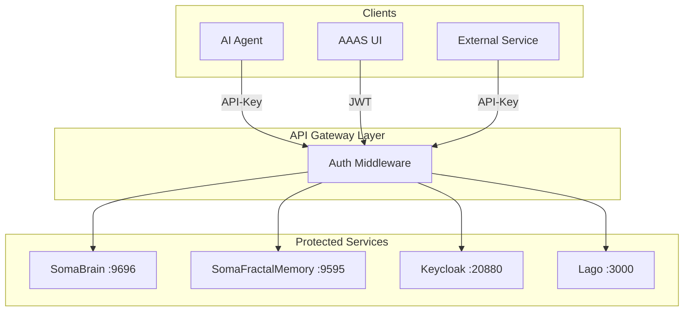
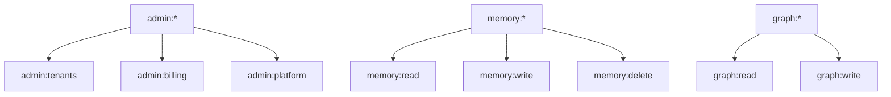
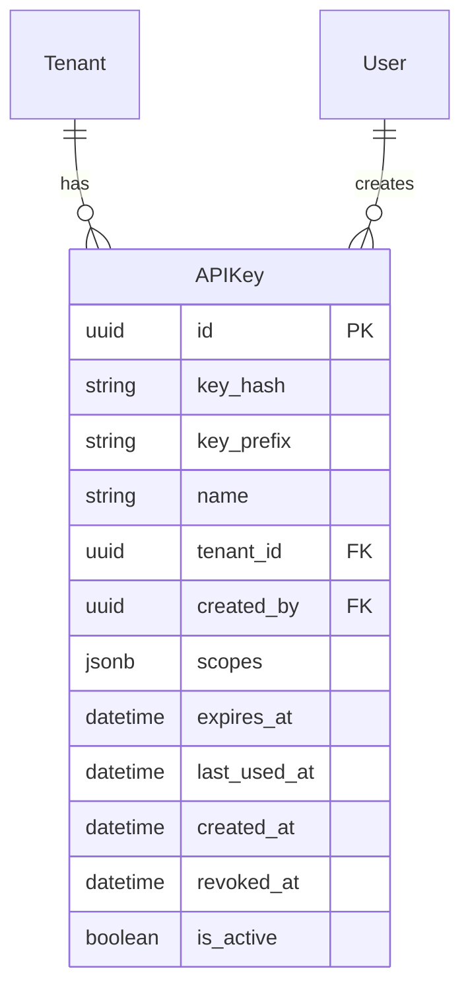
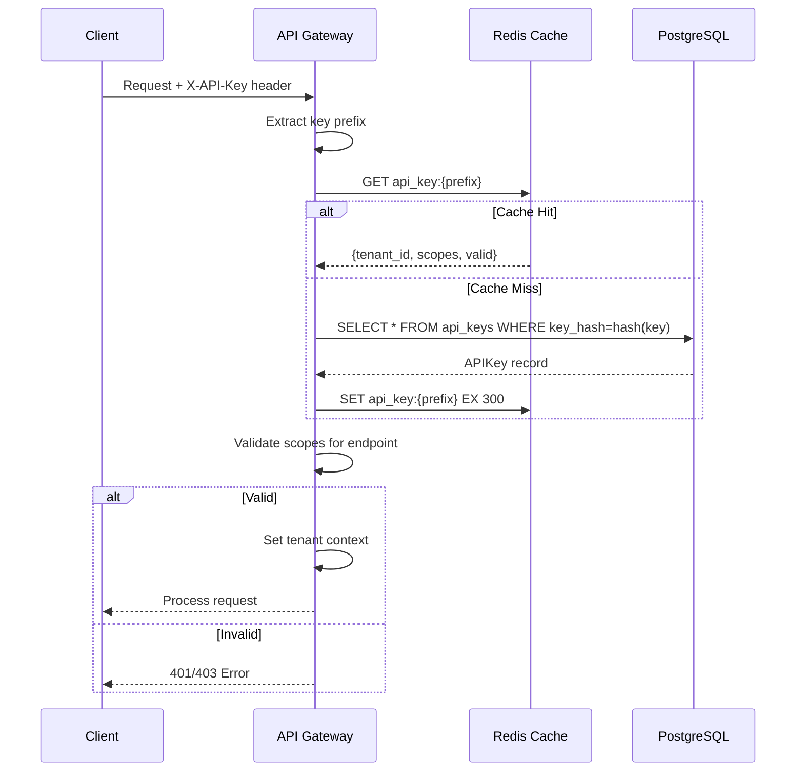

# API Key Authentication Layer

**Version:** 1.0.0  
**Date:** 2025-12-24  
**Purpose:** Unified API Key authentication across all platform components

---

## 1. Overview

Every component in the SomaBrain AAAS platform uses API key authentication for service-to-service and client-to-service communication.

---

## 2. Authentication Architecture



---

## 3. API Key Structure

### 3.1 Key Format
```
sb_live_<tenant_id>_<random_32_bytes_hex>
```

### 3.2 Key Components

| Part | Description | Example |
|------|-------------|---------|
| Prefix | Environment indicator | `sb_live_` or `sb_test_` |
| Tenant ID | Tenant identifier | `tenant_abc123` |
| Secret | Random 32 bytes hex | `a1b2c3d4...` (64 chars) |

### 3.3 Example
```
sb_live_tenant_abc123_a1b2c3d4e5f6789012345678901234567890abcdef12345678
```

---

## 4. API Key Scopes

### 4.1 Scope Hierarchy



### 4.2 Scope Definitions

| Scope | Description | Endpoints |
|-------|-------------|-----------|
| `memory:read` | Read memories | `GET /memories/*` |
| `memory:write` | Store memories | `POST /memories/*` |
| `memory:delete` | Delete memories | `DELETE /memories/*` |
| `graph:read` | Read graph | `GET /graph/*` |
| `graph:write` | Create links | `POST /graph/*` |
| `admin:tenants` | Manage tenants | `/admin/tenants/*` |
| `admin:billing` | View billing | `/admin/billing/*` |
| `admin:platform` | Platform settings | `/admin/settings/*` |

---

## 5. Per-Component Authentication

### 5.1 SomaBrain (Port 9696)

| Endpoint | Auth Method | Required Scope |
|----------|-------------|----------------|
| `POST /api/memory/remember` | API Key | `memory:write` |
| `POST /api/memory/recall` | API Key | `memory:read` |
| `DELETE /api/memory/{id}` | API Key | `memory:delete` |
| `GET /api/admin/tenants` | API Key + JWT | `admin:tenants` |
| `GET /health` | None | - |

### 5.2 SomaFractalMemory (Port 9595)

| Endpoint | Auth Method | Required Scope |
|----------|-------------|----------------|
| `POST /memories` | API Key | `memory:write` |
| `GET /memories/{coord}` | API Key | `memory:read` |
| `DELETE /memories/{coord}` | API Key | `memory:delete` |
| `POST /graph/link` | API Key | `graph:write` |
| `GET /graph/neighbors` | API Key | `graph:read` |
| `GET /healthz` | None | - |

### 5.3 Keycloak (Port 20880)

| Endpoint | Auth Method | Notes |
|----------|-------------|-------|
| Token endpoint | Client credentials | OAuth2 flow |
| Admin API | Admin token | Keycloak admin |

### 5.4 Lago (Port 3000)

| Endpoint | Auth Method | Notes |
|----------|-------------|-------|
| All API | API Key | `LAGO_API_KEY` |

---

## 6. API Key Permissions Matrix

### 6.1 By Role

| Permission | Super Admin | Platform Admin | Tenant Admin | Service Account |
|------------|:-----------:|:--------------:|:------------:|:---------------:|
| Create platform keys | ✓ | ✓ | ✗ | ✗ |
| Create tenant keys | ✓ | ✓ | ✓ | ✗ |
| View all keys | ✓ | ✓ | ✗ | ✗ |
| View own tenant keys | ✓ | ✓ | ✓ | ✓ |
| Revoke any key | ✓ | ✓ | ✗ | ✗ |
| Revoke own tenant key | ✓ | ✓ | ✓ | ✗ |
| Rotate own key | ✓ | ✓ | ✓ | ✓ |

### 6.2 By Key Type

| Key Type | Scope | Lifetime | Created By |
|----------|-------|----------|------------|
| Platform Key | All scopes | No expiry | Super Admin |
| Tenant Key | Tenant scopes | Configurable | Tenant Admin |
| Service Key | Limited scopes | No expiry | Platform Admin |
| Temporary Key | Single scope | 1 hour | Any Admin |

---

## 7. API Key Database Schema



### 7.1 Django Model

```python
class APIKey(models.Model):
    id = models.UUIDField(primary_key=True, default=uuid.uuid4)
    key_hash = models.CharField(max_length=128, unique=True)
    key_prefix = models.CharField(max_length=32)  # For identification
    name = models.CharField(max_length=255)
    tenant = models.ForeignKey('Tenant', on_delete=models.CASCADE)
    created_by = models.ForeignKey('User', on_delete=models.SET_NULL, null=True)
    scopes = models.JSONField(default=list)
    expires_at = models.DateTimeField(null=True, blank=True)
    last_used_at = models.DateTimeField(null=True, blank=True)
    created_at = models.DateTimeField(auto_now_add=True)
    revoked_at = models.DateTimeField(null=True, blank=True)
    is_active = models.BooleanField(default=True)
    
    class Meta:
        db_table = 'api_keys'
        indexes = [
            models.Index(fields=['key_hash']),
            models.Index(fields=['tenant', 'is_active']),
        ]
```

---

## 8. API Key Validation Flow



---

## 9. Environment Variables

| Variable | Service | Description |
|----------|---------|-------------|
| `SOMABRAIN_API_TOKEN` | SomaBrain | Legacy static token |
| `SOMA_API_TOKEN` | SomaFractalMemory | API authentication |
| `LAGO_API_KEY` | Lago | Billing API access |
| `KEYCLOAK_CLIENT_SECRET` | Keycloak | OAuth client secret |
| `REDIS_PASSWORD` | Redis | Cache auth (optional) |
| `POSTGRES_PASSWORD` | PostgreSQL | Database auth |

---

## 10. Security Requirements

| Requirement | Implementation |
|-------------|----------------|
| Key hashing | SHA-256 before storage |
| Rate limiting | Per-key rate limits |
| Expiration | Optional TTL per key |
| Rotation | Generate new, revoke old |
| Audit logging | All key operations logged |
| Scope validation | Check scope per endpoint |

---

*API Key Authentication Layer - SomaBrain AAAS Platform*
