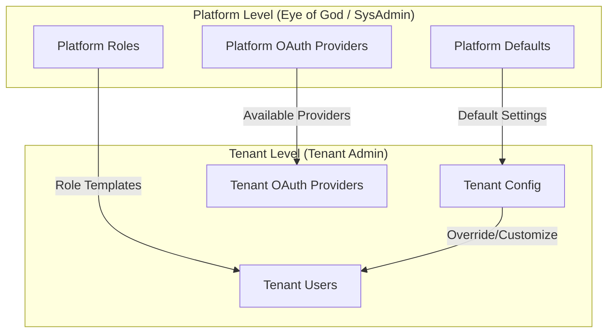
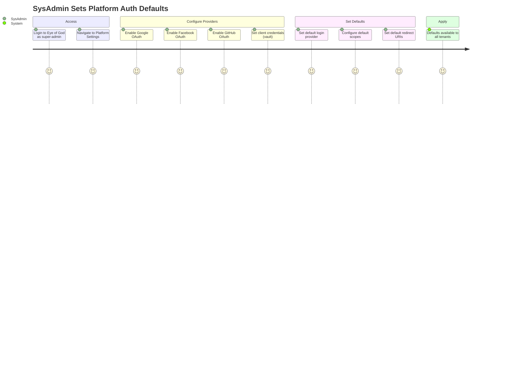
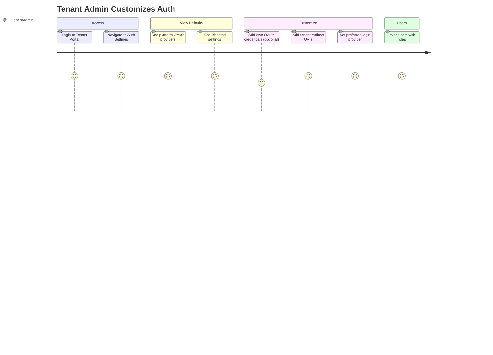
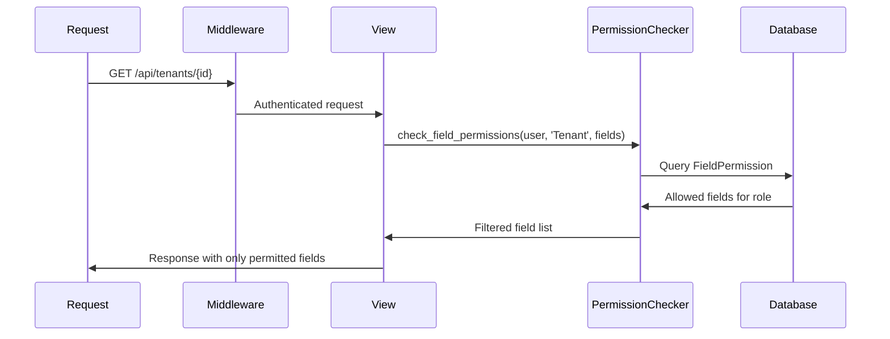
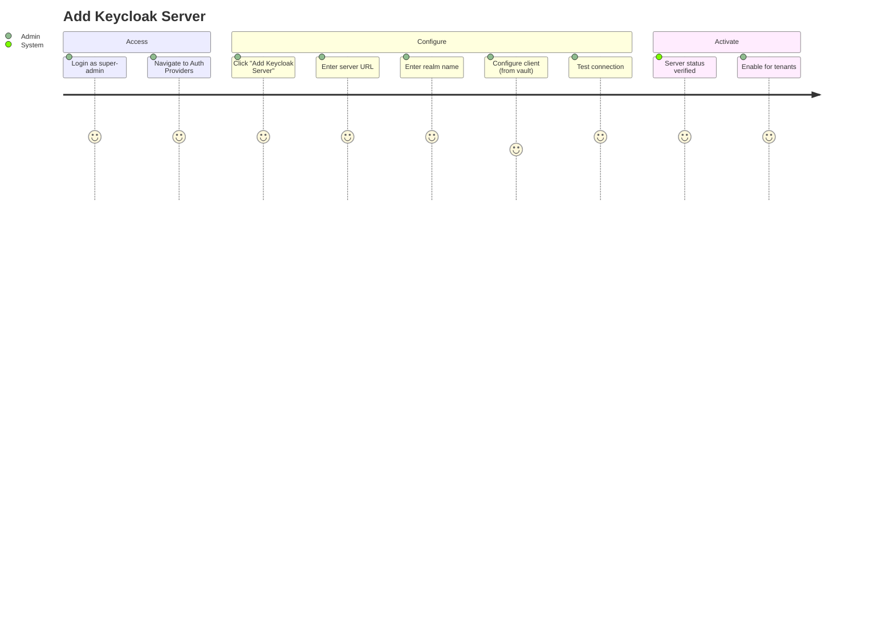
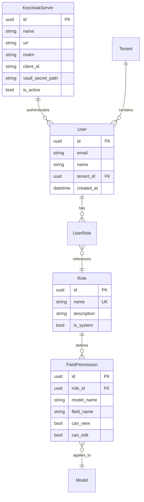
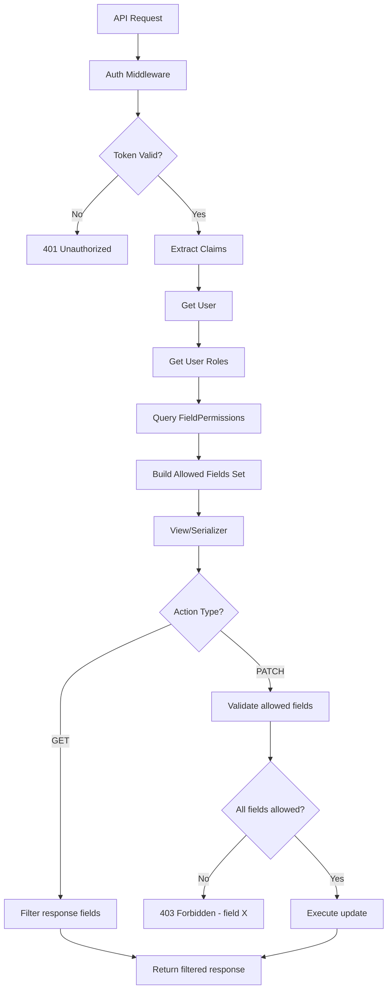

# Eye of God - Admin Permissions & User Management Design

**Document Version:** 1.1.0  
**Date:** 2025-12-24  
**Status:** DESIGN PHASE  
**Standard:** ISO/IEC/IEEE 29148:2018 Compatible

---

## 0. Hierarchical Authentication Architecture

### 0.1 Two-Level Configuration Model



### 0.2 Configuration Hierarchy

| Setting | Set By SysAdmin | Tenant Can Override | Stored |
|---------|-----------------|---------------------|--------|
| Available OAuth Providers | ✓ | ✗ (use or not) | Platform |
| Default Login Provider | ✓ | ✓ | Both |
| OAuth Client Credentials | ✓ (platform) | ✓ (own) | Vault |
| Allowed Redirect URIs | ✓ (defaults) | ✓ (add own) | DB |
| Role Templates | ✓ | ✓ (customize) | Both |
| Field Permissions | ✓ (defaults) | ✗ | Platform |
| User Invitations | ✗ | ✓ | Tenant |
| MFA Requirements | ✓ (enforced) | ✓ (more strict) | Both |

### 0.3 User Journey: SysAdmin Configures Platform Defaults



### 0.4 User Journey: Tenant Configures Own Auth



---

### 1.2 Permission Enforcement Model

| Layer | Enforced By | Granularity |
|-------|-------------|-------------|
| API Routes | Django Middleware | Endpoint |
| Views | Django Permissions | Object |
| Models | Django ORM | Field |
| Queries | SpiceDB (ReBAC) | Relationship |

---

## 2. Field-Level Granular Permissions

### 2.1 Django Permission Model

```python
# Permission Matrix Structure
class FieldPermission(models.Model):
    """Field-level permission for granular access control."""
    role = models.CharField(max_length=50)
    model = models.CharField(max_length=100)  # e.g., "Tenant"
    field = models.CharField(max_length=100)  # e.g., "billing_email"
    can_view = models.BooleanField(default=False)
    can_edit = models.BooleanField(default=False)
    
    class Meta:
        unique_together = ['role', 'model', 'field']
```

### 2.2 Field Permission Matrix

| Model | Field | super-admin | tenant-admin | tenant-user |
|-------|-------|-------------|--------------|-------------|
| **Tenant** | name | view/edit | view/edit | view |
| **Tenant** | billing_email | view/edit | view/edit | - |
| **Tenant** | api_key | view/rotate | - | - |
| **Tenant** | subscription_tier | view/edit | view | - |
| **Tenant** | usage_data | view | view | view |
| **User** | email | view/edit | view/edit | view |
| **User** | roles | view/edit | view | - |
| **User** | tenant_id | view/edit | - | - |
| **KeycloakServer** | url | view/edit | - | - |
| **KeycloakServer** | client_secret | rotate | - | - |
| **KeycloakServer** | realm | view/edit | - | - |

### 2.3 Enforcement in Django Views



---

## 3. User Journey: Manage Keycloak Servers

### 3.1 UJ-ADMIN-001: Add Keycloak Server

| Priority | **P0 - CRITICAL** |
|----------|-------------------|
| Actor | Super Admin only |
| Goal | Configure a new Keycloak identity provider |



---

## 4. Screen Designs

### 4.1 SCR-ADMIN-001: Auth Providers Management

| Priority | **P0 - CRITICAL** |
|----------|-------------------|
| Access | super-admin only |

```
┌─────────────────────────────────────────────────────────────────┐
│ 👁️ Eye of God  │  Settings > Authentication Providers          │
├─────────────────┴───────────────────────────────────────────────┤
│                                                                 │
│  ┌─────────────────────────────────────────────────────────┐    │
│  │  🔐 Identity Providers                    [+ Add New]   │    │
│  └─────────────────────────────────────────────────────────┘    │
│                                                                 │
│  ┌─────────────────────────────────────────────────────────┐    │
│  │                                                         │    │
│  │  ┌─────┐  Keycloak Primary                              │    │
│  │  │ 🟢  │  https://auth.somabrain.com                   │    │
│  │  └─────┘  Realm: somabrain │ Status: Active            │    │
│  │           [Configure] [Test Connection] [Disable]       │    │
│  │                                                         │    │
│  │  ┌─────┐  Google OAuth                                  │    │
│  │  │ 🟢  │  via Keycloak IDP                              │    │
│  │  └─────┘  Enabled │ Users: 45                           │    │
│  │           [Configure] [View Users]                       │    │
│  │                                                         │    │
│  └─────────────────────────────────────────────────────────┘    │
│                                                                 │
└─────────────────────────────────────────────────────────────────┘
```

### 4.2 SCR-ADMIN-002: Add/Edit Identity Provider (Complete Fields)

```
┌─────────────────────────────────────────────────────────────────┐
│ 👁️ Eye of God  │  Configure Identity Provider: Google OAuth    │
├─────────────────┴───────────────────────────────────────────────┤
│                                                                 │
│  ┌─────────────────────────────────────────────────────────┐    │
│  │  Provider Type: [Keycloak ▼] [Google ▼] [OIDC Generic ▼]│    │
│  └─────────────────────────────────────────────────────────┘    │
│                                                                 │
│  ═══════════════════════════════════════════════════════════    │
│  BASIC CONFIGURATION                                            │
│  ═══════════════════════════════════════════════════════════    │
│                                                                 │
│  Provider Name *                                                │
│  ┌─────────────────────────────────────────────────────────┐    │
│  │ Google OAuth Production                                 │    │
│  └─────────────────────────────────────────────────────────┘    │
│                                                                 │
│  Client ID *                                                    │
│  ┌─────────────────────────────────────────────────────────┐    │
│  │ 786567505985-46etdi4j46hocuo148a1bush1asiv0od.apps...   │    │
│  └─────────────────────────────────────────────────────────┘    │
│                                                                 │
│  Project ID                                                     │
│  ┌─────────────────────────────────────────────────────────┐    │
│  │ gen-lang-client-0525903828                              │    │
│  └─────────────────────────────────────────────────────────┘    │
│                                                                 │
│  ═══════════════════════════════════════════════════════════    │
│  🔒 SECRETS (Stored in Vault)                                   │
│  ═══════════════════════════════════════════════════════════    │
│                                                                 │
│  Client Secret * 🔐                                             │
│  ┌─────────────────────────────────────────────────────────┐    │
│  │ ••••••••••••••••••••••••••••••   [👁️ Show] [🔄 Rotate] │    │
│  └─────────────────────────────────────────────────────────┘    │
│  Vault Path: vault://secrets/oauth/google/client_secret         │
│                                                                 │
│  ═══════════════════════════════════════════════════════════    │
│  ENDPOINTS                                                       │
│  ═══════════════════════════════════════════════════════════    │
│                                                                 │
│  Auth URI *                                                     │
│  ┌─────────────────────────────────────────────────────────┐    │
│  │ https://accounts.google.com/o/oauth2/auth               │    │
│  └─────────────────────────────────────────────────────────┘    │
│                                                                 │
│  Token URI *                                                    │
│  ┌─────────────────────────────────────────────────────────┐    │
│  │ https://oauth2.googleapis.com/token                     │    │
│  └─────────────────────────────────────────────────────────┘    │
│                                                                 │
│  Certs URL                                                      │
│  ┌─────────────────────────────────────────────────────────┐    │
│  │ https://www.googleapis.com/oauth2/v1/certs              │    │
│  └─────────────────────────────────────────────────────────┘    │
│                                                                 │
│  ═══════════════════════════════════════════════════════════    │
│  REDIRECT & ORIGINS                                             │
│  ═══════════════════════════════════════════════════════════    │
│                                                                 │
│  Redirect URIs *                                                │
│  ┌─────────────────────────────────────────────────────────┐    │
│  │ http://localhost:5173/auth/callback                     │    │
│  │ https://eyeofgod.somabrain.com/auth/callback    [+ Add] │    │
│  └─────────────────────────────────────────────────────────┘    │
│                                                                 │
│  JavaScript Origins                                             │
│  ┌─────────────────────────────────────────────────────────┐    │
│  │ http://localhost:5173                                   │    │
│  │ https://eyeofgod.somabrain.com                  [+ Add] │    │
│  └─────────────────────────────────────────────────────────┘    │
│                                                                 │
│  ═══════════════════════════════════════════════════════════    │
│  SCOPES & CLAIMS                                                │
│  ═══════════════════════════════════════════════════════════    │
│                                                                 │
│  Default Scopes                                                 │
│  ┌─────────────────────────────────────────────────────────┐    │
│  │ [✓] openid  [✓] email  [✓] profile  [ ] phone          │    │
│  └─────────────────────────────────────────────────────────┘    │
│                                                                 │
│  Claim Mappings                                                 │
│  ┌──────────────┬───────────────────────────────┐               │
│  │ Our Field    │ Provider Claim                │               │
│  ├──────────────┼───────────────────────────────┤               │
│  │ tenant_id    │ custom:tenant_id              │               │
│  │ roles        │ realm_access.roles            │               │
│  │ email        │ email                         │               │
│  └──────────────┴───────────────────────────────┘               │
│                                                                 │
│  ═══════════════════════════════════════════════════════════    │
│  STATUS                                                         │
│  ═══════════════════════════════════════════════════════════    │
│                                                                 │
│  [✓] Enabled   [ ] Trust Email   [✓] Store Token                │
│                                                                 │
│  ┌──────────────────────────────────────────────────────────    │
│  │  [Test Connection]    [Cancel]    [💾 Save to Vault]    │    │
│  └──────────────────────────────────────────────────────────    │
│                                                                 │
└─────────────────────────────────────────────────────────────────┘
```

### 4.2.1 Complete Provider Data Model

| Field | Type | Storage | Required | Editable |
|-------|------|---------|----------|----------|
| `name` | string | DB | ✓ | ✓ |
| `provider_type` | enum | DB | ✓ | ✗ |
| `client_id` | string | DB | ✓ | ✓ |
| `project_id` | string | DB | | ✓ |
| `client_secret` | string | **VAULT** | ✓ | ✓ |
| `auth_uri` | url | DB | ✓ | ✓ |
| `token_uri` | url | DB | ✓ | ✓ |
| `certs_url` | url | DB | | ✓ |
| `redirect_uris` | array | DB | ✓ | ✓ |
| `javascript_origins` | array | DB | | ✓ |
| `default_scopes` | array | DB | ✓ | ✓ |
| `claim_mappings` | json | DB | | ✓ |
| `is_enabled` | bool | DB | ✓ | ✓ |
| `trust_email` | bool | DB | | ✓ |
| `store_token` | bool | DB | | ✓ |
| `vault_secret_path` | string | DB | ✓ | ✗ |

### 4.3 SCR-ADMIN-003: User Management

```
┌─────────────────────────────────────────────────────────────────┐
│ 👁️ Eye of God  │  Users & Permissions                          │
├─────────────────┴───────────────────────────────────────────────┤
│                                                                 │
│  ┌───────────────────────────────┐  ┌────────────────────────┐  │
│  │  👥 All Users: 156            │  │  [+ Create User]       │  │
│  └───────────────────────────────┘  └────────────────────────┘  │
│                                                                 │
│  ┌─────────────────────────────────────────────────────────┐    │
│  │  Filter: [All Tenants ▼] [All Roles ▼] [Search...]      │    │
│  └─────────────────────────────────────────────────────────┘    │
│                                                                 │
│  ┌─────────────────────────────────────────────────────────┐    │
│  │ ☐ │ Name          │ Email           │ Tenant  │ Role    │    │
│  ├───┼───────────────┼─────────────────┼─────────┼─────────│    │
│  │ ☐ │ John Admin    │ john@acme.com   │ Acme    │ t-admin │    │
│  │ ☐ │ Jane User     │ jane@acme.com   │ Acme    │ t-user  │    │
│  │ ☐ │ Bob Super     │ bob@soma.com    │ Platform│ s-admin │    │
│  └─────────────────────────────────────────────────────────┘    │
│                                                                 │
│  [Edit Selected] [Change Role] [Disable] [Delete]               │
│                                                                 │
└─────────────────────────────────────────────────────────────────┘
```

### 4.4 SCR-ADMIN-004: Role & Permission Editor

```
┌─────────────────────────────────────────────────────────────────┐
│ 👁️ Eye of God  │  Edit Role: tenant-admin                      │
├─────────────────┴───────────────────────────────────────────────┤
│                                                                 │
│  ┌─────────────────────────────────────────────────────────┐    │
│  │  Role Details                                           │    │
│  │  Name: tenant-admin                                     │    │
│  │  Description: Full admin of a single tenant             │    │
│  └─────────────────────────────────────────────────────────┘    │
│                                                                 │
│  ┌─────────────────────────────────────────────────────────┐    │
│  │  Field-Level Permissions                                │    │
│  │                                                         │    │
│  │  Model: Tenant                                          │    │
│  │  ┌──────────────────┬────────┬────────┐                 │    │
│  │  │ Field            │ View   │ Edit   │                 │    │
│  │  ├──────────────────┼────────┼────────┤                 │    │
│  │  │ name             │ [✓]    │ [✓]    │                 │    │
│  │  │ billing_email    │ [✓]    │ [✓]    │                 │    │
│  │  │ api_key          │ [ ]    │ [ ]    │                 │    │
│  │  │ subscription_tier│ [✓]    │ [ ]    │                 │    │
│  │  │ usage_data       │ [✓]    │ [ ]    │                 │    │
│  │  └──────────────────┴────────┴────────┘                 │    │
│  │                                                         │    │
│  │  Model: User                                            │    │
│  │  ┌──────────────────┬────────┬────────┐                 │    │
│  │  │ Field            │ View   │ Edit   │                 │    │
│  │  ├──────────────────┼────────┼────────┤                 │    │
│  │  │ email            │ [✓]    │ [✓]    │                 │    │
│  │  │ roles            │ [✓]    │ [ ]    │                 │    │
│  │  │ tenant_id        │ [ ]    │ [ ]    │                 │    │
│  │  └──────────────────┴────────┴────────┘                 │    │
│  │                                                         │    │
│  └─────────────────────────────────────────────────────────┘    │
│                                                                 │
│  [Cancel]  [Save Permissions]                                   │
│                                                                 │
└─────────────────────────────────────────────────────────────────┘
```

---

## 5. Django Models for Permissions



---

## 6. Permission Enforcement Flow



---

## 7. Priority Matrix - Admin Features

| Feature | Priority | Effort | Pre-requisites |
|---------|----------|--------|----------------|
| Role model with permissions | P0 | Medium | Database |
| FieldPermission model | P0 | Medium | Role model |
| Permission middleware | P0 | High | FieldPermission |
| User management screen | P0 | High | Auth system |
| Keycloak server management | P0 | Medium | Admin UI |
| Role editor UI | P1 | High | Role model |
| Field permission editor | P1 | High | FieldPermission |
| Audit logging | P1 | Medium | All above |
| Permission inheritance | P2 | High | Role model |

---

## 8. Implementation Order

| Sprint | Focus | Deliverables |
|--------|-------|--------------|
| 1 | Foundation | Role, FieldPermission models |
| 2 | Backend | Permission middleware, API filters |
| 3 | Admin UI | User management, Keycloak screens |
| 4 | Granular | Role editor, field permission UI |

---

*VIBE Coding Rules: ALL 10 PERSONAS applied*
