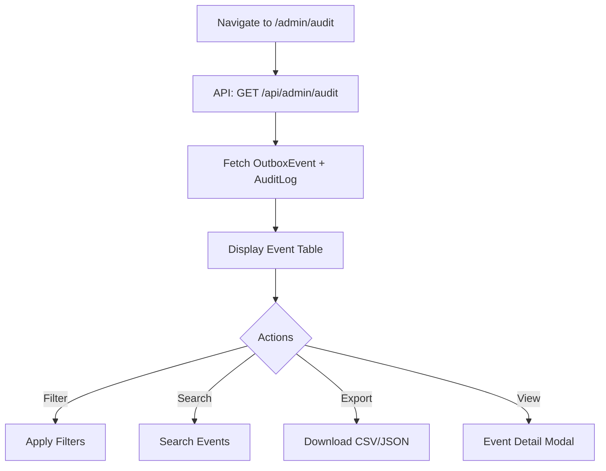
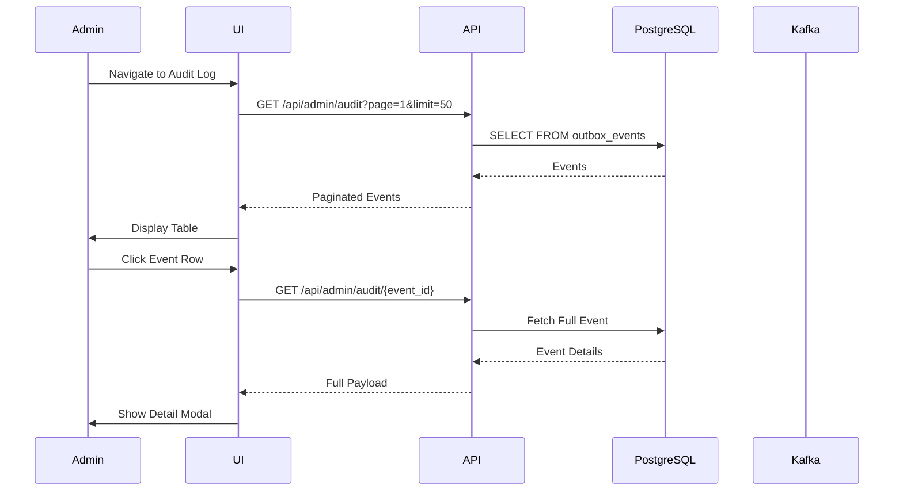
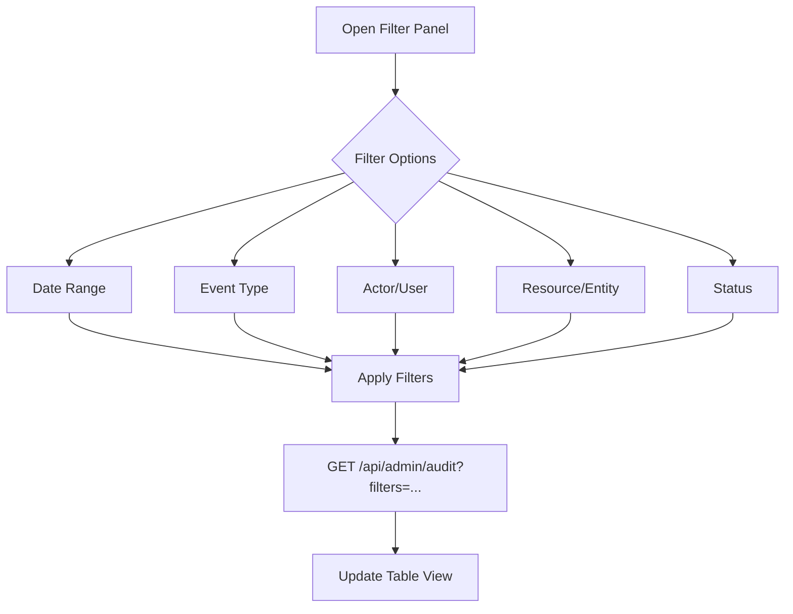
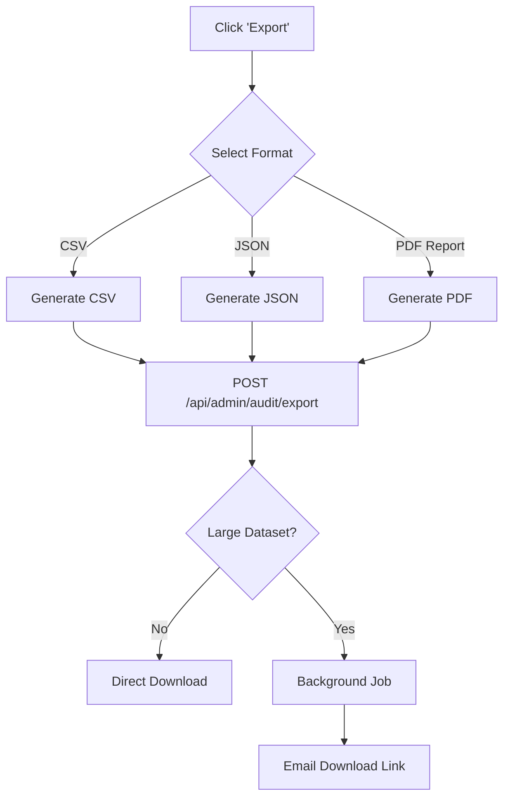
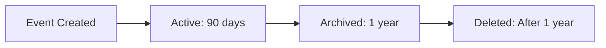

# Audit Log Flow

**Document Version:** 1.0.0  
**Date:** 2025-12-24  
**Type:** End-to-End Flow Documentation

---

## 1. Overview

Complete audit log flows: view events, filter, search, export.

---

## 2. View Audit Log Flow

---

## 3. Audit Log Sequence

---

## 4. Filter Audit Events Flow

---

## 5. Export Audit Log Flow

---

## 6. Audit Event Types

| Event Type | Description | Example |
|------------|-------------|---------|
| `user.login` | User authentication | Login via SSO |
| `user.logout` | Session ended | Manual logout |
| `tenant.created` | New tenant | Admin created org |
| `tenant.suspended` | Tenant paused | Payment failure |
| `memory.stored` | Memory created | API call |
| `subscription.changed` | Plan changed | Upgrade to Pro |
| `admin.action` | Admin operation | Impersonation |

---

## 7. Audit Retention Policy

---

*Document prepared by ALL 7 PERSONAS per VIBE Coding Rules v5.1*
