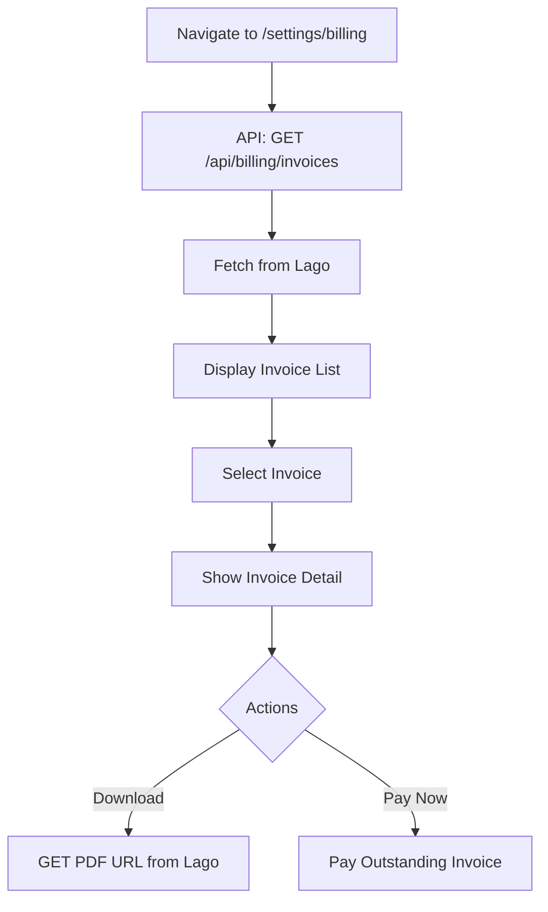
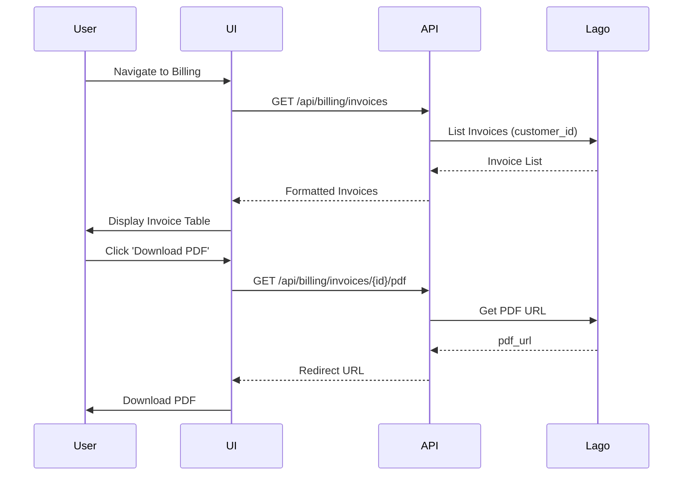
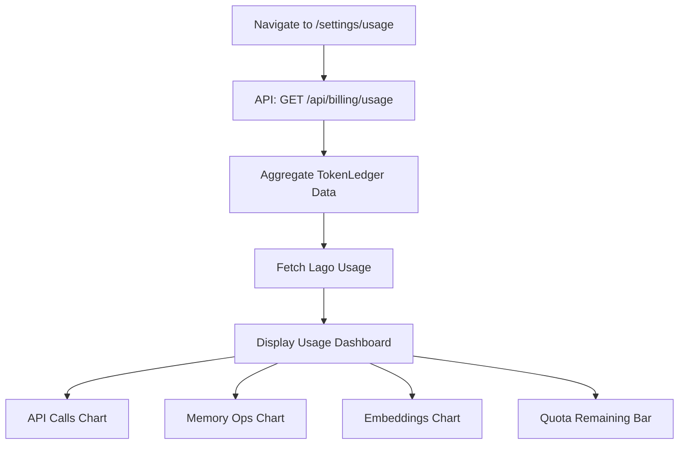
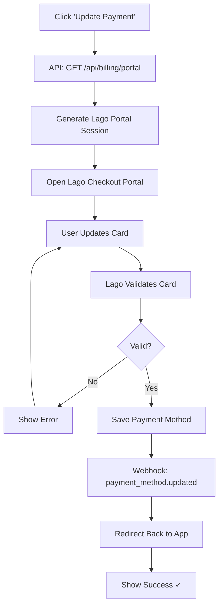
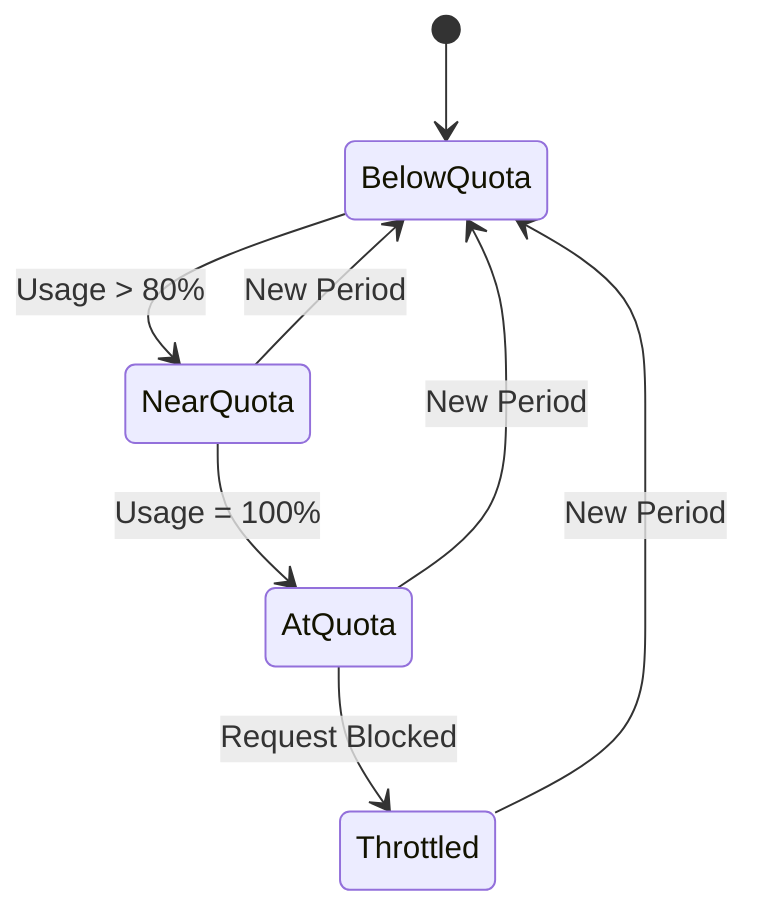

# Billing & Invoices Flow

**Document Version:** 1.0.0  
**Date:** 2025-12-24  
**Type:** End-to-End Flow Documentation

---

## 1. Overview

Complete billing flows: view invoices, download PDFs, update payment, view usage.

---

## 2. View Invoices Flow

---

## 3. Invoice List Sequence

---

## 4. View Usage Dashboard Flow

---

## 5. Update Payment Method Flow

---

## 6. Usage Tracking State Machine

---

## 7. Invoice Status

| Status | Description | Action |
|--------|-------------|--------|
| `draft` | Not yet finalized | View only |
| `finalized` | Ready for payment | Pay now |
| `paid` | Payment received | Download receipt |
| `voided` | Cancelled | N/A |
| `failed` | Payment failed | Update payment |

---

*Document prepared by ALL 7 PERSONAS per VIBE Coding Rules v5.1*
