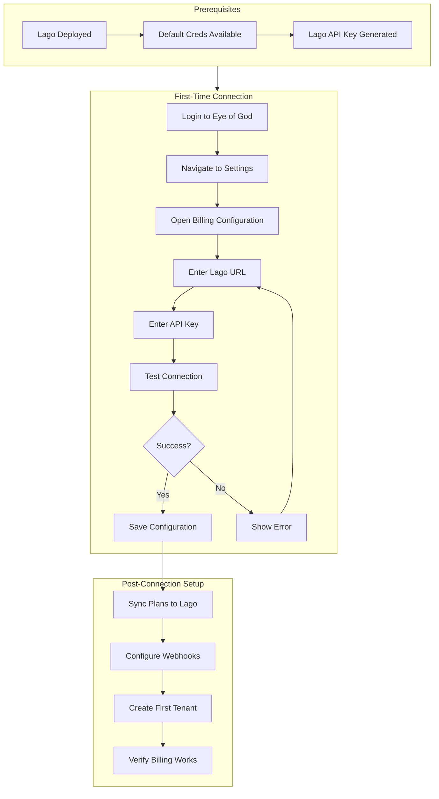

# Billing Service Connection Flow

**Version:** 1.0.0  
**Date:** 2025-12-24  
**Actor:** AAAS Sys Admin (Super Admin / Platform Admin)  
**Purpose:** Complete journey for connecting SomaBrain to a billing service

---

## 0. Architecture: Provider Abstraction

### The UI is a GENERIC Billing Manager

The Eye of God UI presents a **provider-agnostic billing interface**. The user never interacts with "Lago" directly - they interact with:
- Plans
- Subscriptions  
- Invoices
- Credits
- Usage

### Backend: Billing Provider Catalog

The backend maintains a **catalog of billing providers**. Each provider implements the same interface:

```
┌─────────────────────────────────────────────────────────────────────────────────┐
│                         EYE OF GOD UI                                           │
│                    (Generic Billing Manager)                                    │
│                                                                                 │
│      Plans • Subscriptions • Invoices • Credits • Usage • Coupons             │
│                                                                                 │
└──────────────────────────────────┬──────────────────────────────────────────────┘
                                   │
                                   ▼
┌─────────────────────────────────────────────────────────────────────────────────┐
│                      BILLING ABSTRACTION LAYER                                  │
│                                                                                 │
│     class BillingProvider(ABC):                                                │
│         def create_customer(tenant)                                            │
│         def create_subscription(customer, plan)                                │
│         def change_subscription(subscription, new_plan)                        │
│         def cancel_subscription(subscription)                                  │
│         def report_usage(customer, events)                                     │
│         def get_invoices(customer)                                             │
│         def apply_credit(customer, amount)                                     │
│         def create_plan(plan_data)                                             │
│         def test_connection()                                                  │
│                                                                                 │
└──────────────────────────────────┬──────────────────────────────────────────────┘
                                   │
              ┌────────────────────┼────────────────────┐
              ▼                    ▼                    ▼
        ┌───────────┐        ┌───────────┐        ┌───────────┐
        │   LAGO    │        │  STRIPE   │        │ CHARGEBEE │
        │ (default) │        │ (future)  │        │ (future)  │
        │           │        │           │        │           │
        │ ✅ Active │        │ ⚪ Avail.  │        │ ⚪ Avail.  │
        └───────────┘        └───────────┘        └───────────┘
```

### Provider Configuration Model

```python
class BillingProvider(models.Model):
    """Catalog of available billing providers"""
    code = models.CharField(unique=True)  # 'lago', 'stripe', 'chargebee'
    name = models.CharField()              # 'Lago Open Source'
    is_active = models.BooleanField()      # Only one active at a time
    is_default = models.BooleanField()     # Lago is always default
    config = models.JSONField()            # Provider-specific config
    
    # Connection
    api_url = models.URLField()
    api_key = models.CharField(encrypted=True)
    webhook_secret = models.CharField(encrypted=True)
    connected = models.BooleanField()
    last_tested_at = models.DateTimeField()
```

### Default: Lago Open Source (Always)

- Lago is the **default and primary** billing provider
- Other providers may be added in future
- UI abstracts this - user just sees "Billing"
- Configuration screen shows available providers

---

## 1. Journey Overview



---

## 2. Prerequisites

### 2.1 Lago Deployment

Before the AAAS Admin can connect, Lago must be running:

**Option A: Self-Hosted (Docker)**
```yaml
# docker-compose.lago.yml is already configured
# Default credentials set via environment:
LAGO_FRONT_URL=http://localhost:8080
LAGO_API_URL=http://localhost:3000
# Default admin: created on first Lago UI access
```

**Option B: Lago Cloud**
```
URL: https://api.getlago.com
API Key: Obtained from Lago Cloud dashboard
```

### 2.2 Obtain Lago API Key

1. Access Lago UI (http://localhost:8080 or cloud)
2. Login with default/created credentials
3. Go to Settings → API Keys
4. Copy the API key

---

## 3. Screen 1: Eye of God Login

**Route:** `/login`  
**Role Required:** None (public)

```
┌─────────────────────────────────────────────────────────────────────────────────┐
│                                                                                 │
│                              🧠 SomaBrain                                       │
│                           AAAS Administration                                   │
│                                                                                 │
│                        ┌────────────────────────────┐                           │
│                        │                            │                           │
│                        │ Email                      │                           │
│                        │ [admin@somabrain.ai______] │                           │
│                        │                            │                           │
│                        │ Password                   │                           │
│                        │ [●●●●●●●●●●●●●●●●________] │                           │
│                        │                            │                           │
│                        │    [     Sign In     ]     │                           │
│                        │                            │                           │
│                        │    ────── or ──────        │                           │
│                        │                            │                           │
│                        │ [G Sign in with Google]    │                           │
│                        │ [🔐 Sign in with SSO  ]    │                           │
│                        │                            │                           │
│                        └────────────────────────────┘                           │
│                                                                                 │
└─────────────────────────────────────────────────────────────────────────────────┘
```

**Action:** Login with admin credentials → Redirected to Dashboard

---

## 4. Screen 2: Platform Dashboard (First Visit)

**Route:** `/platform`  
**Role Required:** Platform Admin+

```
┌─────────────────────────────────────────────────────────────────────────────────┐
│ 🔱 Eye of God - Platform Dashboard                              [Admin ▼] [?]  │
├─────────────────────────────────────────────────────────────────────────────────┤
│                                                                                 │
│ ⚠️ SETUP REQUIRED                                                               │
│ ┌─────────────────────────────────────────────────────────────────────────────┐│
│ │                                                                             ││
│ │  Billing service not configured. Connect to Lago to enable:                ││
│ │                                                                             ││
│ │  • Subscription management                                                  ││
│ │  • Usage-based billing                                                      ││
│ │  • Invoice generation                                                       ││
│ │  • Customer payment tracking                                                ││
│ │                                                                             ││
│ │                         [Configure Billing →]                               ││
│ │                                                                             ││
│ └─────────────────────────────────────────────────────────────────────────────┘│
│                                                                                 │
│  ┌──────────────┐  ┌──────────────┐  ┌──────────────┐  ┌──────────────┐       │
│  │    MRR       │  │   TENANTS    │  │   USERS      │  │   HEALTH     │       │
│  │    --        │  │      0       │  │      0       │  │     ✅       │       │
│  │  No billing  │  │  No tenants  │  │   1 admin    │  │   All OK     │       │
│  └──────────────┘  └──────────────┘  └──────────────┘  └──────────────┘       │
│                                                                                 │
└─────────────────────────────────────────────────────────────────────────────────┘
```

**Action:** Click `[Configure Billing →]` → Navigate to Billing Settings

---

## 5. Screen 3: Billing Configuration - Empty State

**Route:** `/platform/settings/billing`  
**Role Required:** Super Admin

```
┌─────────────────────────────────────────────────────────────────────────────────┐
│ 🔱 Settings › Billing Configuration                                            │
├─────────────────────────────────────────────────────────────────────────────────┤
│                                                                                 │
│ ┌─────────────────────────────────────────────────────────────────────────────┐│
│ │                                                                             ││
│ │                         💳 Connect Billing Service                          ││
│ │                                                                             ││
│ │  SomaBrain uses Lago for billing management. You can connect to:           ││
│ │                                                                             ││
│ │  ┌───────────────────┐          ┌───────────────────┐                      ││
│ │  │                   │          │                   │                      ││
│ │  │  🐳 Self-Hosted   │          │  ☁️ Lago Cloud     │                      ││
│ │  │                   │          │                   │                      ││
│ │  │  Your own Docker  │          │  lago.cloud.com   │                      ││
│ │  │  deployment       │          │  managed service  │                      ││
│ │  │                   │          │                   │                      ││
│ │  │   [Configure]     │          │   [Configure]     │                      ││
│ │  │                   │          │                   │                      ││
│ │  └───────────────────┘          └───────────────────┘                      ││
│ │                                                                             ││
│ │  ───────────────────────────────────────────────────────────────────────   ││
│ │                                                                             ││
│ │  📚 Need help?                                                              ││
│ │  • How to deploy Lago locally                                              ││
│ │  • How to get your Lago API key                                            ││
│ │  • Lago Cloud pricing                                                       ││
│ │                                                                             ││
│ └─────────────────────────────────────────────────────────────────────────────┘│
│                                                                                 │
└─────────────────────────────────────────────────────────────────────────────────┘
```

**Action:** Click `[Configure]` on Self-Hosted → Show configuration form

---

## 6. Screen 4: Billing Configuration - Connection Form

**Route:** `/platform/settings/billing`  
**Role Required:** Super Admin

```
┌─────────────────────────────────────────────────────────────────────────────────┐
│ 🔱 Settings › Billing Configuration                         [Test Connection]  │
├─────────────────────────────────────────────────────────────────────────────────┤
│                                                                                 │
│ LAGO CONNECTION                                                                 │
│ ═════════════════════════════════════════════════════════════════════════════  │
│                                                                                 │
│ Deployment Type                                                                 │
│ ┌─────────────────────────────────────────────────────────────────────────────┐│
│ │ ● Self-Hosted   ○ Lago Cloud                                               ││
│ └─────────────────────────────────────────────────────────────────────────────┘│
│                                                                                 │
│ Lago API URL *                                                                  │
│ ┌─────────────────────────────────────────────────────────────────────────────┐│
│ │ http://lago-api:3000                                                        ││
│ └─────────────────────────────────────────────────────────────────────────────┘│
│ ℹ️ Internal URL where Lago API is accessible (e.g., http://lago-api:3000)       │
│                                                                                 │
│ Lago API Key *                                                                  │
│ ┌─────────────────────────────────────────────────────────────────────────────┐│
│ │ 90993fbe-4ae1-4ef3-abe0-06fccf03c1fd                         [👁 Show]     ││
│ └─────────────────────────────────────────────────────────────────────────────┘│
│ ℹ️ API key from Lago Settings → API Keys                                        │
│                                                                                 │
│ Webhook Secret (optional)                                                       │
│ ┌─────────────────────────────────────────────────────────────────────────────┐│
│ │                                                              [Generate]     ││
│ └─────────────────────────────────────────────────────────────────────────────┘│
│ ℹ️ Used to verify webhook payloads from Lago                                    │
│                                                                                 │
│ Connection Status: ○ Not tested                                                │
│                                                                                 │
│                                                         [Test Connection]      │
│                                                                                 │
└─────────────────────────────────────────────────────────────────────────────────┘
```

**Action:** Enter Lago URL and API Key, click `[Test Connection]`

---

## 7. Screen 5: Connection Test - In Progress

```
┌─────────────────────────────────────────────────────────────────────────────────┐
│ 🔱 Settings › Billing Configuration                         [Test Connection]  │
├─────────────────────────────────────────────────────────────────────────────────┤
│                                                                                 │
│ LAGO CONNECTION                                                                 │
│ ═════════════════════════════════════════════════════════════════════════════  │
│                                                                                 │
│ ...                                                                             │
│                                                                                 │
│ Connection Status: ⏳ Testing connection...                                     │
│                                                                                 │
│ ┌─────────────────────────────────────────────────────────────────────────────┐│
│ │  ⏳ Connecting to http://lago-api:3000...                                   ││
│ │  ⏳ Validating API key...                                                   ││
│ │  ⏳ Fetching organization info...                                           ││
│ └─────────────────────────────────────────────────────────────────────────────┘│
│                                                                                 │
└─────────────────────────────────────────────────────────────────────────────────┘
```

---

## 8. Screen 6: Connection Test - Success

```
┌─────────────────────────────────────────────────────────────────────────────────┐
│ 🔱 Settings › Billing Configuration                         [Test Connection]  │
├─────────────────────────────────────────────────────────────────────────────────┤
│                                                                                 │
│ LAGO CONNECTION                                                                 │
│ ═════════════════════════════════════════════════════════════════════════════  │
│                                                                                 │
│ ...                                                                             │
│                                                                                 │
│ Connection Status: ✅ Connected successfully!                                   │
│                                                                                 │
│ ┌─────────────────────────────────────────────────────────────────────────────┐│
│ │                                                                             ││
│ │  ✅ CONNECTION SUCCESSFUL                                                   ││
│ │                                                                             ││
│ │  Organization:    SomaBrain AAAS                                           ││
│ │  Lago ID:         3e970518-e37d-4d6d-8cff-d989a3a413b7                     ││
│ │  Currency:        USD                                                       ││
│ │  Timezone:        UTC                                                       ││
│ │  Existing Plans:  4 (Free, Starter, Pro, Enterprise)                       ││
│ │                                                                             ││
│ └─────────────────────────────────────────────────────────────────────────────┘│
│                                                                                 │
│ BILLING BEHAVIOR                                                                │
│ ═════════════════════════════════════════════════════════════════════════════  │
│                                                                                 │
│ Default Currency                                                                │
│ ┌─────────────────────────────────────────────────────────────────────────────┐│
│ │ [USD - US Dollar ▼]                                                        ││
│ └─────────────────────────────────────────────────────────────────────────────┘│
│                                                                                 │
│ Default Trial Period (days)                                                     │
│ ┌─────────────────────────────────────────────────────────────────────────────┐│
│ │ [14______]                                                                  ││
│ └─────────────────────────────────────────────────────────────────────────────┘│
│                                                                                 │
│ [x] Auto-create Lago customer when tenant created                              │
│ [x] Auto-assign subscription based on selected tier                            │
│ [x] Sync subscription plans to Lago                                            │
│ [x] Send invoice emails through Lago                                           │
│ [ ] Enable overage charges                                                      │
│                                                                                 │
│ ═════════════════════════════════════════════════════════════════════════════  │
│                                                                                 │
│ WEBHOOK CONFIGURATION                                                           │
│ ═════════════════════════════════════════════════════════════════════════════  │
│                                                                                 │
│ Your webhook endpoint (configure in Lago):                                      │
│ ┌─────────────────────────────────────────────────────────────────────────────┐│
│ │ https://api.somabrain.com/webhooks/lago/                      [📋 Copy]    ││
│ └─────────────────────────────────────────────────────────────────────────────┘│
│                                                                                 │
│ Subscribe to events:                                                            │
│ [x] invoice.created          [x] invoice.paid                                  │
│ [x] invoice.payment_failed   [x] subscription.started                          │
│ [x] subscription.terminated  [x] customer.payment_overdue                      │
│                                                                                 │
│                                                                                 │
│                                               [Cancel]  [Save Configuration]   │
│                                                                                 │
└─────────────────────────────────────────────────────────────────────────────────┘
```

**Action:** Configure options, click `[Save Configuration]`

---

## 9. Screen 7: Connection Test - Error

**Alternate path if connection fails:**

```
┌─────────────────────────────────────────────────────────────────────────────────┐
│ 🔱 Settings › Billing Configuration                         [Test Connection]  │
├─────────────────────────────────────────────────────────────────────────────────┤
│                                                                                 │
│ ...                                                                             │
│                                                                                 │
│ Connection Status: ❌ Connection failed                                         │
│                                                                                 │
│ ┌─────────────────────────────────────────────────────────────────────────────┐│
│ │                                                                             ││
│ │  ❌ CONNECTION FAILED                                                       ││
│ │                                                                             ││
│ │  Error: Unable to connect to Lago API                                      ││
│ │                                                                             ││
│ │  Details:                                                                   ││
│ │  • Status: 401 Unauthorized                                                ││
│ │  • Message: Invalid API key                                                 ││
│ │                                                                             ││
│ │  Troubleshooting:                                                           ││
│ │  1. Verify the API key is correct                                          ││
│ │  2. Ensure the Lago server is running                                      ││
│ │  3. Check network connectivity                                             ││
│ │  4. Confirm the URL is correct (internal Docker network?)                  ││
│ │                                                                             ││
│ │                                              [Retry] [View Lago Docs]       ││
│ │                                                                             ││
│ └─────────────────────────────────────────────────────────────────────────────┘│
│                                                                                 │
└─────────────────────────────────────────────────────────────────────────────────┘
```

---

## 10. Screen 8: Configuration Saved - Success Toast

```
┌─────────────────────────────────────────────────────────────────────────────────┐
│ 🔱 Settings › Billing Configuration                                            │
├─────────────────────────────────────────────────────────────────────────────────┤
│                                                                                 │
│ ┌─────────────────────────────────────────────────────────────────────────────┐│
│ │ ✅ Billing configuration saved successfully!                    [Dismiss]  ││
│ └─────────────────────────────────────────────────────────────────────────────┘│
│                                                                                 │
│ LAGO CONNECTION                                                                 │
│ ═════════════════════════════════════════════════════════════════════════════  │
│                                                                                 │
│ Status: ✅ Connected                                                            │
│ Organization: SomaBrain AAAS                                                   │
│ Last Sync: Just now                                                             │
│                                                                                 │
│ ┌─────────────────────────────────────────────────────────────────────────────┐│
│ │                                                                             ││
│ │  ✅ WHAT'S NEXT?                                                            ││
│ │                                                                             ││
│ │  Your billing service is now connected! Here's what you can do:            ││
│ │                                                                             ││
│ │  1. → Review Subscription Plans                                            ││
│ │     Sync and manage your pricing tiers                                     ││
│ │                                                                             ││
│ │  2. → Create Your First Tenant                                             ││
│ │     New tenants will automatically get a Lago customer                     ││
│ │                                                                             ││
│ │  3. → Configure Webhook in Lago                                            ││
│ │     Copy the webhook URL and add it to Lago settings                       ││
│ │                                                                             ││
│ └─────────────────────────────────────────────────────────────────────────────┘│
│                                                                                 │
│ [View Plans]  [Create Tenant]  [Open Lago Dashboard ↗]                         │
│                                                                                 │
└─────────────────────────────────────────────────────────────────────────────────┘
```

---

## 11. Screen 9: Plans Sync

**Route:** `/platform/billing/plans`

```
┌─────────────────────────────────────────────────────────────────────────────────┐
│ 🔱 Billing › Subscription Plans                              [+ Create Plan]   │
├─────────────────────────────────────────────────────────────────────────────────┤
│                                                                                 │
│ ┌─────────────────────────────────────────────────────────────────────────────┐│
│ │ ⚠️ 4 plans found in Lago. Import them to SomaBrain?        [Import All]    ││
│ └─────────────────────────────────────────────────────────────────────────────┘│
│                                                                                 │
│ PLANS FROM LAGO                               SOMABRAIN PLANS                  │
│ ┌──────────────────────────────────────┐     ┌──────────────────────────────┐ │
│ │ free      │ $0/mo    │ [Import]     │ ←→  │ (not imported)               │ │
│ │ starter   │ $29/mo   │ [Import]     │ ←→  │ (not imported)               │ │
│ │ pro       │ $99/mo   │ [Import]     │ ←→  │ (not imported)               │ │
│ │ enterprise│ $499/mo  │ [Import]     │ ←→  │ (not imported)               │ │
│ └──────────────────────────────────────┘     └──────────────────────────────┘ │
│                                                                                 │
└─────────────────────────────────────────────────────────────────────────────────┘
```

**After Import:**

```
┌─────────────────────────────────────────────────────────────────────────────────┐
│ 🔱 Billing › Subscription Plans                              [+ Create Plan]   │
├─────────────────────────────────────────────────────────────────────────────────┤
│                                                                                 │
│ [✅ All plans synced with Lago]                               [🔄 Sync Now]    │
│                                                                                 │
│ ┌─────────────────────────────────────────────────────────────────────────────┐│
│ │ PLAN         │ LAGO CODE  │ PRICE    │ INTERVAL │ TENANTS │ SYNC STATUS   ││
│ ├──────────────┼────────────┼──────────┼──────────┼─────────┼───────────────┤│
│ │ 🆓 Free      │ free       │ $0       │ monthly  │ 0       │ ✅ Synced     ││
│ │ 🚀 Starter   │ starter    │ $29      │ monthly  │ 0       │ ✅ Synced     ││
│ │ ⭐ Pro       │ pro        │ $99      │ monthly  │ 0       │ ✅ Synced     ││
│ │ 🏢 Enterprise│ enterprise │ $499     │ monthly  │ 0       │ ✅ Synced     ││
│ └─────────────────────────────────────────────────────────────────────────────┘│
│                                                                                 │
│ ℹ️ Changes made here will sync to Lago automatically                            │
│                                                                                 │
└─────────────────────────────────────────────────────────────────────────────────┘
```

---

## 12. Complete Journey Summary

| Step | Screen | Action | Result |
|------|--------|--------|--------|
| 1 | Login | Enter credentials | Authenticated |
| 2 | Dashboard | See setup alert | Navigate to billing config |
| 3 | Billing Config | Choose deployment type | Show form |
| 4 | Billing Config | Enter URL and API key | Ready to test |
| 5 | Billing Config | Click Test Connection | Testing... |
| 6 | Billing Config | Connection success | Show org info + options |
| 7 | Billing Config | (alt) Connection fails | Show error + troubleshoot |
| 8 | Billing Config | Save configuration | Toast + next steps |
| 9 | Plans | Import plans from Lago | Plans synced |
| 10 | Dashboard | Return to dashboard | MRR card now shows $0 (ready) |

---

## 13. API Calls in Journey

| Step | Endpoint | Method | Purpose |
|------|----------|--------|---------|
| 5 | `POST /api/v1/admin/billing/config/test` | POST | Test Lago connection |
| 6 | `GET /lago/api/v1/organizations` | GET | Fetch org info |
| 8 | `PATCH /api/v1/admin/billing/config` | PATCH | Save configuration |
| 9 | `GET /lago/api/v1/plans` | GET | List Lago plans |
| 9 | `POST /api/v1/admin/plans/import` | POST | Import plan to SomaBrain |
| 9 | `POST /api/v1/admin/plans/sync` | POST | Sync plan to Lago |

---

## 14. Data Model

### BillingConfiguration (Singleton)
```python
class BillingConfiguration(models.Model):
    deployment_type = models.CharField(choices=['self_hosted', 'cloud'])
    lago_url = models.URLField()
    lago_api_key = models.CharField(encrypted=True)
    webhook_secret = models.CharField(encrypted=True, null=True)
    
    # Lago Organization Info (cached)
    lago_org_id = models.CharField(null=True)
    lago_org_name = models.CharField(null=True)
    
    # Behavior settings
    default_currency = models.CharField(default='USD')
    default_trial_days = models.IntegerField(default=14)
    auto_create_customer = models.BooleanField(default=True)
    auto_assign_subscription = models.BooleanField(default=True)
    sync_plans = models.BooleanField(default=True)
    send_lago_emails = models.BooleanField(default=True)
    enable_overage = models.BooleanField(default=False)
    
    # Status
    connected = models.BooleanField(default=False)
    last_synced_at = models.DateTimeField(null=True)
    connection_error = models.TextField(null=True)
    
    updated_at = models.DateTimeField(auto_now=True)
    updated_by = models.ForeignKey(User)
```

---

## 15. Security Considerations

| Concern | Mitigation |
|---------|------------|
| API key storage | Encrypted in database (Fernet) |
| API key display | Masked in UI, show on explicit action |
| Permission | Only Super Admin can access |
| Audit | All changes logged to AuditLog |
| Webhook | HMAC signature verification |
| Connection | HTTPS required for production |

---

## 16. Error States

| Error | User Message | Recovery |
|-------|--------------|----------|
| Invalid URL | "Cannot reach the Lago server at this URL" | Check URL format and server status |
| Invalid API Key | "API key is invalid or expired" | Regenerate key in Lago |
| Network Error | "Cannot connect to Lago. Check network." | Verify Docker network or firewall |
| Timeout | "Connection timed out" | Retry or check server load |
| SSL Error | "SSL certificate error" | Configure proper certificates |

---

## 17. Success Criteria

- [ ] AAAS Admin can configure Lago connection from UI
- [ ] Connection test validates URL and API key
- [ ] Configuration persists across sessions
- [ ] Plans can be imported from Lago
- [ ] New tenants create Lago customers
- [ ] Webhooks receive Lago events
- [ ] All actions are audit logged

---

*Billing Service Connection Flow - SomaBrain AAAS*
*ALL 7 PERSONAS Applied*
