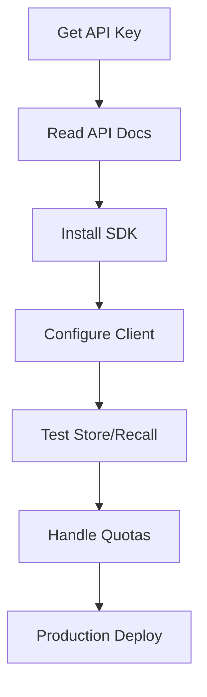

# User Journey: Developer API Integration

**Version:** 1.0.0  
**Date:** 2025-12-24  
**Actor:** Developer integrating with SomaBrain API

---

## Journey Overview

Steps for a developer to integrate their application with SomaBrain memory APIs.

---

## Flow Diagram



---

## Step 1: Obtain API Key

**Screen:** `/app/settings/api-keys`

```
┌────────────────────────────────────────────────────────────────────┐
│ 🔑 API Keys                                    [+ Create API Key] │
├────────────────────────────────────────────────────────────────────┤
│                                                                    │
│ Your API keys grant access to SomaBrain memory services.          │
│ Keep them secure - never expose in client-side code.              │
│                                                                    │
│ ┌────────────────────────────────────────────────────────────────┐│
│ │ KEY NAME      │ PREFIX       │ CREATED    │ LAST USED │ ACT   ││
│ ├───────────────┼──────────────┼────────────┼───────────┼───────┤│
│ │ Production    │ YOUR_API_KEY_HERE │ Dec 20     │ 2 min ago │ [🗑]  ││
│ │ Development   │ YOUR_TEST_KEY_HERE │ Dec 15     │ 1 hr ago  │ [🗑]  ││
│ │ CI/CD         │ YOUR_TEST_KEY_HERE │ Dec 10     │ 3 days    │ [🗑]  ││
│ └────────────────────────────────────────────────────────────────┘│
│                                                                    │
└────────────────────────────────────────────────────────────────────┘
```

### Create New Key Modal

```
┌────────────────────────────────────────────────────────────────────┐
│ Create API Key                                                     │
├────────────────────────────────────────────────────────────────────┤
│                                                                    │
│ Key Name                                                           │
│ [My Backend Service_______________________________]                │
│                                                                    │
│ Environment                                                        │
│ ○ Test (YOUR_TEST_KEY_HERE                                               │
│ ● Production (YOUR_API_KEY_HERE                                         │
│                                                                    │
│ Permissions                                                        │
│ [x] memory.store                                                   │
│ [x] memory.recall                                                  │
│ [ ] memory.delete                                                  │
│ [x] memory.search                                                  │
│ [ ] graph.create                                                   │
│ [x] graph.query                                                    │
│ [ ] stats.read                                                     │
│                                                                    │
│ Rate Limit Override (optional)                                     │
│ [_________] requests/minute (leave blank for tier default)         │
│                                                                    │
│                                    [Cancel]  [Create Key]         │
│                                                                    │
└────────────────────────────────────────────────────────────────────┘
```

### Key Created

```
┌────────────────────────────────────────────────────────────────────┐
│ ✓ API Key Created                                                  │
├────────────────────────────────────────────────────────────────────┤
│                                                                    │
│ ⚠️ Copy this key now - it won't be shown again!                   │
│                                                                    │
│ ┌────────────────────────────────────────────────────────────────┐│
│ │ YOUR_API_KEY_HERE             ││
│ │                                                    [Copy 📋]  ││
│ └────────────────────────────────────────────────────────────────┘│
│                                                                    │
│ Quick Start:                                                       │
│                                                                    │
│ curl -X POST https://api.somabrain.io/api/memory/remember \       │
│   -H "Authorization: Bearer YOUR_API_KEY_HERE" \                        │
│   -H "Content-Type: application/json" \                           │
│   -d '{"content": "Hello World"}'                                 │
│                                                                    │
│                                            [Done]                  │
│                                                                    │
└────────────────────────────────────────────────────────────────────┘
```

---

## Step 2: API Documentation

**Screen:** `/docs/api`

```
┌────────────────────────────────────────────────────────────────────┐
│ 📚 API Reference                               [OpenAPI ↗] [SDKs] │
├────────────────────────────────────────────────────────────────────┤
│                                                                    │
│ SIDEBAR              │ CONTENT                                     │
│ ───────────────────  │ ───────────────────────────────────────────│
│ Overview             │ # Authentication                            │
│ Authentication       │                                             │
│                      │ All API requests require authentication:   │
│ MEMORY               │                                             │
│ ├─ POST /remember    │ ```                                         │
│ ├─ POST /recall      │ Authorization: Bearer YOUR_API_KEY_HERE          │
│ ├─ DELETE /{coord}   │ X-Tenant-ID: your_tenant_id (optional)     │
│ └─ GET /stats        │ ```                                         │
│                      │                                             │
│ SEARCH               │ # Base URLs                                 │
│ ├─ POST /search      │                                             │
│ └─ GET /similar      │ Production: https://api.somabrain.io       │
│                      │ Sandbox:    https://sandbox.somabrain.io   │
│ GRAPH                │                                             │
│ ├─ POST /link        │ # Rate Limits                               │
│ ├─ GET /neighbors    │                                             │
│ └─ GET /path         │ | Tier      | Requests/min | Requests/day | │
│                      │ |-----------|--------------|--------------|  │
│ ADMIN                │ | Free      | 10           | 1,000        |  │
│ ├─ GET /usage        │ | Starter   | 100          | 10,000       |  │
│ └─ GET /quota        │ | Pro       | 1,000        | 100,000      |  │
│                      │                                             │
└────────────────────────────────────────────────────────────────────┘
```

---

## Step 3: SDK Installation

### Python

```python
# Install
pip install somabrain

# Configure
from somabrain import SomaBrainClient

client = SomaBrainClient(
    api_key="YOUR_API_KEY_HERE",
    environment="production"  # or "sandbox"
)

# Store memory
result = client.memory.store(
    content="User prefers dark mode",
    memory_type="semantic",
    importance=0.8,
    metadata={"user_id": "123"}
)
print(f"Stored: {result.id}")

# Recall memory
memories = client.memory.recall(
    query="user preferences",
    top_k=5
)
for mem in memories:
    print(f"- {mem.content} (relevance: {mem.score})")
```

### JavaScript/TypeScript

```typescript
// Install
npm install @somabrain/sdk

// Configure
import { SomaBrain } from '@somabrain/sdk';

const client = new SomaBrain({
  apiKey: 'YOUR_API_KEY_HERE',
  environment: 'production'
});

// Store memory
const result = await client.memory.store({
  content: 'User prefers dark mode',
  memoryType: 'semantic',
  importance: 0.8,
  metadata: { userId: '123' }
});

// Recall memory
const memories = await client.memory.recall({
  query: 'user preferences',
  topK: 5
});
```

---

## Step 4: Handle Quotas and Errors

### Response Headers

```http
HTTP/1.1 200 OK
X-RateLimit-Limit: 1000
X-RateLimit-Remaining: 847
X-RateLimit-Reset: 1703430000
X-Quota-Used: 45231
X-Quota-Limit: 100000
```

### Error Responses

```json
// 429 Too Many Requests
{
  "error": "rate_limit_exceeded",
  "message": "Rate limit of 1000 requests/minute exceeded",
  "retry_after": 45
}

// 403 Quota Exceeded
{
  "error": "quota_exceeded",
  "message": "Monthly quota of 100000 operations exceeded",
  "upgrade_url": "https://app.somabrain.io/settings/subscription"
}
```

### SDK Error Handling

```python
from somabrain.exceptions import RateLimitError, QuotaExceededError

try:
    result = client.memory.store(content="...")
except RateLimitError as e:
    time.sleep(e.retry_after)
    result = client.memory.store(content="...")
except QuotaExceededError as e:
    notify_admin("Quota exceeded - consider upgrade")
```

---

## Step 5: Usage Dashboard

**Screen:** `/app/usage`

```
┌────────────────────────────────────────────────────────────────────┐
│ 📊 API Usage Dashboard                         December 2024       │
├────────────────────────────────────────────────────────────────────┤
│                                                                    │
│ QUOTA USAGE                                                        │
│ ┌────────────────────────────────────────────────────────────────┐│
│ │ API Calls: 45,231 / 100,000                                    ││
│ │ [============================================              ] 45%││
│ │                                                                 ││
│ │ Memory Ops: 12,456 / 50,000                                    ││
│ │ [========================                                  ] 25%││
│ │                                                                 ││
│ │ Graph Ops: 2,341 / 10,000                                      ││
│ │ [=======================                                   ] 23%││
│ └────────────────────────────────────────────────────────────────┘│
│                                                                    │
│ USAGE BY KEY                                                       │
│ ┌────────────────────────────────────────────────────────────────┐│
│ │ Production     │ 38,421 calls │ 85% of total                   ││
│ │ Development    │  5,892 calls │ 13% of total                   ││
│ │ CI/CD          │    918 calls │  2% of total                   ││
│ └────────────────────────────────────────────────────────────────┘│
│                                                                    │
│ RECENT REQUESTS                                [Export CSV]        │
│ ┌────────────────────────────────────────────────────────────────┐│
│ │ TIME     │ KEY         │ ENDPOINT         │ STATUS │ LATENCY  ││
│ │ 14:45:32 │ Production  │ POST /recall     │ 200    │ 45ms     ││
│ │ 14:45:30 │ Production  │ POST /remember   │ 201    │ 67ms     ││
│ │ 14:45:28 │ Development │ POST /recall     │ 200    │ 52ms     ││
│ └────────────────────────────────────────────────────────────────┘│
│                                                                    │
└────────────────────────────────────────────────────────────────────┘
```

---

## Success Criteria

- [ ] API key created and stored securely
- [ ] First API call succeeds
- [ ] Error handling implemented
- [ ] Usage dashboard accessible

---

*Developer API Integration Journey - SomaBrain SaaS*
