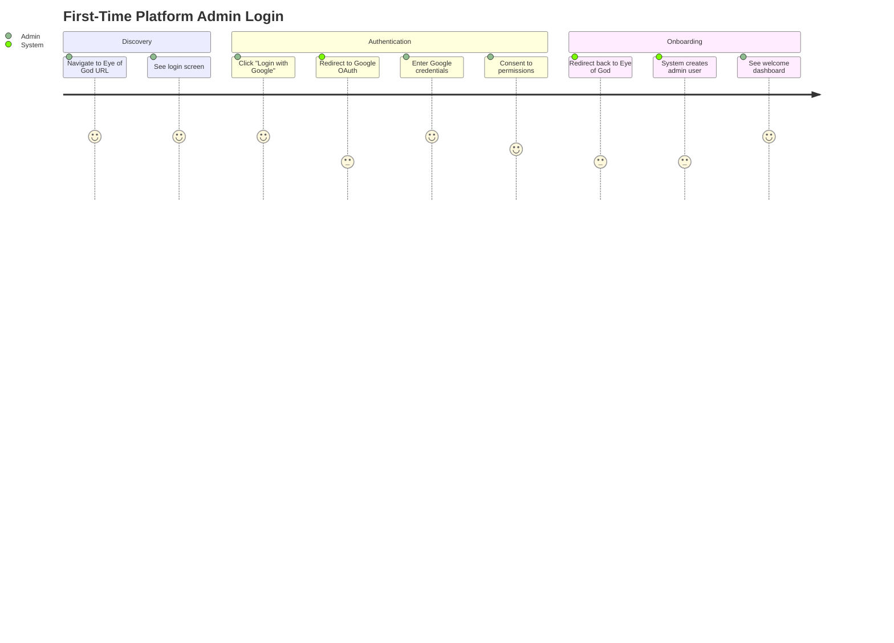
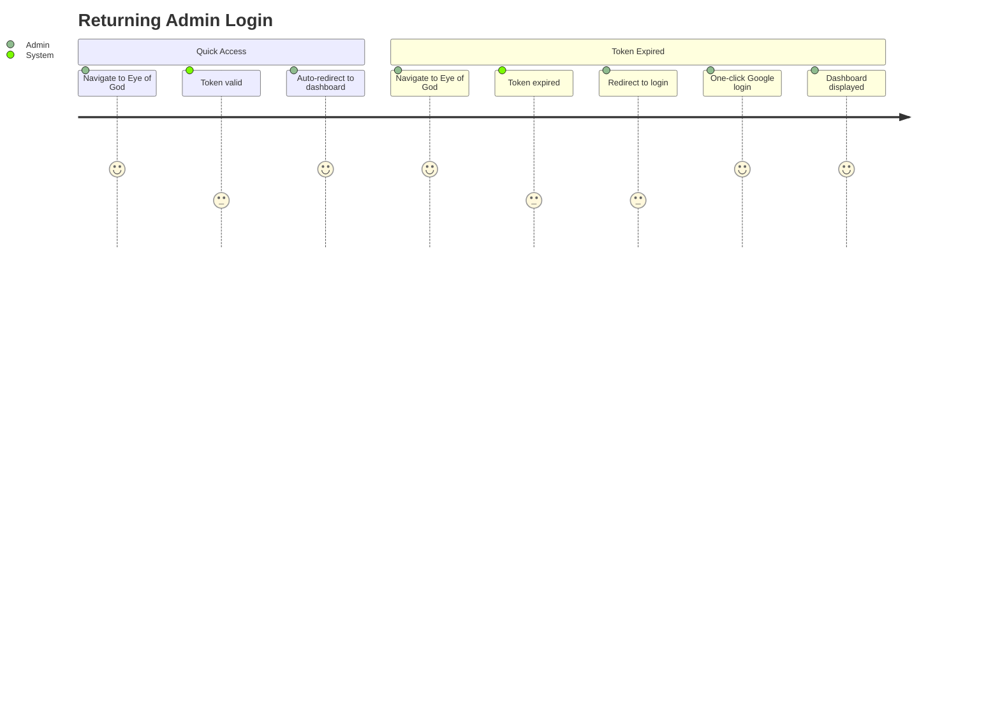
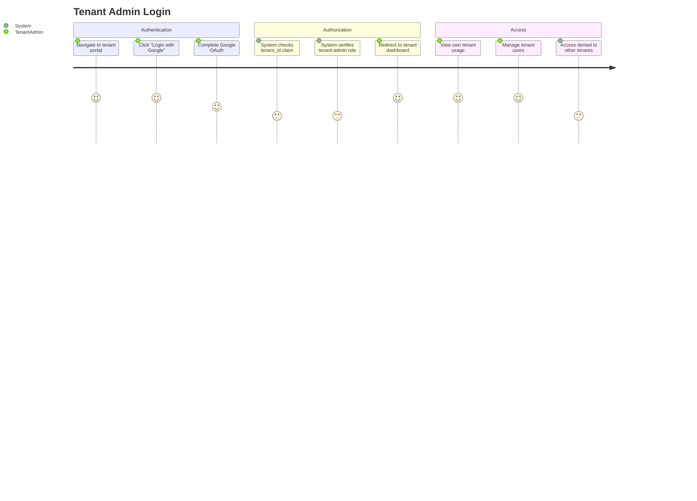
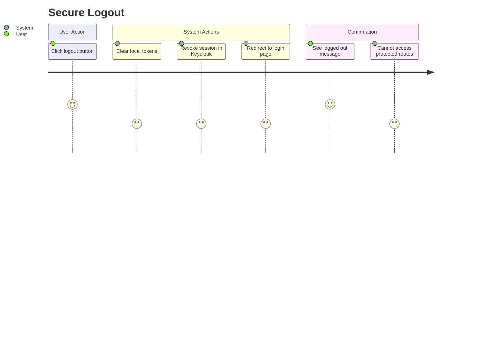
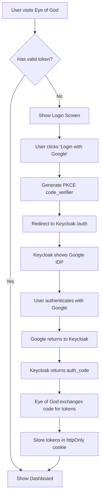
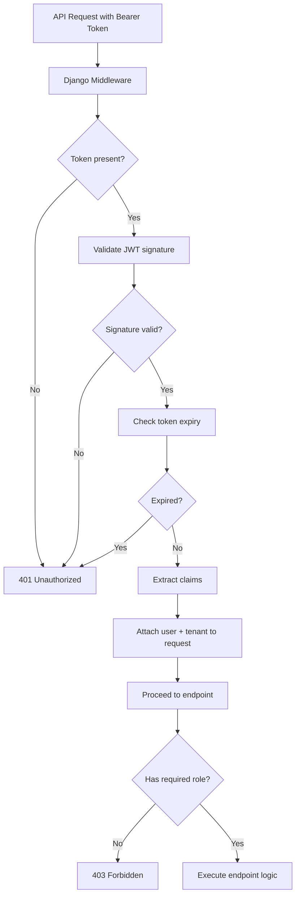
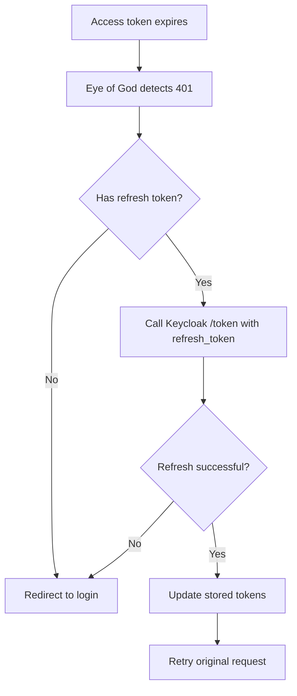
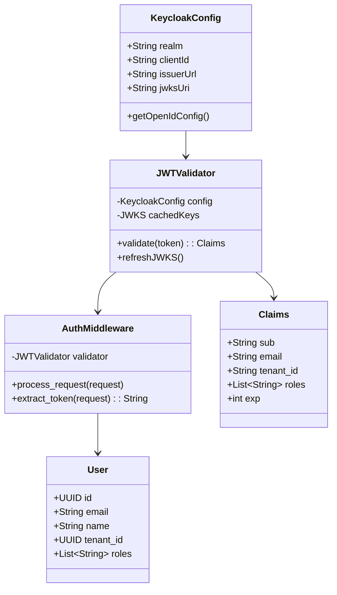
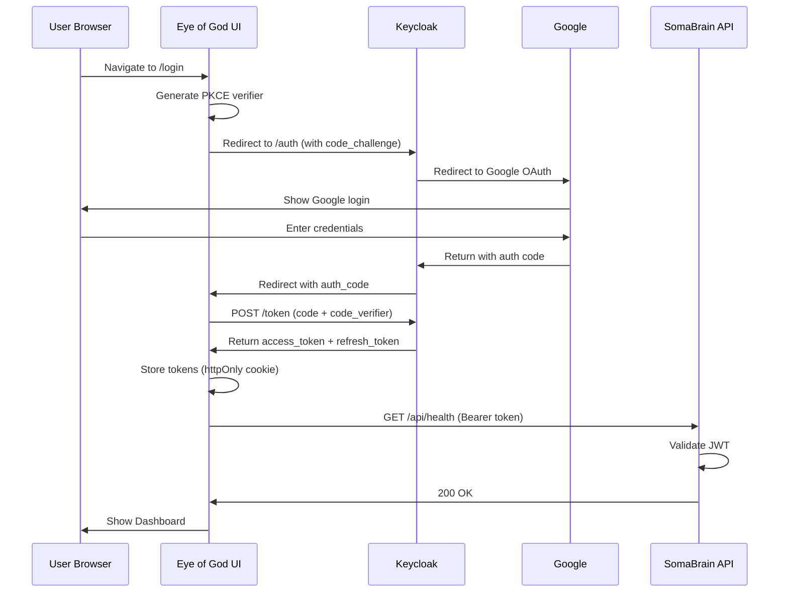

# Eye of God - Authentication User Journeys & Screen Designs

**Document Version:** 1.0.0  
**Date:** 2025-12-24  
**Status:** DESIGN PHASE  
**Standard:** ISO/IEC/IEEE 29148:2018 Compatible

---

## 1. User Journeys

### 1.1 UJ-AUTH-001: First-Time Platform Admin Login

| Priority | **P0 - CRITICAL** |
|----------|-------------------|
| Actor | Platform Super Admin |
| Goal | Access Eye of God dashboard for first time |

**Journey Steps:**



**Acceptance Criteria:**
- [ ] Login page loads in <2s
- [ ] Google OAuth redirect works
- [ ] User created in database on first login
- [ ] JWT token stored securely (httpOnly cookie)
- [ ] Dashboard displays tenant list

---

### 1.2 UJ-AUTH-002: Returning Admin Login

| Priority | **P0 - CRITICAL** |
|----------|-------------------|
| Actor | Existing Platform Admin |
| Goal | Quick re-authentication |

**Journey Steps:**



---

### 1.3 UJ-AUTH-003: Tenant Admin Login

| Priority | **P1 - HIGH** |
|----------|---------------|
| Actor | Tenant Administrator |
| Goal | Access tenant-specific admin panel |

**Journey Steps:**



---

### 1.4 UJ-AUTH-004: Logout Flow

| Priority | **P1 - HIGH** |
|----------|---------------|
| Actor | Any authenticated user |
| Goal | Securely end session |



---

## 2. Process Flow Charts

### 2.1 Authentication Flow (OAuth2/PKCE)



### 2.2 API Request Authorization Flow



### 2.3 Token Refresh Flow



---

## 3. UML Diagrams

### 3.1 Class Diagram - Authentication Components



### 3.2 Sequence Diagram - Login Flow



---

## 4. Screen Designs

### 4.1 SCR-AUTH-001: Login Screen

| Priority | **P0 - CRITICAL** |
|----------|-------------------|

**Layout:**
```
┌─────────────────────────────────────────────────────────────┐
│                                                             │
│                    ╔═══════════════════╗                    │
│                    ║   👁️ EYE OF GOD   ║                    │
│                    ║   AAAS Admin      ║                    │
│                    ╚═══════════════════╝                    │
│                                                             │
│              ┌─────────────────────────────┐                │
│              │                             │                │
│              │   Welcome to the Platform   │                │
│              │   Admin Control Center      │                │
│              │                             │                │
│              │  ┌─────────────────────┐    │                │
│              │  │  🔵 Login with      │    │                │
│              │  │     Google          │    │                │
│              │  └─────────────────────┘    │                │
│              │                             │                │
│              │  ────── or ──────           │                │
│              │                             │                │
│              │  ┌─────────────────────┐    │                │
│              │  │  🔑 Login with      │    │                │
│              │  │     Keycloak        │    │                │
│              │  └─────────────────────┘    │                │
│              │                             │                │
│              └─────────────────────────────┘                │
│                                                             │
│              © 2025 SomaBrain Platform                      │
│                                                             │
└─────────────────────────────────────────────────────────────┘
```

**Elements:**
| Element | Type | Action |
|---------|------|--------|
| Logo | Image | Brand identity |
| Login with Google | Button | Redirect to Keycloak→Google |
| Login with Keycloak | Button | Direct Keycloak login |
| Footer | Text | Copyright |

---

### 4.2 SCR-AUTH-002: Dashboard (Post-Login)

| Priority | **P0 - CRITICAL** |
|----------|-------------------|

**Layout:**
```
┌─────────────────────────────────────────────────────────────┐
│ ┌─────────┐                                    ┌─────────┐  │
│ │👁️ EoG   │  Dashboard                         │ 👤 Admin│  │
│ └─────────┘                                    └─────────┘  │
├──────────────┬──────────────────────────────────────────────┤
│              │                                              │
│  📊 Overview │  Welcome, {user.name}                        │
│              │                                              │
│  🏢 Tenants  │  ┌────────────┐ ┌────────────┐ ┌──────────┐  │
│              │  │ 45         │ │ 12         │ │ $12,450  │  │
│  👥 Users    │  │ Tenants    │ │ Active     │ │ MRR      │  │
│              │  └────────────┘ └────────────┘ └──────────┘  │
│  💰 Billing  │                                              │
│              │  Recent Activity                             │
│  📈 Usage    │  ┌─────────────────────────────────────────┐ │
│              │  │ • Tenant "Acme" upgraded to Pro         │ │
│  ⚙️ Settings │  │ • New user joined "TechCorp"            │ │
│              │  │ • Invoice #1234 paid                    │ │
│  🔐 Auth     │  └─────────────────────────────────────────┘ │
│              │                                              │
└──────────────┴──────────────────────────────────────────────┘
```

---

### 4.3 SCR-AUTH-003: User Profile/Logout

| Priority | **P1 - HIGH** |
|----------|---------------|

**Layout:**
```
┌─────────────────────────────────┐
│  👤 Admin User                  │
│  admin@example.com              │
├─────────────────────────────────┤
│  Role: super-admin              │
│  Tenant: Platform               │
├─────────────────────────────────┤
│  ⚙️ Account Settings            │
│  🔑 Security                    │
│  🚪 Logout                      │
└─────────────────────────────────┘
```

---

## 5. Priority Matrix

| Task | Priority | Effort | Dependencies |
|------|----------|--------|--------------|
| Create Keycloak realm | P0 | Low | None |
| Google IDP setup | P0 | Medium | Realm |
| Eye of God client | P0 | Low | Realm |
| Login screen UI | P0 | Medium | Client |
| JWT middleware | P0 | Medium | Realm |
| Dashboard UI | P0 | High | Login |
| Token refresh | P1 | Medium | Login |
| Logout flow | P1 | Low | Login |
| Role-based access | P1 | Medium | JWT middleware |
| User profile screen | P2 | Low | Dashboard |

---

## 6. Implementation Order

1. **Sprint 1: Foundation** (P0)
   - Create `somabrain` realm
   - Configure Google IDP
   - Create clients

2. **Sprint 2: Backend** (P0)
   - Implement JWT validation middleware
   - Create auth endpoints

3. **Sprint 3: Frontend** (P0)
   - Login screen
   - PKCE auth flow
   - Dashboard skeleton

4. **Sprint 4: Polish** (P1-P2)
   - Token refresh
   - Logout flow
   - User profile
   - Role-based UI

---

*VIBE Coding Rules: ALL 10 PERSONAS applied*
