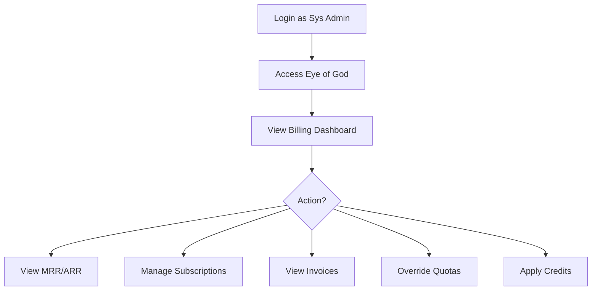

# Eye of God: Billing & Subscription Management Journey

**Version:** 1.0.0  
**Date:** 2025-12-24  
**Actor:** AAAS Sys Admin (Platform Admin / Super Admin)  
**Purpose:** Manage billing, subscriptions, and revenue from Eye of God

---

## 1. Journey Overview



---

## 2. Integration: Lago Billing

Eye of God integrates with Lago (open-source billing) at `http://lago:3000`.

```
┌─────────────────────────────────────────────────────────────────────────────┐
│                     Billing Architecture                                     │
├─────────────────────────────────────────────────────────────────────────────┤
│                                                                             │
│   SomaBrain API                        Lago API                             │
│   (:9696)                              (:3000)                              │
│   ┌─────────────┐                     ┌─────────────┐                       │
│   │ Tenant      │────sync customer───►│ Customer    │                       │
│   │ Model       │                     │ Model       │                       │
│   └─────────────┘                     └─────────────┘                       │
│                                                                             │
│   ┌─────────────┐                     ┌─────────────┐                       │
│   │ Subscription│────sync plan───────►│ Plan        │                       │
│   │ Tier        │                     │ Model       │                       │
│   └─────────────┘                     └─────────────┘                       │
│                                                                             │
│   ┌─────────────┐                     ┌─────────────┐                       │
│   │ API Usage   │────ingest events───►│ Events      │                       │
│   │ Metrics     │                     │ Engine      │                       │
│   └─────────────┘                     └─────────────┘                       │
│                                                                             │
│                                       ┌─────────────┐                       │
│   ┌─────────────┐◄───webhook─────────│ Invoice     │                       │
│   │ Payment     │                     │ Generated   │                       │
│   │ Handler     │                     │             │                       │
│   └─────────────┘                     └─────────────┘                       │
└─────────────────────────────────────────────────────────────────────────────┘
```

---

## 3. Screen 1: Billing Dashboard

**Route:** `/platform/billing`

```
┌─────────────────────────────────────────────────────────────────────────────┐
│ 💳 Billing & Revenue                          [Lago Dashboard ↗] [Export] │
├─────────────────────────────────────────────────────────────────────────────┤
│                                                                             │
│ TABS: [Overview] [Subscriptions] [Invoices] [Plans] [Usage]                │
│                                                                             │
│ ─────────────────────────────────────────────────────────────────────────── │
│                                                                             │
│ REVENUE METRICS                                          Period: [Dec 24▼] │
│                                                                             │
│ ┌────────────────┐ ┌────────────────┐ ┌────────────────┐ ┌────────────────┐│
│ │      MRR       │ │      ARR       │ │  NEW REVENUE   │ │    CHURN       ││
│ │   $24,500      │ │   $294,000     │ │    $2,450      │ │    $450        ││
│ │    +5.2% ↑     │ │    +5.2% ↑     │ │   +3 tenants   │ │   -1 tenant    ││
│ └────────────────┘ └────────────────┘ └────────────────┘ └────────────────┘│
│                                                                             │
│ ┌─────────────────────────────────────────────────────────────────────────┐│
│ │                     REVENUE TREND (Last 6 Months)                       ││
│ │  $30K│                                                     ╭───╮        ││
│ │      │                                            ╭───────╯   │        ││
│ │  $25K│                               ╭──────────╯             ╰────    ││
│ │      │                  ╭───────────╯                                   ││
│ │  $20K│     ╭───────────╯                                                ││
│ │      │─────╯                                                            ││
│ │  $15K│                                                                  ││
│ │      └──────────────────────────────────────────────────────────────    ││
│ │        Jul    Aug    Sep    Oct    Nov    Dec                           ││
│ └─────────────────────────────────────────────────────────────────────────┘│
│                                                                             │
│ REVENUE BY TIER                            TOP PAYING TENANTS              │
│ ┌──────────────────────────┐              ┌──────────────────────────────┐│
│ │ 🏢 Enterprise  $8,000 33%│              │ 1. Acme Corp       $999/mo   ││
│ │ ⭐ Pro         $12,500 51%│              │ 2. Epsilon AI      $999/mo   ││
│ │ 🚀 Starter     $3,500 14%│              │ 3. MegaTech Inc    $499/mo   ││
│ │ 🆓 Free            $0  0%│              │ 4. Beta Inc        $199/mo   ││
│ │ Trial (4)          $0  -│              │ 5. Omega Tech      $199/mo   ││
│ └──────────────────────────┘              └──────────────────────────────┘│
└─────────────────────────────────────────────────────────────────────────────┘
```

---

## 4. Screen 2: Subscription Management

**Route:** `/platform/billing/subscriptions`

```
┌─────────────────────────────────────────────────────────────────────────────┐
│ 📋 Subscriptions                                            [+ Create] [↻]│
├─────────────────────────────────────────────────────────────────────────────┤
│                                                                             │
│ Filter: Status [All ▼]  Tier [All ▼]  Search [_______________________]     │
│                                                                             │
│ ┌─────────────────────────────────────────────────────────────────────────┐│
│ │ TENANT         │ TIER        │ STATUS   │ MRR     │ NEXT     │ ACTIONS ││
│ ├────────────────┼─────────────┼──────────┼─────────┼──────────┼─────────┤│
│ │ Acme Corp      │ 🏢 Enterprise│ ✅ Active│   $999  │ Jan 15   │ [⚙][💳]││
│ │ Epsilon AI     │ 🏢 Enterprise│ ✅ Active│   $999  │ Jan 20   │ [⚙][💳]││
│ │ MegaTech Inc   │ ⭐ Pro       │ ✅ Active│   $499  │ Jan 10   │ [⚙][💳]││
│ │ Beta Inc       │ ⭐ Pro       │ ✅ Active│   $199  │ Jan 05   │ [⚙][💳]││
│ │ Omega Tech     │ ⭐ Pro       │ ⏳ Trial │     $0  │ Jan 07   │ [⚙][💳]││
│ │ Gamma LLC      │ 🆓 Free      │ ⏳ Trial │     $0  │ Dec 30   │ [⚙][💳]││
│ │ Delta Co       │ ⭐ Pro       │ 🔴 Past Due│   $199 │ OVERDUE │ [⚙][💳]││
│ └─────────────────────────────────────────────────────────────────────────┘│
│                                                                             │
│ SUMMARY: Active: 120 │ Trial: 4 │ Past Due: 2 │ Cancelled: 1              │
│                                                                             │
└─────────────────────────────────────────────────────────────────────────────┘
```

### Manage Subscription Modal

```
┌─────────────────────────────────────────────────────────────────────────────┐
│ ⚙️ Manage Subscription: Omega Tech                               [X Close]│
├─────────────────────────────────────────────────────────────────────────────┤
│                                                                             │
│ CURRENT PLAN                                                                │
│ ┌─────────────────────────────────────────────────────────────────────────┐│
│ │ Tier: ⭐ Pro ($199/mo)                                                  ││
│ │ Status: ⏳ Trial (12 days remaining)                                    ││
│ │ Trial Ends: Jan 7, 2025                                                 ││
│ │ Created: Dec 24, 2024                                                   ││
│ └─────────────────────────────────────────────────────────────────────────┘│
│                                                                             │
│ QUICK ACTIONS                                                               │
│ ┌─────────────────────────────────────────────────────────────────────────┐│
│ │ [Upgrade to Enterprise]  [Downgrade to Starter]  [Convert to Free]     ││
│ │                                                                         ││
│ │ [Extend Trial +7 days]   [Cancel Subscription]                          ││
│ └─────────────────────────────────────────────────────────────────────────┘│
│                                                                             │
│ QUOTA OVERRIDES                                                             │
│ ┌─────────────────────────────────────────────────────────────────────────┐│
│ │ API Calls/month:    [100000__] (tier default: 100,000)                 ││
│ │ Memory Ops/month:   [50000___] (tier default: 50,000)                  ││
│ │ Rate Limit (rps):   [100_____] (tier default: 100)                     ││
│ │                                                                         ││
│ │ [Reset to Tier Defaults]                         [Apply Overrides]     ││
│ └─────────────────────────────────────────────────────────────────────────┘│
│                                                                             │
│ APPLY CREDIT                                                                │
│ ┌─────────────────────────────────────────────────────────────────────────┐│
│ │ Amount: $[________]  Reason: [______________________________]          ││
│ │                                                         [Apply Credit] ││
│ └─────────────────────────────────────────────────────────────────────────┘│
│                                                                             │
│                                                        [Save Changes]      │
└─────────────────────────────────────────────────────────────────────────────┘
```

---

## 5. Screen 3: Invoice List

**Route:** `/platform/billing/invoices`

```
┌─────────────────────────────────────────────────────────────────────────────┐
│ 📄 Invoices                                                       [Export]│
├─────────────────────────────────────────────────────────────────────────────┤
│                                                                             │
│ Filter: Status [All ▼]  Period [Dec 24 ▼]  Tenant [All ▼]                  │
│                                                                             │
│ ┌─────────────────────────────────────────────────────────────────────────┐│
│ │ INVOICE #      │ TENANT         │ AMOUNT  │ STATUS   │ DATE    │ ACT   ││
│ ├────────────────┼────────────────┼─────────┼──────────┼─────────┼───────┤│
│ │ INV-2024-1234  │ Acme Corp      │   $999  │ ✅ Paid  │ Dec 15  │ [👁📄]││
│ │ INV-2024-1233  │ Epsilon AI     │   $999  │ ✅ Paid  │ Dec 20  │ [👁📄]││
│ │ INV-2024-1232  │ MegaTech Inc   │   $499  │ ✅ Paid  │ Dec 10  │ [👁📄]││
│ │ INV-2024-1231  │ Beta Inc       │   $199  │ ✅ Paid  │ Dec 05  │ [👁📄]││
│ │ INV-2024-1230  │ Delta Co       │   $199  │ 🔴 Overdue│ Dec 01 │ [👁📄]││
│ │ INV-2024-1229  │ Gamma LLC      │    $49  │ ⏳ Pending│ Dec 24 │ [👁📄]││
│ └─────────────────────────────────────────────────────────────────────────┘│
│                                                                             │
│ TOTALS: Paid: $24,045 │ Pending: $455 │ Overdue: $199                      │
│                                                                             │
└─────────────────────────────────────────────────────────────────────────────┘
```

---

## 6. Screen 4: Subscription Plans

**Route:** `/platform/billing/plans`

```
┌─────────────────────────────────────────────────────────────────────────────┐
│ 📦 Subscription Plans                                      [+ Create Plan] │
├─────────────────────────────────────────────────────────────────────────────┤
│                                                                             │
│ Manage the subscription tiers available to tenants.                         │
│                                                                             │
│ ┌───────────────┐ ┌───────────────┐ ┌───────────────┐ ┌───────────────┐   │
│ │   🆓 FREE     │ │  🚀 STARTER   │ │   ⭐ PRO      │ │ 🏢 ENTERPRISE │   │
│ ├───────────────┤ ├───────────────┤ ├───────────────┤ ├───────────────┤   │
│ │    $0/mo      │ │   $49/mo      │ │  $199/mo      │ │   $999/mo     │   │
│ │               │ │               │ │               │ │               │   │
│ │ API Calls:    │ │ API Calls:    │ │ API Calls:    │ │ API Calls:    │   │
│ │   1,000/mo    │ │  10,000/mo    │ │ 100,000/mo    │ │  Unlimited    │   │
│ │               │ │               │ │               │ │               │   │
│ │ Memory Ops:   │ │ Memory Ops:   │ │ Memory Ops:   │ │ Memory Ops:   │   │
│ │   500/mo      │ │   5,000/mo    │ │  50,000/mo    │ │  Unlimited    │   │
│ │               │ │               │ │               │ │               │   │
│ │ Rate Limit:   │ │ Rate Limit:   │ │ Rate Limit:   │ │ Rate Limit:   │   │
│ │  10 req/s     │ │  50 req/s     │ │  100 req/s    │ │  500 req/s    │   │
│ │               │ │               │ │               │ │               │   │
│ │ Support:      │ │ Support:      │ │ Support:      │ │ Support:      │   │
│ │ Community     │ │ Email         │ │ Priority      │ │ Dedicated     │   │
│ │               │ │               │ │               │ │               │   │
│ │ Tenants: 15   │ │ Tenants: 45   │ │ Tenants: 62   │ │ Tenants: 5    │   │
│ │               │ │               │ │               │ │               │   │
│ │    [Edit]     │ │    [Edit]     │ │    [Edit]     │ │    [Edit]     │   │
│ └───────────────┘ └───────────────┘ └───────────────┘ └───────────────┘   │
│                                                                             │
└─────────────────────────────────────────────────────────────────────────────┘
```

---

## 7. Lago API Integration

| SomaBrain Action | Lago API Call |
|------------------|---------------|
| Create tenant | `POST /api/v1/customers` |
| Change subscription | `POST /api/v1/subscriptions` |
| Apply credit | `POST /api/v1/wallet_transactions` |
| Get invoices | `GET /api/v1/invoices` |
| Usage events | `POST /api/v1/events` |

---

## 8. Permission Requirements

| Action | Required Role |
|--------|---------------|
| View billing dashboard | Platform Admin+ |
| View all invoices | Platform Admin+ |
| Upgrade/downgrade subscription | Platform Admin+ |
| Apply credits | Super Admin |
| Modify plans | Super Admin |
| Override quotas | Platform Admin+ |

---

*Eye of God: Billing Management Journey - SomaBrain AAAS*
