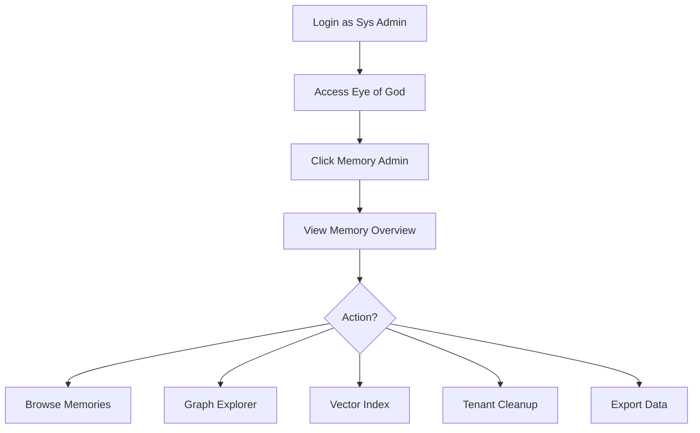

# Eye of God: Memory Administration Journey

**Version:** 1.0.0  
**Date:** 2025-12-24  
**Actor:** AAAS Sys Admin (Platform Admin / Super Admin)  
**Purpose:** Administer memories across all tenants from Eye of God

---

## 1. Journey Overview



---

## 2. Screen 1: Memory Overview (All Tenants)

**Route:** `/platform/memory`

```
┌─────────────────────────────────────────────────────────────────────────────┐
│ 🧠 Memory Administration                                         [Export] │
├─────────────────────────────────────────────────────────────────────────────┤
│                                                                             │
│ TABS: [Overview] [Browse] [Graph] [Vectors] [Cleanup]                      │
│                                                                             │
│ ─────────────────────────────────────────────────────────────────────────── │
│                                                                             │
│ PLATFORM-WIDE STATISTICS                                                    │
│                                                                             │
│ ┌────────────────┐ ┌────────────────┐ ┌────────────────┐ ┌────────────────┐│
│ │  TOTAL MEMORIES │ │  GRAPH LINKS  │ │  NAMESPACES   │ │ VECTOR INDEX   ││
│ │    125,456     │ │    34,521     │ │      127      │ │    2.3 GB      ││
│ │  +1,234 today  │ │  +456 today   │ │  +3 today     │ │  +0.1 GB       ││
│ └────────────────┘ └────────────────┘ └────────────────┘ └────────────────┘│
│                                                                             │
│ MEMORY BY TYPE                          MEMORY BY TIER                      │
│ ┌───────────────────────────┐          ┌───────────────────────────────┐   │
│ │ ┌──────────────────────┐  │          │ ShortTerm (SomaBrain):        │   │
│ │ │ Episodic      65%   │  │          │   1,234 items cached          │   │
│ │ │ ════════════════     │  │          │   Cache hit rate: 78%         │   │
│ │ │ Semantic      35%   │  │          │                               │   │
│ │ │ ═══════════         │  │          │ LongTerm (SomaFractalMemory): │   │
│ │ └──────────────────────┘  │          │   125,456 memories            │   │
│ └───────────────────────────┘          │   34,521 graph links         │   │
│                                         └───────────────────────────────┘   │
│                                                                             │
│ MEMORY BY TENANT                                             [View All →]  │
│ ┌─────────────────────────────────────────────────────────────────────────┐│
│ │ TENANT           │ MEMORIES │ GRAPH  │ STORAGE │ QUOTA │ STATUS        ││
│ ├──────────────────┼──────────┼────────┼─────────┼───────┼───────────────┤│
│ │ acme-corp        │   45,231 │ 12,456 │  1.2 GB │  45%  │ ✅ Normal     ││
│ │ omega-tech       │   12,456 │  3,456 │  0.3 GB │  25%  │ ✅ Normal     ││
│ │ beta-inc         │    8,921 │  2,341 │  0.2 GB │  18%  │ ✅ Normal     ││
│ │ default          │   58,848 │ 16,268 │  0.6 GB │  N/A  │ ✅ System     ││
│ └─────────────────────────────────────────────────────────────────────────┘│
└─────────────────────────────────────────────────────────────────────────────┘
```

---

## 3. Screen 2: Browse Memories (Cross-Tenant)

**Route:** `/platform/memory/browse`

```
┌─────────────────────────────────────────────────────────────────────────────┐
│ 📂 Browse Memories                                     [Export] [Bulk Act] │
├─────────────────────────────────────────────────────────────────────────────┤
│                                                                             │
│ Filter: Tenant [All ▼]  Type [All ▼]  Namespace [All ▼]  Search [_______] │
│                                                                             │
│ ┌─────────────────────────────────────────────────────────────────────────┐│
│ │ [ ] │ COORDINATE     │ TENANT     │ TYPE     │ IMP  │ CREATED  │ ACT   ││
│ ├─────┼────────────────┼────────────┼──────────┼──────┼──────────┼───────┤│
│ │ [ ] │ [1.2, 0.5, 0.8]│ acme-corp  │ semantic │ 0.85 │ Dec 20   │ [👁🗑]││
│ │ [ ] │ [0.3, 0.9, 0.2]│ omega-tech │ episodic │ 0.72 │ Dec 19   │ [👁🗑]││
│ │ [ ] │ [0.7, 0.1, 0.6]│ beta-inc   │ episodic │ 0.68 │ Dec 18   │ [👁🗑]││
│ │ [ ] │ [0.4, 0.8, 0.3]│ acme-corp  │ semantic │ 0.91 │ Dec 17   │ [👁🗑]││
│ │ [ ] │ [0.9, 0.2, 0.7]│ default    │ episodic │ 0.55 │ Dec 16   │ [👁🗑]││
│ └─────────────────────────────────────────────────────────────────────────┘│
│                                                                             │
│ Selected: 0 items                        Showing 1-50 of 125,456           │
│ [Delete Selected] [Export Selected]      [< Prev] [Next >]                 │
│                                                                             │
└─────────────────────────────────────────────────────────────────────────────┘
```

### View Memory Detail Modal

```
┌─────────────────────────────────────────────────────────────────────────────┐
│ 👁️ Memory Details                                                 [X Close]│
├─────────────────────────────────────────────────────────────────────────────┤
│                                                                             │
│ COORDINATE: [1.2, 0.5, 0.8]                                                 │
│ KEY: 1.2,0.5,0.8                                                            │
│                                                                             │
│ ┌─────────────────────────────────────────────────────────────────────────┐│
│ │ BASIC INFO                                                              ││
│ ├─────────────────────────────────────────────────────────────────────────┤│
│ │ ID:          mem_a1b2c3d4-e5f6-7890-abcd-ef1234567890                   ││
│ │ Tenant:      acme-corp                                                  ││
│ │ Namespace:   api_ns                                                     ││
│ │ Type:        semantic                                                   ││
│ │ Importance:  0.85                                                       ││
│ │ Access Count: 47                                                        ││
│ │ Last Accessed: Dec 24, 2024 14:30:00                                    ││
│ │ Created:     Dec 20, 2024 09:15:00                                      ││
│ │ Updated:     Dec 24, 2024 14:30:00                                      ││
│ └─────────────────────────────────────────────────────────────────────────┘│
│                                                                             │
│ ┌─────────────────────────────────────────────────────────────────────────┐│
│ │ PAYLOAD                                                      [Copy JSON]││
│ ├─────────────────────────────────────────────────────────────────────────┤│
│ │ {                                                                        ││
│ │   "content": "User prefers dark mode in all applications and likes     ││
│ │              compact layouts with minimal whitespace.",                  ││
│ │   "user_id": "john_123",                                                ││
│ │   "source": "onboarding",                                               ││
│ │   "verified": true                                                       ││
│ │ }                                                                        ││
│ └─────────────────────────────────────────────────────────────────────────┘│
│                                                                             │
│ ┌─────────────────────────────────────────────────────────────────────────┐│
│ │ GRAPH LINKS (3 outgoing, 1 incoming)                                    ││
│ ├─────────────────────────────────────────────────────────────────────────┤│
│ │ → [2.1, 0.7, 0.3] │ related │ strength: 0.92                           ││
│ │ → [1.5, 0.4, 0.6] │ similar │ strength: 0.85                           ││
│ │ → [0.8, 0.9, 0.2] │ related │ strength: 0.78                           ││
│ │ ← [0.5, 0.2, 0.9] │ influences │ strength: 0.65                        ││
│ └─────────────────────────────────────────────────────────────────────────┘│
│                                                                             │
│                                              [Edit] [Delete] [Close]       │
│                                                                             │
└─────────────────────────────────────────────────────────────────────────────┘
```

---

## 4. Screen 3: Graph Explorer (Platform-Wide)

**Route:** `/platform/memory/graph`

```
┌─────────────────────────────────────────────────────────────────────────────┐
│ 🕸️ Graph Explorer                                   [Fullscreen] [Export] │
├─────────────────────────────────────────────────────────────────────────────┤
│                                                                             │
│ Tenant: [All ▼]  Start Coord: [____________]  Hops: [2▼]  [Explore]       │
│                                                                             │
│ ┌─────────────────────────────────────────────────────────────────────────┐│
│ │                                                                         ││
│ │                           ┌──────────┐                                  ││
│ │       acme-corp           │  MEMORY  │          omega-tech              ││
│ │       (tenant)            │    A     │          (tenant)                ││
│ │           │               └────┬─────┘              │                   ││
│ │           │                    │                    │                   ││
│ │       ┌───┴───┐           ┌────┴─────┐         ┌───┴───┐               ││
│ │       │   B   │──related──│    C     │──similar──│   D   │               ││
│ │       └───────┘           └────┬─────┘         └───────┘               ││
│ │                                │                                        ││
│ │                           ┌────┴─────┐                                  ││
│ │                           │    E     │                                  ││
│ │                           └──────────┘                                  ││
│ │                                                                         ││
│ │  Legend: ◯ = Memory   ── = Link   Colors = Tenants                     ││
│ │                                                                         ││
│ │  [Zoom+] [Zoom-] [Pan] [Reset] [Center on Selection]                   ││
│ └─────────────────────────────────────────────────────────────────────────┘│
│                                                                             │
│ SELECTED: Memory A (acme-corp)                                             │
│ Links: 3 outgoing │ 1 incoming │ Type: semantic │ Importance: 0.85        │
│                                                                             │
│ [View Details] [Find Path To...] [Delete] [Edit]                           │
│                                                                             │
└─────────────────────────────────────────────────────────────────────────────┘
```

---

## 5. Screen 4: Tenant Cleanup Operations

**Route:** `/platform/memory/cleanup`

```
┌─────────────────────────────────────────────────────────────────────────────┐
│ 🧹 Memory Cleanup Operations                                               │
├─────────────────────────────────────────────────────────────────────────────┤
│                                                                             │
│ ⚠️ WARNING: These operations permanently delete data.                      │
│                                                                             │
│ ─────────────────────────────────────────────────────────────────────────── │
│                                                                             │
│ TENANT PURGE                                                                │
│ ┌─────────────────────────────────────────────────────────────────────────┐│
│ │ Select Tenant:  [omega-tech ▼]                                          ││
│ │                                                                         ││
│ │ Current Data:                                                           ││
│ │   • Memories: 12,456                                                    ││
│ │   • Graph Links: 3,456                                                  ││
│ │   • Vector Embeddings: 12,456                                           ││
│ │   • Storage: 0.3 GB                                                     ││
│ │                                                                         ││
│ │ [ ] I understand this will permanently delete all tenant data          ││
│ │ [ ] Create backup before purge                                          ││
│ │                                                                         ││
│ │                                               [Cancel] [🗑️ Purge Tenant]││
│ └─────────────────────────────────────────────────────────────────────────┘│
│                                                                             │
│ STALE MEMORY CLEANUP                                                        │
│ ┌─────────────────────────────────────────────────────────────────────────┐│
│ │ Delete memories older than: [90 days ▼]                                 ││
│ │ With importance below: [0.2____]                                        ││
│ │ And access count below: [5______]                                       ││
│ │                                                                         ││
│ │ Preview: 4,567 memories matching criteria                   [Preview →]││
│ │                                                                         ││
│ │                                              [🗑️ Delete Stale Memories] ││
│ └─────────────────────────────────────────────────────────────────────────┘│
│                                                                             │
│ ORPHANED LINKS CLEANUP                                                      │
│ ┌─────────────────────────────────────────────────────────────────────────┐│
│ │ Found: 234 orphaned graph links (pointing to deleted memories)          ││
│ │                                              [🗑️ Delete Orphaned Links] ││
│ └─────────────────────────────────────────────────────────────────────────┘│
│                                                                             │
└─────────────────────────────────────────────────────────────────────────────┘
```

---

## 6. API Endpoints Used

| Endpoint | Service | Purpose |
|----------|---------|---------|
| `GET /stats` | SFM :9595 | Memory statistics |
| `GET /memories/{coord}` | SFM :9595 | Retrieve memory |
| `DELETE /memories/{coord}` | SFM :9595 | Delete memory |
| `GET /graph/neighbors` | SFM :9595 | Graph exploration |
| `GET /graph/path` | SFM :9595 | Path finding |
| `GET /health` | SFM :9595 | Per-tenant stats |
| `GET /api/admin/memory/stats` | SB :9696 | Cross-tenant stats |
| `DELETE /api/admin/tenants/{id}/data` | SB :9696 | Purge tenant |

---

## 7. Permission Requirements

| Action | Required Permission |
|--------|---------------------|
| View memory overview | `platform.memory.view` |
| Browse any tenant's memories | `platform.memory.browse` |
| View memory details | `platform.memory.view` |
| Delete memory | `platform.memory.delete` |
| Purge tenant data | `platform.tenants.purge` (Super Admin only) |
| Cleanup stale memories | `platform.memory.cleanup` |
| Graph exploration | `platform.memory.graph` |

---

*Eye of God: Memory Administration Journey - SomaBrain AAAS*
