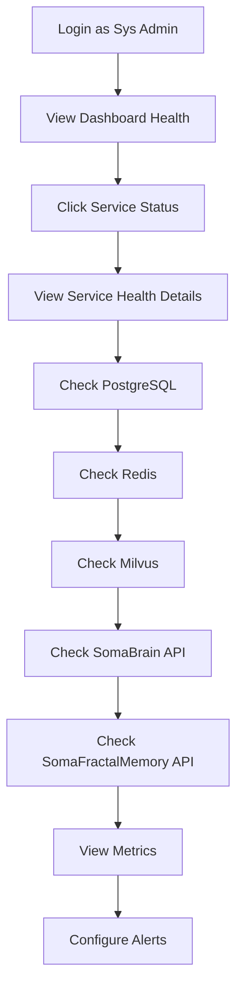

# Eye of God: System Monitoring & Health Journey

**Version:** 1.0.0  
**Date:** 2025-12-24  
**Actor:** SaaS Sys Admin (Platform Admin / Super Admin)  
**Purpose:** Monitor unified SomaBrain + SomaFractalMemory platform health

---

## 1. Journey Overview



---

## 2. Unified Service Architecture

Based on SomaFractalMemory docs:

```
┌─────────────────────────────────────────────────────────────────────────────┐
│                     SomaBrain SaaS Platform                                  │
├─────────────────────────────────────────────────────────────────────────────┤
│                                                                             │
│  ┌─────────────────────────────────────────────────────────────────────┐   │
│  │                 Eye of God (Admin UI)                               │   │
│  │                     Port: 5173                                       │   │
│  └───────────────────────────┬─────────────────────────────────────────┘   │
│                              │                                              │
│  ┌───────────────────────────┼───────────────────────────────────────────┐ │
│  │                           ▼                                           │ │
│  │  ┌─────────────────────────────────────────────────────────────────┐ │ │
│  │  │                  SomaBrain API                                   │ │ │
│  │  │              Port: 9696 (Django Ninja)                          │ │ │
│  │  │                                                                   │ │ │
│  │  │  • ShortTerm Cache (WorkingMemory)                              │ │ │
│  │  │  • API Gateway / Rate Limiting                                   │ │ │
│  │  │  • Multi-tenancy / Billing                                      │ │ │
│  │  │  • Admin API Endpoints                                           │ │ │
│  │  └───────────────────────────┬─────────────────────────────────────┘ │ │
│  │                              │                                        │ │
│  │  ┌───────────────────────────▼─────────────────────────────────────┐ │ │
│  │  │              SomaFractalMemory API                              │ │ │
│  │  │              Port: 9595 (Django Ninja)                          │ │ │
│  │  │                                                                   │ │ │
│  │  │  API Routers:                                                    │ │ │
│  │  │  • /healthz, /health, /readyz, /ping - Health checks            │ │ │
│  │  │  • /memories - CRUD operations                                   │ │ │
│  │  │  • /memories/search - Vector similarity                          │ │ │
│  │  │  • /graph/link, /graph/neighbors, /graph/path - Graph ops       │ │ │
│  │  │  • /stats, /metrics - Statistics                                │ │ │
│  │  └───────────────────────────┬─────────────────────────────────────┘ │ │
│  │                              │                                        │ │
│  └──────────────────────────────┼────────────────────────────────────────┘ │
│                                 │                                          │
│            ┌────────────────────┼────────────────────┐                     │
│            ▼                    ▼                    ▼                     │
│   ┌──────────────┐     ┌──────────────┐     ┌──────────────┐              │
│   │  PostgreSQL  │     │    Redis     │     │    Milvus    │              │
│   │  Port: 5432  │     │  Port: 6379  │     │ Port: 19530  │              │
│   │              │     │              │     │              │              │
│   │ Tables:      │     │ Usage:       │     │ Usage:       │              │
│   │ sfm_memories │     │ Query cache  │     │ Vector       │              │
│   │ sfm_graph_   │     │ Rate limits  │     │ similarity   │              │
│   │   links      │     │ Sessions     │     │ search       │              │
│   │ sfm_audit_   │     │              │     │              │              │
│   │   log        │     │              │     │              │              │
│   └──────────────┘     └──────────────┘     └──────────────┘              │
│                                                                             │
│   ┌──────────────┐     ┌──────────────┐     ┌──────────────┐              │
│   │   Keycloak   │     │     Lago     │     │    Kafka     │              │
│   │  Port: 8080  │     │  Port: 3000  │     │  Port: 9092  │              │
│   │  SSO/Auth    │     │   Billing    │     │   Streaming  │              │
│   └──────────────┘     └──────────────┘     └──────────────┘              │
└─────────────────────────────────────────────────────────────────────────────┘
```

---

## 3. Screen 1: System Health Overview

**Route:** `/platform/services`

```
┌─────────────────────────────────────────────────────────────────────────────┐
│ ⚡ System Health                                      [Refresh 🔄] [Export]│
├─────────────────────────────────────────────────────────────────────────────┤
│                                                                             │
│ OVERALL STATUS: ✅ ALL SYSTEMS OPERATIONAL             Last check: 30s ago │
│                                                                             │
│ ┌─────────────────────────────────────────────────────────────────────────┐│
│ │ SERVICE                 │ PORT   │ STATUS │ LATENCY │ UPTIME   │ DETAIL││
│ ├─────────────────────────┼────────┼────────┼─────────┼──────────┼───────┤│
│ │ SomaBrain API           │  9696  │ ✅ UP  │   12ms  │ 99.99%   │  [→]  ││
│ │ SomaFractalMemory API   │  9595  │ ✅ UP  │    8ms  │ 99.99%   │  [→]  ││
│ │ PostgreSQL              │  5432  │ ✅ UP  │    2ms  │ 99.99%   │  [→]  ││
│ │ Redis                   │  6379  │ ✅ UP  │    1ms  │ 99.99%   │  [→]  ││
│ │ Milvus Vector DB        │ 19530  │ ✅ UP  │  247ms  │ 99.95%   │  [→]  ││
│ │ Keycloak SSO            │  8080  │ ✅ UP  │   45ms  │ 99.98%   │  [→]  ││
│ │ Lago Billing            │  3000  │ ✅ UP  │   22ms  │ 99.99%   │  [→]  ││
│ │ Kafka                   │  9092  │ ✅ UP  │    5ms  │ 99.99%   │  [→]  ││
│ └─────────────────────────────────────────────────────────────────────────┘│
│                                                                             │
│ ┌──────────────────────────────────┬──────────────────────────────────────┐│
│ │ API METRICS (Last Hour)          │ DATABASE METRICS                     ││
│ ├──────────────────────────────────┼──────────────────────────────────────┤│
│ │ Total Requests: 45,231           │ Total Memories: 125,456              ││
│ │ Avg Latency: 45ms                │   Episodic: 81,547 (65%)            ││
│ │ Error Rate: 0.02%                │   Semantic: 43,909 (35%)            ││
│ │ Active Connections: 127          │ Graph Links: 34,521                 ││
│ │                                  │ Vector Index: 2.3 GB                ││
│ └──────────────────────────────────┴──────────────────────────────────────┘│
└─────────────────────────────────────────────────────────────────────────────┘
```

---

## 4. Screen 2: SomaFractalMemory Health Detail

**Route:** `/platform/services/fractalmemory`

```
┌─────────────────────────────────────────────────────────────────────────────┐
│ 🧠 SomaFractalMemory - Health Details                            [← Back] │
├─────────────────────────────────────────────────────────────────────────────┤
│                                                                             │
│ Endpoint: http://somafractalmemory:9595                   Status: ✅ UP    │
│                                                                             │
│ TABS: [Health] [Config] [Metrics] [Logs]                                    │
│                                                                             │
│ ─────────────────────────────────────────────────────────────────────────── │
│                                                                             │
│ HEALTH RESPONSE (/health endpoint)                                          │
│ ┌─────────────────────────────────────────────────────────────────────────┐│
│ │ {                                                                        ││
│ │   "status": "healthy",                                                   ││
│ │   "version": "0.2.0",                                                    ││
│ │   "uptime_seconds": 86400.537,                                          ││
│ │   "timestamp": "2025-12-24T15:45:00+00:00",                             ││
│ │   "services": [                                                          ││
│ │     {"name": "postgresql", "healthy": true, "latency_ms": 2.43},        ││
│ │     {"name": "redis", "healthy": true, "latency_ms": 1.53},             ││
│ │     {"name": "milvus", "healthy": true, "latency_ms": 246.92}           ││
│ │   ],                                                                     ││
│ │   "database": {                                                          ││
│ │     "total_memories": 125456,                                            ││
│ │     "episodic_memories": 81547,                                          ││
│ │     "semantic_memories": 43909,                                          ││
│ │     "total_graph_links": 34521,                                          ││
│ │     "total_namespaces": 127                                              ││
│ │   }                                                                      ││
│ │ }                                                                        ││
│ └─────────────────────────────────────────────────────────────────────────┘│
│                                                                             │
│ BACKEND HEALTH                                                              │
│ ┌─────────────────────────────────────────────────────────────────────────┐│
│ │ ● PostgreSQL      │ ✅ healthy │  2.43ms │ Database: somamemory        ││
│ │ ● Redis           │ ✅ healthy │  1.53ms │ Host: redis:6379            ││
│ │ ● Milvus          │ ✅ healthy │ 246.92ms │ Host: milvus:19530          ││
│ └─────────────────────────────────────────────────────────────────────────┘│
│                                                                             │
│ PER-TENANT STATISTICS                                                       │
│ ┌─────────────────────────────────────────────────────────────────────────┐│
│ │ TENANT           │ MEMORIES │ EPISODIC │ SEMANTIC │ GRAPH LINKS        ││
│ ├──────────────────┼──────────┼──────────┼──────────┼────────────────────┤│
│ │ omega-tech       │   12,456 │    8,102 │    4,354 │        3,456       ││
│ │ acme-corp        │   45,231 │   29,400 │   15,831 │       12,456       ││
│ │ beta-inc         │    8,921 │    5,799 │    3,122 │        2,341       ││
│ │ default          │   58,848 │   38,246 │   20,602 │       16,268       ││
│ └─────────────────────────────────────────────────────────────────────────┘│
└─────────────────────────────────────────────────────────────────────────────┘
```

---

## 5. Screen 3: Prometheus Metrics

**Route:** `/platform/metrics`

```
┌─────────────────────────────────────────────────────────────────────────────┐
│ 📈 Platform Metrics                          [Time: Last Hour ▼] [Export] │
├─────────────────────────────────────────────────────────────────────────────┤
│                                                                             │
│ TABS: [Overview] [API] [Memory] [Database] [Custom]                        │
│                                                                             │
│ ┌─────────────────────────────────────────────────────────────────────────┐│
│ │                        REQUEST RATE (per minute)                        ││
│ │  4K │                                           ╭────╮                  ││
│ │     │                               ╭──────────╯    │                  ││
│ │  3K │              ╭───────────────╯               ╰──────╮            ││
│ │     │   ╭─────────╯                                         │           ││
│ │  2K │───╯                                                    ╰────────  ││
│ │     │                                                                   ││
│ │  1K │                                                                   ││
│ │     └────────────────────────────────────────────────────────────────── ││
│ │       14:00   14:15   14:30   14:45   15:00   15:15   15:30   15:45    ││
│ └─────────────────────────────────────────────────────────────────────────┘│
│                                                                             │
│ ┌────────────────────────────┬────────────────────────────────────────────┐│
│ │ KEY METRICS                │ LATENCY DISTRIBUTION (p50/p95/p99)         ││
│ ├────────────────────────────┼────────────────────────────────────────────┤│
│ │ http_requests_total        │                                            ││
│ │   45,231                   │  Store:  [12ms / 45ms / 120ms]            ││
│ │                            │  Recall: [8ms / 25ms / 85ms]              ││
│ │ http_request_duration_avg  │  Search: [45ms / 150ms / 350ms]           ││
│ │   45ms                     │  Graph:  [15ms / 55ms / 180ms]            ││
│ │                            │                                            ││
│ │ error_rate                 │                                            ││
│ │   0.02%                    │                                            ││
│ │                            │                                            ││
│ │ active_connections         │                                            ││
│ │   127                      │                                            ││
│ └────────────────────────────┴────────────────────────────────────────────┘│
│                                                                             │
│ MEMORY SYSTEM METRICS                                                       │
│ ┌─────────────────────────────────────────────────────────────────────────┐│
│ │ memory_store_total:    12,456 today    │   cache_hit_ratio:    78%     ││
│ │ memory_recall_total:   89,234 today    │   wm_evictions:       234     ││
│ │ memory_delete_total:      456 today    │   ltm_promotions:     156     ││
│ │ graph_queries_total:   34,521 today    │   vector_searches:  12,456    ││
│ └─────────────────────────────────────────────────────────────────────────┘│
└─────────────────────────────────────────────────────────────────────────────┘
```

---

## 6. Screen 4: Alert Configuration

**Route:** `/platform/settings/alerts`

```
┌─────────────────────────────────────────────────────────────────────────────┐
│ 🔔 Alert Configuration                                     [+ Create Alert]│
├─────────────────────────────────────────────────────────────────────────────┤
│                                                                             │
│ ACTIVE ALERTS                                                               │
│ ┌─────────────────────────────────────────────────────────────────────────┐│
│ │ NAME                    │ CONDITION                │ STATUS   │ ACTIONS││
│ ├─────────────────────────┼──────────────────────────┼──────────┼────────┤│
│ │ High Error Rate         │ error_rate > 5%          │ ✅ OK    │ [⚙][🗑]││
│ │ Service Down            │ health_status = 0        │ ✅ OK    │ [⚙][🗑]││
│ │ High Latency            │ p99_latency > 500ms     │ ✅ OK    │ [⚙][🗑]││
│ │ Database Full           │ storage_used > 90%       │ ⚠️ WARN  │ [⚙][🗑]││
│ │ Quota Warning           │ quota_used > 80%         │ ✅ OK    │ [⚙][🗑]││
│ │ Milvus High Latency     │ milvus_latency > 500ms  │ ✅ OK    │ [⚙][🗑]││
│ └─────────────────────────────────────────────────────────────────────────┘│
│                                                                             │
│ NOTIFICATION CHANNELS                                                       │
│ ┌─────────────────────────────────────────────────────────────────────────┐│
│ │ ✅ Email:   admin@somabrain.io                                          ││
│ │ ✅ Slack:   #platform-alerts                                            ││
│ │ ❌ PagerDuty: Not configured                                    [Setup] ││
│ │ ❌ Webhook:   Not configured                                    [Setup] ││
│ └─────────────────────────────────────────────────────────────────────────┘│
│                                                                             │
│ ESCALATION POLICY                                                           │
│ ┌─────────────────────────────────────────────────────────────────────────┐│
│ │ Level 1 (0-5 min):    Email + Slack                                     ││
│ │ Level 2 (5-15 min):   PagerDuty (if configured)                        ││
│ │ Level 3 (15+ min):    Phone call to on-call admin                       ││
│ └─────────────────────────────────────────────────────────────────────────┘│
└─────────────────────────────────────────────────────────────────────────────┘
```

---

## 7. API Endpoints Used

The Eye of God monitoring screens consume these SomaFractalMemory endpoints:

| Endpoint | Purpose |
|----------|---------|
| `GET /health` | Detailed health with service latencies |
| `GET /healthz` | Kubernetes liveness probe |
| `GET /readyz` | Kubernetes readiness probe |
| `GET /stats` | Memory statistics per namespace |
| `GET /metrics` | Prometheus metrics |
| `GET /ping` | Simple health check |

---

## 8. Health Check Schedule

| Check Type | Interval | Timeout | Retry |
|------------|----------|---------|-------|
| Liveness (/healthz) | 30s | 5s | 3 |
| Readiness (/readyz) | 10s | 5s | 3 |
| Detailed (/health) | 60s | 30s | 1 |
| Metrics (/metrics) | 15s | 10s | 2 |

---

*Eye of God: System Monitoring Journey - SomaBrain SaaS*
