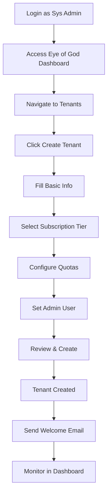

# Eye of God: Complete Tenant Creation Journey

**Version:** 1.0.0  
**Date:** 2025-12-24  
**Actor:** AAAS Sys Admin (Platform Admin / Super Admin)  
**Purpose:** Complete step-by-step tenant creation flow in Eye of God interface

---

## 1. Journey Overview



---

## 2. Screen 1: Eye of God Dashboard

**Route:** `/platform`  
**Role Required:** Platform Admin+

```
┌─────────────────────────────────────────────────────────────────────────────┐
│ 🔱 Eye of God - SomaBrain AAAS Administration                [Admin ▼] [?] │
├─────────────────────────────────────────────────────────────────────────────┤
│                                                                             │
│ ┌─────────────┐ ┌─────────────┐ ┌─────────────┐ ┌─────────────┐ ┌────────┐│
│ │    MRR      │ │   TENANTS   │ │   ACTIVE    │ │ API CALLS   │ │ HEALTH │ │
│ │  $24,500    │ │     127     │ │   USERS     │ │   TODAY     │ │   ✓    │ │
│ │   +5% ↑     │ │  +3 week    │ │   1,892     │ │   2.4M      │ │  100%  │ │
│ └─────────────┘ └─────────────┘ └─────────────┘ └─────────────┘ └────────┘ │
│                                                                             │
│ ┌───────────────────────────────────┬───────────────────────────────────┐  │
│ │ SERVICE STATUS                    │ RECENT ACTIVITY                   │  │
│ ├───────────────────────────────────┼───────────────────────────────────┤  │
│ │ ● SomaBrain         :9696   ✓ UP │ 14:45 Tenant created: Acme Corp   │  │
│ │ ● SomaFractalMemory :9595   ✓ UP │ 14:30 Subscription upgrade: Beta  │  │
│ │ ● PostgreSQL        :5432   ✓ UP │ 14:15 API key rotated: Gamma LLC  │  │
│ │ ● Redis             :6379   ✓ UP │ 14:00 Invoice paid: Delta Inc     │  │
│ │ ● Milvus            :19530  ✓ UP │                                   │  │
│ │ ● Keycloak          :8080   ✓ UP │ [View All Activity →]             │  │
│ │ ● Lago Billing      :3000   ✓ UP │                                   │  │
│ └───────────────────────────────────┴───────────────────────────────────┘  │
│                                                                             │
│ ┌─────────────────────────────────────────────────────────────────────────┐│
│ │ QUICK ACTIONS                                                           ││
│ │                                                                         ││
│ │  [+ Create New Tenant]  [View All Tenants]  [System Settings]          ││
│ │                                                                         ││
│ └─────────────────────────────────────────────────────────────────────────┘│
└─────────────────────────────────────────────────────────────────────────────┘
```

**Action:** Click `[+ Create New Tenant]`

---

## 3. Screen 2: Tenant List

**Route:** `/platform/tenants`

```
┌─────────────────────────────────────────────────────────────────────────────┐
│ 🏢 Tenants                                              [+ Create Tenant]  │
├─────────────────────────────────────────────────────────────────────────────┤
│                                                                             │
│ Search: [_______________________] 🔍  Status: [All ▼]  Tier: [All ▼]       │
│                                                                             │
│ ┌─────┬──────────────┬──────────┬──────────┬───────┬────────────┬────────┐│
│ │ ID  │ TENANT NAME  │ TIER     │ STATUS   │ USERS │ CREATED    │ ACTIONS││
│ ├─────┼──────────────┼──────────┼──────────┼───────┼────────────┼────────┤│
│ │ 001 │ Acme Corp    │ ⭐ Pro   │ ✅ Active│   12  │ Jan 15     │ [⚙][👤]││
│ │ 002 │ Beta Inc     │ 🚀 Start │ ✅ Active│    5  │ Feb 20     │ [⚙][👤]││
│ │ 003 │ Gamma LLC    │ 🆓 Free  │ ⚠️ Trial │    2  │ Dec 20     │ [⚙][👤]││
│ │ 004 │ Delta Co     │ ⭐ Pro   │ 🔴 Susp  │    8  │ Mar 10     │ [⚙][👤]││
│ │ 005 │ Epsilon AI   │ 🏢 Ent   │ ✅ Active│   45  │ Nov 05     │ [⚙][👤]││
│ └─────┴──────────────┴──────────┴──────────┴───────┴────────────┴────────┘│
│                                                                             │
│ Showing 1-5 of 127 tenants              [< Prev] [1] [2] [3] ... [Next >]  │
│                                                                             │
│ ┌─────────────────────────────────────────────────────────────────────────┐│
│ │ SUMMARY: Active: 120 │ Trial: 4 │ Suspended: 3 │ MRR: $24,500          ││
│ └─────────────────────────────────────────────────────────────────────────┘│
└─────────────────────────────────────────────────────────────────────────────┘
```

**Action:** Click `[+ Create Tenant]`

---

## 4. Screen 3: Create Tenant - Step 1: Basic Information

**Route:** `/platform/tenants/new`

```
┌─────────────────────────────────────────────────────────────────────────────┐
│ ➕ Create New Tenant                                             [X Close] │
├─────────────────────────────────────────────────────────────────────────────┤
│                                                                             │
│ PROGRESS: [●───────────────────────────────────────────────────────] 1/5   │
│           Basic Info → Subscription → Quotas → Admin User → Review         │
│                                                                             │
│ ═══════════════════════════════════════════════════════════════════════════│
│                                                                             │
│ STEP 1: BASIC INFORMATION                                                   │
│                                                                             │
│ ─────────────────────────────────────────────────────────────────────────── │
│                                                                             │
│ Tenant Name *                                                               │
│ ┌─────────────────────────────────────────────────────────────────────────┐│
│ │ Omega Technologies                                                      ││
│ └─────────────────────────────────────────────────────────────────────────┘│
│                                                                             │
│ Tenant ID (auto-generated)                                                  │
│ ┌─────────────────────────────────────────────────────────────────────────┐│
│ │ omega-technologies                                              [🔄]   ││
│ └─────────────────────────────────────────────────────────────────────────┘│
│                                                                             │
│ Industry                                                                    │
│ ┌─────────────────────────────────────────────────────────────────────────┐│
│ │ [Technology ▼]                                                          ││
│ └─────────────────────────────────────────────────────────────────────────┘│
│                                                                             │
│ Company Size                                                                │
│ ○ 1-10 employees   ○ 11-50   ● 51-200   ○ 201-1000   ○ 1000+              │
│                                                                             │
│ Website (optional)                                                          │
│ ┌─────────────────────────────────────────────────────────────────────────┐│
│ │ https://omega.tech                                                      ││
│ └─────────────────────────────────────────────────────────────────────────┘│
│                                                                             │
│ Notes (internal)                                                            │
│ ┌─────────────────────────────────────────────────────────────────────────┐│
│ │ Referred by existing customer Acme Corp. Priority onboarding.          ││
│ └─────────────────────────────────────────────────────────────────────────┘│
│                                                                             │
│                                                     [Cancel]  [Next →]     │
│                                                                             │
└─────────────────────────────────────────────────────────────────────────────┘
```

**Action:** Fill form, click `[Next →]`

---

## 5. Screen 4: Create Tenant - Step 2: Subscription

**Route:** `/platform/tenants/new?step=2`

```
┌─────────────────────────────────────────────────────────────────────────────┐
│ ➕ Create New Tenant                                             [X Close] │
├─────────────────────────────────────────────────────────────────────────────┤
│                                                                             │
│ PROGRESS: [●●●●●●●●●●●●●───────────────────────────────────────] 2/5       │
│           Basic Info → Subscription → Quotas → Admin User → Review         │
│                                                                             │
│ ═══════════════════════════════════════════════════════════════════════════│
│                                                                             │
│ STEP 2: SUBSCRIPTION TIER                                                   │
│                                                                             │
│ ─────────────────────────────────────────────────────────────────────────── │
│                                                                             │
│ Select a subscription tier for Omega Technologies:                          │
│                                                                             │
│ ┌───────────────┐ ┌───────────────┐ ┌───────────────┐ ┌───────────────┐   │
│ │   🆓 FREE     │ │  🚀 STARTER   │ │   ⭐ PRO      │ │ 🏢 ENTERPRISE │   │
│ │               │ │               │ │    ✓         │ │               │   │
│ │    $0/mo      │ │   $49/mo      │ │  $199/mo     │ │   Custom      │   │
│ │               │ │               │ │              │ │               │   │
│ │  1K API/mo    │ │  10K API/mo   │ │ 100K API/mo  │ │  Unlimited    │   │
│ │  500 ops/mo   │ │  5K ops/mo    │ │  50K ops/mo  │ │  Unlimited    │   │
│ │  100 embed/mo │ │  1K embed/mo  │ │ 10K embed/mo │ │  Unlimited    │   │
│ │               │ │               │ │              │ │               │   │
│ │  Community    │ │  Email        │ │  Priority    │ │  Dedicated    │   │
│ │  Support      │ │  Support      │ │  Support     │ │  Support      │   │
│ │               │ │               │ │              │ │               │   │
│ │    [Select]   │ │    [Select]   │ │  [Selected]  │ │   [Contact]   │   │
│ └───────────────┘ └───────────────┘ └───────────────┘ └───────────────┘   │
│                                                                             │
│ ─────────────────────────────────────────────────────────────────────────── │
│                                                                             │
│ Billing Cycle                                                               │
│ ● Monthly ($199/mo)   ○ Annual ($2,150/yr - save $238!)                    │
│                                                                             │
│ Trial Period                                                                │
│ [x] Start with 14-day free trial                                           │
│                                                                             │
│                                            [← Back]  [Next: Quotas →]      │
│                                                                             │
└─────────────────────────────────────────────────────────────────────────────┘
```

**Action:** Select tier, click `[Next: Quotas →]`

---

## 6. Screen 5: Create Tenant - Step 3: Custom Quotas

**Route:** `/platform/tenants/new?step=3`

```
┌─────────────────────────────────────────────────────────────────────────────┐
│ ➕ Create New Tenant                                             [X Close] │
├─────────────────────────────────────────────────────────────────────────────┤
│                                                                             │
│ PROGRESS: [●●●●●●●●●●●●●●●●●●●●●●●●───────────────────────────] 3/5       │
│           Basic Info → Subscription → Quotas → Admin User → Review         │
│                                                                             │
│ ═══════════════════════════════════════════════════════════════════════════│
│                                                                             │
│ STEP 3: QUOTA CONFIGURATION                                                 │
│                                                                             │
│ ─────────────────────────────────────────────────────────────────────────── │
│                                                                             │
│ Default quotas based on Pro tier. Override if needed:                       │
│                                                                             │
│ [x] Use tier defaults   [ ] Custom quotas                                   │
│                                                                             │
│ ┌─────────────────────────────────────────────────────────────────────────┐│
│ │ QUOTA              │ TIER DEFAULT │ CUSTOM   │ NOTES                    ││
│ ├────────────────────┼──────────────┼──────────┼──────────────────────────┤│
│ │ API Calls/month    │    100,000   │ [______] │ Includes all endpoints   ││
│ │ Memory Ops/month   │     50,000   │ [______] │ Store + Recall + Delete  ││
│ │ Embeddings/month   │     10,000   │ [______] │ Vector generation        ││
│ │ Graph Queries/mo   │     25,000   │ [______] │ Neighbors + Path         ││
│ │ Max Users          │         20   │ [______] │ Tenant user limit        ││
│ │ Max API Keys       │          5   │ [______] │ Active keys              ││
│ │ Storage (GB)       │         10   │ [______] │ Memory data storage      ││
│ └────────────────────┴──────────────┴──────────┴──────────────────────────┘│
│                                                                             │
│ Rate Limits                                                                 │
│ ┌─────────────────────────────────────────────────────────────────────────┐│
│ │ Requests/second:  [100]    Burst allowance:  [200]                      ││
│ └─────────────────────────────────────────────────────────────────────────┘│
│                                                                             │
│ Overage Behavior                                                            │
│ ● Block requests when quota exceeded                                        │
│ ○ Allow overage (charge at $0.001/operation)                               │
│                                                                             │
│                                           [← Back]  [Next: Admin User →]   │
│                                                                             │
└─────────────────────────────────────────────────────────────────────────────┘
```

**Action:** Configure or accept defaults, click `[Next: Admin User →]`

---

## 7. Screen 6: Create Tenant - Step 4: Admin User

**Route:** `/platform/tenants/new?step=4`

```
┌─────────────────────────────────────────────────────────────────────────────┐
│ ➕ Create New Tenant                                             [X Close] │
├─────────────────────────────────────────────────────────────────────────────┤
│                                                                             │
│ PROGRESS: [●●●●●●●●●●●●●●●●●●●●●●●●●●●●●●●●●●●───────────────] 4/5       │
│           Basic Info → Subscription → Quotas → Admin User → Review         │
│                                                                             │
│ ═══════════════════════════════════════════════════════════════════════════│
│                                                                             │
│ STEP 4: TENANT ADMINISTRATOR                                                │
│                                                                             │
│ ─────────────────────────────────────────────────────────────────────────── │
│                                                                             │
│ This user will be the primary administrator for Omega Technologies.        │
│                                                                             │
│ First Name *                          Last Name *                           │
│ ┌─────────────────────────┐          ┌─────────────────────────┐           │
│ │ Sarah                   │          │ Chen                    │           │
│ └─────────────────────────┘          └─────────────────────────┘           │
│                                                                             │
│ Email Address *                                                             │
│ ┌─────────────────────────────────────────────────────────────────────────┐│
│ │ sarah.chen@omega.tech                                                   ││
│ └─────────────────────────────────────────────────────────────────────────┘│
│ ℹ️ An invitation will be sent to this email                                │
│                                                                             │
│ Job Title (optional)                                                        │
│ ┌─────────────────────────────────────────────────────────────────────────┐│
│ │ CTO                                                                     ││
│ └─────────────────────────────────────────────────────────────────────────┘│
│                                                                             │
│ Phone (optional)                                                            │
│ ┌─────────────────────────────────────────────────────────────────────────┐│
│ │ +1 (555) 123-4567                                                       ││
│ └─────────────────────────────────────────────────────────────────────────┘│
│                                                                             │
│ ─────────────────────────────────────────────────────────────────────────── │
│                                                                             │
│ Notification Options                                                        │
│ [x] Send welcome email with setup instructions                              │
│ [x] Include getting started guide                                           │
│ [x] Generate initial API key                                                │
│ [ ] Skip email - I'll onboard them manually                                │
│                                                                             │
│                                              [← Back]  [Next: Review →]    │
│                                                                             │
└─────────────────────────────────────────────────────────────────────────────┘
```

**Action:** Enter admin details, click `[Next: Review →]`

---

## 8. Screen 7: Create Tenant - Step 5: Review & Create

**Route:** `/platform/tenants/new?step=5`

```
┌─────────────────────────────────────────────────────────────────────────────┐
│ ➕ Create New Tenant                                             [X Close] │
├─────────────────────────────────────────────────────────────────────────────┤
│                                                                             │
│ PROGRESS: [●●●●●●●●●●●●●●●●●●●●●●●●●●●●●●●●●●●●●●●●●●●●●●●●●●] 5/5       │
│           Basic Info → Subscription → Quotas → Admin User → Review         │
│                                                                             │
│ ═══════════════════════════════════════════════════════════════════════════│
│                                                                             │
│ STEP 5: REVIEW & CREATE                                                     │
│                                                                             │
│ ─────────────────────────────────────────────────────────────────────────── │
│                                                                             │
│ Please review the details before creating the tenant:                       │
│                                                                             │
│ ┌─────────────────────────────────────────────────────────────────────────┐│
│ │ TENANT INFORMATION                                            [Edit ✏️]││
│ ├─────────────────────────────────────────────────────────────────────────┤│
│ │ Name:        Omega Technologies                                         ││
│ │ ID:          omega-technologies                                         ││
│ │ Industry:    Technology                                                 ││
│ │ Size:        51-200 employees                                           ││
│ │ Website:     https://omega.tech                                         ││
│ └─────────────────────────────────────────────────────────────────────────┘│
│                                                                             │
│ ┌─────────────────────────────────────────────────────────────────────────┐│
│ │ SUBSCRIPTION                                                  [Edit ✏️]││
│ ├─────────────────────────────────────────────────────────────────────────┤│
│ │ Tier:        ⭐ Pro                                                     ││
│ │ Price:       $199/month                                                 ││
│ │ Billing:     Monthly                                                    ││
│ │ Trial:       14-day free trial (ends Jan 7, 2025)                       ││
│ └─────────────────────────────────────────────────────────────────────────┘│
│                                                                             │
│ ┌─────────────────────────────────────────────────────────────────────────┐│
│ │ QUOTAS                                                        [Edit ✏️]││
│ ├─────────────────────────────────────────────────────────────────────────┤│
│ │ API Calls:   100,000/month    │  Memory Ops:   50,000/month            ││
│ │ Embeddings:  10,000/month     │  Graph Ops:    25,000/month            ││
│ │ Rate Limit:  100 req/sec      │  Overage:      Block                   ││
│ └─────────────────────────────────────────────────────────────────────────┘│
│                                                                             │
│ ┌─────────────────────────────────────────────────────────────────────────┐│
│ │ ADMINISTRATOR                                                 [Edit ✏️]││
│ ├─────────────────────────────────────────────────────────────────────────┤│
│ │ Name:        Sarah Chen (CTO)                                          ││
│ │ Email:       sarah.chen@omega.tech                                     ││
│ │ Phone:       +1 (555) 123-4567                                         ││
│ │ Actions:     ✓ Welcome email  ✓ Getting started  ✓ API key            ││
│ └─────────────────────────────────────────────────────────────────────────┘│
│                                                                             │
│                                          [← Back]  [✓ Create Tenant]       │
│                                                                             │
└─────────────────────────────────────────────────────────────────────────────┘
```

**Action:** Review all details, click `[✓ Create Tenant]`

---

## 9. Screen 8: Tenant Created - Success

**Route:** `/platform/tenants/omega-technologies`

```
┌─────────────────────────────────────────────────────────────────────────────┐
│                                                                             │
│                              ✓                                              │
│                                                                             │
│                   Tenant Created Successfully!                              │
│                                                                             │
│ ─────────────────────────────────────────────────────────────────────────── │
│                                                                             │
│ Omega Technologies is now active on SomaBrain.                              │
│                                                                             │
│ ┌─────────────────────────────────────────────────────────────────────────┐│
│ │ WHAT HAPPENED:                                                          ││
│ │                                                                         ││
│ │ ✓ Tenant record created in database                                     ││
│ │ ✓ Customer created in Lago billing                                      ││
│ │ ✓ Pro subscription assigned (14-day trial)                              ││
│ │ ✓ Admin user created in Keycloak                                        ││
│ │ ✓ Welcome email sent to sarah.chen@omega.tech                           ││
│ │ ✓ Initial API key generated: YOUR_API_KEY_HERE                         ││
│ │ ✓ Memory namespace created                                              ││
│ │ ✓ Audit log entry recorded                                              ││
│ └─────────────────────────────────────────────────────────────────────────┘│
│                                                                             │
│ ┌─────────────────────────────────────────────────────────────────────────┐│
│ │ NEXT STEPS:                                                             ││
│ │                                                                         ││
│ │ • View Tenant Details                                                   ││
│ │ • Impersonate Tenant (for setup assistance)                             ││
│ │ • Create Additional Users                                               ││
│ │ • Return to Tenant List                                                 ││
│ └─────────────────────────────────────────────────────────────────────────┘│
│                                                                             │
│      [View Tenant]  [Impersonate]  [Create Another]  [Back to List]        │
│                                                                             │
└─────────────────────────────────────────────────────────────────────────────┘
```

---

## 10. Screen 9: Tenant Detail View

**Route:** `/platform/tenants/omega-technologies`

```
┌─────────────────────────────────────────────────────────────────────────────┐
│ 🏢 Omega Technologies                        [Impersonate] [Suspend] [⋮]  │
├─────────────────────────────────────────────────────────────────────────────┤
│                                                                             │
│ TABS: [Overview] [Users] [Usage] [Billing] [API Keys] [Audit] [Settings]   │
│                                                                             │
│ ┌───────────────────────────────────┬───────────────────────────────────┐  │
│ │ TENANT INFO                       │ SUBSCRIPTION                      │  │
│ ├───────────────────────────────────┼───────────────────────────────────┤  │
│ │ ID:       omega-technologies      │ Tier:    ⭐ Pro ($199/mo)         │  │
│ │ Status:   ✅ Active (Trial)       │ Status:  Trial (12 days left)    │  │
│ │ Created:  Dec 24, 2024            │ Next:    Jan 7, 2025             │  │
│ │ Industry: Technology              │ MRR:     $0 (trial)              │  │
│ │ Size:     51-200 employees        │                                   │  │
│ └───────────────────────────────────┴───────────────────────────────────┘  │
│                                                                             │
│ ┌───────────────────────────────────────────────────────────────────────┐  │
│ │ THIS MONTH USAGE                                                      │  │
│ ├───────────────────────────────────────────────────────────────────────┤  │
│ │ API Calls:     0 / 100,000     [                                  ] 0%│  │
│ │ Memory Ops:    0 / 50,000      [                                  ] 0%│  │
│ │ Embeddings:    0 / 10,000      [                                  ] 0%│  │
│ └───────────────────────────────────────────────────────────────────────┘  │
│                                                                             │
│ ┌───────────────────────────────────┬───────────────────────────────────┐  │
│ │ ADMIN USER                        │ MEMORY STATS                      │  │
│ ├───────────────────────────────────┼───────────────────────────────────┤  │
│ │ Sarah Chen                        │ Short-Term Cache:     0 items    │  │
│ │ sarah.chen@omega.tech             │ Long-Term Store:      0 items    │  │
│ │ Last login: Never                 │ Graph Links:          0 links    │  │
│ │ Status: Invitation Pending        │ Vector Index:         0 MB       │  │
│ └───────────────────────────────────┴───────────────────────────────────┘  │
│                                                                             │
│ RECENT ACTIVITY                                                             │
│ ┌───────────────────────────────────────────────────────────────────────┐  │
│ │ Dec 24, 14:45 │ tenant.created │ Created by admin@somabrain.io       │  │
│ │ Dec 24, 14:45 │ user.invited  │ sarah.chen@omega.tech                │  │
│ │ Dec 24, 14:45 │ apikey.created │ YOUR_API_KEY_HERE                  │  │
│ └───────────────────────────────────────────────────────────────────────┘  │
└─────────────────────────────────────────────────────────────────────────────┘
```

---

## 11. Audit Trail

Every tenant creation generates audit events:

| Timestamp | Event | Actor | Details |
|-----------|-------|-------|---------|
| 14:45:00 | `tenant.created` | admin@somabrain.io | Omega Technologies (Pro tier) |
| 14:45:01 | `subscription.created` | system | Lago customer + subscription |
| 14:45:02 | `user.created` | system | sarah.chen@omega.tech (Tenant Admin) |
| 14:45:03 | `apikey.created` | system | YOUR_API_KEY_HERE (Production) |
| 14:45:04 | `email.sent` | system | Welcome email to tenant admin |
| 14:45:05 | `namespace.created` | system | Memory namespace: omega-technologies |

---

## 12. API Operations (Backend)

### Endpoint: POST /api/admin/tenants

```json
{
  "name": "Omega Technologies",
  "id": "omega-technologies",
  "industry": "technology",
  "company_size": "51-200",
  "website": "https://omega.tech",
  "subscription": {
    "tier": "pro",
    "billing_cycle": "monthly",
    "trial_days": 14
  },
  "quotas": {
    "api_calls_monthly": 100000,
    "memory_ops_monthly": 50000,
    "embeddings_monthly": 10000,
    "rate_limit_rps": 100
  },
  "admin": {
    "first_name": "Sarah",
    "last_name": "Chen",
    "email": "sarah.chen@omega.tech",
    "title": "CTO",
    "send_welcome_email": true,
    "create_api_key": true
  }
}
```

---

## 13. Success Criteria

- [ ] Tenant visible in tenant list
- [ ] Subscription active in Lago
- [ ] Admin user created in Keycloak
- [ ] Welcome email delivered
- [ ] API key functional
- [ ] Audit trail complete

---

*Eye of God: Complete Tenant Creation Journey - SomaBrain AAAS*
