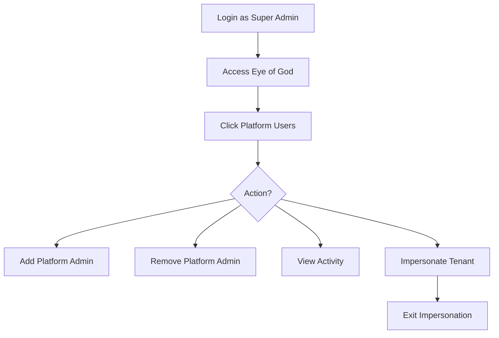

# Eye of God: User & Access Management Journey

**Version:** 1.0.0  
**Date:** 2025-12-24  
**Actor:** AAAS Sys Admin (Super Admin)  
**Purpose:** Manage platform administrators and impersonate tenants

---

## 1. Journey Overview



---

## 2. Integration: Keycloak SSO

Eye of God integrates with Keycloak at `http://keycloak:8080` for authentication and user management.

```
┌─────────────────────────────────────────────────────────────────────────────┐
│                     User Management Architecture                             │
├─────────────────────────────────────────────────────────────────────────────┤
│                                                                             │
│   Eye of God                              Keycloak                          │
│   (Admin UI)                              (:8080)                           │
│   ┌─────────────┐                        ┌─────────────┐                    │
│   │ Login Flow  │────OIDC auth──────────►│ Realm:      │                    │
│   │             │◄───JWT token───────────│ somabrain   │                    │
│   └─────────────┘                        └─────────────┘                    │
│                                                                             │
│   ┌─────────────┐                        ┌─────────────┐                    │
│   │ User CRUD   │────Admin API──────────►│ User Store  │                    │
│   │ Operations  │                        │             │                    │
│   └─────────────┘                        └─────────────┘                    │
│                                                                             │
│   Roles Mapping:                                                            │
│   ┌─────────────────────────────────────────────────────────────────────┐  │
│   │ Keycloak Role          │ SomaBrain Role                            │  │
│   ├─────────────────────────┼───────────────────────────────────────────┤  │
│   │ realm-admin             │ Super Admin                               │  │
│   │ platform-admin          │ Platform Admin                            │  │
│   │ tenant-admin            │ Tenant Admin                              │  │
│   │ tenant-editor           │ Tenant Editor                             │  │
│   │ tenant-viewer           │ Tenant Viewer                             │  │
│   └─────────────────────────┴───────────────────────────────────────────┘  │
└─────────────────────────────────────────────────────────────────────────────┘
```

---

## 3. Screen 1: Platform Users List

**Route:** `/platform/users`

```
┌─────────────────────────────────────────────────────────────────────────────┐
│ 👥 Platform Users                                   [+ Add Admin] [Sync ↻] │
├─────────────────────────────────────────────────────────────────────────────┤
│                                                                             │
│ TABS: [Platform Admins] [All Tenant Users] [Activity Log]                  │
│                                                                             │
│ ─────────────────────────────────────────────────────────────────────────── │
│                                                                             │
│ PLATFORM ADMINISTRATORS                                                     │
│ ┌─────────────────────────────────────────────────────────────────────────┐│
│ │ USER                 │ EMAIL                  │ ROLE   │ LAST   │ ACT  ││
│ ├──────────────────────┼────────────────────────┼────────┼────────┼──────┤│
│ │ 👤 John Doe          │ john@somabrain.io      │ 🔱 Super│ 5m ago │ [⚙] ││
│ │ 👤 Jane Smith        │ jane@somabrain.io      │ 🛡️ Plat │ 2h ago │ [⚙] ││
│ │ 👤 Bob Wilson        │ bob@somabrain.io       │ 🛡️ Plat │ 1d ago │ [⚙] ││
│ └─────────────────────────────────────────────────────────────────────────┘│
│                                                                             │
│ TENANT USER SUMMARY                                                         │
│ ┌─────────────────────────────────────────────────────────────────────────┐│
│ │ Total Tenant Users: 1,892                                               ││
│ │ Active Today: 456                                                       ││
│ │ Pending Invitations: 23                                                 ││
│ └─────────────────────────────────────────────────────────────────────────┘│
│                                                                             │
└─────────────────────────────────────────────────────────────────────────────┘
```

---

## 4. Screen 2: Add Platform Admin

**Route:** `/platform/users/new`

```
┌─────────────────────────────────────────────────────────────────────────────┐
│ ➕ Add Platform Administrator                                    [X Close] │
├─────────────────────────────────────────────────────────────────────────────┤
│                                                                             │
│ ⚠️ Platform administrators have access to ALL tenant data and settings.   │
│                                                                             │
│ ─────────────────────────────────────────────────────────────────────────── │
│                                                                             │
│ Email Address *                                                             │
│ ┌─────────────────────────────────────────────────────────────────────────┐│
│ │ newadmin@somabrain.io                                                   ││
│ └─────────────────────────────────────────────────────────────────────────┘│
│                                                                             │
│ First Name *                          Last Name *                           │
│ ┌─────────────────────────┐          ┌─────────────────────────┐           │
│ │ Alice                   │          │ Johnson                 │           │
│ └─────────────────────────┘          └─────────────────────────┘           │
│                                                                             │
│ Role *                                                                      │
│ ○ 🔱 Super Admin - Full platform control (only Super Admins can create)   │
│ ● 🛡️ Platform Admin - Tenant management, no settings or admin deletion    │
│                                                                             │
│ Permissions                                                                 │
│ ┌─────────────────────────────────────────────────────────────────────────┐│
│ │ [x] View all tenants                                                    ││
│ │ [x] Create and suspend tenants                                          ││
│ │ [x] Impersonate tenants                                                 ││
│ │ [x] View billing and revenue                                            ││
│ │ [ ] Modify server settings (Super Admin only)                           ││
│ │ [ ] Delete tenants (Super Admin only)                                   ││
│ │ [ ] Add/remove platform admins (Super Admin only)                       ││
│ └─────────────────────────────────────────────────────────────────────────┘│
│                                                                             │
│ Notification                                                                │
│ [x] Send invitation email with setup instructions                          │
│                                                                             │
│                                          [Cancel]  [Add Administrator]     │
│                                                                             │
└─────────────────────────────────────────────────────────────────────────────┘
```

---

## 5. Screen 3: User Activity Log

**Route:** `/platform/users?tab=activity`

```
┌─────────────────────────────────────────────────────────────────────────────┐
│ 📋 Admin Activity Log                                            [Export] │
├─────────────────────────────────────────────────────────────────────────────┤
│                                                                             │
│ Filter: User [All ▼]  Action [All ▼]  Date [Last 7 days ▼]                 │
│                                                                             │
│ ┌─────────────────────────────────────────────────────────────────────────┐│
│ │ TIME      │ USER        │ ACTION                    │ DETAILS          ││
│ ├───────────┼─────────────┼───────────────────────────┼──────────────────┤│
│ │ 14:45:23  │ john@sb.io  │ tenant.created            │ Omega Tech       ││
│ │ 14:30:15  │ john@sb.io  │ impersonation.started     │ Acme Corp        ││
│ │ 14:25:00  │ john@sb.io  │ impersonation.ended       │ Acme Corp        ││
│ │ 13:15:00  │ jane@sb.io  │ subscription.overridden   │ Beta Inc → Pro   ││
│ │ 12:00:00  │ jane@sb.io  │ tenant.suspended          │ Delta Co         ││
│ │ 11:30:00  │ bob@sb.io   │ settings.viewed           │ Server config    ││
│ │ 10:00:00  │ john@sb.io  │ admin.created             │ jane@sb.io       ││
│ └─────────────────────────────────────────────────────────────────────────┘│
│                                                                             │
│ Showing 1-10 of 245 events                      [< Prev] [1] [2] [Next >] │
│                                                                             │
└─────────────────────────────────────────────────────────────────────────────┘
```

---

## 6. Screen 4: Impersonation Flow

### 6.1 Start Impersonation

**Route:** `/platform/tenants/:id` → Click [Impersonate]

```
┌─────────────────────────────────────────────────────────────────────────────┐
│ 👤 Impersonate Tenant                                            [X Close] │
├─────────────────────────────────────────────────────────────────────────────┤
│                                                                             │
│ You are about to impersonate:                                               │
│                                                                             │
│ ┌─────────────────────────────────────────────────────────────────────────┐│
│ │ 🏢 ACME CORP                                                            ││
│ │                                                                         ││
│ │ Tier: ⭐ Pro                                                            ││
│ │ Admin: sarah@acme.com                                                   ││
│ │ Users: 12                                                               ││
│ │ Status: Active                                                          ││
│ └─────────────────────────────────────────────────────────────────────────┘│
│                                                                             │
│ ⚠️ This action will be logged and the tenant admin will be notified.     │
│                                                                             │
│ Impersonation Purpose *                                                     │
│ ┌─────────────────────────────────────────────────────────────────────────┐│
│ │ Investigating support ticket #1234 - memory recall issue               ││
│ └─────────────────────────────────────────────────────────────────────────┘│
│                                                                             │
│ Options                                                                     │
│ [ ] Notify tenant admin via email about impersonation                      │
│ [x] Auto-end impersonation after 30 minutes                                │
│                                                                             │
│                                         [Cancel]  [Start Impersonation]    │
│                                                                             │
└─────────────────────────────────────────────────────────────────────────────┘
```

### 6.2 Impersonation Active Banner

```
┌─────────────────────────────────────────────────────────────────────────────┐
│ ⚠️ IMPERSONATING: Acme Corp │ Time: 5:32 │ User: john@sb.io │ [Exit Now] ││
├─────────────────────────────────────────────────────────────────────────────┤
│                                                                             │
│  (Normal tenant dashboard view with impersonation banner at top)           │
│                                                                             │
│  ┌─────────────────────────────────────────────────────────────────────┐   │
│  │ 🏢 Acme Corp Dashboard                                              │   │
│  ├─────────────────────────────────────────────────────────────────────┤   │
│  │                                                                     │   │
│  │  You are viewing this tenant as if you were the tenant admin.      │   │
│  │                                                                     │   │
│  │  Memory Usage: 45,231 / 50,000                                     │   │
│  │  Graph Links: 12,456                                                │   │
│  │  API Calls Today: 8,923                                             │   │
│  │                                                                     │   │
│  │  [View Memories] [Settings] [Users] [API Keys]                      │   │
│  │                                                                     │   │
│  └─────────────────────────────────────────────────────────────────────┘   │
│                                                                             │
└─────────────────────────────────────────────────────────────────────────────┘
```

### 6.3 Exit Impersonation

```
┌─────────────────────────────────────────────────────────────────────────────┐
│ ✓ Impersonation Ended                                            [X Close] │
├─────────────────────────────────────────────────────────────────────────────┤
│                                                                             │
│ Session Summary                                                             │
│ ┌─────────────────────────────────────────────────────────────────────────┐│
│ │ Tenant: Acme Corp                                                       ││
│ │ Duration: 5 minutes 32 seconds                                          ││
│ │ Actions Performed: 3                                                    ││
│ │   - Viewed memory browser                                               ││
│ │   - Searched for "user preferences"                                     ││
│ │   - Viewed API key list                                                 ││
│ │                                                                         ││
│ │ Purpose: Investigating support ticket #1234 - memory recall issue      ││
│ └─────────────────────────────────────────────────────────────────────────┘│
│                                                                             │
│ This session has been logged for audit purposes.                           │
│                                                                             │
│                                     [Return to Eye of God Dashboard]       │
│                                                                             │
└─────────────────────────────────────────────────────────────────────────────┘
```

---

## 7. Keycloak API Integration

| SomaBrain Action | Keycloak API Call |
|------------------|-------------------|
| Get user list | `GET /admin/realms/somabrain/users` |
| Create admin | `POST /admin/realms/somabrain/users` |
| Assign role | `POST /admin/realms/somabrain/users/{id}/role-mappings` |
| Delete admin | `DELETE /admin/realms/somabrain/users/{id}` |
| Get sessions | `GET /admin/realms/somabrain/users/{id}/sessions` |

---

## 8. Permission Requirements

| Action | Required Role |
|--------|---------------|
| View platform users | Platform Admin+ |
| Add Platform Admin | Super Admin |
| Remove Platform Admin | Super Admin |
| Promote to Super Admin | Super Admin |
| Impersonate tenant | Platform Admin+ |
| View activity log | Platform Admin+ |

---

## 9. Audit Trail

All user management actions generate audit events:

| Event | Actor | Details Logged |
|-------|-------|----------------|
| `admin.created` | Super Admin | New admin email, role |
| `admin.removed` | Super Admin | Removed admin email |
| `impersonation.started` | Any Admin | Tenant, purpose, duration |
| `impersonation.ended` | Any Admin | Actions performed |
| `role.changed` | Super Admin | From/to roles |

---

*Eye of God: User & Access Management Journey - SomaBrain AAAS*
