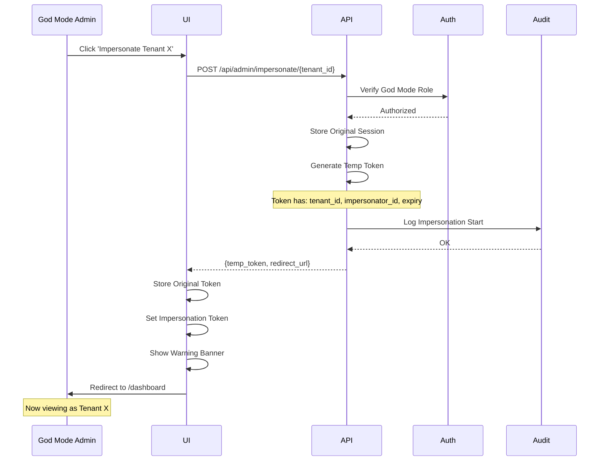
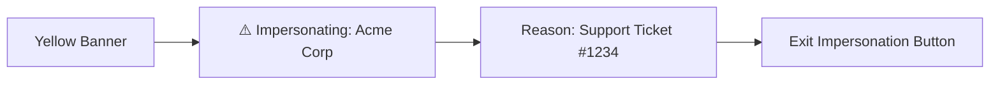
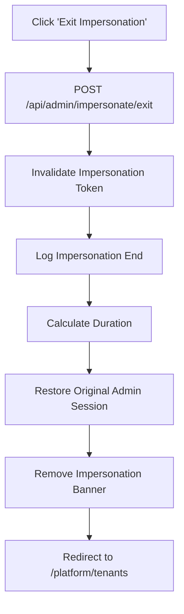
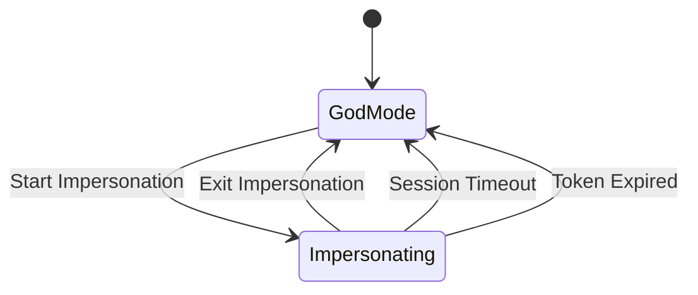

# Impersonation Flow

**Document Version:** 1.0.0  
**Date:** 2025-12-24  
**Type:** End-to-End Flow Documentation

---

## 1. Overview

God Mode impersonation flows: start, view as tenant, exit, audit logging.

---

## 2. Start Impersonation Flow

```mermaid
flowchart TD
    A[God Mode: View Tenant] --> B[Click 'Impersonate']
    B --> C[Enter Reason for Impersonation]
    C --> D[Confirm Dialog]
    D --> E{Confirm?}
    E -->|No| F[Cancel]
    E -->|Yes| G[POST /api/admin/impersonate/{tenant_id}]
    G --> H[Generate Impersonation Token]
    H --> I[Log Impersonation Start]
    I --> J[Store Original Admin Session]
    J --> K[Switch to Tenant Context]
    K --> L[Show Impersonation Banner]
    L --> M[Redirect to Tenant Dashboard]
```

---

## 3. Impersonation Sequence



---

## 4. Impersonation UI Banner



---

## 5. Exit Impersonation Flow



---

## 6. Impersonation State Machine



---

## 7. Audit Trail

| Event | Details Logged |
|-------|----------------|
| `impersonation.start` | admin_id, tenant_id, reason, timestamp |
| `impersonation.action` | action performed while impersonating |
| `impersonation.end` | duration, timestamp |

---

## 8. Security Constraints

| Constraint | Enforcement |
|------------|-------------|
| Reason Required | Cannot start without reason |
| Session Timeout | Max 1 hour impersonation |
| All Actions Logged | Every API call tagged |
| No Billing Changes | Cannot modify subscription |
| No User Deletion | Cannot delete tenant users |

---

*Document prepared by ALL 7 PERSONAS per VIBE Coding Rules v5.1*
