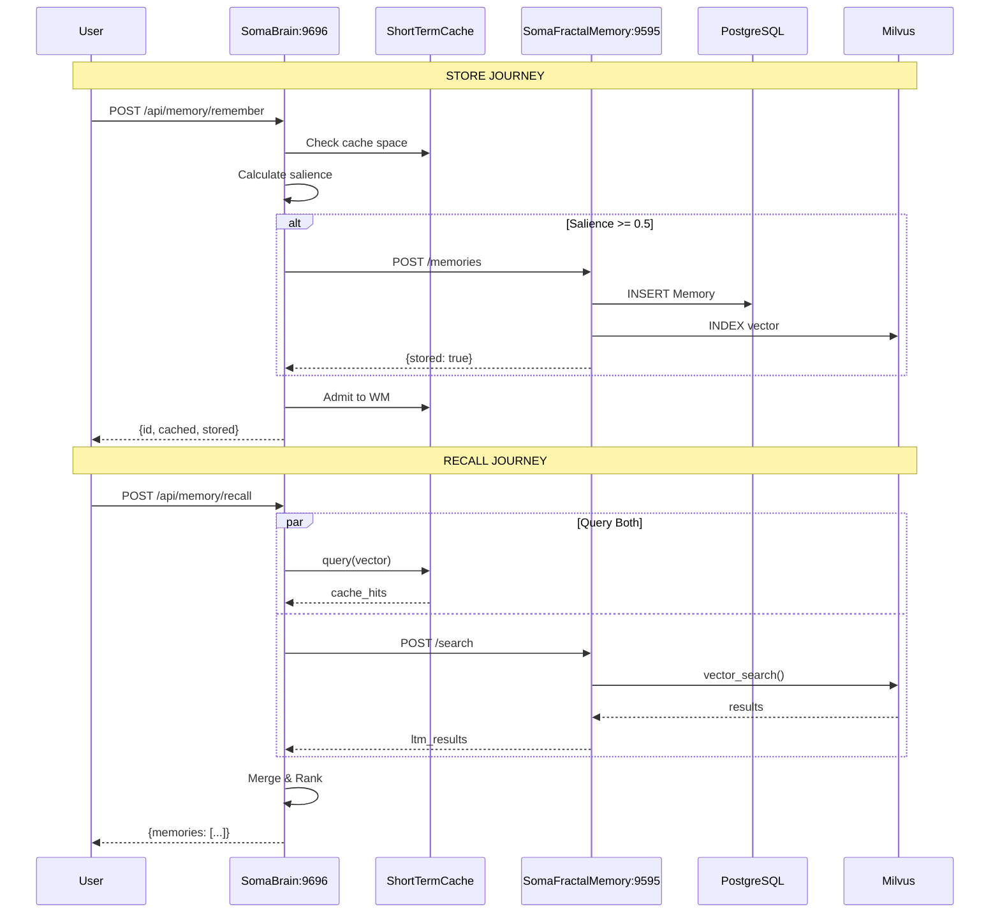

# User Journey: Integrated Memory Operations

**Version:** 1.0.0  
**Date:** 2025-12-24  
**Actor:** Tenant Editor, Tenant Admin, Developer

---

## Journey Overview

Complete memory operation flows across SomaBrain (ShortTerm) and SomaFractalMemory (LongTerm).

---

## Architecture Flow



---

## Journey 1: Store Memory

### Step 1: Choose Storage Method

**Screen:** `/app/memory/store`

```
┌────────────────────────────────────────────────────────────────────┐
│ 📝 Store Memory                                [Tenant: Acme Corp] │
├────────────────────────────────────────────────────────────────────┤
│                                                                    │
│ TABS: [Single] [Batch Import] [API Reference]                     │
│                                                                    │
│ Content                                                            │
│ ┌────────────────────────────────────────────────────────────────┐│
│ │ User John prefers dark mode in all applications and likes      ││
│ │ compact layouts with minimal whitespace. He works primarily    ││
│ │ on mobile devices during commutes.                             ││
│ └────────────────────────────────────────────────────────────────┘│
│                                                                    │
│ Memory Type                                                        │
│ ○ Episodic (events, experiences)                                   │
│ ● Semantic (facts, preferences)                                    │
│                                                                    │
│ Importance                                                         │
│ [0.0 ─────────────●──────────────── 1.0]  0.75                    │
│                                                                    │
│ Metadata (JSON, optional)                                          │
│ ┌────────────────────────────────────────────────────────────────┐│
│ │ {"user_id": "john_123", "source": "onboarding", "verified": true}│
│ └────────────────────────────────────────────────────────────────┘│
│                                                                    │
│ Storage Options                                                    │
│ [x] Auto-store to LongTerm if salience >= 0.5                     │
│ [x] Create auto-links to related memories                          │
│                                                                    │
│                                               [Store Memory →]     │
│                                                                    │
└────────────────────────────────────────────────────────────────────┘
```

### Step 2: Confirmation

**Screen:** Modal overlay

```
┌────────────────────────────────────────────────────────────────────┐
│ ✓ Memory Stored Successfully                                       │
├────────────────────────────────────────────────────────────────────┤
│                                                                    │
│ Memory ID: mem_a1b2c3d4-e5f6-7890-abcd-ef1234567890               │
│                                                                    │
│ Storage:                                                           │
│   ✓ ShortTerm Cache: Added                                        │
│   ✓ LongTerm Store: Persisted (salience=0.75)                     │
│   ✓ Vector Index: Indexed (Milvus)                                │
│   ✓ Auto-links: 3 related memories found                          │
│                                                                    │
│ Coordinate: [0.234, 0.567, 0.891]                                  │
│                                                                    │
│         [View Memory]  [Store Another]  [Done]                     │
│                                                                    │
└────────────────────────────────────────────────────────────────────┘
```

---

## Journey 2: Recall Memory

### Step 1: Enter Query

**Screen:** `/app/memory/recall`

```
┌────────────────────────────────────────────────────────────────────┐
│ 🔍 Recall Memory                               [Tenant: Acme Corp] │
├────────────────────────────────────────────────────────────────────┤
│                                                                    │
│ TABS: [Semantic Search] [By Coordinate] [By Filter]               │
│                                                                    │
│ What are you looking for?                                          │
│ ┌────────────────────────────────────────────────────────────────┐│
│ │ user preferences for UI settings                               ││
│ └────────────────────────────────────────────────────────────────┘│
│                                                                    │
│ Search Options                                                     │
│                                                                    │
│ Memory Types     Top K          Sources                            │
│ [x] Episodic     [10____]       [x] ShortTerm Cache               │
│ [x] Semantic                    [x] LongTerm Store                │
│                                                                    │
│ Time Filter                                                        │
│ From: [Any________]   To: [Today______]                           │
│                                                                    │
│                                                    [Search →]      │
│                                                                    │
└────────────────────────────────────────────────────────────────────┘
```

### Step 2: View Results

**Screen:** Results panel

```
┌────────────────────────────────────────────────────────────────────┐
│ 🔍 Results: "user preferences for UI settings"     5 memories     │
├────────────────────────────────────────────────────────────────────┤
│ Sort: [Relevance ▼]  Sources: Cache(2) + LTM(3)                   │
│                                                                    │
│ ┌────────────────────────────────────────────────────────────────┐│
│ │ 1. Semantic (0.92 relevance)              Source: LTM          ││
│ │    "User John prefers dark mode in all applications..."       ││
│ │    Importance: 0.75  │  Created: Dec 20, 2024                  ││
│ │    [View] [Copy] [Delete]                                       ││
│ ├────────────────────────────────────────────────────────────────┤│
│ │ 2. Semantic (0.87 relevance)              Source: Cache ⚡     ││
│ │    "User preferences include compact sidebar navigation..."   ││
│ │    Importance: 0.68  │  Created: Dec 24, 2024                  ││
│ │    [View] [Copy] [Delete]                                       ││
│ ├────────────────────────────────────────────────────────────────┤│
│ │ 3. Episodic (0.81 relevance)              Source: LTM          ││
│ │    "During onboarding, user selected theme: dark, density..."  ││
│ │    Importance: 0.60  │  Created: Dec 15, 2024                  ││
│ │    [View] [Copy] [Delete]                                       ││
│ └────────────────────────────────────────────────────────────────┘│
│                                                                    │
│ [Export Results]  [New Search]               Showing 1-5 of 5     │
│                                                                    │
└────────────────────────────────────────────────────────────────────┘
```

---

## Journey 3: Browse Graph

### Screen: `/app/memory/graph`

```
┌────────────────────────────────────────────────────────────────────┐
│ 🕸️ Memory Graph Explorer                                           │
├────────────────────────────────────────────────────────────────────┤
│                                                                    │
│ Start From: [mem_a1b2c3d4____________]  Hops: [2▼]  [Explore]     │
│                                                                    │
│ ┌────────────────────────────────────────────────────────────────┐│
│ │                                                                 ││
│ │                     ┌─────────┐                                ││
│ │        related      │  USER   │      related                   ││
│ │       ┌────────────►│ PREFS   │◄────────────┐                  ││
│ │       │             └────┬────┘              │                  ││
│ │       │                  │                   │                  ││
│ │  ┌────┴────┐        influences          ┌───┴─────┐            ││
│ │  │  DARK   │             │              │ COMPACT │            ││
│ │  │  MODE   │             ▼              │  LAYOUT │            ││
│ │  └─────────┘        ┌─────────┐         └─────────┘            ││
│ │                     │   UI    │                                 ││
│ │                     │ SESSION │                                 ││
│ │                     └─────────┘                                 ││
│ │                                                                 ││
│ │  [Zoom+] [Zoom-] [Reset] [Fullscreen]                          ││
│ └────────────────────────────────────────────────────────────────┘│
│                                                                    │
│ Selected: USER PREFS                                               │
│ Links: 3 outgoing, 2 incoming  │  Type: semantic  │  Imp: 0.75   │
│                                                                    │
│ [View Details]  [Find Path To...]  [Create Link]                  │
│                                                                    │
└────────────────────────────────────────────────────────────────────┘
```

---

## API Reference

### Store

```http
POST /api/memory/remember
Content-Type: application/json
Authorization: Bearer <token>
X-Tenant-ID: tenant_abc123

{
  "content": "User prefers dark mode...",
  "memory_type": "semantic",
  "importance": 0.75,
  "metadata": {"user_id": "john_123"}
}
```

### Recall

```http
POST /api/memory/recall
Content-Type: application/json
Authorization: Bearer <token>
X-Tenant-ID: tenant_abc123

{
  "query": "user preferences for UI",
  "top_k": 10,
  "memory_types": ["episodic", "semantic"],
  "sources": ["cache", "ltm"]
}
```

---

*Integrated Memory Operations - SomaBrain + SomaFractalMemory*
