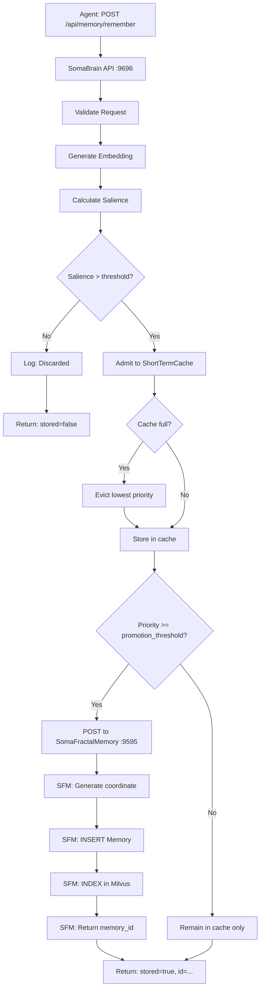
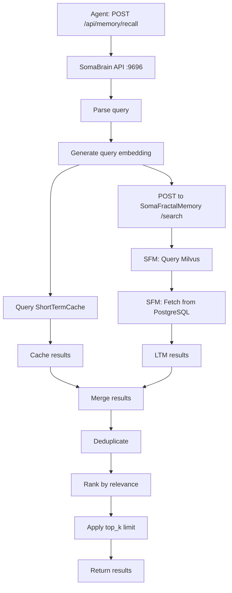
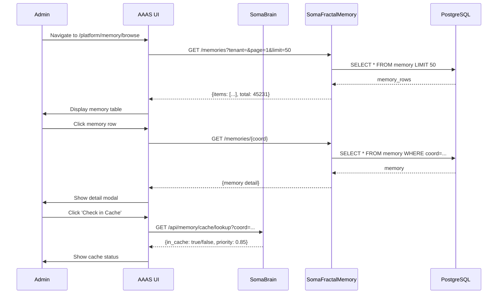
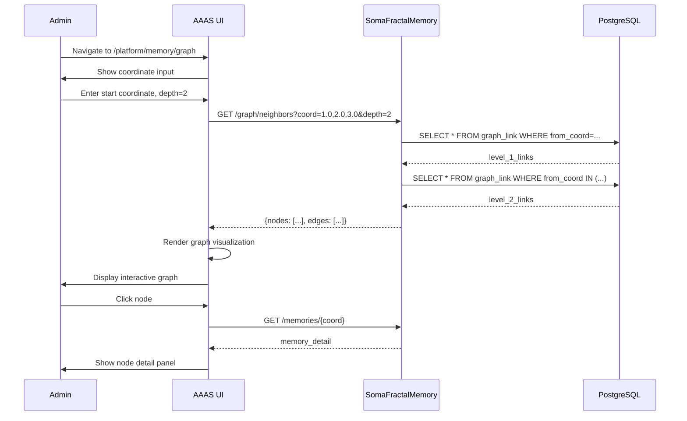
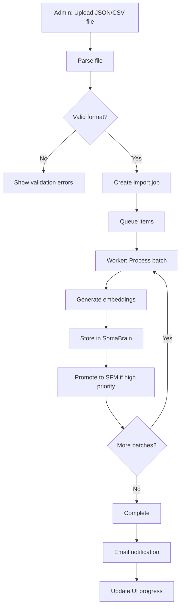
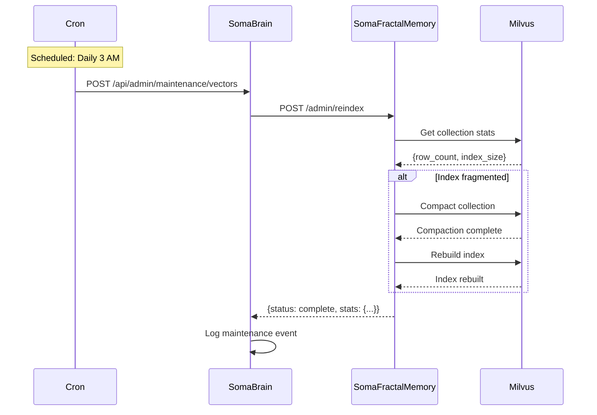
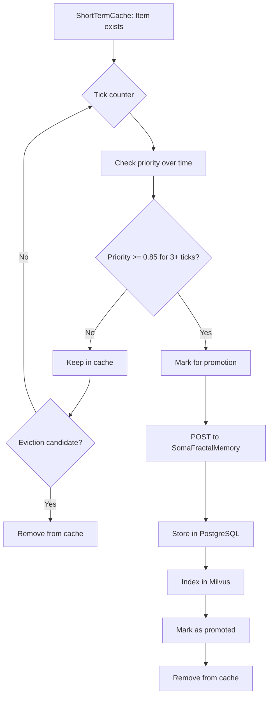
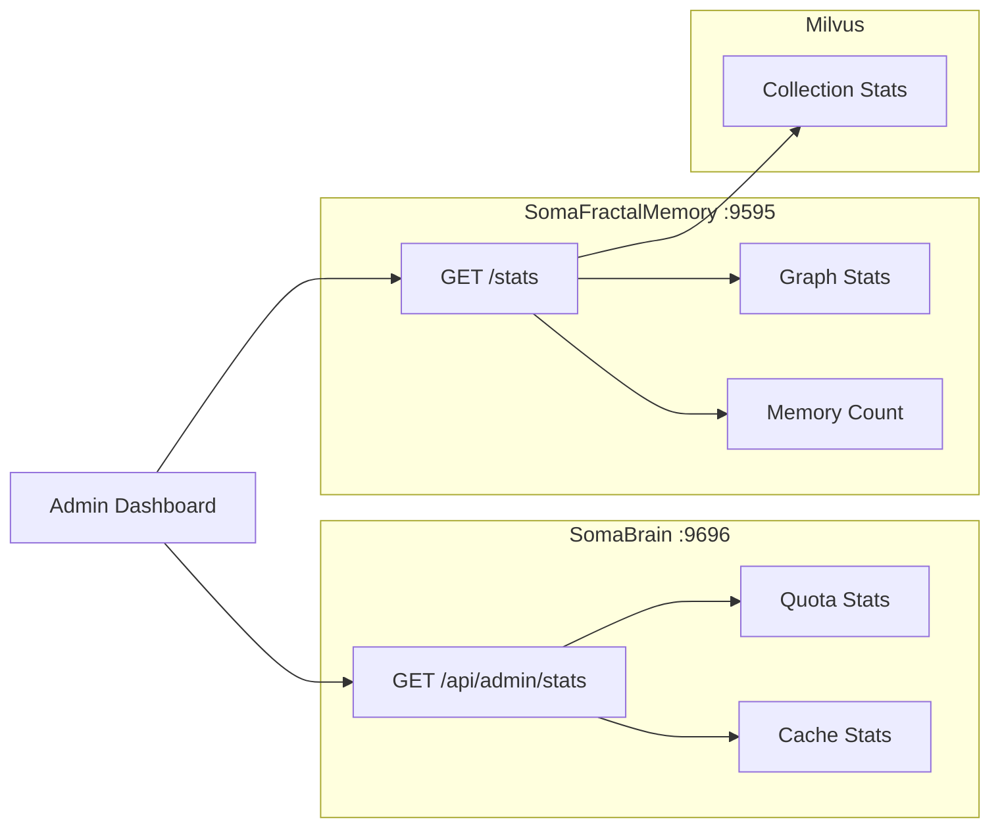

# Memory Integration Flows

**Version:** 1.0.0  
**Date:** 2025-12-24  
**Purpose:** Complete flow documentation for unified memory operations

---

## 1. Overview

Flow documentation for memory operations across both SomaBrain (cache) and SomaFractalMemory (long-term storage).

---

## 2. Store Memory - Complete Flow



---

## 3. Recall Memory - Complete Flow



---

## 4. Browse Memory - Admin Flow



---

## 5. Graph Explorer Flow



---

## 6. Delete Memory Flow

```mermaid
flowchart TD
    A[Admin: Select memory] --> B[Click Delete]
    B --> C[Confirm dialog]
    C --> D{Confirmed?}
    D -->|No| E[Cancel]
    D -->|Yes| F[DELETE /api/memory/{id}]
    
    F --> G[SomaBrain: Remove from cache]
    G --> H[SomaBrain: Call SFM DELETE]
    H --> I[SFM: DELETE FROM memory]
    I --> J[SFM: DELETE FROM milvus]
    J --> K[SFM: DELETE FROM graph_link]
    
    K --> L[Audit log]
    L --> M[Return success]
```

---

## 7. Bulk Import Flow (Admin)



---

## 8. Vector Index Maintenance Flow



---

## 9. Cache → LTM Promotion Flow



---

## 10. Memory Stats Aggregation



---

*Memory Integration Flows - SomaBrain AAAS*
