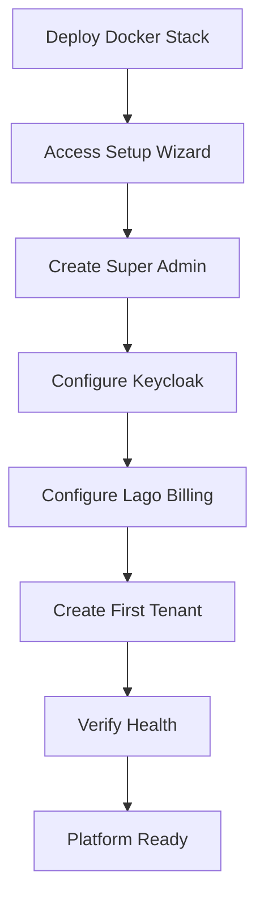

# User Journey: Platform Onboarding

**Version:** 1.0.0  
**Date:** 2025-12-24  
**Actor:** New Platform Admin

---

## Journey Overview

Steps for setting up a new SomaBrain AAAS platform from scratch.

---

## Flow Diagram



---

## Steps

### Step 1: Deploy Docker Stack

**Action:** Run docker-compose up

```
┌────────────────────────────────────────────────────────────────────┐
│ 🐳 Docker Compose Starting                                         │
├────────────────────────────────────────────────────────────────────┤
│                                                                    │
│ Starting services...                                               │
│                                                                    │
│ ✓ postgres:5432        Started                                     │
│ ✓ redis:6379           Started                                     │
│ ✓ milvus:19530         Started                                     │
│ ✓ keycloak:8080        Started                                     │
│ ✓ lago:3000            Started                                     │
│ ✓ somafractalmemory:9595 Started                                   │
│ ✓ somabrain:9696       Started                                     │
│                                                                    │
│ All services healthy ✓                                             │
│                                                                    │
│ Access platform at: http://localhost:9696                          │
│                                                                    │
└────────────────────────────────────────────────────────────────────┘
```

---

### Step 2: Setup Wizard

**Screen:** `/setup`

```
┌────────────────────────────────────────────────────────────────────┐
│ 🧠 SomaBrain - Platform Setup                                      │
├────────────────────────────────────────────────────────────────────┤
│                                                                    │
│ Welcome to SomaBrain AAAS Platform                                 │
│                                                                    │
│ Let's configure your platform in a few simple steps:              │
│                                                                    │
│ Step 1: Create Super Admin Account                ← Current        │
│ Step 2: Configure Authentication                                   │
│ Step 3: Configure Billing                                          │
│ Step 4: Create First Tenant                                        │
│ Step 5: Verify Setup                                               │
│                                                                    │
│ ─────────────────────────────────────────────────────────────────  │
│                                                                    │
│ Super Admin Email                                                  │
│ [admin@mycompany.com_______________________________________]       │
│                                                                    │
│ Password                                                           │
│ [••••••••••______________________________________]                 │
│                                                                    │
│ Confirm Password                                                   │
│ [••••••••••______________________________________]                 │
│                                                                    │
│ Organization Name                                                  │
│ [My Company_____________________________________________]          │
│                                                                    │
│                                    [Next: Configure Auth →]        │
│                                                                    │
└────────────────────────────────────────────────────────────────────┘
```

---

### Step 3: Configure Keycloak

**Screen:** `/setup/auth`

```
┌────────────────────────────────────────────────────────────────────┐
│ 🔐 Authentication Configuration                                    │
├────────────────────────────────────────────────────────────────────┤
│                                                                    │
│ Keycloak Integration                                               │
│                                                                    │
│ Keycloak URL                                                       │
│ [http://keycloak:8080________________________________]             │
│                                                                    │
│ Realm Name                                                         │
│ [somabrain______________________________________________]          │
│                                                                    │
│ Client ID                                                          │
│ [somabrain-api_________________________________________]           │
│                                                                    │
│ Client Secret                                                      │
│ [••••••••••••••••______________________________________]           │
│                                                                    │
│ ─────────────────────────────────────────────────────────────────  │
│                                                                    │
│ Google OAuth (Optional)                                            │
│                                                                    │
│ [x] Enable Google Sign-In                                          │
│                                                                    │
│ Google Client ID                                                   │
│ [xxxxxxxx.apps.googleusercontent.com________________]              │
│                                                                    │
│ [← Back]                               [Next: Configure Billing →] │
│                                                                    │
└────────────────────────────────────────────────────────────────────┘
```

---

### Step 4: Configure Lago Billing

**Screen:** `/setup/billing`

```
┌────────────────────────────────────────────────────────────────────┐
│ 💳 Billing Configuration                                           │
├────────────────────────────────────────────────────────────────────┤
│                                                                    │
│ Lago Integration                                                   │
│                                                                    │
│ Lago API URL                                                       │
│ [http://lago:3000_______________________________________]          │
│                                                                    │
│ Lago API Key                                                       │
│ [lago_api_xxxxxxxxxxxxxxxxxxxxxxxxxxxxxxxx____________]            │
│                                                                    │
│ ─────────────────────────────────────────────────────────────────  │
│                                                                    │
│ Default Subscription Plans                                         │
│                                                                    │
│ ┌──────────────────────────────────────────────────────────────┐  │
│ │ [Free]      $0/mo     1K API calls, 500 ops                  │  │
│ │ [Starter]   $49/mo    10K API calls, 5K ops                  │  │
│ │ [Pro]       $199/mo   100K API calls, 50K ops      ← Default │  │
│ │ [Enterprise] Custom   Unlimited                              │  │
│ └──────────────────────────────────────────────────────────────┘  │
│                                                                    │
│ [ ] Auto-create default plans in Lago                              │
│                                                                    │
│ [← Back]                               [Next: Create Tenant →]     │
│                                                                    │
└────────────────────────────────────────────────────────────────────┘
```

---

### Step 5: Create First Tenant

**Screen:** `/setup/tenant`

```
┌────────────────────────────────────────────────────────────────────┐
│ 🏢 Create First Tenant                                             │
├────────────────────────────────────────────────────────────────────┤
│                                                                    │
│ This creates your first customer organization.                     │
│                                                                    │
│ Tenant Name                                                        │
│ [Demo Tenant____________________________________________]          │
│                                                                    │
│ Admin Email                                                        │
│ [demo-admin@mycompany.com______________________________]           │
│                                                                    │
│ Subscription Tier                                                  │
│ [Pro ▼]                                                            │
│                                                                    │
│ [ ] Send welcome email to admin                                    │
│ [x] Create sample memories                                         │
│                                                                    │
│ [← Back]                               [Next: Verify Setup →]      │
│                                                                    │
└────────────────────────────────────────────────────────────────────┘
```

---

### Step 6: Verification

**Screen:** `/setup/verify`

```
┌────────────────────────────────────────────────────────────────────┐
│ ✓ Platform Setup Complete                                          │
├────────────────────────────────────────────────────────────────────┤
│                                                                    │
│ All services configured and running:                               │
│                                                                    │
│ ✓ Super Admin created: admin@mycompany.com                         │
│ ✓ Keycloak realm: somabrain                                        │
│ ✓ Google OAuth: Enabled                                            │
│ ✓ Lago billing: Connected (4 plans)                                │
│ ✓ First tenant: Demo Tenant (Pro tier)                             │
│                                                                    │
│ ─────────────────────────────────────────────────────────────────  │
│                                                                    │
│ Service Health:                                                    │
│                                                                    │
│ ✓ SomaBrain API          :9696   Healthy                           │
│ ✓ SomaFractalMemory      :9595   Healthy                           │
│ ✓ PostgreSQL             :5432   Connected (15 tables)             │
│ ✓ Redis                  :6379   Connected                         │
│ ✓ Milvus                 :19530  Connected (1 collection)          │
│ ✓ Keycloak               :8080   Healthy                           │
│ ✓ Lago                   :3000   Healthy                           │
│                                                                    │
│                                    [Go to Dashboard →]             │
│                                                                    │
└────────────────────────────────────────────────────────────────────┘
```

---

## Success Criteria

- [ ] All services responding
- [ ] Super Admin can login
- [ ] First tenant accessible
- [ ] Health endpoints return 200

---

*Platform Onboarding Journey - SomaBrain AAAS*
