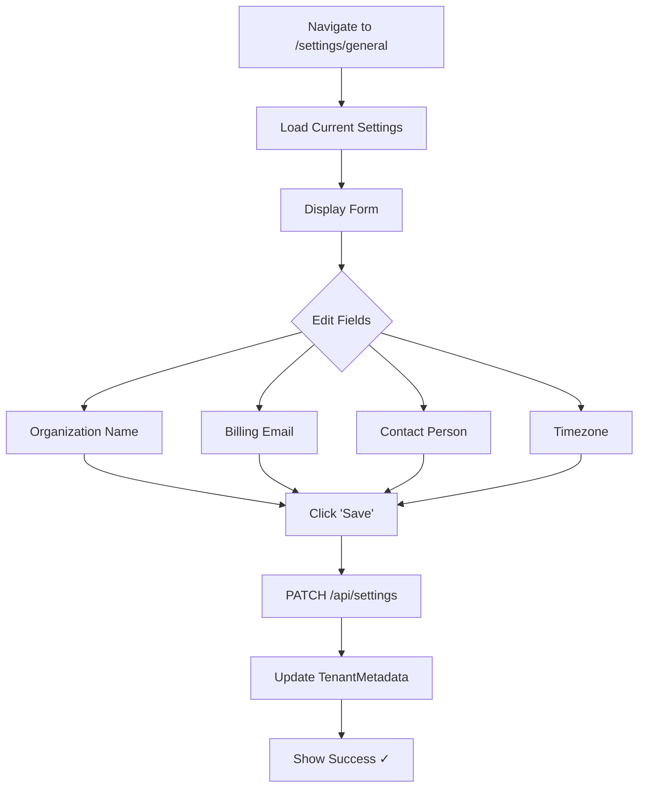
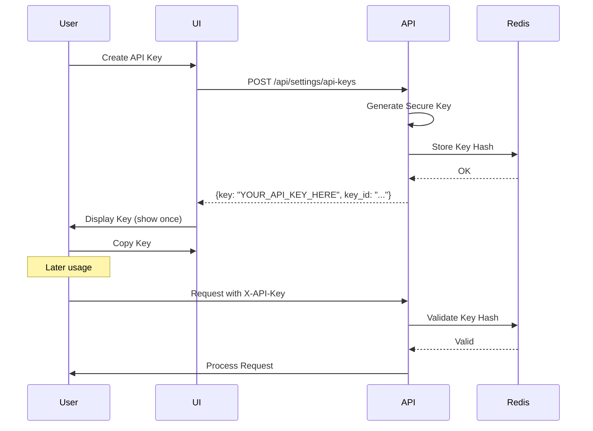
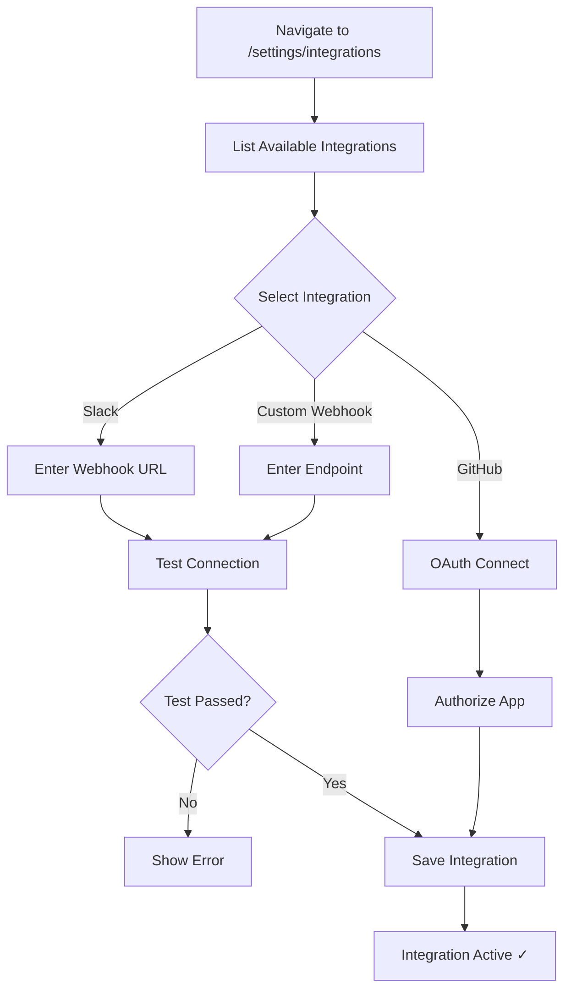
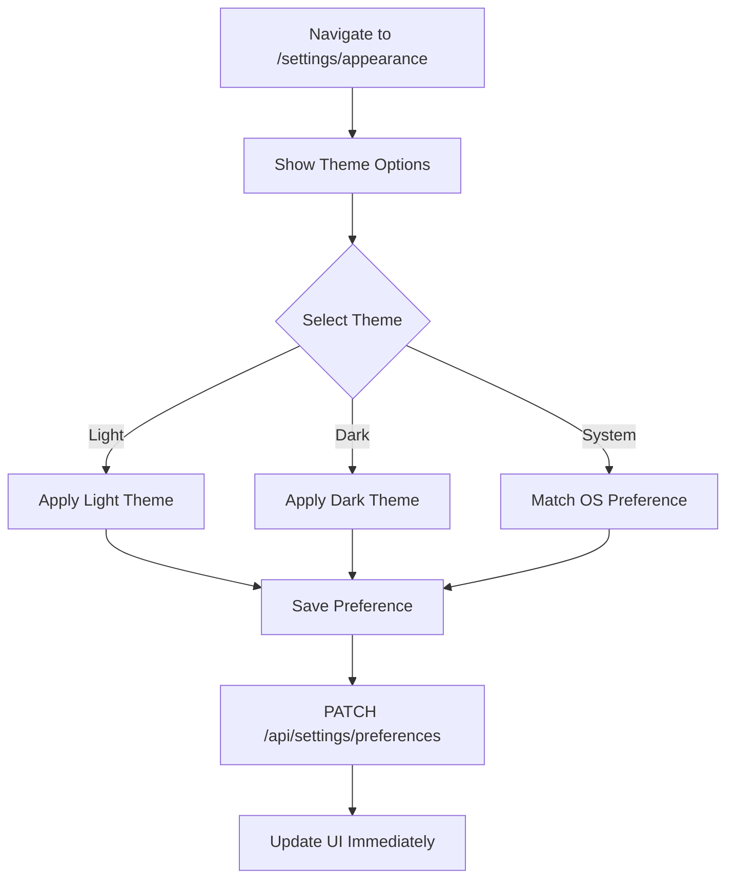
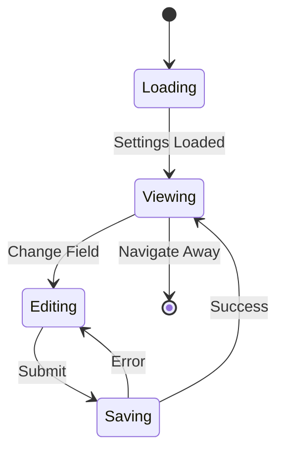

# Settings & Configuration Flow

**Document Version:** 1.0.0  
**Date:** 2025-12-24  
**Type:** End-to-End Flow Documentation

---

## 1. Overview

Complete settings flows: tenant config, API keys, integrations, themes.

---

## 2. Settings Navigation

```mermaid
flowchart LR
    A[/settings] --> B[General]
    A --> C[Subscription]
    A --> D[Billing]
    A --> E[Users]
    A --> F[API Keys]
    A --> G[Integrations]
    A --> H[Appearance]
```

---

## 3. Update Tenant Settings Flow



---

## 4. Manage API Keys Flow

```mermaid
flowchart TD
    A[Navigate to /settings/api-keys] --> B[List Existing Keys]
    B --> C{Action}
    C -->|Create| D[Click '+ New Key']
    D --> E[Enter Key Name]
    E --> F[Select Permissions]
    F --> G[Set Expiration]
    G --> H[POST /api/settings/api-keys]
    H --> I[Generate Key]
    I --> J[Show Key ONCE]
    J --> K[Copy to Clipboard]
    
    C -->|Revoke| L[Select Key]
    L --> M[Click 'Revoke']
    M --> N[Confirm Dialog]
    N --> O[DELETE /api/settings/api-keys/{id}]
    O --> P[Key Invalidated ✓]
```

---

## 5. API Key Sequence



---

## 6. Configure Integrations Flow



---

## 7. Theme Selection Flow



---

## 8. Settings State Machine



---

*Document prepared by ALL 7 PERSONAS per VIBE Coding Rules v5.1*
