# Subscription Management Flow

**Document Version:** 1.0.0  
**Date:** 2025-12-24  
**Type:** End-to-End Flow Documentation

---

## 1. Overview

Complete subscription management flows: view, upgrade, downgrade, cancel, update payment.

---

## 2. View Current Subscription


---

## 3. Upgrade Subscription Flow

```mermaid
flowchart TD
    A[Click 'Upgrade Plan'] --> B[View Available Tiers]
    B --> C{Select Higher Tier}
    C --> D[Show Pricing Comparison]
    D --> E[Show Proration Amount]
    E --> F{Confirm Upgrade?}
    F -->|No| G[Cancel]
    F -->|Yes| H[POST /api/subscription/upgrade]
    H --> I[API: Update Lago Subscription]
    I --> J{Payment Valid?}
    J -->|No| K[Show Payment Error]
    K --> L[Update Payment Method]
    L --> H
    J -->|Yes| M[Lago: Prorate Invoice]
    M --> N[Update TenantSubscription]
    N --> O[Show Success]
    O --> P[New Features Active ✓]
```



---

## 4. Downgrade Subscription Flow

```mermaid
flowchart TD
    A[Click 'Change Plan'] --> B[Select Lower Tier]
    B --> C[Show Feature Comparison]
    C --> D[Warning: Features Lost]
    D --> E{Confirm Downgrade?}
    E -->|No| F[Cancel]
    E -->|Yes| G[POST /api/subscription/downgrade]
    G --> H[Queue for End of Period]
    H --> I[Show: Changes on {date}]
    I --> J[Email Confirmation Sent]
```

---

## 5. Cancel Subscription Flow

```mermaid
flowchart TD
    A[Click 'Cancel Subscription'] --> B[Show Retention Offer]
    B --> C{Accept Offer?}
    C -->|Yes| D[Apply Discount]
    D --> E[Stay Subscribed]
    C -->|No| F[Show Cancellation Survey]
    F --> G[Select Reason]
    G --> H{Confirm Cancel?}
    H -->|No| I[Return]
    H -->|Yes| J[POST /api/subscription/cancel]
    J --> K[Lago: Cancel at Period End]
    K --> L[Update TenantSubscription]
    L --> M[Show: Access Until {date}]
    M --> N[Email Confirmation Sent]
```

---

## 6. Update Payment Method Flow


---

## 7. Subscription State Machine


---

## 8. Error Handling

| Error | Cause | Resolution |
|-------|-------|------------|
| `402 Payment Required` | Card declined | Update payment method |
| `400 Invalid Tier` | Tier not available | Select valid tier |
| `409 Already Pending` | Existing pending change | Wait for current change |

---

*Document prepared by ALL 7 PERSONAS per VIBE Coding Rules v5.1*
