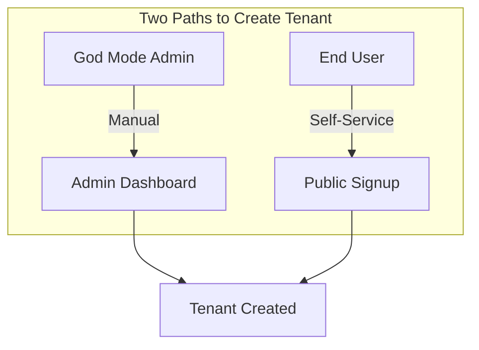
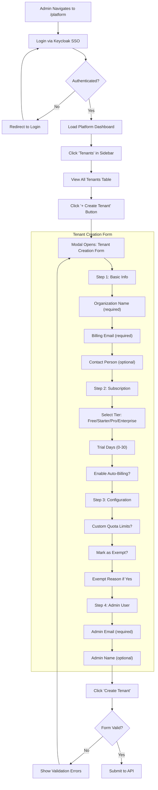
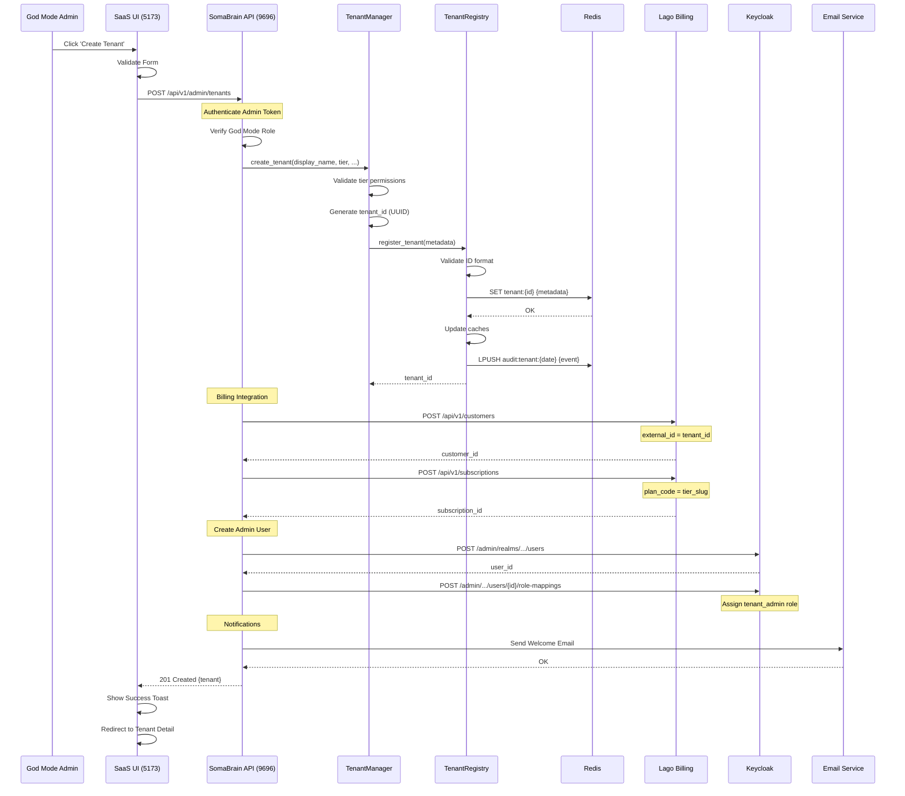
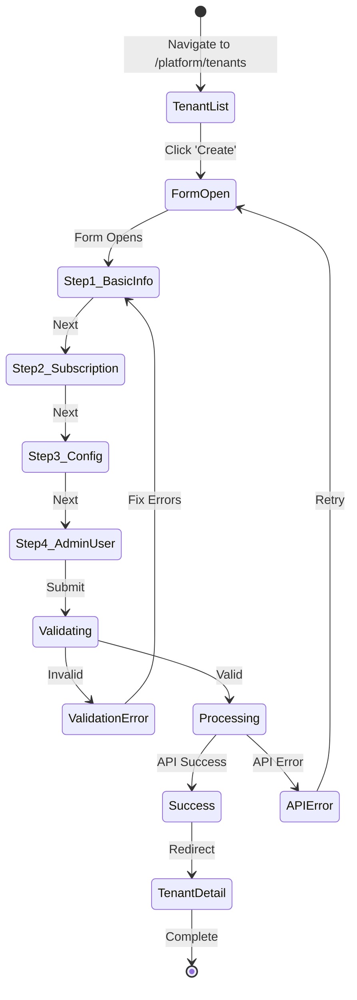
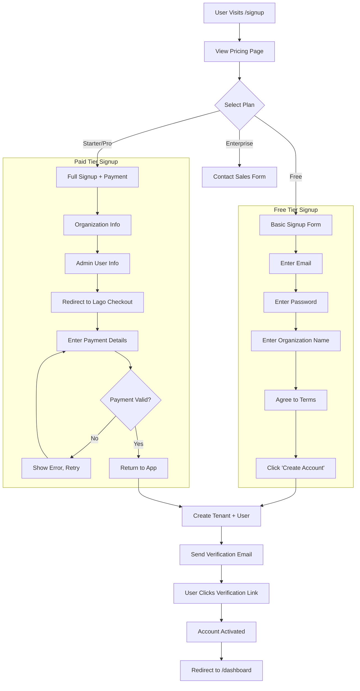
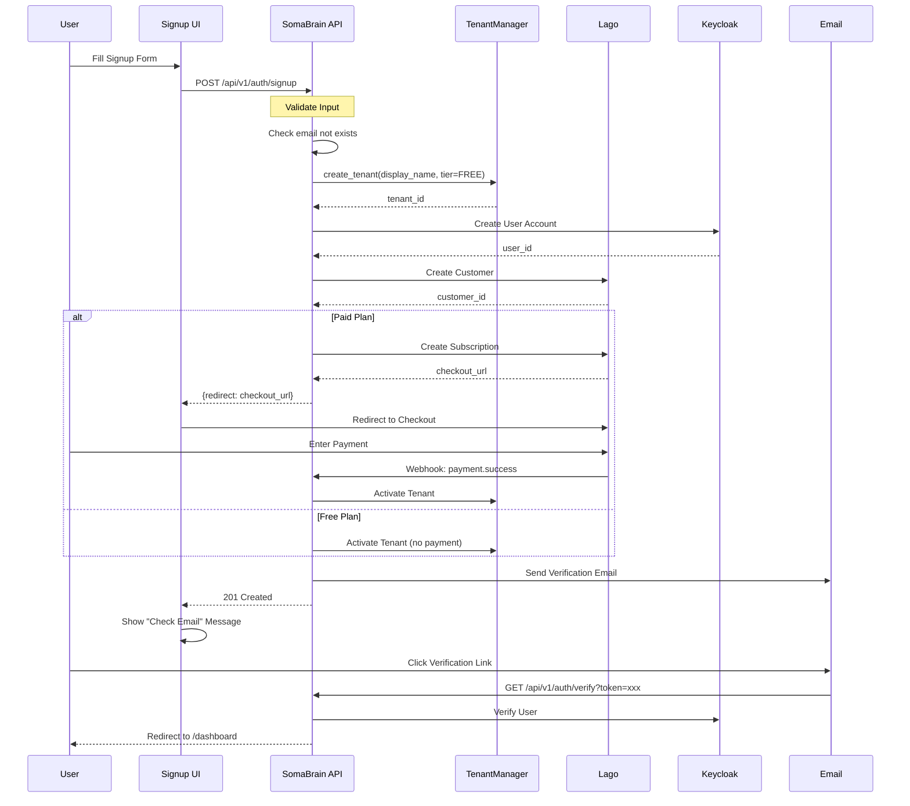
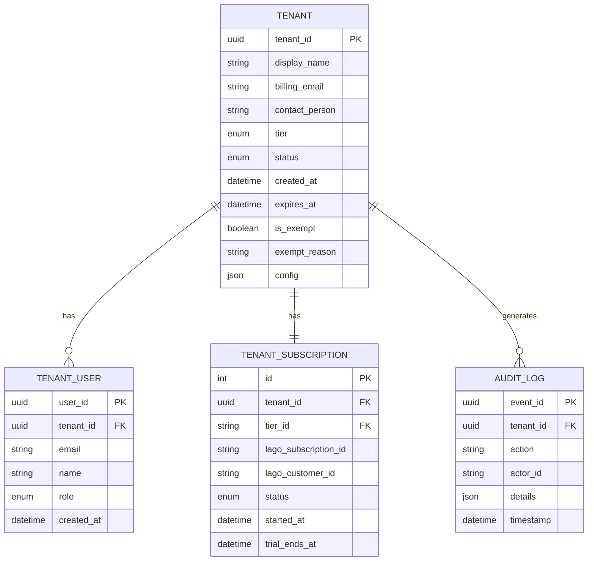
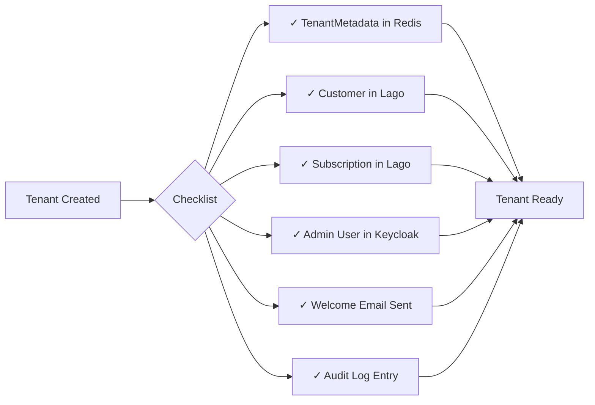

# Tenant Creation Complete Flow

**Document Version:** 1.0.0  
**Date:** 2025-12-24  
**Type:** End-to-End Flow Documentation

---

## 1. Overview

This document describes the **complete flow** for creating tenants in the SomaBrain SaaS platform, covering:
- God Mode Admin creating tenants
- Self-signup tenant registration
- Backend processing and integrations

---

## 2. Tenant Creation Methods

---

## 3. God Mode Admin: Create Tenant Flow

### 3.1 Complete UI Flow

### 3.2 Backend Processing Sequence

### 3.3 UI State Diagram

---

## 4. Self-Service Signup Flow

### 4.1 Public Registration Flow

### 4.2 Self-Signup Backend Sequence

---

## 5. Tenant Data Model

---

## 6. Post-Creation Checklist

---

## 7. Error Handling

| Error | Cause | Resolution |
|-------|-------|------------|
| `409 Conflict` | Tenant name already exists | Change organization name |
| `400 Bad Request` | Invalid email format | Fix email address |
| `402 Payment Required` | Payment failed (paid tier) | Update payment method |
| `503 Service Unavailable` | Lago/Keycloak down | Retry later, check health |

---

## 8. Related Documents

- [SRS-01: Multi-Tenancy](./01-multi-tenancy.md) - Tenant architecture details
- [SRS-02: Subscription & Billing](./02-subscription-billing.md) - Lago integration
- [SRS-03: Authentication & SSO](./03-authentication-sso.md) - Keycloak/OAuth setup
- [SRS-04: God Mode Admin](./04-god-mode-admin.md) - Admin dashboard

---

*Document prepared by ALL 7 PERSONAS per VIBE Coding Rules v5.1*
