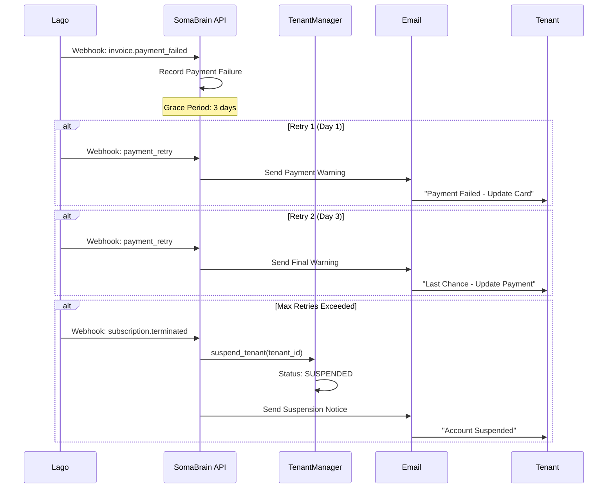
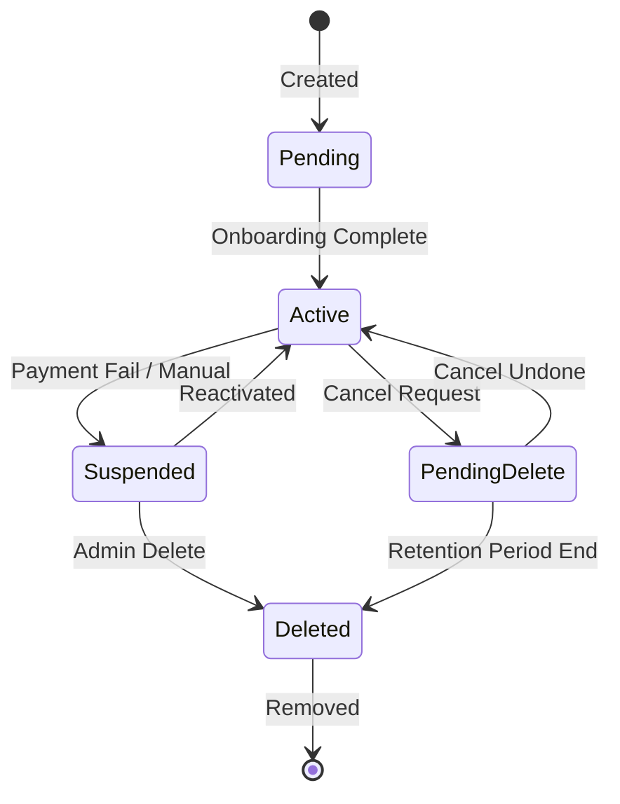

# Tenant Suspension Flow

**Document Version:** 1.0.0  
**Date:** 2025-12-24  
**Type:** End-to-End Flow Documentation

---

## 1. Overview

Complete tenant suspension flows: manual suspend, auto-suspend, reactivation, deletion.

---

## 2. Manual Suspension Flow (God Mode)

```mermaid
flowchart TD
    A[God Mode: Select Tenant] --> B[Click 'Suspend']
    B --> C[Enter Suspension Reason]
    C --> D[Confirm Dialog]
    D --> E{Confirm?}
    E -->|No| F[Cancel]
    E -->|Yes| G[POST /api/admin/tenants/{id}/suspend]
    G --> H[TenantManager.suspend_tenant]
    H --> I[Update Status: SUSPENDED]
    I --> J[Lago: Cancel Subscription]
    J --> K[Notify Tenant Admin]
    K --> L[Audit Log Entry]
    L --> M[Show Success ✓]
```

---

## 3. Automatic Suspension (Payment Failure)



---

## 4. Tenant Reactivation Flow

```mermaid
flowchart TD
    A[God Mode: View Suspended Tenant] --> B[Click 'Reactivate']
    B --> C{Suspension Reason?}
    C -->|Payment| D[Verify Payment Updated]
    C -->|Policy| E[Review Resolved]
    C -->|Manual| F[Confirm Reactivation]
    
    D --> G{Payment Valid?}
    G -->|No| H[Request Payment Update]
    G -->|Yes| I[POST /api/admin/tenants/{id}/activate]
    E --> I
    F --> I
    
    I --> J[TenantManager.activate_tenant]
    J --> K[Status: ACTIVE]
    K --> L[Lago: Resume Subscription]
    L --> M[Notify Tenant Admin]
    M --> N[Audit Log Entry]
    N --> O[Show Success ✓]
```

---

## 5. Tenant Deletion Flow

```mermaid
flowchart TD
    A[God Mode: Select Tenant] --> B[Click 'Delete']
    B --> C{Is System Tenant?}
    C -->|Yes| D[Error: Cannot Delete]
    C -->|No| E[Enter Confirmation Text]
    E --> F{Text Matches?}
    F -->|No| G[Disable Delete Button]
    F -->|Yes| H[Confirm Dialog]
    H --> I{GDPR Export?}
    I -->|Yes| J[Generate Data Export]
    J --> K[Email Export Link]
    I -->|No| L[DELETE /api/admin/tenants/{id}]
    K --> L
    L --> M[Delete from Redis]
    M --> N[Delete from Lago]
    N --> O[Delete Users from Keycloak]
    O --> P[Anonymize Logs]
    P --> Q[Audit Log Entry]
    Q --> R[Show Success ✓]
```

---

## 6. Tenant Status State Machine



---

## 7. Suspension Impact

| Feature | Active | Suspended |
|---------|--------|-----------|
| API Access | ✓ | ✗ |
| Dashboard | ✓ | Read-only |
| Data Retention | Permanent | 30 days |
| Billing | Active | Paused |

---

*Document prepared by ALL 7 PERSONAS per VIBE Coding Rules v5.1*
