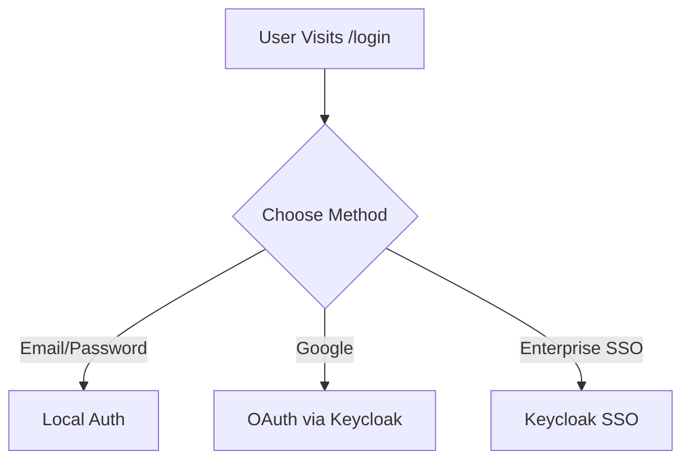
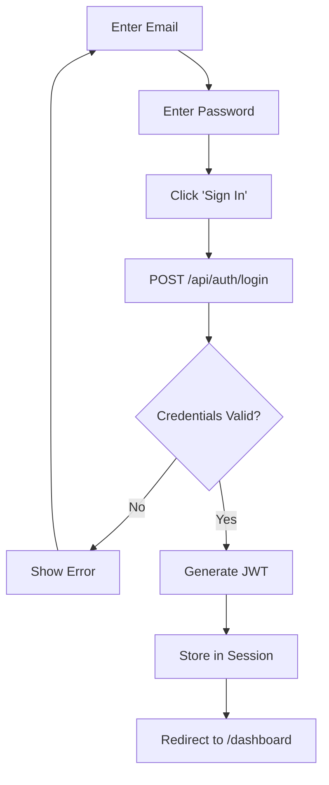
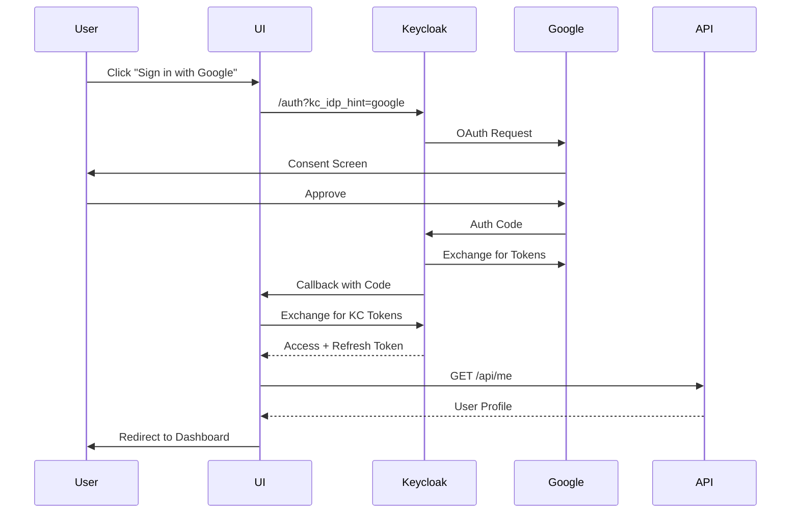
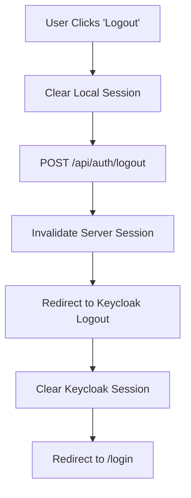
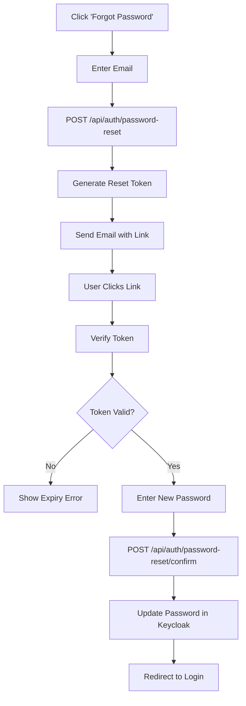
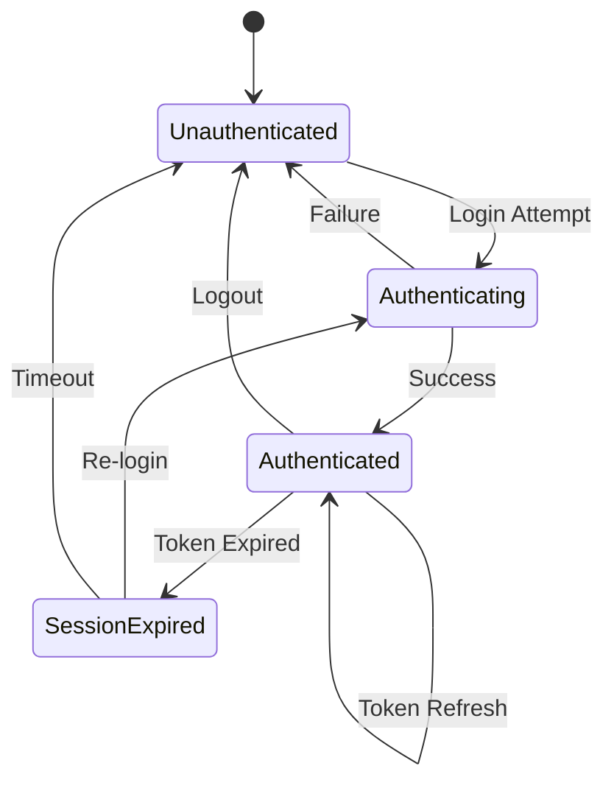

# User Authentication Flow

**Document Version:** 1.0.0  
**Date:** 2025-12-24  
**Type:** End-to-End Flow Documentation

---

## 1. Overview

Complete authentication flows for SomaBrain AAAS platform: login, logout, SSO, password reset.

---

## 2. Login Methods

---

## 3. Email/Password Login Flow

---

## 4. Google OAuth Sequence

---

## 5. Logout Flow

---

## 6. Password Reset Flow

---

## 7. Session State Machine

---

## 8. Error Handling

| Error | Cause | Resolution |
|-------|-------|------------|
| `401 Unauthorized` | Invalid credentials | Re-enter password |
| `403 Forbidden` | Account disabled | Contact admin |
| `429 Too Many Requests` | Rate limit | Wait and retry |

---

*Document prepared by ALL 7 PERSONAS per VIBE Coding Rules v5.1*
