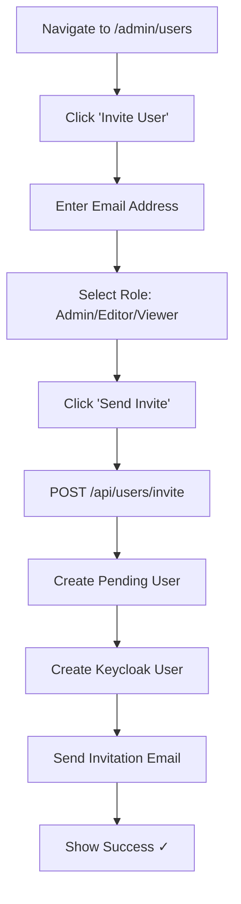
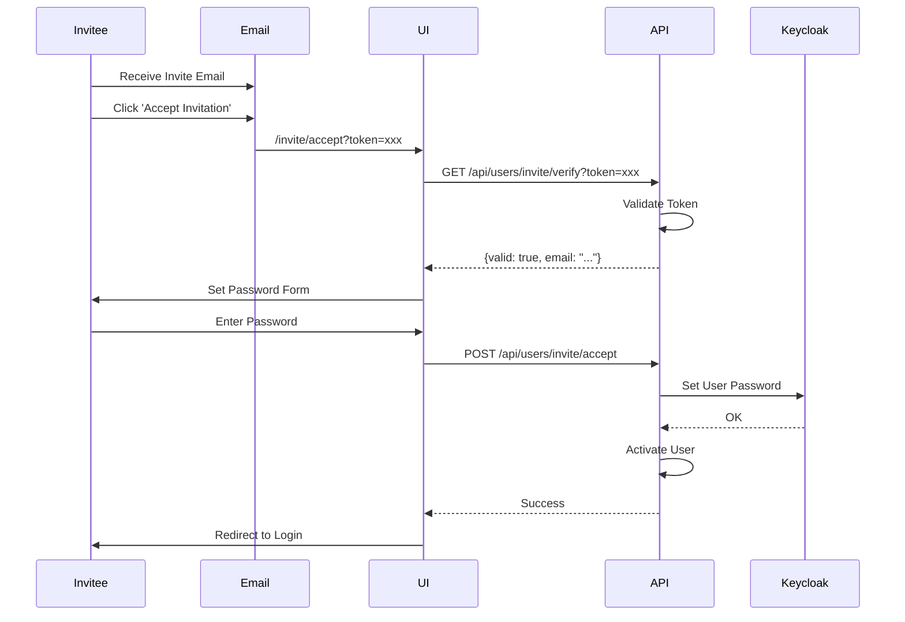
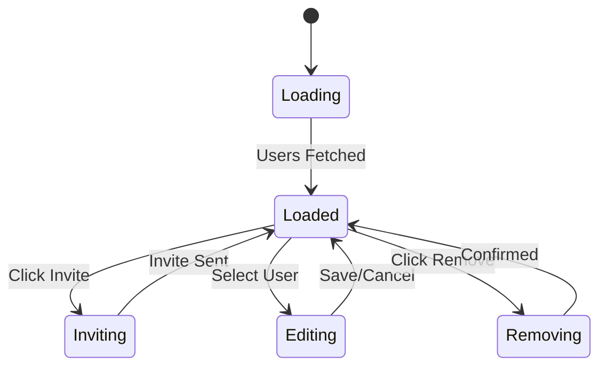

# User Management Flow

**Document Version:** 1.0.0  
**Date:** 2025-12-24  
**Type:** End-to-End Flow Documentation

---

## 1. Overview

Complete user management flows: invite users, assign roles, remove users, update profiles.

---

## 2. Invite User Flow



---

## 3. Invite Acceptance Sequence



---

## 4. Role Assignment Flow

```mermaid
flowchart TD
    A[Select User from List] --> B[Click 'Edit Role']
    B --> C[Show Role Dropdown]
    C --> D{Select New Role}
    D -->|Admin| E[Full Access]
    D -->|Editor| F[Create/Edit Access]
    D -->|Viewer| G[Read-Only Access]
    E --> H[POST /api/users/{id}/role]
    F --> H
    G --> H
    H --> I[Update Keycloak Role]
    I --> J[Audit Log Entry]
    J --> K[Show Success ✓]
```

---

## 5. Remove User Flow

```mermaid
flowchart TD
    A[Select User] --> B[Click 'Remove']
    B --> C[Confirm Dialog]
    C --> D{Is Last Admin?}
    D -->|Yes| E[Error: Cannot Remove]
    D -->|No| F{Confirm?}
    F -->|No| G[Cancel]
    F -->|Yes| H[DELETE /api/users/{id}]
    H --> I[Deactivate in Keycloak]
    I --> J[Transfer Ownership?]
    J --> K[Audit Log Entry]
    K --> L[Show Success ✓]
```

---

## 6. User List State Machine



---

## 7. Role Permissions Matrix

| Permission | Admin | Editor | Viewer |
|------------|-------|--------|--------|
| View Dashboard | ✓ | ✓ | ✓ |
| Use Chat | ✓ | ✓ | ✓ |
| Create Memory | ✓ | ✓ | ✗ |
| Delete Memory | ✓ | ✓ | ✗ |
| Manage Users | ✓ | ✗ | ✗ |
| View Billing | ✓ | ✗ | ✗ |
| Change Settings | ✓ | ✗ | ✗ |

---

## 8. Error Handling

| Error | Cause | Resolution |
|-------|-------|------------|
| `409 User Exists` | Email already registered | Use different email |
| `403 Cannot Remove` | Last admin in tenant | Assign another admin first |
| `400 Invalid Role` | Unknown role name | Select valid role |

---

*Document prepared by ALL 7 PERSONAS per VIBE Coding Rules v5.1*
