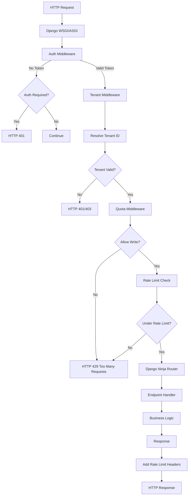
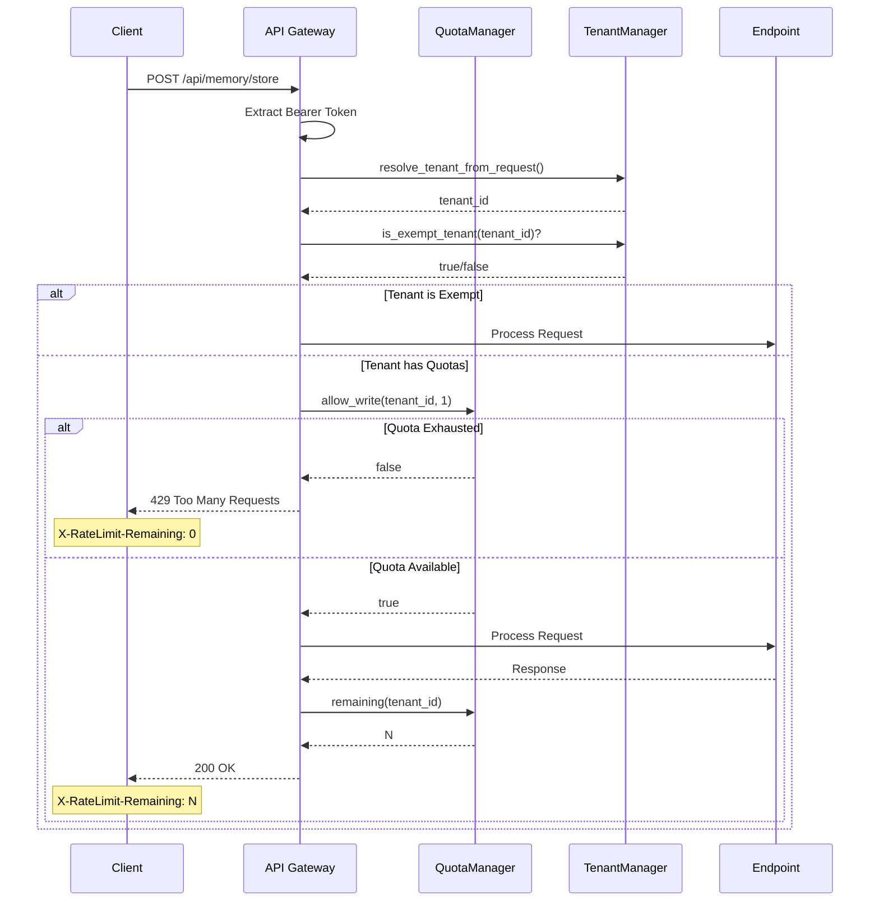
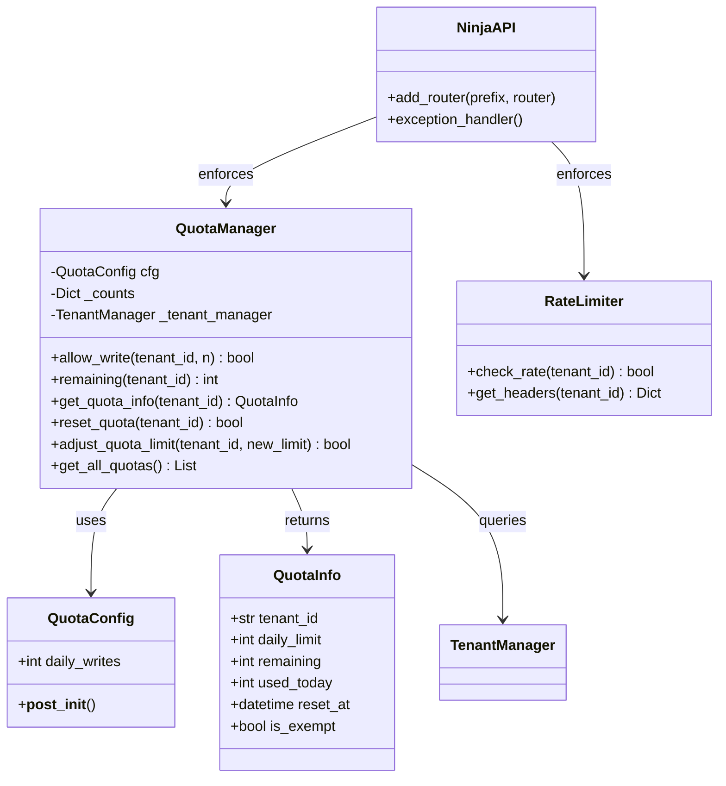
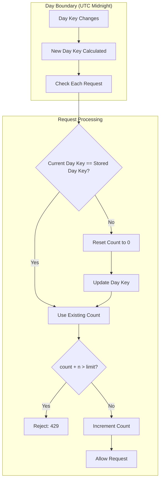

# SRS-06: API Gateway & Rate Limiting

**Document Version:** 1.0.0  
**Date:** 2025-12-24  
**Standard:** ISO/IEC/IEEE 29148:2018 Compatible  
**Module:** API Gateway Subsystem

---

## 1. Overview

The API Gateway module manages request processing, per-tenant rate limiting, quota enforcement, and request routing for the SomaBrain AAAS platform.

### 1.1 Scope

| Component | Description |
|-----------|-------------|
| QuotaManager | Daily write quotas per tenant |
| RateLimiter | Request rate limiting |
| API Router | Django Ninja endpoint routing |
| Middleware | Auth, tenant, quota middleware |

---

## 2. Request Processing Pipeline

---

## 3. Rate Limit Enforcement Sequence

---

## 4. UML Component Diagram

---

## 5. Quota Reset Flow

---

## 6. Functional Requirements

| REQ-ID | Requirement | Priority | Status | Implementation |
|--------|-------------|----------|--------|----------------|
| REQ-QUOTA-001 | Per-tenant rate limits from tier | CRITICAL | ⚠️ PARTIAL | `quotas.py` exists |
| REQ-QUOTA-002 | HTTP 429 response when limit exceeded | HIGH | ⚠️ PARTIAL | Needs middleware |
| REQ-QUOTA-003 | Rate limit headers (X-RateLimit-*) | MEDIUM | ❌ MISSING | To be added |
| REQ-QUOTA-004 | Quota reset on billing cycle | HIGH | ✅ EXISTS | Day key reset |
| REQ-QUOTA-005 | Burst allowance configuration | LOW | ❌ MISSING | Future feature |
| REQ-QUOTA-006 | Exempt tenants bypass quotas | HIGH | ✅ EXISTS | `_is_exempt()` |
| REQ-QUOTA-007 | Tenant-specific quota overrides | MEDIUM | ⚠️ PARTIAL | Via config |

---

## 7. Rate Limit Headers

| Header | Description | Example |
|--------|-------------|---------|
| `X-RateLimit-Limit` | Daily limit for tenant | `10000` |
| `X-RateLimit-Remaining` | Remaining requests today | `9823` |
| `X-RateLimit-Reset` | Unix timestamp of reset | `1703462400` |
| `Retry-After` | Seconds until reset (on 429) | `3600` |

---

## 8. Key Files

| File | Purpose | Lines |
|------|---------|-------|
| [quotas.py](file:///Users/macbookpro201916i964gb1tb/Documents/GitHub/somabrain/somabrain/quotas.py) | Quota management | 246 |
| [ratelimit.py](file:///Users/macbookpro201916i964gb1tb/Documents/GitHub/somabrain/somabrain/ratelimit.py) | Rate limiting | ~60 |
| [api/](file:///Users/macbookpro201916i964gb1tb/Documents/GitHub/somabrain/somabrain/api/) | API endpoints (31 files) | ~5000 |

---

*Document prepared by ALL 7 PERSONAS + Django Architect/Expert/Evangelist*
