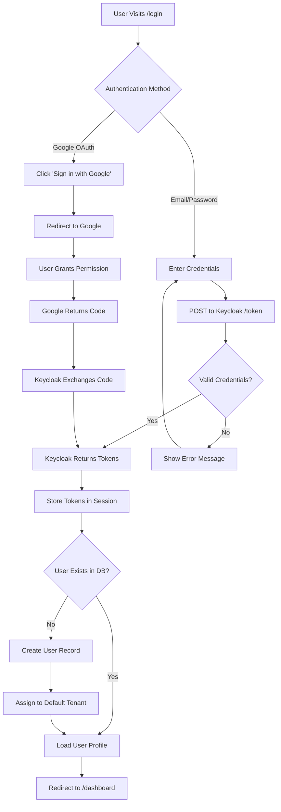
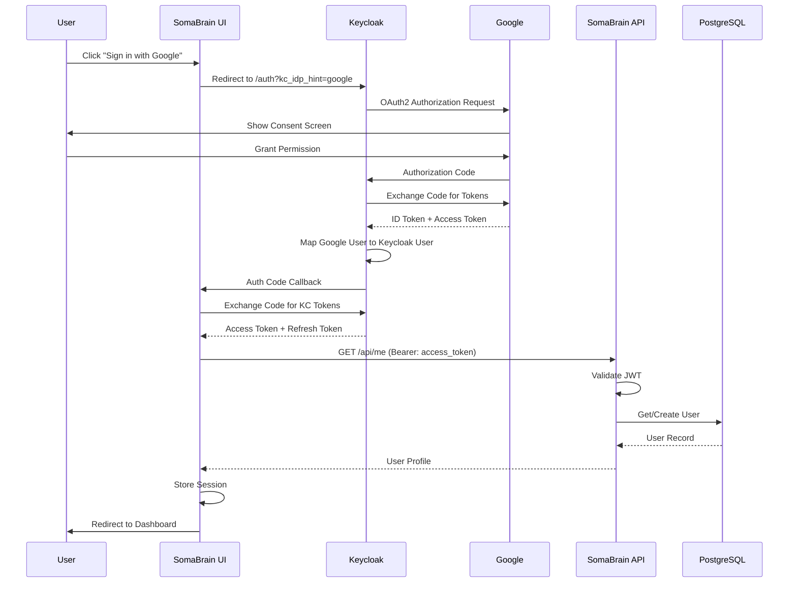
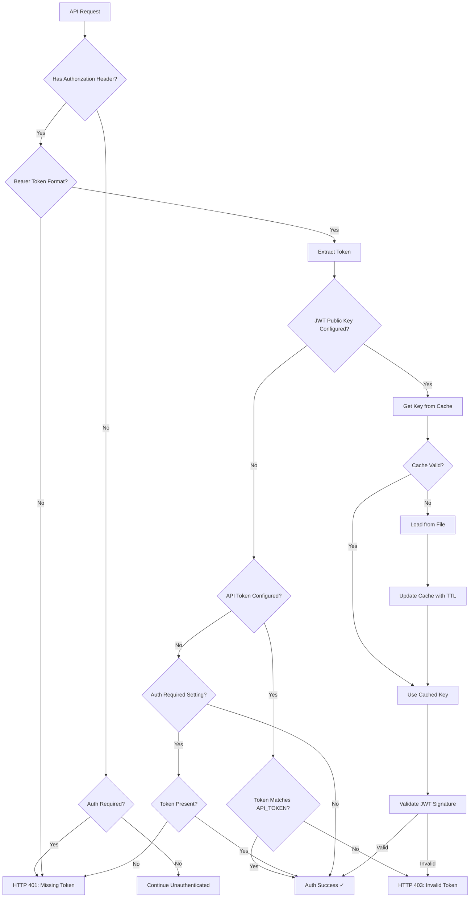

# SRS-03: Authentication & SSO Module

**Document Version:** 1.0.0  
**Date:** 2025-12-24  
**Standard:** ISO/IEC/IEEE 29148:2018 Compatible  
**Module:** Authentication & SSO Subsystem

---

## 1. Overview

The Authentication & SSO module provides secure authentication via Keycloak, Google OAuth, and JWT token validation for the SomaBrain AAAS platform.

### 1.1 Scope

| Component | Description |
|-----------|-------------|
| Keycloak | Identity Provider (IdP) |
| Google OAuth | Social login via Keycloak |
| JWT Validation | API token verification |
| User-Tenant Mapping | User assignment to tenants |

---

## 2. User Login Flow



---

## 3. Google OAuth Sequence Diagram



---

## 4. UML Component Diagram

```mermaid
flowchart TB
    subgraph External["External Identity Providers"]
        KC[Keycloak :20880]
        Google[Google OAuth]
    end
    
    subgraph SomaBrain["SomaBrain Platform"]
        subgraph Frontend["Frontend :5173"]
            Login[Login Page]
            Callback[/auth/callback]
        end
        
        subgraph Backend["Backend API"]
            Auth[auth.py]
            JWTCache[JWTKeyCache]
            Container[DI Container]
        end
        
        subgraph Data["Data Layer"]
            Redis[(Redis)]
            PG[(PostgreSQL)]
        end
    end
    
    Login -->|"kc_idp_hint=google"| KC
    KC -->|OAuth2| Google
    Google -->|Tokens| KC
    KC -->|Auth Code| Callback
    Callback -->|Exchange| KC
    KC -->|JWT| Frontend
    
    Frontend -->|Bearer Token| Auth
    Auth --> JWTCache
    JWTCache --> Container
    Auth -->|Verify| KC
    Auth -->|User Lookup| PG
    Auth -->|Tenant Resolve| Redis
```

---

## 5. JWT Validation Flow



---

## 6. Functional Requirements

| REQ-ID | Requirement | Priority | Status | Implementation |
|--------|-------------|----------|--------|----------------|
| REQ-AUTH-001 | Keycloak SSO integration | CRITICAL | ⚠️ PARTIAL | Config in settings.py |
| REQ-AUTH-002 | Google OAuth via Keycloak | HIGH | ⚠️ PARTIAL | Keycloak IDP configured |
| REQ-AUTH-003 | User-to-tenant assignment | CRITICAL | ⚠️ PARTIAL | Via X-Tenant-ID header |
| REQ-AUTH-004 | Role-based access (admin, member) | HIGH | ⚠️ PARTIAL | Basic roles in Keycloak |
| REQ-AUTH-005 | JWT validation for API requests | CRITICAL | ✅ EXISTS | `auth.py` require_auth() |
| REQ-AUTH-006 | JWT key caching with TTL | HIGH | ✅ EXISTS | `JWTKeyCache` class |
| REQ-AUTH-007 | Admin-only endpoint protection | HIGH | ✅ EXISTS | `require_admin_auth()` |
| REQ-AUTH-008 | Token refresh workflow | MEDIUM | ⚠️ PARTIAL | Keycloak handles |

---

## 7. Configuration Reference

```python
# Django settings.py - Authentication Configuration

# Keycloak SSO
KEYCLOAK_URL = "http://localhost:20880"
KEYCLOAK_REALM = "somabrain"
KEYCLOAK_CLIENT_ID = "somabrain-app"

# JWT Validation
SOMABRAIN_JWT_PUBLIC_KEY_PATH = "/path/to/jwt/public.pem"
SOMABRAIN_JWT_AUDIENCE = "somabrain-api"
SOMABRAIN_JWT_ISSUER = "http://localhost:20880/realms/somabrain"

# Google OAuth (via Keycloak)
GOOGLE_CLIENT_ID = "786567505985-46etdi4j46hocuo148a1bush1asiv0od.apps.googleusercontent.com"
GOOGLE_REDIRECT_URI = "http://localhost:5173/auth/callback"

# API Token (fallback)
SOMABRAIN_API_TOKEN = None  # Set for simple token auth
SOMABRAIN_AUTH_REQUIRED = True
```

---

## 8. Security Requirements

| NFR-ID | Requirement | Implementation |
|--------|-------------|----------------|
| NFR-SEC-001 | JWT keys rotated periodically | TTL-based cache (1 hour) |
| NFR-SEC-002 | No credentials in source code | Vault/ENV variables |
| NFR-SEC-003 | HTTPS for all auth endpoints | Keycloak SSL config |
| NFR-SEC-004 | Token validation on every request | `require_auth()` middleware |

---

## 9. Key Files

| File | Purpose | Lines |
|------|---------|-------|
| [auth.py](file:///Users/macbookpro201916i964gb1tb/Documents/GitHub/somabrain/somabrain/auth.py) | JWT validation, require_auth | 196 |
| [settings.py](file:///Users/macbookpro201916i964gb1tb/Documents/GitHub/somabrain/somabrain/settings.py) | Auth configuration | ~36970 |

---

*Document prepared by ALL 7 PERSONAS + Django Architect/Expert/Evangelist*
