# SRS-04: Administration - Eye of God (God Mode)

**Document Version:** 1.0.0  
**Date:** 2025-12-24  
**Standard:** ISO/IEC/IEEE 29148:2018 Compatible  
**Module:** Platform Administration Subsystem

---

## 1. Overview

The God Mode Administration module provides platform-level oversight, multi-tenant management, revenue dashboards, and audit capabilities for SomaBrain SaaS administrators.

### 1.1 Scope

| Component | Description |
|-----------|-------------|
| Platform Dashboard | Revenue, health, and tenant overview |
| Tenant Management | CRUD, suspension, impersonation |
| Audit Logging | All admin actions tracked |
| Django Admin | Model management interface |

---

## 2. God Mode Dashboard Layout

```mermaid
flowchart TB
    subgraph Header["Platform Header"]
        Logo[SomaBrain Logo]
        User[Admin Profile]
        Notifications[Alerts]
    end
    
    subgraph Sidebar["Navigation Sidebar"]
        Dashboard[📊 Dashboard]
        Tenants[🏢 Tenants]
        Billing[💳 Billing]
        Users[👥 Users]
        Audit[📋 Audit Log]
        Settings[⚙️ Settings]
    end
    
    subgraph Main["Dashboard Main Content"]
        subgraph MetricCards["Key Metrics Row"]
            MRR[MRR: $X,XXX]
            ActiveTenants[Active Tenants: N]
            APIRequests[API Req/Day: N]
            SystemHealth[Health: ✓]
        end
        
        subgraph Charts["Charts Row"]
            RevenueChart[Revenue Trend 30d]
            UsageChart[Usage by Tier]
        end
        
        subgraph Tables["Recent Activity"]
            RecentTenants[Recent Tenant Signups]
            RecentErrors[Recent Errors/Alerts]
        end
    end
```



---

## 3. God Mode Operations Flowchart

```mermaid
flowchart TD
    A[God Mode Admin Login] --> B{Action Type}
    
    B -->|View Tenants| C[GET /api/admin/tenants]
    C --> D[Display Tenant List]
    D --> E[Filter by Tier/Status]
    
    B -->|Create Tenant| F[POST /api/admin/tenants]
    F --> G[TenantManager.create_tenant]
    G --> H[Lago: Create Customer]
    H --> I[Send Welcome Email]
    I --> J[Log Audit Event]
    
    B -->|Suspend Tenant| K[PUT /api/admin/tenants/{id}/suspend]
    K --> L[TenantManager.suspend_tenant]
    L --> M[Lago: Cancel Subscription]
    M --> N[Notify Tenant Admin]
    N --> J
    
    B -->|Delete Tenant| O[DELETE /api/admin/tenants/{id}]
    O --> P{Is System Tenant?}
    P -->|Yes| Q[Reject: 403]
    P -->|No| R[TenantManager.delete_tenant]
    R --> S[Lago: Delete Customer]
    S --> T[GDPR Data Export?]
    T --> J
    
    B -->|View Audit Log| U[GET /api/admin/audit]
    U --> V[Display Audit Entries]
    
    B -->|Impersonate| W[POST /api/admin/impersonate/{id}]
    W --> X[Generate Temp Token]
    X --> Y[Log Impersonation Start]
    Y --> Z[Redirect to Tenant View]
```

---

## 4. Audit Flow Sequence Diagram


---

## 5. UML Component Diagram


---

## 6. Django Admin Integration


---

## 7. Functional Requirements

| REQ-ID | Requirement | Priority | Status | Implementation |
|--------|-------------|----------|--------|----------------|
| REQ-ADMIN-001 | View all tenants with subscription status | CRITICAL | ⚠️ PARTIAL | TenantManager.list_tenants() |
| REQ-ADMIN-002 | Revenue dashboard (MRR, ARR, churn) | HIGH | ❌ MISSING | Requires Lago integration |
| REQ-ADMIN-003 | Create/suspend/delete tenants | HIGH | ✅ EXISTS | TenantManager methods |
| REQ-ADMIN-004 | Override subscription tier manually | MEDIUM | ❌ MISSING | Requires billing models |
| REQ-ADMIN-005 | View aggregated usage metrics | HIGH | ⚠️ PARTIAL | TokenLedger exists |
| REQ-ADMIN-006 | Audit log of all billing events | HIGH | ✅ EXISTS | audit.py + outbox |
| REQ-ADMIN-007 | Tenant impersonation capability | MEDIUM | ❌ MISSING | Requires special tokens |
| REQ-ADMIN-008 | Django Admin for model management | HIGH | ✅ EXISTS | admin.py configured |

---

## 8. Audit Event Schema

```json
{
  "event_id": "uuid-string",
  "ts": 1703419200.0,
  "schema_version": "audit_event_v1",
  "type": "admin_action",
  "path": "/api/admin/tenants",
  "method": "POST",
  "client": "192.168.1.1",
  "action": "create_tenant",
  "details": {
    "tenant_id": "tenant_xxx",
    "display_name": "Acme Corp",
    "tier": "pro"
  }
}
```

---

## 9. Security Requirements

| NFR-ID | Requirement | Implementation |
|--------|-------------|----------------|
| NFR-ADM-001 | God Mode requires admin JWT role | `require_admin_auth()` |
| NFR-ADM-002 | Sensitive data never logged | `_sanitize_event()` masks tokens |
| NFR-ADM-003 | All admin actions audited | `log_admin_action()` |
| NFR-ADM-004 | Impersonation logged with reason | Audit event type |

---

## 10. Key Files

| File | Purpose | Lines |
|------|---------|-------|
| [admin.py](file:///Users/macbookpro201916i964gb1tb/Documents/GitHub/somabrain/somabrain/admin.py) | Django admin configuration | 82 |
| [audit.py](file:///Users/macbookpro201916i964gb1tb/Documents/GitHub/somabrain/somabrain/audit.py) | Audit logging via outbox | 211 |
| [tenant_manager.py](file:///Users/macbookpro201916i964gb1tb/Documents/GitHub/somabrain/somabrain/tenant_manager.py) | Tenant CRUD operations | 408 |

---

*Document prepared by ALL 7 PERSONAS + Django Architect/Expert/Evangelist*
