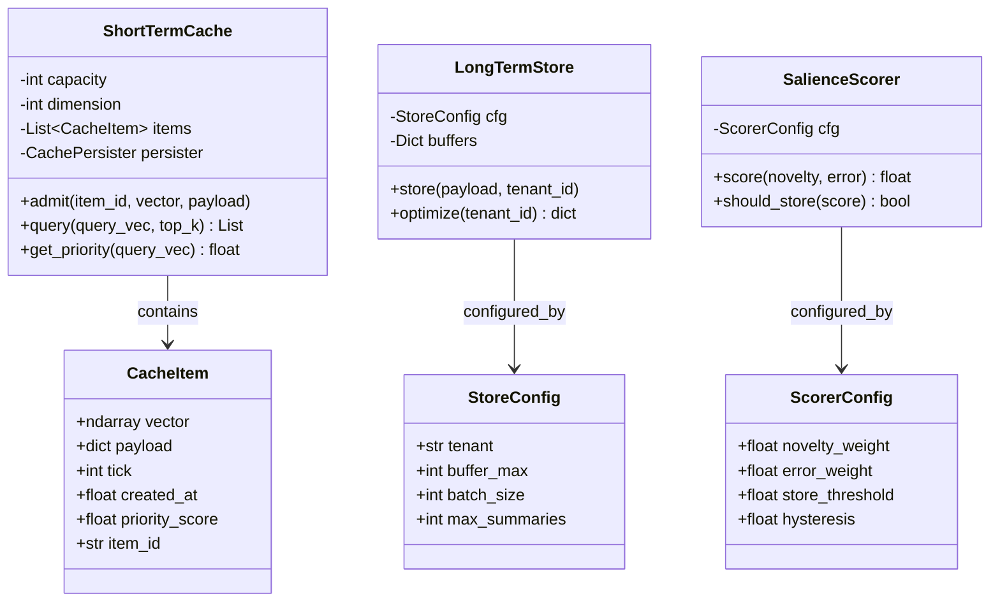
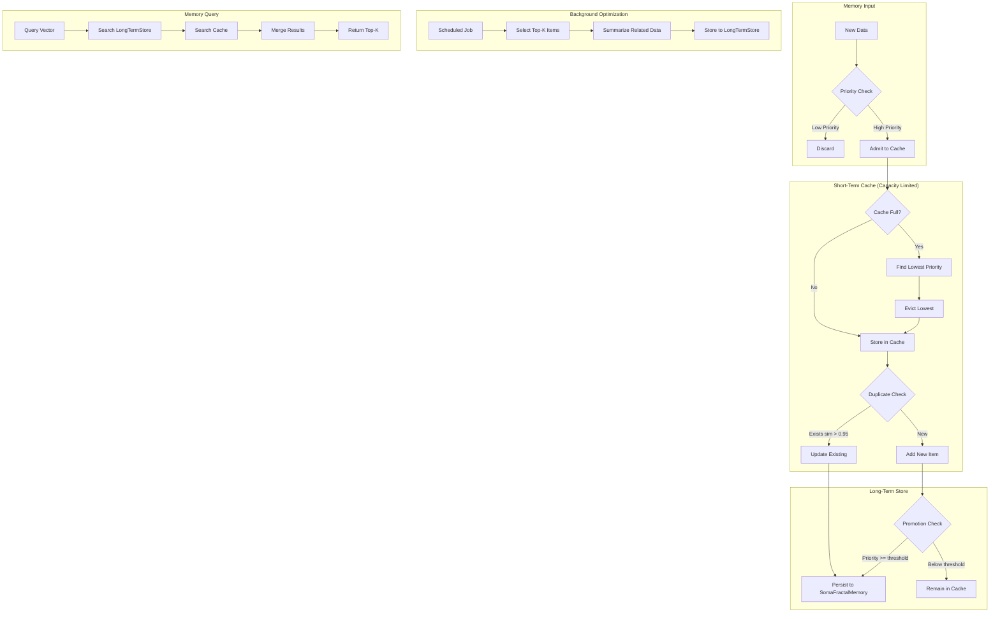
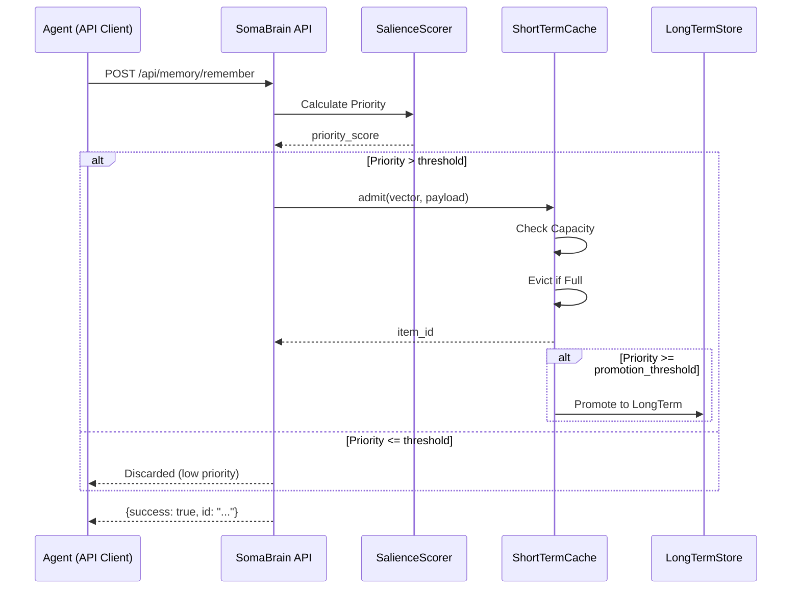
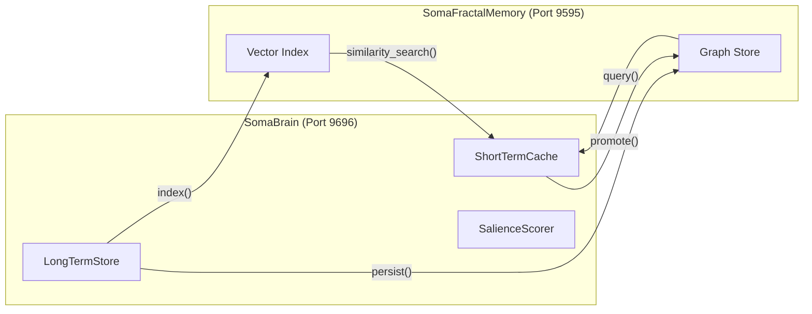

# SRS-05: Memory Management System

**Document Version:** 2.0.0  
**Date:** 2025-12-24  
**Standard:** ISO/IEC/IEEE 29148:2018 Compatible  
**Module:** Memory Management Subsystem

---

## 1. Overview

SomaBrain provides a **memory storage and retrieval system** for AI agents. Agents use SomaBrain as their memory backend, similar to how applications use databases.

### 1.1 Scope

| Component | Description |
|-----------|-------------|
| ShortTermCache | Fast, capacity-limited buffer |
| LongTermStore | Persistent vector storage |
| SalienceScorer | Priority scoring algorithm |
| ConsolidationService | Background data optimization |

---

## 2. Memory Architecture UML Class Diagram

---

## 3. Memory Lifecycle Flowchart

---

## 4. Store Sequence Diagram

---

## 5. SomaBrain ↔ SomaFractalMemory Integration

---

## 6. Functional Requirements

| REQ-ID | Requirement | Priority | Status | Implementation |
|--------|-------------|----------|--------|----------------|
| REQ-MEM-001 | Short-term cache with configurable capacity | HIGH | ✅ EXISTS | `ShortTermCache` |
| REQ-MEM-002 | Priority-based eviction when cache full | HIGH | ✅ EXISTS | `eviction.py` |
| REQ-MEM-003 | Duplicate detection (similarity > 0.95) | HIGH | ✅ EXISTS | `_find_duplicate()` |
| REQ-MEM-004 | Cache → LongTerm promotion | HIGH | ✅ EXISTS | `promotion.py` |
| REQ-MEM-005 | Background data optimization | MEDIUM | ✅ EXISTS | `ConsolidationService` |
| REQ-MEM-006 | Per-tenant data isolation | CRITICAL | ✅ EXISTS | All ops take tenant_id |
| REQ-MEM-007 | Vector normalization (unit-norm) | HIGH | ✅ EXISTS | Dimension enforcement |
| REQ-MEM-008 | Cache persistence to disk | MEDIUM | ✅ EXISTS | `CachePersister` |

---

## 7. Key Files

| File | Purpose | Lines |
|------|---------|-------|
| [wm.py](file:///Users/macbookpro201916i964gb1tb/Documents/GitHub/somabrain/somabrain/wm.py) | Short-term cache | 546 |
| [memory/](file:///Users/macbookpro201916i964gb1tb/Documents/GitHub/somabrain/somabrain/memory/) | Memory subsystem (22 files) | ~150k |

---

*SomaBrain: Memory System for AI Agents*
