# SRS-01: Multi-Tenancy Module

**Document Version:** 1.0.0  
**Date:** 2025-12-24  
**Standard:** ISO/IEC/IEEE 29148:2018 Compatible  
**Module:** Multi-Tenancy Subsystem

---

## 1. Overview

The Multi-Tenancy module provides complete tenant isolation, lifecycle management, and quota enforcement for the SomaBrain AAAS platform.

### 1.1 Scope

| Component | Description |
|-----------|-------------|
| TenantRegistry | UUID-based tenant storage in Redis |
| TenantManager | High-level tenant operations |
| TenantContext | Request-scoped tenant resolution |
| QuotaManager | Per-tenant write quotas |

---

## 2. UML Class Diagram

---

## 3. Tenant Lifecycle Flowchart

---

## 4. Tenant Resolution Sequence Diagram

---

## 5. Tenant Onboarding Flow (God Mode)

```mermaid
flowchart TD
    A[God Mode Admin] --> B[Login via Keycloak]
    B --> C[Navigate to /platform/tenants]
    C --> D[Click 'Create Tenant']
    D --> E[Enter Tenant Details Form]
    
    subgraph Form["Tenant Creation Form"]
        E --> F[Display Name]
        F --> G[Select Tier: Free/Starter/Pro/Enterprise]
        G --> H[Configure Quota Limits]
        H --> I[Set Expiration if temporary]
        I --> J[Mark as Exempt? Why?]
    end
    
    J --> K[POST /api/v1/admin/tenants]
    K --> L[TenantManager.create_tenant]
    L --> M[TenantRegistry.register_tenant]
    M --> N[Store in Redis]
    N --> O[Sync to Lago as Customer]
    O --> P[Create Initial Admin User]
    P --> Q[Send Welcome Email]
    Q --> R[Tenant ACTIVE ✓]
```

---

## 6. Functional Requirements

| REQ-ID | Requirement | Priority | Status | Source |
|--------|-------------|----------|--------|--------|
| REQ-MT-001 | All data MUST be isolated by `tenant_id` | CRITICAL | ✅ EXISTS | `models.py` - all models have tenant_id |
| REQ-MT-002 | Tenant CRUD via Admin API | HIGH | ✅ EXISTS | `tenant_manager.py` lines 156-241 |
| REQ-MT-003 | Tenant metadata (name, contact, billing_email) | HIGH | ⚠️ PARTIAL | `TenantMetadata` lacks billing_email |
| REQ-MT-004 | Tenant suspension/activation capability | HIGH | ✅ EXISTS | `suspend_tenant()`, `activate_tenant()` |
| REQ-MT-005 | Tenant soft-delete with data retention policy | MEDIUM | ⚠️ PARTIAL | Hard delete exists, soft-delete missing |
| REQ-MT-006 | UUID-based tenant ID generation | HIGH | ✅ EXISTS | `_generate_dynamic_tenant_id()` |
| REQ-MT-007 | Tenant expiration and auto-cleanup | MEDIUM | ✅ EXISTS | `cleanup_expired_tenants()` |
| REQ-MT-008 | System tenant exemption from quotas | HIGH | ✅ EXISTS | `is_exempt()` method |
| REQ-MT-009 | Tenant activity tracking | MEDIUM | ✅ EXISTS | `update_tenant_activity()` |
| REQ-MT-010 | Audit logging for all tenant operations | HIGH | ✅ EXISTS | `_audit_log()` in registry |

---

## 7. System Tenant Configuration

---

## 8. Non-Functional Requirements

| NFR-ID | Requirement | Target | Implementation |
|--------|-------------|--------|----------------|
| NFR-MT-001 | Tenant resolution < 5ms | Latency | Redis cache lookup |
| NFR-MT-002 | Support 10,000+ concurrent tenants | Scalability | Redis + in-memory cache |
| NFR-MT-003 | Tenant data isolation at DB level | Security | All queries filtered by tenant_id |
| NFR-MT-004 | Audit log retention 7 years | Compliance | Redis LTRIM to 1000 entries/day |

---

## 9. Key Files Reference

| File | Purpose | Lines |
|------|---------|-------|
| [tenant.py](file:///Users/macbookpro201916i964gb1tb/Documents/GitHub/somabrain/somabrain/tenant.py) | TenantContext helper | 51 |
| [tenant_manager.py](file:///Users/macbookpro201916i964gb1tb/Documents/GitHub/somabrain/somabrain/tenant_manager.py) | High-level tenant operations | 408 |
| [tenant_registry.py](file:///Users/macbookpro201916i964gb1tb/Documents/GitHub/somabrain/somabrain/tenant_registry.py) | Redis-backed tenant storage | 500 |
| [tenant_types.py](file:///Users/macbookpro201916i964gb1tb/Documents/GitHub/somabrain/somabrain/tenant_types.py) | TenantTier, TenantStatus, TenantMetadata | ~60 |
| [tenant_validation.py](file:///Users/macbookpro201916i964gb1tb/Documents/GitHub/somabrain/somabrain/tenant_validation.py) | ID validation and normalization | ~100 |

---

*Document prepared by ALL 7 PERSONAS: 🎓 PhD Developer, 🔍 PhD Analyst, ✅ PhD QA, 📚 ISO Documenter, 🔒 Security Auditor, ⚡ Performance Engineer, 🎨 UX Consultant + Django Architect/Expert/Evangelist*
