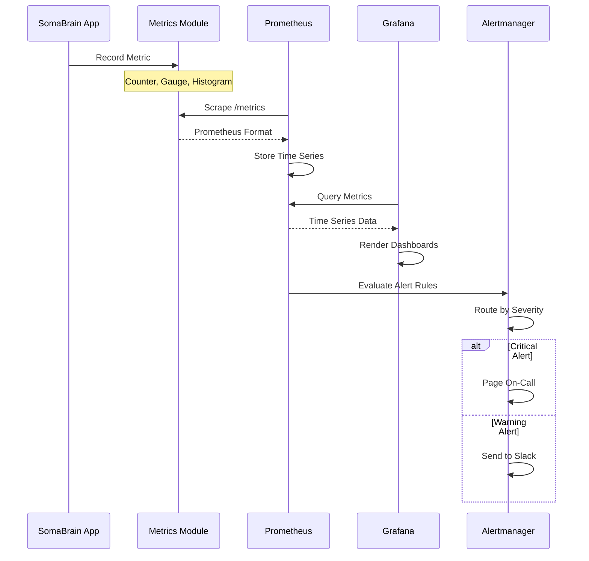
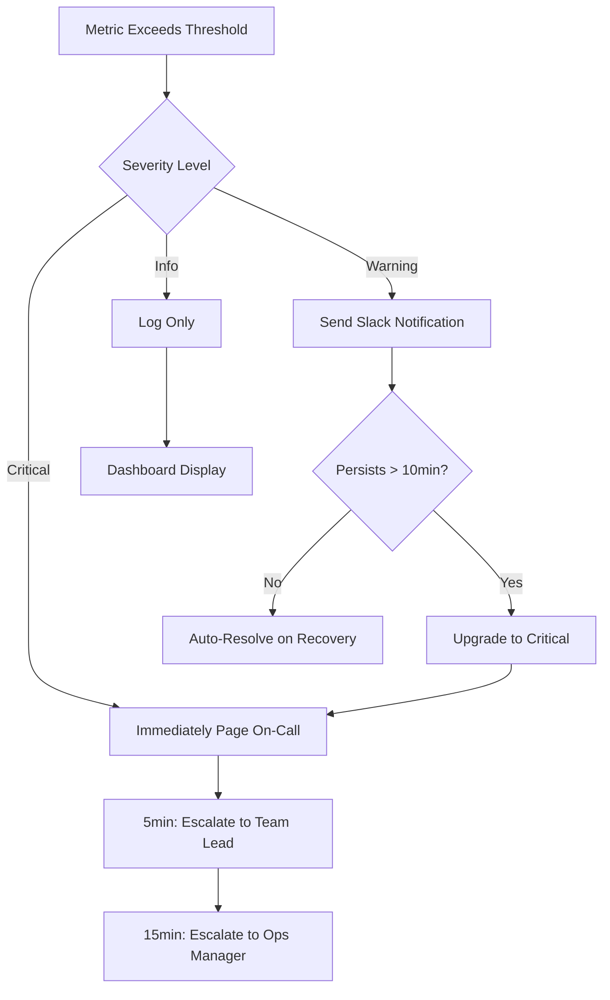

# SRS-07: Observability & Monitoring

**Document Version:** 1.0.0  
**Date:** 2025-12-24  
**Standard:** ISO/IEC/IEEE 29148:2018 Compatible  
**Module:** Observability Subsystem

---

## 1. Overview

The Observability module provides health checks, metrics collection, logging, and alerting for the SomaBrain SaaS platform.

### 1.1 Scope

| Component | Description |
|-----------|-------------|
| Health Checks | Liveness/readiness probes |
| Metrics | Prometheus-compatible metrics |
| Logging | Structured logging |
| Alerting | Alert rules and escalation |

---

## 2. Health Check Architecture

```mermaid
flowchart TB
    subgraph External["External Probes"]
        K8s[Kubernetes]
        LB[Load Balancer]
        Monitor[Monitoring System]
    end
    
    subgraph SomaBrain["SomaBrain Health Endpoints"]
        Liveness[/health/live]
        Readiness[/health/ready]
        Detailed[/health/detailed]
    end
    
    subgraph Checks["Health Checks"]
        DB[(PostgreSQL)]
        Redis[(Redis)]
        Lago[Lago API]
        Milvus[Milvus Vector]
        SFM[SomaFractalMemory]
    end
    
    K8s -->|Every 10s| Liveness
    K8s -->|Every 30s| Readiness
    LB -->|Every 5s| Liveness
    Monitor -->|Every 60s| Detailed
    
    Liveness --> DB
    Readiness --> DB
    Readiness --> Redis
    Readiness --> Milvus
    Detailed --> DB
    Detailed --> Redis
    Detailed --> Lago
    Detailed --> Milvus
    Detailed --> SFM
```

---

## 3. Metrics Collection Flow



---

## 4. Alert Escalation Flowchart



---

## 5. Key Metrics

| Metric | Type | Description |
|--------|------|-------------|
| `somabrain_api_requests_total` | Counter | Total API requests |
| `somabrain_api_latency_seconds` | Histogram | Request latency |
| `somabrain_memory_ops_total` | Counter | Memory operations |
| `somabrain_wm_items` | Gauge | Working memory item count |
| `somabrain_tenant_quota_remaining` | Gauge | Remaining quota per tenant |
| `somabrain_health_status` | Gauge | 1=healthy, 0=unhealthy |

---

## 6. Functional Requirements

| REQ-ID | Requirement | Priority | Status |
|--------|-------------|----------|--------|
| REQ-OBS-001 | Liveness probe endpoint | HIGH | ✅ EXISTS |
| REQ-OBS-002 | Readiness probe endpoint | HIGH | ✅ EXISTS |
| REQ-OBS-003 | Prometheus metrics endpoint | HIGH | ✅ EXISTS |
| REQ-OBS-004 | Structured JSON logging | MEDIUM | ✅ EXISTS |
| REQ-OBS-005 | Alert rules configuration | MEDIUM | ✅ EXISTS |

---

## 7. Key Files

| File | Purpose |
|------|---------|
| [healthchecks.py](file:///Users/macbookpro201916i964gb1tb/Documents/GitHub/somabrain/somabrain/healthchecks.py) | Health endpoints |
| [health/](file:///Users/macbookpro201916i964gb1tb/Documents/GitHub/somabrain/somabrain/health/) | Health module |
| [metrics/](file:///Users/macbookpro201916i964gb1tb/Documents/GitHub/somabrain/somabrain/metrics/) | Metrics (22 files) |
| [alerts.yml](file:///Users/macbookpro201916i964gb1tb/Documents/GitHub/somabrain/alerts.yml) | Prometheus alerts |

---

*Document prepared by ALL 7 PERSONAS + Django Architect/Expert/Evangelist*
