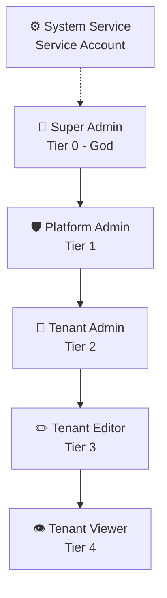

# SRS: Complete Permission Matrix

**Document Version:** 1.0.0  
**Date:** 2025-12-24  
**Standard:** ISO/IEC/IEEE 29148:2018 Compatible  
**Module:** Role-Based Access Control (RBAC)

---

## 1. Role Definitions

### 1.1 Role Hierarchy



### 1.2 Role Details

| Role | Tier | Scope | Description |
|------|:----:|-------|-------------|
| **Super Admin** | 0 | Platform | Full control over entire platform. Can delete tenants, modify server settings. |
| **Platform Admin** | 1 | Platform | Manage tenants, view billing, impersonate. Cannot delete tenants or modify core settings. |
| **Tenant Admin** | 2 | Tenant | Manage own tenant: users, settings, billing, API keys. |
| **Tenant Editor** | 3 | Tenant | Perform memory operations, view stats. Cannot manage users or settings. |
| **Tenant Viewer** | 4 | Tenant | Read-only access to memories and stats. |
| **System Service** | - | Internal | Machine-to-machine access for internal services. |

---

## 2. Complete Permission Matrix

### 2.1 Platform Management Operations

| Operation | Super Admin | Platform Admin | Tenant Admin | Tenant Editor | Tenant Viewer | System |
|-----------|:-----------:|:--------------:|:------------:|:-------------:|:-------------:|:------:|
| **TENANT CRUD** |||||||
| List all tenants | ✅ | ✅ | ❌ | ❌ | ❌ | ✅ |
| View any tenant details | ✅ | ✅ | ❌ | ❌ | ❌ | ✅ |
| Create new tenant | ✅ | ✅ | ❌ | ❌ | ❌ | ✅ |
| Update any tenant | ✅ | ✅ | ❌ | ❌ | ❌ | ❌ |
| Suspend tenant | ✅ | ✅ | ❌ | ❌ | ❌ | ✅ |
| Activate tenant | ✅ | ✅ | ❌ | ❌ | ❌ | ✅ |
| Delete tenant (hard) | ✅ | ❌ | ❌ | ❌ | ❌ | ❌ |
| **IMPERSONATION** |||||||
| Impersonate any tenant | ✅ | ✅ | ❌ | ❌ | ❌ | ❌ |
| Exit impersonation | ✅ | ✅ | ❌ | ❌ | ❌ | ❌ |
| **BILLING (PLATFORM)** |||||||
| View MRR/ARR dashboard | ✅ | ✅ | ❌ | ❌ | ❌ | ❌ |
| View all invoices | ✅ | ✅ | ❌ | ❌ | ❌ | ❌ |
| Override subscription tier | ✅ | ✅ | ❌ | ❌ | ❌ | ❌ |
| Apply credits/discounts | ✅ | ❌ | ❌ | ❌ | ❌ | ❌ |
| **SERVER SETTINGS** |||||||
| View server settings | ✅ | ✅ | ❌ | ❌ | ❌ | ✅ |
| Modify runtime settings | ✅ | ❌ | ❌ | ❌ | ❌ | ❌ |
| Modify static settings | ✅ | ❌ | ❌ | ❌ | ❌ | ❌ |
| Toggle kill switch | ✅ | ❌ | ❌ | ❌ | ❌ | ❌ |
| **SYSTEM OPERATIONS** |||||||
| View service health | ✅ | ✅ | ❌ | ❌ | ❌ | ✅ |
| Restart services | ✅ | ❌ | ❌ | ❌ | ❌ | ❌ |
| View Prometheus metrics | ✅ | ✅ | ❌ | ❌ | ❌ | ✅ |
| View deployment config | ✅ | ✅ | ❌ | ❌ | ❌ | ✅ |
| Trigger backup | ✅ | ❌ | ❌ | ❌ | ❌ | ✅ |
| **PLATFORM AUDIT** |||||||
| View platform audit log | ✅ | ✅ | ❌ | ❌ | ❌ | ✅ |
| Export platform audit | ✅ | ✅ | ❌ | ❌ | ❌ | ❌ |
| Purge old audit logs | ✅ | ❌ | ❌ | ❌ | ❌ | ❌ |
| **PLATFORM USERS** |||||||
| List platform admins | ✅ | ✅ | ❌ | ❌ | ❌ | ❌ |
| Add platform admin | ✅ | ❌ | ❌ | ❌ | ❌ | ❌ |
| Remove platform admin | ✅ | ❌ | ❌ | ❌ | ❌ | ❌ |

---

### 2.2 Tenant-Scoped Operations

| Operation | Super Admin | Platform Admin | Tenant Admin | Tenant Editor | Tenant Viewer | System |
|-----------|:-----------:|:--------------:|:------------:|:-------------:|:-------------:|:------:|
| **TENANT SETTINGS** |||||||
| View own tenant info | ✅ | ✅ | ✅ | ✅ | ✅ | ✅ |
| Edit tenant name/metadata | ✅ | ✅ | ✅ | ❌ | ❌ | ❌ |
| Configure integrations | ✅ | ✅ | ✅ | ❌ | ❌ | ❌ |
| **USER MANAGEMENT** |||||||
| List tenant users | ✅ | ✅ | ✅ | ❌ | ❌ | ❌ |
| Invite new user | ✅ | ✅ | ✅ | ❌ | ❌ | ❌ |
| Remove user | ✅ | ✅ | ✅ | ❌ | ❌ | ❌ |
| Assign user roles | ✅ | ✅ | ✅ | ❌ | ❌ | ❌ |
| View user activity | ✅ | ✅ | ✅ | ❌ | ❌ | ❌ |
| **SUBSCRIPTION (TENANT)** |||||||
| View current subscription | ✅ | ✅ | ✅ | ✅ | ✅ | ✅ |
| View usage stats | ✅ | ✅ | ✅ | ✅ | ✅ | ✅ |
| Request upgrade | ✅ | ✅ | ✅ | ❌ | ❌ | ❌ |
| Request downgrade | ✅ | ✅ | ✅ | ❌ | ❌ | ❌ |
| View tenant invoices | ✅ | ✅ | ✅ | ❌ | ❌ | ❌ |
| Update payment method | ✅ | ✅ | ✅ | ❌ | ❌ | ❌ |
| **API KEY MANAGEMENT** |||||||
| List API keys | ✅ | ✅ | ✅ | ✅ | ❌ | ❌ |
| Create API key | ✅ | ✅ | ✅ | ❌ | ❌ | ❌ |
| Revoke API key | ✅ | ✅ | ✅ | ❌ | ❌ | ❌ |
| View API key stats | ✅ | ✅ | ✅ | ✅ | ❌ | ❌ |
| **TENANT AUDIT** |||||||
| View tenant audit log | ✅ | ✅ | ✅ | ✅ | ✅ | ✅ |
| Export tenant audit | ✅ | ✅ | ✅ | ❌ | ❌ | ❌ |
| Filter/search audit | ✅ | ✅ | ✅ | ✅ | ✅ | ✅ |

---

### 2.3 Memory Operations (SomaBrain + SomaFractalMemory)

| Operation | Super Admin | Platform Admin | Tenant Admin | Tenant Editor | Tenant Viewer | System |
|-----------|:-----------:|:--------------:|:------------:|:-------------:|:-------------:|:------:|
| **STORE OPERATIONS** |||||||
| Store memory | ✅ | ✅ | ✅ | ✅ | ❌ | ✅ |
| Batch store | ✅ | ✅ | ✅ | ❌ | ❌ | ✅ |
| Import memories | ✅ | ✅ | ✅ | ❌ | ❌ | ✅ |
| **RECALL OPERATIONS** |||||||
| Recall by coordinate | ✅ | ✅ | ✅ | ✅ | ✅ | ✅ |
| Recall by query | ✅ | ✅ | ✅ | ✅ | ✅ | ✅ |
| Vector similarity search | ✅ | ✅ | ✅ | ✅ | ✅ | ✅ |
| Batch recall | ✅ | ✅ | ✅ | ✅ | ✅ | ✅ |
| **DELETE OPERATIONS** |||||||
| Delete single memory | ✅ | ✅ | ✅ | ✅ | ❌ | ✅ |
| Batch delete | ✅ | ✅ | ✅ | ❌ | ❌ | ✅ |
| Purge all (tenant) | ✅ | ✅ | ✅ | ❌ | ❌ | ❌ |
| Purge all (platform) | ✅ | ❌ | ❌ | ❌ | ❌ | ❌ |
| **GRAPH OPERATIONS** |||||||
| Create graph link | ✅ | ✅ | ✅ | ✅ | ❌ | ✅ |
| Delete graph link | ✅ | ✅ | ✅ | ✅ | ❌ | ✅ |
| Query neighbors | ✅ | ✅ | ✅ | ✅ | ✅ | ✅ |
| Find path | ✅ | ✅ | ✅ | ✅ | ✅ | ✅ |
| **MEMORY BROWSING** |||||||
| Browse LTM | ✅ | ✅ | ✅ | ✅ | ✅ | ✅ |
| Browse graph | ✅ | ✅ | ✅ | ✅ | ✅ | ✅ |
| View memory details | ✅ | ✅ | ✅ | ✅ | ✅ | ✅ |
| Edit memory metadata | ✅ | ✅ | ✅ | ✅ | ❌ | ✅ |
| **STATISTICS** |||||||
| View memory stats | ✅ | ✅ | ✅ | ✅ | ✅ | ✅ |
| View cache stats | ✅ | ✅ | ✅ | ✅ | ✅ | ✅ |
| Export statistics | ✅ | ✅ | ✅ | ❌ | ❌ | ✅ |

---

## 3. Permission Enforcement Points

### 3.1 API Endpoints

| Endpoint Pattern | Required Permission |
|------------------|---------------------|
| `GET /api/admin/tenants` | `platform.tenants.list` |
| `POST /api/admin/tenants` | `platform.tenants.create` |
| `DELETE /api/admin/tenants/{id}` | `platform.tenants.delete` |
| `POST /api/admin/tenants/{id}/suspend` | `platform.tenants.suspend` |
| `POST /api/admin/impersonate/{id}` | `platform.impersonate` |
| `GET /api/admin/settings` | `platform.settings.view` |
| `PATCH /api/admin/settings` | `platform.settings.modify` |
| `GET /api/memory/` | `memory.recall` |
| `POST /api/memory/` | `memory.store` |
| `DELETE /api/memory/{coord}` | `memory.delete` |
| `GET /api/graph/neighbors` | `graph.query` |
| `POST /api/graph/link` | `graph.create` |

### 3.2 UI Screen Access

| Screen | Required Role |
|--------|---------------|
| `/platform` | Platform Admin+ |
| `/platform/tenants` | Platform Admin+ |
| `/platform/tenants/:id` | Platform Admin+ |
| `/platform/settings` | Super Admin |
| `/platform/billing` | Platform Admin+ |
| `/platform/audit` | Platform Admin+ |
| `/app/memory` | Tenant Viewer+ |
| `/app/memory/store` | Tenant Editor+ |
| `/app/settings` | Tenant Admin |
| `/app/users` | Tenant Admin |
| `/app/billing` | Tenant Admin |
| `/app/api-keys` | Tenant Admin |

---

## 4. SpiceDB Schema (Proposed)

```
definition user {}

definition tenant {
    relation admin: user
    relation editor: user
    relation viewer: user
    
    permission view = admin + editor + viewer
    permission edit = admin + editor
    permission manage = admin
}

definition platform {
    relation super_admin: user
    relation platform_admin: user
    
    permission manage_all = super_admin
    permission manage_tenants = super_admin + platform_admin
    permission view_billing = super_admin + platform_admin
    permission impersonate = super_admin + platform_admin
    permission modify_settings = super_admin
}

definition memory {
    relation tenant: tenant
    
    permission store = tenant->edit
    permission recall = tenant->view
    permission delete = tenant->edit
}
```

---

## 5. Permission Count Summary

| Category | Permission Count |
|----------|:----------------:|
| Platform Management | 15 |
| Tenant Management | 12 |
| Memory Operations | 18 |
| API Key Management | 4 |
| Audit Operations | 6 |
| **TOTAL** | **55** |

---

*SomaBrain AAAS - Complete Permission Matrix*
