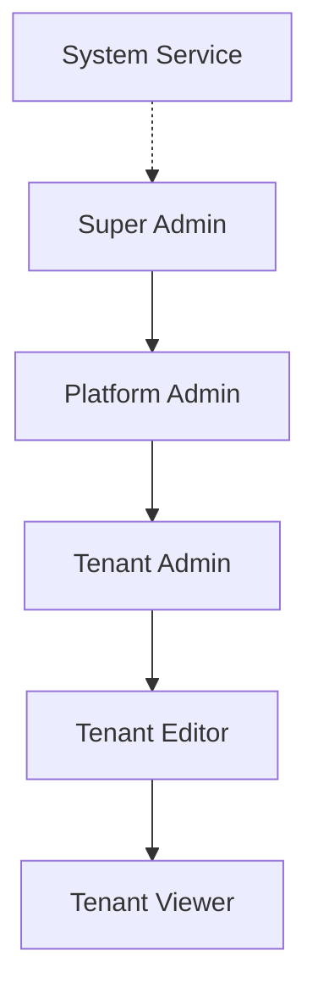

# SRS-08: Platform Administration - Complete Specification

**Document Version:** 1.0.0  
**Date:** 2025-12-24  
**Standard:** ISO/IEC/IEEE 29148:2018 Compatible  
**Module:** Complete Platform Administration

---

## 1. Overview

This document provides **exhaustive** specification of every server setting, metric, deployment mode, permission, and role in the SomaBrain platform.

---

## 2. Roles & Permissions Matrix

### 2.1 Role Hierarchy

### 2.2 Complete Permissions Matrix

| Permission | Super Admin | Platform Admin | Tenant Admin | Tenant Editor | Tenant Viewer | System |
|------------|:-----------:|:--------------:|:------------:|:-------------:|:-------------:|:------:|
| **PLATFORM MANAGEMENT** |||||
| View all tenants | ✓ | ✓ | ✗ | ✗ | ✗ | ✓ |
| Create tenant | ✓ | ✓ | ✗ | ✗ | ✗ | ✓ |
| Suspend tenant | ✓ | ✓ | ✗ | ✗ | ✗ | ✓ |
| Delete tenant | ✓ | ✗ | ✗ | ✗ | ✗ | ✗ |
| Impersonate tenant | ✓ | ✓ | ✗ | ✗ | ✗ | ✗ |
| View revenue/billing | ✓ | ✓ | ✗ | ✗ | ✗ | ✗ |
| Modify subscription tier | ✓ | ✓ | ✗ | ✗ | ✗ | ✗ |
| Override quotas | ✓ | ✓ | ✗ | ✗ | ✗ | ✗ |
| **SERVER SETTINGS** |||||
| View server settings | ✓ | ✓ | ✗ | ✗ | ✗ | ✓ |
| Modify server settings | ✓ | ✗ | ✗ | ✗ | ✗ | ✗ |
| View deployment config | ✓ | ✓ | ✗ | ✗ | ✗ | ✓ |
| Restart services | ✓ | ✗ | ✗ | ✗ | ✗ | ✗ |
| View system metrics | ✓ | ✓ | ✗ | ✗ | ✗ | ✓ |
| Access health endpoints | ✓ | ✓ | ✗ | ✗ | ✗ | ✓ |
| **TENANT MANAGEMENT** |||||
| View own tenant | ✓ | ✓ | ✓ | ✓ | ✓ | ✓ |
| Edit tenant settings | ✓ | ✓ | ✓ | ✗ | ✗ | ✗ |
| Invite users | ✓ | ✓ | ✓ | ✗ | ✗ | ✗ |
| Remove users | ✓ | ✓ | ✓ | ✗ | ✗ | ✗ |
| Assign roles | ✓ | ✓ | ✓ | ✗ | ✗ | ✗ |
| View billing | ✓ | ✓ | ✓ | ✗ | ✗ | ✗ |
| Change subscription | ✓ | ✓ | ✓ | ✗ | ✗ | ✗ |
| **MEMORY OPERATIONS** |||||
| Store memory | ✓ | ✓ | ✓ | ✓ | ✗ | ✓ |
| Recall memory | ✓ | ✓ | ✓ | ✓ | ✓ | ✓ |
| Delete memory | ✓ | ✓ | ✓ | ✓ | ✗ | ✓ |
| Bulk operations | ✓ | ✓ | ✓ | ✗ | ✗ | ✓ |
| View usage stats | ✓ | ✓ | ✓ | ✓ | ✓ | ✓ |
| **API ACCESS** |||||
| View API keys | ✓ | ✓ | ✓ | ✓ | ✗ | ✗ |
| Create API keys | ✓ | ✓ | ✓ | ✗ | ✗ | ✗ |
| Revoke API keys | ✓ | ✓ | ✓ | ✗ | ✗ | ✗ |
| **AUDIT** |||||
| View tenant audit | ✓ | ✓ | ✓ | ✓ | ✓ | ✓ |
| View platform audit | ✓ | ✓ | ✗ | ✗ | ✗ | ✓ |
| Export audit logs | ✓ | ✓ | ✓ | ✗ | ✗ | ✗ |

---

## 3. Server Settings - Complete Catalog

### 3.1 Core Settings

| Setting | Type | Default | Description | Editable at Runtime |
|---------|------|---------|-------------|:-------------------:|
| `SOMABRAIN_LOG_LEVEL` | enum | `INFO` | Log verbosity: DEBUG, INFO, WARNING, ERROR | ✓ |
| `SOMABRAIN_KILL_SWITCH` | bool | `false` | Emergency shutdown all API access | ✓ |
| `SOMABRAIN_MINIMAL_PUBLIC_API` | bool | `false` | Restrict to minimal API surface | ✓ |
| `DEBUG` | bool | `false` | Django debug mode | ✗ |
| `SECRET_KEY` | str | - | Django secret key | ✗ |

### 3.2 Database Settings

| Setting | Type | Default | Description | Editable at Runtime |
|---------|------|---------|-------------|:-------------------:|
| `SOMABRAIN_POSTGRES_DSN` | str | - | PostgreSQL connection string | ✗ |
| `SOMABRAIN_REDIS_URL` | str | - | Redis connection string | ✗ |
| `SOMABRAIN_REDIS_HOST` | str | `localhost` | Redis host | ✗ |
| `SOMABRAIN_REDIS_PORT` | int | `6379` | Redis port | ✗ |
| `SOMABRAIN_REDIS_DB` | int | `0` | Redis database number | ✗ |

### 3.3 Authentication Settings

| Setting | Type | Default | Description | Editable at Runtime |
|---------|------|---------|-------------|:-------------------:|
| `SOMABRAIN_AUTH_REQUIRED` | bool | `false` | Require authentication | ✓ |
| `SOMABRAIN_API_TOKEN` | str | - | Static API token fallback | ✓ |
| `SOMABRAIN_JWT_SECRET` | str | - | JWT signing secret | ✗ |
| `SOMABRAIN_JWT_PUBLIC_KEY_PATH` | str | - | Path to JWT public key | ✗ |
| `SOMABRAIN_JWT_AUDIENCE` | str | - | Expected JWT audience | ✓ |
| `SOMABRAIN_JWT_ISSUER` | str | - | Expected JWT issuer | ✓ |
| `SOMABRAIN_AUTH_SERVICE_URL` | str | - | External auth service URL | ✗ |
| `SOMABRAIN_AUTH_SERVICE_API_KEY` | str | - | Auth service API key | ✗ |

### 3.4 Kafka & Messaging Settings

| Setting | Type | Default | Description | Editable at Runtime |
|---------|------|---------|-------------|:-------------------:|
| `KAFKA_BOOTSTRAP_SERVERS` | str | - | Kafka broker addresses | ✗ |
| `SOMABRAIN_KAFKA_HOST` | str | - | Kafka host | ✗ |
| `SOMABRAIN_KAFKA_PORT` | int | `9092` | Kafka port | ✗ |
| `SOMABRAIN_KAFKA_SCHEME` | str | `kafka` | Kafka protocol scheme | ✗ |
| `SOMABRAIN_AUDIT_TOPIC` | str | `soma.audit` | Audit event topic | ✓ |
| `SOMABRAIN_ORCH_CONSUMER_GROUP` | str | `orchestrator-service` | Consumer group ID | ✗ |
| `SOMABRAIN_ORCH_NAMESPACE` | str | `cog` | Orchestrator namespace | ✓ |

### 3.5 Memory System Settings

| Setting | Type | Default | Description | Editable at Runtime |
|---------|------|---------|-------------|:-------------------:|
| `SOMABRAIN_MILVUS_HOST` | str | - | Milvus vector DB host | ✗ |
| `SOMABRAIN_MILVUS_PORT` | int | `19530` | Milvus port | ✗ |
| `SOMABRAIN_NAMESPACE` | str | `default` | Default memory namespace | ✓ |
| `SOMABRAIN_HRR_DIM` | int | `1024` | Vector dimension | ✗ |
| `SOMABRAIN_WM_CAPACITY` | int | `100` | Working memory capacity | ✓ |
| `SOMABRAIN_LTM_BATCH_SIZE` | int | `50` | LTM batch write size | ✓ |
| `SOMABRAIN_SALIENCE_THRESHOLD` | float | `0.5` | Minimum salience to store | ✓ |

### 3.6 Quota & Rate Limit Settings

| Setting | Type | Default | Description | Editable at Runtime |
|---------|------|---------|-------------|:-------------------:|
| `SOMABRAIN_QUOTA_DAILY_WRITES` | int | `10000` | Default daily write quota | ✓ |
| `SOMABRAIN_RATE_LIMIT_RPS` | int | `100` | Requests per second limit | ✓ |
| `SOMABRAIN_RATE_LIMIT_BURST` | int | `200` | Burst allowance | ✓ |
| `SOMABRAIN_ALLOW_ANONYMOUS_TENANTS` | bool | `false` | Allow unauthenticated tenants | ✓ |

### 3.7 Security Settings

| Setting | Type | Default | Description | Editable at Runtime |
|---------|------|---------|-------------|:-------------------:|
| `SOMABRAIN_OPA_PRIVKEY_PATH` | str | - | OPA private key path | ✗ |
| `SOMABRAIN_OPA_PUBKEY_PATH` | str | - | OPA public key path | ✗ |
| `SOMABRAIN_PROVENANCE_SECRET` | str | - | Provenance signing secret | ✗ |
| `SOMABRAIN_PROVENANCE_STRICT_DENY` | bool | `false` | Strict provenance enforcement | ✓ |
| `SOMABRAIN_REQUIRE_PROVENANCE` | bool | `false` | Require provenance on requests | ✓ |
| `SOMABRAIN_BLOCK_UA_REGEX` | str | - | User-agent blocking pattern | ✓ |

### 3.8 Vault Integration Settings

| Setting | Type | Default | Description | Editable at Runtime |
|---------|------|---------|-------------|:-------------------:|
| `SOMABRAIN_VAULT_ADDR` | str | - | HashiCorp Vault address | ✗ |
| `SOMABRAIN_VAULT_TOKEN` | str | - | Vault access token | ✗ |
| `SOMABRAIN_VAULT_PUBKEY_PATH` | str | - | Vault public key path | ✗ |

### 3.9 Constitution Settings

| Setting | Type | Default | Description | Editable at Runtime |
|---------|------|---------|-------------|:-------------------:|
| `SOMABRAIN_CONSTITUTION_PUBKEYS` | str | - | Constitution public keys | ✗ |
| `SOMABRAIN_CONSTITUTION_PUBKEY_PATH` | str | - | Constitution public key path | ✗ |
| `SOMABRAIN_CONSTITUTION_PRIVKEY_PATH` | str | - | Constitution private key path | ✗ |
| `SOMABRAIN_CONSTITUTION_THRESHOLD` | int | `1` | Signing threshold | ✗ |
| `SOMABRAIN_CONSTITUTION_SIGNER_ID` | str | `default` | Signer identifier | ✗ |

### 3.10 Feature Flags Settings

| Setting | Type | Default | Description | Editable at Runtime |
|---------|------|---------|-------------|:-------------------:|
| `SOMABRAIN_FEATURE_FLAGS_PORT` | int | `9697` | Feature flags service port | ✗ |
| `SOMABRAIN_FEATURE_OVERRIDES` | str | `./data/feature_overrides.json` | Feature overrides file | ✓ |
| `SOMABRAIN_ALLOW_TINY_EMBEDDER` | bool | `false` | Allow tiny embedder model | ✓ |

### 3.11 Service Ports

| Setting | Type | Default | Description | Editable at Runtime |
|---------|------|---------|-------------|:-------------------:|
| `SOMABRAIN_REWARD_PORT` | int | `8083` | Reward service port | ✗ |
| `SOMABRAIN_REWARD_PRODUCER_PORT` | int | `30183` | Reward producer port | ✗ |
| `SOMABRAIN_BENCH_TIMEOUT` | float | `90.0` | Benchmark timeout | ✓ |

---

## 4. Deployment Modes

### 4.1 Deployment Architecture Options

| Mode | Description | Use Case |
|------|-------------|----------|
| **Single Node** | All services on one host | Development, Testing |
| **Multi-Container** | Docker Compose stack | Small production |
| **Kubernetes** | K8s with Helm charts | Enterprise production |
| **Serverless** | Cloud Functions + managed DB | Pay-per-use |

### 4.2 Docker Compose Services

| Service | Image | Ports | Required |
|---------|-------|-------|:--------:|
| `somabrain_app` | somabrain:latest | 9696 | ✓ |
| `postgres` | postgres:15 | 5432 | ✓ |
| `redis` | redis:7 | 6379 | ✓ |
| `milvus` | milvusdb/milvus | 19530 | ✓ |
| `keycloak` | quay.io/keycloak/keycloak | 20880 | SSO |
| `lago` | getlago/lago-api | 3000 | Billing |
| `kafka` | confluentinc/cp-kafka | 9092 | Streaming |

### 4.3 Scaling Configuration

| Component | Min Replicas | Max Replicas | Scale Trigger |
|-----------|:------------:|:------------:|---------------|
| API | 2 | 10 | CPU > 70% |
| Workers | 1 | 5 | Queue depth > 1000 |
| Redis | 1 | 3 | Memory > 80% |
| Postgres | 1 | 1 | N/A (primary) |
| Milvus | 1 | 3 | Query latency > 100ms |

---

## 5. Metrics Catalog

### 5.1 System Metrics

| Metric | Type | Description |
|--------|------|-------------|
| `somabrain_uptime_seconds` | Gauge | Time since last restart |
| `somabrain_memory_bytes` | Gauge | Process memory usage |
| `somabrain_cpu_percent` | Gauge | CPU utilization |
| `somabrain_open_connections` | Gauge | Open DB connections |

### 5.2 API Metrics

| Metric | Type | Labels | Description |
|--------|------|--------|-------------|
| `somabrain_http_requests_total` | Counter | method, endpoint, status | Total HTTP requests |
| `somabrain_http_request_duration_seconds` | Histogram | method, endpoint | Request latency |
| `somabrain_http_request_size_bytes` | Histogram | endpoint | Request body size |
| `somabrain_http_response_size_bytes` | Histogram | endpoint | Response body size |

### 5.3 Memory System Metrics

| Metric | Type | Labels | Description |
|--------|------|--------|-------------|
| `somabrain_memory_store_total` | Counter | tenant_id | Total store operations |
| `somabrain_memory_recall_total` | Counter | tenant_id | Total recall operations |
| `somabrain_memory_delete_total` | Counter | tenant_id | Total delete operations |
| `somabrain_wm_items` | Gauge | tenant_id | Working memory item count |
| `somabrain_ltm_items` | Gauge | tenant_id | Long-term memory count |
| `somabrain_cache_hit_ratio` | Gauge | - | Cache hit rate |

### 5.4 Quota Metrics

| Metric | Type | Labels | Description |
|--------|------|--------|-------------|
| `somabrain_quota_used` | Gauge | tenant_id | Used quota today |
| `somabrain_quota_remaining` | Gauge | tenant_id | Remaining quota |
| `somabrain_quota_exceeded_total` | Counter | tenant_id | Quota exceeded events |
| `somabrain_rate_limit_hit_total` | Counter | tenant_id | Rate limit hits |

### 5.5 Tenant Metrics

| Metric | Type | Labels | Description |
|--------|------|--------|-------------|
| `somabrain_tenants_total` | Gauge | status | Total tenants by status |
| `somabrain_tenant_users_total` | Gauge | tenant_id | Users per tenant |
| `somabrain_tenant_api_calls_total` | Counter | tenant_id | API calls per tenant |

### 5.6 Health Metrics

| Metric | Type | Description |
|--------|------|-------------|
| `somabrain_health_status` | Gauge | 1=healthy, 0=unhealthy |
| `somabrain_postgres_up` | Gauge | PostgreSQL connectivity |
| `somabrain_redis_up` | Gauge | Redis connectivity |
| `somabrain_milvus_up` | Gauge | Milvus connectivity |
| `somabrain_kafka_up` | Gauge | Kafka connectivity |

---

## 6. Admin Screens Summary

| Screen | URL | Actions |
|--------|-----|---------|
| Dashboard | `/platform` | View metrics, quick links |
| Tenants | `/platform/tenants` | List, create, filter, search |
| Tenant Detail | `/platform/tenants/:id` | Edit, suspend, impersonate |
| Settings | `/platform/settings` | View/edit server settings |
| Metrics | `/platform/metrics` | View all Prometheus metrics |
| Deployments | `/platform/deployments` | View deployment configs |
| Audit | `/platform/audit` | View all events |
| Users | `/platform/users` | Manage platform admins |
| Billing | `/platform/billing` | Revenue, invoices |

---

## 7. API Endpoints for Administration

| Endpoint | Method | Permission | Description |
|----------|--------|------------|-------------|
| `/api/admin/tenants` | GET | Platform Admin | List all tenants |
| `/api/admin/tenants` | POST | Platform Admin | Create tenant |
| `/api/admin/tenants/{id}` | GET | Platform Admin | Get tenant detail |
| `/api/admin/tenants/{id}` | PATCH | Platform Admin | Update tenant |
| `/api/admin/tenants/{id}` | DELETE | Super Admin | Delete tenant |
| `/api/admin/tenants/{id}/suspend` | POST | Platform Admin | Suspend tenant |
| `/api/admin/tenants/{id}/activate` | POST | Platform Admin | Activate tenant |
| `/api/admin/impersonate/{id}` | POST | Platform Admin | Start impersonation |
| `/api/admin/settings` | GET | Platform Admin | Get server settings |
| `/api/admin/settings` | PATCH | Super Admin | Update settings |
| `/api/admin/metrics` | GET | Platform Admin | Get all metrics |
| `/api/admin/audit` | GET | Platform Admin | Get audit log |

---

*SomaBrain Platform Administration - Complete Specification*
