# SRS-02: Subscription & Billing Module

**Document Version:** 1.0.0  
**Date:** 2025-12-24  
**Standard:** ISO/IEC/IEEE 29148:2018 Compatible  
**Module:** Subscription & Billing Subsystem (Lago Integration)

---

## 1. Overview

The Subscription & Billing module manages subscription tiers, usage metering, and billing integration with Lago for the SomaBrain SaaS platform.

### 1.1 Scope

| Component | Description |
|-----------|-------------|
| SubscriptionTier | Tier definitions (Free/Starter/Pro/Enterprise) |
| TenantSubscription | Tenant-to-tier mapping |
| UsageRecord | Usage metering data |
| LagoClient | Billing API integration |

---

## 2. How to Subscribe (User Journey)

---

## 3. How to Create a Tenant (God Mode Admin)

```mermaid
flowchart TD
    A[God Mode Admin] --> B[Login via Keycloak SSO]
    B --> C[Navigate to /platform/tenants]
    C --> D[View All Tenants Dashboard]
    D --> E[Click '+ Create Tenant']
    
    subgraph TenantForm["Tenant Creation Form"]
        E --> F[Enter Organization Name]
        F --> G[Enter Billing Email]
        G --> H[Select Initial Tier]
        H --> I[Configure Custom Limits?]
        I --> J[Set Trial Period?]
        J --> K[Mark as Exempt?]
    end
    
    K --> L[Submit Form]
    L --> M[POST /api/v1/admin/tenants]
    
    subgraph Backend["Backend Processing"]
        M --> N[Create TenantMetadata in Redis]
        N --> O[Lago: Create Customer]
        O --> P[Lago: Assign Subscription]
        P --> Q[Create TenantUser for Admin]
        Q --> R[Send Welcome Email]
    end
    
    R --> S[Tenant Active ✓]
    S --> T[Display Success Message]
```

---

## 4. Subscription Lifecycle Flowchart

---

## 5. Lago Integration Sequence Diagram

---

## 6. UML Class Diagram (Proposed Models)

---

## 7. Tier Structure

| Tier | API Calls/mo | Memory Ops/mo | Embeddings/mo | Price/mo | Features |
|------|-------------|---------------|---------------|----------|----------|
| **Free** | 1,000 | 500 | 100 | $0 | Basic memory, Community support |
| **Starter** | 10,000 | 5,000 | 1,000 | $49 | All Free + Priority support |
| **Pro** | 100,000 | 50,000 | 10,000 | $199 | All Starter + Custom models, SSO |
| **Enterprise** | Unlimited | Unlimited | Unlimited | Custom | All Pro + Dedicated support, SLA |

---

## 8. Functional Requirements

| REQ-ID | Requirement | Priority | Status |
|--------|-------------|----------|--------|
| REQ-SUB-001 | Define subscription tiers (Free, Starter, Pro, Enterprise) | CRITICAL | ❌ MISSING |
| REQ-SUB-002 | Each tier MUST define feature flags and limits | CRITICAL | ❌ MISSING |
| REQ-SUB-003 | TenantSubscription model linking tenant to tier | CRITICAL | ❌ MISSING |
| REQ-SUB-004 | Subscription status (active, past_due, cancelled, trial) | HIGH | ❌ MISSING |
| REQ-SUB-005 | Trial period support with expiration | HIGH | ❌ MISSING |
| REQ-SUB-006 | Tier upgrade/downgrade API | HIGH | ❌ MISSING |
| REQ-SUB-007 | Proration handling on mid-cycle changes | MEDIUM | ❌ MISSING |
| REQ-BILL-001 | Lago API client for Python/Django | CRITICAL | ❌ MISSING |
| REQ-BILL-002 | Customer creation in Lago on tenant creation | CRITICAL | ❌ MISSING |
| REQ-BILL-003 | Subscription assignment in Lago | CRITICAL | ❌ MISSING |
| REQ-BILL-004 | Usage event ingestion to Lago | CRITICAL | ❌ MISSING |
| REQ-BILL-005 | Invoice retrieval from Lago | HIGH | ❌ MISSING |
| REQ-BILL-006 | Webhook receiver for Lago events | HIGH | ❌ MISSING |
| REQ-BILL-007 | Billing settings in `settings.py` | HIGH | ❌ MISSING |

---

## 9. Lago Webhook Events

---

## 10. Usage Metering Flow

---

## 11. Key Files (To Be Created)

| File | Purpose | Status |
|------|---------|--------|
| `somabrain/billing/__init__.py` | Billing module init | ❌ MISSING |
| `somabrain/billing/models.py` | Django models for subscriptions | ❌ MISSING |
| `somabrain/billing/lago_client.py` | Lago API wrapper | ❌ MISSING |
| `somabrain/billing/webhooks.py` | Lago webhook handlers | ❌ MISSING |
| `somabrain/billing/usage_meter.py` | Usage metering service | ❌ MISSING |
| `somabrain/api/endpoints/billing.py` | Billing API endpoints | ❌ MISSING |

---

## 12. Existing Files (Partial)

| File | Description | Relevant Content |
|------|-------------|-----------------|
| [quotas.py](file:///Users/macbookpro201916i964gb1tb/Documents/GitHub/somabrain/somabrain/quotas.py) | Per-tenant quota enforcement | `QuotaManager`, `QuotaInfo` |
| [models.py](file:///Users/macbookpro201916i964gb1tb/Documents/GitHub/somabrain/somabrain/models.py) | Django models | `TokenLedger` (partial usage tracking) |

---

*Document prepared by ALL 7 PERSONAS: 🎓 PhD Developer, 🔍 PhD Analyst, ✅ PhD QA, 📚 ISO Documenter, 🔒 Security Auditor, ⚡ Performance Engineer, 🎨 UX Consultant + Django Architect/Expert/Evangelist*
