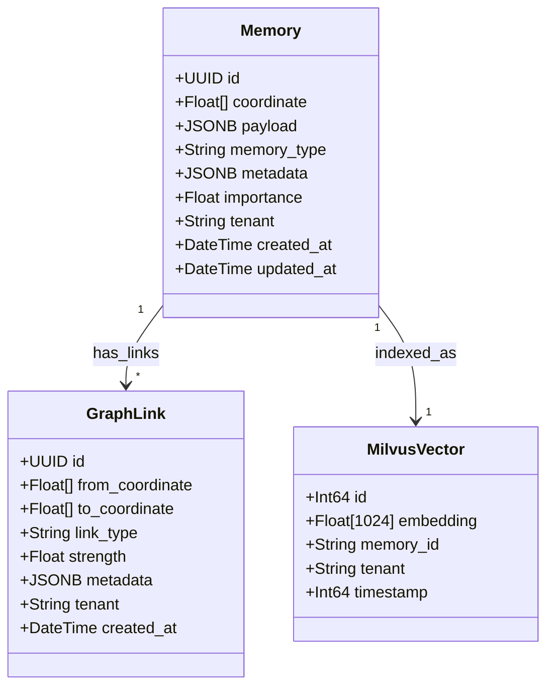
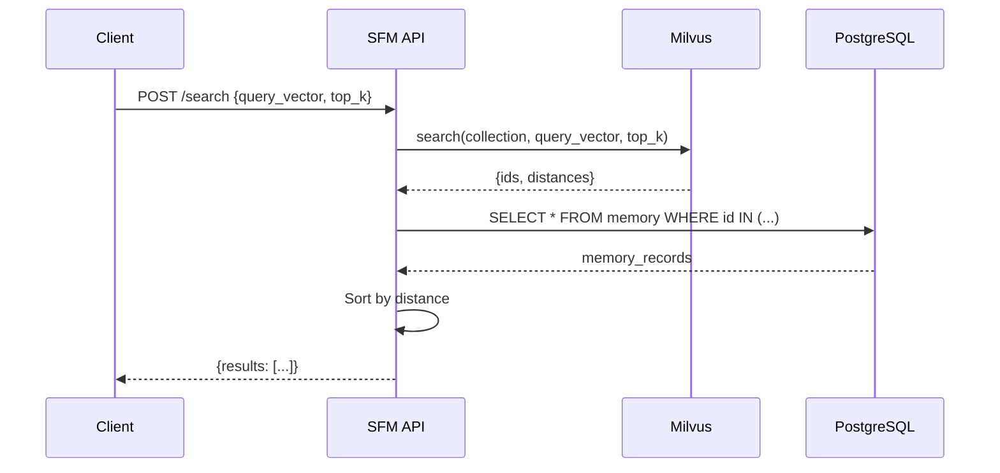

# SRS-10: SomaFractalMemory Complete Specification

**Document Version:** 1.0.0  
**Date:** 2025-12-24  
**Standard:** ISO/IEC/IEEE 29148:2018 Compatible  
**Module:** SomaFractalMemory Long-Term Storage System

---

## 1. Overview

SomaFractalMemory is the **long-term memory storage** service for the SomaBrain platform. It provides coordinate-based memory storage, graph relationships, and vector search.

---

## 2. Data Model UML



---

## 3. Memory Types

| Type | Description | Use Case |
|------|-------------|----------|
| `episodic` | Event-based memories | Conversations, experiences |
| `semantic` | Fact-based memories | Knowledge, concepts |
| `procedural` | Action patterns | Workflows, procedures |

---

## 4. API Endpoints Complete Specification

### 4.1 Memory CRUD

| Endpoint | Method | Request | Response | Permission |
|----------|--------|---------|----------|------------|
| `/memories` | POST | `MemoryCreate` | `Memory` | store |
| `/memories/{coord}` | GET | - | `Memory` | read |
| `/memories/{coord}` | PUT | `MemoryUpdate` | `Memory` | update |
| `/memories/{coord}` | DELETE | - | `204` | delete |
| `/memories` | GET | `?tenant=&type=` | `Memory[]` | list |

### 4.2 Search

| Endpoint | Method | Request | Response | Permission |
|----------|--------|---------|----------|------------|
| `/search` | POST | `SearchRequest` | `SearchResult[]` | search |
| `/search/semantic` | POST | `SemanticQuery` | `Memory[]` | search |

### 4.3 Graph

| Endpoint | Method | Request | Response | Permission |
|----------|--------|---------|----------|------------|
| `/graph/link` | POST | `LinkCreate` | `GraphLink` | link |
| `/graph/link/{id}` | DELETE | - | `204` | unlink |
| `/graph/neighbors` | GET | `?coord=&depth=` | `Coordinate[]` | read |
| `/graph/path` | GET | `?from=&to=` | `Path` | read |

### 4.4 Admin

| Endpoint | Method | Request | Response | Permission |
|----------|--------|---------|----------|------------|
| `/stats` | GET | - | `Statistics` | admin |
| `/healthz` | GET | - | `ok` | public |
| `/health` | GET | - | `HealthDetail` | public |

---

## 5. Request/Response Schemas

### 5.1 MemoryCreate

```json
{
  "coord": "1.0,2.0,3.0",
  "payload": {
    "content": "Memory content here",
    "source": "agent-x"
  },
  "memory_type": "episodic",
  "metadata": {
    "tags": ["important", "work"]
  },
  "importance": 0.75
}
```

### 5.2 SearchRequest

```json
{
  "query_vector": [0.1, 0.2, ...],
  "top_k": 10,
  "memory_type": "episodic",
  "min_importance": 0.5,
  "tenant": "tenant-123"
}
```

### 5.3 LinkCreate

```json
{
  "from_coord": "1.0,2.0,3.0",
  "to_coord": "4.0,5.0,6.0",
  "link_type": "related",
  "strength": 0.8,
  "metadata": {}
}
```

---

## 6. Graph Operations Flowchart

```mermaid
flowchart TD
    subgraph CreateLink["Create Link"]
        A[POST /graph/link] --> B[Validate Coordinates]
        B --> C{Both Exist?}
        C -->|No| D[Return 404]
        C -->|Yes| E[Create GraphLink]
        E --> F[Update Milvus Index]
        F --> G[Return 201]
    end
    
    subgraph FindNeighbors["Find Neighbors"]
        H[GET /graph/neighbors] --> I[Parse Coordinate]
        I --> J[Query GraphLink WHERE from=coord]
        J --> K{Depth > 1?}
        K -->|Yes| L[Recursive Query]
        K -->|No| M[Return Neighbors]
        L --> M
    end
    
    subgraph FindPath["Find Path"]
        N[GET /graph/path] --> O[BFS from from_coord]
        O --> P{Found to_coord?}
        P -->|No| Q[Return 404 No Path]
        P -->|Yes| R[Return Path]
    end
```



---

## 7. Vector Search Flow



---

## 8. Server Settings Catalog

### 8.1 Core Settings

| Setting | Type | Default | Description |
|---------|------|---------|-------------|
| `SOMA_API_PORT` | int | `9595` | API server port |
| `SOMA_API_TOKEN` | str | - | API authentication token |
| `SOMA_LOG_LEVEL` | enum | `INFO` | Log verbosity |
| `SOMA_DEBUG` | bool | `false` | Debug mode |

### 8.2 Database Settings

| Setting | Type | Default | Description |
|---------|------|---------|-------------|
| `POSTGRES_HOST` | str | `postgres` | PostgreSQL host |
| `POSTGRES_PORT` | int | `5432` | PostgreSQL port |
| `POSTGRES_USER` | str | `soma` | Database user |
| `POSTGRES_PASSWORD` | str | - | Database password |
| `POSTGRES_DB` | str | `somamemory` | Database name |

### 8.3 Redis Settings

| Setting | Type | Default | Description |
|---------|------|---------|-------------|
| `REDIS_HOST` | str | `redis` | Redis host |
| `REDIS_PORT` | int | `6379` | Redis port |
| `REDIS_DB` | int | `0` | Redis database |

### 8.4 Milvus Settings

| Setting | Type | Default | Description |
|---------|------|---------|-------------|
| `SOMA_MILVUS_HOST` | str | `milvus` | Milvus host |
| `SOMA_MILVUS_PORT` | int | `19530` | Milvus gRPC port |
| `SOMA_COLLECTION_NAME` | str | `soma_vectors` | Milvus collection |
| `SOMA_INDEX_TYPE` | str | `IVF_FLAT` | Index type |
| `SOMA_METRIC_TYPE` | str | `L2` | Distance metric |

---

## 9. Metrics Catalog

| Metric | Type | Labels | Description |
|--------|------|--------|-------------|
| `sfm_memories_total` | Counter | tenant, type | Total memories stored |
| `sfm_memories_deleted` | Counter | tenant | Memories deleted |
| `sfm_graph_links_total` | Counter | tenant, type | Graph links created |
| `sfm_search_requests` | Counter | tenant | Search requests |
| `sfm_search_latency_seconds` | Histogram | - | Search latency |
| `sfm_store_latency_seconds` | Histogram | - | Store latency |
| `sfm_milvus_index_size` | Gauge | - | Milvus index size |
| `sfm_postgres_rows` | Gauge | table | PostgreSQL row count |

---

## 10. Admin UI Screens for SFM

### 10.1 Memory Browser

```
┌─────────────────────────────────────────────────────────────────┐
│ 📂 Memory Browser                              [Export] [Import]│
├─────────────────────────────────────────────────────────────────┤
│                                                                 │
│  [Search...]  [Type: All ▼]  [Tenant: All ▼]  [Date Range ▼]   │
│                                                                 │
│  ┌───────────────────────────────────────────────────────────┐ │
│  │ Coordinate    │ Type    │ Importance│ Created     │ View │ │
│  ├───────────────────────────────────────────────────────────┤ │
│  │ 1.0,2.0,3.0   │ episode │ 0.85      │ Dec 24 14:30│  👁  │ │
│  │ 4.5,1.2,0.8   │ semantic│ 0.72      │ Dec 24 12:15│  👁  │ │
│  │ 0.1,0.2,0.3   │ episode │ 0.91      │ Dec 23 18:45│  👁  │ │
│  └───────────────────────────────────────────────────────────┘ │
│                                                                 │
│  Page 1 of 452                                 [< 1 2 3 ... >]   │
└─────────────────────────────────────────────────────────────────┘
```

### 10.2 Graph Explorer

```
┌─────────────────────────────────────────────────────────────────┐
│ 🔗 Graph Explorer                                               │
├─────────────────────────────────────────────────────────────────┤
│                                                                 │
│  Start Coordinate: [1.0,2.0,3.0    ]  Depth: [2 ▼]  [Explore]  │
│                                                                 │
│  ┌───────────────────────────────────────────────────────────┐ │
│  │                                                           │ │
│  │           ┌───────┐                                       │ │
│  │     ┌────►│ Node2 │◄────┐                                │ │
│  │     │     └───────┘     │                                │ │
│  │     │                   │                                │ │
│  │ ┌───────┐           ┌───────┐                            │ │
│  │ │ Root  │───────────│ Node3 │                            │ │
│  │ └───────┘           └───────┘                            │ │
│  │     │                   │                                │ │
│  │     │     ┌───────┐     │                                │ │
│  │     └────►│ Node4 │◄────┘                                │ │
│  │           └───────┘                                       │ │
│  │                                                           │ │
│  └───────────────────────────────────────────────────────────┘ │
│                                                                 │
│  Links: 12  │  Nodes: 5  │  Max Depth: 2                        │
└─────────────────────────────────────────────────────────────────┘
```

---

## 11. Functional Requirements

| REQ-ID | Requirement | Priority | Status |
|--------|-------------|----------|--------|
| REQ-SFM-001 | Store memory by coordinate | HIGH | ✅ EXISTS |
| REQ-SFM-002 | Retrieve memory by coordinate | HIGH | ✅ EXISTS |
| REQ-SFM-003 | Delete memory | HIGH | ✅ EXISTS |
| REQ-SFM-004 | Vector similarity search | HIGH | ✅ EXISTS |
| REQ-SFM-005 | Create graph links | HIGH | ✅ EXISTS |
| REQ-SFM-006 | Find neighbors | HIGH | ✅ EXISTS |
| REQ-SFM-007 | Find path between nodes | MEDIUM | ✅ EXISTS |
| REQ-SFM-008 | Multi-tenant isolation | CRITICAL | ✅ EXISTS |
| REQ-SFM-009 | Memory type classification | MEDIUM | ✅ EXISTS |
| REQ-SFM-010 | Importance scoring | MEDIUM | ✅ EXISTS |

---

## 12. Key Files

| File | Purpose | Lines |
|------|---------|-------|
| `somafractalmemory/models.py` | Memory/GraphLink models | 220 |
| `somafractalmemory/services.py` | Business logic | 300+ |
| `somafractalmemory/settings.py` | Django settings | 400+ |
| `somafractalmemory/api/routers/memory.py` | Memory API | ~150 |
| `somafractalmemory/api/routers/graph.py` | Graph API | ~100 |

---

*SomaFractalMemory - Long-Term Storage for AI Agents*
