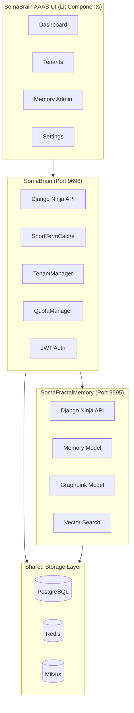
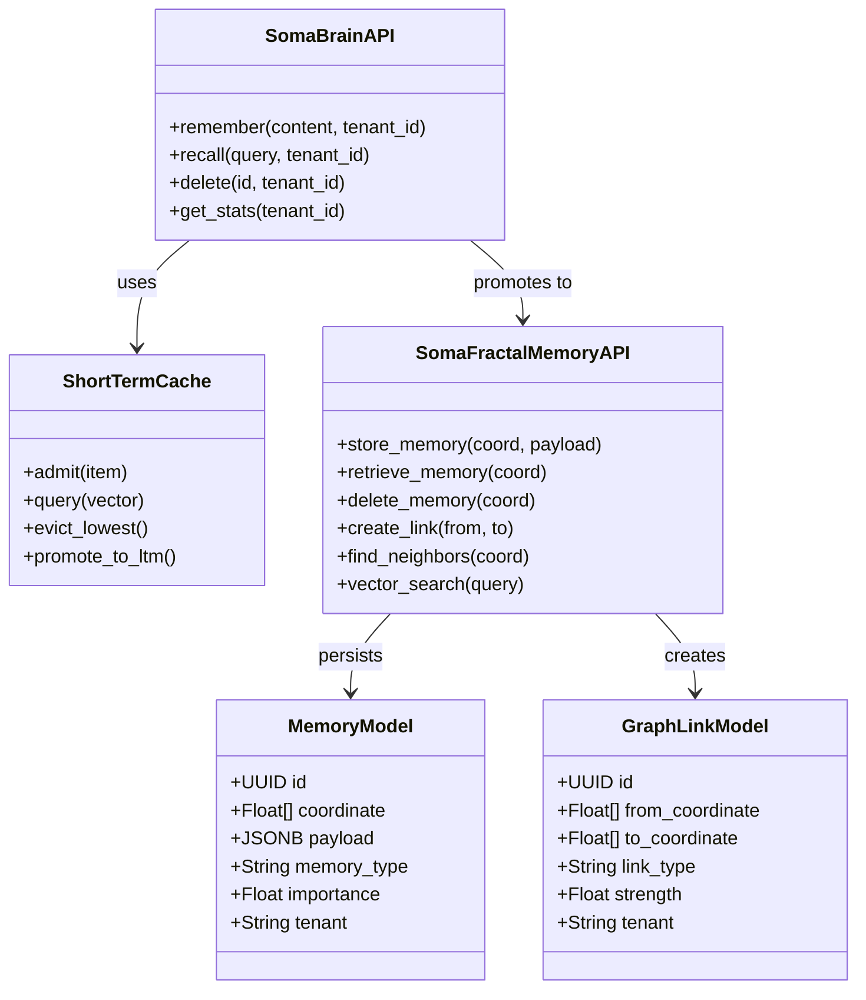
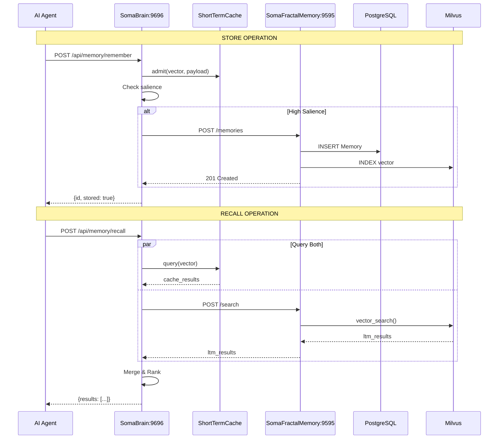
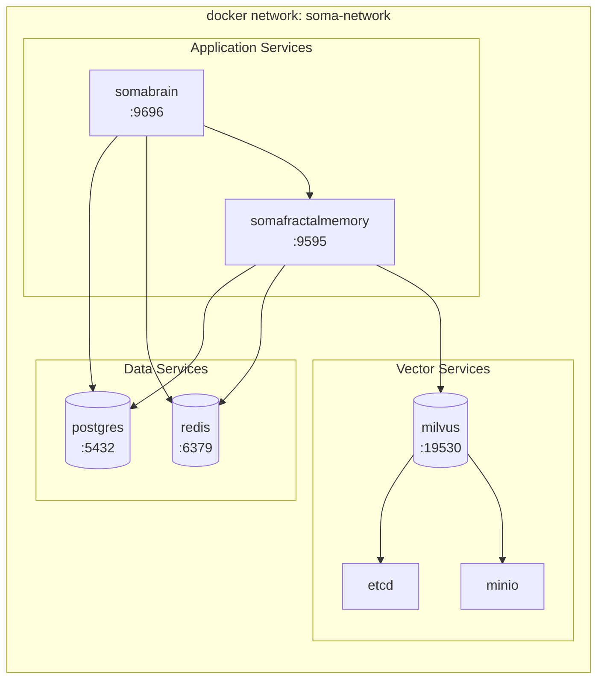
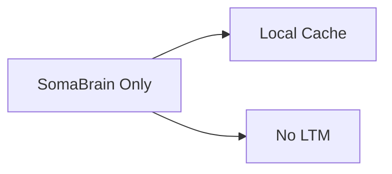
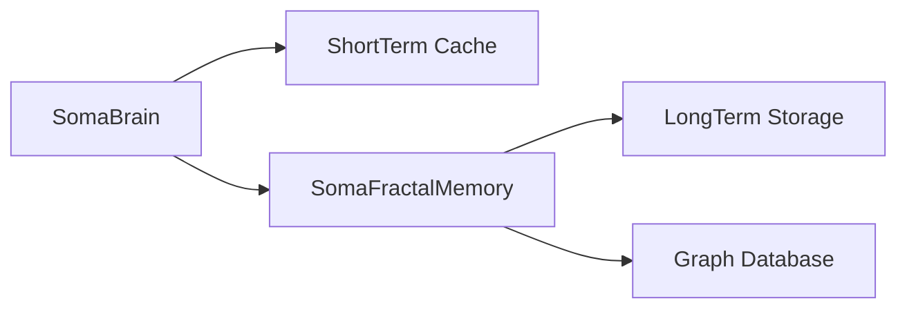
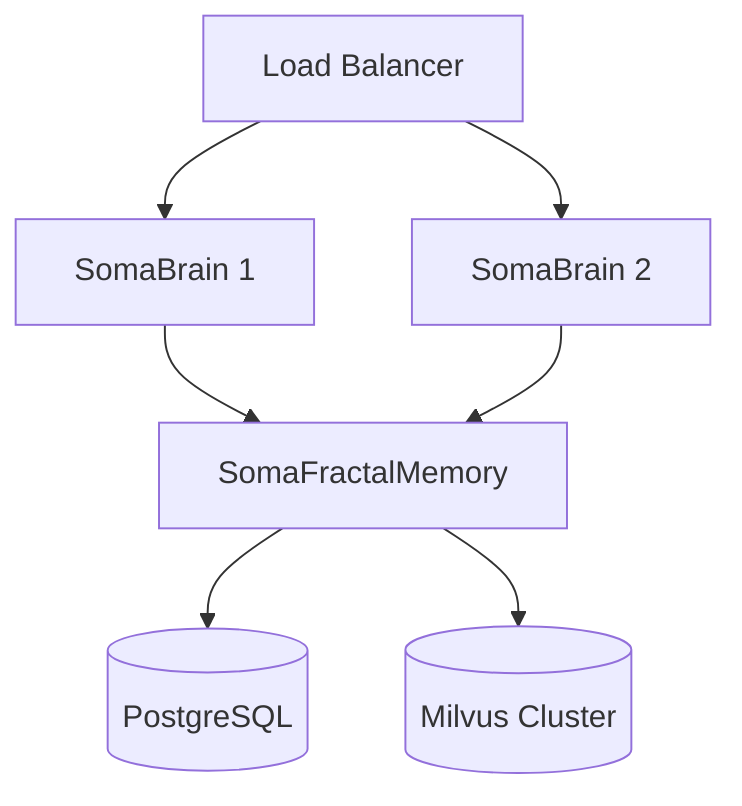

# SRS-09: Unified Memory Platform Architecture

**Document Version:** 1.0.0  
**Date:** 2025-12-24  
**Standard:** ISO/IEC/IEEE 29148:2018 Compatible  
**Module:** Unified SomaBrain + SomaFractalMemory Platform

---

## 1. Overview

The SomaBrain AAAS Platform consists of **two microservices** that work together to provide complete memory management for AI agents:

| Service | Port | Purpose |
|---------|------|---------|
| **SomaBrain** | 9696 | Short-term cache, API gateway, tenant management |
| **SomaFractalMemory** | 9595 | Long-term storage, graph database, vector search |

---

## 2. Unified Architecture Diagram



---

## 3. Service Integration UML



---

## 4. Data Flow Sequence



---

## 5. Docker Compose Architecture



---

## 6. Unified API Endpoints

### 6.1 SomaBrain Endpoints (Port 9696)

| Endpoint | Method | Description |
|----------|--------|-------------|
| `/api/memory/remember` | POST | Store memory (cache + LTM) |
| `/api/memory/recall` | POST | Query from cache + LTM |
| `/api/memory/delete` | DELETE | Delete from both stores |
| `/api/memory/stats` | GET | Unified memory statistics |
| `/api/admin/tenants` | CRUD | Tenant management |
| `/api/admin/settings` | GET/PATCH | Platform settings |

### 6.2 SomaFractalMemory Endpoints (Port 9595)

| Endpoint | Method | Description |
|----------|--------|-------------|
| `/memories` | POST | Store memory by coordinate |
| `/memories/{coord}` | GET | Retrieve by coordinate |
| `/memories/{coord}` | DELETE | Delete by coordinate |
| `/search` | POST | Vector similarity search |
| `/graph/link` | POST | Create graph link |
| `/graph/neighbors` | GET | Get neighbors |
| `/graph/path` | GET | Find path between coords |
| `/stats` | GET | Memory statistics |

---

## 7. Unified Admin UI Screens

### 7.1 Screen Map

| Screen | Route | Source Data |
|--------|-------|-------------|
| Dashboard | `/platform` | SomaBrain + SFM metrics |
| Tenants | `/platform/tenants` | SomaBrain TenantRegistry |
| Memory Overview | `/platform/memory` | SomaBrain + SFM combined |
| Memory Browser | `/platform/memory/browse` | SFM Memory table |
| Graph Explorer | `/platform/memory/graph` | SFM GraphLink |
| Vector Index | `/platform/memory/vectors` | Milvus stats |
| Settings | `/platform/settings` | Both services |

### 7.2 Memory Admin Wireframe

```
┌─────────────────────────────────────────────────────────────────┐
│ 📊 Memory Overview                                              │
├─────────────────────────────────────────────────────────────────┤
│                                                                 │
│  ┌──────────────┐  ┌──────────────┐  ┌──────────────┐          │
│  │ ShortTerm    │  │ LongTerm     │  │ Graph Links  │          │
│  │    127       │  │   45,231     │  │    8,456     │          │
│  │ in cache     │  │ in storage   │  │ connections  │          │
│  └──────────────┘  └──────────────┘  └──────────────┘          │
│                                                                 │
│  ┌───────────────────────────────────────────────────────────┐ │
│  │ TABS: [Overview] [Browse] [Graph] [Vectors] [Config]      │ │
│  ├───────────────────────────────────────────────────────────┤ │
│  │                                                           │ │
│  │  Memory Type Distribution    │   Storage by Tenant       │ │
│  │  [Pie Chart]                 │   [Bar Chart]             │ │
│  │                                                           │ │
│  │  ● Episodic: 65%             │   Acme Corp: 12,456      │ │
│  │  ● Semantic: 35%             │   Beta Inc:  8,921       │ │
│  │                                                           │ │
│  └───────────────────────────────────────────────────────────┘ │
└─────────────────────────────────────────────────────────────────┘
```

---

## 8. Configuration Unification

### 8.1 Shared Settings

| Setting | SomaBrain | SomaFractalMemory | Description |
|---------|-----------|-------------------|-------------|
| `POSTGRES_HOST` | ✓ | ✓ | PostgreSQL host |
| `POSTGRES_PORT` | ✓ | ✓ | PostgreSQL port |
| `REDIS_HOST` | ✓ | ✓ | Redis host |
| `REDIS_PORT` | ✓ | ✓ | Redis port |
| `SOMA_MILVUS_HOST` | ✓ | ✓ | Milvus host |
| `SOMA_MILVUS_PORT` | ✓ | ✓ | Milvus port |

### 8.2 Service-Specific Settings

| Service | Setting | Description |
|---------|---------|-------------|
| SomaBrain | `SOMABRAIN_WM_CAPACITY` | Cache capacity |
| SomaBrain | `SOMABRAIN_SALIENCE_THRESHOLD` | Store threshold |
| SomaFractalMemory | `SOMA_API_PORT` | LTM API port |
| SomaFractalMemory | `SOMA_COLLECTION_NAME` | Milvus collection |

---

## 9. Metrics Consolidation

### 9.1 Combined Metrics Dashboard

| Metric | Source | Description |
|--------|--------|-------------|
| `soma_cache_items` | SomaBrain | ShortTerm cache count |
| `soma_cache_hit_ratio` | SomaBrain | Cache hit rate |
| `soma_ltm_items` | SFM | LongTerm memory count |
| `soma_ltm_store_latency` | SFM | Store latency |
| `soma_graph_links` | SFM | Graph link count |
| `soma_vector_search_latency` | SFM | Vector search latency |
| `soma_milvus_collection_size` | Milvus | Vector index size |

---

## 10. Deployment Scenarios

### 10.1 Standalone Mode



### 10.2 Integrated Mode



### 10.3 Full Production



---

## 11. Key Files Reference

### SomaBrain

| File | Purpose |
|------|---------|
| `somabrain/settings.py` | Django settings |
| `somabrain/wm.py` | ShortTerm cache |
| `somabrain/tenant_manager.py` | Multi-tenancy |
| `somabrain/api/endpoints/` | API routes |

### SomaFractalMemory

| File | Purpose |
|------|---------|
| `somafractalmemory/settings.py` | Django settings |
| `somafractalmemory/models.py` | Memory/GraphLink models |
| `somafractalmemory/services.py` | Business logic |
| `somafractalmemory/api/routers/` | API routes |

---

*Unified Memory Platform - SomaBrain AAAS*
