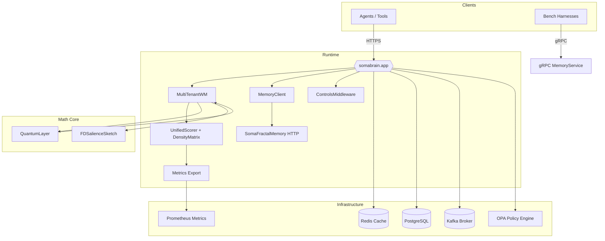

# System Architecture

**Purpose**: This document provides a comprehensive overview of SomaBrain's system design, component interactions, and architectural decisions.

**Audience**: System administrators, SREs, architects, and technical stakeholders.

**Prerequisites**: Understanding of distributed systems, microservices, and containerization concepts.

---

## System Topology

## Core Components

### SomaBrain API (`somabrain.app`)
- **Purpose**: FastAPI service exposing cognitive memory and reasoning endpoints
- **Responsibilities**: 
  - HTTP request handling for `/remember`, `/recall`, `/health`, `/metrics`
  - Authentication and authorization via OPA middleware
  - Request routing to appropriate memory subsystems
  - Metrics emission and audit logging
- **Dependencies**: Redis, Postgres, Kafka (optional), OPA
- **Scaling**: Stateless, horizontal scaling via load balancer

### Memory Client (`somabrain/memory_client.py`)
- **Purpose**: HTTP connector to long-term memory services with strict-mode auditing
- **Responsibilities**:
  - Write mirroring to ensure data consistency
  - Strict-mode enforcement (no stub usage in production)
  - Circuit breaker pattern for resilience
  - Audit trail generation
- **Dependencies**: SomaFractalMemory HTTP service
- **Scaling**: Connection pooling, configurable timeouts

### Working Memory (`somabrain/mt_wm.py`)
- **Purpose**: Multi-tenant in-memory cache for active cognitive state
- **Responsibilities**:
  - Fast recall for recently accessed memories
  - Tenant isolation and resource management
  - Neuromodulator state tracking
  - Cache eviction policies
- **Dependencies**: Redis for persistence
- **Scaling**: Tenant-based sharding, memory limits per tenant

### Quantum Layer (`somabrain/quantum.py`)
- **Purpose**: Binary hyperdimensional computing (BHDC) operations
- **Responsibilities**:
  - Hypervector binding and unbinding
  - Deterministic role generation
  - Mathematical invariant maintenance
- **Dependencies**: None (pure math)
- **Scaling**: CPU-bound, benefits from vectorized operations

## Infrastructure Components

### Redis Cache
- **Purpose**: High-performance cache for working memory and session state
- **Configuration**: 
  - Memory limit: 8GB (configurable)
  - Eviction policy: LRU
  - Persistence: RDB snapshots + AOF
- **Monitoring**: Memory usage, hit/miss ratio, connection count
- **Backup**: Daily RDB snapshots to object storage

### PostgreSQL Database
- **Purpose**: Persistent storage for configuration, audit logs, and metadata
- **Schema**: 
  - Configuration tables (tenants, policies, settings)
  - Audit log tables (operations, events, metrics)
  - Memory metadata (embeddings, relationships)
- **Monitoring**: Connection pool, query performance, disk usage
- **Backup**: Daily `pg_dump` with point-in-time recovery

### Kafka Message Broker
- **Purpose**: Event streaming for audit trails and system integration
- **Topics**:
  - `audit.operations`: Memory operations audit trail
  - `audit.events`: System events and state changes
  - `metrics.streams`: Real-time metrics publishing
- **Configuration**: 3 brokers, replication factor 3, retention 7 days
- **Monitoring**: Topic lag, broker health, partition distribution

### OPA Policy Engine
- **Purpose**: Centralized authorization and policy enforcement
- **Policies**:
  - Tenant access control
  - Rate limiting rules
  - Data classification policies
- **Integration**: Middleware in SomaBrain API request pipeline
- **Monitoring**: Policy evaluation latency, decision audit logs

## Data Flow Patterns

### Memory Storage Flow
1. Client sends `/remember` request with content and metadata
2. OPA middleware validates tenant permissions and rate limits
3. Content processed through QuantumLayer for hypervector encoding
4. MemoryClient writes to both working memory (Redis) and long-term storage
5. DensityMatrix updated with new memory relationships
6. Audit event published to Kafka
7. Metrics emitted to Prometheus
8. Success response returned to client

### Memory Recall Flow
1. Client sends `/recall` request with query and context
2. OPA middleware validates access permissions
3. MultiTenantWM checked for cached results
4. If miss, MemoryClient queries long-term storage
5. UnifiedScorer ranks results using cosine similarity, FD projection, and recency
6. Results filtered and formatted for response
7. Working memory updated with recalled items
8. Metrics and audit events recorded

### Health Check Flow
1. `/health` endpoint receives request
2. Validates Redis connectivity and response time
3. Checks Postgres connection and query execution
4. Verifies Kafka broker availability (if configured)
5. Tests OPA policy engine responsiveness
6. Aggregates component health into overall status
7. Returns 200 OK if all components healthy, 503 if degraded

## Scaling Considerations

### Horizontal Scaling
- **API Layer**: Multiple SomaBrain API instances behind load balancer
- **Working Memory**: Tenant-based sharding across Redis instances
- **Long-term Storage**: Partitioned by tenant or semantic bucket
- **Message Processing**: Kafka consumer groups for parallel processing

### Performance Optimization
- **Connection Pooling**: HTTP and database connection reuse
- **Caching Strategy**: Multi-tier caching (working memory → Redis → storage)
- **Batch Operations**: Bulk memory operations where possible
- **Asynchronous Processing**: Non-blocking I/O for concurrent requests

### Resource Management
- **Memory Limits**: Per-tenant working memory quotas
- **CPU Allocation**: Quantum operations benefit from CPU affinity
- **Storage Tiering**: Hot data in Redis, warm in Postgres, cold in object storage
- **Network Optimization**: Keep-alive connections, compression for bulk transfers

## Security Architecture

### Authentication & Authorization
- **JWT Tokens**: Stateless authentication with configurable expiration
- **OPA Policies**: Fine-grained authorization rules
- **Tenant Isolation**: Strict separation of memory spaces
- **Audit Logging**: All operations recorded with user context

### Data Protection
- **Encryption in Transit**: TLS 1.2+ for all HTTP communications
- **Encryption at Rest**: Database and Redis encryption enabled
- **Secret Management**: External secret store integration
- **Data Classification**: Sensitive data handling policies

### Network Security
- **Service Mesh**: Optional Istio deployment for mTLS
- **Firewall Rules**: Restrictive ingress/egress policies
- **Private Networks**: Internal services on isolated subnets
- **Rate Limiting**: Per-tenant and global rate limits

## Monitoring & Observability

### Metrics Collection
- **Application Metrics**: Request latency, memory operations, error rates
- **Infrastructure Metrics**: CPU, memory, disk, network utilization
- **Business Metrics**: Tenant usage, cognitive performance measures
- **Mathematical Invariants**: Density matrix trace, BHDC binding accuracy

### Logging Strategy
- **Structured Logging**: JSON format with correlation IDs
- **Log Levels**: Debug, info, warn, error with appropriate filtering
- **Audit Trail**: Immutable operation logs for compliance
- **Performance Logging**: Slow query identification and optimization

### Alerting Rules
- **Critical Alerts**: Service outages, data inconsistency, security violations
- **Warning Alerts**: Performance degradation, resource utilization thresholds
- **Informational**: Deployment notifications, configuration changes

---

**Verification**: System health can be validated via `/health` endpoint and Prometheus metrics dashboard.

**Common Errors**: 
- Redis connection failures → Check network connectivity and Redis service status
- OPA policy evaluation timeouts → Review policy complexity and OPA resource allocation
- Memory storage inconsistencies → Validate write mirroring configuration

**References**:
- [Deployment Guide](deployment.md) for installation procedures
- [Monitoring Setup](monitoring.md) for observability configuration
- [Runbooks](runbooks/) for operational procedures