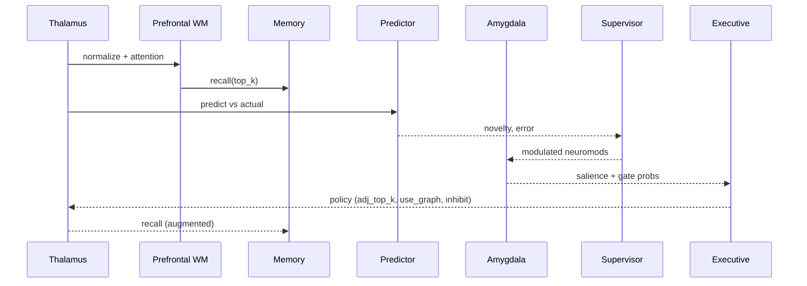

# Executive Controller (Meta-Brain)

Purpose
- Coordinate attention, inhibition, planning bias, and monitoring across modules.
- Provide smooth, probabilistic control (soft salience) and minimize a free-energy proxy.

Inputs
- Salience S (novelty and prediction error), recall strength, neuromodulators (DA, ACh, NE, 5‑HT).
- Graph context (typed relations), HRR context (optional), configuration flags.

Outputs
- Attention policy: adjusted `top_k`, enable graph augmentation.
- Inhibition: suppress store/act under high conflict.
- Triggers (future): reflection/consolidation, strategy switch between episodic/semantic/resonance.

Soft Salience
- Gate probabilities: `p = σ((S − τ)/T)` with temperature `T` configurable.
- Backward compatible; use hard thresholds when disabled.

Free-Energy Proxy
- `F ≈ α·prediction_error + β·novelty` (bounded [0,1]).
- Supervisor modulates neuromodulators within a small budget to lower F.

Executive Policy (v1)
- Conflict proxy: `C = 1 − mean(recall_strength_window)`.
- If `C ≥ conflict_threshold`: enable graph augmentation and increase `top_k` by `explore_boost_k`.
- If `C ≥ 0.9`: inhibit act/store to avoid compounding errors.

Mermaid — Decision Cycle

Flags
- `use_soft_salience`, `soft_salience_temperature`
- `use_meta_brain`, `meta_gain`, `meta_limit`
- `use_exec_controller`, `exec_window`, `exec_conflict_threshold`, `exec_explore_boost_k`

Metrics
- `somabrain_free_energy`, `somabrain_supervisor_modulation`
- `somabrain_exec_conflict`, `somabrain_exec_use_graph_total`

